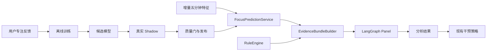

# MindFlow 后端全链路研究文档与 ML 接入方案

> **版本**: v1.0

> **2026-07-31 实施更新**: 特征 schema 已升级到 v3；切换计数统一使用 `count_confirmed_switches()`；ML 质量门改为唯一反馈会话统计并在日期折内计算基线；`PanelGraph` 为唯一活动面板图，`PanelOrchestrator` 保留为兼容适配器；`POST /panel/today` 支持降级重试；实验与报告见 `data/experiments/20260731_final/`。

> **日期**: 2026-07-26  
> **范围**: 后端 `backend-next/` 全链路，涵盖数据采集、特征工程、ML 训练、LangGraph 面板、API 服务、反馈闭环  
> **状态**: 研究完成 | 待实施  
> **面向读者**: 后端开发者、项目评审者

---

## 目录

1. [数据采集、合并、落库与定时任务](#1-数据采集合并落库与定时任务)
2. [原始表、派生表与五分钟特征窗口](#2-原始表派生表与五分钟特征窗口)
3. [v1/v2 训练数据、标签、模型与质量门](#3-v1v2-训练数据标签模型与质量门)
4. [LangGraph State、节点、条件边与降级链](#4-langgraph-state节点条件边与降级链)
5. [Panel、Chat、干预与反馈闭环](#5-panelchat干预与反馈闭环)
6. [当前真实接线与运行状态](#6-当前真实接线与运行状态)
7. [已闭环、半闭环与未接通部分](#7-已闭环半闭环与未接通部分)
8. [ML 正式接入目标架构与分阶段实施方案](#8-ml-正式接入目标架构与分阶段实施方案)

---

## 1. 数据采集、合并、落库与定时任务

### 1.1 三层数据采集体系

MindFlow 有三条独立的采集链路，各自产生不同类型的事件：

```
┌─────────────────────────────────────────────────────────────────────┐
│                        三层采集链路                                  │
│                                                                     │
│  ┌──────────────────┐  ┌──────────────────┐  ┌──────────────────┐  │
│  │  窗口活动采集器   │  │  键鼠输入采集器   │  │  浏览器心跳插件   │  │
│  │  CollectorService │  │InputTelemetrySvc  │  │  Browser Plugin  │  │
│  │                  │  │                  │  │                  │  │
│  │ 每 5 秒采样一次   │  │ 每 30 秒聚合一次  │  │ 每 ~10 秒上报    │  │
│  │ 当前活动窗口信息  │  │ 键鼠操作统计      │  │ 活跃域名+时长    │  │
│  └────────┬─────────┘  └────────┬─────────┘  └────────┬─────────┘  │
│           │                     │                     │            │
│           ▼                     ▼                     ▼            │
│  ┌──────────────────┐  ┌──────────────────┐  ┌──────────────────┐  │
│  │  activity_events  │  │interaction_buckets│ │ browser_segments │  │
│  │  (原始事件流)     │  │  (30s 键鼠桶)    │  │  (浏览器段)      │  │
│  └──────────────────┘  └──────────────────┘  └──────────────────┘  │
└─────────────────────────────────────────────────────────────────────┘
```

#### 链路 A：窗口活动采集器
- **文件**: `services/collector_service.py` + `infrastructure/collectors/win32.py`
- **机制**: 每 5 秒通过 `win32gui.GetForegroundWindow()` 获取前台窗口
- **采集字段**: 进程名（`process_name`）、窗口标题（`window_title`）、窗口类（`window_class`）、空闲状态
- **空闲检测**: `GetLastInputInfo()` 检测物理输入，超过 `idle_threshold`（默认 60s）标记为 `is_idle=1`
- **写入**: 直接通过 `ActivityRepository` 写入 `activity_events` 表
- **状态**: 通过 APScheduler 后台调度，API 控制启停（`POST /collector/start|stop`）

#### 链路 B：键鼠输入采集器
- **文件**: `services/input_telemetry_service.py` + `infrastructure/collectors/input_watcher.py`
- **机制**: 独立 `multiprocessing.Process`，使用 Win32 API 低级别钩子（`SetWindowsHookEx`）
- **聚合**: 每 30 秒聚合一次，产生一个 `interaction_bucket`
- **采集字段**: 按键数、鼠标点击数、滚动量、鼠标移动距离、活动时长、交互爆发数
- **写入**: 通过 `TelemetryRepository.save_interaction_bucket()` 写入 `interaction_buckets` 表
- **状态**: 默认关闭，需用户启用 `input_telemetry_enabled` 配置

#### 链路 C：浏览器心跳插件
- **入口**: `POST /telemetry/browser/heartbeat`（认证通过 `X-Browser-Token`）
- **机制**: 浏览器扩展通过配对流程（`/telemetry/browser/pair`）获得令牌后，每 ~10 秒上报当前活跃标签
- **采集字段**: 浏览器名、域名、是否播放音频、是否隐身模式
- **写入**: 通过 `TelemetryRepository` 写入 `browser_segments` 表
- **状态**: 默认关闭，需用户启用 `browser_tracking_enabled` 配置

### 1.2 定时任务（Scheduler）

调度器在应用启动时通过 `settings.run_scheduler` 控制，使用 APScheduler 注册以下任务：

| 任务 | 周期 | 文件 | 职责 |
|------|------|------|------|
| 日报分析 | 每日 02:00 | `scheduler.py` → `AnalysisService.identify_focus_sessions()` | 识别昨日专注会话 |
| 数据清理 | 每日 03:00 | `scheduler.py` → `TelemetryService.cleanup_retained_data()` | 按保留策略清理过期事件 |
| 自动干预 | 每 5 分钟 | `scheduler.py` → `InterventionService.maybe_intervene()` | 检查并触发干预 |
| 特征窗口聚合 | 未接入定时任务 | `TelemetryService.rollup_feature_windows()` | **当前手动/脚本调用** |

**注意**: 五分钟特征窗口的增量 rollup **尚未接入定时任务调度器**——这是阶段 3 的第一个实施项。

---

## 2. 原始表、派生表与五分钟特征窗口

### 2.1 数据库全景（截至 2026-07-26）

所有表迁移文件位于 `backend-next/alembic/versions/`：

```
0001_create_core_tables.py    — 7 核心表
0002_add_panel_transcript.py  — procrastination_analyses 增加 panel_transcript 列
0003_create_chat_messages.py  — chat_messages 表
0004_add_intervention_logs_index.py
0005_add_intervention_feedback.py
0006_create_app_classification_rules.py
0007_create_telemetry_tables.py — 5 遥测表 (interaction_buckets, browser_segments,
                                  focus_session_feedback, browser_tokens, behavior_feature_windows)
0008_optimize_activity_telemetry.py
0009_create_scheduled_job_runs.py
0010_add_scheduled_job_heartbeat.py
```

### 2.2 原始表（Append-mostly，数据源）

#### `activity_events` — 窗口活动事件流
```sql
CREATE TABLE activity_events (
    id            TEXT PRIMARY KEY,       -- UUIDv7
    user_id       INTEGER NOT NULL,
    timestamp     TEXT NOT NULL,          -- ISO8601 UTC
    duration_s    REAL DEFAULT 0.0,
    data_json     TEXT NOT NULL,          -- {process_name, window_title, is_idle, ...}
    event_type    TEXT DEFAULT 'window_snapshot',
    created_at    TEXT DEFAULT (strftime(...))
);
CREATE INDEX idx_events_user_time ON activity_events(user_id, timestamp);
```

#### `interaction_buckets` — 键鼠交互桶（30 秒聚合）
```sql
CREATE TABLE interaction_buckets (
    id                    TEXT PRIMARY KEY,
    user_id               INTEGER NOT NULL,
    window_start_utc      TEXT NOT NULL,  -- ISO8601 UTC
    duration_s            REAL NOT NULL,
    context_key           TEXT NOT NULL,  -- sha256(process_name\0window_title)[:16]
    keypress_count        INTEGER NOT NULL,
    mouse_click_count     INTEGER NOT NULL,
    scroll_delta          INTEGER NOT NULL,
    mouse_distance_px     REAL NOT NULL,
    input_active_s        REAL NOT NULL,
    interaction_burst_count INTEGER NOT NULL,
    created_at            TEXT NOT NULL
);
```

#### `browser_segments` — 浏览器域名段
```sql
CREATE TABLE browser_segments (
    id          TEXT PRIMARY KEY,
    user_id     INTEGER NOT NULL,
    timestamp   TEXT NOT NULL,
    duration_s  REAL NOT NULL,
    browser_name TEXT NOT NULL,
    domain      TEXT NOT NULL,
    audible     BOOLEAN NOT NULL,
    context_key TEXT NOT NULL,  -- "browser_name:domain"
    created_at  TEXT NOT NULL
);
```

### 2.3 派生表（Server-computed，分析产出）

#### `focus_sessions` — 专注会话
```sql
CREATE TABLE focus_sessions (
    id            TEXT PRIMARY KEY,
    user_id       INTEGER NOT NULL,
    date          TEXT NOT NULL,
    start_time    TEXT NOT NULL,
    end_time      TEXT NOT NULL,
    session_type  TEXT NOT NULL,     -- 'focus' | 'distraction' | 'neutral'
    dominant_app  TEXT,
    focus_score   REAL,
    switch_count  INTEGER,
    created_at    TEXT DEFAULT (strftime(...))
);
CREATE INDEX idx_sessions_user_date ON focus_sessions(user_id, date);
```

#### `procrastination_analyses` — LLM 归因分析结果
```sql
CREATE TABLE procrastination_analyses (
    id            TEXT PRIMARY KEY,
    user_id       INTEGER NOT NULL,
    date          TEXT NOT NULL,
    procrastination_types_json  TEXT,   -- ["task_aversion", ...]
    type_confidence_json        TEXT,   -- {"task_aversion": 0.85, ...}
    cognitive_distortions_json  TEXT,
    cbt_technique               TEXT,
    response_text               TEXT,
    llm_model                   TEXT,   -- "panel" | "single_expert" | "ollama" | "rule_engine"
    panel_transcript            TEXT,   -- 0002 扩展：JSON 转录
    created_at                  TEXT DEFAULT (strftime(...)),
    UNIQUE(user_id, date)
);
```

#### `intervention_logs` — 干预记录
```sql
CREATE TABLE intervention_logs (
    id                  TEXT PRIMARY KEY,
    user_id             INTEGER NOT NULL,
    triggered_at        TEXT NOT NULL,
    intervention_type   TEXT NOT NULL,   -- 'nudge' | 'task_breakdown' | etc.
    cbt_technique       TEXT,
    context_json        TEXT,            -- {procrastination_types, confidence, intensity, ...}
    user_response       TEXT,            -- 'accepted' | 'ignored' | 'dismissed'
    response_latency_s  REAL,
    created_at          TEXT DEFAULT (strftime(...))
);
```

### 2.4 结论表（ML 训练直接使用）

#### `behavior_feature_windows` — 五分钟特征窗口
```sql
CREATE TABLE behavior_feature_windows (
    id                      TEXT PRIMARY KEY,
    user_id                 INTEGER NOT NULL,
    window_start_utc        TEXT NOT NULL,
    window_end_utc          TEXT NOT NULL,
    feature_schema_version  INTEGER NOT NULL,   -- 2 (当前唯一活跃版本)
    features_json           TEXT NOT NULL,       -- 24 维特征 JSON
    label                   TEXT,                -- 未来：ML 预测标签
    created_at              TEXT NOT NULL,
    UNIQUE(user_id, window_start_utc, feature_schema_version)
);
```

#### `focus_session_feedback` — 用户专注反馈
```sql
CREATE TABLE focus_session_feedback (
    id          TEXT PRIMARY KEY,
    user_id     INTEGER NOT NULL,
    session_id  TEXT NOT NULL,       -- 关联 focus_sessions.id
    label       TEXT NOT NULL,       -- 'focus' | 'distracted' | 'mixed'
    score       INTEGER NOT NULL,    -- 1-5
    task_type   TEXT,                -- 'coding' | 'writing' | 'study' | etc.
    created_at  TEXT NOT NULL,
    UNIQUE(user_id, session_id)
);
```

**关键设计说明**: 当前 `focus_session_feedback` 仅通过 `session_id` 外键关联 `focus_sessions`，但 `focus_sessions` 是**可重建的派生表**（通过 `AnalysisService.identify_focus_sessions()` 重新计算）。这意味着 `focus_sessions.id` 可能在重建后改变，导致反馈失联——这是阶段 1 需要修复的关键问题。

### 2.5 五分钟特征窗口的构建流程

`TelemetryService.rollup_feature_windows()`（`services/telemetry_service.py:209-325`）是 v2 特征窗口的构建引擎。流程如下：

```
rollup_feature_windows(start, end)
    │
    ├── 1. 从 activity_events 查询该时间范围的原始事件
    │     （含前一个窗口的最后一个事件，用于跨窗连续性）
    │
    ├── 2. 从 interaction_buckets 查询键鼠数据（30s 聚合桶）
    │
    ├── 3. 从 browser_segments 查询浏览器数据
    │     （含前一个窗口的最后一个段，用于跨窗连续性）
    │
    ├── 4. 按 5 分钟步长滑动窗口，每个完整窗口：
    │     ├── 收集事件（滑动窗口保持）
    │     ├── 收集键鼠桶
    │     ├── 收集浏览器段
    │     └── call build_v2_feature_window(events, buckets, browser, start, end)
    │          （services/telemetry_features.py: 聚合 → 24 维特征向量）
    │
    └── 5. UPSERT 到 behavior_feature_windows 表
          （通过 TelemetryRepository.upsert_feature_windows()）
```

#### 24 维特征明细（v2 schema）

文件: `train/v2.py` 中的 `V2_FEATURE_NAMES`

| # | 特征名 | 来源 | 描述 |
|---|--------|------|------|
| 1 | `app_switch_count` | 活动事件 | 窗口内应用切换次数 |
| 2 | `domain_switch_count` | 活动事件 | 窗口内域名切换次数 |
| 3 | `longest_segment_ratio` | 活动事件 | 最长连续使用占比 |
| 4 | `idle_ratio` | 活动事件 | 空闲时间占比 |
| 5 | `keypress_rate_per_min` | 键鼠桶 | 每分钟按键数 |
| 6 | `mouse_click_rate_per_min` | 键鼠桶 | 每分钟鼠标点击数 |
| 7 | `scroll_rate_per_min` | 键鼠桶 | 每分钟滚动量 |
| 8 | `mouse_distance_per_min` | 键鼠桶 | 每分钟鼠标移动距离(px) |
| 9 | `input_active_ratio` | 键鼠桶 | 输入活动时间占比 |
| 10 | `interaction_bursts_per_min` | 键鼠桶 | 每分钟交互爆发次数 |
| 11 | `click_key_ratio` | 键鼠桶 | 点击/按键比 |
| 12 | `browser_ratio` | 浏览器段 | 浏览器使用时间占比 |
| 13 | `audible_browser_ratio` | 浏览器段 | 有声浏览器时间占比 |
| 14 | `active_seconds_ratio` | 活动事件 | 活跃秒数占比 |
| 15 | `top_app_ratio` | 活动事件 | 最常用应用使用时间占比 |
| 16 | `top_domain_ratio` | 浏览器段 | 最常用域名使用时间占比 |
| 17 | `interaction_interval_mean_s` | 键鼠桶 | 交互间隔均值(秒) |
| 18 | `interaction_interval_std_s` | 键鼠桶 | 交互间隔标准差(秒) |
| 19 | `interaction_interval_cv` | 键鼠桶 | 交互间隔变异系数 |
| 20 | `hour_sin` | 时间 | 小时正弦编码 |
| 21 | `hour_cos` | 时间 | 小时余弦编码 |
| 22 | `weekday_sin` | 时间 | 星期正弦编码 |
| 23 | `weekday_cos` | 时间 | 星期余弦编码 |
| 24 | `task_type_code` | 用户反馈 | 任务类型数值编码 |

**隐私设计**: v2 特征窗口不保存任何进程名、窗口标题或 URL——仅保存聚合指标。这是与旧版 v1（保存原始窗口标题）的关键区别。

---

## 3. V2 训练数据、标签、模型与质量门

### 3.1 两种 V2 数据来源

```
                   训练 CLI (python -m mindflow.train)
                               │
                ┌──────────────┴──────────────┐
                ▼                             ▼
 --source synthetic_v2                 --source db
 generate_v2_synthetic_data()          load_database_v2_data()
 (画像生成 5min/24维窗口+反馈)          (读取窗口+显式反馈)
                └──────────────┬──────────────┘
                               ▼
                    prepare_v2_training_data()
                               ▼
                    evaluate_v2_candidates()
                               ▼
                    evaluate_v2_quality_gate()
                               ▼
                    ModelManager.save_all()
              (data/models/v2 下的签名模型与报告)
```

V1 原始事件合成、17 维 `BehaviorFeatureExtractor` 与六信号
`ConsensusLabeler` 已删除。合成与真实数据现在都进入同一条 V2 管线。

- **窗口大小**: 5 分钟（整五分钟对齐）
- **特征数**: 24 维（`V2_FEATURE_NAMES` in `train/v2.py`）
- **标签**: 显式用户反馈（权重 1.0）+ 弱规则回退（权重 0.25）
- **用途**: 唯一训练与在线 ML 协议
- **状态**: 已实现训练、质量门、签名持久化与在线推理

### 3.2 标签生成细节（v2）

`prepare_v2_training_data()`（`train/v2.py:75-161`）将 `behavior_feature_windows` 和 `focus_session_feedback` 合并：

```
对于每个特征窗口:
  ├── 查找与窗口时间重叠的用户反馈（按最大重叠度选择）
  │
  ├── 有反馈且 label=mixed → 跳过（不用于训练）
  ├── 有反馈且 score >= 4 → label=1(focus), weight=1.0, source=explicit
  ├── 有反馈且 score <= 2 → label=0(distract), weight=1.0, source=explicit
  │
  └── 无反馈 → _weak_label(row)：
       score = 0.45 + 0.25*longest_ratio + 0.2*top_app_ratio
                    - 0.55*idle_ratio - 0.2*switch_penalty
       label = int(score >= 0.5), weight=0.25, source=weak
```

### 3.3 模型类型

| 模型 | 算法 | 文件 | 备注 |
|------|------|------|------|
| **FocusClassifier** | RandomForest (100 trees, max_depth=10) + StandardScaler | `train/models/classifier.py` | 基础分类器 |
| **EnsembleClassifier** | RF(100) + XGBoost(100 rounds, max_depth=6, lr=0.1) + soft voting | `train/models/ensemble.py` | xgboost 可选 |
| **BehaviorClustering** | DBSCAN (eps=√n×0.5) / KMeans | `train/models/clustering.py` | 行为聚类 |
| **BehaviorHMM** | CategoricalHMM (5 states, hmmlearn) | `train/models/hmm.py` | 状态转移 |

**集成分类器选择**: `ModelManager` 默认尝试 `EnsembleClassifier`，若 xgboost 未安装则无声降级为 `FocusClassifier`。

### 3.4 v2 质量门（`evaluate_v2_quality_gate`）

这是最严格也最关键的检查——决定一个模型能否从 "shadow" 提升到 "ready"：

```
1. minimum_days:               distinct_feedback_days >= 7
2. minimum_explicit_feedback:  explicit_feedback_count >= 20
3. minimum_class_feedback:     explicit_focus_count >= 5 && explicit_distract_count >= 5
4. balanced_accuracy:          candidate >= 0.55
5. minority_f1:                candidate >= 0.40
6. calibration_better_than_rule: candidate_brier <= rule_brier + 0.01
7. stable_date_folds:          fold_stability.passed
```

**评估机制**: 使用 `GroupKFold` 按**日期**分组（防止同日数据泄漏）。每个 fold:
1. 用该日期 fold 的显式标签 + 弱标签训练（权重 1.0/0.25）
2. 仅在留出日期的显式标签上评分
3. 同时比较 RF 候选 vs Logistic 基线 vs 规则基线

**当前状态**: 截至 2026-07-26，由于缺少足够的真实用户反馈数据，尚无模型通过 v2 质量门。

### 3.5 模型版本管理与持久化

目录结构:
```
{models_dir}/v2/
  ├── latest.json                    # {"clustering": "clustering-20260717.pkl", ...}
  ├── model_signing.key              # 32-byte HMAC-SHA256 key (chmod 0600)
  ├── clustering-{YYYYMMDD}.pkl      # 序列化模型
  ├── clustering-{YYYYMMDD}.pkl.hmac # HMAC 签名
  ├── classifier-{YYYYMMDD}.pkl
  ├── classifier-{YYYYMMDD}.pkl.hmac
  ├── hmm-{YYYYMMDD}.pkl
  └── hmm-{YYYYMMDD}.pkl.hmac
```

`manifest.json` 记录特征 schema、反馈计数、质量门、评估和数据来源。
`latest.json` 仅在全部质量门通过时更新；未通过的制品保留为 shadow。

---

## 4. LangGraph State、节点、条件边与降级链

### 4.1 PanelOrchestrator—LangGraph StateGraph 全景

文件: `agents/orchestrator.py:PanelOrchestrator`

```
                    entry_point: "analyst"
                          │
                          ▼
                    ┌──────────┐
                    │ analyst  │  (1 LLM call, Round 0)
                    └────┬─────┘
                         │
                         ▼
                    ┌─────────────┐
                    │ attribution │  (3 LLM calls in parallel, Round 1)
                    └──────┬──────┘        CBT + TMT + EMOTION 专家
                           │
                           ▼
                    ┌──────────────────┐
                    │conflict_detection│  (0 LLM calls, pure function)
                    └────────┬─────────┘
                             │
                    should_escalate()
                    ├── False ────────────┐
                    │                     ▼
                    │              ┌───────────┐
                    │              │ moderator │  (1 LLM call, Round 2b/3)
                    │              └─────┬─────┘
                    │                    │     "deepseek-reasoner"
                    │                    ▼
                    │              ┌───────────┐
                    │              │  critic   │  (1 LLM call, Round 3/4/5)
                    │              └─────┬─────┘
                    │                    │
                    │         critic_verdict()
                    │         ├── approved → END
                    │         ├── rejected_retry (critic_retries < 2) → moderator (redo)
                    │         └── rejected_exhausted (critic_retries >= 2) → END → PanelUnavailableError
                    │
                    └── True ────────────┐
                                         ▼
                                  ┌───────────┐
                                  │ rebuttal  │  (3 LLM calls in parallel, Round 2a)
                                  └─────┬─────┘
                                        │
                                        ▼
                                   moderator (同上)
```

### 4.2 PanelState（TypedDict）

```python
class PanelState(TypedDict):
    bundle_json: str                  # EvidenceBundle 的紧凑 JSON
    valid_metrics: frozenset[str]     # 证据指标名的 frozenset（O(1) 批评家查询）
    analyst_opinion: ExpertOpinion | None
    attribution_opinions: list[ExpertOpinion]
    conflict_report: ConflictReport | None
    escalated: bool
    moderator_verdict: dict[str, Any] | None  # 原始 JSON（尚未解析为 PanelVerdict）
    critic_result: CriticResult | None
    critic_retries: int
    call_count: int
    transcript: list[TranscriptEntry]
    disagreement_summary: DisagreementSummary | None
    rebuttal_delta: object | None
    runtime: _PanelRunContext          # per-call: call_count + transcript + budget_lock
```

### 4.3 节点详解

#### analyst_node（数据分析师）
- **LLM 调用**: 1
- **模型**: `deepseek-chat`（JSON 模式）
- **输出**: 非标准 JSON shape（`patterns`、`anomalies`、`top_concerns`）
- **自定义解析**: `_parse_analyst_opinion()` 将 patterns/anomalies 映射为统一 `ExpertOpinion`

#### attribution_node（归因专家 ×3）
- **LLM 调用**: 3（`asyncio.gather` 全并行）
- **专家**: CBT 归因、TMT 归因（时间动机理论）、情绪调节归因
- **安全**: 至少 2 个非跳过意见 → `PanelUnavailableError`
- **防幻觉**: `_parse_expert_opinion()` 在解析时执行 `validate_citations()`——发现幻觉指标引用 → 跳过

#### conflict_detection_node（冲突检测）
- **LLM 调用**: 0（纯函数）
- **冲突标准**: (1) 顶级类型不匹配 (2) 同一类型置信度差距 > 0.3
- **分歧分析**: `analyze_disagreement()` 输出 4 维：
  - 协议强度（类型重叠 40% + 证据重叠 30% + 置信度重叠 30%）
  - 分歧类型（类型/置信度/证据/理论）
  - 稳定性（稳定/聚合/固化）
  - 反驳增量（辩论前后变化）

#### rebuttal_node（反驳辩论）
- **LLM 调用**: 3（`asyncio.gather` 全并行）
- **触发**: 仅当 `conflict_detection` 检测到冲突时
- **每位专家提示词**: 包含其他两位专家的完整论证 + 要求修正或反驳
- **增量追踪**: `compute_rebuttal_delta()` 输出辩论前后收敛度

#### moderator_node（综合主持人）
- **LLM 调用**: 1
- **模型**: `deepseek-reasoner`（**无 JSON 模式支持**——输出后解析）
- **输入**: 分析师报告 + 归因意见 + 冲突报告（首次）或批评家驳回意见（重做）
- **输出**: `{"types": [...], "confidence": {...}, "recommended_technique": "...", "rationale": "...", "dissent": [...]}`

#### critic_node（批评家）
- **LLM 调用**: 1
- **双重验证**:
  - **机械化验证**: `validate_citations()` 代码级检查每个 `[证据: 指标名]` 是否在 `valid_metrics` 中
  - **语义验证**: LLM 检查逻辑一致性、过度诊断、禁词、置信度-证据匹配
- **最大重试**: 1 次（`critic_retries < 2` → redo，否则 exhausted → `PanelUnavailableError`）

### 4.4 调用预算与降级链

```
  路径              LLM 调用次数
  正常（无冲突）     6  (1 analyst + 3 attribution + 1 moderator + 1 critic)
  冲突升级          9  (+3 rebuttal)
  批评家驳回+重做    +2 (+1 moderator redo + 1 critic re-verify)
  硬上限            12  (PanelBudgetExceededError)
```

当面板不可用时（`PanelUnavailableError` 或 `PanelBudgetExceededError`），降级链：

```
PanelService.run_daily_panel()
  │
  ├── L1: PanelOrchestrator.run()        ← 完整 LangGraph 多专家面板
  │                                       (失败时触发 PanelUnavailableError)
  │
  └── L2: LLMService.analyze()           ← 单专家 LLM 归因
        │                                  (自身有三层降级)
        ├── L1: DeepSeek API              ← 有 API key 时
        ├── L2: Ollama 本地                ← ollama_enabled 时
        └── L3: RuleEngine.assess()       ← 永不失败，确定性规则
```

共 5 级降级（Panel → DeepSeek → Ollama → RuleEngine）。

### 4.5 EvidenceBundle → Panel 的输入协议

EvidenceBundle 是 ML 传感层和 LLM 推理层之间的核心契约。

```python
@dataclass(frozen=True)
class EvidenceBundle:
    user_id: int
    window: tuple[datetime, datetime]
    items: tuple[EvidenceItem, ...]        # 各 EvidenceItem 通过 metric 名被引用
    behavior_summary: BehaviorSummary       # 聚合行为摘要
    intervention_history: tuple[InterventionRecord, ...]
    novelty_flags: tuple[str, ...]
```

序列化到 LLM prompt：
- `to_prompt_json()` 生成紧凑中文 JSON
- **不含窗口标题或文件路径**（NF-S3a 隐私约束）
- `metric_names()` 返回 `frozenset[str]` → 批评家用于 O(1) 引用验证

当前 `EvidenceItem` 规则指标（由 `EvidenceBundleBuilder._build_feature_items()` 产生）:

| 指标 | 来源 | 严重性条件 |
|------|------|-----------|
| `focus_score` | 特征计算（规则） | ≥70 info / ≥50 mild / ≥30 moderate / <30 severe |
| `switch_rate` | 特征计算（规则） | ≤15 info / ≤30 mild / ≤45 moderate / >45 severe |
| `longest_block` | 特征计算（规则） | ≥1200s info / ≥600s mild / ≥300s moderate / <300s severe |
| `top_apps` | 特征计算（规则） | 总是 info |
| `ml_focus_probability` | RF 分类器（可选） | ≥0.70 info / ≥0.50 mild / ≥0.30 moderate / <0.30 severe |
| `ml_behavior_cluster` | DBSCAN（可选） | 总是 info |
| `behavior_deviation` | Welford 基线 | normal info / mild / moderate / severe |

---

## 5. Panel、Chat、干预与反馈闭环

### 5.1 三大服务架构

```
                     ┌──────────────────────────────────────────────────┐
                     │                 应用启动层                        │
                     │  create_app(settings) → 装配 RuntimeServices      │
                     └────────────────────┬─────────────────────────────┘
                                          │
                       ┌──────────────────┼──────────────────┐
                       ▼                  ▼                  ▼
               ┌────────────┐    ┌────────────┐    ┌────────────┐
               │ PanelSvc   │    │ ChatSvc    │    │Interv. Svc │
               │ (G003)     │    │ (G004)     │    │ (Wave 7)   │
               └──────┬─────┘    └──────┬─────┘    └──────┬─────┘
                      │                 │                 │
                      ▼                 ▼                 ▼
               ┌─────────────────────────────────────────────────┐
               │          EvidenceBundleBuilder (共享实例)         │
               │  ┌──────────┬──────────┬──────────────────┐     │
               │  │Activity  │Baseline  │ InterventionLog  │     │
               │  │Repo      │Repo      │ Repo             │     │
               │  └──────────┴──────────┴──────────────────┘     │
               │         + ModelManager (可选 ML 丰富)            │
               └─────────────────────────────────────────────────┘
```

### 5.2 Panel 服务流程

```
POST /api/v1/panel/today
  │
  └─► PanelService.run_daily_panel(user_id, target_date)
        │
        ├── business_day_bounds_utc(target_date) → window_start, window_end
        │
        ├── EvidenceBundleBuilder.build(user_id, start, end)
        │     └── asyncio.gather(
        │           ActivityRepository.query_overlapping_range(),
        │           BaselineRepository.get_latest(),
        │           InterventionLogRepository.query_range(),
        │         )
        │     └── _build_feature_items(events)     → 4 规则指标
        │     └── _build_deviation_items(baseline) → 1 偏差指标
        │     └── _build_ml_items(events)          → 0-2 ML 指标 (可选)
        │     └── build_behavior_summary(events)
        │
        ├── PanelOrchestrator.run(bundle)          ← L1 面板 (6-12 LLM calls)
        │     └── LangGraph StateGraph.ainvoke()
        │           └── PanelVerdict
        │
        ├── [失败] → LLMService.analyze()          ← L2 降级
        │     └── AttributionOutcome → PanelVerdict
        │
        ├── AnalysisRepository.upsert(verdict)     ← 持久化
        │
        └── return PanelVerdict
```

**关键问题**: `PanelService` 当前**自行创建** `EvidenceBundleBuilder` 实例（第 69 行），而非从应用启动层注入共享实例。这意味着 Panel、Chat、Telemetry API 三者的 `EvidenceBundleBuilder` 是独立实例。

### 5.3 Chat 服务流程

```
POST /api/v1/chat/send
  │
  └─► ChatService.ask(user_id, session_id, message)
        │
        ├── 1. CrisisDetector.scan(message)         ← 危机检测预门控
        │     若 CrisisLevel.HIGH → 直接返回危机干预响应
        │
        ├── 2. ChatRepository.append(user_msg)      ← 持久化用户消息
        │
        ├── 3. 加载历史 + 压缩（超过 10 轮时摘要）
        │
        ├── 4. LangChain Agent (create_agent)
        │     └── 4 个工具:
        │           ├── query_evidence → EvidenceBundleBuilder.build()
        │           ├── get_latest_analysis → AnalysisRepository.get_by_date()
        │           ├── run_panel → PanelService.run_daily_panel()  (每会话限 1 次)
        │           └── query_interventions → InterventionLogRepository.query_range()
        │
        ├── 5. 禁词检查（1 次重试）
        │
        ├── 6. ChatRepository.append(assistant_msg) ← 持久化助手响应
        │
        └── return ChatAnswer
```

### 5.4 干预服务流程

```
定时任务 (每5分钟)  /  POST /api/v1/intervention/trigger
  │
  └─► RuleEngine.assess(evidence)                   ← L3 确定性规则
        └── ProcrastinationAssessment
  │
  └─► InterventionService.maybe_intervene(assessment, intensity)
        │
        ├── 1. _select_intervention_type(assessment)
        │     根据顶级 ProcrastinationType 映射:
        │       task_aversion     → task_breakdown
        │       impulsivity       → environment_optimization
        │       decisional        → nudge
        │       perfectionism     → smart_prioritization
        │
        ├── 2. 深度工作防护：focus_score > 80 → 跳过
        │
        ├── 3. InterventionThrottle.can_intervene()
        │     ├── 每日上限（默认 3 次/天）
        │     ├── 类型上限（默认 2 次/天）
        │     ├── 冷却时间（默认 2 小时）
        │     └── 疲劳检测（忽略率 > 60% → 降频）
        │
        ├── 4. 生成干预消息（模板渲染）
        │
        ├── 5. InterventionLogRepository.log_triggered()
        │
        ├── 6. WebSocket 广播 (intervention frame)
        │
        └── 7. NotificationService.send() (桌面通知)
```

### 5.5 三类反馈闭环

#### 闭环 A：专注反馈（Focus Feedback → 训练数据）

```
用户前端
  │
  └─► POST /api/v1/focus/{session_id}/feedback
        │
        └─► TelemetryService.save_focus_feedback(
               session_id, label, score, task_type
             )
              │
              └─► focus_session_feedback 表
                     │
                     ▼
              v2 训练过程 (prepare_v2_training_data)
              ┌─ 反馈得分 >= 4 → 显式 focus 标签 (weight 1.0)
              ├─ 反馈得分 <= 2 → 显式 distract 标签 (weight 1.0)
              └─ 反馈得分 == 3 → mixed, 跳过
```

**当前问题**:
- 反馈通过 `session_id` 关联 `focus_sessions`，但 `focus_sessions` 可被重建（`id` 是 UUIDv7，会改变）
- 重建后历史反馈失联，无法参与后续训练
- **阶段 1 修复**: 在 `focus_session_feedback` 增加 `session_start_utc`/`session_end_utc` 快照，训练按时间关联

#### 闭环 B：干预响应（Response → 节流调整）

```
桌面通知 → 用户响应 (accepted/ignored/dismissed)
  │
  └─► POST /api/v1/intervention/{id}/response
        │
        └─► InterventionService.record_response(id, response, latency)
              │
              └─► InterventionLogRepository.update_response()
                     │
                     ▼
              InterventionThrottle 读取 response 统计
              ├─ 忽略率 > 60% → 切换到疲劳模式 (每日上限从 3 降为 1)
              └─ "annoying" 反馈 > 3 次 → 降低该类型上限
```

这个闭环**当前完全工作**——干预节流器通过查询 `intervention_logs` 表的 `user_response` 和 `feedback` 统计来动态调整。

#### 闭环 C：疗效评估（干预前后对比 → 证据丰富）

```
EvidenceBundleBuilder
  │
  └─► _build_intervention_history()
        │
        └─► EffectivenessService.compare_windows(intervention_id)
              │
              ├── 干预前窗口（触发前 30 分钟）：focus_score, switch_rate
              ├── 干预后窗口（触发后 30 分钟）：focus_score, switch_rate
              └── Δ = 后 - 前
                     │
                     ▼
              intervention_history 中每个记录的 effect_note
              "干预后：专注+18%，切换频率-2.5次/时"
                     │
                     ▼
              EvidenceBundle → LLM 面板可感知之前干预是否有效
```

这个闭环**当前部分工作**——`EffectivenessService` 已实现，但 `EvidenceBundleBuilder` 仅在成功加载时才包含疗效数据。

---

## 6. 当前真实接线与运行状态

### 6.1 应用启动装配

文件: `app.py` 中的 `create_app(settings)` 装配所有组件：

```python
create_app(settings)
  │
  ├── 创建 engine (SQLite WAL)
  ├── 创建 session_factory
  ├── 运行 Alembic 迁移
  │
  ├── 初始化 Repositories:
  │   ├── ActivityRepository
  │   ├── FocusSessionRepository
  │   ├── BaselineRepository
  │   ├── InterventionLogRepository
  │   ├── AnalysisRepository
  │   ├── TelemetryRepository
  │   ├── ChatRepository
  │   └── PreferencesRepository
  │
  ├── 初始化 Services:
  │   ├── AnalysisService
  │   ├── CollectorService
  │   ├── TelemetryService
  │   ├── InterventionThrottle
  │   ├── InterventionService
  │   ├── LLMService
  │   ├── PanelOrchestrator ← (需要 LLM 网关)
  │   ├── PanelService ← (内部创建 EvidenceBundleBuilder)
  │   ├── ChatService ← (接收注入的 EvidenceBundleBuilder)
  │   └── EffectivenessService
  │
  ├── 加载 ModelManager.load_latest() ← (若存在 latest.json)
  │
  ├── 挂载到 app.state
  ├── 注册路由
  └── 注册生命周期钩子
```

### 6.2 运行时状态的判断逻辑

当前运行时状态由以下因素决定：

```
ModelManager.load_latest() 成功?
  ├── 否 → model_mode = "rule_engine_only"
  │         ├── TelemetryService.predict_latest_focus() 返回 {mode: "rule_engine_only", ...}
  │         ├── EvidenceBundleBuilder._build_ml_items() 不运行
  │         └── Panel 完全依赖规则证据
  │
  └── 是 → model_mode = "ready"
            ├── TelemetryService.predict_latest_focus() 返回 ML 预测
            ├── EvidenceBundleBuilder._build_ml_items() 添加 ml_focus_probability
            └── Panel 证据包含 ML 指标
```

### 6.3 ML 模型的三套独立接线（当前问题）

```
                  ┌──────────────────────────────┐
                  │     ModelManager 单实例       │
                  │     (挂载在 app.state)         │
                  └──────────┬───────────────────┘
                             │
        ┌────────────────────┼────────────────────┐
        ▼                    ▼                    ▼
┌──────────────┐   ┌──────────────┐   ┌──────────────────┐
│ TelemetrySvc │   │EvidenceBundle│   │  ChatService      │
│ predict_     │   │ Builder._    │   │  (通过 query_    │
│ latest_focus │   │ build_ml_    │   │  evidence 工具)   │
│              │   │ items()      │   │                   │
│ 直接使用     │   │ 附属于规则    │   │  自行创建        │
│ ModelManager │   │ 证据之后     │   │  EvidenceBundle  │
└──────────────┘   └──────────────┘   └──────────────────┘
```

**问题**: 这三个地方各自使用不同的特征提取方法：
1. `TelemetryService.predict_latest_focus()` → 读取 v2 特征窗口 → 直接 `predict_proba`
2. `EvidenceBundleBuilder._build_ml_items()` → 提取 v1 特征（30分钟窗口） → 调用分类器
3. `ChatService` → 通过 `query_evidence` 工具 → 走 `EvidenceBundleBuilder`

**导致**: Telemetry API 使用 v2 模型，Panel/EvidenceBundle 使用 v1 模型——预测结果可能不一致。

---

## 7. 已闭环、半闭环与未接通部分

### 7.1 已闭环（完全工作）

| 环路 | 状态 | 说明 |
|------|------|------|
| 数据采集→存储 | ✅ | 5s 窗口采集写入 activity_events |
| 键鼠采集→存储 | ✅ | 30s 桶写入 interaction_buckets（需用户启用） |
| 浏览器心跳→存储 | ✅ | 域名段写入 browser_segments（需配对+启用） |
| 专注会话识别 | ✅ | 每日分析 → focus_sessions |
| 干预触发→通知 | ✅ | 定时任务/手动触发 → 桌面通知 + WebSocket |
| 干预节流 | ✅ | 基于历史响应的动态节流 |
| 干预反馈记录 | ✅ | 用户响应 + 评分 |
| LLM 面板（核心） | ✅ | LangGraph 6 节点 → PanelVerdict |
| LLM 降级链 | ✅ | Panel → Single → Ollama → RuleEngine |
| Chat 对话 | ✅ | LangChain agent + 证据工具 |
| 数据库迁移 | ✅ | Alembic 所有版本可达 |
| 模型版本管理 | ✅ | CLI 训练 + 保存 + 回滚 |

### 7.2 半闭环（部分工作）

| 环路 | 状态 | 问题 |
|------|------|------|
| **反馈→训练数据** | ⚠️ 半闭环 | `focus_session_feedback.session_id` 绑定到可重建的 `focus_sessions.id`，重建后反馈失联 |
| **ML 模型→在线推理** | ⚠️ 半闭环 | Telemetry API 和 EvidenceBundleBuilder 分别使用不同的特征路径（v2 vs v1） |
| **模型训练→自动部署** | ⚠️ 半闭环 | 仅 CLI 手工训练，无自动训练日程；无 shadow 评估 |
| **五分钟后特征窗口增量** | ⚠️ 半闭环 | `rollup_feature_windows()` 已实现但未接入定时任务 |
| **疗效评估→证据丰富** | ⚠️ 半闭环 | `EffectivenessService` 已实现但仅在成功加载时触发 |
| **Chat→Panel→证据链路** | ⚠️ 半闭环 | `ChatService` 有自己的 `EvidenceBundleBuilder` 实例，非共享 |

### 7.3 未接通（当前缺失）

| 链路 | 缺失原因 | 优先级 |
|------|----------|--------|
| **v2 模型正式接入 Panel** |EvidenceBundleBuilder 仍使用 v1 特征 | P0 |
| **统一预测服务** | 三套不同接线分散在 TelemetrySvc、EvidenceBuilder、ChatSvc | P0 |
| **增量 rollup 定时任务** | rollup_feature_windows 未注册到 APScheduler | P0 |
| **Panel 前 catch-up rollup** | Panel 执行时 ML 数据可能停留在前一天 | P0 |
| **版本元数据 (manifest.json)** | 无特征名称/hash/schema 记录 | P1 |
| **多版本隔离目录** | 同日训练覆盖正式模型 | P1 |
| **feedback 时间快照** | session_id 外键无时间副本 | P1 |
| **自动训练调度** | 每周自动训练未实现 | P2 |
| **Shadow 评估表** | 候选模型评估结果未持久化 | P2 |
| **模型热加载** | 模型切换需要重启后端 | P2 |
| **健康检查 ML 区域** | /health 无模型版本/状态信息 | P2 |
| **结构化监控指标** | 无推理延迟/降级次数等指标记录 | P2 |
| **active/candidate 双指针** | 无法原子切换模型版本 | P2 |

---

## 8. ML 正式接入目标架构与分阶段实施方案

### 8.1 目标架构

采用 **"ML 只提供证据，不直接决定干预"** 的安全边界：



### 8.2 核心决策

1. **v2 成为唯一正式在线 ML 特征协议**；v1 暂时保留为显式 legacy 训练入口，但不再接入 Chat 或 Panel
2. **第一阶段只接入通过监督评估的分类器**；DBSCAN 和 HMM 在建立独立质量标准前不进入 LangGraph 证据
3. **ML 推理在 LangGraph 上游完成**，图内不加载模型、不访问训练文件；LangGraph 只消费经过验证的结构化证据
4. **Panel、Chat 和 telemetry API 共用同一个预测服务与 EvidenceBundleBuilder**，消除当前三套不同接线
5. **ML 不直接触发干预、不跳过专家、不改变干预阈值**；模型失效时完整回退到现有规则路径

### 8.3 分阶段实施方案

#### 阶段 1：修复训练和标签基础（2-3 天）

**文件变更清单**:
- `train/__main__.py` — 统一 models_dir 行为
- `train/models/manager.py` — 多版本隔离目录 + manifest.json
- `train/v2.py` — 质量门验证最终部署的同一个 Pipeline
- `infrastructure/repositories/telemetry.py` — focus_session_feedback 增加时间快照
- 新增迁移: 给 `focus_session_feedback` 表增加 `session_start_utc`, `session_end_utc` 列

**具体实施**:

1. **统一模型目录**: 训练 CLI 默认使用 `Settings.models_dir`（`platformdirs`），禁止当前工作目录隐式决定
2. **版本隔离**: 标签改为 `YYYYMMDD_HHMMSS_XXXXX`（带时间和随机后缀），每个版本使用独立目录
3. **manifest.json**: 每个版本写入不可变 manifest：
   ```json
   {
     "version": "20260726_143022_ae3f1",
     "created_at": "2026-07-26T14:30:22Z",
     "feature_names": ["app_switch_count", ...],
     "feature_count": 24,
     "feature_hash": "sha256:abc123...",
     "schema_version": 2,
     "sklearn_version": "1.6.0",
     "data_date_range": {"start": "2026-07-10", "end": "2026-07-25"},
     "explicit_feedback_count": 42,
     "quality_gate": {"passed": true, "checks": {...}},
     "metrics": {"balanced_accuracy": 0.72, "minority_f1": 0.63},
     "hmac": "..."
   }
   ```
4. **质量门修正**: GroupKFold 评估时，每个 fold 使用相同模型类型、超参数和特征顺序训练（当前已正确，需添加验证）
5. **反馈失联修复**:
   - `focus_session_feedback` 增加 `session_start_utc`, `session_end_utc` 列（提交时的快照）
   - 训练 `prepare_v2_training_data()` 改为按时间快照关联，不再依赖 `focus_sessions.id`
   - 迁移时尽量从现有 `focus_sessions` 回填；无法回填的记录保留并标记

#### 阶段 2：建立统一在线推理服务（2-3 天）

**新增文件**:
- `services/prediction_service.py` — 统一预测服务
- `domain/prediction.py` — FocusPrediction 类型定义

**具体实施**:

1. **新增内部类型 `FocusPrediction`**:
   ```python
   @dataclass(frozen=True)
   class FocusPrediction:
       status: Literal["ready", "no_model", "no_data", "stale",
                        "schema_mismatch", "inference_error"]
       focus_probability: float | None
       uncertainty: float | None
       window_count: int
       coverage_ratio: float
       data_age_s: float | None
       model_version: str | None
       feature_schema_version: int
       top_factors: list[dict]
       explanation_method: str
       reason: str
   ```

2. **统一服务接口**:
   ```python
   class FocusPredictionService:
       async def predict_latest(user_id) -> FocusPrediction
       async def predict_range(user_id, start, end) -> list[FocusPrediction]
   ```

3. **实现要求**:
   - 一次查询取得范围内全部 v2 特征窗口，一次矩阵化 `predict_proba`
   - 严格校验 24 维特征名称、顺序、有限数值和模型 manifest
   - 范围预测生成日级聚合：平均专注概率、分心窗口比例、平均不确定度、趋势
   - `top_factors` 标注为"全局重要度×观测幅度"的启发式解释

4. **替换现有接线**:
   - `TelemetryService.predict_latest_focus()` → 委托给 `FocusPredictionService`
   - `EvidenceBundleBuilder._build_ml_items()` → 委托给 `FocusPredictionService`
   - `ChatService` 的 evidence 工具 → 通过共享 `EvidenceBundleBuilder`（注入）

#### 阶段 3：解决特征滞后并接入 LangGraph（2 天）

**文件变更清单**:
- `services/telemetry_service.py` — 增量 rollup 逻辑
- `services/panel_service.py` — 注入共享 EvidenceBundleBuilder
- `domain/evidence.py` — EvidenceBundle 增加 ML 证据字段
- `agents/orchestrator.py` — PanelState 增加 ml_context

**具体实施**:

1. **五分钟增量 rollup**: 每五分钟后延约 30 秒运行，只处理完整窗口
   - 注册 APScheduler 任务（避开整五分后的 IO 争用）
   - 每次重算最近两个已完成窗口并 UPSERT，吸收 heartbeat 合并和键鼠延迟写入
   - 保留每日 02:45 的全日 reconciliation，负责修复迟到数据和窗口缺口

2. **Panel 前 catch-up**: Panel 执行前先进行一次当前分析范围的 catch-up rollup，保证 ML 数据不会停留在前一天

3. **共享EvidenceBundleBuilder注入**: `PanelService` 不再自行创建，改为从 `RuntimeServices` 接收共享实例

4. **EvidenceBundle 增加 ML 证据**:
   - `ml_focus_probability_mean`
   - `ml_distracted_window_ratio`
   - `ml_uncertainty_mean`
   - `ml_feature_coverage`
   - 只有 `status=ready` 且数据新鲜、覆盖率合格时才加入数值证据

5. **PanelState 增加 ml_context**:
   ```python
   # 仅审计摘要，不存放模型对象
   "ml_context": {
       "status": "ready",
       "model_version": "20260726_143022_ae3f1",
       "data_age_s": 120,
       "window_count": 12,
   }
   ```

6. **专家提示词约束**:
   - 明确 ML 是统计证据，不是事实标签
   - 不得仅凭 ML 概率判断拖延原因
   - 必须结合规则指标或行为摘要
   - Critic 增加校验：拒绝把 ML 结果描述为诊断、因果结论或确定事实

7. **Panel transcript 保存 ML 元数据**: 模型版本和证据状态便于追踪

#### 阶段 4：模型注册、热加载和真实 Shadow（2-3 天）

**文件变更清单**:
- `train/models/manager.py` — active/candidate 双指针 + 原子切换
- 新增 `ml_shadow_predictions` 表
- `services/prediction_service.py` — Shadow 推理

**具体实施**:

1. **active/candidate 双指针**:
   - `active.json` 和 `candidate.json` 两个原子指针文件
   - 先完整加载并验证新模型，通过原子替换切换
   - 切换失败继续使用旧 active

2. **模型注册器（ModelRegistry）**:
   - 通过锁保护切换
   - 推理先取得当前模型引用，再在锁外执行

3. **真实 Shadow 评估**:
   - 新增 `ml_shadow_predictions` 表（仅保存窗口、版本、概率、差值、状态、时间）
   - 候选模型和 active 使用同一批特征进行预测，结果不进入 EvidenceBundle

4. **第一版正式模型手动提升**:
   - 通过 CLI 人工提升（`python -m mindflow.train --promote <version>`）

5. **后续版本自动提升条件**:
   - 离线质量门全部通过
   - Shadow >= 7 天且 >= 100 次有效预测
   - 无 schema/加载/推理错误
   - >= 10 条新显式反馈
   - balanced accuracy 不下降超过 0.03

6. **回滚支持**: 保留上一 active 版本，原子回滚无需重启

#### 阶段 5：分阶段自动训练（2 天）

**文件变更清单**:
- `scheduler.py` — 注册每周训练任务
- `train/__main__.py` — fingerprint 检测 + 自动训练模式

**具体实施**:

1. **保留手工 CLI**: 支持训练、列版本、提升、回滚、查看报告

2. **自动训练调度**: 每周日 05:00 本地时间，使用 `scheduled_job_runs` claim 机制防重复

3. **数据集 fingerprint**: 训练前计算数据指纹，数据未变化时跳过

4. **训练只产生 candidate**: 必须经过 Shadow 和提升门后才能成为 active

5. **热加载**: 模型成功切换后无需重启后端

### 8.4 API、监控与兼容性

| 端点 | 变更 | 兼容性 |
|------|------|--------|
| `GET /telemetry/focus-prediction` | 增补 `status`、`data_age_s`、`coverage_ratio`、`explanation_method`、`reason` | ✅ 向后兼容 |
| `GET /health` | 增加只读 `ml` 区域 | ✅ 新增 |
| `POST /panel/today` | 响应格式不变，ML 元数据仅进入证据和 transcript | ✅ |
| `POST /chat` | 同上 | ✅ |

**结构化指标记录**:
- 推理延迟和批量窗口数
- 各降级状态次数
- Panel 使用/未使用 ML 的次数
- 特征数据年龄
- active/candidate 概率差异
- 训练、提升和回滚结果

### 8.5 验收标准

#### 必须覆盖的测试

- 反馈在 focus session 重建后仍能参与训练
- 日期 GroupKFold 不发生同日泄漏
- 质量门评估的 Pipeline 与最终保存的 Pipeline 完全一致（类型、参数、特征顺序）
- 缺失特征、NaN、schema 不匹配、HMAC 错误均安全降级
- 版本提升、热加载和回滚具有原子性；加载失败时旧 active 继续服务
- 一天最多一次特征查询和一次批量预测，无 N+1
- 增量 rollup 重复执行不产生重复窗口
- Panel EvidenceBundle 和 transcript 包含正确 ML 版本及指标
- 无模型/无数据/过期时，Panel 仍通过规则证据完成
- Candidate Shadow 结果不进入 LLM prompt

#### 最终验收清单

- [ ] 无反馈时系统明确显示 `rule_engine_only`，不伪装成 ML ready
- [ ] 模型激活后，预测 API 与 Panel 都使用同一 v2 模型
- [ ] Panel 使用的特征数据年龄正常 ≤ 约 10 分钟
- [ ] 每次分析可追溯到模型版本、特征 schema 和数据窗口
- [ ] ML 永远只作为证据；干预仍由现有规则/Panel/节流控制
- [ ] 任一 ML 子系统故障不影响采集、日报、Panel 降级链和规则干预

### 8.6 固定假设

1. **仅后端**——前端不在此方案中修改
2. **文档是当前阶段唯一交付物**——后续阶段才实施代码和迁移
3. **v2 是未来唯一在线 ML 协议**；v1 仅用于兼容和历史复现
4. **SQLite、本地模型文件、本地优先隐私原则保持不变**
5. **第一版 active 模型需要人工提升**；只有后续候选模型进入自动 Shadow 和自动发布流程

---

## 附录 A：关键文件索引

| 文件路径 | 职责 |
|----------|------|
| `backend-next/src/mindflow/config.py` | 应用配置（Settings、models_dir、LLM 参数） |
| `backend-next/src/mindflow/app.py` | 应用工厂 `create_app()`，装配所有依赖 |
| `backend-next/src/mindflow/runtime.py` | RuntimeServices 运行时常量 |
| `backend-next/src/mindflow/infrastructure/database.py` | SQLite WAL 引擎创建 |
| `backend-next/src/mindflow/infrastructure/migrations.py` | Alembic 迁移运行器 |
| `backend-next/alembic/versions/0001_create_core_tables.py` | 7 核心表定义 |
| `backend-next/alembic/versions/0007_create_telemetry_tables.py` | 5 遥测表定义 |
| `backend-next/src/mindflow/services/telemetry_service.py` | 遥测编排 + rollup_feature_windows + predict_latest_focus |
| `backend-next/src/mindflow/services/telemetry_features.py` | v2 特征窗口构建（24 维） |
| `backend-next/src/mindflow/services/evidence_service.py` | EvidenceBundleBuilder |
| `backend-next/src/mindflow/services/panel_service.py` | PanelService（面板+降级） |
| `backend-next/src/mindflow/services/chat_service.py` | ChatService（LangChain 代理） |
| `backend-next/src/mindflow/services/intervention_service.py` | 干预编排 |
| `backend-next/src/mindflow/services/intervention_throttle.py` | 动态节流 |
| `backend-next/src/mindflow/services/effectiveness_service.py` | 干预前后对比 |
| `backend-next/src/mindflow/services/analysis_service.py` | 专注会话识别 |
| `backend-next/src/mindflow/agents/orchestrator.py` | PanelOrchestrator（LangGraph StateGraph） |
| `backend-next/src/mindflow/agents/experts.py` | 6 位专家定义（提示词+角色） |
| `backend-next/src/mindflow/agents/conflict.py` | 冲突检测（纯函数） |
| `backend-next/src/mindflow/agents/disagreement.py` | 分歧分析 + 反驳增量 |
| `backend-next/src/mindflow/agents/llm_gateway.py` | LLM 网关（ChatDeepSeek） |
| `backend-next/src/mindflow/agents/types.py` | ExpertOpinion, PanelVerdict, CriticResult |
| `backend-next/src/mindflow/agents/langchain_tools.py` | Chat 工具定义 |
| `backend-next/src/mindflow/domain/evidence.py` | EvidenceBundle, EvidenceItem |
| `backend-next/src/mindflow/domain/features.py` | focus_score, switch_rate, title_features |
| `backend-next/src/mindflow/domain/procrastination.py` | ProcrastinationType, RuleEngine |
| `backend-next/src/mindflow/domain/baseline.py` | BaselineModel (Welford) |
| `backend-next/src/mindflow/domain/deviation.py` | DeviationDetector (z-score) |
| `backend-next/src/mindflow/train/__main__.py` | 训练 CLI 入口 |
| `backend-next/src/mindflow/train/pipeline.py` | run_training() 编排 |
| `backend-next/src/mindflow/train/v2.py` | v2 训练数据准备 + 评估 + 质量门 |
| `backend-next/src/mindflow/train/models/manager.py` | ModelManager（版本管理 + 持久化） |
| `backend-next/src/mindflow/train/models/classifier.py` | FocusClassifier（RF） |
| `backend-next/src/mindflow/train/models/ensemble.py` | EnsembleClassifier（RF+XGBoost） |
| `backend-next/src/mindflow/train/models/clustering.py` | BehaviorClustering (DBSCAN/KMeans) |
| `backend-next/src/mindflow/train/models/hmm.py` | BehaviorHMM (5-state) |
| `backend-next/src/mindflow/train/serialization.py` | HMAC-SHA256 模型签名 |
| `backend-next/src/mindflow/train/synthetic_v2.py` | V2 特征窗口与反馈合成器 |
| `backend-next/src/mindflow/train/user_profiles.py` | 30 个学生原型 |
| `backend-next/src/mindflow/infrastructure/repositories/telemetry.py` | TelemetryRepository（包含表格定义） |
| `backend-next/src/mindflow/infrastructure/repositories/focus.py` | FocusSessionRepository |

---

*本文档覆盖 MindFlow 后端 `backend-next/` 的全链路数据流、ML 训练体系、LangGraph 面板架构和反馈闭环。所有代码路径截至 2026 年 7 月 26 日的代码库状态。文档面向后端开发者，可直接作为分阶段实施的规格参考。*
