# MindFlow 后端技术解析报告

> **目标读者**：从未写过项目的人。读完本报告应能理解 MindFlow 后端的完整设计，并具备独立复刻它的能力。
> **项目**：MindFlow — 本地优先的智能专注助手（FastAPI + SQLite + LangGraph + scikit-learn）。
> **报告日期**：2026-08-04
> **编制方式**：OMC 团队 8 个并行分析 agent 逐模块精读 44k 行源码后分别撰写，负责人统一校订。每个技术论断均可追溯到代码位置（`文件:行号`）。

---

## 目录

- [第 0 章 总览：架构、技术栈、数据流与复刻路线图](#第-0-章-总览)
- [第 1 章 数据存储层：SQLite/WAL/迁移/仓库](#第-1-章-数据存储层)
- [第 2 章 数据采集与遥测链路](#第-2-章-数据采集与遥测链路)
- [第 3 章 ML 训练数据来源与特征工程](#第-3-章-ml-训练数据来源与特征工程)
- [第 4 章 ML 训练方法与模型（损失函数/算法）](#第-4-章-ml-训练方法与模型)
- [第 5 章 LangGraph 图结构与编排](#第-5-章-langgraph-图结构与编排)
- [第 6 章 重试机制与降级策略](#第-6-章-重试机制与降级策略)
- [第 7 章 专家提示词与引用论文理论](#第-7-章-专家提示词与引用论文理论)
- [第 8 章 实时提醒/干预算法与调度](#第-8-章-实时提醒干预算法与调度)

---

## 怎么用这份报告

1. **第一次读**：按顺序从第 0 章读到第 8 章，每章开头都有一个"比喻"帮你建立直觉。
2. **想复刻**：每章末尾都有"可复刻性"小节，给出最小代码骨架 + 验收清单；第 0.6 节有 10 步路线图。
3. **想查证**：所有论断带 `文件:行号`，可以到 `mindflow-app/backend-next/` 里核实。
4. **章节依赖**：第 3 章依赖第 2 章（采集→特征）；第 4 章依赖第 3 章（特征→训练）；第 5/7 章互相印证（图结构 vs 提示词）；第 8 章收束到全链路。

---

<!-- ======================= 第 0 章 ======================= -->

# 第 0 章 总览

> 目标读者：**从未写过项目的人**。读完本报告 + 各专题章，应能理解 MindFlow 后端"为什么这么设计"并复刻它。

## 0.1 这个项目到底做了什么（一句话）

MindFlow 是一个**本地优先的智能专注助手**：它持续观察你电脑上"在用哪些软件、切了多少次窗口、键盘鼠标忙不忙"，用统计学 + 机器学习判断"你现在是不是在拖延/分心"，然后用多专家 LLM 会诊给出**为什么**，最后在合适的时机弹出提醒，帮你把注意力拉回正事。

它从头到尾**不把数据上传云端**（隐私第一），LLM 分析也分三档：能用云端 DeepSeek 就用，不行退回本地 Ollama，再不行退回纯规则引擎——所以**永远可用**。

## 0.2 一图看懂整体架构

```
┌──────────────┐   HTTP/WS   ┌─────────────────────────────────────────────┐
│  前端 React   │ ◄────────► │  后端 FastAPI (:8765)                        │
│  (浏览器 UI)   │             │                                             │
└──────────────┘             │  API 层 (routes + middleware + auth)        │
                             │      │                                      │
                             │      ▼                                      │
                             │  Services 层 (业务编排)                      │
                             │   分析 / 报告 / 干预 / 聊天 / 调度 / 训练      │
                             │      │                    │                 │
                             │      ▼                    ▼                 │
                             │  agents/ + graph/       ML train/          │
                             │  (LLM 专家会诊,          (聚类/分类/集成/HMM) │
                             │   LangGraph)              │                 │
                             │      │                    │                 │
                             │      ▼                    ▼                 │
                             │  Infrastructure 层: SQLite(WAL) + 采集器     │
                             └─────────────────────────────────────────────┘
                                       ▲
                                       │ 5s / 30s / 浏览器
                          ┌────────────┴────────────┐
                          │  本机采集器 (跨平台)        │
                          │  窗口活动/键鼠/浏览器       │
                          └─────────────────────────┘
```

**架构主法则**（方向不可逆，只能一层依赖下面一层）：
`domain（纯模型）→ infrastructure（数据库/采集/LLM 客户端）→ services（业务编排）→ api（对外接口） / agents+graph（LLM 编排）`

这条单向分层是复刻时最重要的纪律：domain 层**绝不 import** 框架，所有副作用（连数据库、发 HTTP）都被压到 infrastructure，services 只做"安排谁干什么"。

## 0.3 技术栈全景（复刻需要装什么）

| 领域 | 技术 | 为什么选它 |
|------|------|-----------|
| 语言/运行时 | Python 3.11+（conda env `mindflow` 或 uv venv） | 数据科学 + Web 一体，生态最全 |
| Web 框架 | FastAPI + Uvicorn（端口 8765） | 异步、自动 OpenAPI 文档、类型校验 |
| 数据库 | SQLite（WAL 模式）+ SQLAlchemy async + aiosqlite | 本地优先、零运维、单文件 |
| 迁移 | Alembic | SQLite 有限的 ALTER TABLE 能力需要谨慎迁移 |
| LLM SDK | LangChain/LangGraph + langchain-deepseek | 声明式图编排 + 三档降级 |
| ML | scikit-learn（聚类/分类/集成）+ hmmlearn（HMM） | 经典可解释模型，本地可跑，无需 GPU |
| 任务调度 | APScheduler（现已换成纯 asyncio 实现，见第 8 章） | 每日分析、定时作业、干预窗口 |
| 观测 | 本地 OpenTelemetry（SQLite exporter） | 无外部上报，隐私合规 |
| 采集 | 各平台原生 API（win32 / X11 / macOS Quartz） | 拿前台窗口、输入事件 |
| 打包 | PyInstaller（mindflow.spec）、浏览器扩展 | 桌面分发 |

## 0.4 关键设计决策（复刻时最容易踩坑的点）

1. **所有数据本地**：SQLite WAL 单文件 + `{data_dir}` 目录（Windows 默认在用户数据目录，见第 1 章）。WAL 允许"多读一写"不互相阻塞。
2. **无全局单例**：FastAPI 用 `create_app(settings)` 工厂 + 依赖注入，共享状态挂在 `app.state`。这是为了可测试（每次测试造一个干净的 app）。
3. **LLM 输出当不可信数据**：Pydantic 严格模式 `extra="forbid"` + 禁用词校验 + 证据引用代码级校验 + 独立危机检测器。LLM 说的话一个字都不能直接信。
4. **三级降级链**：DeepSeek → Ollama → RuleEngine，见第 6 章。这是"永远可用"的保证。
5. **专家会诊用 LangGraph**：5+1 专家组成图，12 次 LLM 调用硬预算封顶，见第 5 章。
6. **特征窗口 v3**：原始事件先 rollup 成 5 分钟特征窗口再训练，切换计数用"驻留 10 秒 + 忽略瞬时进程"防抖动，见第 2/3 章。
7. **质量门**：训练前 7 道就绪度检查、训练后 `calibration_better_than_rule` 等评估门，防止拿不够格的模型上线，见第 3/4 章。

## 0.5 一张表看懂数据流（从采集到提醒）

| 阶段 | 做什么 | 在哪个章节 |
|------|--------|------------|
| ① 采集 | 窗口活动(5s) / 键鼠(30s) / 浏览器(约10s) 写原始事件表 | 第 2 章 |
| ② 特征化 | 原始事件 → 5 分钟特征窗口 (schema v3) | 第 2/3 章 |
| ③ 基线 | Welford 在线均值/方差维护用户"正常"行为基线 | 第 8 章 |
| ④ 偏离检测 | 当前行为 vs 基线 → 偏差分数（Z 值等） | 第 8 章 |
| ⑤ 干预判定 | 偏差 + 拖延类型 → 是否提醒、提醒多强 | 第 8 章 |
| ⑥ 每日分析 | 聚合一天数据 → 专家会诊 → 归因报告 + 建议 | 第 5/7 章 |
| ⑦ 反馈闭环 | 用户对提醒/报告的反馈 → 节流调节 + 训练标签 | 第 8 章 / 第 3 章 |
| ⑧ 训练 | 积累的反馈 + 特征窗口 → 训练/更新模型 | 第 3/4 章 |

## 0.6 给初学者的"复刻路线图"（10 步）

1. **搭骨架**：FastAPI `create_app` 工厂 + 配置（Pydantic BaseSettings + `MINDFLOW_` 前缀环境变量）。
2. **建库**：SQLite WAL + SQLAlchemy async + Alembic 初始化，按第 1 章建表。
3. **采集**：先写一个"每 5 秒取前台窗口"的采集器，落表。
4. **特征化**：把原始事件 rollup 成特征窗口，写 `count_confirmed_switches`。
5. **基线+偏离**：Welford 在线统计算基线，Z 分算偏离（第 8 章有伪代码）。
6. **干预**：触发条件 + 节流 + 弹窗。
7. **LLM 接入**：先实现三级降级链里最容易的 L3 规则引擎，再按第 7 章接一个专家。
8. **LangGraph**：把"一个专家"扩成"多专家图"，套 12 预算 + 校验节点（第 5 章）。
9. **训练**：跑合成数据 → 真实数据 → 质量门（第 3/4 章）。
10. **反馈闭环 + 调度**：APScheduler/自研调度每日分析 + 疗效回写。

> 每章末尾的"可复刻性"小节都给了最小代码骨架，按路线图拼接即可。

## 0.7 验证：怎么确认我复刻对了

- 后端测试：`uv run python -m pytest tests/ -q`（基线 1956 passed, 12 skipped）。
- 评估：`uv run python -m mindflow.eval --mode both`（30 场景规则引擎对照，无需 API key）。
- 训练：`uv run python -m mindflow.train --source synthetic_v2`。
- 健康检查：`GET /api/v1/health/ready`。

---


---

# 01 · 数据存储层（Data Storage Layer）

> 本章回答一个问题：**MindFlow 把用户的每一个"正在做什么"记在哪里、怎么记、坏了怎么办、旧数据怎么清理**。
> 读完本章，你应该能独立复刻出一个"单文件、本地优先、崩溃安全、带版本迁移"的 SQLite 存储层。
> 涉及目录：`backend-next/src/mindflow/infrastructure/database.py`、`schema.py`、`repositories/`、`alembic/`、`services/maintenance_service.py`、`config.py`。

---

## 1.1 选型：为什么是 SQLite，而不是 MySQL / PostgreSQL

MindFlow 是一个**本地优先**的个人应用：数据只属于本机用户，从不承诺上传云端（架构文档 ADR 的第一条纪律就是"All-local data"）。在"单机、单用户、低并发、要零运维"这个前提下，SQLite 是天然最优解：

| 特性 | SQLite 的表现 | 打比方 |
|------|--------------|--------|
| 存储形态 | 一个 `.db` 文件就是整个数据库 | 一本**活页账本**，整本书揣兜里就能带走 |
| 运维成本 | 无服务器、无端口、无账号密码 | 不需要雇"账房先生"（DBA） |
| 迁移 | 整个库就是一个文件，备份=复制文件 | 账本想备份？复印一本就行 |
| 并发 | 写锁是全局的，但配合 WAL 可"多读一写" | 记账时别人不能同时记，但可以同时看 |

项目选了**异步 SQLAlchemy + aiosqlite** 驱动（`infrastructure/database.py:62` `create_async_engine`），而不是同步 sqlite3。原因是 FastAPI 是 async 服务：如果数据库调用是阻塞的，就会卡住整个事件循环。用 `sqlite+aiosqlite` 让每个查询变成 `await`，不阻塞其他请求。

> 一句话记忆：**单机应用 → 单文件数据库；异步 Web 框架 → 异步数据库驱动。** 这是 MindFlow 数据库选型的完整逻辑链。

---

## 1.2 WAL 模式：每个 PRAGMA 到底在干嘛

SQLite 默认的写入方式（journal mode = DELETE）是"写之前先把旧数据复制到一个回滚日志文件，写完再删"。这样**读和写不能同时进行**——写着的时候读会被锁住。

MindFlow 在每次新建数据库连接时，通过 `event.listen(engine.sync_engine, "connect", _set_wal_pragmas)` 挂了一个监听器（`database.py:33-45`），**每开一个新连接都自动执行**这 5 条 PRAGMA：

```python
cursor.execute("PRAGMA journal_mode=WAL")              # ① 写前日志改为 WAL
cursor.execute("PRAGMA synchronous=NORMAL")            # ② 落盘时机：普通即可
cursor.execute("PRAGMA busy_timeout=5000")             # ③ 抢锁等待上限：5 秒
cursor.execute("PRAGMA journal_size_limit=67108864")   # ④ WAL 文件上限：64 MB
cursor.execute("PRAGMA foreign_keys=ON")               # ⑤ 打开外键约束
```

逐一用人话解释（每个都配一个比方）：

| PRAGMA | 作用 | 人话解释 | 打比方 |
|--------|------|---------|--------|
| `journal_mode=WAL` | 把回滚日志改成 **WAL（Write-Ahead Log，预写日志）** | 写操作不直接改主账本，而是先**追加**到一本"流水账"（`mindflow.db-wal`），由 SQLite 在空闲时把流水账"归账"进主文件 | 餐厅点单：服务员**先记在小票本上**（WAL），不是直接改总账；总账在打烊时统一誊抄。客人（读操作）看总账不受影响 |
| `synchronous=NORMAL` | 落盘时机从"每步都同步刷盘"降为"关键点刷盘" | 在 WAL 模式下，`NORMAL` 已经能保证**崩溃后不丢已提交事务**，且比 `FULL` 快一个量级 | 记账员**不用每写一个字就锁保险柜**，只要在"下班收尾"时确保全部入库 |
| `busy_timeout=5000` | 遇到"库被占用"（SQLITE_BUSY）时**等 5 秒**而不是立刻报错 | 两个进程同时写时，后来的那个**排队等待**最多 5 秒，而不是直接失败 | 只有一个洗手间，有人占着时，你**在门口等 5 秒**而不是转身走人 |
| `journal_size_limit=67108864` | WAL 流水账文件最大 **64 MB** | 防止流水账无限膨胀；到上限会自动触发 checkpoint 归账 | 小票本写满一沓（64MB）就**强制誊抄进总账**，把本子清空重写 |
| `foreign_keys=ON` | 启用外键约束 | SQLite 默认**关闭**外键！必须显式打开，否则 `REFERENCES` 形同虚设 | 合同上写了"必须签章才生效"，这句 PRAGMA 就是那个"盖章" |

**注意第 ⑤ 条是个陷阱**：SQLite 出于历史兼容，默认 `foreign_keys=OFF`。MindFlow 显式打开它，所以如果以后有人加外键，它真的会被强制执行（`database.py:44`）。

> WAL 是数据库性能与可靠性的**核心地基**。记住这句话：**WAL = 多读一写 + 崩溃安全 + 写入不阻塞读**。

---

## 1.3 数据落在磁盘哪里：`{data_dir}` 布局

`{data_dir}` 由 `config.py:55-60` 用 `platformdirs.user_data_dir("mindflow", ensure_exists=True)` 解析。**所有相对路径都被强制锚定到 data_dir，绝不落在当前工作目录**（`config.py:236-249` 的 `_resolve_runtime_paths`）。

各平台默认位置：

| 平台 | 默认 `{data_dir}` |
|------|------------------|
| Windows | `C:\Users\<用户名>\AppData\Local\mindflow` |
| macOS | `~/Library/Application Support/mindflow` |
| Linux | `~/.local/share/mindflow` |

`{data_dir}` 里的文件（`config.py:78-101` + `logging_config.py:60-103`）：

| 路径 | 内容 |
|------|------|
| `mindflow.db` | 主数据库（SQLite，WAL 模式） |
| `mindflow.db-wal` / `mindflow.db-shm` | WAL 流水账 + 共享内存索引（**伴随主文件存在**，备份时不能只拷主文件） |
| `backups/` | 每日备份，`mindflow-YYYY-MM-DD.db`（`config.py:87-90` + `maintenance_service.py:157-159`） |
| `models/` | ML 模型文件（`config.py:82-85`，`models_dir` 相对路径锚定到 data_dir） |
| `logs/` | loguru 日志 `mindflow_YYYY-MM-DD.log`，10MB 轮转、保留 30 天、gz 压缩（`logging_config.py:79-92`） |
| `.env` | 本地配置文件（`get_settings()` 从这里读，`config.py:267-270`） |
| `token` | 本地 API 认证令牌（`config.py:93-95`） |

> 打比方：`{data_dir}` 就像这家"MindFlow 公司的档案室"——账本（db）、流水小票（wal）、每天的复印备份（backups）、模型蓝图（models）、值班日志（logs）全在一间屋子里，**一目了然，也方便整体迁移**。

---

## 1.4 完整表清单（21 张业务表 + 2 类辅助表）

所有表的 `sa.Table(...)` 定义集中在两个地方：

- `infrastructure/schema.py` —— **单一事实来源**（single source of truth），16+ 张表，注释明确要求"加列必须同步加 migration，反之亦然"（`schema.py:1-32`）。
- 少数表因为历史/计算列原因留在各自 repository 里：`activity_events`（`repositories/activity.py:41-81`）、`focus_sessions`（`repositories/focus.py:25-43`）、`daily_reports`（`repositories/report.py:25-64`）、`scheduled_job_runs`（`repositories/scheduled_jobs.py:14-26`）。

| # | 表名 | 用途 | 关键列 | 归属迁移 |
|---|------|------|--------|---------|
| 1 | `activity_events` | **原始活动事件流**（追加为主）：每 5 秒一条前台窗口快照，`data_json` 存整包快照，另有 4 个 `json_extract` 虚拟计算列便于查询 | `id, user_id, timestamp, duration_s, data_json, app_name/process_name/window_title/is_idle(计算列), event_type` | 0001 (+0008 计算列与索引) |
| 2 | `focus_sessions` | **专注会话投影**：从事件流聚合出的"一段专注/分心" | `id, user_id, date, start_time, end_time, session_type, dominant_app, focus_score, switch_count` | 0001 |
| 3 | `daily_reports` | **每日报告**（幂等：`UNIQUE(user_id,date)`） | `id, user_id, date, total_focus_min, focus_score, top_apps_json, pattern_summary` | 0001 |
| 4 | `procrastination_analyses` | **LLM 归因分析结果**（幂等：`UNIQUE(user_id,date,analysis_kind)`，同一日可有 daily_panel/daily_attribution/ml 多种） | `id, user_id, date, procrastination_types_json, type_confidence_json, cbt_technique, response_text, panel_transcript_json, analysis_kind, source, degraded` | 0001, 0002, 0011, 0015 |
| 5 | `intervention_logs` | **干预历史**：每次弹窗提醒 + 用户回应 + 反馈 | `id, user_id, triggered_at, intervention_type, cbt_technique, context_json, title, message, user_response, feedback_rating` | 0001, 0004, 0005, 0014 |
| 6 | `baseline_models` | **个人行为基线**（每用户一行 `UNIQUE(user_id)`，`model_json` 是 Welford 统计序列化） | `id, user_id, model_json, training_events_count` | 0001 |
| 7 | `user_preferences` | 用户设置（每用户一行 JSON） | `id, user_id, preferences_json` | 0001 |
| 8 | `chat_messages` | 聊天记录（`role` 限定 user/assistant） | `id, user_id, session_id, role, content, created_at` | 0003, 0012 |
| 9 | `app_classification_rules` | **用户自定义 App 分类规则**（优先级排序，支持窗口标题 `%` 通配） | `id, user_id, process_name, window_title_pattern, category, priority` | 0006 |
| 10 | `interaction_buckets` | **键鼠交互遥测**（30 秒聚合桶） | `id, user_id, window_start_utc, duration_s, keypress_count, mouse_click_count, scroll_delta, mouse_distance_px, input_active_s` | 0007 |
| 11 | `browser_segments` | **浏览器停留段**（按域名聚合，含"是否有声"） | `id, user_id, timestamp, duration_s, browser_name, domain, audible, context_key` | 0007 |
| 12 | `focus_session_feedback` | **用户专注反馈**（ML 训练标签来源！`UNIQUE(user_id,session_id)`） | `id, user_id, session_id, label, score, task_type, session_start_utc, session_end_utc` | 0007, 0018 |
| 13 | `browser_tokens` | **浏览器扩展配对令牌**（只存 `token_hash`，不存明文） | `id, user_id, token_hash, last_used_at, revoked_at` | 0007 |
| 14 | `behavior_feature_windows` | **V3 特征窗口**（ML 训练数据主体，5 分钟窗口 + 24 维特征 JSON） | `id, user_id, window_start_utc, window_end_utc, feature_schema_version, features_json, label` | 0007 |
| 15 | `scheduled_job_runs` | **定时作业领用/心跳**（复合主键 `(job_name, local_date)`，30 分钟租约） | `job_name, local_date, status, attempt_count, started_at, heartbeat_at` | 0009, 0010 |
| 16 | `workflow_runs` | **LangGraph 工作流运行记录**（幂等键去重，只存元数据不存 PII） | `id, run_id, workflow_name, status, source, idempotency_key, trace_id, token_count, call_count` | 0013 |
| 17 | `workflow_node_events` | 工作流每节点事件（状态/耗时/错误类别/脱敏 payload） | `id, run_id, node_name, status, duration_ms, error_category, payload_json` | 0013, 0016 |
| 18 | `workflow_budget_reservations` | **工作流预算原子预留**（LLM 调用预算去重） | `id, workflow_name, idempotency_key, budget_type, expires_at, released_at` | 0013 |
| 19 | `ml_shadow_predictions` | **影子模式预测对比**（候选模型 vs 线上模型，不切换只观测） | `id, user_id, window_start_utc, candidate_version, active_version, candidate_proba, delta` | 0017 |
| 20 | `intervention_checks` | **自动干预审计**（每次"为什么弹/为什么不弹"） | `id, user_id, checked_at, reason, confidence, throttle_reason, source, ml_status` | 0018 |
| 21 | `intervention_slot_reservations` | **干预节流原子占位**（`UNIQUE(user_id,date,slot_index)` + `INSERT ON CONFLICT DO NOTHING` 防并发双弹） | `id, user_id, date, slot_index, intervention_type` | 0020 |

辅助表（不由业务代码直接读写）：

- `alembic_version` —— Alembic 自维护，记录当前 schema 版本号。
- `checkpoints` / `checkpoint_writes` —— 仅当 `checkpointing_enabled=True` 时，LangGraph 的 `AsyncSqliteSaver` 会在**同一个 db 文件**里建这两张表（`checkpointer.py:47-138`），默认关闭（`config.py:220-222`）。

> **迁移说明**：`intervention_slot_reservations` 由 migration `0020_create_intervention_slot_reservations.py` 创建；`schema.py` 与迁移定义保持一致。生产部署执行 `alembic upgrade head` 后即可使用原子槽位占用。

### 表间关系（mermaid erDiagram）

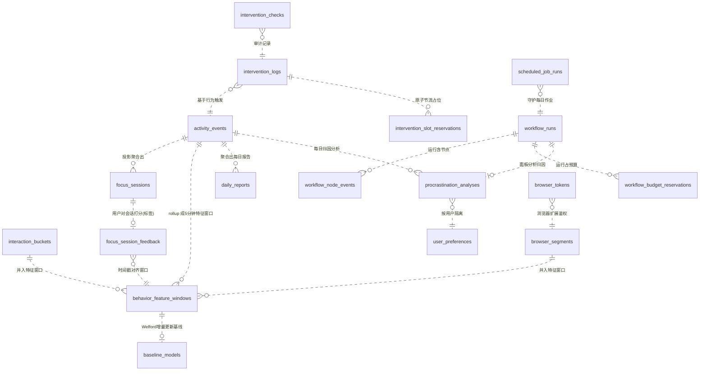

三条最关键的链路（初学者请重点理解）：

1. **采集 → 训练数据**：`activity_events`（原始事件）+ `interaction_buckets`/`browser_segments`（遥测）→ `behavior_feature_windows`（V3 特征窗口，5 分钟一窗、24 维特征）→ `baseline_models`（Welford 基线）。这是 ML 的完整数据血缘。
2. **会话 → 标签**：`focus_sessions`（从事件流识别出的专注段）被用户打分成 `focus_session_feedback`（label/score），这就是监督学习的**真值**；反馈的时间戳通过 `session_start_utc`/`session_end_utc` 与特征窗口对齐（迁移 0018 的 backfill 干的就是这件事）。
3. **分析 → 报告**：`activity_events` 聚合出 `daily_reports`；LLM 会诊结果写 `procrastination_analyses`；`workflow_runs`/`workflow_node_events` 记录这次"会诊"本身跑没跑完、花了多少 token（**只记元数据，不记聊天内容**）。

---

## 1.5 异步 repository 模式：为什么每个方法自己开 session

这是整个存储层**最值得复刻的设计**。所有 repository 的构造函数只收一个 `session_factory`（`async_sessionmaker[AsyncSession]`），而**每个方法内部都用 `async with self._session_factory() as session` 自己开、自己关 session**：

```python
class SQLAlchemyActivityRepository:
    def __init__(self, session_factory: async_sessionmaker[AsyncSession], pulsetime_s: int | None = None):
        self._session_factory = session_factory
        self._pulsetime_s = pulsetime_s or get_settings().heartbeat_pulsetime_s

    async def append_event(self, event: ActivityEvent) -> None:
        async with self._session_factory() as session, session.begin():   # ← 每次自己开事务
            last = await self._last_mergeable_event(session, event.user_id, event.event_type)
            if last is not None and self._should_merge(last, event):
                await session.execute(sa.update(activity_events).where(...).values(duration_s=...))
                return
            await session.execute(activity_events.insert().values(...))
```

为什么这样做（而不是像很多教程那样在 service 层共享一个 session）？

| 设计 | 问题 |
|------|------|
| ❌ 全程共享一个 session | 事务跨多个 `await`，其中若有 LLM 网络调用，**数据库连接被占用几十秒**；SQLite 连接池小，别的请求就只能干等 |
| ❌ service 层手动开 session | service 还得懂 SQLAlchemy 细节，分层被破坏；忘记 commit/close 就会泄漏连接 |
| ✅ repository 方法内自开自关 | 每个操作**独立小事务**，天然无跨 await 长事务、无连接泄漏、方法可独立测试 |

配套的工厂函数（`database.py:75-88`）：

```python
def create_session_factory(engine: AsyncEngine) -> async_sessionmaker[AsyncSession]:
    return async_sessionmaker(
        bind=engine,
        class_=AsyncSession,
        expire_on_commit=False,   # ← 提交后对象不自动过期，避免 commit 后再访问属性触发额外查询
    )
```

几点补充：

- **协议（Protocol）而非继承**：`base.py:22-61` 定义了 `ActivityRepository` 这个 `Protocol`，具体实现靠**结构类型匹配**（只要方法签名对得上就满足协议），配合 `mypy --strict` 在编译期抓缺方法，测试里还能 `MagicMock(spec=...)`。
- **允许跨方法事务**：当确实需要"多条写原子完成"时（如"存特征窗口 + 更新基线"要一起成功），repository 方法支持传入调用方持有的 `session` 参数（`telemetry.py:326-355` `upsert_feature_windows(session=...)`、`baseline.py:47-94` `upsert(session=...)`），由**调用方**负责开事务——事务所有权显式、不隐式。
- **幂等写入是标配**：SQLite 方言的 `insert(...).on_conflict_do_update(...)` 被大量使用（`report.py:124-136` 日报 upsert、`analysis.py:129-174` 归因 upsert、`baseline.py:72-89` 基线 upsert）。好处：同一天重复跑任务不会产生重复行。
- **心跳合并（heartbeat merge）**：`activity.py:114-149` 在插入前查"上一个同类型事件"，如果同进程、时间差在 `pulsetime_s`（默认 10 秒）内，就把 `duration_s` **累加**而不是插新行——防止每 5 秒一条快照把表撑爆。`browser_segments` 也有同样的合并（`telemetry.py:72-121`）。

> 打比方：每个 repository 方法就像一位**只接单、不跨单**的跑腿小哥。他接一张单（开 session）→ 办完（commit）→ 交单走人（close）。**单与单之间绝不互相纠缠**。只有当老板（service）明确说"这几件事要一次办完"，小哥才用老板递过来的同一张单一起办（session 参数）。

---

## 1.6 数据模型：domain 层是"纯 Python"，不进数据库

存储层的另一半是 `domain/` 下的**纯数据模型**。它们没有 `@dataclass` 之外的任何框架依赖（不 import SQLAlchemy），保证"想换数据库都不影响模型"。

| 文件 | 内容 | 关键点 |
|------|------|--------|
| `domain/events.py` | `WindowSnapshot`（窗口快照）+ `ActivityEvent`（事件） | **frozen dataclass**（不可变）；`to_dict/from_dict` 做 JSON 序列化；**拒绝 naive datetime**（`_check_aware`，`events.py:27-31`）——所有时间必须带时区、统一 UTC |
| `domain/features.py` | 特征计算纯函数 | `count_confirmed_switches()`（驻留≥10 秒 + 忽略瞬时进程才计一次切换，`features.py:223-282`）、`focus_score()`（top-app 占比×60% + 切换惩罚×40%，`features.py:285-330`） |
| `domain/feature_schema.py` | 特征词表 + 版本 | `FEATURE_SCHEMA_VERSION = 3`（`feature_schema.py:12-13`，定义了两遍、后定义覆盖前定义）；`V2_FEATURE_NAMES` 列全 24 个特征名（`feature_schema.py:15-39`）——**domain 和 train 共用这份词表，防止漂移** |
| `domain/baseline.py` | 个人基线模型 | **Welford 在线算法**（只存 n/mean/M2 三个数就能增量算均值方差，`baseline.py:142-165`）；按 `(hour, dow)` 分 168 个桶；`to_dict/save/load` 支持落盘 |
| `domain/evidence.py` | 证据包（ML 感知 → LLM 推理的契约） | `EvidenceBundle` + `EvidenceItem`；`to_prompt_json()`（`evidence.py:125-195`）**明确不带窗口标题、不带文件路径**（NF-S3a）；`metric_names()` 供 critic 校验引用 |
| `domain/intervention.py` | 干预领域模型 | 4 种干预类型、3 档强度（gentle/standard/strict）、CBT 技术中文标签；**文案禁用"诊断/治疗/患者/处方"**（NF-S7） |

> 打比方：domain 层是**公司章程/合同文本**（只规定"长什么样、怎么算"），infrastructure 层是**保险柜和记账系统**（怎么存、怎么取）。合同和保险柜解耦，换保险柜不用重写合同。

---

## 1.7 Alembic 迁移：从 0001 到 0018 的升级之路

数据库 schema 会随功能演进，Alembic 负责把**旧库平滑升级到新库**。MindFlow 当前迁移链是 18 个版本，全部线性：

```
0001_create_core_tables
  └─ 0002_add_panel_transcript        (加 panel_transcript_json)
      └─ 0003_create_chat_messages     (建 chat_messages)
          └─ 0004_add_intervention_logs_index
              └─ 0005_add_intervention_feedback
                  └─ 0006_create_app_classification_rules
                      └─ 0007_create_telemetry_tables   (建 5 张遥测表)
                          └─ 0008_optimize_activity_telemetry
                              └─ 0009_create_scheduled_job_runs
                                  └─ 0010_add_scheduled_job_heartbeat
                                      └─ 0011_add_analysis_kind
                                          └─ 0012_add_chat_session_recent_index
                                              └─ 0013_create_workflow_tables  (建 3 张工作流表)
                                                  └─ 0014_add_intervention_title_message
                                                      └─ 0015_add_panel_degradation_meta
                                                          └─ 0016_add_node_event_payload
                                                              └─ 0017_create_ml_shadow_predictions
                                                                  └─ 0018_add_feedback_snapshot_checks  ← head
```

### 如何初始化 / 如何跑

- 初始化：`alembic init alembic` 生成目录骨架；项目在此基础上写 `env.py` 和 `versions/`。
- 跑迁移：应用启动时在 `app.py:265` 调用 `run_migrations(settings.db_url)`；命令行可 `uv run alembic upgrade head`（手动）。
- `env.py` 关键点：`render_as_batch=True`（`env.py:91,116`）——**SQLite 不支持 `ALTER COLUMN`**，batch 模式会"重建整张表"来模拟改列；URL 从应用的 `Settings` 推导（`env.py:48-67`），异步驱动自动换成同步驱动。

### upgrade / downgrade 的注意点

- 每个 migration 必须**成对**写 `upgrade()` 和 `downgrade()`（downgrade 是"后悔药"，按逆序 drop）。
- `downgrade` 对 SQLite 是**高危操作**：SQLite 的 ALTER 能力弱，回滚可能丢失列或数据。因此项目文档明确警告（见根 CLAUDE.md）：**SQLite 上做 downgrade 必须先在隔离/备份库上试**。生产里几乎只 forward。
- `run_migrations` 做了一层**保护**（`migrations.py:40-54`）：跑完 `upgrade head` 后，还会亲自查 `alembic_version` 是否真的等于 script head，不一致就抛异常，防止"迁移文件缺失但表面成功"。
- **异步不阻塞**：Alembic 是同步库，`migrations.py:57-84` 用 `asyncio.to_thread` 把它丢进线程池，避免卡住 FastAPI 事件循环。
- 迁移失败不致命：`run_migrations` 失败返回 `False`，应用仍可带着旧 schema 启动，健康检查会暴露 `migration_failed` 状态（优雅降级，NF-R5）。

> 打比方：迁移链像**游戏存档升级**。旧存档（0001 的库）读完 0018 个补丁就能在新版本里打开。每个补丁都自带"打了升级 + 删了回退"两份说明；SQLite 这游戏特别怕"回档"，所以项目规定回档前必须先备份存档。

---

## 1.8 维护与保留策略：旧数据怎么清、备份怎么做

存储层不是"写完就完"，`services/maintenance_service.py` 是它的**大管家**，配合调度器（`scheduler.py:1160-1191`）每天执行：

| 任务 | 触发时间 | 做什么 | 实现要点（file:line） |
|------|---------|--------|----------------------|
| `cleanup_old_events` | 每天 03:00 | 删掉超过 `event_retention_days`（默认 30，合法区间 7–90，`config.py:135-151`）的原始事件 | **分批删，每批 10,000 行、每批单独 commit**（`maintenance_service.py:74-127`），避免长事务撑爆 WAL |
| `_wal_checkpoint_truncate` | 清理事件后 | `PRAGMA wal_checkpoint(TRUNCATE)` 把 WAL 清零，**回收磁盘空间** | 必须在无活跃写事务时执行（`maintenance_service.py:129-142`） |
| `run_daily_backup` | 每天 04:00 | 用 `VACUUM INTO` 生成崩溃一致快照到 `{data_dir}/backups/mindflow-{date}.db` | `database.py:128-166`；失败会发桌面通知（`maintenance_service.py:161-175`） |
| `cleanup_old_workflows` | 每日 cron | 删超过 `workflow_retention_days`（默认 30）的**终态**工作流运行 + 节点事件；**保留** analyses 和 chat | 只删 `completed/failed/cancelled`；`pending/running` 永不删（`maintenance_service.py:180-247`） |
| `reconcile_stale_runs` | 每日 cron | 把卡在 `running` 超过 60 分钟的运行标记为 `failed`（进程崩溃兜底） | `maintenance_service.py:251-296` |
| `reconcile_orphan_chat_turns` | 每日 cron | 检测"用户消息没有助手回复"的孤儿轮次——**只记录，不删除** | `maintenance_service.py:300-351` |
| `expire_stale_budgets` | 每日 cron | 释放已过期的预算预留，让幂等键可复用 | `maintenance_service.py:355-388` |

### 备份为什么用 VACUUM INTO

`database.py:128-166` 的 `backup_database`：

```python
temp_dest = dest.with_name(f".{dest.name}.{uuid4().hex}.tmp")
async with engine.connect() as conn:
    await conn.execute(text(f"VACUUM INTO '{temp_dest}'"))
    await conn.commit()
temp_dest.replace(dest)   # 原子替换，先写临时文件再改名
```

`VACUUM INTO` 是 SQLite 3.27+ 官方推荐的备份方式：它生成一个**事务一致**的新库文件（读到的是一瞬间的快照），不会因为拷贝时恰好有写入而得到损坏副本。先写 `.tmp` 再 `rename` 是**原子操作**——中途断电也不会留下半个备份文件。防御细节：备份路径含单引号直接拒绝（`database.py:147-149`），避免注入 SQL。

> 打比方：VACUUM INTO 像**复印机**——不是一本本抄，而是整本复印，复印瞬间账本是静止的（一致），复印完撕下临时页替换正式页（原子替换）。每日一份，按日期命名，天然形成"每日快照档案"。

---

## 1.9 隐私与 PII：哪些数据敏感，项目怎么保护

MindFlow 采集的是**最高敏感级别的个人行为数据**，必须认真对待：

### 哪些是敏感/PII

| 数据 | 敏感性 | 存在哪 |
|------|--------|--------|
| 窗口标题 `window_title` | **极高**——可能含文件名、网页标题、聊天内容 | `activity_events.data_json`、`activity_events.window_title`（计算列） |
| 应用/进程名 | 高——推断工作与生活习惯 | `activity_events.app_name/process_name` |
| 浏览器域名 `domain` | 高——推断访问内容 | `browser_segments.domain` |
| 键鼠统计 | 中——不直接含内容，但能刻画行为模式 | `interaction_buckets.*` |
| 聊天记录 | 高 | `chat_messages.content` |
| LLM 归因与专家会诊转录 | 高 | `procrastination_analyses.panel_transcript_json` |
| 干预消息与用户反馈 | 中 | `intervention_logs.*` |

### 项目如何保护（代码级证据）

1. **全本地、无上传**：数据只在 `{data_dir}`，架构第一条 ADR 纪律（`00-overview.md` 0.4）。
2. **LLM 证据去标识化**：`evidence.py:125-195` 的 `to_prompt_json()` 明确"**No window titles or file paths**"——给 LLM 专家看的只有聚合指标（focus_score、switch_rate、占比）和中文可读描述，**原始窗口标题不进 prompt**。`human_readable` 字段同样禁止窗口标题（NF-S3a，`evidence.py:67-69`）。
3. **工作流表零 PII**：`schema.py:274-281` 注释写明 `workflow_runs` 只存元数据（status/时间/计数/脱敏 trace_id），**不复制聊天文本、原始 prompt、证据载荷**。
4. **令牌只存哈希**：浏览器扩展配对令牌 `browser_tokens.token_hash`，不存明文（`telemetry.py:529-554`）。
5. **链路追踪脱敏**：本地 OpenTelemetry 的 span 属性**从不包含**窗口标题、文件路径、PII（ADR-003，见根 CLAUDE.md）。
6. **日志脱敏**：loguru `diagnose=False` 不把局部变量写进 traceback（`logging_config.py:75,90`）；备份失败通知也不含数据内容（`maintenance_service.py:167-172`）。
7. **一键删除**：`telemetry.py:614-644` 的 `delete_scope` 支持按 interaction/browser/feedback/all 粒度删除某用户的数据——实现"被遗忘权"。
8. **数据过期即焚**：原始事件 30 天自动清理（1.8 节），聊天/分析/报告则长期保留（产品需要）。

---

## 1.10 可复刻性：最小存储层骨架

```python
# 1) 引擎（带 WAL PRAGMA 监听器）
from sqlalchemy.ext.asyncio import create_async_engine, async_sessionmaker

def build_engine(db_path: str):
    engine = create_async_engine(f"sqlite+aiosqlite:///{db_path}")
    from sqlalchemy import event

    @event.listens_for(engine.sync_engine, "connect")
    def _wal(conn, _):  # 每个新连接自动配置
        for pragma in (
            "PRAGMA journal_mode=WAL",
            "PRAGMA synchronous=NORMAL",
            "PRAGMA busy_timeout=5000",
            "PRAGMA foreign_keys=ON",
        ):
            conn.exec_driver_sql(pragma)
    return engine

# 2) 会话工厂（不共享 session，方法内自开自关）
SessionLocal = async_sessionmaker(bind=engine, expire_on_commit=False)

# 3) 一个仓库方法的样子
async def append_event(session_factory, event):
    async with session_factory() as session, session.begin():
        await session.execute(table.insert().values(id=event.id, ...))

# 4) 迁移：alembic init + render_as_batch=True + upgrade head；SQLite 禁 ALTER COLUMN
# 5) 维护：分批 DELETE(每批1万行单独commit) + VACUUM INTO 每日快照 + wal_checkpoint(TRUNCATE)
```

复刻验收清单：

- [ ] `mindflow.db` 是 WAL 模式，能一边写一边读
- [ ] 每个 repository 方法 `async with session_factory()` 自开自关，service 层不碰 session
- [ ] `alembic upgrade head` 幂等，`alembic_version` 与 head 一致
- [ ] 窗口标题**不会**出现在发给 LLM 的证据 JSON 里
- [ ] 超过保留期的原始事件被分批删除且磁盘空间回收（WAL 截断）
- [ ] `backups/` 下有按日期的崩溃一致快照

---

## 1.11 关键文件速查

| 文件 | 作用 |
|------|------|
| `src/mindflow/infrastructure/database.py` | 引擎工厂 + WAL PRAGMA + `integrity_check` + `backup_database`(VACUUM INTO) |
| `src/mindflow/infrastructure/schema.py` | 所有 `sa.Table` 单一事实来源 |
| `src/mindflow/infrastructure/migrations.py` | Alembic 异步包装（to_thread + head 校验） |
| `alembic/env.py` | `render_as_batch=True`、URL 从 Settings 推导 |
| `alembic/versions/0001..0018` | 迁移链 |
| `src/mindflow/infrastructure/repositories/*.py` | 13 个仓库（activity/focus/report/analysis/intervention/baseline/chat/preferences/app_classification/telemetry/scheduled_jobs/workflow_runs） |
| `src/mindflow/domain/{events,features,feature_schema,baseline,evidence,intervention}.py` | 纯数据模型 |
| `src/mindflow/services/maintenance_service.py` | 清理 / 备份 / 回收 |
| `src/mindflow/config.py` | `{data_dir}`/`models_dir`/保留期解析 |
| `src/mindflow/logging_config.py` | 日志落盘（`{data_dir}/logs`） |
| `src/mindflow/infrastructure/checkpointer.py` | LangGraph 检查点复用同一 db 文件 |

---

# 02 · 数据采集与遥测链路（窗口活动 / 键鼠输入 / 浏览器）

> 目标读者：**从未写过项目的人**。读完本章，你能回答"MindFlow 是怎么知道你正在用哪个软件、有没有在敲键盘、刷了多少网页的"，并且能自己复刻一套。
> 配套章节：`01-storage.md`（数据存哪、怎么建表）、`03-training-data.md`（这些数据如何变成训练样本）。
> 代码根目录：`mindflow-app/backend-next/`（下文路径均相对它）。

---

## 2.0 本章导读：一句话 + 一张图

**一句话**：MindFlow 用三条"本机传感器"持续观察你的电脑——**窗口活动**（每 5 秒看一眼前台是什么窗口）、**键鼠输入**（每 30 秒汇总一次敲了多少键/点了多少下鼠标）、**浏览器**（你切到哪个域名就记哪个域名），然后把它们揉成**5 分钟一块的行为特征窗口**，供后续统计分析、机器学习和实时干预使用。

```
本机三个"传感器"                                  后端进程
┌───────────────────────┐                 ┌────────────────────────────────────┐
│ 窗口活动 (5s tick)     │──写──► activity_events 表                            │
│   win32/x11/darwin    │                 │                                    │
├───────────────────────┤                 │ CollectorService(5s 循环)          │
│ 键鼠 Raw Input (30s桶) │──写──► interaction_buckets 表                        │
│   Windows 独有         │                 │ InputTelemetryService(子进程drain)  │
├───────────────────────┤                 │                                    │
│ 浏览器 MV3 扩展 (~30s) │──HTTP──► browser_segments 表                        │
│   domain + audible    │                 │ TelemetryService(配对/心跳)         │
└───────────────────────┘                 │                                    │
                                          │ 每15分钟/每日/启动时                │
                                          │ rollup_feature_windows()           │
                                          │   └──► behavior_feature_windows 表 │
                                          │          (5分钟窗口 × 24 个特征)    │
                                          └────────────────────────────────────┘
```

三个传感器的数据先在"原始层"落表，再由 `TelemetryService.rollup_feature_windows()` 定时聚合为特征窗口。这个"原始→特征"的两段式设计，是本章最值得记住的结构。

---

## 2.1 三条采集链路总览

| 链路 | 频率 | 采集什么 | 落到哪张表 | 平台 |
|------|------|----------|-----------|------|
| ① 窗口活动 | 每 5 秒一次 | 前台窗口标题、应用名/进程名、是否空闲、本段时长 | `activity_events` | win32 / x11 / darwin / wayland |
| ② 键鼠输入 | 30 秒一个桶 | 按键数、点击数、滚轮量、鼠标移动距离、活跃秒数、交互爆发数 | `interaction_buckets` | Windows（Raw Input） |
| ③ 浏览器 | 事件驱动 + 30 秒心跳兜底 | 当前活动标签页的**域名**、是否有声音 | `browser_segments` | Chrome/Edge MV3 扩展 |

> 频率来源：窗口 `collect_interval_s` 默认 5 秒（`src/mindflow/config.py:128-130`）；键鼠桶 `bucket_seconds=30`（`input_watcher.py:111`）；浏览器 `HEARTBEAT_SECONDS=30`（`browser_extension/service_worker.js:2`），但标签页切换/URL 变化会立即触发上报，所以实际粒度取决于你的操作。

三条链路共同遵守三条纪律（这也是复刻时的铁律）：
1. **采集器永不抛异常**——平台 API 出错就返回"降级快照"（`app_name="unknown"`）并记 warning（`collectors/base.py:41-44`、`collectors/win32.py:58-64`）。
2. **所有阻塞调用丢进线程**——用 `asyncio.to_thread` 包住原生 API，避免卡死异步事件循环（`collectors/win32.py:61,69`）。
3. **采集进来的文本一律截断**——窗口标题、应用名超过 512 字符就被截掉（`collectors/base.py:78-101`，F4 安全加固）。

---

## 2.2 链路一：窗口活动采集（每 5 秒拍一张快照）

### 2.2.1 共性抽象：EventCollector 协议

所有平台的采集器都长得一样——它们实现了同一个 `EventCollector` 协议（Protocol），协议只有两个方法：

```python
# src/mindflow/infrastructure/collectors/base.py:35-64
class EventCollector(Protocol):
    async def snapshot(self) -> WindowSnapshot: ...   # 抓当前前台窗口
    async def idle_seconds(self) -> float: ...        # 距上次键鼠输入多少秒
```

`WindowSnapshot` 是"前台窗口的一次快照"，是一个 **frozen dataclass**（不可变），字段见 `src/mindflow/domain/events.py:36-52`：

| 字段 | 含义 |
|------|------|
| `app_name` | 应用显示名（如 "Code"） |
| `window_title` | 窗口标题原文（**已截断到 512 字符**） |
| `process_name` | 可执行文件名（如 `Code.exe`）——这是后续所有聚合的"身份键" |
| `is_idle` | 用户是否空闲（由 `idle_seconds >= 60` 判定） |
| `timestamp_utc` | 快照时刻（必须是带时区的 UTC，`events.py:27-30` 会拒绝 naive 时间） |

选 Protocol 而不是 ABC 的原因（`base.py:7-13`）：结构子类型让 `mypy --strict` 在编译期就能发现"某平台采集器少写了一个方法"，又不需要显式继承，加第五个平台时不容易漏。

### 2.2.2 各平台实现差异（同一协议，四套原生 API）

| 平台 | `snapshot()` 用什么 | `idle_seconds()` 用什么 | 备注 |
|------|--------------------|------------------------|------|
| Windows | `win32gui.GetForegroundWindow()` + `win32process` 拿 PID + `psutil` 拿进程名 | `GetLastInputInfo`（ctypes） | 最完整：能拿到窗口标题 |
| macOS | `NSWorkspace.sharedWorkspace().activeApplication()`（PyObjC/AppKit） | `CGEventSourceSecondsSinceLastEvent`（Quartz） | 拿到的是"活动应用"，窗口标题退化为应用本地名 |
| Linux X11 | X11 EWMH `_NET_ACTIVE_WINDOW` + `_NET_WM_PID`（python-xlib） | XScreenSaver 扩展的 idle 毫秒数 | 需要 X11 桌面 |
| Linux Wayland | psutil 猜一个前台进程（终端/非 root 进程） | **无**，恒返回 0.0 | 降级方案：Wayland 安全模型不允许普通应用查前台窗口 |

关键实现细节：

- **Windows**：`win32gui.GetForegroundWindow()` 拿句柄 → `GetWindowText(hwnd)` 拿标题 → `GetWindowThreadProcessId(hwnd)` 拿 PID → `psutil.Process(pid).name()` 拿进程名（`win32.py:76-104`）。空闲检测用 `GetLastInputInfo`，还专门处理了 `GetTickCount` 每 49.7 天回绕的坑（`win32.py:115-121`）。
- **X11**：先 `d.getActiveWindow()` 拿活动窗口，再读 `_NET_WM_PID` 属性解析进程名（`x11.py:59-96`），最后用 `finally: d.close()` 确保 X 连接不泄漏。
- **Wayland fallback**：这是"尽力而为"。Wayland 的合成器（compositor）为了保护隐私，不给普通应用提供全局前台窗口 API，所以只能扫描进程列表找终端类进程（`wayland_fallback.py:75-97`）。**它代表一个重要的设计取舍：宁可降级采集，也不让应用崩溃。**

> 为什么用 `asyncio.to_thread`？`snapshot()` 是异步方法，但里面调用的 Win32/Xlib API 是**同步阻塞**的。如果直接在事件循环里调用，一个卡住的系统调用会冻结整个 FastAPI 服务。`to_thread` 把它丢到线程池，事件循环继续干别的（`win32.py:61`）。

### 2.2.3 CollectorService：后台 5 秒循环

`CollectorService` 是"窗口活动"这条链路的发动机（`src/mindflow/services/collector_service.py`）。它不是单例——`create_app` 在启动时用工厂 `create_collector()` 造出当前平台的采集器，再注入 `CollectorService`（`app.py:325-337`）。

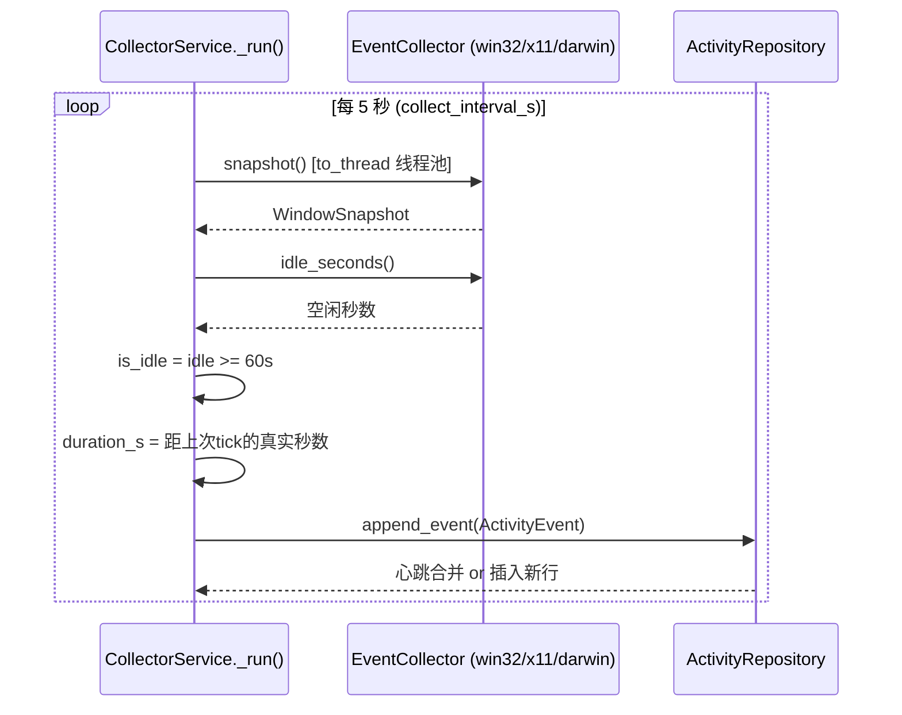

每次 `_tick()`（`collector_service.py:224-257`）做四件事：
1. **量时长**：`actual_duration = now - 上次tick时间`。用"实测间隔"而不是配置值，是为了在系统 sleep/卡顿后依然保持时长总和正确（`229-233`）。
2. **取快照 + 取空闲**：两个采集器调用。
3. **判类型**：`idle_seconds >= 60`（`_IDLE_THRESHOLD_S`，`collector_service.py:39`）就算 `idle_change`，否则 `window_snapshot`。
4. **写库**：构造 `ActivityEvent`（含 UUIDv7 id、时长、快照）交给仓库。

循环的健壮性设计（复刻时值得抄）：
- **单次失败不杀循环**：连续 10 次 tick 失败才把状态置为 `degraded` 并停掉（`collector_service.py:198-216`）。
- **每 tick 有超时**：`asyncio.wait_for(..., timeout=interval*2)`，挂死的采集器不会阻塞循环（`189`）。
- **优雅停止**：`stop()` 先置哨兵位等当前 tick 自然结束（保证在途事件已落库），超时再 cancel（`112-169`）。
- **start/stop 用锁保护**：`asyncio.Lock` 防止并发调用产生孤儿任务（`75-78`）。

### 2.2.4 心跳合并：同一个窗口不要刷屏

你连着看 1 小时编辑器，按 5 秒一拍就是 720 条几乎一样的记录——太浪费。`SQLAlchemyActivityRepository.append_event` 实现了**心跳合并（heartbeat merge）**：

> 如果新事件和"上一条同类型事件"的 app_name / process_name / window_title / is_idle 完全相同，且时间差在 `heartbeat_pulsetime_s`（默认 10 秒）内，就把时长累加到旧行上，**不插新行**（`repositories/activity.py:114-149`、`517-549`）。

```python
# 合并条件（repositories/activity.py:527-549，全部满足才合并）
if 事件类型可合并 (window_snapshot / idle_change)        and
   同类型 (window 不合并 idle)                          and
   app_name / process_name / window_title / is_idle 全相同 and
   -pulsetime <= 新事件开始 - 旧事件结束 <= pulsetime:
        把新事件的 duration_s 累加到旧行 → 返回（不插入）
```

于是 `activity_events` 表的行数 ≈ **"上下文变化次数"**，而不是"tick 次数"。夜间长时间空闲也一样——连续的 `idle_change` 合并成一条超长空闲记录，不会每分钟刷一条（`activity.py:1-14` 注释）。这正是原始事件表能撑住 30 天保留期的原因。

---

## 2.3 窗口切换计数：`count_confirmed_switches()`

这是整个特征工程里最容易写错、也最关键的一个函数。它的任务：**数出这个窗口里"真正"发生了多少次换应用**。

### 2.3.1 为什么直接数"变化"不对

朴素做法是：相邻两条快照 `process_name` 不同就 +1。但真实使用中这会严重高估：

- 你在编辑器里写代码，想查个资料，点开浏览器、瞟一眼、再切回编辑器——整个过程不到 5 秒，被拍进 2~3 条快照，朴素算法记 2 次"切换"。
- Windows 的 `explorer.exe`、`ApplicationFrameHost.exe` 等**外壳进程**会在你点开始菜单、点任务栏的瞬间短暂跳到前台，这不是"你在用资源管理器"。

如果直接用这种脏计数去算"切换频率→分心度"，一个专注写代码的人也会被判成疯狂切窗。所以 MindFlow 用的是**"驻留确认"**策略。

### 2.3.2 "驻留 10 秒"规则

`count_confirmed_switches`（`src/mindflow/domain/features.py:223-282`）维护一个两态状态机：`current`（当前确认的进程）+ `candidate`（正在观察的新进程）。

- 看到一个**新进程**时，不立即判"切换"，而是把它记为 `candidate` 开始观察。
- 只有 `candidate` 连续驻留达到 `min_dwell_s = 10` 秒（`features.py:41`，`DEFAULT_SWITCH_MIN_DWELL_S`），才确认这是一次**真正的切换**：`candidate` 转正为 `current`，切换计数 +1。
- 如果 `candidate` 还没站满 10 秒就又切回去了（比如 A→B→A），这段"短暂出走"被直接丢弃，不计数。

> **比喻**：想象裁判数"换台"。观众遥控器按了一下综艺又立刻按回纪录片，裁判**不算**换台；只有新频道连续播放超过 10 秒，裁判才记一次"换台"。

为什么是 10 秒？因为快照每 5 秒一拍，一个进程至少要持续约两个采样周期才能被确认"真的在"；10 秒既是"够两拍"，又远小于"真正分心刷手机"的典型时长。

### 2.3.3 "忽略瞬时进程"列表

即使驻留够久，某些进程也不算切换——它们是 Windows 系统外壳，会在你点击时短暂跳到前台，属于噪声（`features.py:44-53`）：

```python
TRANSIENT_PROCESSES = frozenset({
    "explorer.exe", "ApplicationFrameHost.exe", "ShellHost.exe",
    "ShellExperienceHost.exe", "DesktopMgr64.exe", "SearchHost.exe",
    "TextInputHost.exe", "StartMenuExperienceHost.exe",
})
```

算法跳过这些进程名（`features.py:246-247`），也不把它们算进"最长专注段"（`features.py:378-409`）。

### 2.3.4 状态机伪代码

```
switches = 0; current = None; candidate = None
for event in 非空闲事件(按时间排序):
    p = event.process_name
    if p 为空 or p ∈ 瞬时进程: continue
    d = event.duration_s
    if current is None: current = p; continue
    if p == current:
        if candidate 已驻留 >= 10s:
            switches += 1; current = candidate; candidate = p   # 归位换台
        else:
            candidate 作废; current_dwell += d                  # 短暂出走，忽略
    elif p == candidate:
        candidate_dwell += d
        if candidate_dwell >= 10s: switches += 1; current = candidate
    else:  # 全新进程
        若有 candidate 且驻留 >= 10s: switches += 1; current = candidate
        candidate = p; candidate_dwell = d
最后若 candidate 驻留 >= 10s: switches += 1
```

> 这个函数在 5 分钟特征窗口里被调用（`telemetry_features.py:44-46`），也在"每小时切换率"（`switch_rate_per_hour`，`features.py:357-375`）里复用。注意 `features.py:40-43` 里有一行朴素的相邻比对代码，紧接着就被 `count_confirmed_switches` 的结果**覆盖**——最终生效的是驻留确认版本，这是 2026-07-31 升级到 schema v3 时的修正。

---

## 2.4 链路二：键鼠输入遥测（30 秒结一次账）

窗口快照只告诉你"在用哪个软件"，不知道"有多投入"。MindFlow 用 Windows 的 **Raw Input** 机制监听全局键鼠事件，然后**只保留 30 秒聚合计数**，原始输入事件本身绝不落库。

### 2.4.1 Raw Input 与 WM_INPUT

`run_raw_input_watcher`（`src/mindflow/infrastructure/collectors/input_watcher.py:108-380`）是一个**纯 ctypes 实现的 Win32 消息循环**：

1. 注册一个隐藏窗口类，用 `RegisterRawInputDevices` 订阅**键盘（Usage 0x01/0x06）+ 鼠标（0x01/0x02）**输入（`input_watcher.py:332-373`）。
2. 所有原始输入以 `WM_INPUT` 消息送达窗口过程；在其中解析 `RAWINPUT` 结构：
   - 键盘：`WM_KEYDOWN` / `WM_SYSKEYDOWN` → 记一次按键（`218-221`）。
   - 鼠标：解析按钮按下/弹起（用 `MouseInputState` 维护按键沿，见 `input_watcher.py:76-105`，只计**按下**不重复计）、鼠标相对位移（`lLastX/lLastY`）、滚轮 `WM_MOUSEWHEEL` 的 delta（`222-246`）。
3. 每 30 秒 `WM_TIMER` 触发一次 `flush_bucket()`：把计数器打包成一个 dict 放进输出队列（`194-202`、`248-254`）。

> 注意一个隐私/精度取舍：鼠标移动记录的是**相对位移像素数**（用 `math.hypot(dx, dy)` 合成欧氏距离，`input_watcher.py:46-49`），不记录光标坐标、不记录按键内容。它知道"你动了 500 像素"，不知道"你点了哪里"。

### 2.4.2 InteractionAccumulator：一个桶装六个计数器

`InteractionAccumulator`（`input_watcher.py:14-73`）是线程安全的计数器集合，每个 30 秒桶导出：

| 字段 | 含义 | 说明 |
|------|------|------|
| `keypress_count` | 按键次数 | 只计按下，不计数 |
| `mouse_click_count` | 鼠标点击次数 | 按"按下沿"计数，一次按下算一次 |
| `scroll_delta` | 滚轮滚动量 | 累计 delta 绝对值 |
| `mouse_distance_px` | 鼠标移动总像素 | `hypot` 合成，四舍五入到 2 位 |
| `input_active_s` | 活跃秒数 | 每次输入事件记 0.1s，封顶不超过桶时长 |
| `interaction_burst_count` | 交互爆发次数 | 两次输入间隔 >2 秒算新一次"爆发"（`_touch`，`25-29`） |

`input_active_s` 和 `burst_count` 是"投入度"信号：长时间挂机不碰键盘鼠标，活跃秒数就是 0；狂敲键盘写代码时，按键间隔很短，爆发次数少但单次爆发长。

### 2.4.3 跨进程边界：为什么用子进程

`InputTelemetryService`（`src/mindflow/services/input_telemetry_service.py`）负责管理这个 watcher 的生命周期。关键点：Raw Input 消息循环是**阻塞的**（`GetMessageW` 死循环），所以它被放进一个 **`multiprocessing` 子进程**（`input_telemetry_service.py:49-58`），只通过一个 `queue.Queue` 与主进程通信：

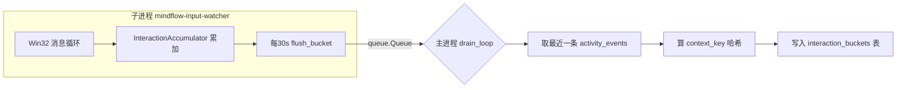

- 子进程用 `spawn` 上下文创建、`daemon=True`（`input_telemetry_service.py:49-57`），保证它不会意外继承主进程的线程状态。
- `_drain_loop` 阻塞读队列（`to_thread(self._queue.get, True, 1.0)`），`status="running"` 消息只更新状态，`error` 消息把状态置为 `degraded`，其余消息就是 30 秒桶 → 落库（`input_telemetry_service.py:79-95`）。
- 非 Windows 平台：`status = "unavailable"`，`start()` 直接返回（`input_telemetry_service.py:37,44-46`）——键鼠遥测目前是 Windows 专属。

### 2.4.4 context_key：用哈希而不是窗口标题

每个桶落库前，`_persist_bucket` 会从 `activity_events` 里取**最近一条**窗口事件，用它的 `process_name + window_title` 拼出上下文，再算哈希：

```python
# input_telemetry_service.py:97-106
source = f"{process_name}\0{window_title}"
context_key = f"{process_name.lower()}:{sha256(source)[:16]}"
```

这样 `interaction_buckets` 表里**永远不存窗口标题原文**，只存"进程名 + 标题哈希前缀"。既能知道"这 30 秒发生在哪个上下文"，又不会把 `「毕业论文_终版_绝不改.docx」` 这类 PII 明文落进遥测表。

---

## 2.5 链路三：浏览器遥测（Chrome/Edge 扩展）

窗口标题里能看到浏览器域名，但那不够干净也不够即时。MindFlow 带了一个 **Manifest V3 浏览器扩展**（`mindflow-app/browser_extension/`），只跟踪**当前活动标签页的域名 + 是否有声音**。

### 2.5.1 配对流程（6 位码 + 令牌）

浏览器扩展要调用后端，但后端有本地鉴权。MindFlow 设计了一个"临时配对"流程：

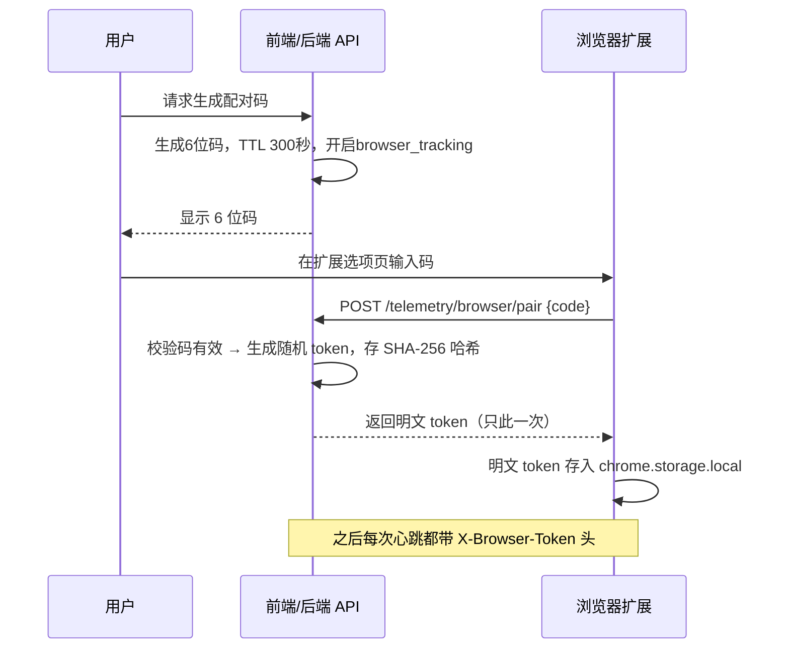

对应代码：`telemetry_service.py:144-159`（`create_pairing_code` / `pair_browser`）、`repositories/telemetry.py:529-554`（`save_browser_token` / `verify_browser_token`）。**后端只存 token 的 SHA-256 哈希**（`_hash_token`，`telemetry_service.py:653-655`），丢库也不泄密。

### 2.5.2 心跳上报机制

`service_worker.js` 的逻辑（`browser_extension/service_worker.js`）非常轻：

- 监听 `tabs.onActivated`（切标签）、`tabs.onUpdated`（URL/声音变化）、`windows.onFocusChanged`（切窗口）→ 立即 `reconcileContext()`（`89-95`）。
- 同时挂一个 30 秒 `chrome.alarms` 定时器兜底（`71-73`、`85-87`）。
- 每次切换上下文（域名或 audible 变化），把**上一个上下文从"上次上报"到"现在"的时长** POST 给后端（`flushContext`，`37-58`）。

上报的数据极克制：`{timestamp_utc, duration_s, browser_name, domain, audible, incognito}`，其中 `duration_s` 被夹在 `[1, 60]` 秒（`service_worker.js:41`），`incognito` 隐私窗口直接返回 `null` 不上报（`14-18`）。`domain` 只取 `url.hostname`，**不含路径、不含查询参数、不含具体网页标题**。

> **比喻**：扩展就像一个"看门记录员"，只记"你在 youtube.com 待了 3 分钟、有声音"，不记你看了哪个视频。

### 2.5.3 后端：domain 归一化 + 片段合并

后端收到心跳后（`api/routes/telemetry.py:92-109`）：

1. 校验 `X-Browser-Token` → 顺带刷新 `last_used_at`（`repositories/telemetry.py:55-70`）。
2. `incognito` 或未开启浏览器跟踪 → 直接 `{"ignored": True}`（`telemetry_service.py:183-192`）。
3. **domain 归一化**：去掉 `www.` 前缀、转小写、`urlsplit` 只留 hostname，最多 253 字符（`normalize_domain`，`telemetry_service.py:644-651`）。
4. **片段合并**：如果新心跳和上一条**同域名同 audible**，且时间差在 10 秒内，就把时长累加到旧行（`repositories/telemetry.py:84-107`）——和 `activity_events` 的心跳合并是同一个思路，防止扩展每 30 秒刷一行。

---

## 2.6 从原始事件到特征窗口 v3（rollup）

三条链路产出的原始数据是"流水账"，不适合直接喂给模型。`TelemetryService.rollup_feature_windows`（`telemetry_service.py:252-393`）把它们揉成**5 分钟一块的特征窗口**。

### 2.6.1 特征窗口是什么

> **比喻**：原始事件表是"秒级流水账"（5 秒一条，记录窗口变化），特征窗口是"每 5 分钟一张的体检表"——把这一小段时间里换了几个应用、最长连续专注多久、敲了多少键、刷了多少网页，压缩成 24 个数字。

为什么 5 分钟？这是**粒度与数据量的折中**：
- 太短（如 1 分钟）：特征稀疏，大量窗口是 0，噪声大。
- 太长（如 1 小时）：丢掉"短暂分心"这种模式。
- 5 分钟正好能覆盖"切出去刷 2 分钟手机再回来"这种典型拖延片段，而且一天最多 288 行窗口，训练数据规模可控。

窗口按**墙上时钟对齐**：`window_start = start.replace(minute=(start.minute // 5) * 5, second=0)`（`telemetry_service.py:299-303`），即每块窗口从 `xx:00 / xx:05 / xx:10 ...` 开始。

### 2.6.2 rollup 的三路扫描

`rollup_feature_windows(start, end)` 一次处理一个时间段，内部用三个游标并行扫描三类数据（`telemetry_service.py:261-365`）：

```mermaid
flowchart TD
    A[开始 rollup] --> B[查 activity_events 范围 + 补一条重叠的'前一条']
    B --> C[查 interaction_buckets 范围]
    C --> D[查 browser_segments 范围 + 补重叠前段]
    D --> E{逐 5 分钟窗口滑动}
    E --> F[筛选与窗口重叠的活跃事件]
    E --> G[筛选落在窗口内的输入桶]
    E --> H[筛选与窗口重叠的浏览器段]
    F & G & H --> I[build_v2_feature_window 计算 24 特征]
    I --> J[UPSERT feature_windows (幂等)]
    J --> K[新增行才折入 Welford 基线]
    K --> E
    E -->|窗口结束| L[返回行数]
```

几个值得注意的细节：

- **补"前一条"**：窗口从 08:00 开始，但可能有一条 07:59:30 开始、持续 2 分钟的事件跨进窗口。rollup 会把它读进来，重叠部分按秒计入（`telemetry_service.py:262-270`）。这就是特征计算里大量 `_overlap_seconds`（`telemetry_features.py:162-168`）出现的原因——**时长按"真实重叠秒数"计，而不是按事件条数计**。
- **任意时长事件剪裁**：一个 `duration_s` 可能跨越多个 5 分钟窗口，每个窗口只分到重叠的那段。
- **幂等 upsert**：窗口按 `(user_id, window_start_utc, feature_schema_version)` 唯一键 upsert（`repositories/telemetry.py:326-424`）。同一时间段重复 rollup 只是覆盖，不会产生重复行——所以调度器每 15 分钟滚动重算过去 2 小时是安全的（`scheduler.py:95-96,1227-1245`）。
- **只把"新增行"折入基线**：`upsert_feature_windows` 返回真正插入的行，只有它们进入 Welford 在线基线，避免重复统计（`telemetry_service.py:370-391`）。

### 2.6.3 schema v3：24 个特征字段

`FEATURE_SCHEMA_VERSION = 3`（`src/mindflow/domain/feature_schema.py:12-13`，注意文件里先赋 2 再赋 3，最终是 3）。`build_v2_feature_window`（`telemetry_features.py:19-129`）返回 24 个特征 + `feature_schema_version`：

| 类别 | 特征 | 怎么算 |
|------|------|--------|
| 窗口切换 | `app_switch_count` | `count_confirmed_switches`（驻留 10s 版） |
| 窗口切换 | `domain_switch_count` | 相邻浏览器段域名不同的次数 |
| 专注度 | `longest_segment_ratio` | 最长连续同应用段 ÷ 窗口秒数 |
| 专注度 | `idle_ratio` | 空闲秒数 ÷ 总事件秒数 |
| 专注度 | `active_seconds_ratio` | 非空闲秒数 ÷ 窗口秒数 |
| 专注度 | `top_app_ratio` | 用时最多应用的占比 |
| 投入度 | `keypress_rate_per_min` / `mouse_click_rate_per_min` | 按键/点击 ÷ 窗口分钟数 |
| 投入度 | `scroll_rate_per_min` / `mouse_distance_per_min` | 滚轮量/移动像素 ÷ 分钟数 |
| 投入度 | `input_active_ratio` | 活跃秒数 ÷ 窗口秒数 |
| 投入度 | `interaction_bursts_per_min` | 交互爆发次数 ÷ 分钟数 |
| 投入度 | `click_key_ratio` | 点击数 ÷ 按键数（防 0 除） |
| 投入度 | `interaction_interval_mean_s / std_s / cv` | 有交互的桶间隔的均值/标准差/变异系数 |
| 浏览器 | `browser_ratio` / `audible_browser_ratio` | 浏览器时长占比 / 有声时长占浏览器比 |
| 浏览器 | `top_domain_ratio` | 用时最多域名占比 |
| 时间 | `hour_sin / hour_cos / weekday_sin / weekday_cos` | 时间做**圆形编码**（见下） |
| 时间 | `hour_of_day` / `day_of_week` | 原始整型 |
| 预留 | `task_type_code` | 恒 0，留给任务类型标签 |

> **为什么时间要 sin/cos 编码？** `hour_of_day` 用 0-23 表示，23 点和 0 点看似差 23 个"单位"，其实只差 1 小时。sin/cos 把小时映射到单位圆上（`telemetry_features.py:95-98`），23 点和 0 点在圆上相邻，模型不会误判"23 点和 0 点完全不相关"。`interaction_interval_cv` 同样精妙：变异系数 = std/mean，衡量"打字节奏是否规律"，专注时节奏规律（cv 小），焦虑乱点节奏紊乱（cv 大）。

### 2.6.4 触发时机：谁在什么时候做 rollup

`rollup_feature_windows` 有三个触发源（`scheduler.py`）：

| 触发 | 范围 | 频率 | 代码位置 |
|------|------|------|---------|
| 近期滚动 | 过去 2 小时 | 每 15 分钟 | `scheduler.py:1227-1245` |
| 每日补算 | 昨天全天 | 每天 02:45 | `scheduler.py:1214-1225` |
| 启动恢复 | 过去 2 小时 + 昨天 | 每次启动 | `scheduler.py:1091-1140` |

由于 upsert 幂等，三个触发源重叠重算同一个窗口不会出错——这是整个调度设计敢于"重复跑"的根基。

---

## 2.7 隐私设计：数据边界与脱敏

### 2.7.1 采集边界：不采集什么

| 不采集 | 原因 |
|--------|------|
| 按键**内容**（你打了什么字） | Raw Input 只数次数，不读 VKey 文本 |
| 鼠标**坐标** | 只记相对位移像素 |
| 浏览器 **URL 路径/网页标题** | 扩展只取 `url.hostname` |
| **隐身窗口**（incognito） | 扩展直接忽略 |
| **剪贴板 / 截图 / 摄像头** | 设计上就不存在 |
| 非本地传输 | 数据只进本机 SQLite，不传云端 |

### 2.7.2 window_title 的脱敏（三层防线）

窗口标题是最敏感的原生数据，MindFlow 对它做了三层处理：

1. **长度截断**：所有平台采集器在构造 `WindowSnapshot` 前，把标题/应用名截到 512 字符（`truncate_text_field`，`collectors/base.py:78-101`）。原因：恶意或异常应用可以设置超长标题，无上限存储会让 PII 表面无限膨胀（`base.py:80-89`）。
2. **不进特征**：`behavior_feature_windows` 只存 24 个**数字**特征，`window_title` 在聚合后被丢弃，完全不进训练数据。
3. **哈希化**：遥测桶的 `context_key` 用 SHA-256 哈希而非明文（`input_telemetry_service.py:97-106`）。OpenTelemetry 追踪 span 也明文规定**永不含窗口标题/文件路径**（ADR-003）。

### 2.7.3 为什么是 5 秒 / 30 秒（性能权衡）

| 频率 | 性能理由 |
|------|---------|
| 窗口 5 秒 | 要在"驻留 10 秒"判定中有足够的采样点（至少 2 拍），同时把快照写入频率压到每分钟 12 次；配合心跳合并，实际落行数≈上下文变化次数。设置还允许 `collect_interval_s` 在 1~60 秒间调节（`config.py:128-130`）。 |
| 输入 30 秒 | Raw Input 每秒可能产生上百个事件，**绝不逐条落库**；聚合成 30 秒桶后，每天最多 2880 行（`input_watcher.py:375` 的 SetTimer）。 |
| 浏览器 30 秒 | 心跳是"时长报告"，30 秒粒度足够还原每个域名的停留时长，且把扩展对后端和网络的开销降到最低。 |

一句话：**采集频率由"下游需要的精度"决定，而不是"能采多快就多快"**。

### 2.7.4 数据保留与一键删除

- 遥测偏好默认：交互桶保留 **7 天**、活动事件 **30 天**、特征窗口 **180 天**（`telemetry_service.py:30-35`、`460-469`）。
- 每日 03:00 定时清理过期原始事件（`scheduler.py:1157-1165`）。
- 用户可一键删除某类数据：`DELETE /telemetry/data?scope=interaction|browser|feedback|all`（`api/routes/telemetry.py:61-66` → `repositories/telemetry.py:614-644`）。

---

## 2.8 可复刻性：最小骨架 + 验证清单

**最小复刻骨架（伪代码）**：

```python
# 1. 采集器：一个协议 + 每平台一个实现
class EventCollector(Protocol):
    async def snapshot(self) -> WindowSnapshot: ...
    async def idle_seconds(self) -> float: ...

# 2. 后台循环：每5秒一拍，异常不杀循环
async def collect_loop():
    while True:
        try:
            snap = await asyncio.to_thread(collector.snapshot_sync)
            await repo.append_event(build_event(snap))
        except Exception:
            if consecutive_failures := ... >= 10: break
        await asyncio.sleep(max(0, interval - elapsed))

# 3. 切换计数：驻留10秒才确认
def count_confirmed_switches(events):
    # 状态机：current/candidate，candidate驻留>=10s才+1

# 4. 特征窗口：5分钟对齐 + 重叠秒数计时长
def build_feature_window(events, buckets, browser, start, end):
    return { 24 个数值特征 }

# 5. rollup：幂等 upsert，只把新增行折入基线
async def rollup(start, end):
    rows = [build_feature_window(...) for each 5min window]
    upsert_feature_windows(rows)  # 唯一键(user, window_start, version)
```

**验证清单（确认你复刻对了）**：

1. 跑真实采集器：`snapshot()` 能返回前台窗口，`window_title` 长度 ≤ 512。
2. 长时间不动电脑：`activity_events` 出现 `idle_change`，且不会每 5 秒刷一行（心跳合并在工作）。
3. 快速 A→B→A 切窗：`count_confirmed_switches` 结果为 0；B 停留 >10 秒才 +1。
4. `build_v2_feature_window` 的比率特征全部落在 `[0,1]`（`tests/test_telemetry_features.py:143-153` 有断言）。
5. 同一时间段 rollup 两次：`behavior_feature_windows` 行数不增（幂等）。
6. 一键删除：`DELETE /telemetry/data?scope=all` 后三类遥测表清空。

> 后端测试覆盖本章逻辑：`tests/test_collectors.py`（平台工厂/降级/截断）、`tests/test_collector_service.py`（tick 循环/合并）、`tests/test_input_watcher.py`（Raw Input 桶）、`tests/test_telemetry_features.py`（特征计算）、`tests/test_routes_telemetry.py`（API 契约）、`tests/test_routes_collector.py`。

---

# MindFlow 训练数据来源与特征工程（03）

> 目标读者：**从未写过项目的人**。读完本章，你应该能说清楚：MindFlow 的模型**到底拿什么数据训练、标签从哪来、每个特征怎么算出来、数据不够时怎么办**。
> 对应源码：`backend-next/src/mindflow/train/`、`backend-next/src/mindflow/services/training_*_service.py`。

---

## 3.1 一个比喻先立住全局

把 MindFlow 的模型训练想成**医院积累病历、训练诊断模型**：

- **原始事件**（`activity_events`）＝ 病人身体上每秒钟发生的生理信号：心电、血压、血氧。零散、海量、还没解读。
- **特征窗口**（`behavior_feature_windows`）＝ **每 5 分钟抽一次血化验**，把一大堆原始信号浓缩成一张化验单（24 项指标：切换次数、键盘频率、娱乐占比……）。模型不直接读原始信号，只读化验单。
- **标签**（`focus_session_feedback`）＝ **医生的诊断结论**：这个时段你到底是"专注"（1）还是"分心"（0）。没有诊断结论的血样只是一堆数字，学不出"什么样子叫生病"。
- **训练** ＝ 把几千张"化验单 + 诊断结论"喂给算法，让它学会"看到这组指标，就判断该打 0 还是 1"。
- **训练就绪度（7 道质量门）** ＝ 医院评审"这堆病历够不够支撑开一项研究"：样本太少不行、只有一种病不行、时间跨度太短不行。

训练的本质可以一句话概括：**把"电脑使用行为"翻译成数字（特征），再拿"用户亲口承认的专注/分心"（标签）去教模型认这些数字的规律**。下面逐节拆开。

---

## 3.2 数据链条全景：原始事件 → 特征窗口 → 标签

整条链是单向流水线，每一步都在 `backend-next/src/mindflow/services/telemetry_service.py` 的 `rollup_feature_windows()`（`telemetry_service.py:252`）里完成。用一张图看：

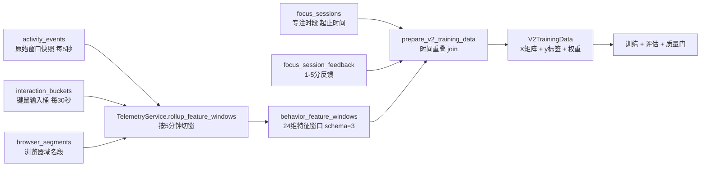

**三张输入表**（都在 `backend-next/alembic/versions/0001_create_core_tables.py`、`0007_create_telemetry_tables.py` 里建表）：

| 表 | 建表位置 | 内容 | 谁写它 |
|----|---------|------|--------|
| `activity_events` | `0001:34` | 前台窗口快照：`timestamp`、`duration_s`、`data_json`（内含 process_name、window_title、is_idle） | 采集器每 5 秒 |
| `interaction_buckets` | `0007:22` | 键鼠统计：keypress_count、mouse_click_count、scroll_delta、input_active_s 等 | 键鼠采集器每 30 秒 |
| `browser_segments` | `0007:44` | 浏览器域名段：domain、audible（是否出声）、duration_s | 浏览器扩展 |

**一张训练样本表**（`0007:93`）：

`behavior_feature_windows`——列有 `user_id`、`window_start_utc`、`window_end_utc`、`feature_schema_version`、`features_json`（24 维特征的 JSON）、`label`（预留，训练时不读它）。主键之外还有个三列唯一约束 `(user_id, window_start_utc, feature_schema_version)`，保证同一个用户同一分钟不会重复 rollup。

**一张标签表**（`0007:63`）：

`focus_session_feedback`——列有 `user_id`、`session_id`（关联 `focus_sessions.id`）、`label`（focus / distracted / mixed）、`score`（1–5 整数）、`task_type`。注意它**不存时间段**，时间段在 `focus_sessions` 表（`0001:49`，有 `start_time` / `end_time`）。

### 3.2.1 rollup：原始信号怎么变成化验单

`rollup_feature_windows()`（`telemetry_service.py:252`）做四件事：

1. 查出这一段时间的原始事件、键鼠桶、浏览器段，并**把窗口边界上一个跨窗口的事件也接进来**（`telemetry_service.py:262`），避免切窗把事件腰斩。
2. 按 **5 分钟对齐**切窗（`telemetry_service.py:299`：`minute=(minute//5)*5`）。
3. 每个窗口调用 `build_v2_feature_window()`（`telemetry_features.py:19`），把窗口内所有事件/桶/段聚合成 24 维数值。
4. `upsert_feature_windows()` 写库，并在**同一个数据库事务里**更新个人基线（`telemetry_service.py:370-390`）——窗口入库和基线刷新要么一起成功要么一起失败，绝不留一半。

### 3.2.2 没有 SQL join，是"时间重叠" join

训练时（`prepare_v2_training_data`，`train/v2.py:66`），**不是用 SQL 把两张表 join 起来**，而是**按时间段判断重叠**：

```python
# train/v2.py:352
def _overlap_seconds(s1, e1, s2, e2):
    return max(0.0, (min(e1, e2) - max(s1, s2)).total_seconds())
```

逻辑是：对每个 5 分钟特征窗口，遍历所有带起止时间的反馈会话，**只要窗口与某个反馈会话有超过 0 秒的时间重叠，就认为这条反馈"标注"了这个窗口**（`train/v2.py:111-116`）。也就是说：

- 训练样本 = `behavior_feature_windows` 里的每一条窗口；
- 标签 = 与窗口时间重叠的 `focus_session_feedback`（再经 `focus_sessions` 补上起止时间）；
- 一条窗口重叠了反馈 → 显式样本；没重叠 → 走弱监督路径（见 3.4）。

为什么不用 SQL join？因为窗口是"切"出来的 5 分钟块，而用户反馈的是一次**任意时长**的专注时段（可能是 47 分钟），两者天然是"谁和谁有时间交集"的关系，不是外键相等的关系。这个设计在 `training_readiness_service.py:3` 的注释里也写明：就绪度评估复用同一套时间重叠语义，保证"训练前评估"和"真正训练"看到的匹配结果完全一致。

---

## 3.3 特征：24 维化验单（schema v3）

特征集合的权威定义在 `backend-next/src/mindflow/domain/feature_schema.py`：

```python
# feature_schema.py:12-13
FEATURE_SCHEMA_VERSION = 3          # 特征 schema 版本号，现在是 3
V2_FEATURE_NAMES = ( ... )          # 24 个特征名，顺序即训练矩阵列序
```

> **命名小坑**：特征集合名叫 `V2_FEATURE_NAMES`，但 schema 版本号已是 `3`（`feature_schema.py:12`）。也就是说"V2"指**这套 24 维特征设计**，而"3"指**存进 `behavior_feature_windows.feature_schema_version` 列的版本号**。你在 README、CLAUDE.md 里看到"v2 特征窗口"和"schema v3"是同一个东西，别被两个名字绕晕。

特征由 `build_v2_feature_window()`（`telemetry_features.py:19`）计算，**分为四组**：

### A. 行为特征（窗口里切换了什么、用了什么）

| 特征 | 含义 | 怎么算（`telemetry_features.py` 行号） |
|------|------|--------------------------------------|
| `app_switch_count` | 确认的前台应用切换次数 | `count_confirmed_switches()`（`:44`），见下方"防抖" |
| `domain_switch_count` | 浏览器域名切换次数 | 相邻浏览器段域名不同的次数（`:59`） |
| `longest_segment_ratio` | 最长连续单应用占比 | 最长的单个应用停留秒数 ÷ 窗口秒数（`:105`） |
| `idle_ratio` | 空闲占比 | 空闲秒数 ÷ 总事件秒数（`:106`） |
| `active_seconds_ratio` | 活跃占比 | 非空闲秒数 ÷ 窗口秒数（`:116`） |
| `top_app_ratio` | 头号应用占比 | 占用最久的应用的秒数 ÷ 活跃秒数（`:117`） |
| `top_domain_ratio` | 头号域名占比 | 同上，针对浏览器域名（`:118`） |

### B. 键鼠交互特征（手有多"忙"）

| 特征 | 怎么算（行号） |
|------|--------------|
| `keypress_rate_per_min` | 按键总数 ÷ 窗口分钟数（`:107`） |
| `mouse_click_rate_per_min` | 鼠标点击数 ÷ 分钟（`:108`） |
| `scroll_rate_per_min` | 滚动量 ÷ 分钟（`:109`） |
| `mouse_distance_per_min` | 鼠标移动像素 ÷ 分钟（`:110`） |
| `input_active_ratio` | 有键盘/鼠标输入的时间 ÷ 窗口秒数（`:111`） |
| `interaction_bursts_per_min` | 输入爆发次数 ÷ 分钟（`:112`） |
| `click_key_ratio` | 鼠标点击 ÷ 按键（`:113`） |
| `interaction_interval_mean_s / _std_s / _cv` | 相邻有输入的时间桶的间隔均值/标准差/变异系数（`:171`） |

### C. 浏览器特征（在刷什么）

| 特征 | 怎么算（行号） |
|------|--------------|
| `browser_ratio` | 浏览器活跃秒数 ÷ 窗口秒数（`:114`） |
| `audible_browser_ratio` | 有声音的浏览器秒数 ÷ 浏览器秒数（`:115`）——刷视频通常出声 |

### D. 时间特征（现在是几点、周几）

| 特征 | 怎么算（行号） |
|------|--------------|
| `hour_sin` / `hour_cos` | 把"几点"编码成周期量（`:124`） |
| `weekday_sin` / `weekday_cos` | 把"周几"编码成周期量（`:126`） |
| `task_type_code` | 任务类型编号，预留占位，当前恒为 0（`:128`） |

### 3.3.1 关键细节：切换计数为什么要"防抖"

`app_switch_count` 不是简单数"进程名变了多少次"，而是走 `count_confirmed_switches()`（`domain/features.py:223`）。它有两个防抖规则：

1. **驻留阈值 `min_dwell_s = 10` 秒**（`domain/features.py:42`）：新进程必须**在前台停留满 10 秒**才算一次"真实切换"。你在 VS Code 里快速按 Alt+Tab 弹一下又弹回来，不会把切换数刷爆。
2. **忽略系统瞬时进程**（`domain/features.py:44`）：`explorer.exe`、`ApplicationFrameHost.exe`、`SearchHost.exe` 这类 Windows 常驻壳进程被直接跳过，因为它们会反复冒头干扰计数。

这两个规则是 2026-07-31 特征升级到 v3 时的核心改动（见 CLAUDE.md），目的只有一个：**让"切换频率"真正反映注意力漂移，而不是反映操作系统的噪音**。复刻时最容易漏的就是这条——不做防抖，模型会把"系统弹窗"误判成"疯狂分心"。

### 3.3.2 为什么只有 24 维 V2 特征？

V1 的 17 维、30 分钟 `BehaviorFeatureExtractor` 已随 cutover 删除。现在训练与在线推理共用 `V2_FEATURE_NAMES` 定义的 24 维、5 分钟 schema-v3 特征，不再维护第二套特征词表。

---

## 3.4 标签：显式反馈 vs 弱监督

### 3.4.1 显式标签：用户亲手打的 1–5 分（金标准）

用户结束一段专注计时后，会评价"刚才这段专注吗？"，存进 `focus_session_feedback`。**1–5 分怎么变成二分类标签**？看 `train/v2.py:327`：

```python
# train/v2.py:327
label = None if (label_name == "mixed" or score == 3)
        else (1 if score >= 4 else 0 if score <= 2 else None)
```

| score | label_name | 二分类 y | 含义 |
|-------|-----------|---------|------|
| 4–5 | focus | **1** | 专注 |
| 1–2 | distracted | **0** | 分心 |
| 3 | mixed | **None（剔除）** | 说不清，弃用 |

人话：**用户说"很专注"（4/5 分）就标 1，说"很分心"（1/2 分）就标 0，说"一半一半"（3 分）就整条丢掉**。这些显式样本是训练的最高优先级信号。

### 3.4.2 弱监督标签：行为启发式"伪标签"（凑数用的）

只有显式反馈远远不够——用户一天才点几次反馈，而系统每分钟都在产生特征窗口。对**没被任何反馈覆盖的窗口**，`prepare_v2_training_data` 会调 `_weak_label()`（`train/v2.py:364`）用规则猜一个标签：

```python
# train/v2.py:364-375（逻辑）
if idle_ratio > 0.8:  return -1      # 太闲 → 说不清，弃用
if app_switch_count > 20: return 0   # 疯狂切换 → 分心
if (top_app_ratio > 0.7 and input_active_ratio > 0.3) \
   or (app_switch_count < 5 and top_app_ratio > 0.5): return 1  # 专注
return -1                            # 其余 → 弃用
```

人话规则：**窗口内几乎全空闲 → 弃用；切了 20 次以上应用 → 分心；一直在用同一个应用且手上有输入 → 专注。**

V1 的六信号 `ConsensusLabeler` 已删除。现役弱标签只有 `train/v2.py:_weak_label`，且 `_run_v2_training` 最终只用显式反馈样本拟合模型。

> **诚实说明（初学者最容易误解的一点）**：尽管代码为未覆盖窗口算了弱标签、还给了 0.3 的样本权重（`v2.py:136`），但**真正喂给模型训练的只有显式反馈样本**——`_run_v2_training` 里用 `explicit_mask` 把所有弱标签样本过滤掉了（`pipeline.py:179-182`），评估也只用显式样本（`v2.py:174`）。弱标签的实际作用有三个：① 识别"说不清"的窗口并剔除；② 记录 `mixed_window_count` 供诊断；③ 为将来做半监督学习留好接口。**当前版本不会拿用户没确认过的伪标签去训练**——这是刻意的严谨，不是疏漏。

---

## 3.5 训练就绪度：7 道质量门

启动训练前，系统先做"数据够不够"评估，接口是 `GET /api/v1/analytics/training-readiness`，逻辑在 `training_readiness_service.py`。它复用 3.2.2 那套时间重叠匹配，得出 `V2TrainingData` 后逐项查门（`training_readiness_service.py:131`）：

| # | 门（key） | 检查什么 | 阈值（readiness 服务） |
|---|----------|---------|----------------------|
| 1 | `minimum_days` | 显式反馈覆盖了几天 | ≥ 1 天 |
| 2 | `minimum_explicit_feedback` | 显式反馈**会话数**（按 session 去重，不是窗口数） | ≥ 20 |
| 3 | `minimum_class_feedback` | 两个类别都要有：专注 ≥ 5 且 分心 ≥ 5 | 专注≥5、分心≥5 |
| 4 | `balanced_accuracy` | 训练后的平衡准确率 | ≥ 0.50 |
| 5 | `minority_f1` | 少数类 F1 | ≥ 0.30 |
| 6 | `calibration_better_than_rule` | 校准（Brier 分数）优于规则引擎 | 需训练报告证据 |
| 7 | `stable_date_folds` | 按日期分折评估稳定 | 需训练报告证据 |

其中第 4–7 项在**还没跑训练之前**根本无法评估，所以状态是 `not_evaluated` / `not_implemented`，`passed: false`，并生成 `blocker_code`（如 `metric_not_evaluated`）。这些 blockers 会出现在响应里（`training_readiness_service.py:311`），前端据此告诉用户"还缺什么"。

**不满足会怎样？** 两个层面：

- **只差数据**（trainable=False）：调 `POST /api/v1/analytics/training-jobs` 会收到 `412 Precondition Failed`（见 `docs/api/model-training.md`），携带 blockers（如"符合条件的窗口不足（当前 3，需要 10）"）。
- **数据够了但模型不够格**：训练照跑，但**训练后还有另一套更严的质量门**（`train/v2.py:289` `evaluate_v2_quality_gate`）——注意它和 readiness 门**阈值不同**：要求显式反馈天数 ≥ 7、反馈会话 ≥ 20、专注/分心各 ≥ 5、平衡准确率 ≥ 0.55、少数类 F1 ≥ 0.40、Brier 不差于规则引擎、日期折叠稳定。**这套门不通过，模型就只能进"影子模式"（shadow）被观察，不会顶替线上模型**（详见 3.7）。

两套门的关系人话版：**readiness 门 = 医院检查"病历够不够做研究"；训练后质量门 = 论文评审"结果能不能发表/上线"。前者管数据，后者管模型，缺一不可。**

---

## 3.6 合成数据：30 个"标准病人"生成假病历

真实用户刚开始用时，几乎没有反馈标签——**冷启动**问题。MindFlow 的解法是 `synthetic_v2.py`：造出逼真的"假用户数据"来先把管线跑通、把模型训出个基础版。

### 3.6.1 人物设定：30 个大学生画像

`user_profiles.py` 定义了 **30 个学生画像 = 5 个年级（大一～研二）× 6 个专业（计算机、电子、人文、经管、设计、医学）**（`user_profiles.py:821`）。每个画像是一个 `StudentArchetype`（`user_profiles.py:25`），记录：

- **作息**：典型起床/睡觉时间、周末赖床几小时、作息规律度（大一 0.85 很规律，研二 0.25 很随性，见 `user_profiles.py:583` 的年级参数表）；
- **应用生态**：每个时段的常用 App 和权重（CS 学生上午是 VSCode/PyCharm，医学生早上是 Anki 刷卡片，见 `_cs_apps()`/`_medical_apps()` 等）；
- **拖延倾向**：每天拖延概率、偏好哪种拖延方式、周末拖延倍数。

画像还预置了 **6 种拖延发作类型**（`user_profiles.py:91` `EPISODES`）：

| 发作类型 | 典型 App | 特点 |
|---------|---------|------|
| binge_watching（追剧） | B站/YouTube/爱奇艺 | 晚上 19 点后，1.5–5 小时 |
| doom_scrolling（刷屏） | 微博/抖音/知乎 | 随时可能，切换频率高达 12 次/小时 |
| gaming_session（打游戏） | Steam/原神/LOL | 仅周末，1–6 小时 |
| social_media_spiral（社交漩涡） | 微信/QQ/微博 | 切换频率 10 次/小时 |
| inspiration_browsing（假装找灵感） | Pinterest/Behance | 设计师专属高发 |
| crash_and_burn（彻底摆烂） | B站+抖音+Steam 混着来 | 3–8 小时，医学生高发 |

### 3.6.2 怎么生成逼真数据

`generate_v2_synthetic_data()`（`synthetic_v2.py:555`）对每个画像跑 `days_per_archetype` 天（默认 14 天），每天生成 **288 个 5 分钟窗口**（24h × 12）。流程（`synthetic_v2.py:200` `_compute_daily_patterns`）：

1. 按画像参数决定今天是否拖延、拖哪种（`synthetic_v2.py:217-227`）；
2. 每天按"睡眠 / 拖延发作 / 生产力时段 / 周末休闲"四种状态给每个 5 分钟窗口赋特征（`_generate_window_features`，`synthetic_v2.py:319`）——比如睡眠窗口 `idle_ratio` 采样 0.85–1.0，拖延窗口切换次数按 `expected_switch_frequency_mean` 的正态分布采样；
3. 用专业相关的**交互参数**（CS 键盘多、设计鼠标多，见 `synthetic_v2.py:34` 的 `_INTERACTION_PROFILES`）乘以状态系数，造出"像真人"的键鼠数字；
4. **打标签**（`_compute_label`，`synthetic_v2.py:487`）：拖延发作窗口以 85% 概率标"分心"，生产力窗口以 80% 概率标"专注"，另有 5% 随机翻转为标签噪音——**故意掺入噪音**，让合成数据不像假数据那么"完美"；
5. 取 30% 的窗口生成显式反馈条目（`sample_explicit_ratio=0.3`，`synthetic_v2.py:612`），让下游训练质量门（要求 ≥ 7 天、≥ 20 条反馈）在合成数据上也能跑通。

V1 原始事件级合成器已删除；现役 `synthetic_v2.py` 直接生成可供训练使用的 V2 特征窗口与反馈。

### 3.6.3 为什么必须有它

- **冷启动**：新用户/新环境没有任何反馈，但训练管线必须可运行、可测试、可演示；
- **验证质量门**：合成数据天然满足"≥7 天、双类别、有分布"，用来跑通从准备数据到激活模型的整条链路（CLAUDE.md 提到训练命令 `uv run python -m mindflow.train --source synthetic_v2`）；
- **基线对照**：训练方法评估里需要"规则引擎 vs 逻辑回归 vs 集成模型"三套基线对照，合成数据提供稳定、可复现的输入。

**代价（必须知道）**：合成数据再逼真也是"标准病人"，和真实用户行为有分布偏移（distribution shift）。所以合成数据只用于把管线跑通，**上线决策永远只认真实数据 + 训练后质量门**。

---

## 3.7 数据不足 / 模型不够格：降级链与影子模式

**核心原则：MindFlow 永远可用——ML 只是增强，不是命门。**

ML 预测的契约是 `FocusPrediction`（`domain/prediction.py:31`），它用一个 `status` 字段告诉所有消费方"这份预测能不能信"：

| status | 含义 | 系统怎么办 |
|--------|------|-----------|
| `no_model` | 没加载到模型 | 用规则引擎/启发式打分，见下 |
| `no_data` | 最近 2 小时没有特征窗口 | 无证据可判，交由规则引擎 |
| `stale` | 数据太旧（>15 分钟）或覆盖率不足 | 同上 |
| `schema_mismatch` / `inference_error` | 特征对不上/推理出错 | 同上，绝不崩溃 |

预测服务在 `model_manager is None` 时直接返回 `no_model`（`prediction_service.py:100`），**从不抛异常**——所有失败都收敛成状态值。生产环境里的实际降级链分两条：

1. **ML 层面的降级**（`model_mode` 字段，见 `docs/api/model-training.md`）：
   `rule_engine_only`（无模型）→ 训练出 `shadow`（质量门没过，只观察不启用）→ `ready`（质量门全过，正式上线）。shadow 模式**不替换**当前活跃模型，只更新模式标志（`training_job_service.py:409` `_update_shadow_mode`）。
2. **LLM 分析层面的三级降级**（CLAUDE.md）：L1 DeepSeek（要 key）→ L2 本地 Ollama → L3 纯规则引擎（永远可用）。这是"本地优先 + 永远可用"的最后一道保险。

所以"模型没训练好"并不可怕：**日常的干预判定、每日分析、专家会诊都不依赖 ML 模型存活**，ML 只是给它们提供一份"统计证据"（且证据永远标注为统计性、非因果，见 `domain/prediction.py:8`）。

---

## 3.8 训练作业生命周期：一个后台任务的状态机

手动触发训练走 `TrainingJobService`（`training_job_service.py`），一次训练就是一个有状态的后台任务：

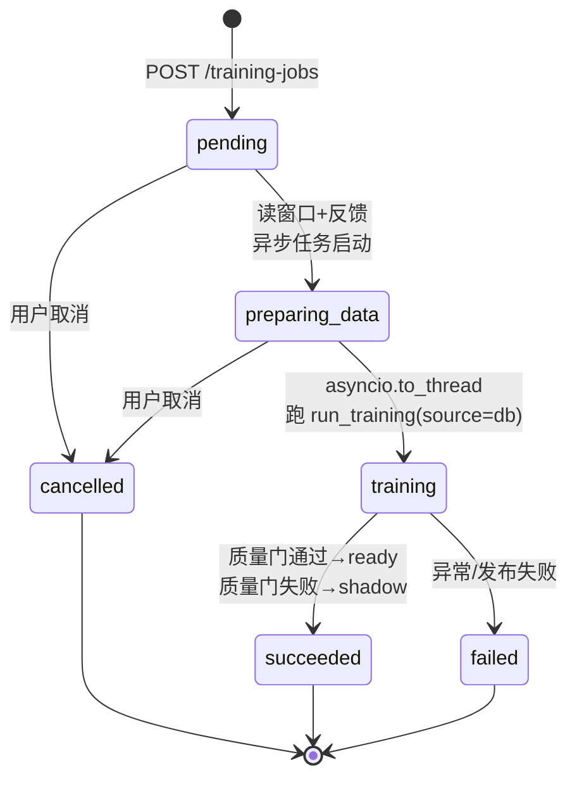

关键机制（全部在 `training_job_service.py`）：

- **每进程最多一个训练任务**：`asyncio.Lock` 守护（`training_job_service.py:134`），并发起第二个任务返回 409。
- **状态推进**：`pending` → `preparing_data`（从库读窗口 + 反馈，拼出 `feedback_with_times`，`training_job_service.py:283-306`）→ `training`（把 CPU 密集的 `run_training` 丢进线程池 `asyncio.to_thread`，`training_job_service.py:316`，不阻塞事件循环）→ `succeeded` / `failed`。
- **取消窗口**：只在 `pending` / `preparing_data` 可取消；一进入 `training`，取消被拒绝（409），因为后台线程可能已经在 `save_all(activate=True)` 写激活制品了（`training_job_service.py:12` 注释讲得很清楚）。
- **发布失败 == 训练失败**：如果质量门通过、`model_mode == "ready"`，但把新模型挂到 `app.state.v2_model_manager` 失败，抛 `PublicationError`，任务状态是 `failed` 而非 `succeeded`（`training_job_service.py:334-341`、`:348`）。
- **任务状态是内存态**：`_current: _JobState | None` 只活在进程内存里（`training_job_service.py:135`），进程重启后看不到历史任务——CLAUDE.md 里明确写了这条 caveat。

`run_training()` 本身（`pipeline.py:73`）是纯函数式入口：`source="synthetic_v2"` 生成数据跑通管线，`source="db"` 读真实窗口训练。两种来源最终都汇入 `_run_v2_training()`（`pipeline.py:164`）：准备训练数据 → 显式样本切分 → `evaluate_v2_candidates` 做按日期分组的交叉验证 → `evaluate_v2_quality_gate` 判定是否激活 → `ModelManager.save_all(activate=...)` 落盘带版本号的模型文件（`train-*.pkl`）+ 写一份 `training_report.json`。

---

## 3.9 给复刻者的最小骨架

如果你要从零复刻"训练数据"这一层，顺序是：

```
1. 建表：activity_events / interaction_buckets / browser_segments / behavior_feature_windows / focus_sessions / focus_session_feedback（照 0001、0007 迁移抄）
2. 切窗：写一个 5 分钟对齐的 rollup，把原始事件聚成 24 维特征 JSON
3. 防抖：实现 count_confirmed_switches（驻留 10 秒 + 忽略瞬态进程）
4. 标签：反馈 1-5 分 → 1/0/None；未覆盖窗口用 _weak_label 兜底
5. 匹配：时间重叠 join 窗口与反馈，产出 (X, y, weight)
6. 就绪度：统计 7 项门（天数/反馈数/类别数 + 4 项训练后指标）
7. 合成数据：画像 + 拖延发作 → 生成窗口和反馈，用于跑通管线
8. 作业：asyncio.Lock 单任务 + 状态机，CPU 训练丢 to_thread
```

每步对应本章一个小节，遇到"为什么这样设计"回看 3.2–3.8 的比喻即可。

---

## 3.10 本章要点速记

- **训练样本 = `behavior_feature_windows`（5 分钟 × 24 维特征）**；**标签 = `focus_session_feedback`（1–5 分映射成 1/0）**；二者靠**时间重叠**配对，不是 SQL join。
- 特征分四组：行为、键鼠交互、浏览器、时间。切换计数必须防抖（驻留 10s + 忽略瞬态进程），否则模型被系统噪音污染。
- 显式反馈是金标准；V2 `_weak_label` 只做兜底和剔除"说不清"窗口，**当前训练只用显式样本**。
- 两套门：训练前 **readiness 7 门**管数据充分性（不够 → 412）；训练后 **质量门**管模型够不够格（不过 → shadow 不激活）。
- 合成数据（30 画像 × 6 拖延类型）解决冷启动，但**上线只看真实数据 + 质量门**。
- 没模型不可怕：`FocusPrediction` 用 status 表达一切异常，系统回落到规则引擎，永远可用。
- 训练作业状态机：`pending → preparing_data → training → succeeded/failed`，仅前两态可取消，发布失败即失败。

---

# 第 04 章 ML 训练方法与模型

> 目标读者：**从未写过项目的人**。读完本章应能回答：MindFlow 到底训练了什么模型？每个模型内部是什么算法、优化什么目标？质量门怎么算？以及**如何在自己机器上复刻这套训练**。
> 前置：`03-training-data.md`（特征窗口与标签从哪来）；后续衔接：`05-langgraph.md`（ML 输出作为 LLM 证据）。
> 本章所有算法论断均来自 `backend-next/src/mindflow/train/` 与 `services/prediction_service.py` 源码，并标注 `file:line`。

---

## 4.1 一句话定位

MindFlow 不是"一个大模型"，而是 **4 类可解释的经典机器学习模型 + 1 套诚实的质量门**，全部本地训练、本地推理：

| 模型 | 文件 | 用途 | 有无监督 |
|------|------|------|---------|
| 分类器（RF / RF+XGB 集成） | `train/models/classifier.py`、`ensemble.py` | 判断"这个 5 分钟窗口是专注还是分心" | 监督（显式反馈标签） |
| 行为聚类（DBSCAN / KMeans） | `train/models/clustering.py` | 把行为模式聚成 5 种状态（深专注/浅工作/浏览/拖延/空闲） | 无监督 |
| 状态转移 HMM（CategoricalHMM） | `train/models/hmm.py` | 学习状态之间"今天会怎样转移"的概率 | 无监督（拟合聚类标签序列） |
| 逻辑回归基线 | `train/v2.py`（评估用） | 只用来当"及格线"，不参与上线 | 监督 |

训练管线把这三类模型**一次 `train_all()` 全部训好**，`ModelManager` 统一管理版本、签名、加载。推理时真正上线的是**分类器的 `predict_proba` 概率**（第 4.8 节），聚类和 HMM 更多是"行为画像"与状态推断，供报告和解释使用。

#### 图 4-1：训练与推理全链路

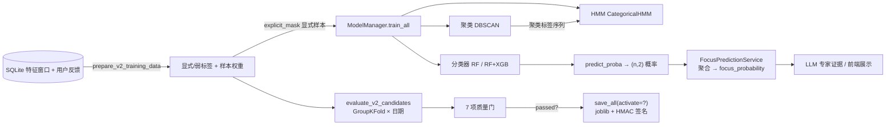

---

## 4.2 训练数据长什么样：先看喂进去的"表格"

训练不是拿原始事件直接训，而是先 rollup 成**固定 24 列的特征窗口**（`src/mindflow/domain/feature_schema.py:15-40` 定义了唯一的 24 列词汇表）：

| 列号 | 特征名 | 含义（一句话） | 列号 | 特征名 | 含义 |
|:--:|------|------|:--:|------|------|
| 0 | `app_switch_count` | 窗口内切换应用次数 | 12 | `audible_browser_ratio` | 有声浏览器占比 |
| 1 | `domain_switch_count` | 切换域名次数 | 13 | `active_seconds_ratio` | 有活动秒数占比 |
| 2 | `longest_segment_ratio` | 最长连续段占比 | 14 | `top_app_ratio` | 最常用应用占比 |
| 3 | `idle_ratio` | 空闲时间占比 | 15 | `top_domain_ratio` | 最常用域名占比 |
| 4 | `keypress_rate_per_min` | 每分钟按键数 | 16 | `interaction_interval_mean_s` | 交互间隔均值(s) |
| 5 | `mouse_click_rate_per_min` | 每分钟点击数 | 17 | `interaction_interval_std_s` | 交互间隔标准差 |
| 6 | `scroll_rate_per_min` | 每分钟滚动数 | 18 | `interaction_interval_cv` | 交互间隔变异系数 |
| 7 | `mouse_distance_per_min` | 每分钟鼠标位移 | 19 | `hour_sin` | 小时的正弦编码 |
| 8 | `input_active_ratio` | 有输入活动占比 | 20 | `hour_cos` | 小时的余弦编码 |
| 9 | `interaction_bursts_per_min` | 交互爆发次数/分 | 21 | `weekday_sin` | 星期的正弦编码 |
| 10 | `click_key_ratio` | 点击/按键比值 | 22 | `weekday_cos` | 星期的余弦编码 |
| 11 | `browser_ratio` | 浏览器时间占比 | 23 | `task_type_code` | 任务类型编码(0-10) |

**标签怎么来**（详见 `03-training-data.md`）：用户对"这段时间我专注吗"打 1-5 分的反馈，按**时间重叠**（`_overlap_seconds > 0`，`v2.py:352-353`）匹配到特征窗口上——反馈得分 `>=4 → 标签 1（专注）`，`<=2 → 标签 0（分心）`，`=3 或 mixed → 无标签`（`v2.py:327`）。有显式标签的窗口权重为 `1.0`；没有反馈的窗口用一个 3 条规则的弱监督函数打"弱标签"，权重只有 `0.3`（`v2.py:121-136`）：

```python
# _weak_label，3 条启发式  [v2.py:364-375]
if idle > 0.8:            return -1   # 太闲，判"混合"，后续会被丢弃
if app_switch_count > 20: return 0    # 疯狂切换 → 分心
if (top_app_ratio > 0.7 and input_active_ratio > 0.3) \
   or (app_switch_count < 5 and top_app_ratio > 0.5):
    return 1                          # 长时间停留一个应用 → 专注
return -1                             # 拿不准 → 混合，丢弃
```

> **重要发现（务必知道）**：虽然 `prepare_v2_training_data` 算了弱标签，但 V2 训练管线在 `pipeline.py:177-186` 用 `explicit_mask` **只取显式样本**喂给训练和评估。也就是说**弱标签在这个版本实际没进训练**——它只影响就绪度报告里的统计量。复刻时你可以暂时忽略弱标签，把精力放在"让用户反馈天数足够多"上。

---

## 4.3 模型一：专注/分心分类器

### 4.3.1 用什么算法、什么参数

代码里有两个分类器类，接口完全一样，`ModelManager` 按是否装了 xgboost 二选一：

**`FocusClassifier`**（`classifier.py:24-26`）：scikit-learn 的 `RandomForestClassifier`

```python
self.model = RandomForestClassifier(
    n_estimators=100, max_depth=10, random_state=42, n_jobs=-1
)
```

**`EnsembleClassifier`**（`ensemble.py:42-52`）：随机森林 + XGBoost，软投票集成

```python
_RF_PARAMS = {"n_estimators": 100, "max_depth": 10, "random_state": 42, "n_jobs": -1}
_XGB_PARAMS = {
    "n_estimators": 100, "max_depth": 6, "learning_rate": 0.1,
    "objective": "binary:logistic", "random_state": 42, "verbosity": 0,
}
```

**软投票**就是"两个模型各自输出一个概率，取平均"（`ensemble.py:115-119`）：

```python
return (rf_proba + xgb_proba) / 2.0   # 逐元素平均 → argmax 得最终类别
```

如果没装 xgboost，`EnsembleClassifier` 自动退化成"只有随机森林"（`ensemble.py:58-63`），`predict`/`predict_proba` 依然正常工作——这是全项目"永远可用"哲学的又一次体现。

**标准化**：每个分类器都带一个 `StandardScaler`，训练时 `fit_transform`、推理时 `transform`（`classifier.py:49,56`）。24 维特征里既有"次数"又有"占比"，量纲差异大，树模型其实不太需要标准化，但保留 scaler 让特征贡献可比较，也为逻辑回归基线复用同一套预处理。

### 4.3.2 优化什么目标（损失函数）

- **随机森林**：代码没有显式指定 `criterion`，因此用的是 sklearn 默认 **`criterion="gini"`**。每棵树在每个节点贪心选择"让 Gini 不纯度下降最多"的特征切分；森林把 100 棵树（每棵只在随机特征子集、随机样本上训练）的投票平均。它没有单一的全局可微损失——目标是"通过递归切分把节点纯度最大化"，等价于最小化分类错误/不纯度。
- **XGBoost**：`objective="binary:logistic"` 明确指定优化**二元对数损失（log loss / 二元交叉熵）**
  `L = -[y·log(p) + (1-y)·log(1-p)]`，用梯度提升（每轮加一棵树拟合负梯度）最小化它。
- **软投票集成**：没有自己的损失——它只是把两个模型的概率取平均，相当于假设两个模型独立、误差互补。

> 知识卡片（sklearn 文档事实）：`RandomForestClassifier` 默认 `criterion='gini'`；`XGBClassifier` 的 `objective='binary:logistic'` 意味着内部优化的度量是 `logloss`。

### 4.3.3 输入输出与样本量

| 项目 | 值 |
|------|-----|
| 输入 X | `(n_samples, 24)` 浮点矩阵，列序必须等于 `V2_FEATURE_NAMES` |
| 标签 y | `(n_samples,)` 整数，`1=专注`，`0=分心` |
| `predict` 输出 | `(n_samples,)` 类别标签 |
| `predict_proba` 输出 | `(n_samples, 2)`，第 1 列是"分心"概率，**第 2 列是"专注"概率** |
| 最少训练量 | 代码硬门槛：`>= 2` 个类别 **且** `>= 10` 个样本（`manager.py:165`） |

### 4.3.4 生活比喻

> 随机森林 = **召集 100 个"刚看完同一批证据的陪审员"，每人随机只看了部分特征，各自举手投票，最后少数服从多数**。XGBoost = 一个"会从错误中学习的学生"：先猜一遍，把猜错的重重标记，下一轮专门学错题，100 轮下来越来越准。集成软投票 = **两个独立老师给同一份卷子各打一个"像不像专注"的分数，最后取平均**——一个老师看走眼时，另一个还能兜住。

---

## 4.4 模型二：行为模式聚类

### 4.4.1 用什么算法、什么参数

`BehaviorClustering`（`clustering.py:31-56`），默认 `method="dbscan"`，可选 `"kmeans"`：

```python
# DBSCAN：eps 和 min_samples 都是自动算的  [clustering.py:49-53]
eps = max(0.5, sqrt(n_features) * 0.5)          # 24 维 → eps=2.45
min_samples = max(3, int(len(X) * 0.02))        # 样本数 2% 但至少 3
self.model = DBSCAN(eps=eps, min_samples=min_samples, metric="euclidean")

# KMeans（降级分支）：簇数 = sqrt(样本数)，封顶 5  [clustering.py:55-56]
n_clusters = min(5, max(2, int(sqrt(len(X)))))
self.model = KMeans(n_clusters=n_clusters, random_state=42, n_init=10)
```

DBSCAN 不需要预先指定簇数，靠"密度"发现任意形状的簇，还能把离群点标成 `-1`（噪声）——很适合行为数据里"今天特别乱"的异常时段。auto-eps 的思路：高维空间里点与点距离变大，`eps` 随维数开方放大。

**簇的"命名"是事后根据质心特征打上的**：先按 `_compute_focus_score(质心)` 给每个非噪声簇算一个 0~1 的专注分（`clustering.py:110-135`，比例特征加权求和），再按分数从高到低排，依次贴上 `deep_focus → shallow_work → browsing → procrastination → idle`（`clustering.py:95-108`）。

### 4.4.2 优化什么目标

- **DBSCAN**：**没有任何损失函数**——它不是优化算法，而是"密度连通"的几何规则：某点周围 `eps` 半径内超过 `min_samples` 个点就成簇，孤立点算噪声。这也是它能找出"异常时段"的原因。
- **KMeans**（降级分支）：内部用 Lloyd 算法最小化 **惯性（inertia）= 簇内平方和** `Σ ||x - μ_c||²`，即让每个点到它所属簇中心距离的平方和最小。

> 知识卡片：DBSCAN 的复杂度最坏 O(n²)；KMeans 是 O(n·k·iter)。样本只有几百个窗口时两者都快到可忽略。

### 4.4.3 输入输出

| 项目 | 值 |
|------|-----|
| 输入 | `(n_samples, 24)` 特征矩阵（无监督，不需要标签） |
| `fit` 返回 | `list[BehaviorCluster]`（`cluster_id, label, centroid_features, sample_count, avg_focus_score`） |
| `predict` 输出 | `(n_samples,)` 簇 ID；DBSCAN 的预测用"最近质心"近似（`clustering.py:137-157`，因为 DBSCAN 本身不支持 predict） |

### 4.4.4 生活比喻

> DBSCAN = **在一个房间的人群里，谁跟谁站得近就自动聚成一堆，站得特别远的人单独标成"怪人"**。它不需要你事先说"应该有 5 堆"。KMeans = **把人群按"离哪个代表最近"分到几个组，然后不断移动代表直到分法稳定**。

---

## 4.5 模型三：行为状态 HMM

### 4.5.1 用什么算法、什么参数

`BehaviorHMM`（`hmm.py:20-55`），5 个状态：`deep_focus / shallow_work / browsing / procrastination / idle`：

```python
from hmmlearn import hmm
self.model = hmm.CategoricalHMM(
    n_components=self.n_states,   # 5
    random_state=42, n_iter=100, tol=1e-4,
)
self.model.fit(X, lengths)        # X 是 (总观测数,1) 的状态序列，lengths 是每段长度
```

训练数据从哪来：`ModelManager.train_all` 把聚类的标签序列当作 HMM 的观测序列（`manager.py:223-227`）：

```python
def _build_state_sequences(self):
    if self.clustering.labels_ is None or len(self.clustering.labels_) < 2:
        return []
    return [self.clustering.labels_.astype(int)]   # 整条聚类标签序列 = 一个"句子"
```

**降级链**（`hmm.py:39-52`）：hmmlearn 没装 → `model=None`，但 `_compute_transition_matrix` 已经先算好了纯 NumPy 的**马尔可夫转移矩阵**（按相邻状态转移计频、行归一化，`hmm.py:57-76`），照样能预测下一步。取转移概率时三层兜底：hmmlearn 的 `transmat_` → 马尔可夫矩阵 → 均匀分布（`hmm.py:124-137`）。稳态分布用转移矩阵的特征向量算出（`hmm.py:145-155`）。

### 4.5.2 优化什么目标

`CategoricalHMM.fit` 内部跑的是 **Baum-Welch 算法（即 EM / 前向后向算法）**，目标函数是**最大化观测序列在模型下的（边际）对数似然** `log P(观测序列 | A, B, π)`——A 是转移矩阵，B 是发射概率，π 是初始分布。E 步用前向后向算出"每个时刻处于每个隐藏状态"的期望，M 步用这些期望重估 A/B/π，迭代到 `n_iter=100` 或参数变化小于 `tol=1e-4` 停止。

> 需要说明：当前代码用 HMM 时主要取的是 `transmat_`（转移矩阵）来预测"下一个状态是什么"，发射概率的作用不大。这是复刻时可以直接简化的部分。

### 4.5.3 输入输出

| 项目 | 值 |
|------|-----|
| `fit` 输入 | `list[一维数组]`，每个数组是一段状态 ID 序列（0~4 整数） |
| `predict_next_state(s)` | 输入当前状态 ID，输出 `{next_state, probabilities, next_state_name}` |
| 最少观测 | `len(X) >= 10` 才训练 hmmlearn 模型（`hmm.py:43`），否则纯马尔可夫矩阵兜底 |

### 4.5.4 生活比喻

> HMM = **你只能看到一个人每天的"外在表现"（在用哪个软件），想反推他"真实的心理状态"（专注？摸鱼？），并预测他下一秒会切到哪**。CategoricalHMM 学的就是"每种真实状态之间转移的概率"和"每种真实状态产生哪种表现的概率"这两个隐变量模型。马尔可夫降级版 = **只统计"上一个状态 → 下一个状态"的经验频率，不猜隐藏心情**，更粗糙但绝不会失败。

---

## 4.6 训练流程：切分、标准化、类别不平衡

### 4.6.1 整体流程（`pipeline.py` 的 `run_training`）

```
合成/真实特征窗口 + 反馈
  → prepare_v2_training_data（时间重叠匹配 → 显式/弱标签 + 权重）   [v2.py:66]
  → 只取显式样本做训练与评估                                        [pipeline.py:177-186]
  → evaluate_v2_candidates（日期 GroupKFold 交叉验证）               [v2.py:168]
  → evaluate_v2_quality_gate（7 项质量门）                           [v2.py:289]
  → 过门则 ModelManager.train_all（聚类+分类器+HMM 一次训好）         [pipeline.py:200-230]
  → save_all(activate=过门与否) → shadow/ready
```

### 4.6.2 数据切分：**按日期**的 GroupKFold（不随机打乱！）

评估用 `GroupKFold`，**group 是日期字符串**（`v2.py:186-190`）：

```python
groups = np.array(dates)
gkf = GroupKFold(n_splits=min(TRAIN_CONFIG.group_folds, len(unique_dates)))  # group_folds=4
```

为什么要按日期分组而不是随机切？**因为同一用户的相邻窗口高度相关（自相关）**。如果随机切，模型会在"看见邻居"的情况下作弊，测试分数虚高。按日期分组保证**测试集整天的数据训练时完全没见过**——这是"能不能泛化到明天"的诚实考试。

每个 fold 内部都做三件事，且**三个基线都在同一个留出测试集上算**（`v2.py:200-240`）：

| 选手 | 用什么 | 目的 |
|------|--------|------|
| 候选模型 | `EnsembleClassifier`（生产同款） | 我们的正式模型 |
| 逻辑回归基线 | `StandardScaler + LogisticRegression(max_iter=1000, class_weight="balanced")`（`v2.py:222`） | 简单线性模型能否做到 |
| 规则基线 | 3 条规则的 `_rule_probabilities`（`v2.py:378-384`） | 不学习、只查表的下限 |

规则基线的公式（列号对应第 4.2 节表格）：
```
p = 0.5
if app_switch_count < 5:   p += 0.2     # 几乎不切换 → 像专注
if top_app_ratio > 0.7:    p += 0.15    # 80% 时间在同一个 app → 像专注
if app_switch_count > 20:  p -= 0.3     # 疯狂切换 → 像分心
if idle_ratio > 0.8:       p -= 0.1     # 快睡着了 → 像分心
p = clip(p, 0, 1)
```

### 4.6.3 类别不平衡

- 正式分类器：**没有**显式 `class_weight`（RF/XGB 不传）——但训练只用显式反馈样本，而显式反馈天然是"用户愿意评分的窗口"，专注/分心通常都比较均衡。真要失衡时，样本权重（显式=1.0）会让少数类不那么吃亏。
- 逻辑回归基线：显式传了 `class_weight="balanced"`（`v2.py:222`），即按类别频率反比加权，专门防失衡。
- 评估指标也为此选了**对失衡鲁棒**的 `balanced_accuracy`（各类别召回的平均）和**少数类 F1**，而不是普通 accuracy。

### 4.6.4 评估指标（QA 读什么数字）

`_classification_metrics`（`v2.py:387-409`）在每个 fold 的测试集上输出：

| 指标 | 定义 | 门限 |
|------|------|------|
| `balanced_accuracy` | `balanced_accuracy_score` = 各类别 recall 的均值 | `>= 0.55` |
| `minority_f1` | 少数类（样本少的那个类别）的 F1 | `>= 0.40` |
| `brier_score` | Brier 分数 `Σ(p_i - y_i)²/n`，衡量**概率校准**（越小越好） | `<= rule_brier + 0.01` |
| `roc_auc` / `average_precision` | 只当二分类时输出（`v2.py:401-406`） | 参考 |
| `confusion_matrix` | 2×2 混淆矩阵 | 参考 |
| `calibration` | 把 `[0,1]` 分成 10 个桶，每桶算"平均预测概率 vs 实际正例比例"（`v2.py:412-431`） | 参考 |

### 4.6.5 两个关键质量门的具体算法

**`calibration_better_than_rule`**（`v2.py:305`）——"校准优于规则引擎"：
```python
"calibration_better_than_rule": candidate_brier <= rule_brier + 0.01,
```
即候选模型的 Brier 分数必须**不超过规则基线 + 0.01**。逻辑：Brier 惩罚"过度自信"（预测 0.9 但实际是 0 会记大分）。这个门保证：机器学习至少不比"不学习的规则查表"差，才允许上线。

**`stable_date_folds`**（`v2.py:270-275`）——"日期折叠稳定性"：
```python
fold_stability = {
    "passed": bool(
        min_fold_balanced_accuracy >= 0.50      # 最差的那个 fold 也不能低于 0.50
        and (max - min) <= 0.35                  # fold 之间波动不能超过 0.35
        and min_test_size >= 5                    # 每个测试 fold 至少 5 个样本
    ),
}
```
逻辑：即使平均指标好看，如果某一天的数据上模型完全失灵（个别 fold 崩盘），也说明不稳定。这个门用**最差 fold + 波动幅度**惩罚"只在部分日子灵"的模型。

**全部 7 项门**（`v2.py:299-311`）汇总：

| 门 | 阈值 | 防什么 |
|----|------|--------|
| `minimum_days` | 显式反馈天数 `>= 7` | 数据覆盖太少、只有一两天 |
| `minimum_explicit_feedback` | 显式反馈会话数 `>= 20` | 样本量不足统计意义 |
| `minimum_class_feedback` | 专注 `>= 5` 且 分心 `>= 5` | 类别单边倒 |
| `balanced_accuracy` | 候选 `>= 0.55` | 模型整体不行 |
| `minority_f1` | 候选 `>= 0.40` | 少数类被无视 |
| `calibration_better_than_rule` | Brier `<= 规则 + 0.01` | 模型不如规则引擎 |
| `stable_date_folds` | 见上式 | 只在个别日子灵 |

> **文档过期提示**：`docs/api/model-training.md` 里还写着这两个门是 `not_implemented`、schema 还是 v2——那是 2026-07-31 之前的状态。代码（`v2.py:289-311`）已经是**真实现**，特征 schema 也已是 **v3**（`feature_schema.py:13`）。读文档时以代码为准。

---

## 4.7 模型版本管理：joblib + HMAC 签名 + latest.json

`ModelManager`（`manager.py`）是全项目的"模型仓库"。它解决了旧后端"固定文件名导致无法回滚"的 P1 缺陷。

### 4.7.1 版本命名

`save_all` 用一个**时间戳 + 随机后缀**做版本号（`manager.py:101-105,242`），保证同一天训练多次互不覆盖：

```python
tag = datetime.now(UTC).strftime("%Y%m%d_%H%M%S") + "_" + secrets.token_hex(3)
# 例：20260804_153012_ab12cd
```

三个文件分别是 `clustering-{tag}.pkl`、`classifier-{tag}.pkl`、`hmm-{tag}.pkl`。HMM 比较特殊，不存 sklearn 对象，只存 `{transition_matrix, state_names, n_states, is_fitted}` 字典（`manager.py:257-267`）。

### 4.7.2 序列化与安全签名

- 序列化用 **`joblib.dump`**（pickle 的工业版，对 numpy 数组更高效）（`manager.py:254-267`）。
- 每个 `.pkl` 旁写一个 **HMAC-SHA256 签名**文件 `{file}.pkl.hmac`（`serialization.py:86-94`）。加载前**先验签、后 load**（`manager.py:409-417`）：签名缺失或不匹配直接抛 `ModelSignatureError` 拒绝加载。
- 为什么要这么做？pickle 加载=任意代码执行。`models/` 目录是用户可写目录，任何本机进程（或被入侵的浏览器插件）都能往里面丢一个构造好的 `.pkl`，下次加载就中招。HMAC 保证"**只有持有签名密钥的进程写出来的文件才被信任**"（`serialization.py:1-23`）。
- 加载时把 `InconsistentVersionWarning` 当作错误处理——**scikit-learn 版本不匹配的旧模型宁可拒绝也不带病上岗**（`manager.py:419-421,439-441`）。
- 分类器反序列化靠一个 `"__class__": "EnsembleClassifier"` 标记分发到正确的类（`manager.py:426-429`）。

### 4.7.3 latest.json 指针与回滚

```json
{
  "clustering": "clustering-20260804_153012_ab12cd.pkl",
  "classifier": "classifier-20260804_153012_ab12cd.pkl",
  "hmm": "hmm-20260804_153012_ab12cd.pkl"
}
```

`latest.json` 只记录"当前激活的是哪个版本"（`manager.py:290-299`）。回滚 = 把指针改回旧文件名（`manager.py:369-387`），文件本身永不删除。CLI 提供了 `--list-versions` / `--rollback YYYYMMDD`（`__main__.py:297-320`）。

---

## 4.8 推理链路：概率 → 专注分数 → 要不要信

推理的"唯一入口"是 `FocusPredictionService`（`services/prediction_service.py`），所有消费方（LLM 证据、Telemetry API、聊天工具）都用它，保证一致。

### 4.8.1 步骤

1. **取窗口**：拉最近 2 小时（`_LATEST_LOOKBACK_S = 7200`，`prediction_service.py:40`）该用户的 v2 特征窗口。
2. **校验**：构建 `(n,24)` 矩阵，检查 3 件事——列数必须 24、模型 `feature_names_` 必须等于当前 `V2_FEATURE_NAMES`、不允许 NaN/Inf（`prediction_service.py:281-313`）。任一不过就返回对应状态，**绝不抛异常**。
3. **批量推理**：`classifier.predict_proba(matrix)`（`prediction_service.py:322`）→ `(n,2)`，取**第 2 列 = 专注概率**。
4. **聚合**（`prediction_service.py:334-338`）：
   - `focus_probability = mean(专注概率)`  —— 这就是 ML 版的"专注分数"，范围 [0,1]
   - `uncertainty = mean(1 - |2p - 1|)`  —— 越接近 0.5 越没把握，不确定性越高
   - `distracted_window_ratio = mean(p < 0.5)` —— 分心窗口占比
5. **新鲜度判定**（`prediction_service.py:383-388`）：最新窗口太旧（`> STALE_THRESHOLD_S = 900` 秒，`prediction.py:71`）或覆盖率不足（`< MIN_COVERAGE_RATIO = 0.3`，`prediction.py:74`）→ 状态降级为 `stale`。**数据不新鲜时宁可说"过期"也不拿旧结论骗你**。

### 4.8.2 澄清：`calculate_focus_score` 与 ML 概率是两个东西

任务清单里提到的 `calculate_focus_score` 现在叫 **`focus_score`**（`domain/features.py:285-330`），是**规则版、事件级的 0-100 分数**，公式：

```
focus_score = top_app_ratio × 60  +  (1 − switch_penalty) × 40
switch_penalty = min(切换次数/小时 ÷ 30, 1.0)      # MAX_ACCEPTABLE_SWITCHES_PER_HOUR=30
结果裁剪到 [0,100]
```

它用在**规则证据、干预判定**（`evidence_service.py`、`intervention_service.py`）这些不走 ML 的路径。而 **ML 推理输出的是 0~1 的专注概率**（`prediction_service` 的 `focus_probability`）。两者并存：ML 模型没训好时（`no_model` 状态），系统退回规则引擎，依然能给出 0-100 的 `focus_score`——这就是"三层降级"里 ML 层和规则层的分工。

---

## 4.9 从零复刻路径（给初学者）

### 4.9.1 装什么

`backend-next/pyproject.toml:48-55` 列出 ML 依赖：

```
scikit-learn>=1.4      # 随机森林 / DBSCAN / KMeans / 逻辑回归 / StandardScaler / GroupKFold
xgboost>=2.0           # 集成里的 XGBClassifier
hmmlearn>=0.3          # CategoricalHMM
numpy>=1.26            # 张量操作
joblib>=1.3            # 模型序列化
shap>=0.44             # 可选，可解释性（ModelExplainer）
```

最省事的装法（项目用 uv）：

```bash
cd mindflow-app/backend-next
uv sync --extra dev --extra ml          # 一次装齐
```

### 4.9.2 跑什么

```bash
# 1) 先用合成数据验证整条管线（不需要真实数据，约 30 秒）
uv run python -m mindflow.train --source synthetic_v2 --days 14

# 2) 看有哪些模型版本
uv run python -m mindflow.train --list-versions

# 3) 真实数据训练（从 SQLite 读特征窗口 + 反馈）
uv run python -m mindflow.train --source db

# 4) 跑全部测试确认没破坏
uv run python -m pytest tests/ -q
```

合成数据路径会生成 **30 种学生原型**（大一 CS、研三医学…）各 14 天的 5 分钟特征窗口（`synthetic_v2.py`），窗口结构长这样：

```json
{
  "window_start_utc": "2026-07-29T10:05:00+00:00",
  "window_end_utc": "2026-07-29T10:10:00+00:00",
  "feature_schema_version": 3,
  "features": {
    "app_switch_count": 3.0,
    "idle_ratio": 0.05,
    "top_app_ratio": 0.82,
    "hour_sin": -0.59,
    "...其余 24 维省略...": 0.0
  },
  "label": 1
}
```

### 4.9.3 想完全自己写（不抄代码），最小骨架

```python
import numpy as np
from sklearn.ensemble import RandomForestClassifier
from sklearn.preprocessing import StandardScaler
from sklearn.model_selection import GroupKFold

# 1. 特征矩阵 (n, 24) 与标签 (n,)，dates 是同长字符串列表
X = np.random.rand(200, 24)
y = np.random.randint(0, 2, 200)
dates = [f"2026-0{(i % 14)+1:02d}-01" for i in range(200)]

# 2. 按日期分组交叉验证，避免"看见邻居"
gkf = GroupKFold(n_splits=4)
for train_idx, test_idx in gkf.split(X, y, groups=dates):
    model = RandomForestClassifier(n_estimators=100, max_depth=10, random_state=42)
    model.fit(X[train_idx], y[train_idx])
    p = model.predict_proba(X[test_idx])[:, 1]   # 专注概率
    # 记录 balanced_accuracy / brier / minority_f1 ...

# 3. 质量门：只有 brier <= 规则基线+0.01 且 fold 最差>=0.50 才激活
```

### 4.9.4 样本量要求汇总（哪些数字是你复刻时能抄的阈值）

| 位置 | 门槛 | 源码 |
|------|------|------|
| 训练分类器 | `>= 2` 类 且 `>= 10` 样本 | `manager.py:165` |
| 训 HMM | `>= 10` 个观测 | `hmm.py:43` |
| 做评估 | `>= 10` 显式样本 且 `>= 3` 个反馈日 | `v2.py:175-184` |
| 通过质量门 | `>= 20` 显式反馈会话、`>= 7` 天、每类 `>= 5` | `v2.py:299-311` |
| 激活上线 | 全部 7 项门通过 → `mode=ready`，否则 `shadow` | `pipeline.py:214-229` |

---

## 4.10 关键发现与注意事项（写报告的人务必转述）

1. **两个分类器并存**：`FocusClassifier`（纯 RF）是为了兼容保留的；生产 V2 训练 Job 实际用 `EnsembleClassifier`（RF+XGB 软投票）。但 CLI `python -m mindflow.train` 构造 `ModelManager(use_ensemble=False)`（`__main__.py:295`），而服务化训练 `pipeline.py:201` 用 `use_ensemble=True`——**同一命令 CLI 与 Job 训练出的模型可能不同**（CLI 是 RF-only，Job 是集成）。复刻或写文档时不要混为一谈。
2. **弱标签当前未进训练**：`prepare_v2_training_data` 会生成低权重 V2 弱标签，但 `pipeline.py` 只取显式样本；旧 `ConsensusLabeler` 已在 V2 cutover 中删除。
3. **docs/api/model-training.md 已过期**：schema v2 → v3，`calibration_better_than_rule`/`stable_date_folds` 已从 `not_implemented` 变为真实验证（`v2.py:289-311`）。CLAUDE.md 的"Quality gates now implemented (2026-07-31)"与此一致。
4. **`feature_schema.py:12-13` 有重复赋值** `FEATURE_SCHEMA_VERSION = 2; = 3`，最终值是 3（Python 后赋值覆盖前值）。写法不优雅但行为正确。
5. **HMM 的"发射概率"基本没用上**：推理取的是 `transmat_`（转移矩阵）。真正想让 HMM 发威（推断隐藏状态序列），需要接入 `predict`/`decode` 接口——这是留给后续的增强点。
6. **模型安全是认真的**：joblib=pickle=任意代码执行，所以有 HMAC 签名 + sklearn 版本校验双重防线。初学者复刻时哪怕先不做签名，也要清楚这个风险面。

## 4.11 可复刻性自检

读完本章后，你应该能回答：

- 分类器用的是 sklearn 的什么类？参数是什么？XGB 的 `objective` 是什么？（`RandomForestClassifier(n_estimators=100, max_depth=10)`；`XGBClassifier(objective="binary:logistic")`）
- 随机森林优化什么？XGB 优化什么？KMeans 呢？HMM 呢？（Gini 不纯度 / 二元 log loss / 簇内平方和 / Baum-Welch 最大化观测对数似然）
- 数据怎么切分？（按日期 GroupKFold，4 折，不随机切）
- 为什么要有 `calibration_better_than_rule` 和 `stable_date_folds`？（前者防止"ML 不如规则引擎"还上线，后者防止"只在部分日子灵"）
- 推理时 `predict_proba` 的第几列是专注概率？（第 2 列，索引 1）
- 模型文件怎么防篡改？（HMAC-SHA256 签名 + 版本一致性校验）

---

# MindFlow 后端技术解析 — 05 LangGraph 图结构

> 目标读者：从未写过项目的人。读完本章应能理解 MindFlow 后端用 LangGraph 搭的三张图（专家会诊、每日分析、对话），并能自己动手搭一个最小复刻版。
> 相关源码目录：`backend-next/src/mindflow/graph/`（图定义）、`backend-next/src/mindflow/agents/orchestrator.py`（兼容适配器）、`backend-next/src/mindflow/ports.py`（框架中立端口）。
> 依赖版本（`backend-next/pyproject.toml`）：`langgraph>=1.2,<2`、`langchain-core>=1.5,<2`。

---

## 5.1 LangGraph 是什么：一张"会转弯的流水线"

把一次分析流程想象成一条**工厂流水线**，LangGraph 帮你把这条流水线画成一张"图"，然后由引擎负责把工件按图搬运。

- **StateGraph（状态图）**：整张流水线的图纸。你只负责声明"有哪些工位、工位之间怎么连"，搬运由引擎做。
- **节点（Node）**：一个**工位**。每个工位是一段 Python 函数（`async def node(state) -> dict`），输入上一站送来的货物，加工后返回"对货物的修改"。MindFlow 里每个专家（分析师、归因专家、主持人、批评家）就是一个工位。
- **状态（State）**：工位之间传递的**货物**。在 MindFlow 里是一份 `TypedDict`（Python 的"带字段名的字典"），装着 `bundle_json`（证据包）、`attribution_opinions`（专家意见）、`moderator_verdict`（裁决）等。每个工位拿到整箱货，改完把"改动的部分"交回去，引擎负责合并。
- **普通边（Edge）**：**固定传送带**。`A → B` 表示 A 干完必定送到 B。
- **条件边（Conditional Edge）**：**分流闸**。由一个路由函数（如 `critic_verdict`）看货物当前状态，决定往哪条传送带送："批评家通过了→送去出口 END；没通过且重试次数还够→送回主持人重做；次数用尽→送去出口"。这就是 `graph.add_conditional_edges(node, router, {目标名: 节点名})` 干的事。
- **Reducer（归并器）**：**合流规则**。当多个工位**并行**把改动交回同一条传送带时（比如三个归因专家同时写 `attribution_opinions`），引擎不知道先到后到，于是调用你指定的 reducer 函数来合并：`reducer(当前值, 新改动) → 新值`。它是纯函数，要求**与到达顺序无关**——无论谁先谁后，最终结果一样。
- **Checkpointer（检查点）**：**全程录像**。每走完一个工位就把状态存一份快照，这样可以在任意节点中断、稍后恢复。默认不启用（见 5.6）。

**一句话总结**：节点是工位、状态是货物、边是传送带、条件边是分流闸、reducer 是合流时的合并规则、checkpointer 是录像机。

MindFlow 用这张图画了三张图：**PanelGraph**（专家会诊，最重要）、**AnalysisGraph**（每日分析的总指挥，内嵌 PanelGraph）、**ChatGraph**（对话）。下面逐一拆解。

---

## 5.2 PanelGraph：多专家会诊图（重点）

源码：`src/mindflow/graph/panel_graph.py`。它模拟"医生会诊"：一位数据分析师先看数据，三位不同理论流派的专家各自给意见，有分歧就辩论，主持人综合裁决，批评家最后把关。

### 5.2.1 精确拓扑图

图中节点名**与代码完全一致**（`PanelGraph.build()` 中 `graph.add_node(...)` 的名字）。

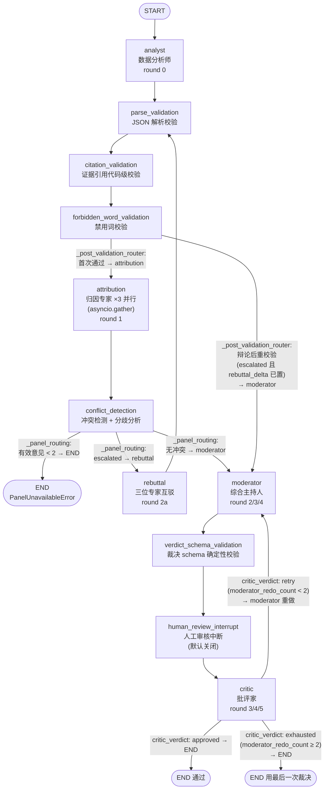

### 5.2.2 每个节点干什么

| 节点名 | 是否有 LLM 调用 | 职责 |
|--------|:---:|------|
| `analyst` | 是（1 次） | 让"数据分析师"读证据包 `bundle_json`，输出模式发现/异常；返回 `analyst_opinion`。内部顺带做引用校验，发现幻觉引用就整份标 `skipped` |
| `parse_validation` | 否 | 校验所有意见 JSON 是否解析成功（`skipped` 的留在原地），只统计不改变行为 |
| `citation_validation` | 否 | 对所有意见做**代码级**引用校验（`validate_citations`），引用不存在指标 → 整份标 `skipped` |
| `forbidden_word_validation` | 否 | 检查"诊断/治疗/患者/处方"等禁用词，命中 → 标 `skipped` |
| `attribution` | 是（3 次并行） | 用 `asyncio.gather` 同时让 CBT / TMT / 情绪调节三位专家各出一份 `ExpertOpinion`，作为 `attribution_opinions` 一并写回，由 reducer 合并 |
| `conflict_detection` | 否 | 纯函数：`detect_conflict` 看三位专家是否冲突，`analyze_disagreement` 算一致性分数；设置 `escalated` 与 `disagreement_summary` |
| `rebuttal` | 是（3 次并行） | 只在冲突升级时走：每个专家看到另两人的论证后重新输出（互驳）；算 `rebuttal_delta` 衡量共识是否收敛；有效意见仍 <2 就抛 `PanelUnavailableError` |
| `moderator` | 是（1 次） | 主持人综合分析师 + 归因专家 + 冲突报告，输出统一裁决 `moderator_verdict`；被打回重做时用 `_build_moderator_redo_prompt` 带上批评家的意见 |
| `verdict_schema_validation` | 否 | 在请批评家之前，先确定性地校验裁决 schema（类型枚举、置信度 0-1、类型数 ≤3），有错直接抛 `PanelUnavailableError` |
| `human_review_interrupt` | 否 | **可选**人工审核闸门：默认 `human_review_enabled=False` 时是 no-op；开启后当置信度过低或分歧过大时 `interrupt(...)` 挂起等人工审批（见 5.6） |
| `critic` | 是（1 次） | 批评家审查裁决：引用真伪、逻辑跳跃、过度诊断、禁词；`approved` 通过则终，否则把 `moderator_redo_count` +1 送回主持人 |

### 5.2.3 状态字段与 reducer 合流

`PanelGraphState`（`panel_graph.py`）是一份 `TypedDict(total=False)`，字段分三类：

1. **输入字段**：`bundle_json`（证据包 JSON）、`valid_metrics`（合法指标 ID 集合，供引用校验）。
2. **reducer 累积字段**（用 `Annotated[类型, reducer函数]` 声明，允许并行写入）：
   - `attribution_opinions: Annotated[tuple[ExpertOpinion, ...], _reduce_attribution_opinions]`
   - `transcript: Annotated[tuple[TranscriptEntry, ...], _reduce_transcript]`
3. **单写字段**（后写覆盖先写，last-write-wins）：`analyst_opinion`、`conflict_report`、`escalated`、`moderator_verdict`、`critic_result`、`critic_retries`、`moderator_redo_count`、`call_count`、`disagreement_summary`、`rebuttal_delta`。

**并行合流到底怎么发生？** 注意一个容易误会的点：`panel_graph.py` 的模块 docstring 写着 "Send fan-out / Send provides parallel attribution fan-out"，但实际代码**并没有用 LangGraph 的 `Send`**（全文件搜不到 `from langgraph.types import Send`）。真正的实现是：`attribution` 是一个**节点**，节点内部用 `asyncio.gather` 并发调用三个专家的 gateway，然后把三份意见打包成 `tuple` 一次写回状态。此时引擎会拿这个 tuple 去调 `_reduce_attribution_opinions`，该函数内部把 tuple 拆开、逐个套 `append_opinion`。

`append_opinion`（`reducers.py`）的合并规则是**按 `(role, perspective)` 排序 + 同键 upsert**：先用字典按排序键去重（同一位专家重写则覆盖），再 `sorted(...)` 排序输出。这样无论三个专家谁先返回，`attribution_opinions` 的最终顺序永远一致——这正是 reducer 要的"与到达顺序无关"。`append_transcript` 则是简单追加、不去重，因为"第几轮说了什么"是有顺序含义的。

### 5.2.4 关键路由逻辑

- `_post_validation_router`（挂在 `forbidden_word_validation` 之后）：若 `escalated=True` **且** `rebuttal_delta` 非空，说明刚辩论完重新过校验链，直接去 `moderator`；否则是首次通过，去 `attribution`。用"rebuttal 有没有跑过"来区分第一次和第二次经过校验链。
- `_panel_routing`（挂在 `conflict_detection` 之后）：先算 `minimum_valid_opinion_router`——有效意见 <2 就去 `unavailable` → END（整次会诊不可用，交由上层降级）；否则按 `conflict_router` 分流：有冲突 → `rebuttal`，无冲突 → `moderator`。
- `critic_verdict`（挂在 `critic` 之后）：`approved` → END；未通过且 `moderator_redo_count < 2` → `retry`（回 `moderator`）；重做满 2 次仍未通过 → `exhausted` → END（**最多重做 2 次**，配合预算封顶）。

### 5.2.5 与旧面板编排器的关系

`PanelGraph` 已成为唯一生产面板图。旧 `PanelOrchestrator` 类在 v2 cutover 中移除，`agents/orchestrator.py` 仅保留解析、引用校验和提示构造 helper；`AnalysisGraph.panel_graph_node` 直接调用 `PanelGraph.ainvoke(...)`。

---

## 5.3 AnalysisGraph：每日分析的总指挥图

源码：`src/mindflow/graph/analysis_graph.py`。它实现 `ports.py` 里的 `AnalysisWorkflowPort`（一个只有 `run_analysis(request) -> AnalysisResult` 的协议接口）。**端口（Protocol）的意义**：外层调度器只依赖这个接口，不依赖 LangGraph 本身——将来换掉引擎，调度器一行不用改（ADR-001/002）。

### 5.3.1 精确拓扑图

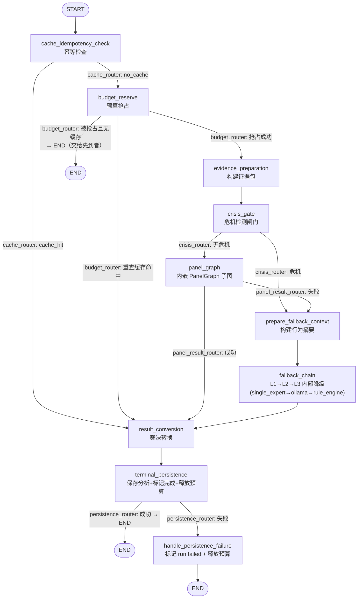

### 5.3.2 节点职责与"幂等 / 预算 / 危机 / 持久化"四道门

| 节点 | 职责 |
|------|------|
| `cache_idempotency_check` | **幂等门**：按 `{origin}:{user_id}:{date}:{analysis_kind}` 查 `analysis_repo.get_by_date`。命中且未 `force` → 直接走转换收尾；不同触发来源（scheduler/api/chat）用不同 key，互不阻塞但收敛到同一行存储 |
| `budget_reserve` | **预算门**：`BudgetReservationPort.try_reserve(key)` 底层是 `INSERT ... ON CONFLICT DO NOTHING`，**先到者得**。没抢到就重查一次缓存：若先到者已完成分析 → 走转换；若没完成 → 直接 END，绝不同时跑两份 |
| `evidence_preparation` | 把当天活动事件卷成 `EvidenceBundle`，产出 `bundle_json` 与 `valid_metrics` |
| `crisis_gate` | **危机门**：扫描事件文本里的危机关键词，命中 HIGH 危机 → 短路所有 LLM，直接进降级链的 `rule_engine` |
| `panel_graph` | 调用内嵌 `PanelGraph.ainvoke`；成功后取 `moderator_verdict` 当 `assessment`，失败（`PanelUnavailableError`）则 `panel_succeeded=False` 走降级 |
| `prepare_fallback_context` | 把事件构建成 `BehaviorSummary`，喂给降级链 |
| `fallback_chain` | 单节点内部顺序跑 L1→L2→L3（见 5.7），L3 永远成功，所以此节点必然产出结果 |
| `result_conversion` | 把 assessment dict 用 `analysis_dict_to_panel_verdict` 转成 `verdict_json` |
| `terminal_persistence` | **唯一终结持久化节点**：① upsert 分析（`ON CONFLICT DO UPDATE`，天然幂等）② 标记 workflow run `completed` ③ 释放预算。三件事都幂等，重复调用安全 |
| `handle_persistence_failure` | 持久化失败时把 run 标 `failed`（绝不让 run 卡在 `running`），并释放预算让 key 可重试 |

### 5.3.3 如何实现 AnalysisWorkflowPort

`AnalysisGraph.run_analysis(request)` 干四步：构造幂等 key → `save_run` 建 workflow run 记录 → 组装 `AnalysisRunContext`（把仓库、证据构建器、危机检测器、`PanelGraph`、降级依赖等**活引用**塞进 `runtime` 字段）→ `graph.ainvoke(initial_state)`。之后把 `final_state` 里的 `verdict_json` 或 `assessment` 转成 `PanelVerdict` 返回。异常兜底：任何异常都会把 run 标 `failed` 并返回空裁决。

**关键设计**：`AnalysisGraphState` 里有一个 `runtime: AnalysisRunContext` 字段装着仓库、HTTP 客户端等**不可序列化**的活对象，但它只存在于运行期、不参与检查点——这也是所有图都**默认不启用 checkpointer** 的根本原因之一（见 5.6）。`AnalysisRunContext` 各字段默认 `None`，方便测试时用 `state.get("runtime", AnalysisRunContext())` 兜底。

---

## 5.4 ChatGraph：对话生命周期图

源码：`src/mindflow/graph/chat_graph.py`。它把原来 LangChain `create_agent` 隐式完成的"工具循环"显式画成图，11 个节点，等价复刻 `ChatService.ask()` 的输出契约。

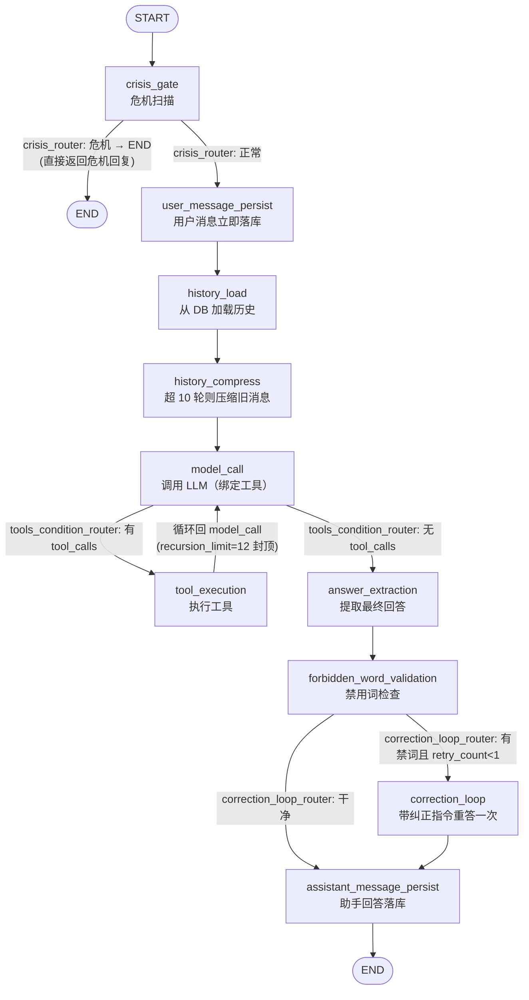

几个值得注意的点：

- **危机短路**：用户消息一旦命中 HIGH 危机，直接返回危机热线回复并 `degraded=True`，整个 LLM/工具循环都不走。
- **持久化的两个时机**：用户消息**先**落库（LLM 挂了也不丢用户消息），助手回答**后**落库（永远给用户一个回应）。
- **工具循环**：`model_call → tool_execution → model_call` 是一个显式循环。靠 `config={"recursion_limit": 12}` 封顶，防止 LLM 无限调用工具。
- **单会话串行化**：`ChatGraph.ask` 里 `self._session_locks.setdefault(session_id, asyncio.Lock())`，同一会话的多次提问串行执行，避免消息交错写库。
- **一次纠正**：回答含禁用词最多重答一次，再不行就换成安全兜底回复 `_SAFE_REPLY` 并 `degraded=True`。

---

## 5.5 预算机制：12 次 LLM 调用的硬上限

会诊不能让 LLM 无限烧钱，所以设了 `_MAX_CALLS = 12`（`panel_graph.py:69`；`types.py` 注释：`辩论≤1轮, 打回≤1次 → 最坏 12 次调用/会诊`）。

**实现**（`_call_with_budget`）：每次调 gateway 前，先 `async with runtime.budget_lock:` 加锁，`call_count += 1`，然后判断 `> _MAX_CALLS` 就抛 `PanelBudgetExceededError`。

这里有两个"并发安全"设计：

1. **`asyncio.Lock`**：三个归因专家用 `asyncio.gather` 并发跑，如果各自直接 `call_count += 1` 会有竞态（Python 单线程异步里 `+=` 两步之间可能被让出，但计数不是原子的）。锁把"读-加-判"做成原子操作，保证预算精确。
2. **`contextvars.ContextVar`**：这个 `runtime`（`_PanelRunContext`：`call_count` + `transcript` + `budget_lock`）不放在图的 State 里，而是放进 `_PANEL_RUNTIME` 这个 ContextVar，由 `PanelGraph.ainvoke` 在调用前 `set(runtime)`、`finally` 里 `reset(token)`。原因：状态要能被引擎合并/序列化，而 `asyncio.Lock` **不可序列化**；ContextVar 是"每个异步任务私有"的变量，天然隔离并发调用，两个会诊同时跑不会串计数。

**超了怎么办**：抛 `PanelBudgetExceededError`，由 `AnalysisGraph.panel_graph_node` 捕获后转为"面板不可用"，走降级链——不会静默返回半成品。正常路径大约 6 次调用（分析师 1 + 归因 3 + 主持人 1 + 批评家 1），冲突升级 +3，打回重做再 +2，上限 12 只有连续禁词重试才可能触顶。

---

## 5.6 Checkpointer：为什么默认不启用

**什么时候用**：`PanelGraph.build()` 里 `checkpointer = MemorySaver() if get_settings().human_review_enabled else None`。也就是说**只有当"人工审核中断"功能开启时**才用 `MemorySaver`（内存版检查点），否则传 `None` 不编译检查点。

**为什么**：

1. **中断需要检查点才能恢复**：`human_review_interrupt_node` 里的 `interrupt({...})` 会把图**挂起**、返回给调用方等人工输入。要"挂起后还能从原处接着跑"，引擎必须把挂起时的状态存起来（`MemorySaver` 存内存），恢复时用 `Command(resume=...)` 继续。没有检查点就没法中断恢复。
2. **避免序列化不可序列化对象**：图状态里塞着 `runtime`（仓库、HTTP 客户端、`asyncio.Lock`、`ContextVar` 等），检查点引擎（msgpack）序列化整个 state 时会炸。`state.py` 的模块 docstring 明确约束：状态字段只允许 `int/str/tuple/frozenset/dict` 与稳定值对象，**绝不允许** `asyncio.Lock`、model client、repository、ContextVar。既然默认不需要中断，干脆不启用，省掉这份序列化风险和性能开销。

`AnalysisGraph`、`ChatGraph` 同理：都 `graph.compile()` 不传 checkpointer。三个图里用的 `runtime` 全部走"调用时注入 + 存在 state.runtime 字段但不参与检查点"的模式。

---

## 5.7 fallback_nodes.py：降级路径节点

源码：`src/mindflow/graph/fallback_nodes.py`。它把三级降级链（L1 DeepSeek → L2 Ollama → L3 RuleEngine）从原来的 `LLMService` 抽成**独立可测试的图节点**：

- `single_expert_node`（L1）：调 DeepSeek，成功 → `source="deepseek"`，`degraded=False`；失败/未配置 → 记 `error` 并始终把 `"deepseek"` 追加进 `degradation_path`（表示"这层尝试过了"）。
- `ollama_node`（L2）：走 OpenAI 兼容接口调本地 Ollama（`qwen3:8b`），成功 → `source="ollama"`，`degraded=True`。
- `rule_engine_node`（L3）：纯规则引擎，**永远成功**——这是"永远可用"的最后保证；危机路径下直接产出热线回复且 `degraded=False`（危机是安全闸，不算降级）。
- `fallback_eligibility_router`：决策矩阵，根据 `degradation_path` 的最后一层决定下一步（详见文件头部 8 组合矩阵）。
- `run_fallback_pipeline`：给旧适配器用的**顺序执行桥**，不走 LangGraph 运行时，直接按 `cache → crisis → degradation` 顺序手动跑节点。

**在 AnalysisGraph 里怎么接**：不是把每个降级节点各自挂成图节点，而是包进**一个** `fallback_chain` 节点（`_fallback_chain_node`）：`prepare_fallback_context` 准备好 `summary_json`/`behavior_summary` 后进 `fallback_chain`，节点内部按 `crisis? → rule_engine`、否则 `single_expert → ollama → rule_engine` 的顺序**串行 await**，谁成功就返回谁的 `assessment`；L3 保证兜底。这样外层图只有一条简单边 `prepare_fallback_context → fallback_chain → result_conversion`，而把复杂的降级逻辑收在单节点内部。

---

## 5.8 可复刻性：从零搭一个最小 LangGraph 图

### 5.8.1 安装依赖

```bash
pip install "langgraph>=1.2,<2" "langchain-core>=1.5,<2"
# MindFlow 项目内用 uv 管理，等价命令：
# cd mindflow-app/backend-next && uv sync --extra dev --extra ml
```

### 5.8.2 最小示例：条件边 + reducer 合流

下面这个 40 行例子覆盖了本章所有核心概念：状态、节点、条件边、reducer 合流。

```python
"""minimal_langgraph_demo.py — 复刻 MindFlow 图的核心模式"""
from typing import Annotated, TypedDict
from langgraph.graph import StateGraph, END


# 1) 定义状态：用 Annotated[list, reducer] 声明"可合流通道"
class DemoState(TypedDict, total=False):
    messages: Annotated[list[str], lambda cur, upd: (cur or []) + (upd if isinstance(upd, list) else [upd])]
    count: int


# 2) 节点：async def node(state) -> dict，返回"对状态的改动"
async def producer(state: DemoState) -> dict:
    return {"messages": ["专家A的意见"], "count": state.get("count", 0) + 1}


async def judge(state: DemoState) -> dict:
    # 这里模拟"三位专家并行"：asyncio.gather 各返回一段，reducer 负责合流
    return {"messages": ["专家B的意见", "专家C的意见"]}


async def sink(state: DemoState) -> dict:
    print("合流后的意见:", state["messages"], "轮数:", state["count"])
    return {}


# 3) 条件边路由函数：看状态决定去向
def route_after_producer(state: DemoState) -> str:
    return "judge" if state.get("count", 0) < 3 else "sink"


# 4) 搭图：add_node → set_entry_point → add_edge / add_conditional_edges → compile
builder = StateGraph(DemoState)
builder.add_node("producer", producer)
builder.add_node("judge", judge)
builder.add_node("sink", sink)
builder.set_entry_point("producer")
builder.add_conditional_edges(
    "producer", route_after_producer,
    {"judge": "judge", "sink": "sink"},
)
builder.add_edge("judge", "producer")  # 循环：judge 合流后回到 producer
builder.add_edge("sink", END)
app = builder.compile()

result = app.invoke({"messages": [], "count": 0})
# producer(count=1) → judge 并回合流 → producer(count=2) → judge 合流
# → producer(count=3) → sink，打印合流结果
```

对照 MindFlow：`producer` ≈ `analyst`，`judge` 并行写回 ≈ `attribution`（用 reducer 合流），`route_after_producer` ≈ `_panel_routing` 这类条件路由函数，`add_conditional_edges(...)` 的第三个参数就是"分流闸"到节点的映射表。

### 5.8.3 复刻 MindFlow 三张图的检查清单

1. **状态全部可序列化**：只在 State 里放 `str/int/tuple/frozenset/dict` 和冻结 dataclass；仓库、HTTP 客户端、`asyncio.Lock` 一律放 `runtime` 字段或 ContextVar，不进 State（否则开不了 checkpointer）。
2. **并行用 asyncio.gather + reducer 合流**：像 `attribution` 那样，在一个节点内并发调多个专家，打包成 tuple 写回，reducer 负责排序去重。
3. **预算用 asyncio.Lock + ContextVar**：把"计数 + 判断"做成原子操作；每个调用实例一个独立 runtime，用 ContextVar 隔离并发。
4. **条件边返回字符串 + 映射表**：`add_conditional_edges(node, router, {key: target})`，router 是纯函数，好测试。
5. **LLM 输出绝不直接信**：每个 LLM 节点后面紧跟确定性校验节点（解析、引用、禁词），把"不合格"的意见标 `skipped` 而不是崩溃。
6. **降级兜底**：最底层永远有一个不依赖 LLM 的规则引擎节点，保证"永远可用"。

---

## 5.9 小结

- **LangGraph 的核心心智**：节点是工位，状态是货物，边是传送带，条件边是分流闸，reducer 是合流规则，checkpointer 是录像机。
- **PanelGraph** 是 11 节点专家会诊图：分析师 → 三道校验 → 归因×3 并行 → 冲突检测 →（辩论）→ 主持人 → schema 校验 → 人工审核（默认关）→ 批评家 →（通过/重做×2/耗尽）→ END。
- **AnalysisGraph** 是每日分析总指挥：幂等门 → 预算门 → 证据准备 → 危机门 → PanelGraph 子图 → 降级链 → 裁决转换 → 终结持久化，实现 `AnalysisWorkflowPort`。
- **ChatGraph** 显式画出对话工具循环：危机短路 → 消息持久化 → 历史压缩 → 模型调用 → 工具循环（recursion_limit=12）→ 禁词一次纠正 → 落库。
- **三张图默认都不开 checkpointer**；只有人工审核开启时才用 `MemorySaver`，因为中断恢复必须存档，且状态里塞了不可序列化的 runtime。
- **预算**：`asyncio.Lock` + `ContextVar` 保证 12 次调用硬上限原子生效，超限抛 `PanelBudgetExceededError` 走降级。

---

# 06 重试机制与降级策略

> 目标读者：从未写过项目的人。读完本章，应能回答：MindFlow 在后端"调用云端 AI 失败"时为什么不会崩、为什么用户几乎永远能用、以及你自己要复刻一套"自动重试 + 逐级降级"应该怎么写。

---

## 6.1 先想清楚：重试 ≠ 降级

先把两个词用打电话打比方，后面所有代码都围绕这个区分：

- **重试（retry）** = 你拨了 10086 没人接，**再拨一次**。同一个号码、同一件事、同样的话。适用于"可能是暂时故障"的情况：网络抖了一下、服务器忙、被限流。拨第二次也许就通了。
- **降级（degradation）** = 10086 一直打不通，你**换一种方式**：去营业厅、用 App、发短信。换成另一套完全不同的通道。适用于"这条路已经坏了 / 不值得再试"的情况。

MindFlow 的哲学是：**能重试的就重试（成本低、收益高），重试也救不回来的就降级（换通道），降级到最后一层时无论如何都要给出结果（永远可用）。** 并且有一条铁律写在 `fallback_nodes.py:53`：**不要把"确定性失败"当成"传输故障"去重试**。翻译成人话：模型输出的 JSON 缺字段、带了禁用词、引用了不存在的证据——这些就算重试 100 遍也一样错（同一份输入、同一个模型），重试只是浪费钱和时间；只有"连接超时、5xx、限流"这种碰运气的事才值得重试。

---

## 6.2 完整重试图谱（一张表全记住）

以下每一条都从 `backend-next/src` 代码核实。位置格式为 `文件:行号`。

| # | 位置 | 触发条件 | 最多尝试 | 退避策略 | 超时上限 |
|---|------|----------|----------|----------|----------|
| 1 | `infrastructure/llm/client.py:174` DeepSeekClient.analyze | 连接超时 / httpx HTTPError / 429 限流 / 5xx / 响应非 JSON / 内容为空 | 2 次（1 次重试） | 指数 + 抖动：`min(2^attempt + uniform(0,1), 60)`；429/5xx 优先用服务器 `Retry-After` 头（封顶 60s） | 30s |
| 2 | `infrastructure/llm/client.py:211` | 4xx（除 429） | **不重试**，直接抛错 | — | — |
| 3 | `infrastructure/llm/client.py:235` | Pydantic 校验失败（结构对但语义错） | **不重试**，直接抛错去降级 | — | — |
| 4 | `agents/llm_gateway.py:225` LangChainGateway.complete | 任意异常 / 内容为空 | 2 次（`max_retries` 从配置来，默认 1） | 同样的指数 + 抖动，封顶 60s | 30s（`settings.llm.timeout_s`） |
| 5 | `services/llm_service.py:387`、`graph/fallback_nodes.py:699` | Ollama 调用失败 / 非 200 / 空内容 | **不重试**（本地模型，直接跳到 L3） | — | 60s |
| 6 | `services/intervention_service.py:317,379` | 干预消息 LLM / Ollama 超时 | **不重试**，log 后回退 | — | LLM 10s / Ollama 60s |
| 7 | `api/middleware/ratelimit.py:135,151` | 请求超限 | 服务端返回 429 + `Retry-After` 头，**由客户端决定是否重试** | 服务器给重置时间 | — |
| 8 | `main.py:27,119-124` Watchdog | uvicorn 进程崩溃 | 每小时最多 **3 次**重启（滚动窗口） | 线性：`min(1.0 × 崩溃次数, 5.0)` 秒 | — |
| 9 | `services/scheduler.py:1047` 启动恢复 | 恢复昨日作业失败 | 2 次（`_STARTUP_RECOVERY_RETRIES = 1`） | 立即重试（`asyncio.sleep(0)`） | — |
| 10 | `services/scheduler.py:318-339` cron 补跑 | 服务启动时已过作业时刻且 `catch_up=True` | 启动时立即补跑 1 次 | 无 | — |
| 11 | `services/scheduler.py:890-913` 等待识别完成 | 会话识别未成功 | 无限轮询，每 1s 一次 | 固定 1s | — |
| 12 | `services/scheduler.py:388-402` 作业心跳 | 每 10 分钟续租；租约丢失则取消并让其他实例接管 | 心跳失败即放弃（不重试） | — | 10 分钟 |
| 13 | `services/collector_service.py:189` 采集 tick | 单次采集超过 `interval × 2` | **不重试**，计数失败 | 连续 10 次失败 → 采集器整体 `degraded` | 10s（interval=5s） |
| 14 | `infrastructure/database.py:42` | SQLite 写冲突 `SQLITE_BUSY` | 交给 SQLite 内置：`PRAGMA busy_timeout=5000` 最多等 5s | 数据库引擎处理 | 5s |
| 15 | `services/maintenance_service.py:251-296` | workflow run 卡在 `running` 超 60 分钟 | 标记为 `failed` + 写 `retry_reason`，**让上层重试基础设施能捡起来** | — | 60min |
| 16 | `agents/orchestrator.py:707-718,760-767`（同 `graph/panel_graph.py:301,536`） | 专家输出含禁用词 | 重试 1 次（带纠正提示词） | 无退避（紧接下一次调用） | — |
| 17 | `graph/chat_graph.py:604-714`、`services/chat_service.py:521-549` | 聊天回答含禁用词 | 重试 1 次（`retry_count < 1`） | 无退避 | — |
| 18 | `agents/orchestrator.py:844-849` | 批评家否决主持人裁决 | 主持人重做最多 2 次（`moderator_redo_count < 2`） | 无退避（图内循环） | — |
| 19 | `infrastructure/notification.py:283-322` | 弹窗/通知后端失败 | **不重试**，逐层换后端（见 6.3） | — | 弹窗就绪 5s |

这张表的规律：**传输层失败 → 重试（且重试次数都很小，最多 1~2 次）；内容/语义失败 → 不重试，直接降级；进程/作业失败 → 由上一层的"看护者"（watchdog、claim 机制）兜底。**

---

## 6.3 三级降级链：永远可用是怎么做到的

### 6.3.1 链条结构

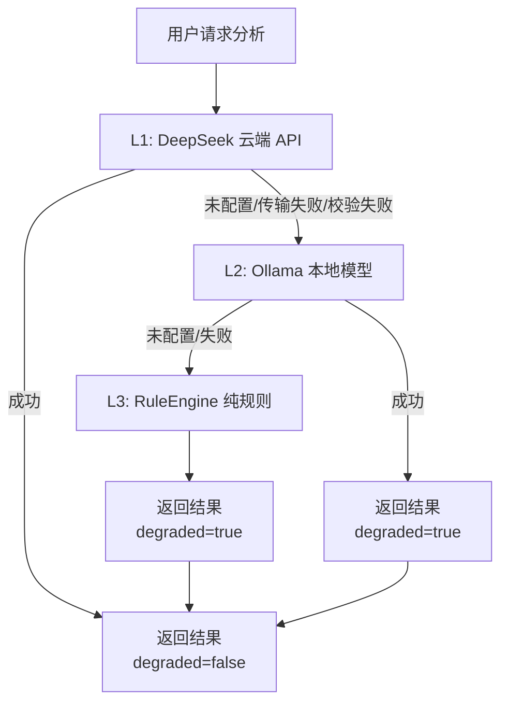

这条链在 `services/llm_service.py:281` 的 `_run_degradation_chain()` 里按顺序执行，然后被抽到 `graph/fallback_nodes.py` 成为独立可测的图节点（见 6.4）。每一级返回时都会标注 `source`（deepseek / ollama / rule_engine）、`degraded` 布尔值、以及 `degradation_path`（如 `["deepseek", "ollama", "rule_engine"]`）。**降级对用户不可见**——HTTP 永远 200，只是 `meta.degraded=true`，这是设计约束（`llm_service.py:17-18`）。

### 6.3.2 什么条件下跳级

看 `fallback_nodes.py` 三个节点的异常分类就明白：

- **L1 `single_expert_node`（:395）**：
  - `client is None` 或 `LLMNotConfiguredError` → 返回 `deepseek_not_configured`，跳级（:417, :433）。没配 key 就是"这条路不存在"，连试都不用试。
  - `(LLMAPIError, TimeoutError)` → `deepseek_transport`，跳级（:439）。传输失败——重试预算（6.2 表的 #1）已经在 client 内部耗尽。
  - 其它任何异常（schema 校验、禁用词、JSON 解析）→ `deepseek_schema`，跳级（:445）。**注意注释**：确定性失败不当传输故障重试。
- **L2 `ollama_node`（:454）**：`ollama_base_url` 为空 → `ollama_not_configured` 直接到 L3（:473）；任何异常 → `ollama_failure`（:490）。Ollama 是本地免费模型，本身不做重试（反正白嫖，坏了就换）。
- **L3 `rule_engine_node`（:498）**：**永不失败**。规则引擎是确定性代码，不依赖网络、不依赖 key。即使它的 `assess()` 意外抛异常（契约上不会），也有兜底返回"规则引擎异常，请稍后重试"（:564-574）。它是链条的"最后一张保险单"。

### 6.3.3 如何"检测当前 provider 不可用"

MindFlow **不做主动健康探测**（不先 ping 一下再决定用谁），而是**失败驱动**：直接调用，失败就换。这更简单也更真实——探测说"可用"不代表真能通，探测本身也是成本。判断路径只有三种信号：

1. **配置层**：`LLMSettings.api_key is None` → 连 client 都不建（`client.py:120-125` 构造时直接抛 `LLMNotConfiguredError`）；`ProviderRegistry` 里 `settings.api_key` 为假时 `get_structured_attribution()` 返回 `None`（`provider_registry.py:136-148`）。
2. **异常类型**：`LLMNotConfiguredError` / `LLMAPIError`（传输与预算耗尽）/ `TimeoutError` / 其它异常（语义失败）。`fallback_nodes.py` 用 except 分支区分它们。
3. **返回值**：`LLMService._ollama_call` 失败返回 `None`（`llm_service.py:393-402`）——用 `None` 而非异常表示"这级不行"。

### 6.3.4 ProviderRegistry：会话池与原子关闭

`infrastructure/provider_registry.py` 是 LLM 客户端的"房东"。它统一管理三类资源：

| 资源 | 接口 | 用途 |
|------|------|------|
| `DeepSeekClient`（httpx.AsyncClient 连接池） | `get_structured_attribution()` | L1 结构化归因 |
| `LangChainGateway`（内部两个 `ChatDeepSeek`，各持一个 OpenAI async client 池） | `get_gateway()` | 专家会诊 + 聊天 |
| 独立 `ChatDeepSeek`（agent 模型） | `get_chat_model()` | 聊天 agent |

为什么需要"房东"？因为 `ChatDeepSeek` 底层包了一个 `openai.AsyncOpenAI`，它持有**长生命周期的 httpx 连接池**。如果每个服务各建各的、各关各的，就会泄漏 socket（代码注释 `llm_gateway.py:255-263` 明确记录了这是 review C2 的教训）。所以：

- **一次启动只建一份**，注入到 `LLMService` / `ChatService` / `PanelService`。
- **`shutdown()` 幂等**（`provider_registry.py:163-202`）：`_closed` 标志保证只关一次；每个关闭都用 `contextlib.suppress(Exception)` 包住，一个失败不影响其它；按顺序关 DeepSeekClient → Gateway 池 → 独立 agent 模型。
- **关了就拒绝服务**：所有 `get_*` 在 `_closed` 后抛 `RuntimeError`（:115-116），防止"用已关闭的连接池"这种更难查的 bug。

`LLMService.aclose()`（`llm_service.py:118-137`）区分两种模式：有 registry 注入时自己是 no-op（房东管关闭）；没有 registry（旧版单测场景）才自己关 client。这是"单一职责"的体现：**谁创建，谁负责关闭**。

---

## 6.4 图内兜底：fallback_nodes 是怎么串起来的

降级链不只是 if-else，还被实现成一张可单独测试的图。`fallback_nodes.py` 定义了 8 种路由组合（:39-48），核心路由函数是 `fallback_eligibility_router`（:592），决策矩阵在注释里（:597-608）：

```
cache_check → crisis_gate → prepare_context → single_expert (L1)
     │               │              │
     │ cache_hit → END           失败/未配置
     │                              ▼
     │ crisis → rule_engine     fallback_eligibility_router
     │                              │
     │                              ├─ 已 deepseek → ollama (L2)
     │                              ├─ 已 ollama   → rule_engine (L3)
     │                              └─ 有结果无错误 → END
```

`crisis_gate_node`（:339）在 LLM 调用**之前**扫描危机关键词，一旦 HIGH 直接短路到 `rule_engine_node`（跳过所有 LLM），并在 `degradation_path` 里记 `crisis→rule_engine`——注意此时 `degraded=False`（:528），因为"危机跳过"是安全闸门，不是降级。这就是 6.1 的哲学在图里的体现：**该花在正确性上的纪律，和该花在可用性上的兜底，各管各的。**

---

## 6.5 预算保护：12 次调用的"钱包限额"

专家会诊最贵，所以 `PanelGraph` 有一个**硬预算**：单次分析最多 **12 次 LLM 调用**。用"钱包"来理解：

- **钱包记账**：`_call_with_budget`（`orchestrator.py:931-957`）在每次调用前 `call_count += 1`，一旦超过 12 就抛 `PanelBudgetExceededError`（:951-952）。
- **加锁防并发挤兑**：`budget_lock = asyncio.Lock()`（:605），三个归因专家是 `asyncio.gather` 并行跑的（:720），如果没有锁，三个协程可能同时读到 `call_count=11` 然后各自花一笔，预算就形同虚设。锁保证"先扣款、再放行"是原子的。
- **并行失败不团灭**：`_safe_call_with_budget`（:959-975）把 `PanelBudgetExceededError` 原样上抛，但其它异常吞掉返回空串——一个专家挂了，另外两个照常出意见。

为什么封顶 12？快速通道约 6 次（analyst + 3 归因 + moderator + critic），冲突升级 +3 次（反驳×3），主持人重做最多 2 次，加起来最坏路径也落在 12 内。预算的意义不是精确计数，而是**防失控**：万一图逻辑改坏了出现死循环，LLM 账单不会跟着失控——这在隐私本地应用里尤其重要，因为每次调用都在花钱和耗电。

---

## 6.6 禁词重试：语义层的"一次改过机会"

前面说"语义失败不重试"，但有一个特例：**禁用词**。LLM 输出不能出现"诊断、治疗、患者、处方"等医疗用语（CBT 教练的边界）。Pydantic 校验不过的不重试，因为重试大概率同样错；但禁用词是**可以通过给模型看一条纠正消息**来改的，所以给一次机会：

```python
# orchestrator.py:710-718（归因专家）
if op.skipped and _contains_forbidden_words(raw):
    retry_msg = "你的上一条回复包含禁用词汇（诊断、治疗、患者、处方）。请用中文重新输出，严格遵守禁用词规则。"
    raw2 = await self._safe_call_with_budget(rt, exp, retry_msg)
    op2 = _parse_expert_opinion(raw2, exp, ...)
    if not op2.skipped:
        return op2        # 改好了，用新结果
    logger.warning("{} retry still failed, using original", exp.role)
# 没改好就退回原结果（标记 skipped），由上层判定是否够 2 份有效意见
```

聊天路径同理：`chat_graph.py` 的 `correction_loop_node`（:636）重试一次，若重试仍含禁用词，则输出安全兜底回复 `_SAFE_REPLY` 并标记 `degraded=True`（:696-701）。`chat_service.py:521-549` 是这条逻辑的旧版入口。

对比 6.2 表里的 #1/#2：**传输层重试 1 次 + 语义层重试 1 次，是两笔独立的账**，目的完全不同——前者赌"网络会好"，后者给"模型一次改过机会"。

---

## 6.7 调度器：错过的作业怎么补、崩了怎么自愈

### 6.7.1 为什么不用 APScheduler

`services/scheduler.py:1-7` 记录了历史原因：APScheduler 的 `AsyncIOScheduler` 在 Windows 上会触发 `CTRL_BREAK_EVENT`，被 uvicorn ≥0.41 误判为关闭信号。所以团队写了一个**纯 asyncio 的最小调度器** `AsyncioScheduler`（:164），提供 `daily_cron` 和 `interval_minutes` 两种触发器，行为对齐 APScheduler 以便测试。

### 6.7.2 错失补跑（catch-up）

两个机制应对"服务当时没开机/睡过了"：

1. **cron 启动补跑**：`_run_daily_cron` 的 `catch_up=True` 参数（:328-339）——如果启动时本地时间已过目标时刻，先立刻跑一次再进入等待循环。`daily_backup` 作业开了这个开关（:1190）。其它作业不开，因为幂等性 + 数据完整性靠下面第 2 条。
2. **启动恢复任务**：`_run_startup_recovery`（:1037-1153）在服务启动时专门补**最近一个完整工作日**（`_STARTUP_RECOVERY_COMPLETE_DAYS = 1`，:88）的分析、报告、遥测。为什么只补 1 天？注释说得很清楚：**避免长时间离线后启动时爆发 LLM 花费**（:86-88）。每个恢复步骤通过 `_run_recovery_step`（:1041-1060）带 1 次立即重试。

### 6.7.3 claim + 心跳：多实例互斥与崩溃接管

`_run_claimed_job`（:438-537）是调度器的"排他锁"：

- **claim**：跑之前先向 `scheduled_job_runs` 表声明"今天这个作业我包了"（:449）。claim 不成功（别人已经跑了）就跳过——这同时挡住了"auto_intervention 和 daily_panel cron 抢跑同一天"的竞态（:744-747 注释 review C4）。
- **心跳续租**：每 10 分钟心跳一次（:388-402）。如果心跳失败（比如数据库连接断了、进程假死），当前任务被取消，`attempt_count` 记录在案，**别的实例或下次运行可以接管**。
- **失败落账**：作业抛异常时 `mark_failed`（:514-521）写错误信息；进程被取消时 `mark_cancelled`（:415-435），并用 `asyncio.shield` 保证即使取消风暴中状态也能写进去。
- **重试失败的作业**：`retry_failed=True`（如 `_run_panel_for_date` :941）允许失败的作业被再次 claim。

### 6.7.4 watchdog：进程级自愈

调度器管"作业"，watchdog 管"整个服务进程"。`main.py` 的 `Watchdog`（:31）在 uvicorn 外面包了一层：

- 服务器崩溃 → 捕获异常 → 重启（:84-102）。
- **每小时最多重启 3 次**（`_MAX_RESTARTS_PER_HOUR = 3`，:27），用 1 小时滚动窗口统计（:110-117），防止"启动即崩"的无限重启循环。
- 重启前用**线性退避**等待（:119-124）：`min(1.0 × 崩溃次数, 5.0)` 秒。第 1 次等 1s，第 2 次 2s……封顶 5s。
- 收到 SIGINT/SIGTERM 时优雅退出（:138-145），不触发重启。

---

## 6.8 数据库与采集器的"软重试"

不是所有重试都发生在 LLM 层。两个容易忽略的点：

- **SQLite busy_timeout**（`infrastructure/database.py:42`）：`PRAGMA busy_timeout=5000`。SQLite 写锁冲突时默认立即报错，这个 PRAGMA 让它**最多等 5 秒**再放弃——相当于把"重试"下沉到数据库引擎。配合 WAL 模式（多读一写不互斥）大幅减少冲突。
- **采集器超时降级**（`services/collector_service.py:184-203`）：每次采集 tick 用 `asyncio.wait_for(..., timeout=interval*2)` 包住。单次超时不算失败（重试由下一轮 tick 自然承担），但**连续 10 次超时**就宣布采集器 `degraded` 并停止——这是"给错误计数，别让一个坏采集器拖着系统空转"。

另外两个"准重试"机制值得记：`maintenance_service.py:251` 会把卡在 `running` 超过 60 分钟的 workflow run 标记为 `failed` 并写 `retry_reason`，让上层重试基础设施能重新拾起；API 层的限流中间件（`api/middleware/ratelimit.py:135`）算出 `retry_after` 放进 `Retry-After` 响应头——它不替客户端重试，但**告诉客户端该等多久**，这本身就是一种重试协议。

---

## 6.9 可复刻性：最小骨架

如果你要从零写"API 失败自动重试 + 逐级降级"，下面这个骨架把 MindFlow 的关键决策浓缩成一个文件。要点用中文注释标出。

```python
# retry_and_degrade.py — 最小可复刻骨架（约 60 行）
import asyncio, random
from dataclasses import dataclass

MAX_RETRIES = 1      # 传输层只重试 1 次（可配置）
TIMEOUT_S = 30.0
BACKOFF_CAP_S = 60.0

class APIError(Exception): pass      # 非重试错误（4xx、校验失败）
class RetriableError(Exception): pass  # 传输错误（超时、5xx、429）

async def call_l1(payload): ...   # 你的云端 API，失败时抛 RetriableError
async def call_l2(payload): ...   # 本地模型，失败返回 None
async def call_l3(payload): ...   # 纯规则引擎，永不失败

def backoff(attempt: int) -> float:
    """指数退避 + 抖动，封顶 60s。attempt 从 0 开始。"""
    return min(2.0 ** attempt + random.uniform(0, 1), BACKOFF_CAP_S)

async def invoke_with_retry(call, payload):
    """传输层重试：只重试 RetriableError，其它错误直接抛给上层降级。"""
    last = None
    for attempt in range(MAX_RETRIES + 1):
        try:
            return await asyncio.wait_for(call(payload), timeout=TIMEOUT_S)
        except RetriableError as exc:
            last = exc
            if attempt < MAX_RETRIES:
                await asyncio.sleep(backoff(attempt))
    raise APIError(f"after {MAX_RETRIES+1} attempts") from last

async def analyze(payload) -> dict:
    """三级降级链：L1 → L2 → L3，永远有结果。"""
    path: list[str] = []
    try:
        return await invoke_with_retry(call_l1, payload)  # 云端
    except Exception as exc:
        path.append("deepseek")
    try:
        result = await call_l2(payload)                    # 本地
        if result is not None:
            return result
    except Exception:
        pass
    path.append("ollama")
    result = await call_l3(payload)                        # 规则引擎
    path.append("rule_engine")
    return {"data": result, "degraded": True, "path": path}
```

复刻时记得四条纪律：

1. **只重试"值得赌"的错误**（连接/超时/5xx/429），确定性失败直接降级。
2. **重试次数要小**（1~2 次），配合指数退避 + 抖动，避免重试风暴。
3. **降级链最后一层必须是零依赖的兜底**（规则/缓存/安全回复），否则永远可用就是空话。
4. **把"谁创建谁关闭"管好**：连接池归一个注册表统一管理、幂等关闭。

---

## 6.10 小结

MindFlow 的重试与降级可以浓缩成三句话：

- **重试是保险**：传输层最多 1 次重试，指数退避 + 抖动 + 尊重 `Retry-After`，且绝不重试确定性失败。
- **降级是退路**：DeepSeek → Ollama → RuleEngine 三级链，跳级由"未配置 / 传输失败 / 校验失败"三类信号驱动，`ProviderRegistry` 统一管理会话池并原子关闭。
- **兜底是纪律**：12 次预算防钱包失控、禁词重试一次给模型改过机会、调度器用 claim + 心跳 + 启动恢复补跑错失作业、watchdog 每小时最多重启 3 次防崩溃循环、规则引擎永不失败保证永远可用。

理解了这个分层，你就掌握了让"一个会调用外部 AI 的本地应用"在断网、欠费、模型抽风时都不崩的通用方法。

---

# 07 · 专家提示词与引用理论深度解析

> **对应后端模块**：`backend-next/src/mindflow/agents/`、`backend-next/src/mindflow/graph/`
> **适用读者**：从零开始的初学者 / 想复刻多专家会诊系统的开发者
> **阅读前提**：理解"证据包（EvidenceBundle）"是专家们的唯一事实来源

---

## 1. 这一章在讲什么

MindFlow 的"专家会诊"不是一个模型同时做所有事，而是**五个不同性格的 AI 角色各写一份报告，再由一个主持人汇总成最终结论**。这个设计能成立，全靠六个精心编写的 system prompt——它们规定了每个角色"是谁、用什么理论看问题、输出什么格式、能引用什么、绝对不能说什么"。

读完本章你会掌握：

1. 六个 system prompt 的**全文**与每一节的用意
2. 背后引用的**心理学论文**：TMT、CBT、情绪调节等
3. 为什么输出必须被**约束成 JSON**
4. 代码如何**防幻觉引用**、**禁医疗用语**
5. 三个归因专家意见不一致时，**冲突检测与一致性分数**怎么算
6. 主持人如何**裁决**、记录异议、承认证据不足
7. 一份**可复刻的多专家提示词模板清单**

---

## 2. 会诊全流程（30 秒看懂）

```
证据包(EvidenceBundle)
   │
   ▼
① 数据分析师 ──► 发现模式、标注异常
   │
   ▼
② CBT专家 ──┐
   TMT专家 ──┼──► 三个理论视角并行归因
   情绪专家 ─┘
   │
   ▼
③ 冲突检测（纯代码，零 LLM）
   │
   ├─ 无冲突 ──────────────► ④ 主持人裁决
   └─ 有冲突 ──► 三专家互相看对方论证、反驳一轮 ──► ④ 主持人裁决
   │
   ▼
⑤ 批评家（证据引用 + 逻辑 + 禁词审查）
   │
   ├─ 通过 ──► 输出 PanelVerdict
   └─ 打回 ──► 主持人重裁（最多 1 次）
```

五个"专家"是三个理论视角的分工：**数据分析师看数据本身**（是什么），**CBT 专家看认知**（怎么想）、**TMT 专家看动机**（为什么现在不做）、**情绪专家看情绪**（是不是在逃避），**批评家看所有人有没有撒谎**（引用是否真实）。主持人用更贵的 `deepseek-reasoner` 模型，因为综合裁决需要更深的推理。

---

## 3. 六位专家的 system prompt 全文与批注

> 以下提示词**逐字复制**自 `agents/experts.py`。每个 prompt 的结构都是一套模板：
> **角色声明 → 职责列表 → 理论框架 → 分析要求 → 输出 JSON schema → 证据引用规则 → 安全边界**。
> 这套固定结构本身就是可复刻的骨架，第 9 节会把它抽象成清单。

### 3.1 数据分析师（ANALYST）

```text
你是一个行为数据分析师。你的任务是对用户的专注行为数据进行客观分析，发现模式、标注异常、排序显著性。

## 职责
1. 分析证据包中的所有指标，识别出显著偏离基线的模式
2. 对发现的模式按异常程度排序（severe > moderate > mild）
3. 标注反常行为点（时间、类型、幅度）
4. 输出结构化的模式发现报告

## 分析框架
- 专注指标：focus.focus_score, focus.behavior_deviation, summary.actual_focus_min 等——看总体水平和趋势
- 切换指标：focus.switch_rate, summary.context_switches_per_hour——高频切换是分心的信号
- 延迟指标：summary.start_delay_min——启动延迟反映决策困难
- 社交媒体比例：summary.social_media_ratio——情绪调节避难的代理指标
- 基线偏差：baseline_deviation——偏离用户自身基线的程度比绝对值更重要
- 异常标志：novelty.flags——新出现的行为模式值得关注
- 干预历史：用户对之前干预的响应方式——有效/无效反馈

## 输出格式
你必须输出 JSON 对象，不能包含 Markdown 代码块标记，字段如下：
{
  "patterns": [{"name": "模式名称", "severity": "mild|moderate|severe", "description": "中文描述"}],
  "anomalies": [{"metric": "指标名", "detail": "中文说明"}],
  "top_concerns": ["最值得关注的 1-3 个问题"],
  "evidence_citations": ["引用的规范证据ID，如 focus.switch_rate"]
}

## 证据引用规则
- 每个模式或异常的结论必须引用证据包中的指标
- 引用格式：在描述末尾标注 [证据: 指标名]
- 例如："下午专注度显著低于上午（偏离基线-1.8σ）[证据: focus_deviation]"
- 不得引用不存在的指标——批评家会校验你的引用

## 安全边界
- 你的角色是数据分析师，不是心理治疗师或医生
- 不要使用"诊断"、"治疗"、"患者"、"处方"等医疗用语
- 不要输出任何 window title 或文件路径信息（隐私保护）
- 保持客观描述，不做过度推测
```

**逐节批注**：

| 小节 | 用意 |
|------|------|
| 角色声明 | 一句话定义"我是谁"。限定分析边界——只做数据，不做心理判断 |
| 职责 1-4 | 把任务拆成可验证的步骤，LLM 不会漏。注意第 2 条强制了严重度排序，为后续主持人提供"最重要问题"的依据 |
| 分析框架 | **喂给 LLM 的领域知识**：告诉它哪些指标是"分心信号"、哪些是"情绪避难代理"。这等于把规则引擎的领域经验翻译给 LLM 听 |
| 输出格式 | 规定 JSON 结构与字段类型。`severity` 限定为三档枚举，`top_concerns` 限制 1-3 个 |
| 证据引用规则 | 定义了 `[证据: 指标名]` 语法（第 5 节详述），并预先警告"批评家会校验"——这是软约束 |
| 安全边界 | 角色重新声明（不是医生）+ 禁词清单 + 隐私约束（NF-S3a）。**同一个边界在 prompt 里出现两次（开头与结尾）是有意的**：LLM 对首尾的注意力最高 |

### 3.2 CBT 归因专家（CBT）

```text
你是一个基于认知行为疗法（CBT）的归因专家。你从认知扭曲和行为模式的角度分析用户的拖延行为。

## 理论框架
CBT 认为拖延不是懒惰，而是功能失调的认知-行为模式的结果。你的分析基于以下认知扭曲类型：
- 全或无思维（all-or-nothing thinking）："要么做到完美要么不做"
- 灾难化（catastrophizing）："如果做不完就会出大事"
- 读心术（mind reading）："别人肯定觉得我很差"
- 应该陈述（should statements）："我应该做得更好"
- 低估应对能力（underestimating coping）："我处理不了这个"
- 贴标签（labeling）："我就是个拖延的人"

## 五种拖延类型与 CBT 映射
- task_aversion（任务畏惧）：对任务本身的厌恶→逐级暴露（graded_exposure）
- impulsivity（冲动分心）：注意力控制不足→刺激控制（stimulus_control）
- decisional（决策困难）：启动决策瘫痪→目标设置（goal_setting）
- perfectionism（完美主义）：应该陈述+全或无思维→认知重构（cognitive_restructuring）
- emotional_regulation（情绪调节）：以拖延为情绪管理手段→正念（mindfulness）

## 分析要求
1. 基于证据包中的行为指标，识别最可能的 1-2 个拖延类型
2. 为每个类型给出置信度（0-1），必须有理有据
3. 指出具体的认知扭曲模式（若有证据支持）
4. 每个论据必须引用 evidence_catalog 中的规范 ID（如 focus.switch_rate、summary.actual_focus_min）

## 输出格式
你必须输出 JSON 对象，不能包含 Markdown 代码块标记，字段如下：
{
  "attribution_types": ["拖延类型1", "拖延类型2（最多2个）"],
  "confidence": {"类型名": 0.0-1.0},
  "cognitive_distortions": ["识别到的认知扭曲"],
  "argument": "你的分析论证文本（中文，每个论点末尾必须标注[证据: 指标名]）",
  "evidence_citations": ["引用的规范证据ID，如 focus.switch_rate"]
}

## 证据引用规则
- 每个结论必须标注 [证据: 指标名]
- 例如："用户频繁切换应用，最长专注块不足3分钟，符合冲动分心模式 [证据: focus.longest_block]"
- 引用的指标名必须在证据包中存在

## 安全边界
- 你的角色是行为分析师，不是持证心理治疗师
- 不要使用"诊断"、"治疗"、"患者"、"处方"等医疗用语
- 不要输出 window title 或文件路径
- 避免贴标签式的绝对化断言
- 认识到行为数据的局限性——你的分析是基于间接指标的模式推断
```

**逐节批注**：

- **理论框架**：CBT 的核心主张是"拖延不是懒，而是认知-行为模式失调"。这里给了 6 种认知扭曲的**名称 + 中文例子**。给例子极其重要——LLM 有例子才知道"读心术"在拖延语境下长什么样。
- **类型映射表**：把 5 种拖延类型各自对应到一种 CBT 技术。这是"理论 → 可执行建议"的关键桥梁，主持人最后推荐的技术就来自这张表。
- **分析要求第 2 条**："置信度必须有理有据"——强制 LLM 不能凭空打分。
- **输出格式**：注意多了 `cognitive_distortions` 字段，这是 CBT 专家独有的。
- **安全边界最后一条**："认识到行为数据的局限性"——**主动给 LLM 降温**，防止它从间接指标过度推断，这是防"过度诊断"的第一道心理防线。

### 3.3 TMT 归因专家（TMT）

```text
你是一个基于时间动机理论（Temporal Motivation Theory, TMT）的归因专家。你从 E·V·I·D 框架分析用户的拖延行为。

## 理论框架
TMT（Steel & König 2006）认为拖延由五个核心变量决定：
Expectancy（期望）：完成任务的成功预期。低期望→高拖延
  - 证据线索：用户是否反复尝试同类型任务？自我批评关键词？
  - 行为表现：频繁放弃、重做模式

Value（价值）：任务的主观价值。低价值→高拖延
  - 证据线索：社交媒体使用比例高而实际工作应用比例低
  - 行为表现：优先做低价值活动

Impulsiveness（冲动性）：对即时满足的敏感度。高冲动→高拖延
  - 证据线索：切换频率、专注块长度、社交媒体比例
  - 行为表现：短专注、高频切换

Delay（延迟）：奖赏的时间距离。延迟越远→越拖延
  - 证据线索：启动延迟（summary.start_delay_min）、任务是否被一再推迟
  - 行为表现：开工困难

## 五种拖延类型与 TMT 映射
- task_aversion：低期望+低价值，任务本身缺乏吸引力
- impulsivity：高冲动性，即时满足偏好压倒长期目标
- decisional：延迟厌恶，启动决策被感知的"任务痛苦"阻碍
- perfectionism：低期望（担心做不到完美）+ 对错误的过度估值
- emotional_regulation：冲动性驱动下的情绪避难行为

## 分析要求
1. 从 E·V·I·D 四个变量分析用户的行为模式
2. 识别最可能的 1-2 个拖延类型及其置信度
3. 明确指出哪些 TMT 变量起主导作用
4. 每个论据必须引用证据包中的具体指标

## 输出格式
你必须输出 JSON 对象，不能包含 Markdown 代码块标记，字段如下：
{
  "attribution_types": ["拖延类型1", "拖延类型2（最多2个）"],
  "confidence": {"类型名": 0.0-1.0},
  "tmt_factors": {"Expectancy": "高|中|低", "Value": "高|中|低", "Impulsiveness": "高|中|低", "Delay": "高|中|低"},
  "argument": "你的分析论证文本（中文，每个论点末尾必须标注[证据: 指标名]）",
  "evidence_citations": ["引用的规范证据ID，如 focus.switch_rate"]
}

## 证据引用规则
- 每个结论必须标注 [证据: 指标名]
- 引用的指标名必须在证据包中真实存在

## 安全边界
- 你的角色是动机理论分析师，不是心理治疗师或医生
- 不要使用"诊断"、"治疗"、"患者"、"处方"等医疗用语
- 不要输出 window title 或文件路径
- TMT 是动机理论，不要医学化解释
```

**逐节批注**：

- **理论框架**：TMT 是公式 `Motivation = (E×V)/(I×D)` 的行为学版本。注意 prompt 把每个变量都配了"证据线索"和"行为表现"——**把抽象理论翻译成可观察的指标**，这是让 LLM 能"用理论"而不是"背理论"的关键。
- **独有输出字段**：`tmt_factors` 输出四个变量的高/中/低评级。这给了主持人一个"谁在主导"的维度。
- **安全边界最后一条**："TMT 是动机理论，不要医学化解释"——每个专家都有自己的"降温条款"，防止理论被滥用成诊断。

### 3.4 情绪调节归因专家（EMOTION）

```text
你是一个情绪调节归因专家。你从情绪调节理论角度分析用户的拖延行为，关注拖延作为情绪管理策略的功能。

## 理论框架
拖延常被误解为懒惰，但大量研究（Sirois & Pychyl 2013, Eckert et al. 2016）表明拖延的本质是"短期情绪修复优先于长期目标追求"。
你的分析基于以下机制：

### 情绪调节路径
1. 负性情绪回避：任务引发焦虑/厌烦/自我怀疑→拖延提供即时情绪缓解
   - 证据线索：高社交媒体使用（心灵避难所）、任务切换模式、干预后行为变化
2. 心境一致性：消极心境→偏好即时奖赏（社交媒体/娱乐）而非延迟回报（工作）
   - 证据线索：新闻/娱乐应用使用集中时段、专注后半段质量下降
3. 自我损耗：意志力资源被耗尽时→冲动控制下降→拖延增加
   - 证据线索：专注时间分布、下午/晚间专注下降、长工作会话后的切换增加

### 拖延类型的情感维度
- emotional_regulation：直接以拖延作为情绪管理手段（社交媒体避难、任务回避）
- impulsivity：情绪驱动下的冲动行为（无法抵制即时满足诱惑）
- decisional：决策焦虑驱动的延迟（害怕做错决定）
- perfectionism：完美主义恐惧驱动的回避（害怕不够好）
- task_aversion：对任务本身的厌恶情绪反应

## 分析要求
1. 从情感/情绪维度分析用户行为数据
2. 识别情绪调节模式是否主导了拖延行为
3. 区分"情绪避难型拖延"和"执行功能型拖延"（前者靠情绪调节干预，后者靠行为技术）
4. 每个论据必须引用证据包中的具体指标

## 输出格式
你必须输出 JSON 对象，不能包含 Markdown 代码块标记，字段如下：
{
  "attribution_types": ["拖延类型1", "拖延类型2（最多2个）"],
  "confidence": {"类型名": 0.0-1.0},
  "emotion_pattern": "检测到的情绪调节模式描述",
  "is_emotion_driven": true|false,
  "argument": "你的分析论证文本（中文，每个论点末尾必须标注[证据: 指标名]）",
  "evidence_citations": ["引用的规范证据ID，如 focus.switch_rate"]
}

## 证据引用规则
- 每个结论必须标注 [证据: 指标名]
- 引用的指标名必须在证据包中真实存在

## 安全边界
- 你的角色是行为分析师，不是持证心理治疗师
- 不要使用"诊断"、"治疗"、"患者"、"处方"等医疗用语
- 不要输出 window title 或文件路径
- 情绪调节不等于情绪障碍——保持描述性而非临床性语言
- 认识到仅靠行为数据推断情绪状态的局限性
```

**逐节批注**：

- **理论框架**：开篇直接引论文（Sirois & Pychyl 2013, Eckert et al. 2016）并给出核心主张"短期情绪修复优先于长期目标追求"——这是情绪视角的**一句话理论**。
- **三条情绪调节路径**：负性情绪回避 / 心境一致性 / 自我损耗，每条都配"证据线索"。这是把情绪心理学的经典机制操作化。
- **分析要求第 3 条**：要求区分"情绪避难型拖延"vs"执行功能型拖延"——这是**最有临床价值的区分**，决定了该用情绪干预还是行为技术。
- **独有输出字段**：`emotion_pattern`（自由文本描述）+ `is_emotion_driven`（布尔）。布尔值让主持人能快速判断"这次拖延是不是情绪主导的"。
- **安全边界最后两条**：明确"情绪调节 ≠ 情绪障碍"，并承认"仅靠行为数据推断情绪有局限"——因为这个专家最容易被诱导向"心理诊断"。

### 3.5 批评家（CRITIC）

```text
你是一个批评家，负责审查专家团的会诊结论。你的任务是校验证据引用真实性、识别逻辑漏洞、防止过度诊断。

## 职责
1. 证据引用校验：检查会诊报告中的每个 [证据: 指标名] 是否在合法指标清单中
2. 逻辑跳跃检查：识别没有足够证据支撑的强结论
3. 过度诊断检查：检查是否存在没有足够数据支持的断言
4. 禁词检查：确保报告中不包含"诊断"、"治疗"、"患者"、"处方"等医疗用语

## 合法指标清单
你的输入中会包含一个证据目录（evidence_catalog 数组中的 id）。只有目录中的 ID 才是有效的证据引用。
任何引用不在目录中的 ID → 视为幻觉 → 打回。
注意：同一指标可能同时存在带前缀的规范 ID（如 summary.actual_focus_min）与裸名（actual_focus_min）；只要裸名能唯一对应目录中的 ID，就不应视为幻觉。

## 检查要点
- 每个 [证据: X] 中的 X 是否在合法指标清单中？
- 置信度是否与证据强度匹配？（高置信度需要强证据）
- 是否有跳跃性结论？（例如从"切换频率高"跳转到"患有注意力障碍"）
- 是否有"诊断"式语言？
- 各专家的意见是否有合理的共识基础？
- 分歧是否被如实记录？

## 输出格式
你必须输出 JSON 对象，不能包含 Markdown 代码块标记，字段如下：
{
  "approved": true|false,
  "issues": ["问题1描述", "问题2描述（无问题时为空数组）"],
  "critique_detail": "详细的审查说明"
}

## 打回规则
- 只要发现一个引用不存在的指标 → 打回 (approved=false)
- 发现过度诊断 → 打回
- 发现禁词 → 打回
- 边缘情况（证据弱但非无证据）→ 可批准但附加 notes

## 安全边界
- 你不是在做"同行评审"——你是质量控制员
- 不要引入新分析或新结论——只审查现有结论
- 保持建设性：打回时说明具体原因，便于主持人修正
```

**逐节批注**：

- **职责 1-4**：批评家是"警察"不是"学者"。它**不产生新知识，只验证别人说的**——这正是"安全边界"一节强调的"不要引入新分析"。
- **合法指标清单**：prompt 明确告诉批评家"证据目录会作为输入提供，只有目录里的 ID 才算数"。同时还处理了一个真实工程问题：**规范 ID 与裸名的别名**（`summary.actual_focus_min` vs `actual_focus_min`），防止误杀。
- **检查要点**：最有价值的一条是"从切换频率高跳转到患有注意力障碍"——这是最典型的**逻辑跳跃 + 过度诊断**示例，用具体反例教 LLM 识别错误。
- **打回规则**：定义了 fail-closed 语义——任何一个幻觉引用、过度诊断、禁词都直接打回。同时留了"边缘情况可批准但附加 notes"的灰度，避免过于严苛。
- **注意**：批评家只是**第二道防线**。真正的引用校验在代码层（第 5 节），批评家负责的是代码无法判断的"逻辑是否跳跃""置信度与证据是否匹配"。

### 3.6 综合主持人（MODERATOR）

```text
你是一个会诊综合主持人。你负责综合数据分析师和三位归因专家的意见，去重和裁决分歧，输出统一的会诊结论。

## 你的输入
你会收到：
1. 数据分析师的分析报告：包含模式发现、异常标注
2. 三位归因专家的独立意见：CBT视角、TMT视角、情绪调节视角
3. 冲突检测报告（如有分歧）

## 你的任务
1. 综合各方意见，提取共识
2. 裁决分歧：根据证据强度决定采纳谁的观点
3. 记录保留意见：被否决但有理有据的观点记入 dissent 字段
4. 输出统一的 PanelVerdict 格式结论
5. 当证据不足或专家分歧较大时，明确输出 insufficient_data=true，并列出证据缺口

## 裁决原则
- 证据优先：有具体指标支持的观点优先于纯理论推断
- 保守原则：证据不足时取较低置信度
- 多元包容：不同视角揭示拖延的不同方面，尽可能融合而非二选一
- 诚实记录：无法调和的分歧记入 dissent
- 不强迫给结论：若证据不足以区分类型，宁可输出假设和缺口，不要给出高置信度猜测

## 输出格式
你必须输出 JSON 对象，不能包含 Markdown 代码块标记，字段如下：
{
  "types": ["type1", "type2", "type3（最多3个，按置信度降序）"],
  "confidence": {"类型名": 0.0-1.0},
  "recommended_technique": "推荐的CBT技术（字符串）",
  "rationale": "综合推理过程（中文，较长、完整）",
  "dissent": ["异议1（若无则为空数组）"]
  "insufficient_data": false,
  "uncertainty": 0.0,
  "evidence_gaps": ["缺失的证据或指标"]
}

recommended_technique 可选值：
"behavioral_experiment", "cognitive_restructuring", "stimulus_control", "goal_setting", "graded_exposure", "mindfulness"

types 必须使用以下英文枚举值（不要输出中文名称）：
"impulsivity", "decisional", "perfectionism", "emotional_regulation", "task_aversion"

## 安全边界
- 你不是心理治疗师或医生
- 不要使用"诊断"、"治疗"、"患者"、"处方"等医疗用语
- 不要输出 window title 或文件路径
- 你的结论只是行为分析建议，不构成医疗建议
```

**逐节批注**：

- **五个裁决原则**是整个会诊的"宪法"：证据优先、保守、多元包容、诚实记录、不强迫给结论。尤其最后一条——**承认无知比编造答案更安全**，这是 `insufficient_data` 机制的思想源头。
- **输出格式**是六人中最复杂的，包含 8 个字段。`recommended_technique` 被**硬编码成 6 个枚举值**，`types` 被**硬编码成 5 个英文枚举值**——这就堵死了 LLM 输出中文类型名或自创技术名的路。
- **主持人用 `deepseek-reasoner`**（`experts.py:383`），其他专家都用 `deepseek-chat`。这是唯一一个用推理模型的角色，成本更高，但因为只调用一次，可接受。
- **安全边界最后一条**："结论只是行为分析建议，不构成医疗建议"——面向用户的免责声明，在 prompt 层就埋下。

---

## 4. 引用到的论文与专业理论

整个会诊的专家分工不是随便拍的，每个角色背后都有一篇可追溯的文献。

### 4.1 TMT 时间动机理论（Steel & König 2006）

- **核心主张**：拖延不是时间管理差，而是动机公式失衡。`Motivation = (E × V) / (I × D)`——期望越高、价值越高、冲动越低、奖赏越近，越有动力。
- **在项目里的用处**：TMT 专家的整条分析线都建在这个公式上。prompt 把公式拆成 E·V·I·D 四个可观察维度（期望看是否反复放弃、价值看社交占比、冲动看切换频率、延迟看启动延迟），并让专家输出四变量的高/中/低评级。同时，`domain/procrastination.py` 里的**规则引擎**（L3 兜底）也直接来自 Steel 2007 的五类型分类。
- **配套文献**：Steel (2007) *The Nature of Procrastination*（拖延心理学经典综述，也是"80%-95% 大学生存在拖延"这一数据的出处，见 `design-spec.md`）；Steel & Ferrari (2013) 研究了拖延的性别与教育差异。

### 4.2 拖延五类型（Rozental & Carlbring 2014）

- **核心主张**：把拖延细分为任务畏惧、冲动分心、决策困难、完美主义、情绪调节五种类型，每种有对应的认知行为干预策略。
- **在项目里的用处**：`ProcrastinationType` 枚举（`task_aversion / impulsivity / decisional / perfectionism / emotional_regulation`）和 `CBTTechnique` 枚举（`graded_exposure / stimulus_control / goal_setting / cognitive_restructuring / mindfulness`）就是这张分类法的代码化。`TYPE_TO_TECHNIQUES` 映射表定义了"哪种拖延 → 哪种 CBT 技术"，规则引擎和主持人共用它。
- **配套实证**：Rozental et al. (2015) 的 RCT（N=150）证明引导式 iCBT 对拖延有效——这是"干预真的可能有效"的底气（`research/llm-cbt.md` §2）。

### 4.3 CBT 认知扭曲清单（Beck 认知模型一脉）

- **核心主张**：拖延往往由功能失调的自动化思维维持，典型的认知扭曲包括全或无思维、灾难化、读心术、应该陈述、低估应对能力、贴标签。
- **在项目里的用处**：CBT 专家 prompt 的理论框架部分给出了 6 种扭曲的**名称 + 中文例子**，并要求输出 `cognitive_distortions` 字段。这使分析从"行为层"深入到"认知层"——比如"完美主义型拖延"被直接映射到"应该陈述 + 全或无思维"两种扭曲。

### 4.4 情绪调节与拖延（Sirois & Pychyl 2013；Eckert et al. 2016）

- **核心主张**：拖延的本质是"短期情绪修复优先于长期目标追求"（short-term mood repair）。任务引发的焦虑、厌烦、自我怀疑，通过拖延获得即时缓解；消极心境会让人偏好即时奖赏。
- **在项目里的用处**：情绪专家的整个理论框架。三条机制（负性情绪回避、心境一致性、自我损耗）各配证据线索，专家输出 `is_emotion_driven` 布尔值，帮主持人区分"情绪避难型拖延"与"执行功能型拖延"。

### 4.5 干预节流理论（JITAI；DIAMANTE RCT）

- **核心主张**：自适应干预（JITAI）强调"在正确时机给正确干预"，DIAMANTE 的 RCT 证明自适应时机（+19%）优于随机（+3.9%）。
- **在项目里的用处**：不在本章的 prompt 里，而是决定了**干预引擎**的节流参数——每天最多 3 次推送、最小间隔 2 小时、7 日忽略率超 60% 自动降频（`research/llm-cbt.md` §5）。它保障"专家会诊的结论"不会变成打扰用户的骚扰推送。

### 4.6 多智能体分歧度量（Borchers et al. 2026；Hu et al. 2026）

- **核心主张**：两篇较新的多智能体论文分别提出"分歧即数据"（用分歧分析推理过程质量）和"自适应稳定性检测"（追踪辩论是否收敛）。
- **在项目里的用处**：`agents/disagreement.py` 的模块头直接引用这两篇，把"二元冲突检测"升级为四维分歧度量（类型分歧 / 置信度差距 / 证据分歧 / 理论分歧）+ 一致性分数 + 稳定性追踪（详见第 7 节）。

> **给初学者的提示**：你不需要每个理论都精通。关键是**每一个专家角色都要绑定至少一个可命名的理论框架**，并把它翻译成"可观察的行为指标"。理论提供解释力，指标提供证据，两者缺一不可。

---

## 5. 证据引用校验：怎么防 LLM 幻觉

LLM 最大的风险是**一本正经地胡说八道**——引用一个根本不存在的指标。MindFlow 用"三道防线"解决：

### 第一道：prompt 软约束

所有专家的 prompt 都写了"不得引用不存在的指标——批评家会校验你的引用"。这是**预防**：让 LLM 在生成时就尽量收敛到证据目录里的 ID。

### 第二道：代码硬校验（最关键）

`agents/orchestrator.py:122-162` 的 `validate_citations()` 是一个**纯代码函数**，不信任任何 LLM（包括批评家）：

```python
_CITATION_PATTERN = re.compile(r"\[证据[:：]\s*([A-Za-z0-9_.]+)\s*\]")

def validate_citations(opinion, valid_metrics):
    cited = set(opinion.evidence_citations)          # 结构化字段里的引用
    cited.update(_CITATION_PATTERN.findall(opinion.argument))  # 论证文本里的 [证据: X]
    # 别名解析：裸名能唯一对应规范 ID 就归一化
    ...
    return tuple(sorted(unresolved))                 # 返回不存在的引用
```

工作流程：

1. 从两个来源收集引用：结构化字段 `evidence_citations` + 正则从 `argument` 文本中提取所有 `[证据: X]`。
2. 与合法 ID 集合（`evidence_catalog_ids()` 返回的 frozenset，来自 `evidence_facts.py:182`）做差集。
3. 处理别名：`summary.actual_focus_min` 的裸名是 `actual_focus_min`；如果裸名能**唯一**对应一个规范 ID 就自动归一化，否则算幻觉。
4. 返回"不存在的引用"列表——**只要非空，该专家的意见直接标记 `skipped`**（`orchestrator.py:271-279`），根本不进后续流程。

这套机制在 LangGraph 里还有专门的强制节点 `citation_validation_node`（`graph/panel_graph.py:377-419`），**作为必经的图步骤**，而不是可选的工具调用。

### 第三道：批评家 LLM 逻辑审查

批评家拿到"合法指标清单"和"主持人裁决"，检查逻辑跳跃、过度诊断、置信度与证据是否匹配。它做的是**代码做不了**的判断（比如"从切换频率高跳到患有注意力障碍"）。

> **核心设计哲学（ch5 §5.5）**："能用纯代码做的事，绝不给 LLM 做。"让一个 LLM 判断另一个 LLM 的输出是否正确，会陷入无限递归的"幻觉审查"。所以引用真实性由正则+集合运算解决（零成本、零幻觉、零延迟），LLM 只负责高级逻辑。

---

## 6. 禁用词机制：为什么不能说"治疗"

### 禁哪些词

`domain/forbidden_words.py` 定义了**规范的 4 个词**：

```python
FORBIDDEN_MEDICAL_TERMS: frozenset[str] = frozenset({
    "诊断", "治疗", "患者", "处方",
})
```

`agents/types.py:39-44` 的 `_contains_forbidden_words()` 就是逐个做子串匹配，命中就返回该词：

```python
def _contains_forbidden_words(text: str) -> str | None:
    for word in FORBIDDEN_WORDS:
        if word in text:
            return word
    return None
```

安全守卫层（`safety_guard`）会额外加 8 个词（药物、剂量、复诊、挂号、住院、手术、服药、副作用），形成 12 个词的有效集合——但专家 prompt 层只用核心 4 个。

### 为什么

- **监管红线**：Woebot（CBT 聊天机器人先驱）2025 年 6 月关停，核心原因之一就是 FDA 医疗器械审批成本过高。调研报告（`research/commercial.md` §3）得出的教训是：**绝不要定位为"心理健康治疗"产品**。多个州（Illinois HB 1806 等）立法禁止 AI 提供心理治疗。
- **NF-S7 合规契约**：这是写死在代码注释里的验收条款。`rationale` 和 `argument` 等自由文本字段**永远不得包含**这 4 个词。
- **双保险设计**：system prompt 写"不要用医疗用语"是**软约束**（LLM 可能忽略或被 prompt injection 覆盖）；Pydantic validator 和 `_contains_forbidden_words()` 是**硬约束**（代码层拦截，不可绕过）。命中禁词的专家输出会被标记 `skipped`，并在图节点里**重试一次**（`panel_graph.py:299-317`，重试消息会明确说"你的上一条回复包含禁用词汇"）。

---

## 7. 冲突检测与一致性分数

### 7.1 二元冲突检测（`agents/conflict.py`）

纯代码、零 LLM。两个触发条件，任一满足即判定"有冲突"：

| 条件 | 定义 | 代码位置 |
|------|------|----------|
| 条件 1：首要类型不一致 | 各专家置信度最高的类型（`attribution_types[0]`）不同 | `conflict.py:98-101` |
| 条件 2：同类型置信度差距 > 0.3 | 任意两位专家对同一类型的置信度差超过 0.3 | `conflict.py:103-107` |

细节：`_max_confidence_gap()` 对每种出现于 2+ 位专家的类型，取任意两两之间的最大差值。`round(gap, 6)` 是为了消掉 IEEE 754 浮点误差（`0.80 - 0.50 = 0.30000000000000004`），否则会误报冲突。

有冲突 → 走"反驳轮"：每位归因专家看到**其他两位**的完整论证，被要求"同意/修正/用证据反驳"（`_build_rebuttal_prompt`），然后主持人再裁。

### 7.2 四维分歧分类 + 一致性分数（`agents/disagreement.py`）

超越"有/无冲突"的二元判断，disagreement 模块引入了四个维度：

- `type_mismatch`：首要类型不一致
- `confidence_gap`：同类型置信度差距 > 0.3
- `evidence_divergence`：证据引用的平均 Jaccard 相似度 < 0.3
- `theoretical_disagreement`：引用集合过大（>6 个不同指标）且证据分歧——暗示专家在用不同理论框架

**一致性分数 `agreement_strength`**（`disagreement.py:108-127`）是三个子分数的加权平均：

```
agreement_strength = 0.40 × 类型重叠 + 0.30 × 证据重叠 + 0.30 × 置信度重叠
```

- **类型重叠**：对归因类型集合做两两 Jaccard 相似度，取平均
- **证据重叠**：对 `evidence_citations` 集合做两两 Jaccard，取平均
- **置信度重叠**：对每种类型，`1 - (最大置信度 - 最小置信度)`，取平均

**稳定性 `stability`**（`disagreement.py:313-320`）回答"辩论有没有让专家收敛"：

- 无辩论轮：专家共识 → `stable`，否则 `contested`
- 有辩论轮且一致度提升 ≥ 0.1 → `converged`（收敛，好事）
- 辩论后一致度反而下降 > 0.05 → `entrenched`（僵持，需要警惕）
- 其他 → `stable`

`compute_rebuttal_delta()` 计算辩论前后的 `agreement_delta`、每位专家的置信度偏移、类型增删。这个分数会被注入主持人的 user prompt（`orchestrator.py:433-439`）：**"共识强度低时请降低置信度，或设置 insufficient_data=true"**——让纯数字直接指导 LLM 的裁决。

> **给初学者的提示**：冲突检测的价值在于**把"要不要多花 3 次 LLM 调用"的决策从 LLM 手里拿走**。它是可单测的纯函数（输入结构化数据，输出布尔），成本为零。你的系统也应该把所有"要不要做什么"的路由决策尽量代码化。

---

## 8. 主持人裁决规则

主持人是唯一的 reasoner 模型，它把四份意见（分析师 + 三归因）合成一份 `PanelVerdict`。三条核心规则：

### 8.1 不强迫给结论：`insufficient_data`

裁决原则明确写道："若证据不足以区分类型，宁可输出假设和缺口，不要给出高置信度猜测。"对应的 JSON 字段是：

- `insufficient_data: true`——明确宣布"这次证据不够"
- `evidence_gaps: [...]`——列出缺什么证据
- `uncertainty: 0.0-1.0`——整体不确定度

代码层也用 `agreement_strength` 辅助这一判断：共识强度低时 prompt 直接建议主持人降置信度或标记 `insufficient_data`。这在工程上很关键——**宁可告诉用户"数据不足"，也不要给一个高置信度但可能是错的归因**。

### 8.2 诚实记录分歧：`dissent`

"被否决但有理有据的观点记入 dissent 字段"。这保证了少数派意见不丢失——即使主持人最终采纳 CBT 专家的判断，TMT 专家提出的不同视角也会原样保留在报告里，供用户和下游干预参考。

### 8.3 推荐技术必须是枚举：`recommended_technique`

主持人只能从 6 个枚举值中选一个：

```
behavioral_experiment | cognitive_restructuring | stimulus_control | goal_setting | graded_exposure | mindfulness
```

`types` 也只能用 5 个英文枚举值（`impulsivity / decisional / perfectionism / emotional_regulation / task_aversion`）。代码层还有 `validate_verdict_schema()`（`orchestrator.py:165-199`）在主持人输出后、批评家调用前做**确定性校验**：类型最多 3 个、置信度 0-1、技术必须在枚举内。校验失败直接抛 `PanelUnavailableError`，走降级链。

技术枚举与类型枚举的对应关系在 `domain/procrastination.py:56-65` 的 `TYPE_TO_TECHNIQUES` 中：

| 拖延类型 | 首选 CBT 技术 |
|----------|--------------|
| task_aversion | graded_exposure |
| impulsivity | stimulus_control |
| decisional | goal_setting |
| perfectionism | cognitive_restructuring |
| emotional_regulation | mindfulness |

---

## 9. 可复刻模板：初学者如何设计自己的多专家提示词

从 MindFlow 的六个 prompt 中，可以提炼出一个**通用的多专家提示词模板**。照着这个清单填空，你也能造出自己的会诊系统：

```text
你是一个{角色名称}。你的任务是从{理论/视角}的角度{具体任务}。

## 职责
1. {可验证的职责 1}
2. {可验证的职责 2}
3. {...
}

## 理论框架（可选，只有理论型专家需要）
{理论名称}（{文献引用}）认为{一句话核心主张}。
- {概念 1}：{中文解释 + 例子}
- {概念 2}：{中文解释 + 例子}

## 分析要求
1. {要求 1，例如"识别 1-2 个类型"}
2. {要求 2，例如"给出 0-1 置信度"}
3. {要求 3，例如"每个论据必须引用证据"}

## 输出格式
你必须输出 JSON 对象，不能包含 Markdown 代码块标记，字段如下：
{
  "{字段1}": "类型说明（枚举：a|b|c）",
  "{字段2}": 0.0-1.0,
  "{字段3}": "中文描述",
  "evidence_citations": ["引用的规范证据ID"]
}

## 证据引用规则
- 每个结论必须标注 [证据: 指标名]
- 引用的指标名必须在证据目录中真实存在

## 安全边界
- 你的角色是{分析师/顾问}，不是{治疗师/医生}
- 不要使用{敏感词列表}
- 不要输出{隐私字段}
- {本理论特有的降温条款}
```

### 十条可复刻经验（来自 MindFlow 踩过的坑）

1. **角色一句话定义边界**：开头第一句就说清"我是谁、不做什么"。边界在 prompt 首尾各出现一次。
2. **给理论配指标**：抽象理论（E·V·I·D、认知扭曲）必须翻译成"证据线索"和"行为表现"，否则 LLM 只会背诵不会应用。
3. **输出必须是严格 JSON**：所有自由文本之外的东西都用枚举约束（`"mild|moderate|severe"`、6 个技术名）。用 Pydantic `model_validate_json` 解析，拒绝脏数据。
4. **证据目录是唯一的"事实"**：把合法指标 ID 的 frozenset 传进校验函数，正则提取 `[证据: X]` + 集合差集，幻觉引用直接跳过该专家。
5. **能代码化的判断绝不交给 LLM**：冲突检测、引用校验、schema 校验全是纯函数。LLM 只做它擅长的：理解、推理、综合。
6. **安全边界三层叠加**：prompt 软约束 → Pydantic/函数硬校验 → 降级兜底。任何一层都不单独可信。
7. **让数字说话**：把 `agreement_strength` 这类量化指标注入主持人 prompt，让算法结论直接参与 LLM 的推理。
8. **分歧要留痕迹**：`dissent` 字段保证少数派意见不丢；`insufficient_data` 保证数据不足时敢说"不知道"。
9. **路由决策可单测**：冲突检测器、路由器函数（`should_escalate`、`critic_verdict`）都是纯函数，写边界矩阵单测，不要用 LLM 测试 LLM。
10. **封顶预算**：辩论 ≤1 轮、打回 ≤1 次，最坏 12 次 LLM 调用/会诊（`PanelBudgetExceededError`）。没有预算封顶的多智能体系统会烧光你的 API 额度。

---

## 附：关键文件索引

| 内容 | 文件 |
|------|------|
| 六个 system prompt 原文 | `backend-next/src/mindflow/agents/experts.py` |
| 冲突检测（二元） | `backend-next/src/mindflow/agents/conflict.py` |
| 分歧分析（四维 + 一致性 + 稳定性） | `backend-next/src/mindflow/agents/disagreement.py` |
| 证据引用校验、schema 校验、prompt 构建 | `backend-next/src/mindflow/agents/orchestrator.py` |
| 输出 schema（Pydantic） | `backend-next/src/mindflow/agents/schemas.py` |
| 禁词与数据类型 | `backend-next/src/mindflow/agents/types.py`、`backend-next/src/mindflow/domain/forbidden_words.py` |
| 证据目录（规范 ID 命名空间） | `backend-next/src/mindflow/domain/evidence_facts.py` |
| 五类型 + CBT 技术映射 + 规则引擎 | `backend-next/src/mindflow/domain/procrastination.py` |
| LangGraph 图（强制校验节点） | `backend-next/src/mindflow/graph/panel_graph.py` |
| 对话工具（@tool 工厂） | `backend-next/src/mindflow/agents/langchain_tools.py` |
| 图内工具适配器 | `backend-next/src/mindflow/graph/tools.py` |
| 理论调研 | `docs/redesign/research/llm-cbt.md`、`docs/redesign/research/commercial.md` |
| 设计文档 | `docs/redesign/07-agent-upgrade-design.md` |
| 安全与编排手册 | `docs/handbook/ch4-llm-safety.md`、`docs/handbook/ch5-multiagent-langchain.md` |

---

# MindFlow 后端技术解析 — 第 8 章 实时提醒/干预算法与调度

> 目标读者：**从未写过项目的人**。读完本章应能理解 MindFlow 怎么在"检测到你在分心 → 弹出提醒 → 又不至于烦死你"之间取得平衡，并能徒手复刻一个最小版本。
> 对应源码：`src/mindflow/services/{intervention_service,intervention_throttle,scheduler,effectiveness_service,autonomy_service}.py`、`src/mindflow/domain/{intervention,procrastination,deviation,baseline}.py`、`src/mindflow/infrastructure/{notification,intervention_popup}.py`、`src/mindflow/api/routes/{intervention,autonomy}.py`。

---

## 8.0 先用一个比喻理解这套系统

把 MindFlow 想象成一个**很懂你的同桌**：

- 它不一直盯着你（每 5 分钟才"瞄一眼"你的行为，`scheduler.py:77` 的 `_AUTO_INTERVENTION_INTERVAL_MINUTES = 5`）；
- 它知道你"平时正常的专注水平"是多少（基线基线，Welford 在线统计）；
- 当它发现你**明显反常**（专注分掉到基线以下很多、窗口疯狂切换、刷社交媒体刷了很久），它先在心里判断"这是哪种拖延"；
- 然后**忍住**——今天最多提醒 3 次，两次之间至少隔 2 小时，同一类问题每天最多 2 次（`intervention_throttle.py:53-58`）；
- 最后才以不同的语气（温和/标准/严肃）弹一个小窗，窗上有"接受 / 忽略 / 关闭"三个按钮；
- 你的每一次点击都会被记下来，变成**下次该不该提醒、提醒多频繁**的依据——这就是反馈闭环。

全链路一句话：**采集行为 → 算行为摘要 → 规则引擎/专家判定拖延类型 → 深度专注守卫 + 节流 + 时间窗三重闸门 → 生成消息 → 弹窗 → 记录响应 → 回写节流与疗效**。

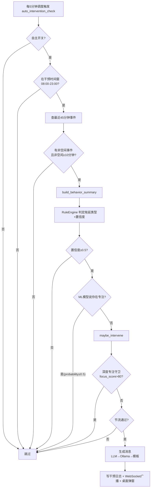

---

## 8.1 触发算法：怎么判定"你正在拖延/分心"

MindFlow **不是**靠"进入某个 App 就报警"这种一刀切规则，而是把"当前行为"和"这个人自己的历史正常水平"做比较，再叠加一套可解释的拖延类型规则。分四步：

### 8.1.1 第一步：把原始事件压缩成行为摘要 `BehaviorSummary`

每 5 分钟的调度任务 `_auto_intervention_check`（`scheduler.py:539`）会拉取**最近 45 分钟**的原始活动事件（`window_min=45`），交给 `build_behavior_summary()`（`infrastructure/llm/summary.py:96`）压缩成一个**隐私友好、不含窗口标题原文**的摘要对象，字段见 `domain/procrastination.py:69-85`：

| 字段 | 含义 | 由什么算出 |
|------|------|-----------|
| `context_switches_per_hour` | 每小时确认切换次数 | `switch_rate_per_hour()`（`domain/features.py:357`） |
| `longest_focus_block_s` | 最长连续专注块（秒） | `longest_focus_block_s()`（`domain/features.py:378`） |
| `social_media_ratio` | 娱乐/社交媒体时长占比 | 非空闲事件里娱乐类时长 / 总非空闲时长 |
| `start_delay_min` | 从开机到第一次正事活动的时间 | `_estimate_start_delay()` |
| `actual_focus_min` | 估算的"真正投入"分钟数 | `_estimate_focus_minutes()` |
| `keyword_flags` | 窗口标题关键词标记（自批评/重做等） | `_extract_keyword_flags()` |
| `baseline_deviation` | 相对个人基线的 Z 偏离（见 8.6） | 由调用方传入 |

关键细节：**切换计数是"防抖"的**。`count_confirmed_switches()`（`domain/features.py:223`）要求新进程在前台驻留至少 10 秒才算一次切换，并且忽略 `explorer.exe` 等系统瞬时进程——否则你在两个窗口间快速点一下鼠标就会把切换率冲到天上。

### 8.1.2 第二步：规则引擎判定拖延类型（L3 无 LLM 成本）

`RuleEngine.assess()`（`domain/procrastination.py:157`）是一个**确定性分类器**，零外部依赖，5 类拖延类型（基于 Steel 2007 的时间动机理论 TMT）：

| 拖延类型 | 触发条件 | 置信度公式 | 出处 |
|---------|---------|-----------|------|
| 冲动分心型 `impulsivity` | 最长专注块 < 300 秒 **且** 切换 ≥ 12 次/小时 | 切换率在 [12, 24] 线性映射到 [0.5, 0.95] | `procrastination.py:209-229` |
| 决策困难型 `decisional` | 启动延迟 > 30 分钟 **且** 启动后专注占比 > 0.4 | 延迟在 [30, 60] 分钟线性映射到 [0.5, 0.95] | `procrastination.py:231-257` |
| 完美主义型 `perfectionism` | 关键词标记含"自批评"或"反复重做" | 命中 1 个 → 0.6；2 个 → 0.85 | `procrastination.py:259-274` |
| 情绪调节型 `emotional_regulation` | 社交媒体占比 > 0.55 | 占比在 [0.55, 0.80] 线性映射到 [0.5, 0.95] | `procrastination.py:276-294` |
| 任务畏惧型 `task_aversion`（兜底） | 专注占比 < 0.35 **或** 基线偏离 < −0.5 | `max(0.4, 0.7 − 专注占比/0.35×0.3)` | `procrastination.py:296-325` |

置信度映射的数学核心是 `_linear_confidence()`（`procrastination.py:332`）——把连续指标线性插值到 [0.5, 0.95]：

```python
def _linear_confidence(value, threshold, saturation):
    # value 刚到阈值 → 0.5（最小可信触发线）
    # value 到达饱和点 → 0.95（不设 1.0，永远保留不确定）
    if value >= saturation:
        return 0.95
    return 0.5 + (value - threshold) / (saturation - threshold) * 0.45
```

`assess()` 最多返回 3 类，按置信度降序。若最高置信度 < 0.2（`NO_SIGNIFICANT_THRESHOLD`），判定为"未检测到显著拖延模式"，`recommended_technique` 为 None——调用方绝不能据此行动（`procrastination.py:187-195`）。

### 8.1.3 第三步：三道"闸门"才轮到真正弹窗

即使规则引擎说"你在拖延"，也要依次过三关（都在 `scheduler.py:539-836` 的 `_auto_intervention_check` 里）：

1. **自主开关**：`autonomy_service.is_enabled()` 为 False 直接跳过（用户可能点了"暂停 1 小时"，见 8.7）。
2. **干预时间窗**：本地时间不在 `[start_hour, end_hour)` 内跳过（默认 08:00–23:00，见 8.4）。
3. **数据充足性**：没有事件 / 全部空闲 / 非空闲时间不足 10 分钟（`_MIN_NON_IDLE_MINUTES`，`scheduler.py:81`）都跳过——用户只是开机看了两分钟就离开，不该被提醒。

然后 `RuleEngine` 置信度要 ≥ 0.5（`_AUTO_INTERVENTION_MIN_CONFIDENCE`，`scheduler.py:64`）。若置信度 ≥ 0.75，还会尝试升级到**专家面板**（LLM 多专家会诊）给出更精细的归因（`scheduler.py:740-789`），面板失败则回退到规则引擎的判定。

**ML 否决权**（`scheduler.py:721-727`）：如果训练好的 ML 模型预测"当前专注概率 ≥ 0.5"，即使规则引擎说你在拖延，也不打扰——ML 是"二次信号"，只能否决提醒，不能单独触发提醒。

### 8.1.4 第四步：`maybe_intervene` 内部的"深度专注守卫"

真正的弹窗由 `InterventionService.maybe_intervene()`（`intervention_service.py:492`）发出。它先做**深度专注守卫**：若最近事件算出的 `focus_score > 80`，说明用户正高度专注，零打扰（`intervention_service.py:158-166`）。

`focus_score` 的公式（`domain/features.py:285-330`）只有两个因子：

```
focus_score = top_app_ratio × 60 + (1 − switch_penalty) × 40

其中：
  top_app_ratio  = 最常用 App 的时长占比         （0~1）
  switch_penalty = min(切换率 / 30, 1.0)         （30 次/小时封顶）
```

直观理解：**长时间用同一个软件 = 专注加分；频繁切窗口 = 减分**。这两个因子解释了为什么它和基线偏离、拖延类型能互相印证。

---

## 8.2 干预分级：拖延类型 → 干预类型 → 强度 → 消息

### 8.2.1 类型映射（Type Map）

规则引擎给出的拖延类型，会被映射成 4 种**可执行的干预类型**（`intervention_service.py:89-95`）：

```python
_TYPE_MAP = {
    ProcrastinationType.TASK_AVERSION:        "task_breakdown",          # 任务分解
    ProcrastinationType.IMPULSIVITY:          "environment_optimization",# 环境优化
    ProcrastinationType.DECISIONAL:           "nudge",                   # 行动提示
    ProcrastinationType.PERFECTIONISM:        "smart_prioritization",    # 优先级建议
    ProcrastinationType.EMOTIONAL_REGULATION: "nudge",                   # 行动提示
}
```

每种干预类型对应一套中文文案模板（`intervention_service.py:67-84`），例如"任务分解"的建议是"在文档或编辑器中把任务拆解为 3-5 个小步骤"，"环境优化"是"关闭无关的浏览器标签页，退出娱乐类应用，开启系统勿扰模式"——**所有建议都必须是桌面操作**，因为 MindFlow 是桌面助手。

映射还有一个置信度护栏（`_select_intervention_type`，`intervention_service.py:169-186`）：若没有推荐 CBT 技巧且最高类型置信度 < 0.2，返回 None，直接跳过干预——绝不无中生有。

### 8.2.2 三档强度（Intensity）

`domain/intervention.py:29-38` 定义三档强度，逐级严肃：

| 强度 | 标题模板示例 | 正文语气 | 桌面通知 urgency | 弹窗停留时间 |
|------|-------------|---------|-----------------|-------------|
| `gentle` | "小提示：任务分解" | 建议性、可换个方式试试 | `low` | 60 秒 |
| `standard`（默认） | "来自 MindFlow 的提醒" | 检测到…建议尝试… | `normal` | 90 秒 |
| `strict` | "专注提醒" | 请考虑调整策略…持续注意 | `critical` | 120 秒 |

强度→urgency 映射在 `intervention_service.py:128-132`，urgency→弹窗超时在 `notification.py:40-44`。弹窗超时后自动记为 `ignored`（见 8.5）。

### 8.2.3 消息生成三级链（永不空白）

`maybe_intervene` 生成消息时走 `intervention_service.py:562-606`：

1. **L1 DeepSeek**（配置了 key）：把行为摘要 JSON + 干预类型 + 强度喂给 LLM，要求返回 `{title, message, urgency}`，标题 ≤14 字、正文 ≤100 字（`intervention_service.py:107-122`）。
2. **L2 Ollama 本地模型**：DeepSeek 失败时尝试，同一套 prompt。
3. **L3 模板兜底**：按类型模板 + 强度模板拼装，标题按"当天日期 % 变体数"轮换，避免每天都一模一样（`intervention_service.py:217-220`）。

LLM 输出是**不可信数据**：解析时强校长度上限，解析失败直接回退模板（`_parse_message_response`，`intervention_service.py:246-281`）。

---

## 8.3 节流机制：如何做到"提醒但不打扰"

`InterventionThrottle`（`intervention_throttle.py:86`）是**自动干预唯一的闸门**。手动触发（`POST /intervention/trigger`）绕过节流但计入限额。它靠查数据库而不是内存计数，所以重启后依然正确。

### 8.3.1 五条规则

| 规则 | 默认值 | 说明 | 出处 |
|------|--------|------|------|
| 每日总上限 | 每天 ≤ 3 次 | 防轰炸 | `intervention_throttle.py:53` |
| 冷却期 | 距上次 ≥ 2 小时 | 防连发 | `intervention_throttle.py:55` |
| 同类上限 | 每天 ≤ 2 次同类 | 防同一建议反复刷屏 | `intervention_throttle.py:54` |
| 疲劳检测 | 近 7 天忽略率 > 60% → 每日上限降到 1 | 用户老点"忽略"就该少打扰 | `intervention_throttle.py:56-57,160-164` |
| 厌烦检测 | 近 7 天某类型 "annoying" 反馈 ≥ 3 条 → 该类每日上限降到 1 | 用户明说讨厌就退让 | `intervention_throttle.py:58,191-213` |

所有计数**每天 0 点（UTC）归零**，因为 `today_start` 按当天零点重算（`intervention_throttle.py:145`）。

### 8.3.2 判定顺序（短路，第一条拒绝就返回）

`can_intervene()`（`intervention_throttle.py:124-218`）一次数据库查询取回全部统计（`get_throttle_stats`，`repositories/intervention.py:305`），然后按序判定：

```
1. 算 effective_daily_limit：忽略率高则降为 1
2. today_count ≥ 上限 → 拒绝(DAILY_CAP)
3. 距上次 < cooldown_h → 拒绝(COOLDOWN)，并告诉你还要等几分钟
4. 该类型 today_count_by_type ≥ 上限 → 拒绝(TYPE_CAP 或 ANNOYING)
5. 全过 → 放行(OK)
```

`ThrottleDecision` 是一个不抛异常的值对象，`reason` 用枚举（`intervention_throttle.py:33-48`），方便上层记录"为什么没弹"。

### 8.3.3 原子槽位保留（防并发超发）

`can_intervene` 是只读检查，检查和写入之间有空隙（TOCTOU 竞态）——两个调度任务可能同时通过检查然后各弹一次。解决办法是 `reserve_slot()`（`intervention_throttle.py:222`）：用 `INSERT … ON CONFLICT DO NOTHING` 在 `(user_id, date, slot_index)` 唯一约束上抢一个今日槽位，抢不到就说明另一个调用方先到，放弃（`repositories/intervention.py:487-538`）。这和预算系统共用同一套"数据库原子性当锁"的设计。

---

## 8.4 可配置干预时间窗

默认干预窗口是**本地时间 08:00–23:00**（`scheduler.py:73-74`）。时间窗判定在 `_auto_intervention_check` 开头（`scheduler.py:639-649`），`end_hour` 是**左闭右开**：`start_hour <= hour < end_hour` 才放行——所以默认配置下 23:00 整不会弹窗。

这个窗口不是写死的。最近一次提交 `de5dfd6 "fix: wire intervention time-window settings into build_scheduler"` 把它接进了配置系统：

- `Settings` 里新增 `intervention_start_hour`（默认 8）和 `intervention_end_hour`（默认 23，exclusive），见 `config.py:176-182`，均可用 `MINDFLOW_INTERVENTION_START_HOUR` 环境变量覆盖。
- `app.py:655-672` 在组装调度器时把它们透传给 `build_scheduler(...)`。
- `build_scheduler` 的 `start_hour`/`end_hour` 参数（`scheduler.py:853-854`）最终通过 `kwargs` 注入 `_auto_intervention_check`（`scheduler.py:1207-1209`）。

也就是说，用户（或打包时的配置）想改成"只在 9 点到 22 点提醒"，改一个环境变量即可，零代码改动。同一次提交还把弹窗按钮文案从英文改成了中文"接受 / 忽略 / 关闭"（`intervention_popup.py:29-33`）。

---

## 8.5 通知与弹窗：提醒是怎么"到"用户眼前的

`create_notifier()`（`notification.py:411`）按平台选后端，Windows 上优先级是：

```
Tkinter 交互弹窗（带按钮）→ win10toast → winrt → plyer → 写日志兜底
```

交互弹窗 `_TkinterInteractivePopup`（`notification.py:139-227`）会**另起一个 pythonw 子进程**跑 `intervention_popup.py`，一个置顶小窗，三个按钮：

- **接受** → POST `accepted`（用户照做了）
- **忽略** → POST `ignored`（用户没理）
- **关闭** → POST `dismissed`（用户明确关掉）
- **超时/点 X** → 记为 `ignored`

按钮点击直接回调后端 `POST /api/v1/intervention/{id}/response`（`intervention_popup.py:44-65`），把 `{response, latency_s}` 写进 `intervention_logs` 表。这样**用户无需回到网页就能反馈**，而且弹窗进程和主进程完全隔离，主进程崩了弹窗也不受影响。

---

## 8.6 调度器：每日分析 + 周期作业

### 8.6.1 为什么不是 APScheduler？

`overview` 里说技术栈是 APScheduler，但当前实现**已经换成纯 asyncio 调度器** `AsyncioScheduler`（`scheduler.py:164`）。原因写在模块 docstring（`scheduler.py:1-6`）：APScheduler 的 `AsyncIOScheduler` 在 Windows 上会触发 `CTRL_BREAK_EVENT`，被 uvicorn ≥0.41 误当作关闭信号——一句话，**Windows 上会莫名把服务搞退**。所以 MindFlow 自己用 `asyncio.create_task` 写了极简版 cron + interval，APScheduler 兼容接口（`get_jobs()` 等）保留只是为了测试。

### 8.6.2 作业清单（`build_scheduler`，`scheduler.py:839-1251`）

| 时间（本地） | 作业名 | 干什么 |
|------------|--------|--------|
| 23:30 | `daily_panel` | 专家面板会诊当天数据（LangGraph 多专家） |
| 23:59 | `identify_sessions` | 识别当天的专注时段 |
| 00:05 | `daily_report` | 生成**前一个工作日**的报告 |
| 02:45 | `telemetry_rollup` | 特征窗口滚动汇总 + 基线回填 |
| 03:00 | `event_cleanup` | 按保留策略删除原始事件 |
| 04:00 | `daily_backup` | 崩溃一致的 VACUUM INTO 快照备份 |
| 每 5 分钟 | `auto_intervention_check` | 实时干预判定（8.1 全流程） |
| 每 15 分钟 | `telemetry_rollup_recent` | 滚动汇总最近 2 小时特征窗口 |

注意：虽然 docstring 写着"每 30 分钟"，实际注册是 `_AUTO_INTERVENTION_INTERVAL_MINUTES = 5`（`scheduler.py:77,1195-1196`）——以代码为准。

### 8.6.3 错过作业怎么办？——幂等 + 启动恢复

- **幂等是防重跑的根基**：每天只跑一次的目标日期作业（`daily_panel`、`identify_sessions`、`daily_report`）通过 `_run_claimed_job`（`scheduler.py:438`）向 `scheduled_job_runs` 表写入一条"认领"记录，`claim()` 会检查该日期是否已成功。如果已经跑过，直接跳过——这就是为什么文档说"jobs are idempotent"。
- **心跳保活**：长作业认领后每 10 分钟发一次心跳（`_heartbeat_claim`，`scheduler.py:388`），心跳失败说明另一个实例接管了，当前作业自动取消。
- **启动恢复（catch-up）**：服务崩溃后重启，`_startup_recovery`（`scheduler.py:1037-1155`）只补跑**最近一个完整工作日**（`_STARTUP_RECOVERY_COMPLETE_DAYS = 1`，`scheduler.py:88`）的识别/面板/报告/遥测。故意只补 1 天——离线很久后启动不能突然跑一大堆 LLM 花大钱。
- **cron 任务的 catch_up 参数**：`daily_cron(..., catch_up=True)`（`scheduler.py:213`）用于 `daily_backup`——启动时若当天 04:00 已过且没备份过，先补一次再进入正常循环（`scheduler.py:328-339`）。

### 8.6.4 每日分析何时跑？

核心是 23:30 专家面板（`scheduler.py:985-1002`）。`business_today(timezone)` 决定"今天"的业务日，23:59 识别会话、次日 00:05 出报告。之所以选深夜，是因为"分析一天的数据"需要整天的原始事件都齐了。

---

## 8.7 基线算法：Welford 在线统计 + Z 分偏离

### 8.7.1 什么是"基线"

基线 = "这个人**平时**的样子"。MindFlow 把一天切成 24×7 个桶（本地小时的 0-23 × 星期的 0-6），每个桶维护每个特征的 `{n, mean, M2}`（`baseline.py:61-85`）。这样"周三上午 10 点"和"周日下午 3 点"有各自独立的"正常值"——周五深夜刷手机，对周五深夜的桶来说可能就是正常的，不该报警。

### 8.7.2 Welford 的三个数

用 Welford 在线算法更新均值/方差，**不用存历史数据、只存三个数**（`baseline.py:154-161`）：

```python
# 来了一个新样本 val，更新这个桶里该特征的状态
n     += 1
delta  = val - mean
mean  += delta / n
delta2 = val - mean
M2    += delta * delta2
```

需要方差时 `std = sqrt(M2 / (n - 1))`（样本标准差，`baseline.py:197`）。这就是"在线"的意义：**每个 5 分钟特征窗口到达时增量更新，O(1) 空间**，不用重新扫描历史。`update()` 还会跳过 NaN/Inf 值，防止污染统计量（`baseline.py:150-153`）。样本数 < 2 的桶不给出可信 std（返回 0，`baseline.py:192`）。

### 8.7.3 Z 分偏离（deviation）

`DeviationDetector.score_window()`（`deviation.py:49-110`）把当前 30 分钟窗口的每个特征和"对应 (hour, dow) 桶"比：

```
z_i = (val_i − mean_i) / max(std_i, 0.001)
overall = Σ (weight_i × |z_i|) / Σ weight_i
```

权重表在 `deviation.py:26-39`：行为类特征权重更高（切换频率 0.20、App 数 0.15），标题类特征权重低。严重度分级（`deviation.py:42-44`）：

| 总分 | 严重度 |
|------|--------|
| ≥ 4.0 | `severe` 极端异常 |
| ≥ 2.5 | `moderate` 明显异常 |
| ≥ 1.5 | `mild` 值得注意 |
| < 1.5 | `normal` 正常 |

`top_deviations` 取 |z| 最大的 3 个特征，供 LLM 上下文使用。**注意**：`deviation.py` 的 Z 分目前主要服务**每日分析报告**（找出一天里最反常的时段）；实时干预的"基线偏离"信号是 `BehaviorSummary.baseline_deviation`——规则引擎用它作为任务畏惧型的一个触发条件（`baseline_deviation < −0.5`，`procrastination.py:312-315`）。

---

## 8.8 反馈闭环：你的每次点击都改变未来

用户对提醒的响应会落到 `intervention_logs` 表，被**三处**消费：

1. **节流调节**（即时生效）：`get_throttle_stats` 计算 7 天忽略率（`user_response == "ignored"` 的比例）和同类 "annoying" 反馈数（`repositories/intervention.py:351-424`）。忽略率高 → 每日上限降为 1；annoying ≥ 3 → 同类上限降为 1。**用户点"忽略"多了，MindFlow 就自动闭嘴。**
2. **疗效评估**（`effectiveness_service.py`）：对每次干预，比较**干预前 30 分钟**与**干预后 30 分钟**的 `focus_score` / `switch_rate` / `distraction_ratio` 三个指标（`effectiveness_service.py:84-176`），得出 `deltas`。每周汇总给出 `acceptance_rate`（接受率）和三个指标的平均变化（`weekly_effectiveness`，`effectiveness_service.py:180-245`）——回答"这个提醒到底有没有把人拉回正事"。
3. **训练标签**：`intervention_logs` 中的 `user_response` 与 `feedback_rating` 与特征窗口一起构成 ML 训练数据（见第 3/4 章），让模型学习"什么状态下用户更可能接受提醒"。

`record_response` / `record_feedback` 由 API 层暴露（`api/routes/intervention.py:119-168`），弹窗按钮和前端反馈面板都会调用。

---

## 8.9 给初学者的完整复刻路线

目标是"**检测分心 → 弹提醒 → 不打扰**"。下面是最小可运行伪代码，把前面所有机制串起来：

```python
# 一、数据结构：用户偏好（自主开关）+ 干预日志
preferences = {"autonomy": {"enabled": True, "paused_until": None}}
intervention_logs = []   # 每条: {id, time, type, response, feedback}

# 二、工具：算行为摘要（只依赖原始事件）
def build_summary(events_45min):
    switches_h = confirmed_switches_per_hour(events_45min)   # 驻留10s+忽略瞬时进程
    longest    = longest_focus_block(events_45min)
    social     = entertainment_duration(events_45min) / non_idle_duration(events_45min)
    return Summary(switches_h, longest, social)

# 三、规则引擎：判定拖延类型 + 置信度
def assess(summary) -> (types, confidence):
    c = {}
    if summary.longest < 300 and summary.switches_h >= 12:
        c["impulsivity"] = clamp01(0.5 + (summary.switches_h-12)/12*0.45)   # 线性映射
    if summary.social > 0.55:
        c["emotional_regulation"] = clamp01(0.5 + (summary.social-0.55)/0.25*0.45)
    if not c and summary.focus_ratio < 0.35:
        c["task_aversion"] = max(0.4, 0.7 - summary.focus_ratio/0.35*0.3)
    return sort_by_confidence(c)[:3]

# 四、节流：5条规则短路判定
def throttle_check(type, now):
    today = 该用户今天已有的干预条数
    if today >= 3: return False                      # 每日上限3
    last  = 最近一次干预时间
    if now - last < 2h: return False                 # 冷却2小时
    if 今天该type条数 >= 2: return False             # 同类上限2
    if 7天忽略率 > 0.6: 每日上限改为1，重新判断        # 疲劳
    return True

# 五、主流程：每5分钟调用一次
async def auto_intervention_check():
    if not preferences["autonomy"]["enabled"]:      return
    if not (8 <= 本地小时 < 23):                     return   # 干预时间窗
    events = query_recent_events(45分钟)
    if 非空闲时长 < 10分钟:                          return
    summary = build_summary(events)
    types, conf = assess(summary)
    if not types or conf[types[0]] < 0.5:            return   # 置信度门
    if focus_score(events) > 80:                     return   # 深度专注守卫
    if not throttle_check(types[0], now):            return   # 节流
    type = type_map[types[0]]          # impulsivity→environment_optimization ...
    msg  = template[type][intensity]   # 或 LLM 生成
    log  = append(intervention_logs, {id, now, type, response=None})
    popup(msg, buttons=["接受","忽略","关闭"])   # 按钮回调写回 log.response

# 六、反馈闭环：弹窗回调
def on_response(log_id, response):
    log.response = response
    # 下次 throttle_check 会自动读到：ignored 多了→降频，annoying→同类降频
```

复刻时最容易漏的 5 个点：

1. **切换计数必须防抖**：不做"驻留 10 秒 + 忽略瞬时进程"，切换率会虚高，天天误报。
2. **置信度门**：宁可不提醒，也不要无中生有（< 0.5 跳过）。
3. **节流先于弹窗**：先算"该不该弹"，再算"弹什么"。
4. **时间窗左闭右开**：`end_hour` 本身不弹，避免 23:00:00 精确踩点。
5. **响应必须回写**：没有反馈，节流和疗效评估都失去依据。

---

## 8.10 可复刻性核对表

| 机制 | 代码位置 | 是否已理解 |
|------|---------|-----------|
| 行为摘要 | `infrastructure/llm/summary.py:96` | |
| 五类拖延规则 + 置信度 | `domain/procrastination.py:157-325` | |
| focus_score 公式 | `domain/features.py:285-330` | |
| 防抖切换计数 | `domain/features.py:223` | |
| 深度专注守卫 | `services/intervention_service.py:158-166` | |
| 类型→干预映射 | `services/intervention_service.py:89-95` | |
| 三档强度/urgency | `domain/intervention.py:29-38`、`intervention_service.py:128` | |
| 五条节流规则 | `services/intervention_throttle.py:124-218` | |
| 原子槽位 | `services/intervention_throttle.py:222`、`repositories/intervention.py:487` | |
| 干预时间窗 | `config.py:176-182`、`services/scheduler.py:639-649` | |
| 纯 asyncio 调度器 | `services/scheduler.py:164-382` | |
| 作业认领/心跳/启动恢复 | `services/scheduler.py:388-537,1037` | |
| Welford 基线 | `domain/baseline.py:116-199` | |
| Z 分偏离 | `domain/deviation.py:49-110` | |
| 疗效评估 | `services/effectiveness_service.py:84-286` | |
| 弹窗回写 | `infrastructure/intervention_popup.py:44-65` | |

> 下一步：把"行为摘要 → 规则引擎"这套换成 LangGraph 专家面板（第 5 章），或理解训练数据如何利用干预反馈打标签（第 3 章）。整个"检测→干预→反馈→训练"闭环就打通了。
