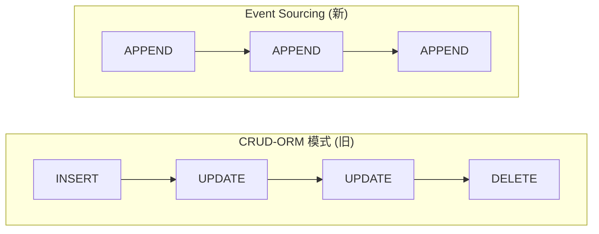
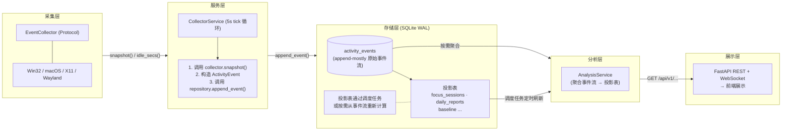
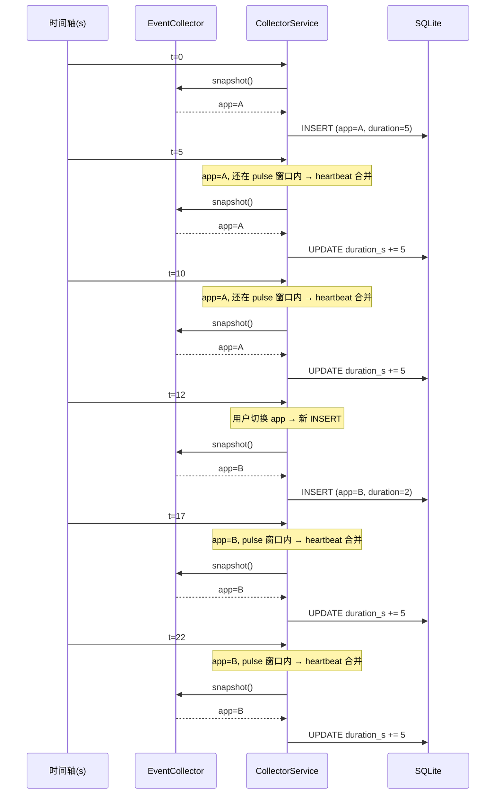
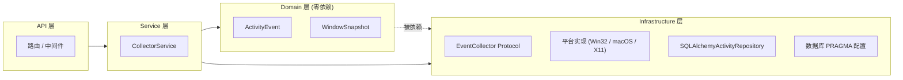
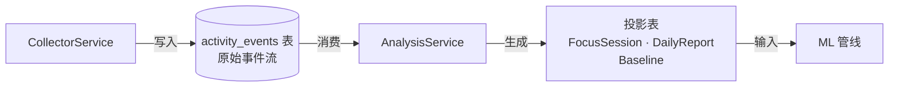

# 第2章 Event Sourcing 数据模型与跨平台采集器

> **面向读者**: 全栈入门开发者。看完应理解数据从"窗口事件"到"分析结果"的完整链路。
> **前置**: 第1章（架构总览）；**后续**: 第3章（ML 引擎如何消费事件流）
> **对应代码**: `backend-next/src/` 下的 `domain/`、`infrastructure/collectors/`、`infrastructure/repositories/`、`services/collector_service.py`

---

## 2.1 为什么从 CRUD-ORM 迁移到 Event Sourcing

### 2.1.1 旧架构的问题

在旧版 `backend/`（位于 `mindflow-app/backend/`）中，**ActivityLog** 表用 SQLAlchemy ORM 记录每 5 秒的窗口采样。核心缺陷是 **duration 无法精确计算**：

```python
# backend/mindflow/models/schemas.py (旧代码)
class ActivityLog(Base):
    __tablename__ = "activity_logs"

    id = Column(Integer, primary_key=True)
    duration_seconds = Column(Float, default=5.0)  # ← 这里写死了配置值
```

`duration_seconds` 始终等于 `collect_interval_seconds`（5 秒），而不是相邻 tick 之间的实际间隔。这意味着：

- 如果采集器因系统负载被延迟（实际间隔 7 秒），duration 仍记作 5 秒——**数据失真**。
- 如果用户暂停/恢复采集器，恢复后的第一个 tick 会把缺失时间计入——**统计偏差**。
- 任何事后分析都无法恢复真实的持续时间信息——**信息永久丢失**。

这是旧代码的 P0 技术债，也是重设计的第一推动力。

### 2.1.2 Event Sourcing 的核心思想

新架构将行为数据建模为**不可变的事件流**而不是可变的行。下面是旧模式和新模式的直观对比：

#### 图1: CRUD vs Event Sourcing 对比



CRUD 模式下，一行记录可以被 INSERT、UPDATE、DELETE，状态随时间变化。你无法从最终的行数据恢复历史过程。Event Sourcing 模式下，每条记录只追加一次，从不修改或删除。每一条 `ActivityEvent` 都是一次真实观测。duration 从相邻事件的 `timestamp_utc` 之差精确计算，不再依赖配置值。

### 2.1.3 append-mostly 与 heartbeat 合并

严格不可变的"纯追加"模型对桌面监控场景并不友好——用户在同一个应用里工作 30 分钟，纯追加模式会产生约 360 条 tick 记录，99% 的信息是冗余的（`app_name` 没变过）。

**妥协方案** —— **append-mostly**（ADR-001）：

- **常规行为**: 仅追加写入，从不修改历史事件。
- **唯一例外**: **heartbeat 合并**。当用户在 `pulsetime_s` 窗口内（默认 10 秒）未切换应用时，新 tick 不会插入新行，而是**原子性地将当前行的 `duration_s` 加上 tick 间隔**。

这个妥协将 90%+ 的磁盘写入压缩为单行 UPDATE，同时保留了"原始 tick 可以精确恢复"的信息完整性。详见 §2.4.2 的代码实现。

---

## 2.2 完整数据流

### 2.2.1 从采集到展示

#### 图2: 从采集到展示的完整数据流



**数据流说明**：采集层每 5 秒生成一次窗口快照，经过 `CollectorService` 封装为 `ActivityEvent` 后写入 `activity_events` 表。这张表是所有分析的基础——**FocusSession**、**DailyReport**、**BaselineModel** 等投影表都是从原始事件流计算出来的。计算可以按调度任务（每天定时）或按需（用户手动刷新）触发。原始事件流始终完整保留，投影表随时可以重新计算，所以历史数据的精度不会因为分析策略的调整而丢失。

### 2.2.2 采集器内部时序

#### 图3: 采集器时序交互



关键观察：
- 第 5 秒和第 10 秒：app_name 没变，时间差小于 10 秒 → 只 UPDATE 上一行的 `duration_s`，不 INSERT。
- 第 12 秒：用户切换 app → 新 INSERT。注意 `duration=2`，这是距离上一个 tick（第 10 秒）的实际时间差。
- 第 17 秒和第 22 秒：新 app 持续，仍在 pulse 窗口内 → heartbeat 合并继续生效。

---

## 2.3 SQLite 7 张表 Schema

> 所有时间戳存储格式为 **ISO8601 带时区的 UTC 字符串**（例如 `"2026-07-18T14:30:05.123456+00:00"`）。废弃了旧代码的 naive datetime（无时区信息的时间戳）策略（P0 技术债 #3）。

7 张表分为 1 张事件流核心表和 6 张投影表。先看核心表。

### 2.3.1 事件流核心表

```sql
-- activity_events: 事件流主干，append-mostly
CREATE TABLE activity_events (
    id TEXT PRIMARY KEY,                -- UUIDv7（时间排序，改善 B-tree 局部性）
    user_id INTEGER NOT NULL,
    timestamp TEXT NOT NULL,            -- ISO8601 UTC 带时区
    duration_s REAL NOT NULL DEFAULT 0.0, -- 距上一个事件的实测间隔
    data_json TEXT NOT NULL,            -- {"app_name":"...","window_title":"...","is_idle":false,...}
    event_type TEXT NOT NULL DEFAULT 'window_snapshot',
        -- 取值: window_snapshot | idle_change | manual_tag
    created_at TEXT NOT NULL DEFAULT (strftime('%Y-%m-%dT%H:%M:%SZ','now'))
);
CREATE INDEX idx_events_user_time ON activity_events(user_id, timestamp);
CREATE INDEX idx_events_type ON activity_events(user_id, event_type, timestamp);
```

`activity_events` 表设计要点：
- `id` 使用 **UUIDv7**（而非自增整数或 UUIDv4），因为 UUIDv7 按时间排序，写入时能利用 SQLite B-tree 的局部性原理（相邻数据在磁盘上相近），减少页分裂。相比之下，UUIDv4 的随机性会导致大量随机 I/O，写入性能下降。
- `data_json` 存储 JSON 字符串而非平铺列，因为事件类型扩展时平铺列需要改表结构（ALTER TABLE），而 JSON 字段只是换一个数据结构的事。
- 两个索引分别覆盖"按用户+时间查询"和"按用户+类型+时间查询"这两类最频繁的查询模式。

### 2.3.2 6 张投影表（从事件流计算得到）

投影表是从原始事件流通过聚合计算得到的分析产物。它们不接收原始写入，而是由调度任务或按需触发重新计算。这种架构保证了**原始数据不丢失，计算结果可追溯**。

```sql
-- focus_sessions: 专注会话（调度任务每天 23:59 生成，也可按需触发）
CREATE TABLE focus_sessions (
    id TEXT PRIMARY KEY,
    user_id INTEGER NOT NULL,
    date TEXT NOT NULL,                 -- YYYY-MM-DD
    start_time TEXT NOT NULL,
    end_time TEXT NOT NULL,
    session_type TEXT NOT NULL,         -- focus | distraction | neutral
    dominant_app TEXT,
    focus_score REAL,
    switch_count INTEGER,
    created_at TEXT NOT NULL DEFAULT (strftime('%Y-%m-%dT%H:%M:%SZ','now'))
);
CREATE INDEX idx_sessions_user_date ON focus_sessions(user_id, date);
```

```sql
-- daily_reports: 日报（幂等——每日只计算一次，UNIQUE 约束防止重复）
CREATE TABLE daily_reports (
    id TEXT PRIMARY KEY,
    user_id INTEGER NOT NULL,
    date TEXT NOT NULL,
    total_focus_min REAL DEFAULT 0,
    total_distraction_min REAL DEFAULT 0,
    focus_score REAL DEFAULT 0,
    top_apps_json TEXT,                 -- [{"app":"code","minutes":120},...]
    switch_frequency REAL DEFAULT 0,    -- 平均每小时切换次数
    pattern_summary TEXT,               -- 自然语言摘要
    created_at TEXT NOT NULL DEFAULT (strftime('%Y-%m-%dT%H:%M:%SZ','now')),
    UNIQUE(user_id, date)
);
```

**DailyReport 的幂等性**：`UNIQUE(user_id, date)` 保证每天每用户只有一条日报。如果重复调用生成逻辑，第二次会因为唯一约束失败而跳过。这避免了因调度器重复触发而生成重复数据。

```sql
-- procrastination_analyses: LLM 归因分析（幂等，每日期望 0-1 条）
CREATE TABLE procrastination_analyses (
    id TEXT PRIMARY KEY,
    user_id INTEGER NOT NULL,
    date TEXT NOT NULL,
    procrastination_types_json TEXT,    -- ["impulsivity","emotional_regulation"]
    type_confidence_json TEXT,          -- {"impulsivity":0.82,"emotional_regulation":0.67}
    cognitive_distortions_json TEXT,
    cbt_technique TEXT,
    response_text TEXT,
    llm_model TEXT,                     -- 使用的模型名称
    llm_cost_usd REAL,                  -- 单次调用的美元成本
    created_at TEXT NOT NULL DEFAULT (strftime('%Y-%m-%dT%H:%M:%SZ','now')),
    UNIQUE(user_id, date)
);
```

`procrastination_analyses` 记录了 LLM 对用户一天行为的归因分析结果。`llm_cost_usd` 字段用于监控 API 费用——如果三层降级链在实际使用中大多落到 L2 或 L3，用户可以据此决定是否值得使用 L1 的付费 API。

```sql
-- intervention_logs: 干预推送日志
CREATE TABLE intervention_logs (
    id TEXT PRIMARY KEY,
    user_id INTEGER NOT NULL,
    triggered_at TEXT NOT NULL,
    intervention_type TEXT NOT NULL,    -- task_breakdown | nudge | environment_optimization | smart_prioritization
    cbt_technique TEXT,
    context_json TEXT,                  -- 触发时的行为摘要
    user_response TEXT,                 -- accepted | ignored | dismissed
    response_latency_s REAL,
    created_at TEXT NOT NULL DEFAULT (strftime('%Y-%m-%dT%H:%M:%SZ','now'))
);
```

```sql
-- baseline_models: 个人基线模型（Welford 在线统计，JSON 大对象）
CREATE TABLE baseline_models (
    id TEXT PRIMARY KEY,
    user_id INTEGER NOT NULL UNIQUE,
    model_json TEXT NOT NULL,           -- Welford 统计值序列化 JSON
    training_events_count INTEGER DEFAULT 0,
    created_at TEXT NOT NULL DEFAULT (strftime('%Y-%m-%dT%H:%M:%SZ','now')),
    updated_at TEXT NOT NULL DEFAULT (strftime('%Y-%m-%dT%H:%M:%SZ','now'))
);
```

```sql
-- user_preferences: 用户偏好（Key-Value JSON）
CREATE TABLE user_preferences (
    id TEXT PRIMARY KEY,
    user_id INTEGER NOT NULL UNIQUE,
    preferences_json TEXT NOT NULL DEFAULT '{}',
    updated_at TEXT NOT NULL DEFAULT (strftime('%Y-%m-%dT%H:%M:%SZ','now'))
);
```

### 2.3.3 投影聚合策略

不同投影表有不同的触发方式和聚合逻辑，下表总结：

| 投影表 | 触发方式 | 聚合逻辑 |
|--------|----------|----------|
| FocusSession | 调度任务（每天 23:59）或按需 | 扫描 `activity_events BETWEEN start AND end`，窗口会话聚合，专注块分隔阈值可配置 |
| DailyReport | 调度任务（每天 00:01）或按需，幂等检查 | 聚合当天 FocusSession + ActivityEvent 统计 |
| BaselineModel | 每日增量更新 + 事件后缓冲更新 | **Welford 在线算法**，避免全量重新计算 |
| ProcrastinationAnalysis | LLM 归因调用后写入 | 写入一次，幂等性靠 `UNIQUE(user_id, date)` |
| InterventionLog | 每次干预推送时写入 | 追加日志，不覆盖 |
| EventCleanup | 调度任务（每天 03:00） | `DELETE FROM activity_events WHERE timestamp < now - 30d`，分批 10,000 行/事务 |

---

## 2.4 六段关键代码

### 2.4.1 ActivityEvent frozen dataclass

事件流的基本单元。**frozen=True** 保证运行时不可变——一旦创建，字段值不再改变。

`backend-next/src/mindflow/domain/events.py`

```python
@dataclass(frozen=True)
class WindowSnapshot:
    """A point-in-time observation of the active desktop window."""
    app_name: str
    window_title: str
    process_name: str
    is_idle: bool
    timestamp_utc: datetime

    def __post_init__(self) -> None:
        _check_aware(self.timestamp_utc, "WindowSnapshot.timestamp_utc")

    def to_dict(self) -> dict[str, Any]:
        return {
            "app_name": self.app_name,
            "window_title": self.window_title,
            "process_name": self.process_name,
            "is_idle": self.is_idle,
            "timestamp_utc": self.timestamp_utc.isoformat(),
        }

@dataclass(frozen=True)
class ActivityEvent:
    """An immutable activity event in the append-mostly event stream."""
    id: str               # UUIDv7, 时间排序
    user_id: int
    timestamp_utc: datetime
    duration_s: float     # 距上一个事件的实测秒数
    event_type: EventType # window_snapshot | idle_change | manual_tag
    data: WindowSnapshot  # 嵌套的不可变快照

    def __post_init__(self) -> None:
        _check_aware(self.timestamp_utc, "ActivityEvent.timestamp_utc")
        if self.event_type not in _VALID_EVENT_TYPES:
            raise ValueError(...)
```

**设计要点**：

- `frozen=True` 是 Python dataclass（数据类）层面的不可变保证，阻止运行时意外的字段修改。这对应 Event Sourcing 的不可变语义——事件一旦产生就不该被改变。
- `__post_init__` 中验证时区感知——所有 `datetime` 必须 `tzinfo is not None`。这是对旧代码 naive datetime 问题的彻底修复（之前因为没有时区信息，跨时区数据分析出现错误）。
- `to_dict`/`from_dict` 提供 JSON 安全的序列化，`datetime` 到 ISO8601 字符串的转换集中在这两个方法里，确保序列化格式一致。
- `WindowSnapshot` 被嵌套为 `ActivityEvent.data`，而不是平铺在表的各列中。这样当新增 `event_type` 时（比如将来加一个 `screen_capture` 类型），新的数据类型只需要新增一个 dataclass，不需要改表结构。

### 2.4.2 Heartbeat 合并 SQL UPDATE

这是 append-mostly 模型中唯一的 UPDATE 点，也是压缩 90%+ 写入量的关键。

`backend-next/src/mindflow/infrastructure/repositories/activity.py` (第 83-114 行)

```python
async def append_event(self, event: ActivityEvent) -> None:
    """Persist an activity event with heartbeat merge."""
    async with self._session_factory() as session, session.begin():
        last = await self._last_window_snapshot(session, event.user_id)

        if last is not None and self._should_merge(last, event):
            await session.execute(
                sa.update(activity_events)
                .where(activity_events.c.id == last.id)
                .values(
                    duration_s=activity_events.c.duration_s + event.duration_s
                )
            )
            return

        await session.execute(
            activity_events.insert().values(
                id=event.id,
                user_id=event.user_id,
                timestamp=event.timestamp_utc.isoformat(),
                duration_s=event.duration_s,
                data_json=json.dumps(event.data.to_dict()),
                event_type=event.event_type,
            )
        )
```

合并条件由 `_should_merge` 决定（第 196-223 行）：

```python
def _should_merge(self, last_row: sa.Row[Any], event: ActivityEvent) -> bool:
    """合并条件（全部满足）："""
    if event.event_type != "window_snapshot":
        return False           # idle/manual 不合并
    if last_app != event.data.app_name:
        return False           # 不同 app 不合并
    diff = (event.timestamp_utc - last_ts).total_seconds()
    return diff < self._pulsetime_s  # 超过时间窗口不合并（默认 10s）
```

**Heartbeat 合并解析**：

- `duration_s = activity_events.c.duration_s + event.duration_s` 是 **SQL 级的原子加法**——在数据库层面累加，没有"读→改→写"的竞争窗口。如果多个协程同时尝试合并同一行，数据库的事务隔离会保证正确性。
- 整个操作在**同一个事务**内：先查后写，如果合并则跳过 INSERT，保证并发安全。事务要么全部成功，要么全部回滚，不会出现"查到了但还没来得及写，被另一个协程插队"的情况。
- 合并只发生在最近一条 `window_snapshot` 上，历史行从未被修改——这也正是"append-mostly"而非"append-only"的精确含义。
- 三个条件必须全部满足才能合并：事件类型必须是 `window_snapshot`（空闲/手动标签事件不合并）、app 必须与上一行相同（切换应用不合并）、时间差必须在 pulse 窗口内（默认 10 秒）。

### 2.4.3 EventCollector Protocol 定义

跨平台采集的统一接口，使用 Python **Protocol**（协议类）而非 ABC 实现结构性类型检查。

`backend-next/src/mindflow/infrastructure/collectors/base.py` (第 34-73 行)

```python
@runtime_checkable
class EventCollector(Protocol):
    """Protocol for platform-specific active-window collectors."""

    async def snapshot(self) -> WindowSnapshot:
        """Capture the current active-window state.
        On transient failure returns degraded snapshot
        (app_name="unknown") with a logged warning.
        """
        ...

    async def idle_seconds(self) -> float:
        """Return seconds since last user input.
        Returns 0.0 when idle detection is unavailable or fails.
        """
        ...

def create_collector(platform: str | None = None) -> EventCollector:
    """Factory: return the appropriate EventCollector for platform."""
    if platform == "win32":
        return Win32Collector()
    if platform == "darwin":
        return DarwinCollector()
    if platform == "linux":
        xdg_session = os.environ.get("XDG_SESSION_TYPE", "").lower()
        if xdg_session == "wayland":
            return WaylandFallbackCollector()
        return X11Collector()
    raise CollectorUnavailableError(f"No collector available for: {platform!r}")
```

**为什么用 Protocol 而非 ABC**：`Protocol` 的好处是**结构性子类型**——只要一个类有 `async def snapshot(self) -> WindowSnapshot` 和 `async def idle_seconds(self) -> float`，在类型系统层面它就自动是 `EventCollector`，无需显式继承。这对测试 mock（你不需要继承 `EventCollector`，只要签名匹配就行）和添加新平台（写一个新类，Protocol 自动识别）都更灵活。`ABC` 需要 `class MyCollector(EventCollector)` 的显式继承声明，增加了不必要的耦合。

- `@runtime_checkable` 允许 `isinstance(collector, EventCollector)` 在运行时工作。
- 工厂函数 `create_collector` 隐藏了平台检测逻辑：调用方只需 `create_collector()`，不需要显式写 if-else 分支。
- 每种平台实现都限制在 200 行以内（ADR-002），避免单个文件过于庞大。

### 2.4.4 Win32 采集器核心

Windows 平台的具体实现，使用 Win32 API 获取前台窗口和空闲时间。

`backend-next/src/mindflow/infrastructure/collectors/win32.py` (第 34-117 行)

```python
class Win32Collector:
    """Windows active-window collector using native Win32 APIs."""

    def __init__(self) -> None:
        if sys.platform != "win32":
            raise CollectorUnavailableError("Win32Collector requires Windows")
        try:
            import psutil
            import win32gui
            import win32process
        except ImportError as exc:
            raise CollectorUnavailableError(
                "Win32Collector requires pywin32 and psutil"
            ) from exc

    async def snapshot(self) -> WindowSnapshot:
        """Capture active window via Win32 APIs (runs in thread)."""
        try:
            return await asyncio.to_thread(self._snapshot_sync)
        except Exception:
            logger.warning("Win32 snapshot failed", exc_info=True)
            return degraded_snapshot()

    def _snapshot_sync(self) -> WindowSnapshot:
        """Synchronous Win32 window capture — runs in a thread."""
        import win32gui, win32process, psutil as _psutil

        hwnd = win32gui.GetForegroundWindow()
        window_title = win32gui.GetWindowText(hwnd) or ""
        _, pid = win32process.GetWindowThreadProcessId(hwnd)

        try:
            proc = _psutil.Process(pid)
            process_name = proc.name() or "unknown"
        except (_psutil.NoSuchProcess, _psutil.AccessDenied):
            process_name = "unknown"

        return WindowSnapshot(
            app_name=process_name,
            window_title=window_title,
            process_name=process_name,
            is_idle=False,
            timestamp_utc=datetime.now(UTC),
        )

    async def idle_seconds(self) -> float:
        """Return idle seconds via GetLastInputInfo (runs in thread)."""
        try:
            return await asyncio.to_thread(self._idle_seconds_sync)
        except Exception:
            logger.warning("Win32 idle detection failed", exc_info=True)
            return 0.0
```

**Win32 采集器设计要点**：

- 所有阻塞 Win32 调用通过 `asyncio.to_thread` 在**线程池**中执行，不阻塞 asyncio 事件循环。这是 ADR-007 的核心要求——采集 tick 不应当让整个 API 服务器卡住。
- 构造函数在调用点（而非导入时）检测依赖——`pywin32` 或 `psutil` 缺失时抛出 `CollectorUnavailableError`，但不会在导入 `collectors/` 模块时爆炸。这意味着在 macOS 上构造 `Win32Collector()` 才会失败，而导入包含 `Win32Collector` 的模块不会。
- **降级策略**：`snapshot()` 或 `idle_seconds()` 的任何异常都被捕获、记录日志，并返回"安全值"（`app_name="unknown"` 的快照或 `0.0` 空闲秒数）。采集器永不崩溃。如果依赖出了问题，你得到的是降级数据，不是进程崩溃。
- `_LastInputInfoStruct` 使用 `ctypes` 访问 Windows `GetLastInputInfo` API，其中有 `uint wraparound` 保护——`GetTickCount` 每约 49.7 天归零，代码处理了这个边界情况。

### 2.4.5 CollectorService tick 循环 + sentinel stop

采集循环的业务逻辑：组合 collector + repository，按固定间隔轮询。

`backend-next/src/mindflow/services/collector_service.py` (第 39-201 行)

```python
class CollectorService:
    """Background collector service — polls the active window on a tick."""

    def __init__(self, collector: EventCollector, repository: ActivityRepository,
                 user_id: int = 1, interval_s: float | None = None,
                 idle_threshold_s: int = 60) -> None:
        self._collector = collector
        self._repository = repository
        self._user_id = user_id
        self._interval_s = interval_s or float(get_settings().collect_interval_s)
        self._idle_threshold_s = idle_threshold_s
        self._task: asyncio.Task[None] | None = None
        self._status: str = "stopped"
        self._stop_requested: bool = False
        self._consecutive_failures: int = 0

    async def start(self) -> None:
        """Start the collection loop (idempotent)."""
        if self._task is not None:
            return
        self._status = "running"
        self._stop_requested = False
        self._consecutive_failures = 0
        self._task = asyncio.create_task(self._run())

    async def stop(self) -> None:
        """Stop gracefully: sentinel flag + timeout cancel fallback."""
        if self._task is None:
            return
        self._status = "stopping"
        self._stop_requested = True
        try:
            await asyncio.wait_for(self._task, timeout=self._interval_s * 2)
        except TimeoutError:
            logger.warning("CollectorService stop timeout — cancelling task")
            self._task.cancel()
            with contextlib.suppress(asyncio.CancelledError):
                await self._task
        self._task = None
        self._status = "stopped"

    async def _run(self) -> None:
        """Main loop: runs until stop_requested or 10 consecutive failures."""
        while not self._stop_requested:
            tick_start = datetime.now(UTC)
            try:
                await asyncio.wait_for(self._tick(), timeout=self._interval_s * 2)
                self._consecutive_failures = 0
            except (TimeoutError, Exception):
                self._consecutive_failures += 1
                if self._consecutive_failures >= 10:
                    self._status = "degraded"
                    break
            elapsed = (datetime.now(UTC) - tick_start).total_seconds()
            await asyncio.sleep(max(0.0, self._interval_s - elapsed))

    async def _tick(self) -> None:
        """Execute a single collection tick."""
        now = datetime.now(UTC)
        actual_duration = ((now - self._last_tick_time).total_seconds()
                           if self._last_tick_time else float(self._interval_s))
        self._last_tick_time = now

        snapshot = await self._collector.snapshot()
        idle_secs = await self._collector.idle_seconds()
        is_idle = idle_secs >= self._idle_threshold_s
        event_type: EventType = "idle_change" if is_idle else "window_snapshot"

        event = ActivityEvent(
            id=new_id(), user_id=self._user_id, timestamp_utc=now,
            duration_s=actual_duration, event_type=event_type,
            data=WindowSnapshot(
                app_name=snapshot.app_name, window_title=snapshot.window_title,
                process_name=snapshot.process_name, is_idle=is_idle,
                timestamp_utc=now,
            ),
        )
        await self._repository.append_event(event)
```

**CollectorService 设计解析**：

- `stop()` 使用 **sentinel 模式**（哨兵标志模式）：设置 `_stop_requested = True`，等待当前 tick 自然结束，超时后备 `task.cancel()`。这保证正在写入的事件被持久化后才关闭（对应 P1-1 需求）。相对于强制取消，这种"请求停止→等待完成→超时强杀"的三段式更加安全。
- 单 tick 失败不会杀死循环；**连续 10 次失败**才将状态转为 `degraded`（防止瞬时错误误停）。这避免了因一次网络抖动或系统负载尖峰就停止采集。
- `_tick()` 中的 `actual_duration` 使用**实际测量值**而非配置值——这正是解决旧代码 P0 缺陷的关键改动。
- tick 间隔通过 `max(0.0, self._interval_s - elapsed)` 补偿：如果某个 tick 耗时 2 秒，下次 sleep 只等 3 秒，维持 5 秒的平均间隔。不补偿的话，总体采样频率会低于配置值，长期累积产生系统性的 duration 低估。
- `asyncio.wait_for` 保护：单个 tick 超过 `interval_s * 2` 自动超时，防止挂死的采集器阻塞循环。

### 2.4.6 WAL PRAGMA 数据库配置

SQLite **WAL 模式**（Write-Ahead Logging，预写式日志）的配置通过 SQLAlchemy `event.listen` 绑定到每个新连接。

`backend-next/src/mindflow/infrastructure/database.py` (第 32-71 行)

```python
def _set_wal_pragmas(dbapi_connection: Any, _connection_record: Any) -> None:
    """Configure SQLite WAL-mode PRAGMAs on new connection (NF-P4)."""
    cursor = dbapi_connection.cursor()
    cursor.execute("PRAGMA journal_mode=WAL")           # 并发读写
    cursor.execute("PRAGMA synchronous=NORMAL")          # 平衡安全与性能
    cursor.execute("PRAGMA busy_timeout=5000")           # 忙等 5s 而非报错
    cursor.execute("PRAGMA journal_size_limit=67108864") # WAL 文件上限 64MB
    cursor.execute("PRAGMA foreign_keys=ON")             # 外键约束
    cursor.close()

def create_engine(db_url: str, **kwargs: Any) -> AsyncEngine:
    """Create a configured AsyncEngine for SQLite WAL."""
    engine = create_async_engine(
        db_url,
        echo=False,
        connect_args={"check_same_thread": False} if "sqlite" in db_url else {},
        **kwargs,
    )
    if "sqlite" in db_url:
        event.listen(engine.sync_engine, "connect", _set_wal_prgmas)
    return engine
```

**WAL 配置解析**：

- `event.listen(engine.sync_engine, "connect", _set_wal_pragmas)` 是**事件监听器**，不是简单函数调用——每次新数据库连接建立时自动调用，调用方不需要手动处理。如果你忘记调用，SQLite 会使用默认的 journal 模式（DELETE），那会严重影响并发性能。
- 每个 PRAGMA 有明确的角色：
  - `journal_mode=WAL`：允许并发读取 + 一个写入器，写入器不阻塞读取器。
  - `synchronous=NORMAL`：在 checkpoint 时同步 WAL 文件，比 FULL 快约 2 倍，与 WAL 组合时安全级别等价于旧模式的 FULL。
  - `busy_timeout=5000`：等待 5 秒而不是立即返回 `SQLITE_BUSY`——这对 5 秒采集 tick 特别重要，采集器不会因为短暂锁冲突而丢失 tick。
  - `journal_size_limit=67108864`：WAL 文件不无限增长，超过 64 MB 时自动 checkpoint 压缩。

此外，`integrity_check()`（同文件第 90-124 行）在启动时运行，失败后自动尝试 `VACUUM` 恢复，最终失败则记录日志但允许继续启动——这是 NF-R5 的容错设计。

---

## 2.5 跨平台采集协议

### 2.5.1 协议定义回顾

`EventCollector` 协议只有两个方法：

```python
class EventCollector(Protocol):
    async def snapshot(self) -> WindowSnapshot: ...
    async def idle_seconds(self) -> float: ...
```

任何类满足这个签名即可作为采集器使用。目前有 4 个实现：

| 平台 | 实现类 | 依赖 | 窗口获取方式 | 空闲检测方式 |
|------|--------|------|--------------|--------------|
| Windows | `Win32Collector` | pywin32, psutil | `win32gui.GetForegroundWindow()` | `GetLastInputInfo` (ctypes) |
| macOS | `DarwinCollector` | PyObjC | `NSWorkspace.sharedWorkspace().activeApplication` | `CGEventSourceSecondsSinceLastEventType` |
| Linux X11 | `X11Collector` | python-xlib | EWMH `_NET_ACTIVE_WINDOW` 属性 | 扩展空闲检测或 fallback |
| Linux Wayland | `WaylandFallbackCollector` | psutil（降级） | 仅进程名，无窗口标题 | 回退到进程级统计 |

### 2.5.2 降级契约

无论哪个平台，以下规则对所有实现强制执行：

1. **构造时不 raise**（除了 `CollectorUnavailableError`，只在依赖缺失时抛出）。
2. **`snapshot()` 永不 raise**——失败时返回 `app_name="unknown"` 的降级快照并记录日志。
3. **`idle_seconds()` 永不 raise**——失败时返回 `0.0`。
4. **阻塞调用通过 `asyncio.to_thread` 委托**到线程池，不阻塞事件循环。

这四条规则构成了采集器的**可靠性契约**：调用方不需要 try/except 包裹每一次采集调用，也不需要关心底层平台是哪个。如果出现异常，返回降级数据而不是传播异常。

### 2.5.3 工厂函数

`create_collector(platform=None)` 处理所有平台路由逻辑。调用方只需：

```python
collector = create_collector()  # 自动检测当前平台
service = CollectorService(collector=collector, repository=repo)
await service.start()
```

---

## 2.6 与第 1 章和第 3 章的衔接

### 与第 1 章的关系

第 1 章介绍了四层架构（api → services → domain ← infrastructure）。本章的每个组件明确属于某一层：

#### 图4: 组件层归属



| 组件 | 层 | 依赖方向 |
|------|----|----------|
| `ActivityEvent`, `WindowSnapshot` | Domain | 零依赖（纯 Python） |
| `CollectorService` | Application/Service | 依赖 Domain + Infrastructure |
| `EventCollector` Protocol + 平台实现 | Infrastructure | 依赖 Domain（WindowSnapshot） |
| `SQLAlchemyActivityRepository` | Infrastructure | 依赖 Domain + SQLAlchemy |
| 数据库 PRAGMA 配置 | Infrastructure | 依赖 SQLAlchemy aiosqlite |

Domain 层的 Event/WindowSnapshot 被 Infrastructure 层引用，而 Service 层编排两者——这正是第 1 章"依赖方向"规则的具体实例。

### 与第 3 章的关系

#### 图5: ML 引擎与事件流的关系



第 3 章的 ML 引擎消费的是**事件流**，而不是直接读写采集数据。具体来说：

- ML 引擎的 **BaselineModel**（Welford 在线算法）在每次新事件到来后增量更新。
- **DeviationDetector** 在单个时间段内扫描事件流计算 z-score（标准化偏离分数）。
- **FocusSession** 识别扫描 `activity_events` 按时间窗口聚合。

第 3 章将详细展示这些投影是如何从原始事件流计算得到的。

---

## 2.7 小结

| 概念 | 一句话 |
|------|--------|
| **Event Sourcing** | 不可变事件流，duration 按实际时间差计算，而非配置值估算 |
| **append-mostly** | 常规只追加，唯一例外是同应用 pulse 窗口内的 heartbeat UPDATE |
| **heartbeat 合并** | SQL 级原子累加，减少 90%+ 磁盘写入 |
| **EventCollector Protocol** | 两个方法、四个平台实现，降级永不崩溃 |
| **WAL 模式** | SQLite 高性能并发所需：WAL + NORMAL + busy_timeout + journal_size_limit |
| **6 张投影表** | 从原始事件流按需/定时计算的分析结果，始终可追溯 |

下一章将深入 ML 引擎如何消费这个事件流，从专注分数计算到偏离检测到行为聚类。
