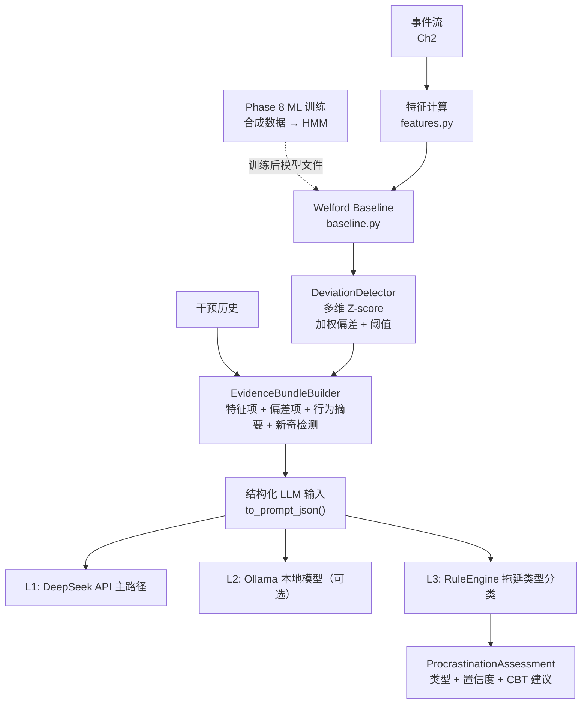
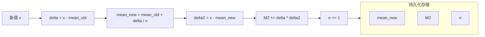
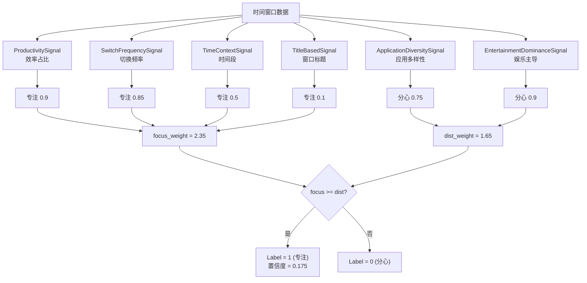
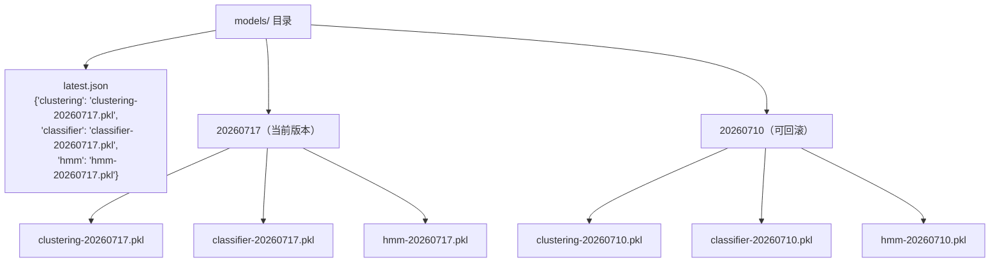

# 第3章 ML 行为分析引擎

> 本章覆盖：BaselineModel（Welford 在线算法）、DeviationDetector（多维 Z-score）、
> ConsensusLabeler（弱监督 6 信号投票）、ProcrastinationType（TMT 规则引擎）、
> 合成数据生成、模型训练管线、EvidenceBundle 组装。
>
> **前置阅读**：第2章（消费事件流）；**后续衔接**：第4章（LLM 管线消费证据）。

---

## 3.1 设计思路：ML 的三重角色

MindFlow 的 ML 层不只是一个"训练模型→部署→预测"管线。它在系统中承担三重角色：

1. **证据供给者** — 将原始事件流转化为结构化证据，供 LLM 专家面板消费。
2. **辩论裁判** — 当 LLM 专家意见冲突时（参见第4章 critic 评审），ML 层提供的基线偏差和置信度分数是仲裁依据。
3. **廉价前哨** — 在 LLM API 不可用或预算超限时，规则引擎以零成本提供兜底分析。

这些角色对应三条能力链，共同构成完整的 ML 流水线：

#### 图 3-1: ML 流水线总览



**本章焦点**：上图虚线框内的**证据供给链**——从特征计算到 EvidenceBundle 组装的完整路径。LLM 降级链（L3）在本章介绍，L1/L2 留待第4章。

---

## 3.2 Welford 在线基线（BaselineModel）

### 为什么需要在线算法？

用户的行为基线随时间漂移。今天"专注"的值可能和一个月前不同。Welford 在线算法允许**增量更新均值和方差**，无需保留全部历史数据——每接收一个新样本，只需 O(1) 的更新操作即可修正统计量。

**file:** `domain/baseline.py`

```python
# 核心：Welford 在线均值和二阶矩更新  [baseline.py:98-103]
prev = bucket[col]
prev["n"] += 1.0
delta = val_f - prev["mean"]
prev["mean"] += delta / prev["n"]
delta2 = val_f - prev["mean"]
prev["M2"] += delta * delta2
```

用人话说就是：Welford 算法每次只记三个数——样本数 `n`、当前均值 `mean`、以及一个叫 `M2` 的累积量。新数据来了，均值微调一步，`M2` 也更新一步。这样不管数据量多大，存储开销都是 O(1)，不用像传统方法那样存全部历史再重新算。

**解析：** 这是 Welford 算法的标准实现。与传统公式不同，这里不需要同时保留旧均值和新均值——`delta` 用更新**前**的均值，`delta2` 用更新**后**的均值，`M2` 累积二阶中心矩。在 `get_stats()` 中，方差通过 `M2 / (n - 1)` 计算，即样本方差的无偏估计。

#### 图 3-2: Welford 在线算法更新流程



这张图展示了一次完整更新：新数据到达后，先用旧均值算第一个差值 `delta`，更新均值，再用新均值算第二个差值 `delta2`，最后用两个差值的乘积更新 `M2`。

### 24x7 时段桶结构

基线按小时和星期分桶存储，形成 168 个独立统计窗口。这样做的理由是：**用户在工作日上午 10 点和周末晚上 10 点的行为模式不可比**。如果把不同时段的数据混在一起算基线，会得到一个"高不成低不就"的平均值，对任何时段都不准确。

```python
# 48 行三维嵌套字典：stats[hour][dow][feature]  [baseline.py:51-64]
self._stats: dict[int, dict[int, dict[str, dict[str, float]]]] = {}

def _init_buckets(self) -> None:
    for hour in range(24):
        self._stats[hour] = {}
        self._top_apps[hour] = {}
        for dow in range(7):
            self._stats[hour][dow] = {}
            self._top_apps[hour][dow] = {}
```

用人话说就是：系统在内存里维护了一张 24x7 的表，每个格子存一组特征统计（均值、方差、样本数）。这样当你问"周三上午十点的专注分数正常吗"时，系统能精确地跟"周三上午十点的历史数据"对比，而不是跟"所有时间段的平均"对比。

**解析：** `_stats` 是一个四层嵌套字典：小时(0-23) → 星期(0-6) → 特征名 → 统计量 `{n, mean, M2}`。这种结构直接对应 SQL 中的 `GROUP BY hour_of_day, day_of_week`，但纯内存操作避免了每秒更新带来的数据库写放大。

当 `get_stats(hour, dow)` 返回一个桶的统计时，`DeviationDetector` 可以 O(1) 地查找当前时段的基线均值与标准差。

### 数据充分性检查

```python
# 检查整体和分桶的数据量  [baseline.py:151-179]
def has_sufficient_data(self, min_samples: int = 30) -> bool:
    total = self.total_samples()
    return total >= min_samples

def has_bucket_sufficient_data(self, hour: int, dow: int, min_samples: int = 2) -> bool:
    bucket = self._stats.get(hour, {}).get(dow, {})
    if not bucket:
        return False
    return all(int(s.get("n", 0)) >= min_samples for s in bucket.values())
```

用人话说就是：系统不会在新用户刚用 5 分钟就下结论说"你偏离了基线"——先问两个问题：一是总体上你有 30 个样本吗（约 1-2 天活动量）？二是当前这个时段你有至少 2 个样本吗？两个都满足，偏差检测才算数。这就是"等数据够了再说"的设计思路。

**解析：** 两层检查：整体 `has_sufficient_data()` 确保用户至少积累了 30 个样本（约 1-2 天的活动量），然后 `has_bucket_sufficient_data()` 检查当前时段桶是否有至少 2 个样本。两个检查都通过，偏差检测才有统计意义。

---

## 3.3 多维 Z-score 偏差检测

### 加权偏差分数

`DeviationDetector` 将当前时间窗口的每个特征值与基线对比，计算加权 Z-score。权重不是平均分配的——行为特征（切换频率、应用数量）比标题特征（基于窗口标题推断的内容类型）权重更高，原因是标题分析依赖采集器是否捕获到了窗口标题文本，可靠性不如行为特征。

```python
# 特征权重表与 Z-score 阈值  [deviation.py:26-44]
FEATURE_WEIGHTS: dict[str, float] = {
    "switch_frequency": 0.20,
    "unique_app_count": 0.15,
    "max_app_duration": 0.10,
    "idle_ratio": 0.10,
    "productivity_ratio": 0.05,
    "entertainment_ratio": 0.05,
    "social_ratio": 0.05,
    "title_code_ratio": 0.05,
    "title_doc_ratio": 0.05,
    "title_url_ratio": 0.05,
    "title_meeting_ratio": 0.05,
    "title_entertainment_ratio": 0.10,
}

MILD_THRESHOLD = 1.5     # 明显但常见
MODERATE_THRESHOLD = 2.5 # 明显异常
SEVERE_THRESHOLD = 4.0   # 极端异常
```

看懂权重分配的关键：`switch_frequency`（切换频率）权重最高（0.20），因为它是专注力的核心指标——频繁切换应用通常是分心的信号。标题特征的累计权重有 0.45，但每项不超过 0.10，即使标题检测暂时缺失（比如采集器没捕获到窗口标题），单个特征的缺失不会大幅影响总分。三个阈值 1.5 / 2.5 / 4.0 分别对应**轻微偏离** / **中度异常** / **严重异常**三级告警。

**解析：** `switch_frequency` 权重 0.20（最高），"切换频率"是 MindFlow 判断专注力的核心指标。`unique_app_count` 次之（0.15）。标题特征的累积权重为 0.45，但每一项不高于 0.10，以降低标题检测缺失时的影响。

### Z-score 计算

```python
# 核心 Z-score 与加权和  [deviation.py:66-86]
for feature, weight in self.FEATURE_WEIGHTS.items():
    val_raw = row.get(feature)
    if val_raw is None:
        continue
    val = float(val_raw)
    stats = bucket_stats.get(feature, {"n": 0.0, "mean": 0.0, "std": 0.0})
    n = int(stats["n"])
    if n < 2 or stats["std"] == 0.0:
        z = 0.0       # 数据不足或零标准差 → 不贡献偏差
    else:
        z = (val - stats["mean"]) / max(stats["std"], 0.001)
    z = max(min(z, 10.0), -10.0)  # 截断到 [-10, 10]
    z_scores[feature] = round(z, 3)
    weighted_sum += weight * abs(z)
    total_weight += weight

overall = round(weighted_sum / max(total_weight, 0.001), 3)
```

用人话说就是：对每个特征算一个"偏离了多少个标准差"（Z-score），然后把所有特征的 Z-score 按权重加起来。如果某个特征的数据不足（样本数 < 2 或标准差为 0），Z-score 取 0，相当于它不参与打分。每个特征的 Z-score 被限制在 [-10, 10] 之间，防止一个特征的极端异常把总分拉得太离谱。

**解析：** 每个特征计算 Z = (观测值 - 均值) / 标准差。当标准差为 0 或样本不足时，Z 取 0（不贡献偏差）。Z 值被截断到 [-10, 10] 防止某个特征的极端异常污染整体分数。最终偏差分数是所有特征 `weight * |Z|` 之和的加权平均——这实际上是向量范数的变形。

---

## 3.4 6 信号 Consensus Labeler

### 弱监督替代人工标注

MindFlow 没有人工标注数据。`ConsensusLabeler` 实现了多信号弱监督（weak supervision with multiple labeling functions），用 6 个独立的启发式信号投票决定一个时间窗口是"专注"(1)还是"分心"(0)，每个信号附带置信度。

用人话说就是：不靠人工打标签，而是让 6 个"小侦探"各自提供线索——有的看切换频率，有的看应用类型，有的看时间段。每个侦探投票时还会附上一句"我有 x% 的把握"。最后综合所有侦探的意见得出结论。

```python
# 6 信号投票与加权共识  [labeling.py:165-211]
class ConsensusLabeler:
    def __init__(self, signals=None):
        if signals is not None:
            self.signals = list(signals)
        else:
            self.signals = [
                ProductivitySignal(),
                SwitchFrequencySignal(),
                TimeContextSignal(),
                ApplicationDiversitySignal(),
                EntertainmentDominanceSignal(),
                TitleBasedSignal(),
            ]

    def label_single(self, row: Mapping[str, Any]) -> tuple[int, float]:
        votes: list[tuple[int, float]] = [s(row) for s in self.signals]

        focus_weight = 0.0
        dist_weight = 0.0
        for vote, confidence in votes:
            if vote == 1:
                focus_weight += confidence
            else:
                dist_weight += confidence

        total_weight = focus_weight + dist_weight
        if total_weight == 0:
            return 1, 0.0

        label = 1 if focus_weight >= dist_weight else 0
        majority_weight = max(focus_weight, dist_weight)
        weighted_agreement = majority_weight / total_weight
        confidence = max(0.0, (weighted_agreement - 0.5) * 2.0)

        return label, round(confidence, 4)
```

用人话说就是：6 个信号各自投一票（"专注"或"分心"）并附带一个置信度（0 到 1 之间的数）。系统把"专注"方的置信度加起来，再把"分心"方的加起来。比如专注方得到 2.1，分心方得到 1.2，那"专注"以 2.1 比 1.2 胜出。然后看共识程度：如果两方力量很接近（比如 1.7 vs 1.6），置信度就低，说明"这个标签其实比较勉强"。

**解析：** 6 个信号各自独立投票 `(vote, confidence)`，然后加总"专注"和"分心"两方的置信度加权和。置信度 = `(多数派权重 / 总权重 - 0.5) * 2`，在 [0, 1] 区间——这是"共识程度"的标准化度量。当三方投专注（置信度 0.7, 0.6, 0.8）而另三方投分心（0.3, 0.4, 0.5），`focus_weight = 2.1`，`dist_weight = 1.2`，结果 Label=1，置信度 = `(2.1/3.3 - 0.5)*2 = 0.27`——清晰揭示了这个标签其实是弱共识。

#### 图 3-3: 6 信号共识投票流程



### 6 个信号的构成

每个信号基于不同的行为维度，设计为相互独立的启发式：

| 信号 | 专注触发条件 | 分心触发条件 | 最高置信度 |
|------|-------------|-------------|-----------|
| `ProductivitySignal` | productivity_ratio > 0.8 **且** switch_freq < 10 | productivity_ratio < 0.2 | 0.9 |
| `SwitchFrequencySignal` | switch_freq < 5 | switch_freq > 40 | 0.85 |
| `TimeContextSignal` | 9-12am 或 2-5pm 工作日 | 0-2am 或 10-11pm | 0.5 |
| `ApplicationDiversitySignal` | unique_apps <= 2 | unique_apps >= 6 | 0.75 |
| `EntertainmentDominanceSignal` | 娱乐和社会占比均 < 0.05 | 任一 > 0.5 | 0.9 |
| `TitleBasedSignal` | code + doc 比例 > 0.5 | 娱乐标题 > 0.3 | 0.85 |

`TitleBasedSignal` 在标题数据缺失时返回 `(1, 0.1)`——即投"专注"一分但置信度极低，相当于**弃权**，不显著影响总体结果。

---

## 3.5 专注分数与特征计算

### 专注分数公式

`focus_score` 是 [0, 100] 的连续值，由两个因子组成：

**公式：**
```
focus_score = top_app_ratio x W_top + (1 - switch_penalty) x W_switch
```

其中 `W_top = 60`，`W_switch = 40`（总和恒为 100）。

用人话说就是：专注分数看两件事——你是不是长时间待在一个应用里（top_app_ratio），以及你切换应用的频率高不高（switch_penalty）。第一项占 60 分，第二项占 40 分。如果你 80% 的时间都在同一个应用且很少切换，分数就接近 100；如果你每 2 分钟切一次应用，分数就很低。

```python
# 专注分数核心计算  [features.py:185-230]
def focus_score(events: list[ActivityEvent], weights=None) -> float:
    w = weights if weights is not None else DEFAULT_FOCUS_WEIGHTS
    top_app_weight = w.get("top_app_weight", 60.0)
    switch_weight = w.get("switch_weight", 40.0)

    active = _non_idle_events(events)
    if len(active) < MIN_ACTIVITY_THRESHOLD:  # 至少 10 个非空闲事件
        return 0.0

    # App durations
    app_durations: dict[str, float] = {}
    for ev in active:
        app_durations[ev.data.process_name] = (
            app_durations.get(ev.data.process_name, 0.0) + ev.duration_s
        )
    if not app_durations:
        return 0.0

    total_duration = sum(app_durations.values())
    top_app_ratio = max(app_durations.values()) / total_duration if total_duration > 0 else 0.0

    switch_freq = switch_rate_per_hour(active)
    switch_penalty = min(switch_freq / MAX_ACCEPTABLE_SWITCHES_PER_HOUR, 1.0)

    raw_score = (top_app_ratio * top_app_weight) + ((1.0 - switch_penalty) * switch_weight)
    return round(min(max(raw_score, 0.0), 100.0), 1)
```

**解析：** `top_app_ratio` 表示最常用应用的占比——如果在 30 分钟内 80% 的时间都在同一应用，这是一个强烈的专注信号。`switch_penalty` 是切换频率相对于 `MAX_ACCEPTABLE_SWITCHES_PER_HOUR = 30` 的比例，封顶为 1.0（即切换频率 >= 30 次/时时惩罚满分）。60:40 的权重意味着专注分数更依赖于"是否停留在单一应用"而非"切换频率"，这反映了知识工作的常见模式：长时间留在同一个编辑器或浏览器标签页内工作。

### 切换频率

```python
# 每小时切换次数  [features.py:257-282]
def switch_rate_per_hour(events: list[ActivityEvent]) -> float:
    active = _non_idle_events(events)
    if len(active) < MIN_SWITCH_SAMPLES:  # 少于 2 个事件 → 0
        return 0.0

    switches = 0
    prev_proc = active[0].data.process_name
    for ev in active[1:]:
        if ev.data.process_name != prev_proc:
            switches += 1
        prev_proc = ev.data.process_name

    first_ts = active[0].timestamp_utc
    last_ts = active[-1].timestamp_utc
    total_hours = (last_ts - first_ts).total_seconds() / 3600.0
    if total_hours <= 0:
        return 0.0

    return switches / total_hours
```

**解析：** 统计窗口内 process_name 的变化次数，除以窗口持续时间（小时）。只有非空闲事件参与计算。注意这里统计的是**应用切换**而非标签页切换——同一个浏览器但切换标签页不会触发 process_name 变化，这是有意为之：应用级切换比标签页切换更能反映上下文切换的认知成本。

---

## 3.6 拖延类型规则引擎（TMT）

### TMT 理论基础

拖延类型的分类基于**时间动机理论**（Temporal Motivation Theory, Steel 2007）和 Rozental & Carlbring (2014) 的五类型分类法。

**TMT 核心公式：**
```
Motivation = (E x V) / (I x D)
```

其中 E = 期望（完成任务的信心），V = 价值（任务奖励），I = 冲动性（分心倾向），D = 延迟（距截止日期的时间）。

用人话说就是：你的动力来自"这事能成"的信心乘以"这事值多少"，再除以"你有多容易分心"乘以"截止日期还早着呢"的乘积。每一项出问题，都会导致不同类型的拖延。

五个类型分别对应 TMT 公式中不同变量的异常：

```mermaid
mindmap
  TMT 拖延类型
    (E×V)/I
     (I×D)
    任务畏惧型
      特征: V↓ + E↓
      "太难/太无聊"
      行为: 低专注比, 频繁推迟
      检验: 兜底规则(非其他类型)
    冲动分心型
      特征: I↑
      "停不下来"
      行为: 切换>12次/h, 最长专注块<5min
      检验: focus_block<300s AND switch_rate≥12
    决策困难型
      特征: D↑
      "不敢开始"
      行为: 启动延迟>30min, 启动后恢复
      检验: delay>30min AND focus_ratio≥0.4
    完美主义型
      特征: E↓
      "不够好不如不做"
      行为: 关键词"自嘲/重来"
      检验: keyword_flags含self_criticism/redo_pattern
    情绪调节型
      特征: V波动
      "用娱乐逃避"
      行为: 社交媒体>55%
      检验: social_media_ratio≥0.55
```

### RuleEngine.assess

规则引擎是 LLM 降级链的 L3 兜底层。它接收 `BehaviorSummary` 作为输入，输出与 LLM 版本完全一致的 `ProcrastinationAssessment`，标注 `source="rule_engine"` 以区分来源。

```python
# 规则引擎核心入口  [procrastination.py:157-202]
def assess(self, summary: BehaviorSummary) -> ProcrastinationAssessment:
    confidences: dict[ProcrastinationType, float] = {}

    self._check_impulsivity(summary, confidences)
    self._check_decisional(summary, confidences)
    self._check_perfectionism(summary, confidences)
    self._check_emotional_regulation(summary, confidences)

    if not confidences:
        self._fill_catch_all(summary, confidences)

    top_types = tuple(sorted(confidences, key=lambda t: confidences[t], reverse=True)[:3])
    top_type = top_types[0]
    top_confidence = confidences[top_type]

    if top_confidence < self.NO_SIGNIFICANT_THRESHOLD:  # 0.2
        rationale = "未检测到显著的拖延模式，指标总体正常。"
        technique: CBTTechnique | None = None
    else:
        rationale = self._build_rationale(top_types, confidences)
        technique = TYPE_TO_TECHNIQUES[top_type][0]

    return ProcrastinationAssessment(
        types=top_types,
        confidence={t: confidences[t] for t in top_types},
        recommended_technique=technique,
        rationale=rationale,
        source="rule_engine",
    )
```

用人话说就是：规则引擎跑 4 个检查——你是冲动分心型吗？是决策困难型吗？是完美主义型吗？是情绪调节型吗？如果都不沾（`confidences` 为空），走兜底规则。然后按置信度排序，取 Top 3 类型。如果最可能的类型置信度低于 0.2，系统认为"没有显著拖延模式"；否则就用最高的那个类型推荐对应的 CBT 技术。

**解析：** 4 个私有方法各自检查一种类型的触发条件，向 `confidences` 字典添加置信度分数。如果没有任何类型触发，调用 `_fill_catch_all` 做兜底——当专注率极低时判定为"任务畏惧型"，否则返回一个低置信度（0.15）的"冲动分心型"作为 `NO_SIGNIFICANT` 信号。Top-3 类型按置信度降序排列，最高置信度的类型决定推荐 CBT 技术。

### 阈值设计（含 TMT 依据）

```python
# 构造函数中的默认阈值  [procrastination.py:133-151]
def __init__(
    self,
    impulsivity_min_switches: float = 12.0,
    impulsivity_max_focus_block_s: float = 300.0,
    decisional_min_delay_min: float = 30.0,
    decisional_min_focus_ratio: float = 0.4,
    perfectionism_keywords: frozenset = frozenset({"self_criticism", "redo_pattern"}),
    emotional_regulation_min_ratio: float = 0.55,
    task_aversion_max_focus_ratio: float = 0.35,
    task_aversion_min_deviation: float = -0.5,
) -> None:
```

用人话说就是：所有这些阈值都来自需求文档中描述的行为模式，并且通过构造函数参数暴露——开发者不用改代码就能调整阈值（无痛调参）。下表说明每个阈值的含义和来源。

**解析：** 所有阈值都来源于需求文档（03-requirements.md sec 3.4）的 TMT 行为表现描述，以构造函数参数形式暴露以便未来校准（无痛调参，无需修改规则代码）：

| 阈值 | 值 | TMT 依据 |
|------|:--:|---------|
| `impulsivity_min_switches` | 12 次/时 | 注意力切换频率超过 TMT 冲动性阈值 |
| `impulsivity_max_focus_block_s` | 300s (5min) | 低于 5 分钟的专注块意味着无法维持深度工作 |
| `decisional_min_delay_min` | 30min | 启动延迟超过 30 分钟是决策困难的标志 |
| `emotional_regulation_min_ratio` | 0.55 | 社交媒体占比过半意味着用娱乐调节情绪 |
| `task_aversion_max_focus_ratio` | 0.35 | 专注率低于 35% 且无其他类型匹配 -> 任务畏惧 |
| `NO_SIGNIFICANT_THRESHOLD` | 0.2 | 任何类型置信度 < 0.2 视为"无显著模式" |

### 置信度映射

每个类型检查的置信度通过 `_linear_confidence` 计算，将连续指标线性映射到 [0.5, 0.95] 区间：

```python
# 线性置信度映射  [procrastination.py:332-350]
@staticmethod
def _linear_confidence(value: float, threshold: float, saturation: float) -> float:
    if value >= saturation:
        return 0.95
    effective = max(value, threshold)
    return 0.5 + (effective - threshold) / (saturation - threshold) * 0.45
```

用人话说就是：观测值刚到阈值时给 0.5（"勉强触发"），达到饱和值时给 0.95（"高度确认"），中间线性增长。比如对于冲动分心类型，切换频率 12 次/时（阈值）-> 置信度 0.5，24 次/时（饱和值）-> 置信度 0.95。这避免了"大于某个数就触发、小于就不触发"的硬边界——切换频率从 11.9 变成 12.0 不会突然从"没触发"跳成"完全触发"。

**解析：** 当观测值等于阈值时，置信度为 0.5（勉强触发）；达到饱和值时置信度为 0.95（高置信度触发）。例如冲动分心的 `_linear_confidence(switches, 12, 24)`：切换频率 12 次/时 -> 0.5 置信度，24 次/时 -> 0.95 置信度。这种线性映射避免了硬阈值分类带来的边界抖动问题。

---

## 3.7 HMM 状态推断

### 降级链（hmmlearn -> Markov fallback）

`BehaviorHMM` 使用 hmmlearn 的 `CategoricalHMM` 拟合行为状态转移模型。当 hmmlearn 不可用时（import 失败），自动降级为纯 NumPy 实现的 Markov 转移矩阵。

```python
# HMM 降级链核心  [train/models.py:347-394]
def fit(self, sequences: list[npt.NDArray[Any]]) -> BehaviorHMM:
    self.transition_matrix = self._compute_transition_matrix(sequences)

    try:
        import hmmlearn.hmm as hmm

        X, lengths = self._prepare_hmm_data(sequences)
        if X is not None and len(X) >= 10:
            self.model = hmm.CategoricalHMM(
                n_components=self.n_states,
                random_state=42,
                n_iter=100,
                tol=1e-4,
            )
            self.model.fit(X, lengths)
    except ImportError:
        self.model = None    # 降级为纯 Markov 矩阵

    self._is_fitted = True
    return self

def predict_next_state(self, current_state: int) -> dict[str, Any]:
    probs = self._get_transition_probs(current_state)
    next_state = int(np.argmax(probs))
    return {
        "next_state": next_state,
        "probabilities": [round(float(p), 4) for p in probs],
        "next_state_name": self.state_names[next_state],
    }

def _get_transition_probs(self, state: int) -> npt.NDArray[Any]:
    if self.model is not None:
        try:
            transmat = self.model.transmat_
            if 0 <= state < transmat.shape[0]:
                return np.asarray(transmat[state])
        except (AttributeError, IndexError):
            pass

    if self.transition_matrix is not None and 0 <= state < self.n_states:
        return np.asarray(self.transition_matrix[state])  # Markov 降级

    return np.ones(self.n_states) / self.n_states  # 均匀分布兜底
```

用人话说就是：`BehaviorHMM` 有一条三层降级路径——首选 hmmlearn 训练出 HMM 模型，它不依赖（ImportError）则用简单的计频转移矩阵，连矩阵也没有时返回均匀分布（随机猜一个状态，但绝不抛异常）。这是 MindFlow "永远不崩溃"设计哲学的体现。

**解析：** `_compute_transition_matrix` 始终运行，作为 hmmlearn 失败时的兜底路径。`_get_transition_probs` 的三层取值（hmmlearn -> Markov -> 均匀分布）是 MindFlow 优雅降级哲学的体现：每一层都优于后一层，但每一层都保证可用。当 hmmlearn 模型已拟合时，`predict_next_state` 使用 HMM 的 `transmat_` 矩阵提供更精确的状态转移预测；hmmlearn 不可用时，只使用简单的计频转移矩阵；最差情况返回均匀分布（随机猜测——但绝不抛异常）。

5 个状态的定义为：`deep_focus`, `shallow_work`, `browsing`, `procrastination`, `idle`。HMM 通过聚类标签生成的序列进行训练，用户当前的行为序列用于推断最可能的隐藏状态序列。

---

## 3.8 合成数据生成器

### 5 种时段模式

训练管线需要大量标定数据来拟合模型。`generate_synthetic_data` 模拟了 5 种日常行为时段模式，输出兼容 `BaselineModel.update()` 输入格式的事件流。

```python
# 5 种时段模式定义  [train/synthetic_data.py:64-120]
apps_by_pattern: dict[str, dict[str, Any]] = {
    "morning_focus": {
        "apps": ["vscode", "pycharm", "notion", "typora", "terminal"],
        "titles": [
            "main.py - MindFlow",
            "analysis.ipynb - Jupyter",
            "notes - Obsidian",
            "paper_draft.md - Typora",
            "terminal - zsh",
        ],
        "weights": [0.35, 0.25, 0.15, 0.15, 0.10],
    },
    "afternoon_mixed": {
        "apps": ["chrome", "teams", "vscode", "wechat", "excel"],
        "weights": [0.25, 0.20, 0.20, 0.20, 0.15],
    },
    "evening_leisure": {
        "apps": ["bilibili", "youtube", "steam", "wechat", "chrome"],
        "weights": [0.30, 0.20, 0.15, 0.20, 0.15],
    },
    "late_night": {
        "apps": ["bilibili", "douyin", "weibo", "chrome", "wechat"],
        "weights": [0.30, 0.25, 0.15, 0.15, 0.15],
    },
    "early_morning": {
        "apps": ["chrome", "notion", "wechat", "calendar", "mail"],
        "weights": [0.30, 0.25, 0.20, 0.15, 0.10],
    },
}
```

**解析：** 5 种模式覆盖了一个知识工作者的典型工作日：早间（规划/邮件）-> 上午（代码/文档）-> 下午（混合工作）-> 晚间（娱乐）-> 深夜（娱乐主导）。每个模式有对应的应用组合和权重分布，模拟中国应用生态（vscode/pycharm 编程 -> bilibili/douyin 娱乐 -> wechat 社交）。周末模式通过 `_weekend_pattern()` 大幅偏向娱乐。

### 时段选择逻辑

```python
# 工作日时段切换逻辑  [train/synthetic_data.py:186-202]
def _weekday_pattern(hour: int, rng: np.random.Generator) -> str:
    if 0 <= hour < 6:
        return "late_night"
    if 6 <= hour < 9:
        return "early_morning"
    if 9 <= hour < 12:
        return "morning_focus" if rng.random() < 0.85 else "afternoon_mixed"
    if 12 <= hour < 13:
        return "afternoon_mixed" if rng.random() < 0.5 else "evening_leisure"
    if 13 <= hour < 18:
        return "afternoon_mixed" if rng.random() < 0.80 else "morning_focus"
    if 18 <= hour < 19:
        return "afternoon_mixed"
    if 19 <= hour < 22:
        return "evening_leisure" if rng.random() >= 0.10 else "morning_focus"
    return "evening_leisure" if rng.random() < 0.60 else "late_night"
```

用人话说就是：生成的数据不是死板的"9-12 点一定在专注"，而是加入了随机性——上午 9-12 点有 85% 概率在专注工作，15% 概率在摸鱼。中午 12-13 点有一半概率滑向休闲模式。这种带噪声的生成比完全规则化的数据更接近真实的行为分布，训练出的模型在真实数据上表现更好。

**解析：** 随机性被引入以模拟人类行为的不稳定性：上午 9-12 点有 85% 概率保持专注模式，15% 概率"开小差"进入混合模式。中午 12-13 点的午餐时段有一半概率滑向休闲。这种带有可控噪声的生成模式比完全规则化的合成数据更接近真实行为分布，使训练出的模型在真实数据上有更好的泛化能力。

---

## 3.9 版本化模型管理

### ModelManager 与日期标记

旧后端有一个 P1 级别的技术债：模型总是以固定文件名写入，无法回滚。`ModelManager` 通过日期标记文件名和 `latest.json` 指针解决了这个问题。

```python
# 日期标记的模型文件与 latest.json 指针  [train/models.py:637-692]
def save_all(self) -> dict[str, str]:
    tag = self._today_tag  # 例如 "20260717"

    names: dict[str, str] = {
        "clustering": f"clustering-{tag}.pkl",
        "classifier": f"classifier-{tag}.pkl",
        "hmm": f"hmm-{tag}.pkl",
    }

    joblib.dump(self.clustering.to_dict(), str(self.models_dir / names["clustering"]))
    joblib.dump(self.classifier.to_dict(), str(self.models_dir / names["classifier"]))
    joblib.dump(hmm_data, str(self.models_dir / names["hmm"]))

    self._write_latest(names)
    return names

def _write_latest(self, names: dict[str, str]) -> None:
    existing: dict[str, str] = {}
    if self.latest_path.exists():
        with suppress(json.JSONDecodeError, OSError):
            existing = json.loads(self.latest_path.read_text(encoding="utf-8"))
    existing.update(names)
    self.latest_path.write_text(
        json.dumps(existing, indent=2, ensure_ascii=False), encoding="utf-8"
    )

def rollback(self, tag: str) -> bool:
    if not self.load_version(tag):
        return False
    names = {
        "clustering": f"clustering-{tag}.pkl",
        "classifier": f"classifier-{tag}.pkl",
        "hmm": f"hmm-{tag}.pkl",
    }
    self._write_latest(names)
    return True
```

用人话说就是：每天训练产生的模型文件名都带日期（比如 `clustering-20260717.pkl`），`latest.json` 文件记录"当前用的是哪个版本"。想回滚到一周前的版本，只需把 `latest.json` 指向 20260710 的文件名即可。回滚前还会验证那个旧文件还在不在（`load_version`），避免指向一个已删除的文件。

#### 图 3-4: 模型文件版本管理结构



目录结构示意：

```
models/
├── latest.json              # {"clustering": "clustering-20260717.pkl", ...}
├── clustering-20260717.pkl
├── classifier-20260717.pkl
├── hmm-20260717.pkl
├── clustering-20260710.pkl   # 一周前的版本，可回滚
├── classifier-20260710.pkl
└── hmm-20260710.pkl
```

`latest.json` 只更新**当次保存的模型名**，不删除旧的条目——这意味着可以只回滚某个模型而保留其他模型的最新版本。`rollback()` 在变更 `latest.json` 前调用 `load_version()` 验证文件可加载，确保指针不会指向损坏的文件。训练管线集成在 `train_all()` 中，该方法同时训练聚类模型、分类器和 HMM，返回 `TrainingSummary` 包含评估指标。

---

## 3.10 EvidenceBundle 组装

### EvidenceBundleBuilder

这是 ML 层与 LLM 层的接口。它将特征计算、偏差检测、行为摘要、干预历史和新奇检测的**全部 ML 输出**打包为一个 `EvidenceBundle`，供第4章的 LLM 专家面板消费。

```python
# EvidenceBundleBuilder.build() 完整组装流程  [services/evidence_service.py:262-308]
async def build(
    self,
    user_id: int,
    window_start: datetime,
    window_end: datetime,
) -> EvidenceBundle:
    # 1. 查询原始活动事件
    events = await self._activity_repo.query_range(user_id, window_start, window_end)

    # 2. 计算特征并构建证据项
    items: list[EvidenceItem] = []
    items.extend(self._build_feature_items(events))

    # 3. 加载基线（单次 DB 调用，偏差和新奇检测共用）
    baseline = await self._load_baseline(user_id)

    # 4. 运行偏差检测
    items.extend(self._build_deviation_items(baseline, events, window_start))

    # 5. 构建行为摘要
    behavior_summary = build_behavior_summary(events) if events else self._empty_summary()

    # 6. 查询干预历史（最近 7 天）
    interventions = await self._build_intervention_history(user_id, window_end)

    # 7. 检测新奇标志
    novelty_flags = self._detect_novelty(events, baseline)

    return EvidenceBundle(
        user_id=user_id,
        window=(window_start, window_end),
        items=tuple(items),
        behavior_summary=behavior_summary,
        intervention_history=tuple(interventions),
        novelty_flags=tuple(novelty_flags),
    )
```

**解析：** `EvidenceBundle` 是 ML 层的"最终交付物"。它的构成反映了 ML 层的三重角色：

- **证据供给者**：`items` 包含来自 `_build_feature_items()` 的特征证据（focus_score、switch_rate、longest_block、top_apps）和来自 `_build_deviation_items()` 的偏差证据（行为偏离基线的 Z-score 及严重度）。每个 `EvidenceItem` 包含 `severity`（info/mild/moderate/severe）、`confidence`（[0, 1]）和 `human_readable`（中文描述，不含窗口标题，遵守 NF-S3a 隐私规则）。
- **辩论裁判**：`behavior_summary` 提供聚合统计量（持续时间、实际专注时间、上下文切换次数等），偏差项的 `severity` 和 `confidence` 为 LLM 专家意见冲突时提供仲裁依据。
- **廉价前哨**：`novelty_flags` 通过简单的集合差集检测当前 Top-5 应用中是否有基线库中没有出现过的新应用（轻量新奇检测，Phase A）。`intervention_history` 携带近 7 天干预记录及效果评估（G005 学习循环）。

### 特征项与偏差项的子流程

`_build_feature_items` 负责从事件流直接计算统计指标，产生 4 个 `EvidenceItem`：

```python
# 从原始事件计算 4 个特征证据项  [services/evidence_service.py:314-397]
@staticmethod
def _build_feature_items(events: list[ActivityEvent]) -> list[EvidenceItem]:
    items: list[EvidenceItem] = []

    if not events:
        items.append(EvidenceItem(metric="focus_score", value=0.0, baseline=None,
            severity="info", confidence=0.85, source="feature_computation",
            human_readable="窗口内无活动数据"))
        return items

    # focus_score
    score = focus_score(events)          # 专注分数 [0, 100]
    sev = _focus_severity(score)         # ≥70 → info, ≥50 → mild, ≥30 → moderate, else severe
    items.append(...)

    # switch_rate_per_hour
    switch_rate = switch_rate_per_hour(events)  # 每小时切换次数
    sev = _switch_severity(switch_rate)  # ≤15 → info, ≤30 → mild, ≤45 → moderate, else severe
    items.append(...)

    # longest_focus_block_s
    longest_block = longest_focus_block_s(events)  # 最长连续专注块（秒）
    sev = _block_severity(longest_block)  # ≥1200(20min) → info, ... <300 → severe
    items.append(...)

    # top_apps
    ranking = app_usage_ranking(events)
    if ranking:
        top_app_names = ", ".join(a.app_name for a in ranking[:3])
        items.append(EvidenceItem(metric="top_apps", value=top_app_names, ...))

    return items
```

用人话说就是：这个方法从原始事件中计算出 4 个证据项——专注分数（0-100）、每小时应用切换次数、最长连续专注块的时长（秒）、最常用的 3 个应用名称。每个证据项都带一个严重度等级（从 info 到 severe），让 LLM 一眼就能判断"这个问题大不大"。

偏差项的处理（`_build_deviation_items`）更复杂：它依赖 `BaselineModel` 的存在和充分性。当基线尚未建立（`has_sufficient_data() == False`）或当前时段桶数据不足（`has_bucket_sufficient_data() == False`）时，返回 info 级别的说明文本，而不是虚假的偏差分数。这种**诚实降级**是 MindFlow 的一个重要设计原则——不做无法验证的断言。

---

## 3.11 与第2章和第4章的衔接

### 第2章 <-- 本章（消费事件流）

第2章定义的 `ActivityEvent` 事件流是本章所有分析的起点。具体来说：

- `EvidenceBundleBuilder._build_feature_items()` 接收 `list[ActivityEvent]`，调用 `domain/features.py` 中的 `focus_score()`、`switch_rate_per_hour()` 等纯函数计算统计量。
- `BaselineModel.update()` 接收第2章特征提取层产生的 feature dict（含 hour_of_day、day_of_week、各项特征值），增量更新 Welford 统计。
- `DeviationDetector.score_window()` 接收单行 feature dict，与基线对比。

特征提取层（`domain/features.py`）是整个变换的枢纽——它将原始事件流映射为固定维度的特征向量，这些向量同时被基线、偏差检测、弱监督标签使用。

### 本章 --> 第4章（产出证据供 LLM 消费）

本章的最终产出是 `EvidenceBundle`，它包含：

1. **特征证据**（4 项）：focus_score, switch_rate, longest_block, top_apps
2. **偏差证据**（1 项）：behavior_deviation（Z-score + 严重度）
3. **行为摘要**：BehaviorSummary（持续时间、专注时间、切换频率等聚合值）
4. **干预历史**：近 7 天的干预记录（类型、用户回应、效果评估）
5. **新奇标志**：新出现的应用名称列表
6. **拖延类型预测**：通过 `RuleEngine.assess()` 产出的 TMT 5 类型（L3 降级）

第4章的 LLM 管线通过 `to_prompt_json()` 将 `EvidenceBundle` 序列化为 JSON，作为专家面板的上下文输入。critic 评审者通过 `metric_names()` 验证每一条 `[证据: 指标名]` 引用是否存在于实际证据中。

---

## 关键设计决策

| 决策 | 选择 | 替代方案 |
|------|------|---------|
| 基线算法 | Welford 在线（增量更新） | 全量重新计算（O(n) 内存/时间） |
| 偏差检测 | 加权多维 Z-score 累加 | 单变量阈值 / 孤立森林 |
| 标签策略 | 多信号弱监督 Consensus | 人工标注 / 纯规则标签 |
| 拖延分类 | 5 类型 TMT 规则引擎 | 分类器预测 / LLM 全权负责 |
| 模型版本 | 日期标记文件 + latest.json 指针 | 固定文件名覆盖（旧方案，P1 缺陷） |
| 模型降级 | hmmlearn -> Markov -> 均匀分布 | 单一模型强依赖 |
| 新奇检测 | Top-5 应用集合差集（Phase A） | 聚类异常检测（Phase B 预留） |
| 干预效果评估 | `compare_windows()` 前后 30 分钟对比 | 无评估（旧方案，盲干预） |
