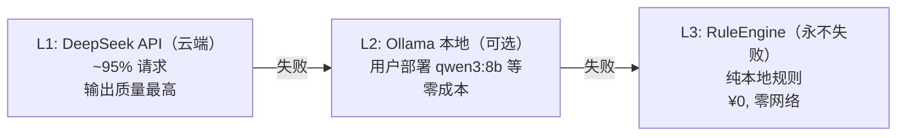
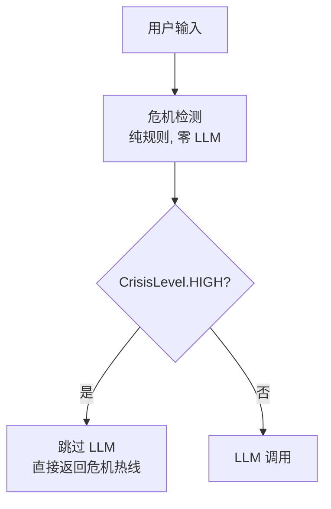
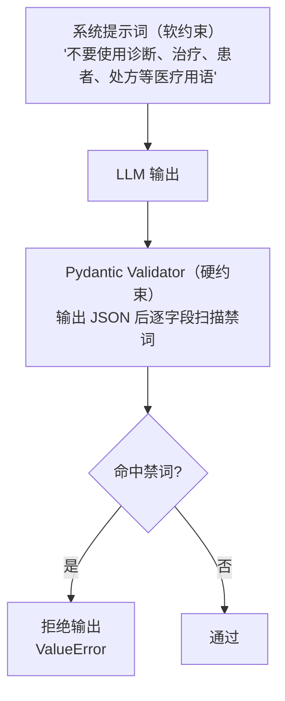
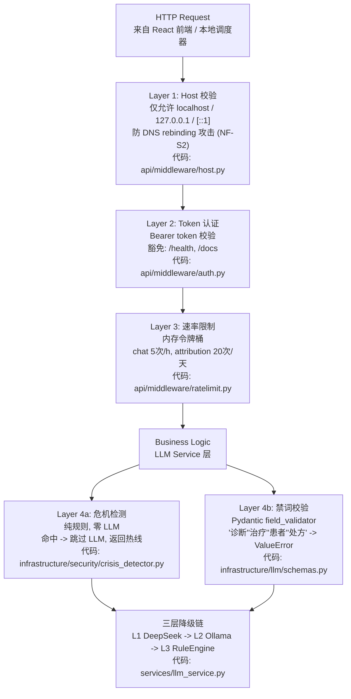
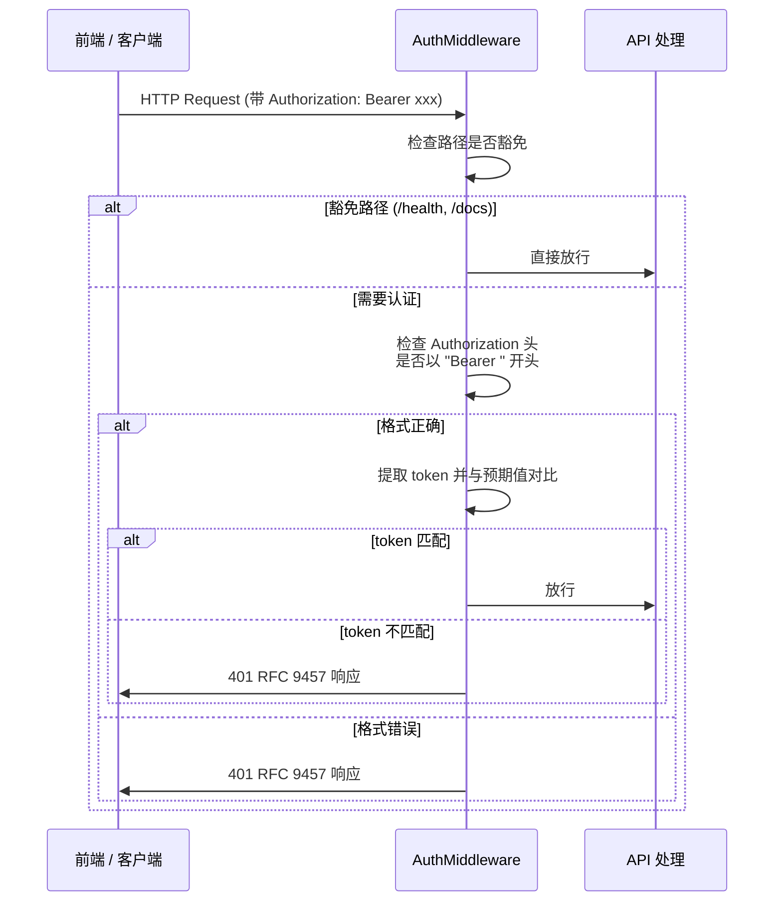
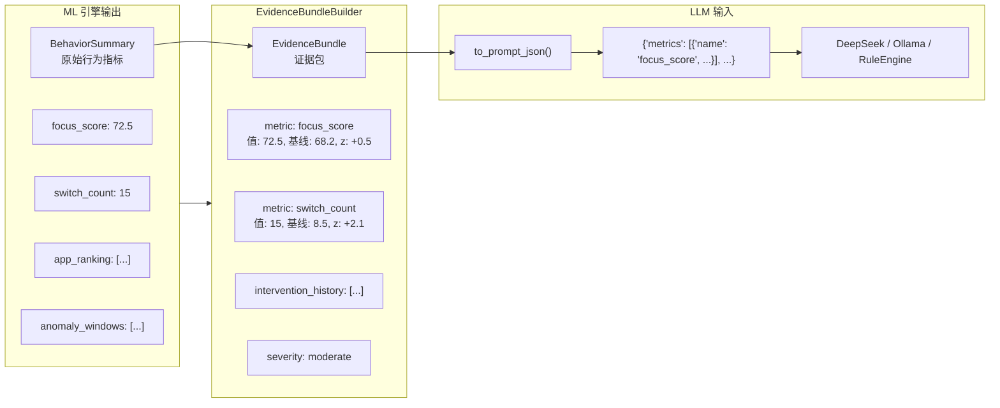
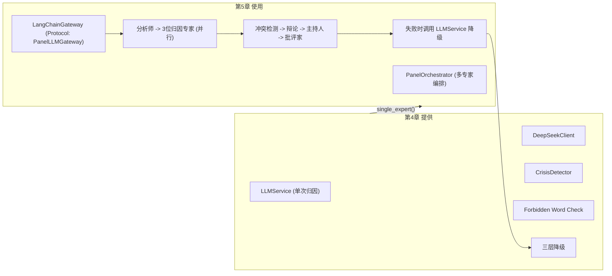
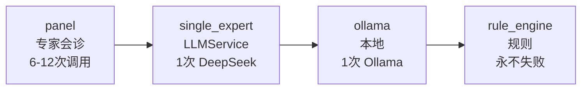

# 第4章 LLM 归因管线与安全防线

> 本章对应 MindFlow 架构 G003（专家会诊）、G004（对话助手）及 NF-S7 安全合规要求。阅读前建议先理解第3章的 ML 引擎输出（BehaviorSummary 和 EvidenceBundle），因为它们是 LLM 的输入数据。

---

## 4.1 设计思路：为什么需要这么多层？

MindFlow 的 LLM 调用承载了核心认知行为功能——它分析用户的行为数据，输出拖延类型的归因和 CBT 干预建议。如果这里出问题，后果可能是：

- **LLM API 挂了**：用户的分析页面白屏，整个功能不可用
- **LLM 输出禁词**：模型在不该用的地方用了"诊断""治疗"等医疗用语，产生法律风险
- **用户输入了危机信号**：用户自我报告里写了"不想活了"，AI 却按正常流程回了个"建议调低目标"
- **API 被滥用**：就算本地应用，也可能被本地别的进程攻击或误调用

所以我们需要一套**分层防护**体系，每一层管一件事，互不依赖。

### 4.1.1 三层降级链（Degradation Chain）

#### 图 4-1: 三层降级链



为什么是三层的设计？

- **L1** 覆盖大多数请求，使用云端 DeepSeek Chat 模型，输出质量最高
- **L2** 是"离线备胎"——用户如果部署了 Ollama（比如 qwen3:8b），API 挂了也不用降级到规则引擎
- **L3** 是**永不失败的底线**——RuleEngine 纯本地计算，零网络依赖，零 API Key 要求

关键决策：**降级对用户透明**。降级到 L2 或 L3 时，HTTP 状态码仍然是 200，只是在返回的 meta 里标记 `degraded=true`。用户不需要知道模型换了——如果 L1 都挂了，已经说明用户网络或 API Key 有问题，再报个 500 没有帮助。

### 4.1.2 危机检测前置（Pre-LLM Crisis Gate）

危机检测在**任何 LLM 调用之前**执行：

#### 图 4-2: 危机检测前置流程



这是 California SB 243 / Illinois HB 1806 等法规要求的"独立于 LLM 的危机检测机制"（NF-S7b）。核心约束：**零 LLM、零网络**，纯本地规则。

### 4.1.3 禁词双保险（NF-S7 Double Check）

即使系统提示词（System Prompt）里写了"不要使用医疗用语"，LLM 仍然有可能输出。所以我们在**代码层面**再加一道拦截：

#### 图 4-3: 禁词双保险



两道保险各自的理由：

| 层 | 为什么不够？ | 第二道怎么补？ |
|------|-------------|---------------|
| 系统提示 | LLM 可能忽略 or 被 prompt injection 覆盖 | Pydantic 校验是代码层，不可绕过 |
| Pydantic 校验 | 不提示模型会有反效果 | 系统提示是第一道，降低禁词出现概率 |

### 4.1.4 网络层安全四件套

即使是纯本地应用，仍然需要防护：

| 层 | 防什么 | 为什么本地也需要？ |
|------|--------|------------------|
| Host 校验 | DNS rebinding | 如果本地有另一个进程做 DNS 欺骗，可能让浏览器访问到你的内部 API |
| Token 认证 | 未经授权的调用 | 前端以 SPA 方式运行，token 隔离前后端 |
| 速率限制 | 滥用/误用 | 前端 bug 可能循环调用 API，把 DeepSeek 额度刷光 |
| 禁词校验 | 输出合规 | 同上，是 NF-S7 的一部分 |

---

## 4.2 安全防线架构图

#### 图 4-4: 安全防线四层堆叠



---

## 4.3 代码详解

### 4.3.1 DeepSeek 客户端与 LangChain 网关

MindFlow 经历了从**原始 httpx 客户端**到**LangChain 网关**的迁移。两套代码目前共存，服务于不同的调用方：

- `DeepSeekClient`（原始版）：面向归因管线（LLMService），硬编码输出格式 `LLMAttributionResult`
- `LangChainGateway`（新版）：面向专家会诊面板（PanelOrchestrator），输出原始文本，由调用方自行解析

**原始版：DeepSeekClient**

```python
# mindflow-app/backend-next/src/mindflow/infrastructure/llm/client.py (lines 72-196)

class DeepSeekClient:
    """Async HTTP client for DeepSeek Chat API (OpenAI-compatible)."""

    def __init__(self, settings: LLMSettings) -> None:
        if not settings.api_key:
            raise LLMNotConfiguredError(
                "DeepSeek API key is not configured — set MINDFLOW_LLM__API_KEY "
                "or add llm.api_key to the .env file"
            )

        self._base_url = (settings.base_url or "https://api.deepseek.com").rstrip("/")
        self._model = settings.model or "deepseek-chat"
        self._client = httpx.AsyncClient(
            base_url=self._base_url,
            timeout=httpx.Timeout(_DEFAULT_TIMEOUT_S),
            headers={
                "Authorization": f"Bearer {settings.api_key}",
                "Content-Type": "application/json",
            },
        )

    async def analyze(self, summary_json: str) -> LLMAttributionResult:
        payload = {
            "model": self._model,
            "messages": [
                {"role": "system", "content": _SYSTEM_PROMPT},
                {
                    "role": "user",
                    "content": f"请分析以下行为数据，输出结构化归因结果：\n\n{summary_json}",
                },
            ],
            "response_format": {"type": "json_object"},
        }

        last_exc: Exception | None = None
        for attempt in range(_MAX_RETRIES + 1):
            try:
                response = await self._client.post("/chat/completions", json=payload)
            except httpx.TimeoutException:
                logger.warning("DeepSeek API timeout (attempt {})", attempt + 1)
                last_exc = httpx.TimeoutException("DeepSeek API timed out after 30s")
                continue
            ...
            # 返回时直接通过 Pydantic 校验
            return LLMAttributionResult.model_validate_json(content)
```

这段代码做了几件事：

1. **构造函数检查 API Key**：没有 Key 直接抛异常，不等到调用时再报（fail-fast）
2. **httpx.AsyncClient 连接池**：复用 TCP 连接，减少握手开销
3. **重试逻辑**：只重试网络错误和 5xx——4xx 不重试（比如 401 认证失败，重试也是白费）
4. **response_format=json_object**：告诉 DeepSeek API 输出必须是合法 JSON，减少解析失败概率
5. **Pydantic 严格校验**：返回前调用 `model_validate_json`，校验不通过直接报异常（不降级输出脏数据）

**新版：LangChainGateway**

```python
# mindflow-app/backend-next/src/mindflow/agents/llm_gateway.py (lines 88-229)

class LangChainGateway:
    """Async LLM gateway wrapping LangChain's ``ChatDeepSeek``."""

    def __init__(self, api_key: str | None = None, base_url: str | None = None) -> None:
        # Key-less construction is allowed: the degradation chain must stay
        # reachable even without a configured key.
        self._api_key = api_key or ""
        self._base_url = (base_url or "https://api.deepseek.com").rstrip("/")

    async def complete(
        self,
        system: str,
        user: str,
        model: Literal["chat", "reasoner"] = "chat",
    ) -> str:
        """返回原始文本，由调用方自行解析。"""
        model_id = "deepseek-chat" if model == "chat" else "deepseek-reasoner"

        if not self._api_key:
            raise GatewayNotConfiguredError(
                "DeepSeek API key is not configured..."
            )

        chat = self._get_model(model_id)
        messages = [SystemMessage(content=system), HumanMessage(content=user)]

        for attempt in range(_MAX_RETRIES + 1):
            try:
                result = await chat.ainvoke(messages)
            except Exception as exc:
                logger.warning("LangChain gateway error (attempt {}): {}", attempt + 1, exc)
                last_exc = exc
                continue
            ...
            return content  # 返回原始字符串
```

两个设计差异值得注意：

- **延迟报错**（E2E 教训）：`LangChainGateway` 允许无 Key 构造，调用时才报错。为什么？因为应用启动时需要能正常组装 PanelService，即使 LLM 不可用，降级路径（panel -> single_expert -> rule_engine）也必须可达。如果构造时就报错，整个 Service 都创建不了。
- **协议而非继承**：`PanelLLMGateway` 是一个 `typing.Protocol`，orchestrator 依赖接口而非实现，测试时可以轻松注入 mock。

### 4.3.2 三层降级链

```python
# mindflow-app/backend-next/src/mindflow/services/llm_service.py (lines 206-246)

async def _run_degradation_chain(
    self,
    summary: BehaviorSummary,
    summary_json: str,
) -> tuple[dict[str, Any], SourceType, bool]:
    """Execute L1 -> L2 -> L3, returning (assessment, source, degraded)."""

    # L1: DeepSeek API
    if self._deepseek_client is not None:
        try:
            result = await self._deepseek_client.analyze(summary_json)
            logger.info("L1 (DeepSeek) succeeded")
            return self._llm_result_to_assessment(result), "deepseek", False
        except LLMNotConfiguredError:
            logger.warning(_LLM_NOT_CONFIGURED_HINT)
        except (LLMAPIError, TimeoutError) as exc:
            logger.warning("L1 (DeepSeek) failed: {}. Falling back to L2.", exc)
        except Exception as exc:
            logger.warning("L1 (DeepSeek) unexpected error: {}. Falling back.", exc)
    else:
        logger.debug("DeepSeek client not configured, skipping L1")

    # L2: Ollama local
    if self._ollama_base_url:
        try:
            ollama_result = await self._ollama_call(summary_json)
            if ollama_result is not None:
                logger.info("L2 (Ollama) succeeded")
                return self._llm_result_to_assessment(ollama_result), "ollama", True
        except Exception as exc:
            logger.warning("L2 (Ollama) failed: {}. Falling back to L3.", exc)
    else:
        logger.debug("Ollama not configured, skipping L2")

    # L3: RuleEngine (never fails)
    logger.info("Falling back to L3 (RuleEngine) for attribution")
    assessment = self._rule_engine_to_assessment(self._rule_engine.assess(summary))
    return assessment, "rule_engine", True
```

这段代码体现了降级链的核心设计原则：

- **独立每个层级**：L1 失败了不影响 L2，L2 失败了不影响 L3
- **L3 永不失败**：RuleEngine 纯本地规则，零网络、零配置——即使没有 API Key 也能跑
- **来源追踪**：返回的 `source` 字段告诉调用方"这个结果来自哪一层"，API 响应里会附带 `meta.degraded=true`
- **日志分级**：L1 失败打 WARNING（影响用户体验），L3 降级打 INFO（预期行为，不是异常）

**L3 RuleEngine 的工作原理**（`domain/procrastination.py:109-203`）：

RuleEngine 不需要 LLM，纯靠规则判断拖延类型：

| 拖延类型 | 规则 | 参数来源 |
|---------|------|---------|
| impulsivity | 最长专注块 < 5分钟 + 切换 > 12次/小时 | 03-requirements.md sec 3.4 |
| decisional | 启动延迟 > 30分钟 + 启动后恢复专注 | 同上 |
| perfectionism | 关键词含 self_criticism 或 redo_pattern | 同上 |
| emotional_regulation | 社交媒体占比 > 55% | 同上 |
| task_aversion | 兜底：专注度低但不符合上面任何类型 | 同上 |

### 4.3.3 危机检测器

```python
# mindflow-app/backend-next/src/mindflow/infrastructure/security/crisis_detector.py (lines 30-128)

_CRISIS_KEYWORDS: frozenset[str] = frozenset({
    "自杀",
    "不想活",
    "结束生命",
    "结束自己的生命",
    "伤害自己",
    "自伤",
    "撑不下去",
    "活不下去",
    "不想活了",
    "没有意义",
    "死了算了",
    "想死",
})


class CrisisDetector:
    """Rule-based crisis keyword scanner.
    
    Thread-safe (immutable state after construction).
    """

    def __init__(self, extra_keywords: frozenset[str] | None = None) -> None:
        all_kw = _CRISIS_KEYWORDS
        if extra_keywords:
            all_kw = all_kw | extra_keywords
        self._keywords: frozenset[str] = all_kw

    def scan(self, text: str) -> tuple[CrisisLevel, CrisisResponse | None]:
        if not text or not text.strip():
            return CrisisLevel.NONE, None

        for keyword in self._keywords:
            if keyword in text:          # 子串匹配，O(n) 但 n 很小
                return CrisisLevel.HIGH, CrisisResponse()

        return CrisisLevel.NONE, None
```

用人话说就是：危机检测器就是一个关键词扫描器。检查用户输入的文本是否包含"自杀""不想活"之类的词语，12 个关键词，子串匹配，对性能几乎没有影响。如果命中，就不调用 LLM，直接返回心理援助热线信息。

关键设计决策：

- **纯规则、零 LLM、零网络**：这是法规 NF-S7b 的硬性要求——危机检测必须独立于 LLM，即使 LLM 挂了也不影响检测功能
- **frozenset + 子串匹配**：比正则更便宜，12 个关键词扫一遍对输入文本几乎没有性能影响
- **可扩展**：`extra_keywords` 参数和 `add_keywords()` 方法，允许在应用启动时配置额外关键词
- **CrisisResponse 固定模板**：包含全国心理援助热线号码，确保危机信号触发时用户能得到正确的求助信息

当检测到 HIGH 级别时，`LLMService` 会跳过整个 LLM 调用（`llm_service.py:162-174`）：

```python
if crisis_level == CrisisLevel.HIGH:
    logger.warning("Crisis keywords detected for user {}. Skipping LLM.", user_id)
    return AttributionOutcome(
        assessment={
            "response_text": crisis_response.message if crisis_response else "",
            "next_action": "寻求专业帮助",
        },
        source="rule_engine",
        crisis_detected=True,
    )
```

注意这里 `source="rule_engine"`——危机检测返回的数据也被标记为规则引擎来源，和 L3 降级共享同一个标记。

### 4.3.4 禁词校验 Pydantic Validator

```python
# mindflow-app/backend-next/src/mindflow/infrastructure/llm/schemas.py (lines 42-109)

_FORBIDDEN_WORDS: frozenset[str] = frozenset({
    "诊断",
    "治疗",
    "患者",
    "处方",
})


class LLMAttributionResult(BaseModel):
    """Structured output from the LLM attribution pipeline."""

    procrastination_types: list[PROCRASTINATION_TYPES] = Field(..., min_length=1, max_length=3)
    type_confidence: dict[str, float] = Field(...)
    cognitive_distortions: list[str] = Field(default_factory=list)
    cbt_technique: CBT_TECHNIQUES = Field(...)
    response_text: str = Field(..., max_length=500)
    next_action: str = Field(...)

    @field_validator("response_text", "next_action")
    @classmethod
    def _no_forbidden_words(cls, v: str) -> str:
        """Reject any free-text output containing forbidden medical terminology."""
        for word in _FORBIDDEN_WORDS:
            if word in v:
                msg = f"output contains forbidden word: {word!r} (NF-S7)"
                raise ValueError(msg)
        return v

    @field_validator("cognitive_distortions")
    @classmethod
    def _no_forbidden_words_in_list(cls, v: list[str]) -> list[str]:
        """Apply the NF-S7 forbidden-word check to each list item."""
        for item in v:
            for word in _FORBIDDEN_WORDS:
                if word in item:
                    msg = f"cognitive_distortions contains forbidden word: {word!r} (NF-S7)"
                    raise ValueError(msg)
        return v
```

禁词校验的双层设计：

1. `_no_forbidden_words` 校验器覆盖 `response_text` 和 `next_action` 两个自由文本字段——这是 LLM 最可能输出禁词的地方
2. `_no_forbidden_words_in_list` 额外覆盖 `cognitive_distortions` 列表中的每个元素——因为模型可能在认知扭曲名称里混入禁词（比如"认为自己需要被治疗"）

另外还有两个交叉校验器：

```python
@field_validator("type_confidence")
@classmethod
def _confidence_keys_match_types(cls, v: dict[str, float], info: Any) -> dict[str, float]:
    """Ensure type_confidence keys exactly match procrastination_types."""
    types = info.data.get("procrastination_types", [])
    missing = [t for t in types if t not in v]
    if missing:
        raise ValueError(f"type_confidence missing keys for types: {missing}")
    extra = [k for k in v if k not in types]
    if extra:
        raise ValueError(f"type_confidence has keys for unlisted types: {extra}")
    return v

@field_validator("type_confidence")
@classmethod
def _confidence_in_range(cls, v: dict[str, float]) -> dict[str, float]:
    for key, val in v.items():
        if not 0.0 <= val <= 1.0:
            raise ValueError(f"confidence for {key!r} must be in [0, 1], got {val}")
    return v
```

- `_confidence_keys_match_types`：确保 LLM 输出的置信度字段和拖延类型字段完全一致——类型和置信度对不上，说明 LLM 输出不一致，拒绝
- `_confidence_in_range`：置信度必须在 0-1 之间，越界数据直接拒绝

这些校验和**专家会诊面板**共享同一套禁词集（`agents/types.py:32-37`），确保两种 LLM 调用路径（归因管线 vs 专家面板）的禁词校验完全一致。

### 4.3.5 Token 认证中间件

```python
# mindflow-app/backend-next/src/mindflow/api/middleware/auth.py (lines 22-83)

_EXEMPT_PATHS: frozenset[str] = frozenset({
    "/api/v1/health",
    "/docs",
    "/openapi.json",
    "/redoc",
})


class AuthMiddleware(BaseHTTPMiddleware):
    """Middleware that validates Bearer tokens on protected endpoints."""

    async def dispatch(
        self,
        request: Request,
        call_next: Callable[[Request], Awaitable[Response]],
    ) -> Response:
        path = request.scope["path"]

        _EXEMPT_PREFIXES: tuple[str, ...] = (
            "/api/v1/health",
            "/docs",
            "/openapi.json",
            "/redoc",
        )
        if any(path.startswith(prefix) for prefix in _EXEMPT_PREFIXES):
            return await call_next(request)

        expected_token: str = getattr(request.app.state, "system_token", "")
        auth_header = request.headers.get("Authorization", "")
        if not auth_header.startswith("Bearer "):
            return _auth_required_response(path)

        token = auth_header.removeprefix("Bearer ").strip()
        if not verify_token(token, expected_token):
            return _auth_required_response(path)

        return await call_next(request)
```

设计要点：

- **豁免路径**：健康检查（`/health`）和 API 文档（`/docs`）不需要 token——健康检查用于监控和 Docker 健康检查，文档不需要认证才能提高可用性
- **Bearer 标准**：遵循 HTTP Authorization 标准的 Bearer 方案，前端可以用标准方式发送
- **Token 文件**：token 存储在 `{data_dir}/token` 文件中，首次启动时自动生成
- **401 RFC 9457 格式**：错误响应遵循 Problem Details 标准，方便前端统一解析

#### 图 4-5: Token 认证流程



### 4.3.6 Host 校验：防 DNS Rebinding

```python
# mindflow-app/backend-next/src/mindflow/api/middleware/host.py (lines 12-94)

def _parse_host(host_header: str) -> tuple[str, int | None]:
    """Parse a Host header into (hostname, port).
    
    Handles IPv6 [::1]:port syntax.
    """
    host_header = host_header.strip()
    if host_header.startswith("["):
        bracket_end = host_header.find("]")
        if bracket_end == -1:
            return host_header, None
        hostname = host_header[1:bracket_end]
        rest = host_header[bracket_end + 1:]
        if not rest:
            return hostname, None
        if rest.startswith(":"):
            try:
                return hostname, int(rest[1:])
            except ValueError:
                return host_header, None
        # [::1].evil.com — 攻击者可能在 IPv6 字面量后拼接恶意域名
        return host_header, None
    ...


_TRUSTED_HOST_LOWERCASE: set[str] = {"localhost", "127.0.0.1", "::1", "[::1]"}


class HostValidationMiddleware(BaseHTTPMiddleware):
    async def dispatch(self, request: Request, call_next):
        host_header = request.headers.get("host", "")
        if host_header:
            hostname, _port = _parse_host(host_header)
            if hostname.lower() not in _TRUSTED_HOST_LOWERCASE:
                return _forbidden_host_response(str(request.scope["path"]))
        return await call_next(request)
```

代码中 30-47 行的处理逻辑值得注意：注释 `[::1].evil.com` 描述了一个真实的攻击场景。攻击者在 IPv6 字面量 `[::1]` 后面拼接恶意域名，如果不处理这个 case，`[::1]` 部分被正确解析，`.evil.com` 被忽略，那 `evil.com` 的页面就能绕过 host 校验访问到本机 API。代码的处理方式是：发现 `]` 后面还有字符且不是 `:端口` 格式，就把整个 header 当作 hostname 返回，必然不在信任列表里，通过不了校验。

补充攻击示例：

| Host 头 | 结果 |
|---------|------|
| `localhost` | 通过 |
| `127.0.0.1:8765` | 通过 |
| `[::1]:8765` | 通过 |
| `[::1]` | 通过 |
| `[::1].evil.com` | **拒绝**（trailing garbage） |
| `evil.com` | **拒绝** |
| `[::1]:evil` | **拒绝**（非数字端口） |

### 4.3.7 速率限制：令牌桶

```python
# mindflow-app/backend-next/src/mindflow/api/middleware/ratelimit.py (lines 38-206)

class TokenBucket:
    """In-memory token bucket with configurable capacity, refill, and daily cap."""

    def __init__(self, capacity: float, refill_rate: float, daily_hard_limit: int | None = None):
        self._capacity = capacity
        self._refill_rate = refill_rate
        self._daily_hard_limit = daily_hard_limit
        self._tokens = capacity
        self._last_refill = time.time()
        self._day_usage = 0
        self._last_day_check = time.time()
        self._lock = asyncio.Lock()  # 并发安全

    async def consume(self, tokens: float = 1.0) -> tuple[bool, float, float]:
        async with self._lock:
            self._refill()
            if self._daily_hard_limit is not None and self._day_usage >= self._daily_hard_limit:
                return False, 0.0, self._last_refill + 86400
            if self._tokens >= tokens:
                self._tokens -= tokens
                if self._daily_hard_limit is not None:
                    self._day_usage += 1
                return True, self._tokens, self._last_refill + ...
            next_token_time = (tokens - self._tokens) / max(self._refill_rate, 0.001)
            return False, 0.0, self._last_refill + next_token_time


# 默认端点限流配置
_DEFAULT_ENDPOINT_LIMITS: dict[str, TokenBucket] = {
    "/api/v1/chat":           TokenBucket(capacity=5,  refill_rate=1.0/60.0,   daily_hard_limit=60),
    "/api/v1/analytics/attribution": TokenBucket(capacity=5,  refill_rate=1.0/30.0,   daily_hard_limit=20),
    "/api/v1/analytics/train":       TokenBucket(capacity=3,  refill_rate=1.0/60.0,   daily_hard_limit=3),
    "/api/v1/panel/today":    TokenBucket(capacity=1,  refill_rate=1.0/3600.0, daily_hard_limit=3),
    "/api/v1/panel":          TokenBucket(capacity=10, refill_rate=1.0/60.0,   daily_hard_limit=30),
}
```

用人话说就是：这就是一个限流器。每个请求消耗一个 token，token 会按一定速率自动补充。如果 token 用完了，返回 429 让客户端等一会再试。外加一个每日硬上限，防止某天用量爆表（比如把 DeepSeek 的 API 额度刷光）。为什么用内存里的令牌桶而不是 Redis？因为这是单用户的本地应用，Redis 的部署成本远大于收益。

为什么用内存令牌桶而不是 Redis？

> 这是本地桌面应用（sec 4.4），单进程、单用户。Redis 的部署成本 > 收益。`asyncio.Lock()` 保证并发安全，每天重置一次计数器。

端点限流策略：

| 端点 | 速率 | 每天硬上限 | 设计理由 |
|------|------|-----------|---------|
| `/chat` | 5次 + 1次/分钟 | 60次 | 对话交互不能太快 |
| `/attribution` | 5次 + 1次/30秒 | 20次 | 昂贵操作，LLM 调用的主要入口 |
| `/train` | 3次 + 1次/分钟 | 3次 | 训练操作极其昂贵，每天3次足够了 |
| `/panel/today` | 1次 + 1次/小时 | 3次 | 每日面板数据，不需要频繁刷新 |
| `/panel` | 10次 + 1次/分钟 | 30次 | 一般查询，稍微宽松 |

当超过限制时，中间件返回 429 RFC 9457 响应和 `Retry-After` 头。

### 4.3.8 RFC 9457 统一错误处理

```python
# mindflow-app/backend-next/src/mindflow/api/errors.py (lines 15-249)

class ProblemDetail(Exception):
    """An RFC 9457 Problem Details exception that renders as ``problem+json``."""

    def __init__(self, type_slug: str, title: str, status: int, detail: str,
                 instance: str | None = None, extra: dict[str, Any] | None = None) -> None:
        self.type_slug = type_slug
        self.title = title
        self.status = status
        self.detail = detail
        self.instance = instance
        self.extra = extra or {}
        super().__init__(self.detail)

    def to_dict(self, instance: str | None = None) -> dict[str, Any]:
        body: dict[str, Any] = {
            "type": f"{_PROBLEM_BASE_URI}/{self.type_slug}",
            "title": self.title,
            "status": self.status,
            "detail": self.detail,
        }
        resolved_instance = self.instance or instance
        if resolved_instance:
            body["instance"] = resolved_instance
        body.update(self.extra)
        return body


def register_exception_handlers(app: FastAPI) -> None:
    """Register all RFC 9457 exception handlers on the FastAPI app."""
    app.add_exception_handler(ProblemDetail, cast(handler_t, _problem_handler))
    app.add_exception_handler(RequestValidationError, cast(handler_t, _validation_handler))
    app.add_exception_handler(RuntimeError, cast(handler_t, _generic_handler))
    app.add_exception_handler(Exception, cast(handler_t, _generic_handler))
```

错误码清单（8种）：

| type_slug | HTTP | 描述 |
|-----------|------|------|
| `collector-not-running` | 503 | 采集器未启动 |
| `not-found` | 404 | 资源不存在 |
| `validation-error` | 422 | 请求参数验证失败 |
| `rate-limited` | 429 | 速率限制 |
| `auth-required` | 401 | 认证失败 |
| `forbidden-host` | 403 | Host 头不被信任 |
| `internal-error` | 500 | 未捕获异常（不暴露栈信息） |
| `llm-unavailable` | 503 | LLM 服务降级为规则引擎 |

统一响应格式：

```json
{
  "type": "https://mindflow.app/errors/rate-limited",
  "title": "Rate Limited",
  "status": 429,
  "detail": "请求过于频繁，请稍后再试",
  "instance": "/api/v1/analytics/attribution",
  "retry_after_seconds": 45
}
```

设计决策：

- `type` 用英文标识（机器可读），`detail` 用中文（用户可读）
- `type` URI 不是可解析的 URL（sec 4.2），只是唯一标识符
- 500 错误不泄漏栈信息（NF-S4：输出消毒）
- `generic_handler` 同时注册 `RuntimeError` 和 `Exception`——Starlette 的实现使用确切类型查找（`isinstance` 不生效），双重注册保证兜底

---

## 4.4 与第3章和第5章的衔接

### 从第3章来：ML 输出 -> LLM 输入

第3章的 ML 引擎（DeviationDetector + BaselineModel）输出的**不是** LLM 可以消化的格式。两者之间的桥梁是 `EvidenceBundleBuilder`：

#### 图 4-6: ML 引擎到 LLM 输入的数据转换



`EvidenceBundle`（`domain/evidence.py`）是这个转换的关键：

- 不包含窗口标题或文件路径（隐私：NF-S3a）
- 每个指标附带基线值和 z-score（让 LLM 理解"偏离程度"）
- 序列化后约 800-1200 token
- `metric_names()` 返回合法的指标名 frozenset，供 critic 做引用校验

### 通向第5章：LLM 被多专家编排调用

第5章的专家会诊面板（PanelOrchestrator）并非直接调用 DeepSeek API，而是通过这里的 `LangChainGateway`：

#### 图 4-7: 第4章与第5章的协作关系



四层降级链（`agents/types.py:41`，`PanelSource`）：



当面板编排（第5章）全部失效时，会调用 `LLMService.single_expert()`（第4章），后者有自己的 L2/L3 降级。这保证了**即使 LangChain gateway 挂掉，用户也能获得规则引擎的兜底分析**。

---

## 4.5 总结

| 组件 | 文件 | 功能 | 依赖 |
|------|------|------|------|
| DeepSeek Client | `infrastructure/llm/client.py` | L1 主 LLM 调用 | 网络 + API Key |
| LangChain Gateway | `agents/llm_gateway.py` | L1 新版，供面板使用 | 网络 + API Key |
| 三层降级链 | `services/llm_service.py` | L1->L2->L3 自动降级 | 按层级递减 |
| RuleEngine | `domain/procrastination.py` | L3 规则引擎，永不失败 | 无 |
| CrisisDetector | `infrastructure/security/crisis_detector.py` | 危机检测前置 | 无 |
| 禁词校验 | `infrastructure/llm/schemas.py` | Pydantic NF-S7 双层校验 | Pydantic |
| Token 认证 | `api/middleware/auth.py` | Bearer token 鉴权 | 本地 token 文件 |
| Host 校验 | `api/middleware/host.py` | 防 DNS rebinding | 无 |
| 速率限制 | `api/middleware/ratelimit.py` | 内存令牌桶限流 | asyncio.Lock |
| 错误处理 | `api/errors.py` | RFC 9457 Problem Detail | FastAPI |
| 中间件组装 | `app.py:416-430` | 日志->Host->Auth->RateLimit->CORS | 无 |

**关键数字**：

- 安全防线叠了 **5 层**（Host -> Auth -> RateLimit -> Crisis -> 禁词校验）
- 降级链 **3 层**（DeepSeek -> Ollama -> RuleEngine）
- 错误码 **8 种**（4xx + 5xx）
- 禁词 **4 个**（"诊断""治疗""患者""处方"），由两个 Pydantic validator 在不同字段上独立校验
- 对话限流 **5 次/分钟**，归因限流 **20 次/天**
