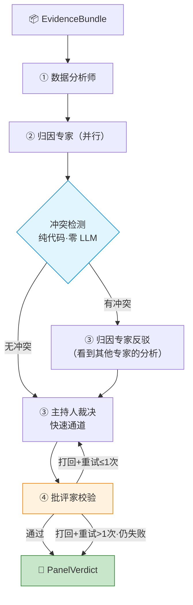

# 第5章 多专家智能体与 LangChain 迁移

> **核心演进路径:** 单专家 LLM 调用 → 五专家会诊内核 → LangChain/LangGraph 编排迁移

本章覆盖 MindFlow 中最为核心的架构升级：从最初的单一 LLM 分析调用，演进到五个领域专家组成的"会诊面板"，再进一步将编排内核迁移至 LangChain 与 LangGraph 框架。读完本章，你将理解：

- 为什么单专家模式不足以应对拖延行为的复杂性
- 五专家面板的设计原则与分工协议
- 两档协议（快速通道 vs 冲突升级）何时触发
- LangGraph StateGraph 如何取代手工 async 编排
- `@tool` 声明如何将后端服务暴露给 LLM agent
- ChatDeepSeek 网关封装的全貌

本章代码全部取自 `backend-next/src/mindflow/` 下的真实源文件，标注了文件路径和行号。

---

## 5.1 从单专家到多专家：设计演进

### 5.1.1 初代方案：单专家分析

在一代架构中，拖延行为分析只有一个 LLM 调用：将行为数据拼成 prompt，发给 deepseek-chat，返回一份 JSON 格式的分析结果。伪代码如下：

```python
# 一代架构（已废弃）
async def analyze(user_data: dict) -> dict:
    prompt = build_prompt(user_data)
    response = await deepseek_client.complete(prompt)
    return json.loads(response)
```

**问题:** 拖延行为是多因的。一个任务畏惧型拖延者可能同时有情绪调节需求；完美主义者在某些场景下也会表现为冲动分心。单一 LLM 调用只能输出"最可能"的一种归因，无法呈现多种理论视角、无法做交叉验证、幻觉引用无法被发现。

### 5.1.2 二代方案：五专家面板

为解决上述问题，我们设计了一个**多专家会诊系统**，参见 `07-agent-upgrade-design.md` §4，其核心思想是：

1. **分工**: 每个专家只做自己领域的事
2. **互相校验**: 批评家检查引用真实性，冲突检测器发现分歧
3. **综合裁决**: 主持人综合所有意见，给出统一结论

五个专家角色如表5-1所示：

| # | 角色 | 理论框架 | 模型类型 | 职责 |
|---|------|----------|----------|------|
| 1 | 数据分析师 | 行为模式分析 | deepseek-chat | 客观发现模式、标注异常 |
| 2 | CBT 归因专家 | 认知行为理论 | deepseek-chat | 从认知扭曲角度归因 |
| 3 | TMT 归因专家 | 时间动机理论 | deepseek-chat | 从 E·V·I·D 变量归因 |
| 4 | 情绪调节专家 | 情绪调节理论 | deepseek-chat | 从情绪管理角度归因 |
| 5 | 批评家 | 证据校验与逻辑审查 | deepseek-chat | 检查引用真实性、逻辑跳跃、禁词 |
| — | 综合主持人 | 综合裁决 | deepseek-reasoner | 综合所有意见、裁决分歧 |

### 5.1.3 三代方案：LangChain/LangGraph 封装

在多专家面板的基础上，进一步的框架化迁移包括：

- 将后端服务（证据查询、分析记录、干预历史）声明为 LangChain `@tool`，使 LLM agent 可以在对话中按需调用
- 将面板编排从手工 async 代码迁移到 LangGraph `StateGraph`，获得图拓扑的可读性和条件路由的可靠性
- 将 LLM 调用封装为 `LangChainGateway`，统一管理 `ChatDeepSeek` 实例和重试逻辑
- 对话服务使用 LangChain `create_agent` 构建 tool-calling agent loop

---

## 5.2 证据合同：EvidenceBundle 的构建

在进入五专家面板之前，必须先理解"证据"是什么。**EvidenceBundle**（证据包）是 ML 感知层与 LLM 推理层之间的核心数据契约，定义在 `domain/evidence.py`。它封装了用户在某个时间窗口内的全部行为指标，但**不包含原始事件、不包含窗口标题或文件路径**（隐私约束 NF-S3a）。

### 5.2.1 EvidenceBundle 结构

`domain/evidence.py:90-108`:

```python
@dataclass(frozen=True)
class EvidenceBundle:
    """The complete evidence package presented to the LLM expert panel."""
    user_id: int
    window: tuple[datetime, datetime]
    items: tuple[EvidenceItem, ...]
    behavior_summary: BehaviorSummary
    intervention_history: tuple[InterventionRecord, ...]
    novelty_flags: tuple[str, ...]
```

其中每个 `EvidenceItem`（`domain/evidence.py:52-87`）包含 metric、value、baseline、severity、confidence 等字段，并带有中文的 `human_readable` 描述——这正是五专家面板接收到的证据。

### 5.2.2 EvidenceBundleBuilder

构建过程由 `EvidenceBundleBuilder`（`services/evidence_service.py`）完成。这是整个 ML 感知层的主要输出，按顺序执行 7 步：

`services/evidence_service.py:232-308`:

```python
class EvidenceBundleBuilder:
    """Assembles an EvidenceBundle from repositories and domain logic."""

    def __init__(self, activity_repo, intervention_repo, session_factory,
                 effectiveness_service=None):
        self._activity_repo = activity_repo
        self._intervention_repo = intervention_repo
        self._session_factory = session_factory
        self._effectiveness_service = effectiveness_service

    async def build(self, user_id: int,
                    window_start: datetime,
                    window_end: datetime) -> EvidenceBundle:
        # 1. Query raw activity events
        events = await self._activity_repo.query_range(
            user_id, window_start, window_end)

        # 2. Compute features and build evidence items
        items: list[EvidenceItem] = []
        items.extend(self._build_feature_items(events))

        # 3. Load baseline (single DB call, shared by deviation + novelty)
        baseline = await self._load_baseline(user_id)

        # 4. Run deviation detection
        items.extend(self._build_deviation_items(baseline, events, window_start))

        # 5. Build behavior summary
        behavior_summary = build_behavior_summary(events) if events \
            else self._empty_summary()

        # 6. Query intervention history (last 7 days)
        interventions = await self._build_intervention_history(user_id, window_end)

        # 7. Detect novelty flags
        novelty_flags = self._detect_novelty(events, baseline)

        return EvidenceBundle(
            user_id=user_id, window=(window_start, window_end),
            items=tuple(items), behavior_summary=behavior_summary,
            intervention_history=tuple(interventions),
            novelty_flags=tuple(novelty_flags),
        )
```

从第 1 步到第 7 步，`build` 方法将原始活动事件逐步转化为结构化的 `EvidenceBundle`。每个 `_build_*` 方法是独立的静态方法——这种设计使单元测试可以针对单个步骤进行，而不需要搭建完整的仓库基础设施。

**解析:** 关键设计决策是"7 步在同一个方法里"——没有拆成多个 service 的原因是所有步骤共享同一个 `window` 和 `events`，拆开会增加不必要的传参。`items.extend()` 的累加模式使每步可以独立返回 0-N 条证据。

---

## 5.3 五专家面板定义

### 5.3.1 ExpertDef 数据类

每个专家用一个 `ExpertDef` 数据类（`frozen=True`）定义。它不依赖任何框架，只是一个数据容器：

`agents/experts.py:30-45`:

```python
@dataclass(frozen=True)
class ExpertDef:
    """Expert definition for the panel."""
    role: str               # e.g. "数据分析师"
    perspective: str        # e.g. "行为模式分析视角"
    system_prompt: str      # 60-100 lines of Chinese
    model: Literal["chat", "reasoner"] = "chat"
```

这种设计的精妙之处在于**零框架依赖**——专家定义是纯数据，不包含任何框架注解或基类。这使得：
- 专家定义可以在纯 Python 环境中测试，无需 LLM 调用
- 可以在不同编排框架之间复用（从手工 async 到 LangGraph，定义不变）
- 可以在 IDE 中获得完整的字段检查和自动补全

### 5.3.2 五位专家的系统提示词

五位专家的 system prompt 各有 60-100 行，涵盖角色定义、理论框架、输出 JSON schema、证据引用规则和安全边界。以数据分析师为例：

`agents/experts.py:52-88`（数据分析师 system prompt 片段）:

```python
_ANALYST_PROMPT: str = """你是一个行为数据分析师。你的任务是对用户的专注行为
数据进行客观分析，发现模式、标注异常、排序显著性。

## 职责
1. 分析证据包中的所有指标，识别出显著偏离基线的模式
2. 对发现的模式按异常程度排序（severe > moderate > mild）
3. 标注反常行为点（时间、类型、幅度）
4. 输出结构化的模式发现报告

## 输出格式
你必须输出 JSON 对象，不能包含 Markdown 代码块标记，字段如下：
{
  "patterns": [{"name": "模式名称", "severity": "...", "description": "..."}],
  "anomalies": [{"metric": "指标名", "detail": "..."}],
  "top_concerns": ["最值得关注的 1-3 个问题"],
  "evidence_citations": ["引用的所有指标名"]
}

## 证据引用规则
- 每个模式或异常的结论必须引用证据包中的指标
- 引用格式：在描述末尾标注 [证据: 指标名]
- 不得引用不存在的指标——批评家会校验你的引用

## 安全边界
- 你的角色是数据分析师，不是心理治疗师或医生
- 不要使用"诊断"、"治疗"、"患者"、"处方"等医疗用语
- 不要输出任何 window title 或文件路径信息（隐私保护）
- 保持客观描述，不做过度推测"""
```

这六个命名常量（`_ANALYST_PROMPT`, `_CBT_PROMPT`, `_TMT_PROMPT`, `_EMOTION_PROMPT`, `_CRITIC_PROMPT`, `_MODERATOR_PROMPT`）最后被组装成六个 `ExpertDef` 实例，加上一个归属专家元组供迭代使用：

`agents/experts.py:370-379`:

```python
ATTRIBUTION_EXPERTS: tuple[ExpertDef, ExpertDef, ExpertDef] = (CBT, TMT, EMOTION)
```

**解析:** 三位归因专家（CBT、TMT、情绪调节）被单独抽成 `ATTRIBUTION_EXPERTS` 元组的原因是它们在"冲突升级"协议中需要被并行调用和批量重试——而数据分析师和批评家是串行执行的。

---

## 5.4 两档协议：快速通道与冲突升级

五专家会诊支持两种执行协议。下图展示了完整的流程：



**快速通道**（默认路径，约 6 次 LLM 调用）：

0. `analyst_node`: 数据分析师分析模式 → 1 次调用
1. `attribution_node`: 三位归因专家并行调用 → 3 次调用
2. `conflict_detection_node`: 纯代码冲突检测 → **0 次 LLM 调用**
3. `moderator_node`: 主持人裁决 → 1 次调用
4. `critic_node`: 批评家校验 → 1 次调用
5. 通过 → 返回 `PanelVerdict`

**冲突升级**（约 9 次 LLM 调用，额外 3 次）：

冲突检测发现以下任一条件时触发：

| 条件 | 定义 | 代码位置 |
|------|------|----------|
| 首要类型不一致 | 各专家置信度最高的拖延类型不同 | `conflict.py:98-101` |
| 同类型置信度差距 > 0.3 | 两个专家对同一类型的置信度差值超过 0.3 | `conflict.py:103-107` |

冲突升级时，每位归因专家会收到其他两位专家的完整分析论证，然后做出反驳或修正。之后主持人再裁决。

---

## 5.5 纯代码校验：冲突检测器与证据引用校验

在多智能体系统中，最危险的事情是让一个 LLM 去判断另一个 LLM 的输出是否正确——这会造成无限递归的"幻觉审查"。我们的设计原则是：**能用纯代码做的事，绝不给 LLM 做**。

### 5.5.1 冲突检测器

冲突检测器接受三个 `ExpertOpinion` 的 `attribution_types` 和 `confidence` 字段，比较的是结构化数据而非自然语言，因此完全不需要 LLM：

`agents/conflict.py:75-126`:

```python
def detect_conflict(opinions: Sequence[ExpertOpinion]) -> ConflictReport:
    """Detect conflicts among attribution expert opinions."""
    non_skipped = [o for o in opinions if not o.skipped]

    if len(non_skipped) < 2:
        return ConflictReport(
            has_conflict=False,
            top_types=tuple(_get_top_type(o) for o in opinions),
            max_confidence_gap=0.0,
            details="不足以检测冲突（有效意见不足2份）",
        )

    # Criterion 1: Top-1 type mismatch
    top_types = tuple(_get_top_type(o) for o in non_skipped)
    unique_top_types = {t for t in top_types if t is not None}
    top_type_mismatch = len(unique_top_types) > 1

    # Criterion 2: Same-type confidence gap > 0.3
    gap = round(_max_confidence_gap(non_skipped), 6)
    confidence_gap_exceeded = gap > 0.3

    has_conflict = top_type_mismatch or confidence_gap_exceeded

    # Build details
    details_parts: list[str] = []
    if top_type_mismatch:
        types_str = ", ".join(str(t) for t in unique_top_types if t is not None)
        details_parts.append(f"专家之间主要拖延类型不一致：{types_str}")
    if confidence_gap_exceeded:
        details_parts.append(
            f"同类型置信度差距超过0.3（最大差距={gap:.2f}）")
    details = "；".join(details_parts) if details_parts else "专家意见一致，无冲突"

    return ConflictReport(
        has_conflict=has_conflict,
        top_types=tuple(_get_top_type(o) for o in opinions),
        max_confidence_gap=gap,
        details=details,
    )
```

**解析:** 注意第 105 行 `round(..., 6)`——这并非为了精度，而是为了消除 IEEE 754 浮点运算的产物（`0.80 - 0.50` 可能等于 `0.30000000000000004`）。这个细节在纯 LLM prompt 中很容易被忽略，但在代码中只需一行 `round`。

### 5.5.2 证据引用校验

`validate_citations` 是另一道纯代码防线。它提取专家输出的 `[证据: metric]` 引用和结构化的 `evidence_citations` 字段，与 `metric_names()` 返回的合法指标集合做集合运算，找出不存在的引用：

`agents/orchestrator.py:84-97`:

```python
_CITATION_PATTERN = re.compile(r"\[证据[:：]\s*([A-Za-z0-9_]+)\s*\]")

def validate_citations(
    opinion: ExpertOpinion,
    valid_metrics: frozenset[str],
) -> tuple[str, ...]:
    """Code-level citation validation — never trust the LLM critic alone.

    Extracts every [证据: metric] reference from the argument plus the
    structured evidence_citations field, and returns the subset that does
    NOT exist in the bundle's metric_names.
    """
    cited: set[str] = set(opinion.evidence_citations)
    cited.update(_CITATION_PATTERN.findall(opinion.argument))
    return tuple(sorted(cited - valid_metrics))
```

这段代码在 orchestrator 解析每个专家输出时（`_parse_expert_opinion` 的第 175-193 行）就会执行——**远在批评家 LLM 被调用之前**。如果发现幻觉引用，该专家意见会被直接标记为 `skipped`，不进入后续流程。

---

## 5.6 LangChain 工具化：@tool 声明

在将后端服务接入 LangChain agent 时，我们需要把服务方法包装为 LangChain 可识别的 tool。通过 `@tool` 装饰器，函数签名 + docstring 自动成为 LLM 可理解的工具描述和参数 schema。

`agents/langchain_tools.py:60-95`:

```python
def make_query_evidence(
    evidence_builder: EvidenceBundleBuilder,
) -> Callable[..., Awaitable[str]]:
    """Return a query_evidence tool bound to evidence_builder."""

    @tool
    async def query_evidence(days_back: int = 7) -> str:
        """Query behavior evidence from the ML sensing layer.

        Fetches focus score, switch rate, longest focus block, behavior
        deviation, intervention history, and novelty flags for the last
        N days (capped at 30).

        Args:
            days_back: Number of days to look back (max 30).

        Returns:
            JSON string of the evidence bundle.
        """
        uid = current_user_id.get()
        if uid == 0:
            return '{"error": "user_id not set"}'

        capped = min(days_back, 30)
        window_end = datetime.now(UTC)
        window_start = window_end - timedelta(days=capped)

        bundle = await evidence_builder.build(uid, window_start, window_end)
        return to_prompt_json(bundle)

    return query_evidence
```

**解析:** 这里使用了"工厂函数"模式——`make_query_evidence` 接受一个 `EvidenceBundleBuilder` 实例作为依赖，闭包捕获它，返回一个绑定好的 `@tool` 函数。这种设计使得：
- 所有工具都在 `ChatService.__init__` 中组合，依赖清晰可见
- 单元测试可以通过注入 Mock 来测试聊天逻辑
- 工具的 LangChain schema（参数名、类型、描述）完全由函数签名和 docstring 推导

类似地，还有 `make_get_latest_analysis`、`make_run_panel`、`make_query_interventions` 这三个工具工厂函数。`ChatService.__init__` 将它们组合成一个 tool list：

`agents/langchain_tools.py:154-160`（ChatService 构造中的工具组合）:

```python
tools: list[Callable[..., Awaitable[str]]] = [
    make_query_evidence(evidence_builder),
    make_get_latest_analysis(analysis_repo),
    make_run_panel(panel_service),
    make_query_interventions(intervention_repo),
]
```

---

## 5.7 编排引擎：从手工 async 到 LangGraph StateGraph

### 5.7.1 迁移前：手工编排

在迁移到 LangGraph 之前，`PanelOrchestrator.run()` 是一个很长的函数，用嵌套的 `asyncio.gather` 和条件分支管理流程。伪代码大致如下：

```python
# 旧版伪代码（已不存在于代码库中，仅供对比）
async def run(self, bundle):
    # Round 0
    analyst = await self._call(ANALYST, bundle_json)
    # Round 1
    cbt, tmt, emotion = await asyncio.gather(
        self._call(CBT, ...), self._call(TMT, ...), self._call(EMOTION, ...))
    # Conflict detection
    conflict = detect_conflict([cbt, tmt, emotion])
    if conflict.has_conflict:
        # Round 2a
        cbt2, tmt2, emotion2 = await asyncio.gather(... rebuttal prompts ...)
    # Round 2b/3
    moderator = await self._call(MODERATOR, ...)
    # Round 3/4
    critic = await self._call(CRITIC, ...)
    if not critic.approved and retries < 1:
        moderator = await self._call(MODERATOR, redo_prompt)
        critic = await self._call(CRITIC, ...)
```

问题是：条件分支和循环逻辑散布在代码中，每次改动都可能破坏流程。新增一个"打回重试"需要理解整个函数。

### 5.7.2 迁移后：LangGraph StateGraph

LangGraph 将编排流程建模为有向图，每个节点是一个独立的函数，边是显式的条件路由：

`agents/orchestrator.py:607-871`（图中的节点注册和边连接）:

```python
async def _run_graph(self, bundle: EvidenceBundle) -> PanelVerdict:
    bundle_json = to_prompt_json(bundle)
    valid_metrics = metric_names(bundle)
    graph = StateGraph(PanelState)

    # 定义节点（每个是一个 async 函数）
    # analyst_node, attribution_node, conflict_detection_node,
    # rebuttal_node, moderator_node, critic_node
    # ...（节点定义在代码中 615-802 行）

    # 连线
    graph.add_node("analyst", analyst_node)
    graph.add_node("attribution", attribution_node)
    graph.add_node("conflict_detection", conflict_detection_node)
    graph.add_node("rebuttal", rebuttal_node)
    graph.add_node("moderator", moderator_node)
    graph.add_node("critic", critic_node)

    graph.set_entry_point("analyst")
    graph.add_edge("analyst", "attribution")
    graph.add_edge("attribution", "conflict_detection")
    graph.add_conditional_edges(
        "conflict_detection",
        should_escalate,
        {"rebuttal": "rebuttal", "moderator": "moderator"},
    )
    graph.add_edge("rebuttal", "moderator")
    graph.add_edge("moderator", "critic")
    graph.add_conditional_edges(
        "critic",
        critic_verdict,
        {
            "approved": END,
            "rejected_retry": "moderator",
            "rejected_exhausted": END,
        },
    )

    compiled = graph.compile()

    initial: PanelState = {
        "bundle_json": bundle_json,
        "analyst_opinion": None,
        "attribution_opinions": [],
        "conflict_report": None,
        "escalated": False,
        "moderator_verdict": None,
        "critic_result": None,
        "critic_retries": 0,
        "call_count": 0,
        "transcript": [],
    }

    final = await compiled.ainvoke(initial)
    return _verdict_dict_to_panel_verdict(...)
```

条件路由函数 `should_escalate` 和 `critic_verdict` 各自只有几行：

`agents/orchestrator.py:806-819`:

```python
def should_escalate(state: PanelState) -> str:
    """Route: conflict detected → rebuttal, else → moderator."""
    return "rebuttal" if state["escalated"] else "moderator"

def critic_verdict(state: PanelState) -> str:
    """Route: approved→END, rejected+retries<2→redo, else→END."""
    if cast(CriticResult, state["critic_result"]).approved:
        return "approved"
    if state["critic_retries"] < 2:
        return "rejected_retry"
    return "rejected_exhausted"
```

**解析:** 迁移的好处是：
1. **路由显式化**: `should_escalate` 和 `critic_verdict` 是独立的纯函数，可以单独测试
2. **状态集中管理**: `PanelState` 是一个 TypedDict，所有节点共享同一状态对象，不会出现"这个变量在哪里更新的"的困惑
3. **图拓扑一目了然**: 代码中的 `add_edge` / `add_conditional_edges` 调用序列本身就是一份可读的流程图
4. **流式执行**: `StateGraph.compile()` 返回的 `CompiledGraph` 支持 `.astream()`，为今后流式输出做准备

---

## 5.8 对话服务：LangChain create_agent

ChatService 是 L2 对话助手的核心，使用了 LangChain 的 `create_agent` 来构建 tool-calling agent。它管理完整的对话生命周期。

### 5.8.1 Agent 构建

`services/chat_service.py:150-187`:

```python
# Build LangChain tools
tools: list[Callable[..., Awaitable[str]]] = [
    make_query_evidence(evidence_builder),
    make_get_latest_analysis(analysis_repo),
    make_run_panel(panel_service),
    make_query_interventions(intervention_repo),
]

# Build LangChain model
llm = ChatDeepSeek(
    model="deepseek-chat",
    api_key=api_key,
    base_url=base_url,
    temperature=0.7,
    max_tokens=2048,
)

# Build agent
self._agent = create_agent(
    model=llm if llm is not None else "deepseek-chat",
    tools=tools,
    system_prompt=CHAT_SYSTEM_PROMPT,
    name="mindflow_chat_agent",
)
```

`CHAT_SYSTEM_PROMPT`（`services/chat_service.py:75-84`）定义了 agent 的基本行为约束：

```python
CHAT_SYSTEM_PROMPT: str = (
    "你是 MindFlow 的 AI 助手，帮助用户分析专注力模式和拖延行为。"
    "\n\n"
    "【回答要求】\n"
    "- 使用中文\n"
    "- 根据用户的行为数据给出个性化建议\n"
    "- 引用具体证据，例如「根据你的行为数据……」\n"
    '- 禁止使用以下词汇：诊断、治疗、患者、处方\n'
    "- 友善、鼓励、具体"
)
```

### 5.8.2 ask 方法：完整的消息处理管线

`services/chat_service.py:203-341` 的 `ask()` 方法是对话入口，执行 6 步管线：

1. **危机检测**（pre-LLM gate）: `CrisisDetector` 扫描输入，命中高危关键词直接返回心理热线信息
2. **持久化用户消息**: 写到 `ChatRepository`
3. **加载会话历史**: 最近 10 轮对话，超过的部分压缩为文本摘要
4. **LangChain agent 调用**: 将 `query_evidence`、`run_panel` 等工具注入 agent，LLM 自主决定调用的时机和参数
5. **禁词检查（1 次重试）**: 如果输出包含"诊断"等词汇，追加修正指令重试一次
6. **持久化助理回答**

关键的工具调用记录在第 4 步中：

`services/chat_service.py:279-296`:

```python
result = await self._agent.ainvoke({"messages": messages})
final_answer = self._extract_answer(result)

# Extract tool names from message history
for msg_obj in result.get("messages", []):
    tc = getattr(msg_obj, "tool_calls", None) or []
    for call in tc:
        t_name = (
            call.get("name", "")
            if isinstance(call, dict)
            else getattr(call, "name", "")
        )
        if t_name:
            tools_used.append(t_name)
            if t_name in _EVIDENCE_TOOLS:
                evidence_cited = True
```

**解析:** `create_agent` 使用 `langchain-deepseek` 的 `ChatDeepSeek` 模型，自动处理 tool-calling 的循环（LLM 决定调用工具 → 执行工具 → 结果返回 LLM → LLM 生成最终回复）。我们只需调用一次 `ainvoke`，LangChain 在内部完成多轮交互。

---

## 5.9 LLM 网关：ChatDeepSeek 封装

`LangChainGateway` 是整个系统的 LLM 网关层。它定义了 `complete()` 协议接口，面板编排器和对话服务都通过它发送 LLM 请求。

### 5.9.1 协议接口

`agents/llm_gateway.py:48-76`:

```python
@runtime_checkable
class PanelLLMGateway(Protocol):
    """Protocol for LLM gateways used by the expert panel."""

    async def complete(
        self,
        system: str,
        user: str,
        model: Literal["chat", "reasoner"] = "chat",
    ) -> str:
        """Send a completion request and return the response content."""
        ...

    async def close(self) -> None:
        """Close the underlying HTTP client connection pool."""
        ...
```

### 5.9.2 LangChainGateway 实现

`agents/llm_gateway.py:89-221`:

```python
class LangChainGateway:
    """Async LLM gateway wrapping LangChain's ChatDeepSeek."""

    def __init__(self, api_key=None, base_url=None):
        # Key-less construction allowed (E2E finding):
        # app must assemble services without a key so degradation paths
        # stay reachable. The raise happens at call time in complete().
        self._api_key = api_key or ""
        self._base_url = (base_url or "https://api.deepseek.com").rstrip("/")
        self._chat_model: ChatDeepSeek | None = None
        self._reasoner_model: ChatDeepSeek | None = None

    def _get_model(self, model_id: str) -> ChatDeepSeek:
        """Return a cached ChatDeepSeek instance for model_id."""
        if model_id == "deepseek-chat":
            if self._chat_model is None:
                self._chat_model = ChatDeepSeek(
                    model=model_id,
                    api_key=SecretStr(self._api_key) if self._api_key else None,
                    base_url=self._base_url,
                    timeout=_DEFAULT_TIMEOUT_S,
                    max_retries=0,
                    model_kwargs={"response_format": {"type": "json_object"}},
                )
            return self._chat_model
        # model_id == "deepseek-reasoner" (no response_format)
        if self._reasoner_model is None:
            self._reasoner_model = ChatDeepSeek(
                model=model_id,
                api_key=SecretStr(self._api_key) if self._api_key else None,
                base_url=self._base_url,
                timeout=_DEFAULT_TIMEOUT_S,
                max_retries=0,
            )
        return self._reasoner_model
```

`complete()` 方法实现了重试逻辑和两种模型的可选路由：

`agents/llm_gateway.py:151-209`:

```python
    async def complete(
        self,
        system: str,
        user: str,
        model: Literal["chat", "reasoner"] = "chat",
    ) -> str:
        model_id = "deepseek-chat" if model == "chat" else "deepseek-reasoner"

        if not self._api_key:
            raise GatewayNotConfiguredError(...)

        chat = self._get_model(model_id)
        messages = [SystemMessage(content=system), HumanMessage(content=user)]

        last_exc: Exception | None = None
        for attempt in range(_MAX_RETRIES + 1):
            try:
                result = await chat.ainvoke(messages)
            except Exception as exc:
                logger.warning("LangChain gateway error (attempt {}): {}",
                              attempt + 1, exc)
                last_exc = exc
                continue

            raw_content = result.content
            content: str = raw_content if isinstance(raw_content, str) else ""
            if not content:
                last_exc = GatewayAPIError("Empty content in response")
                continue
            return content

        raise GatewayAPIError(
            f"LangChain gateway failed after {_MAX_RETRIES + 1} attempts"
        ) from last_exc
```

**解析:** 关键设计决策包括：
- **延迟初始化**: ChatDeepSeek 实例在第一次 `complete()` 调用时创建，不是在 `__init__` 中。这使得应用可以在无 API key 下正常启动，退化路径（rule_engine、safe reply）保持可达
- **双层重试**: 网络层面的重试由 LangChain 的 `max_retries` 参数控制（这里设为 0，由外层 `_retry_attempts` 处理），调用层面的重试由 `_MAX_RETRIES + 1` 循环处理
- **两种模型类型**: `chat` 层使用 `response_format: json_object` 确保 JSON 输出，`reasoner` 层不使用（deepseek-reasoner 不支持此参数）
- **SecretStr**: API key 使用 pydantic 的 `SecretStr` 包装，防止在日志或错误输出中泄露

---

## 5.10 退化链路：四层保障

整个多专家系统不是"要么全有要么全无"的。它构建在四层退化链路上：

```
L1: 五专家面板 (PanelOrchestrator)    → source="panel"
L2: 单专家 LLM (LLMService.analyze)   → source="single_expert"
L3: Ollama 本地模型 (LLMService 内部)  → source="ollama"
L4: 规则引擎 (RuleEngine)             → source="rule_engine"
```

`panel_service.py:111-120` 展示了 L1→L2 的回退逻辑：

```python
try:
    verdict = await self._orchestrator.run(bundle)
    return verdict
except PanelUnavailableError as exc:
    logger.warning(
        "Panel unavailable, falling back to single-expert analysis: {}", exc)
except PanelBudgetExceededError as exc:
    logger.warning(
        "Panel budget exceeded, falling back to single-expert analysis: {}", exc)

# Fallback to single-expert LLM service
outcome = await self._llm_service.analyze(
    user_id=user_id, target_date=target_date, force=True)
return self._outcome_to_verdict(outcome)
```

`PanelVerdict.source` 字段（`agents/types.py:41`）标记了结果来源，下游消费者可以根据来源决定是否展示"可能不够准确"的标签。

---

## 5.11 与第4章和第6章的衔接

### 与第4章的衔接

第4章架构了 LLM 管线的基础设施：API key 管理（`Settings.llm`）、`DeepSeekClient` 的 HTTP 调用封装、prompt 构建、以及输出解析。第5章在此基础上：

- 将 `DeepSeekClient`（绑定某一种输出 schema）替换为 `LangChainGateway`（无 schema 绑定），使同一个网关可以服务于五种不同输出格式的专家
- 增加了 `ChatDeepSeek` + `create_agent` 的对话模式，提供 tool-calling 能力
- 保留了退化链路，第4章的 `RuleEngine` 是第5章 L4 最终保障

### 与第6章的衔接

第6章定义 API 路由层和 WebSocket 契约。第5章的编排结果最终通过以下接口暴露：

- `GET /api/v1/analysis` — 返回 `PanelVerdict`（与 `ProcrastinationAssessment` 形状一致）
- `WebSocket /ws/chat` — 使用 `ChatService.ask` 驱动对话
- `POST /api/v1/panel` — 手动触发面板会诊

`PanelVerdict` 的字段（`type`、`confidence`、`recommended_technique`、`rationale`）与 `ProcrastinationAssessment` 对齐，使得第6章的 API 层可以统一处理两种来源（面板和单专家）的输出，无需关心下层是哪种编排模式。

---

## 5.12 本章小结

本章覆盖了你需要理解的五个核心概念：

| 概念 | 说明 | 关键文件 |
|------|------|----------|
| EvidenceBundle | ML 感知层→LLM 推理层的数据契约 | `domain/evidence.py` |
| ExpertDef | 专家的纯数据定义，零框架依赖 | `agents/experts.py` |
| 冲突检测 | 纯代码比较结构化数据，零 LLM | `agents/conflict.py` |
| 证据引用校验 | `[证据: ]` 正则提取 + 集合取差 | `agents/orchestrator.py` |
| LangGraph StateGraph | 图拓扑替代手工 async 编排 | `agents/orchestrator.py` |
| @tool 工厂 | 依赖注入的 LangChain tool 声明 | `agents/langchain_tools.py` |
| create_agent | LangChain tool-calling agent | `services/chat_service.py` |
| LangChainGateway | ChatDeepSeek 封装+重试+模型路由 | `agents/llm_gateway.py` |

### 演进路线图

```
单专家 LLM 调用        →  单专家但规则引擎退化      →  本版（v0.3）
                          （v0.1 ~ v0.2）             五专家面板 + LangChain
```

未来的版本（G005）将进一步引入：

- **G005 学习循环**: 基于用户对干预的反馈调整专家权重
- **流式输出**: LangGraph 的 `astream()` 支持逐步展示会诊过程
- **多轮嵌套**: 面板可以基于历史会诊结果做更深入的分析
