# 第6章 API 契约与前端对接指南

> **读者对象**：前端开发者（React/TS）、全栈贡献者、API 集成测试编写者。
> **前置阅读**：第1章（架构总览）了解系统分层；第5章（Agent API）了解 LLM 分析链。
> **对应代码**：`backend-next/src/mindflow/api/` 全部文件；`backend-next/src/mindflow/infrastructure/security/token_manager.py`。

---

## 6.1 API 设计哲学

MindFlow 的 API 层围绕一条核心原则设计：**本地优先，无云端依赖**。所有端点运行在 `127.0.0.1:8765`，仅对本地进程可见。

### 6.1.1 三支柱

| 支柱 | 体现 |
|------|------|
| **REST + WebSocket 双通道** | REST 处理查询/命令，WebSocket 推送实时事件 |
| **RFC 9457 错误格式** | 所有异常结构化为 `problem+json`，8 种错误码 |
| **文件系统安全边界** | 认证令牌存储在磁盘文件，无网络传输 |

这三个支柱覆盖了"做什么（REST）、何时推送（WebSocket）、出错了怎么办（RFC 9457）、怎么保护（文件系统令牌）"四个问题。它们互不依赖——即使 WebSocket 连接断开，REST 端点仍然可用；即使令牌验证失败，RFC 9457 错误格式仍然保证前端能统一解析。

### 6.1.2 安全模型

MindFlow 使用 **Bearer Token + Host 验证** 双层防护：

1. **Host 验证中间件**：仅接受 `localhost`、`127.0.0.1`、`[::1]` 的 Host 头，防止 DNS 重绑定攻击。
2. **Bearer Token 认证**：除 `/health` 和 `/docs` 外所有端点需 `Authorization: Bearer <token>` 头。
3. **令牌存于文件**：`platformdirs` 用户数据目录下的 `token` 文件，前端通过文件系统读取。

> **为什么不用密码登录？** 单用户桌面应用，无需用户管理。令牌的隔离依赖操作系统文件权限（POSIX `chmod 0600`，Windows NTFS ACL）。

---

## 6.2 完整端点表

所有端点前缀为 `/api/v1`。路径从 `backend-next/src/mindflow/api/routes/*.py` 中的真实路由定义提取。

### 6.2.1 系统与健康

| 方法 | 路径 | 用途 | 免认证 | 文件 |
|------|------|------|--------|------|
| `GET` | `/health` | 健康状态（数据库、采集器、版本） | 是 | `health.py` |

### 6.2.2 数据采集控制

| 方法 | 路径 | 用途 | 来源 |
|------|------|------|------|
| `GET` | `/collector` | 采集器状态（running/stopped/degraded） | `collector.py` |
| `POST` | `/collector` | 启动采集器 | `collector.py` |
| `POST` | `/collector/stop` | 停止采集器 | `collector.py` |

### 6.2.3 活动事件

| 方法 | 路径 | 用途 | 来源 |
|------|------|------|------|
| `GET` | `/activities` | 分页活动事件（支持日期范围、页码） | `activities.py` |
| `GET` | `/activities/current` | 最近一条活动记录 | `activities.py` |

### 6.2.4 专注会话

| 方法 | 路径 | 用途 | 来源 |
|------|------|------|------|
| `GET` | `/focus` | 当日专注会话（自动识别） | `focus.py` |
| `GET` | `/focus/trend` | N 天专注趋势（按日聚合） | `focus.py` |

### 6.2.5 分析报告

| 方法 | 路径 | 用途 | 来源 |
|------|------|------|------|
| `GET` | `/reports/daily` | 日报（生成缓存） | `reports.py` |
| `GET` | `/reports/weekly` | 周报（7 天趋势 + 环比） | `reports.py` |
| `GET` | `/analytics/patterns` | 分心模式分析（高切换时段、触发应用） | `analytics.py` |
| `GET` | `/analytics/baseline` | 基线模型状态 | `analytics.py` |
| `GET` | `/analytics/profile` | 行为画像（峰值时段、生产力应用） | `analytics.py` |
| `POST` | `/analytics/attribution` | LLM 归因分析（三层降级链） | `attribution.py` |

### 6.2.6 专家会诊（Panel）

| 方法 | 路径 | 用途 | 来源 |
|------|------|------|------|
| `POST` | `/panel/today` | 触发今日专家会诊 | `panel.py` |
| `GET` | `/panel` | 获取最新会诊结果 | `panel.py` |

### 6.2.7 对话助手

| 方法 | 路径 | 用途 | 来源 |
|------|------|------|------|
| `POST` | `/chat` | 发送消息，获取 AI 回复 | `chat.py` |
| `GET` | `/chat/sessions` | 最近 10 条聊天会话 | `chat.py` |
| `GET` | `/chat/{session_id}/messages` | 会话历史消息 | `chat.py` |

### 6.2.8 干预引擎

| 方法 | 路径 | 用途 | 来源 |
|------|------|------|------|
| `POST` | `/intervention/trigger` | 手动触发干预（绕过节流） | `intervention.py` |
| `POST` | `/intervention/{id}/response` | 记录用户回应 | `intervention.py` |
| `GET` | `/intervention/history` | 干预历史（默认 7 天） | `intervention.py` |

### 6.2.9 自主行为控制

| 方法 | 路径 | 用途 | 来源 |
|------|------|------|------|
| `GET` | `/autonomy` | 自主代理状态 | `autonomy.py` |
| `POST` | `/autonomy/pause` | 暂停 N 小时 | `autonomy.py` |
| `POST` | `/autonomy/resume` | 立即恢复 | `autonomy.py` |

### 6.2.10 偏好与导出

| 方法 | 路径 | 用途 | 来源 |
|------|------|------|------|
| `GET` | `/preferences` | 读取偏好（JSON blob） | `preferences.py` |
| `PUT` | `/preferences` | 替换全部偏好 | `preferences.py` |
| `PATCH` | `/preferences` | 合并更新偏好 | `preferences.py` |
| `GET` | `/export` | 导出数据（CSV/JSON 流式下载） | `export.py` |

### 6.2.11 WebSocket

| 路径 | 用途 | 来源 |
|------|------|------|
| `/ws` | 实时活动更新、状态变更推送 | `websocket.py` |

> **共 24 条 REST 端点 + 1 条 WebSocket 连接**，覆盖采集、监控、分析、干预、配置全链路。表格从系统/健康到导出/WebSocket 按业务流程排列——建议前端开发者在对接时按照这个顺序阅读，而不是按照端点路径的字母顺序。

---

## 6.3 认证与令牌管理

### 6.3.1 认证流程

以下是前端与后端的认证交互流程：

#### 图6-1: 认证流程序列图

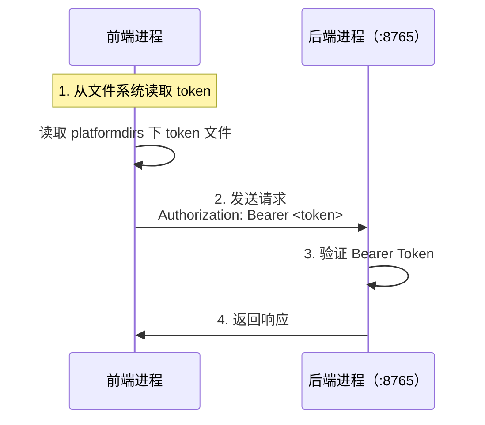

令牌是 **64 字节**（128 十六进制字符）的随机字符串，由后端首次启动时生成。这意味着首次启动后端后，前端需要去文件系统找到 token 才能发起认证请求。

### 6.3.2 前端获取令牌

前端通过文件系统读取令牌（来源：`infrastructure/security/token_manager.py`）：

```python
# 来源：backend-next/src/mindflow/infrastructure/security/token_manager.py
# 这是后端代码，前端通过文件系统读取 token 文件，不需要调用此 API

import secrets
from pathlib import Path


def load_or_create_token(path: Path) -> str:
    """加载或生成认证令牌。

    令牌为 64 字节随机数（128 十六进制字符），
    写入 platformdirs 用户数据目录下的 token 文件。
    """
    path = Path(path)
    if path.exists():
        token = path.read_text(encoding="utf-8").strip()
        if token:
            return token
        logger.warning("Token file exists but is empty, regenerating")

    token = secrets.token_hex(64)  # 64 bytes → 128 hex chars
    path.parent.mkdir(parents=True, exist_ok=True)
    path.write_bytes((token + "\n").encode("utf-8"))
    _set_file_permissions(path)
    return token
```

**解析**：令牌文件路径由 `platformdirs` 决定——Linux 在 `~/.local/share/mindflow/token`，macOS 在 `~/Library/Application Support/mindflow/token`，Windows 在 `%LOCALAPPDATA%/mindflow/token`。前端需要根据当前操作系统拼接对应的路径，读取此文件内容后，在每次请求的 `Authorization` 头中携带 `Bearer <token>`。验证使用 `secrets.compare_digest` 常量时间比较，防御时序侧信道攻击——即使攻击者能测量响应时间，也无法通过逐字符逼近来猜测令牌。

### 6.3.3 豁免路径

以下路径免认证：
- `GET /api/v1/health`
- `/docs`、`/redoc`、`/openapi.json`

WebSocket 通过查询参数认证：`ws://127.0.0.1:8765/api/v1/ws?token=<token>`

---

## 6.4 错误格式（RFC 9457）

所有错误响应使用 `application/problem+json` Content-Type。前端可以统一用一个错误处理中间件解析所有 API 错误，而不需要为每个端点单独处理。

### 6.4.1 8 种错误码

| type_slug | HTTP 状态 | 触发条件 |
|-----------|-----------|----------|
| `collector-not-running` | 503 | 采集器未初始化 |
| `not-found` | 404 | 资源不存在（活动/报告/干预） |
| `validation-error` | 422 | 参数校验失败（日期格式/分页/偏好大小） |
| `rate-limited` | 429 | 超出频率限制 |
| `auth-required` | 401 | 令牌缺失或无效 |
| `forbidden-host` | 403 | Host 头不是 localhost |
| `internal-error` | 500 | 未捕获异常（不泄露堆栈） |
| `llm-unavailable` | 503 | LLM 降级到规则引擎 |

每个错误码对应一个 HTTP 状态码和一个 type_slug。前端可以根据 `type` 字段做精确的错误处理，而不是仅依赖 HTTP 状态码——例如 `collector-not-running`（503）和 `llm-unavailable`（503）都是 503，但前者来自采集器，后者来自 LLM，前端的提示文案完全不同。

### 6.4.2 响应结构

```json
{
  "type": "https://mindflow.app/errors/not-found",
  "title": "Not Found",
  "status": 404,
  "detail": "未找到日期 2026-07-18 的报告",
  "instance": "/api/v1/reports/daily"
}
```

> `type` URI 不可解析——仅作为机器可读的错误标识符。`detail` 使用中文，面向用户。

---

## 6.5 App 装配与生命周期

### 6.5.1 关键代码：lifespan 启动与关闭

来源：`backend-next/src/mindflow/app.py`，这是整个应用的启动骨架。前端开发者应了解其顺序，以理解 API 何时可用。

```python
# 来源：backend-next/src/mindflow/app.py（精简，保留核心启动顺序和关闭逻辑）

async def _lifespan(app: FastAPI) -> AsyncIterator[None]:
    """Application lifespan: startup initialisation, shutdown cleanup."""

    # ── 启动顺序（7 步）──────────────────────────────────────────
    # 1. 数据库迁移（失败不阻塞——健康检查会报告 migration_failed）
    migration_applied = await run_migrations(settings.db_url)

    # 2. 完整性检查（VACUUM 恢复）
    db_ok = await integrity_check(engine)

    # 3. 加载/创建认证令牌
    system_token = load_or_create_token(token_path)

    # 4. 创建仓储（Repository）：activity, preferences, focus, report, analysis
    activity_repository = SQLAlchemyActivityRepository(...)

    # 5. 创建采集器服务（未启动——需要前端调用 POST /collector）
    collector = create_collector()                    # 平台相关
    collector_service = CollectorService(...)

    # 6. 创建 Wave 5 服务：分析、报告、维护
    analysis_service = AnalysisService(...)
    report_service = ReportService(...)

    # 6b. 创建 Wave 6 LLM 服务（API key 可选）
    llm_service = LLMService(...)                     # 无 key 时创建为 None

    # 6c. 创建 Wave 7 干预服务
    intervention_service = InterventionService(...)

    # 6d. 创建 Panel（G003）和 Chat（G004）服务
    panel_service = PanelService(...)                 # 需要 LLM key
    chat_service = ChatService(...)

    # 7. 启动调度器（定时任务：daily_panel, identify, report, cleanup, backup）
    scheduler = build_scheduler(...)
    scheduler.start()

    # 将全部服务注入 app.state
    app.state.engine = engine
    app.state.collector_service = collector_service
    app.state.system_token = system_token
    # ...（20+ 个 state 属性）

    yield  # ── 应用在此运行 ──

    # ── 优雅关闭（逆序）────────────────────────────────────────
    # 1. 停止调度器
    scheduler.shutdown(wait=False)

    # 2. 关闭 LLM 网关连接（panel + chat）
    await panel_service.aclose()
    await chat_service.aclose()

    # 3. 关闭全部 WebSocket 连接
    n_closed = await close_all_connections()
    logger.debug("Closed {} active WebSocket connection(s)", n_closed)

    # 4. 停止采集器（3 秒超时）
    await asyncio.wait_for(collector_service.stop(), timeout=3.0)

    # 5. 释放数据库引擎（3 秒超时）
    await asyncio.wait_for(engine.dispose(), timeout=3.0)
```

**解析**：启动顺序决定 API 的可用性——`GET /health` 最早就绪，`POST /panel/today` 需要 LLM 服务初始化后才可用。关闭顺序防止数据丢失：先停调度器，再断 WebSocket，最后关数据库。LLM 服务在无 API key 时创建为 `None`，对应端点返回 503。

#### 图6-2: 启动关闭生命周期图

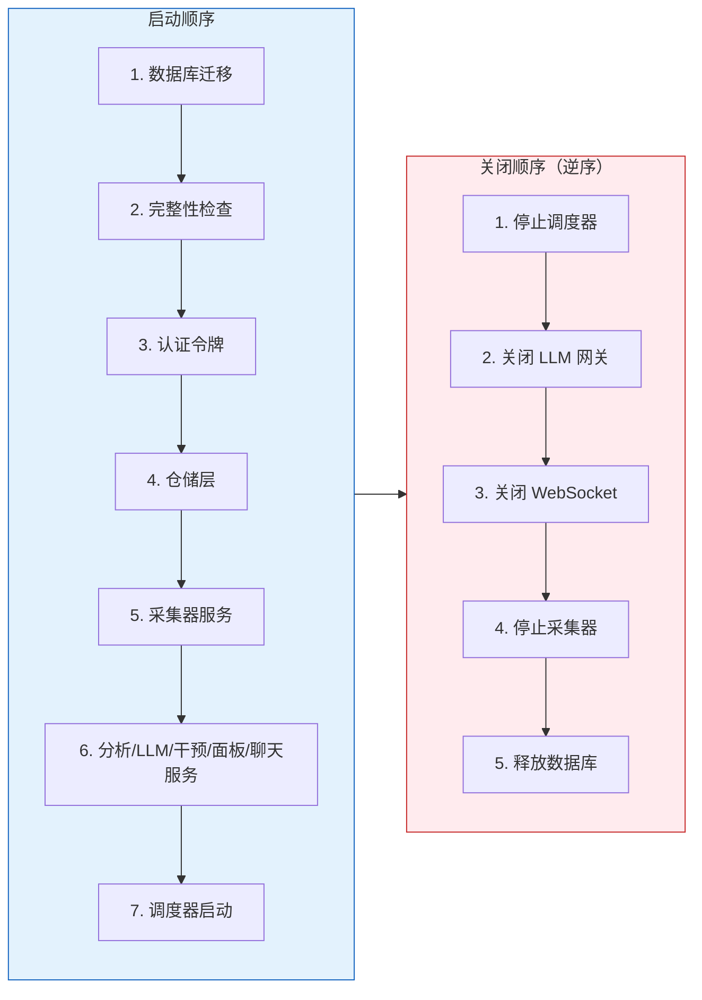

---

## 6.6 WebSocket 协议 v2

### 6.6.1 连接信息

- **端点**: `ws://127.0.0.1:8765/api/v1/ws?token=<token>`
- **认证**: 查询参数 token（非首次消息认证——理由见代码注释）
- **心跳**: 客户端每 30s 发 `ping`，服务端回复 `pong`
- **推流节流**: `activity_update` 最多每 2 秒推送一次，状态不变时跳过（节省带宽）

### 6.6.2 6 种消息帧

来源：`backend-next/src/mindflow/api/websocket.py`

所有消息为 JSON 文本帧，统一结构：
```json
{"type": "<event_type>", "payload": <object>, "timestamp": "<ISO8601 UTC>"}
```

**服务端 -> 客户端（4 种）：**

| type | payload 内容 | 触发时机 |
|------|-------------|----------|
| `activity_update` | `{app_name, window_title, process_name, is_idle}` | 活动窗口变化（2s 节流） |
| `focus_change` | `{session_id, session_type, focus_score}` | 专注/分心状态切换 |
| `intervention` | `{id, intervention_type, title, message, dismissible, cbt_technique}` | 触发干预时 |
| `error` | `{code, message}` | 接收端 JSON 解析失败 |
| `pong` | `{}` | 回应客户端 ping |

**客户端 -> 服务端（1 种）：**

| type | payload 内容 | 用途 |
|------|-------------|------|
| `ping` | `{}` | 心跳保活（建议 30s 间隔） |

WebSocket 协议被刻意设计为轻量级——客户端只发 `ping`，服务端推送全部 4 种事件帧。这种"服务端主动推、客户端只保活"的单向数据流模式，减少了客户端侧的协议复杂性。

#### 图6-3: WebSocket 帧流序列图

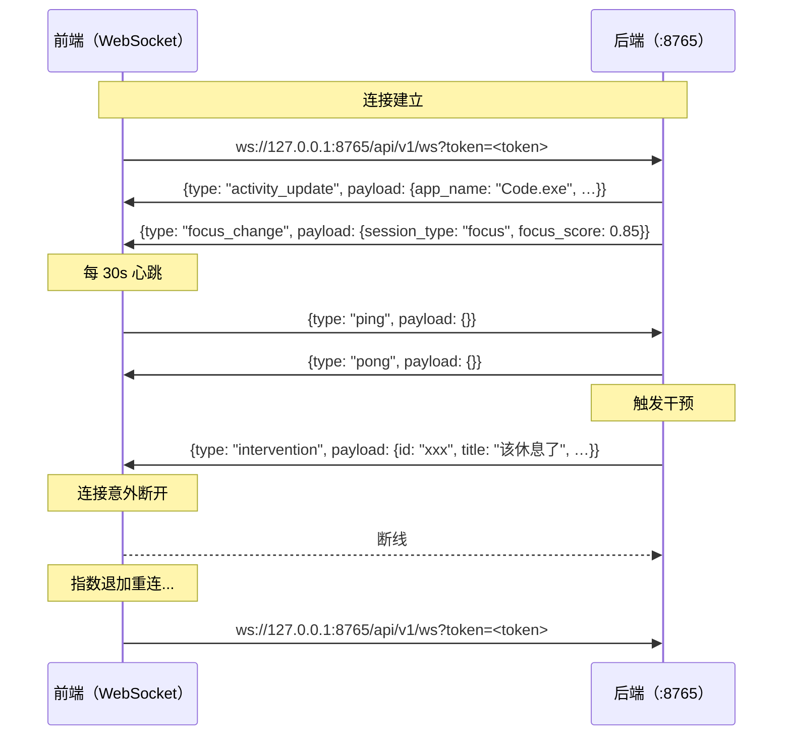

### 6.6.3 消息帧协议代码

```python
# 来源：backend-next/src/mindflow/api/websocket.py（核心消息处理）

import json
from datetime import UTC, datetime


# ── 广播函数（服务端推送）──────────────────────────────────

async def broadcast(message: dict) -> int:
    """向所有连接的 WebSocket 客户端发送消息。"""
    payload = json.dumps(_with_timestamp(message), ensure_ascii=False)
    sent = 0
    async with _connection_lock:
        disconnected = []
        for cid, ws in _active_connections.items():
            try:
                await ws.send_text(payload)
                sent += 1
            except Exception:
                disconnected.append(cid)
        for cid in disconnected:
            _active_connections.pop(cid, None)
    return sent


# ── 活动推送节流（§4.4 契约）──────────────────────────────

_last_activity_push: float = 0.0
_last_activity_state: str | None = None


async def broadcast_activity_update(data: dict) -> None:
    """广播 activity_update，内置节流：
    - 最多每 2 秒推送一次
    - 活动状态（app + idle 标志）未变时跳过
    """
    global _last_activity_push, _last_activity_state
    now = time.monotonic()
    state_key = f"{data.get('app_name')}|{data.get('is_idle')}"
    if state_key == _last_activity_state and now - _last_activity_push < 2.0:
        return
    _last_activity_push = now
    _last_activity_state = state_key
    await broadcast({"type": "activity_update", "payload": data})


# ── 服务端消息循环（处理客户端消息）──────────────────────

async def _handle_messages(websocket: WebSocket, client_id: str) -> None:
    """主消息循环：处理 ping，忽略其他类型（预留扩展）。"""
    async for raw in websocket.iter_text():
        try:
            data = json.loads(raw)
            msg_type = data.get("type", "")

            if msg_type == "ping":
                pong_msg = {
                    "type": "pong",
                    "payload": {},
                    "timestamp": datetime.now(UTC).isoformat(),
                }
                await websocket.send_text(json.dumps(pong_msg, ensure_ascii=False))
            # 未来扩展：处理其他客户端消息类型

        except json.JSONDecodeError:
            err_msg = {
                "type": "error",
                "payload": {
                    "code": "INVALID_JSON",
                    "message": "无效的 JSON 格式",
                },
            }
            await websocket.send_text(json.dumps(err_msg, ensure_ascii=False))
```

**解析**：`broadcast_activity_update` 是 WebSocket 协议中最核心的节流逻辑。它维护两个全局变量：`_last_activity_push`（上次推送的时间戳）和 `_last_activity_state`（上次推送的活动状态 key）。每次推送前，先将当前帧的 app_name 和 is_idle 拼成 `state_key`，与上次比较——如果关键状态没变且距上次推送不到 2 秒，直接跳过。这种"去重+节流"的双重策略保证了即使采集器以很高频率上报活动变化，前端也不会被高频帧冲垮。

连接管理使用 `asyncio.Lock` 保护共享的 `_active_connections` 字典。广播时遍历所有连接，发失败的连接被收集到 `disconnected` 列表并在遍历结束后移除。这种"先收集、再移除"的模式避免了在遍历过程中修改字典导致的 `RuntimeError`。

---

## 6.7 CURL 示例集——按业务流程排列

假设后端运行在 `127.0.0.1:8765`，令牌为 `<TOKEN>`。

### 6.7.1 健康检查

这段命令用来确认后端已经启动就绪，是调试时的第一步。

```bash
# ── 第一步：确认后端就绪 ──
curl -s http://127.0.0.1:8765/api/v1/health | python -m json.tool
```

预期响应：
```json
{
  "status": "ok",
  "version": "0.2.0",
  "timestamp": "2026-07-18T12:00:00+00:00",
  "collector": { "status": "stopped" },
  "database": { "status": "ok", "connected": true },
  "migration": { "applied": true }
}
```

### 6.7.2 启动采集器

健康检查通过后，启动数据采集器开始收集窗口活动。

```bash
# ── 第二步：启动数据采集 ──
curl -s -X POST http://127.0.0.1:8765/api/v1/collector \
  -H "Authorization: Bearer <TOKEN>" | python -m json.tool
# → {"status": "running", "message": "采集器已启动"}

# 查看采集器状态
curl -s http://127.0.0.1:8765/api/v1/collector \
  -H "Authorization: Bearer <TOKEN>" | python -m json.tool
# → {"status": "running"}
```

### 6.7.3 查询活动数据

采集器运行后，查看当前活动窗口和数据。

```bash
# ── 第三步：查看当前活动窗口 ──
curl -s http://127.0.0.1:8765/api/v1/activities/current \
  -H "Authorization: Bearer <TOKEN>" | python -m json.tool
```

预期响应：
```json
{
  "id": "abc123",
  "user_id": 1,
  "timestamp": "2026-07-18T19:30:00+00:00",
  "duration_s": 5.0,
  "event_type": "window_snapshot",
  "data": {
    "app_name": "Visual Studio Code",
    "window_title": "ch6-api-frontend.md - MindFlow",
    "process_name": "Code.exe",
    "is_idle": false
  }
}
```

### 6.7.4 专注会话

有活动数据后，查看专注分析结果。

```bash
# ── 第四步：查看今日专注会话 ──
curl -s "http://127.0.0.1:8765/api/v1/focus" \
  -H "Authorization: Bearer <TOKEN>" | python -m json.tool

# 查看 30 天趋势
curl -s "http://127.0.0.1:8765/api/v1/focus/trend?days=30" \
  -H "Authorization: Bearer <TOKEN>" | python -m json.tool
```

### 6.7.5 报告与归因

查看日报、行为模式分析，以及触发 LLM 归因。

```bash
# ── 第五步：获取日报 ──
curl -s "http://127.0.0.1:8765/api/v1/reports/daily?date=2026-07-18" \
  -H "Authorization: Bearer <TOKEN>" | python -m json.tool

# 分析行为模式
curl -s "http://127.0.0.1:8765/api/v1/analytics/patterns?days=14" \
  -H "Authorization: Bearer <TOKEN>" | python -m json.tool

# 触发 LLM 归因分析（三层降级：DeepSeek → Ollama → 规则引擎）
curl -s -X POST http://127.0.0.1:8765/api/v1/analytics/attribution \
  -H "Authorization: Bearer <TOKEN>" \
  -H "Content-Type: application/json" \
  -d '{"date": "2026-07-18", "force": true}' | python -m json.tool
```

预期归因响应：
```json
{
  "assessment": {
    "types": ["impulsivity", "task_aversion"],
    "confidence": { "impulsivity": 0.78, "task_aversion": 0.45 },
    "recommended_technique": "stimulus_control"
  },
  "source": "deepseek",
  "cached": false,
  "meta": { "degraded": false }
}
```

### 6.7.6 专家会诊

这是第5章多专家面板的 API 入口。触发一次完整的五专家会诊，可能需要几秒到十几秒。

```bash
# ── 第六步：触发专家会诊 ──
curl -s -X POST http://127.0.0.1:8765/api/v1/panel/today \
  -H "Authorization: Bearer <TOKEN>" | python -m json.tool
```

预期响应（见 6.8.1 节 PanelVerdict 结构）。

### 6.7.7 对话助手

与 AI 助手进行自然语言对话。

```bash
# ── 第七步：提问 ──
curl -s -X POST http://127.0.0.1:8765/api/v1/chat \
  -H "Authorization: Bearer <TOKEN>" \
  -H "Content-Type: application/json" \
  -d '{"message": "为什么我今天下午总是走神？"}' | python -m json.tool

# 列出会话
curl -s http://127.0.0.1:8765/api/v1/chat/sessions \
  -H "Authorization: Bearer <TOKEN>" | python -m json.tool

# 查看某个会话的消息
curl -s http://127.0.0.1:8765/api/v1/chat/<SESSION_ID>/messages \
  -H "Authorization: Bearer <TOKEN>" | python -m json.tool
```

### 6.7.8 干预与控制

手动触发干预或控制自主行为逻辑。

```bash
# ── 第八步：手动触发干预 ──
curl -s -X POST "http://127.0.0.1:8765/api/v1/intervention/trigger?intensity=strict" \
  -H "Authorization: Bearer <TOKEN>" | python -m json.tool

# 查看干预历史
curl -s "http://127.0.0.1:8765/api/v1/intervention/history?days=7" \
  -H "Authorization: Bearer <TOKEN>" | python -m json.tool

# 自主行为控制
curl -s http://127.0.0.1:8765/api/v1/autonomy \
  -H "Authorization: Bearer <TOKEN>" | python -m json.tool

curl -s -X POST http://127.0.0.1:8765/api/v1/autonomy/pause \
  -H "Authorization: Bearer <TOKEN>" \
  -H "Content-Type: application/json" \
  -d '{"hours": 2.0}' | python -m json.tool
```

### 6.7.9 数据导出

最后一步：导出全部数据。

```bash
# ── 最后：导出数据 ──
curl -s "http://127.0.0.1:8765/api/v1/export?fmt=csv" \
  -H "Authorization: Bearer <TOKEN>" \
  -o mindflow-export.csv

# JSON 格式
curl -s "http://127.0.0.1:8765/api/v1/export?fmt=json" \
  -H "Authorization: Bearer <TOKEN>" \
  -o mindflow-export.json
```

---

## 6.8 关键 API 响应结构

### 6.8.1 PanelVerdict（专家会诊结论）

来源：`backend-next/src/mindflow/api/routes/panel.py`

```json
{
  "types": ["impulsivity"],
  "confidence": { "impulsivity": 0.82 },
  "technique": "stimulus_control",
  "rationale": "今天下午高频切换标签页（平均每分钟切换 2.3 次），且出现 3 次社交类应用访问",
  "dissent": [],
  "transcript": [
    { "role": "analyst", "content": "检测到 2.3 次/分钟的应用切换...", "round": 0 },
    { "role": "attribution_expert", "content": "可能机制：冲动性注意力偏移...", "round": 0 }
  ],
  "escalated": false,
  "call_count": 6,
  "degraded": false,
  "meta": { "degraded": false }
}
```

> 当 LLM 不可用，面板降级到单一专家模式时，`meta.degraded` 为 `true`，`source` 为 `"single_expert"`。

### 6.8.2 Chat 响应

```json
{
  "answer": "根据今天下午的活动数据分析，你出现了...",
  "session_id": "xxxxxxxx-xxxx-xxxx-xxxx-xxxxxxxxxxxx",
  "tools_used": ["attribution_analysis", "evidence_search"],
  "evidence_cited": [
    "13:02-13:15 连续访问 Bilibili",
    "14:30-14:45 微信通知回复后未返回工作窗口"
  ],
  "degraded": false
}
```

### 6.8.3 分心模式分析

```json
{
  "high_switch_periods": [
    { "start": "14:00", "end": "15:30", "peak": 18.5 }
  ],
  "trigger_apps": ["wechat.exe", "chrome.exe"],
  "heatmap": [
    { "hour": 14, "slot": 0, "switches": 12 },
    { "hour": 14, "slot": 1, "switches": 8 }
  ],
  "total_sessions": 12,
  "analysis_days": 14
}
```

### 6.8.4 行为画像

```json
{
  "peak_focus_hours": [9, 10, 11, 15],
  "top_productive_apps": ["Code.exe", "WezTerm.exe"],
  "avg_focus_block_min": 24.5,
  "distraction_triggers": ["chrome.exe", "wechat.exe"],
  "total_events_analysed": 8542
}
```

---

## 6.9 速率限制

来源：`backend-next/src/mindflow/api/middleware/ratelimit.py`

MindFlow 使用内存令牌桶算法（无 Redis 依赖）进行速率限制。每个响应包含速率头：

```http
X-RateLimit-Remaining: 42
X-RateLimit-Reset: 1721304000
```

| 端点 | 速率 | 日硬上限 |
|------|------|----------|
| 全局（所有端点） | 100 请求/分钟 | — |
| `POST /chat` | 5 请求/分钟 | 60/天 |
| `POST /analytics/attribution` | 2 请求/分钟 | 20/天 |
| `POST /panel/today` | 1 请求/小时 | 3/天 |
| `GET /panel` | 10 请求/分钟 | 30/天 |

超过限制返回 429（RFC 9457），响应体包含 `retry_after_seconds`。前端可以根据 `X-RateLimit-Remaining` 决定是否降低请求频率——例如当剩余配额低于 10 时，可以在界面上提示用户。

---

## 6.10 前端 WebSocket 客户端实现

### 6.10.1 重连退避 + Ping/Pong + 消息处理

```javascript
// 推荐的前端 WebSocket 客户端实现
// 用法：const ws = new MindFlowWS(token)
//       ws.on("activity_update", (payload) => updateDashboard(payload))

class MindFlowWS {
  constructor(token, options = {}) {
    this.token = token;
    this.baseUrl = options.baseUrl || "ws://127.0.0.1:8765/api/v1/ws";
    this.reconnectBaseMs = options.reconnectBaseMs || 1000;   // 初始 1s
    this.reconnectMaxMs = options.reconnectMaxMs || 30000;    // 最大 30s
    this.pingIntervalMs = options.pingIntervalMs || 30000;    // 每 30s ping
    this.listeners = new Map();
    this._attempts = 0;
    this._connect();
  }

  // ── 事件监听 ─────────────────────────────────────────────
  on(type, callback) {
    if (!this.listeners.has(type)) this.listeners.set(type, []);
    this.listeners.get(type).push(callback);
  }

  _emit(type, payload) {
    const cbs = this.listeners.get(type) || [];
    cbs.forEach(cb => cb(payload));
  }

  // ── 连接 ─────────────────────────────────────────────────
  _connect() {
    const url = `${this.baseUrl}?token=${this.token}`;
    this.ws = new WebSocket(url);

    this.ws.onopen = () => {
      this._attempts = 0;
      this._startPing();
      console.log("[MindFlowWS] 已连接");
    };

    this.ws.onmessage = (event) => {
      try {
        const msg = JSON.parse(event.data);
        // 后端发送的每条消息都有 type 字段
        this._emit(msg.type, msg.payload || msg);
      } catch (e) {
        console.warn("[MindFlowWS] JSON 解析失败:", event.data);
      }
    };

    this.ws.onclose = () => {
      this._stopPing();
      this._reconnect();
    };

    this.ws.onerror = () => {
      this.ws.close();  // onclose 触发重连
    };
  }

  // ── 重连（指数退避）──────────────────────────────────────
  _reconnect() {
    const delay = Math.min(
      this.reconnectBaseMs * Math.pow(2, this._attempts) +
        Math.random() * 1000,  // 抖动（jitter）
      this.reconnectMaxMs
    );
    this._attempts++;
    console.log(`[MindFlowWS] ${delay / 1000}s 后重连...`);
    this._retryTimer = setTimeout(() => this._connect(), delay);
  }

  // ── Ping 保活 ────────────────────────────────────────────
  _startPing() {
    this._pingTimer = setInterval(() => {
      if (this.ws.readyState === WebSocket.OPEN) {
        this.ws.send(JSON.stringify({ type: "ping", payload: {} }));
      }
    }, this.pingIntervalMs);
  }

  _stopPing() {
    clearInterval(this._pingTimer);
    clearTimeout(this._retryTimer);
  }

  // ── 关闭连接 ─────────────────────────────────────────────
  close() {
    this._stopPing();
    this.ws.close(1000, "客户端主动关闭");
  }
}

// ── 使用示例 ────────────────────────────────────────────────
const ws = new MindFlowWS(token);

// 实时活动更新
ws.on("activity_update", (payload) => {
  updateCurrentWindow(payload.app_name, payload.window_title);
});

// 专注状态变更
ws.on("focus_change", (payload) => {
  updateFocusBadge(payload.session_type, payload.focus_score);
});

// 干预推送
ws.on("intervention", (payload) => {
  showInterventionToast(payload.title, payload.message);
});
```

**解析**：`MindFlowWS` 类封装了完整的 WebSocket 生命周期。核心设计点有三个。第一，**指数退避加入随机抖动（jitter）**，避免多个客户端实例同时重连导致拥塞——每次重连延迟 = `base * 2^attempts + random(0~1000)ms`，最大不超过 30 秒。第二，**30 秒间隔的 ping 保活**，服务端回复 pong——连接空闲超过 60 秒可能被操作系统或代理断开。第三，`ws.onmessage` 一条 handler 分发所有消息类型，前端通过 `on("intervention", cb)` 注册对应处理函数，与服务端 `broadcast` 的多事件推送模型匹配——前端不需要自己写 switch-case 来区分消息类型。

---

## 6.11 干预响应回传示例

### 6.11.1 用户交互流程

以下是用户收到干预推送后的完整交互序列：

#### 图6-4: 干预推送→响应交互序列图

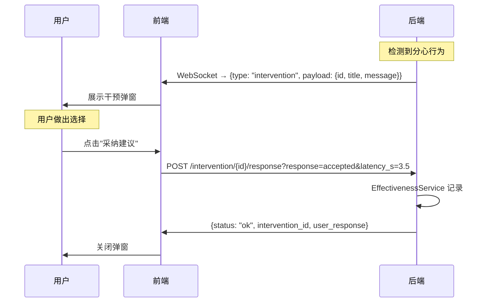

### 6.11.2 前端 POST 用户回应

```javascript
// 来源：前端需实现的干预反馈逻辑
// 后端端点定义在 backend-next/src/mindflow/api/routes/intervention.py

/**
 * 记录用户对干预的响应。
 *
 * @param {string} interventionId - 干预 UUID（从 WS intervention 帧获取）
 * @param {"accepted"|"ignored"|"dismissed"} response - 用户选择
 * @param {number} latencyMs - 从收到干预到响应的延时（毫秒）
 * @param {string} token - Bearer token
 */
async function respondToIntervention(interventionId, response, latencyMs, token) {
  const latencyS = Math.round(latencyMs / 1000);

  const url = new URL(
    `http://127.0.0.1:8765/api/v1/intervention/${interventionId}/response`
  );
  url.searchParams.set("response", response);
  url.searchParams.set("latency_s", String(latencyS));

  const resp = await fetch(url.toString(), {
    method: "POST",
    headers: {
      Authorization: `Bearer ${token}`,
    },
  });

  if (!resp.ok) {
    const err = await resp.json();
    // 处理 404（干预已过期或被清理）
    if (resp.status === 404) {
      console.warn("干预记录不存在（可能已过期）:", interventionId);
      return { error: "not_found" };
    }
    throw new Error(`干预响应失败: ${err.detail || resp.statusText}`);
  }

  return await resp.json();  // → { status: "ok", intervention_id, user_response }
}

// ── 使用示例（在 intervention 弹窗组件中）───────────────────

function InterventionToast({ intervention, onClose }) {
  const startTime = Date.now();

  const handleResponse = async (response) => {
    const latencyMs = Date.now() - startTime;
    try {
      const result = await respondToIntervention(
        intervention.id,
        response,
        latencyMs,
        getToken()
      );
      console.log("干预响应已记录:", result);
    } catch (err) {
      console.error("记录干预响应失败:", err);
    } finally {
      onClose();  // 关闭弹窗
    }
  };

  return (
    <div className="intervention-toast">
      <h3>{intervention.title}</h3>
      <p>{intervention.message}</p>
      <div className="intervention-actions">
        <button onClick={() => handleResponse("accepted")}>
          采纳建议 · 试试看
        </button>
        <button onClick={() => handleResponse("ignored")}>
          忽略 · 我自有安排
        </button>
        <button onClick={() => handleResponse("dismissed")}>
          关闭 · 别提醒了
        </button>
      </div>
    </div>
  );
}
```

**解析**：干预反馈是 WebSocket 推送（实时）和 REST 确认（持久化）的典型组合。前端在收到 `intervention` 帧后立即展示弹窗，记录从展示到用户操作的延时（`latency_s`）——后端利用此数据评估干预有效性。三种响应分别代表不同的用户意图：`accepted` 表示用户愿意尝试，`ignored` 表示用户看到但不操作，`dismissed` 表示用户明确拒绝。后端 `EffectivenessService` 据此计算干预采纳率。

> **注意**：`latency_s` 以秒为单位，精确到小数（如 `3.5`），前端应在用户点击按钮时计算 `Date.now() - startTime`。这个延时数据对后端评估干预的即时有效性非常重要——延时越短说明干预的"正好击中"程度越高。

---

## 6.12 前端页面设计

以下为四个核心页面的设计说明，供设计师和前端开发者参考。每页都附带组件树（Mermaid 图）和关键数据依赖说明。

### 6.12.1 Dashboard 主页

**页面定位**：用户打开 App 后的第一屏，实时概览今日专注状态。

#### 图6-5: Dashboard 组件树

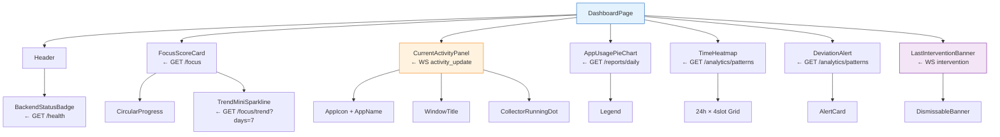

**数据依赖**：3 个 REST 调用（并行）+ 1 个 WebSocket 连接。
**刷新策略**：REST 部分 60 秒轮询，WebSocket 实时推送。

### 6.12.2 会诊报告页

**页面定位**：每日专家会诊结果展示，"拖延体检报告"。

#### 图6-6: 会诊报告页组件树

```mermaid
flowchart TD
    PANEL["PanelReportPage"] --> HDR["Header<br>日期 + '今日会诊'"]
    
    PANEL --> TYPE["ProcrastinationTypeCards<br>← POST /panel/today"]
    TYPE --> TC1["TypeCard<br>拖延类型 + 置信度"]
    TYPE --> TC2["TypeCard"]
    TYPE --> TC3["TypeCard（最多3种）"]
    
    PANEL --> GAUGE["ConfidenceGauge"]
    GAUGE --> SEMI["SemiCircleGauge"]
    
    PANEL --> TECH["RecommendedTechnique"]
    TECH --> TBADGE["TechniqueBadge"]
    TECH --> RP["RationaleParagraph"]
    
    PANEL --> DISSENT["DissentingOpinions<br>← 仅非空时显示"]
    DISSENT --> DCARD["DissentCard"]
    
    PANEL --> DIALOGUE["ExpertDialogue<br>← transcript[]"]
    DIALOGUE --> MB1["MessageBubble - Analyst"]
    DIALOGUE --> MB2["MessageBubble - Attribution"]
    DIALOGUE --> MB3["MessageBubble - Moderator"]
    DIALOGUE --> MB4["MessageBubble - Critic"]
    
    PANEL --> SUGGEST["InterventionSuggestionCard"]
    SUGGEST --> ACTION["SuggestionAction"]
    
    PANEL --> DEGRADE["DegradationBanner<br>← 仅 meta.degraded 时"]
    DEGRADE --> WBANNER["WarningBanner"]
    
    style PANEL fill:#e8f5e9,stroke:#2e7d32
    style DIALOGUE fill:#f3e5f5,stroke:#7b1fa2
    style DEGRADE fill:#ffebee,stroke:#c62828
```

**数据依赖**：1 个 REST 调用（`POST /panel/today`，也会消耗 LLM 配额）。
**交互**："专家怎么说"对话区域可折叠展开；点击某项干预建议可跳转到干预调整页。

### 6.12.3 对话助手页

**页面定位**：自然语言交互界面，用户可直接与 AI 对话分析拖延行为。

#### 图6-7: 对话助手页组件树

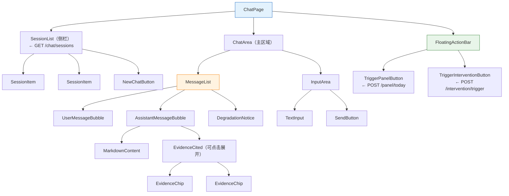

**数据依赖**：`POST /chat`（发送消息+获取回复），`GET /chat/sessions`（列表），`GET /chat/{id}/messages`（历史）。
**交互**：列表式对话，支持 Markdown 渲染。问题建议以 Chip 形式展示（"为什么我又走神了？"、"帮我分析今天下午的效率"）。

### 6.12.4 设置页

**页面定位**：系统配置中心。

#### 图6-8: 设置页组件树

```mermaid
flowchart TD
    SETTINGS["SettingsPage"] --> COL["CollectorSection<br>← GET/POST /collector"]
    COL --> TGL1["ToggleSwitch"]
    COL --> SB1["StatusBadge"]
    
    SETTINGS --> LLM["LLMConfiguration<br>← GET/PUT /preferences"]
    LLM --> APIKEY["APIKeyInput"]
    LLM --> URL["BaseURLInput"]
    LLM --> MDSEL["ModelSelector"]
    LLM --> OLLAMA["OllamaToggle + UrlInput"]
    
    SETTINGS --> AUTO["AutonomySection<br>← GET /autonomy + POST /autonomy/pause"]
    AUTO --> TGL2["ToggleSwitch"]
    AUTO --> PAUSE["PauseButton + Duration"]
    AUTO --> PUDISPLAY["PausedUntilDisplay"]
    
    SETTINGS --> DATA["DataPrivacy<br>← GET /export + GET /health"]
    DATA --> STORAGE["StorageUsageCard"]
    DATA --> EXPORT["ExportButton"]
    DATA --> DELETE["DeleteDataButton"]
    
    SETTINGS --> INT["InterventionPreferences<br>← GET/PATCH /preferences"]
    INT --> SLIDER["IntensitySlider"]
    INT --> QHOURS["QuietHoursTimePicker"]
    INT --> CHECKBOX["AllowedTypesCheckboxList"]
    
    SETTINGS --> ABOUT["AboutSection<br>← GET /health"]
    ABOUT --> VER["VersionLabel"]
    ABOUT --> MSB["MigrationStatusBadge"]
    
    style SETTINGS fill:#f3e5f5,stroke:#7b1fa2
    style DATA fill:#ffebee,stroke:#c62828
    style ABOUT fill:#e0f2f1,stroke:#00796b
```

**数据依赖**：7+ 个 REST 调用（设置项分散在不同端点）。
**交互**：开关类立即生效（`POST /preferences`），危险操作需二次确认。偏好存储为无 schema 的 JSON blob，前端定义键名。

---

## 6.13 前端数据流建议

### 6.13.1 启动阶段

#### 图6-9: 前端启动数据流

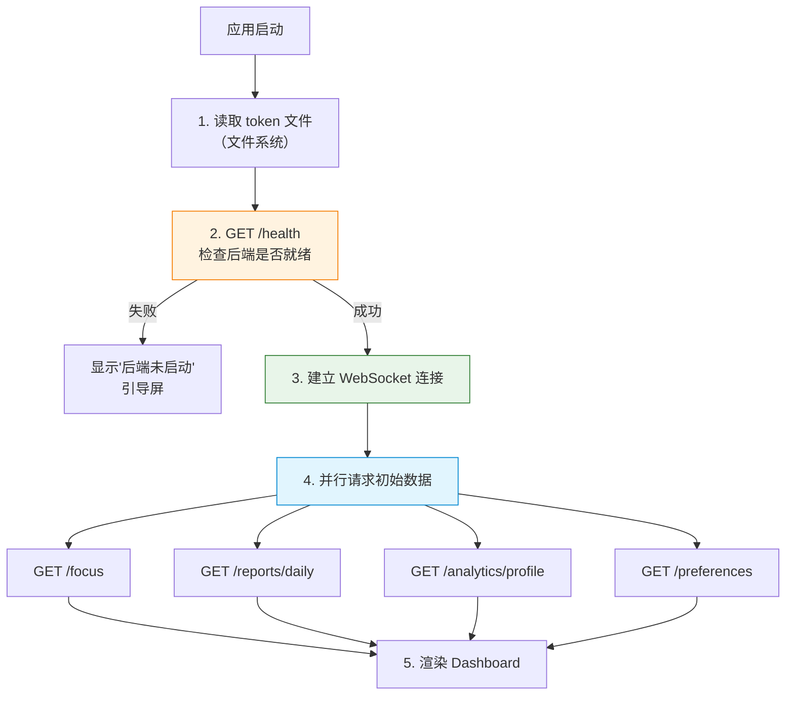

### 6.13.2 实时更新阶段

#### 图6-10: 实时更新数据流

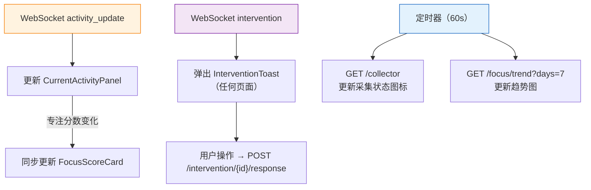

启动阶段的顺序很重要：**先确认后端就绪，再建立 WebSocket 连接**。如果 `GET /health` 失败（后端还没启动），前端应该显示一个引导屏而不是空白页面。启动后的实时阶段则始终监听 WebSocket 推送，配合定时器做 REST 轮询。

### 6.13.3 常见的空状态处理

| 场景 | 前端行为 |
|------|----------|
| 首次使用，无活动记录 | Dashboard 显示"欢迎"引导页，非空图表 |
| 采集器未启动 | 顶部提示"数据采集未启动"，提供启动按钮 |
| LLM 无 Key | 归因页显示"LLM 尚未配置"，展示降级后规则引擎结果 |
| 当天无日报 | 显示"今日数据尚未生成"（自动触发 `/reports/daily`） |
| WebSocket 断线中 | 显示"断线重连中..."指示器，不覆盖主要内容 |
| 模型尚未训练 | 分析页显示"模型尚未训练"，不报错 |

每个空状态都应该有对应的引导操作，而不是简单地显示无数据的空白。例如采集器未启动时，按钮直接调用 `POST /collector`；WebSocket 断线时前端应该自己重连，而不需要用户刷新页面。

---

## 6.14 与第5章（Agent API）的衔接

第5章描述了 Agent 系统的内部架构——专家面板（6 位 AI 专家）和聊天助手背后的 LangGraph 工作流。本章将这些 Agent 能力暴露为 REST 端点：

| Agent 系统（第5章） | API 端点（本章） | 说明 |
|---------------------|------------------|------|
| `PanelOrchestrator` → `DeepSeekGateway` | `POST /panel/today` | 触发 6 专家会诊流水线 |
| `ChatService` → `CrisisDetector` + `EvidenceBundleBuilder` | `POST /chat` | 带证据追溯的对话 |
| `LLMService` → 三层降级链 | `POST /analytics/attribution` | 归因分析（DeepSeek/Ollama/规则） |
| `InterventionService` → `InterventionThrottle` | `POST /intervention/trigger` | 规则引擎驱动干预 |

第5章读完后，配合本章的端点表就可以直接调通第5章提到的所有 Agent 能力。

---

## 6.15 与第1章（架构总览）的衔接

第1章给出了宏观架构。本章就是这个架构图的具体实现：

#### 图6-11: 第1章架构图的具体协议实现

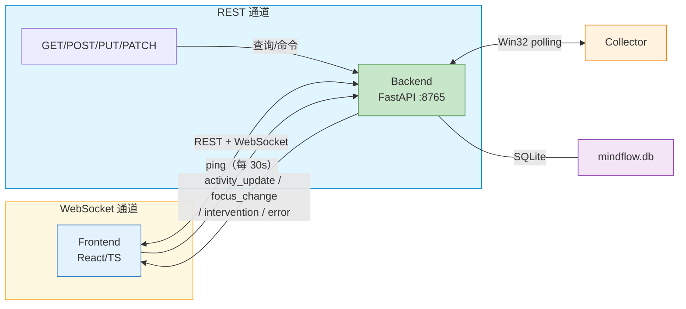

第 1 章的那个经典架构图中，每条箭头背后都有具体的协议实现：
- **`←→` 方向**：REST（前端主动查询） + WebSocket（后端主动推送）
- **安全**：Host 验证 + Bearer Token + 文件系统令牌
- **双通道拆分**：查询/命令走 REST，实时事件走 WebSocket，互不干扰

第1章读完架构图后，接着读本章就能理解每条箭头的具体协议。

---

## 附录：常见问题

**Q: 为什么 WebSocket 使用查询参数 token 而不是 Authorization 头？**
A: 浏览器 `WebSocket(url)` 构造函数不支持自定义头部。查询参数 token 比首次消息认证更简单——客户端连接后立即收到事件，无需等待认证消息往返。

**Q: 同一个请求出现 401 和 429 谁优先？**
A: 中间件顺序（从外到内）：Logging → Host → Auth → RateLimit。Auth 先拦截，所以 401 优先于 429。

**Q: /health 返回 `migration.applied: false` 怎么办？**
A: 数据库迁移失败，应用仍可运行但可能缺少新表。检查日志中的迁移错误。不影响已有数据的 API。

**Q: 偏好设置有哪些已知键？**
A: 偏好是自由的 JSON blob（前端定义键名），64KB 上限，8 层嵌套上限。已知键包括 `llm.api_key`、`collector.enabled`、`autonomy.enabled`、`intervention.intensity` 等，但不限于此——前端可自由扩展。
