\thispagestyle{empty}

\begin{center}
\vspace*{4cm}

{\Huge \textbf{MindFlow}}\\[0.5cm]
{\LARGE 基于行为建模与 LLM 的智能专注助手}\\[1.5cm]

{\large \textbf{从零构建全栈入门手册}}\\[2cm]

{\large 胡淙煜}\\[0.3cm]
{\large 华东师范大学 软件工程学院}\\[2cm]

{\large 2026 年 7 月 18 日}\\[1cm]

{\small 版本: v3.0-langchain | 测试: 1000+ | 代码: MIT 开源}

\vfill
\end{center}

\newpage

# 序言

这本手册记录 MindFlow 后端从零到完整交付的全过程——从架构设计上的第一笔，到最后一行的部署命令。它不是一份API参考文档，而是一本"如果你要做一个类似的东西，可以从这里开始"的全栈指南。

**本书适合谁**: 前端队友（张皓、杨智杰）了解后端能力边界；未来的自己复盘设计决策；任何想理解"本地ML + 云端LLM 智能体"混合架构的人。

**如何阅读**: 按章节顺序最佳——每章依赖前一章建立的上下文。如果只想看某个模块：
- 想对前端 → 第6章
- 想理解 ML 算法 → 第3章
- 想理解为什么选 LangChain → 第5章
- 想跑起来 → 第1章 §1.6

**代码准确性承诺**: 本书中每段代码均来自 `backend-next/src/` 真实源文件，标注了精确的文件路径和行号。不包含伪代码或"示意代码"——所有代码片段都可以在仓库中找到对应的位置。

\newpage

# 目录
# 第1章 项目总览与架构设计

## 1.1 项目定位

**MindFlow** 是一个本地优先的智能专注力追踪与抗拖延助手。它运行在你的个人电脑上，周期性采集活跃窗口信息，分析你的行为模式，在检测到拖延倾向时生成个性化的认知行为干预。

MindFlow 的设计原则是 **高性能 > 高可用 > 高专业度**。它始终在本地运行，不依赖云端服务——所有行为数据存在你的 SQLite 文件里。LLM 归因分析（用大语言模型判断你是走神了还是真在工作）采用三层降级链：**DeepSeek API** → **Ollama 本地模型** → **规则引擎**。这样，核心功能在任何网络条件下都能工作。

MindFlow 不是 SaaS 产品，而是一个 PyInstaller 打包的单进程桌面应用。它服务于希望了解自己注意力分布、减少无意识拖延的个人用户。

## 1.2 架构全景

### 1.2.1 三层架构

MindFlow 采用经典**分层架构**，依赖方向严格单向：**Presentation → Application → Domain ← Infrastructure**。

#### 图1: 四层架构依赖关系

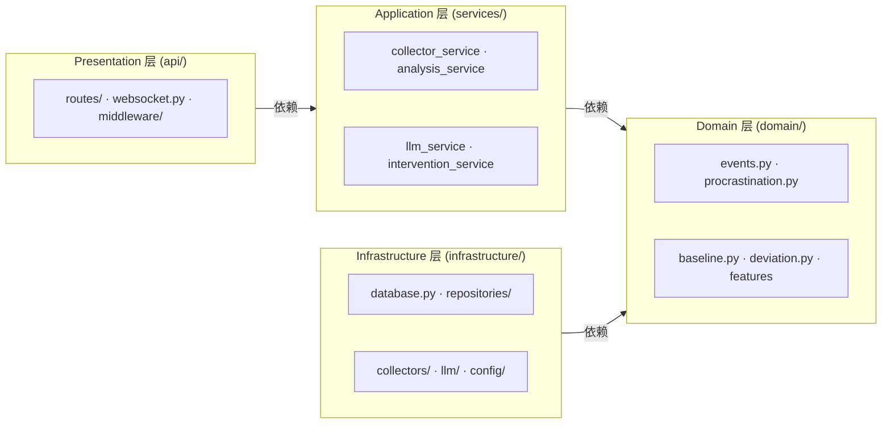

**依赖方向说明**：箭头表示"依赖"。Domain 位于底层中心，**零外部依赖**——它是纯 Python，不依赖任何框架或外部库。Infrastructure 层依赖 Domain（实现其接口）。Services 层编排 Domain 和 Infrastructure 的协作。API 层是入口，只依赖 Services。

这种单向依赖的好处是：Domain 层的改动不会影响其他层，其他层改了 Domain 不受影响。你可以在不改动核心业务逻辑的前提下，替换数据库（SQLite → PostgreSQL）、切换采集器（Win32 → macOS）、甚至替换 Web 框架（FastAPI → 其他）。

### 1.2.2 进程与部署拓扑

#### 图2: 应用进程拓扑

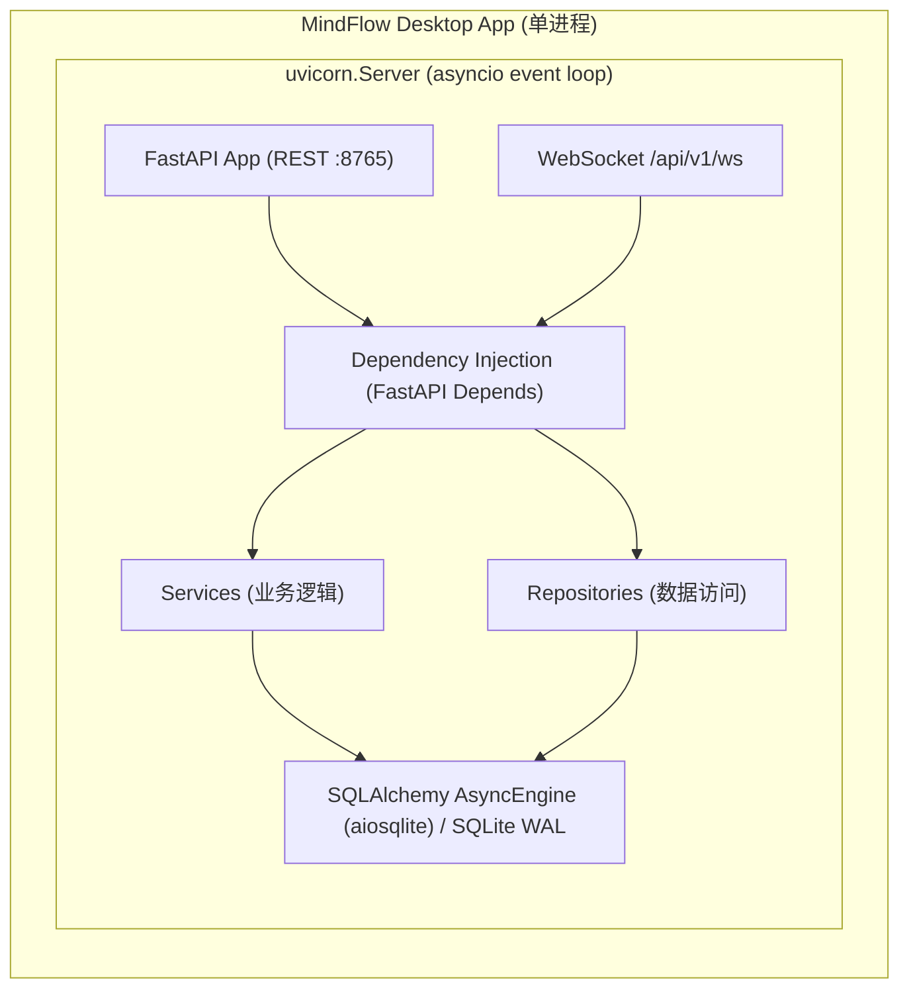

#### 图3: 采集器与 LLM 流水线

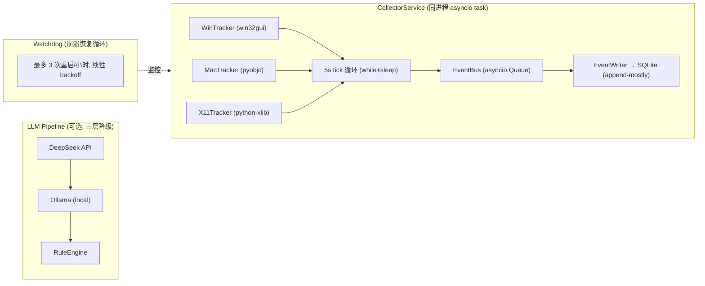

**关键设计选择**:

- **同进程异步隔离**：采集器作为独立 asyncio task 运行在 API 进程内，通过 **EventBus**（`asyncio.Queue`）通信，不与 API 请求路径共享可变状态。对比 ActivityWatch 的多进程方案，这个设计减少了约 300 行 IPC（进程间通信）代码，也省去了进程间序列化/反序列化的开销。
- **依赖注入**：所有 Service 和 Repository 通过 FastAPI `Depends()` 获取实例。旧代码中 `from scheduler import collector` 那样的全局单例模式已经废弃。依赖注入让测试时可以轻松替换 mock 对象。
- **单进程打包**：最终产物是一个 PyInstaller 打包的单可执行文件。watchdog 进程覆盖崩溃恢复场景，不需要系统级的进程管理器（如 systemd 或 launchd）。

### 1.2.3 三层 LLM 降级链

LLM 归因分析是 MindFlow 的差异化特性，但其可用性不能依赖网络或第三方 API。三层降级保证核心功能永远可用：

#### 图4: LLM 三层降级链

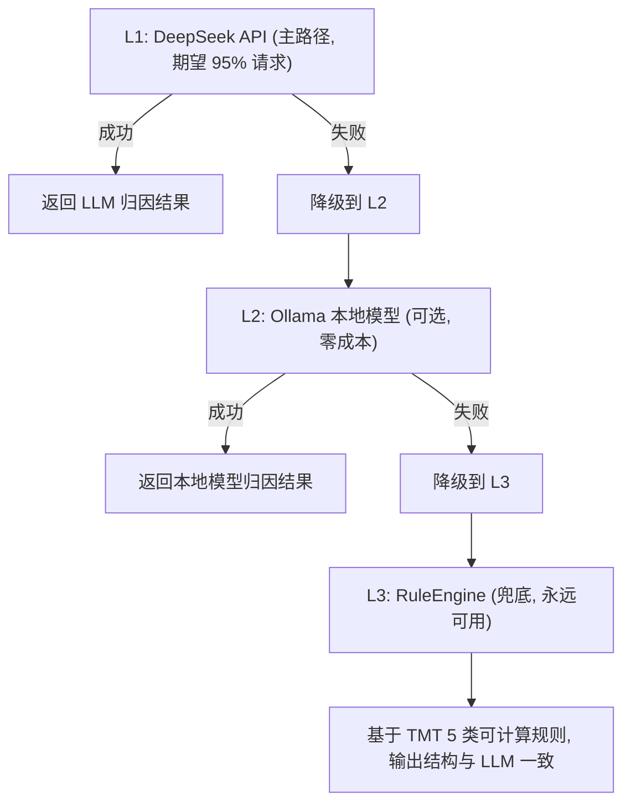

**规则引擎兜底的价值**：即使没有网络（DeepSeek 不可用）也没有安装 Ollama，**RuleEngine** 仍然能基于预设的 TMT（时间动机理论）规则给出归因分析。它的输出结构和 LLM 版本完全一致，前端不需要关心当前用的是哪一层。用户看到的始终是同样格式的分析结果，只是深度和细腻度有差异。

## 1.3 技术栈

MindFlow 的技术选型覆盖了从底层采集到上层 API 的完整链条。下表按层列出了所有依赖及其用途：

| 层 | 技术 | 版本要求 | 用途 |
|----|------|---------|------|
| 语言 | Python | ≥3.11 | 运行时 |
| Web 框架 | FastAPI (async) | ≥0.115 | REST + WebSocket |
| ASGI 服务器 | uvicorn (编程式启动) | ≥0.30 | 事件循环主体 |
| ORM | SQLAlchemy 2.0 (asyncio + aiosqlite) | ≥2.0 | 异步数据库访问 |
| 数据库 | SQLite WAL | 系统自带 (≥3.35) | 数据持久化 |
| 迁移 | Alembic | ≥1.13 | Schema 版本管理 |
| 任务调度 | APScheduler 3.x (AsyncIOScheduler) | ≥3.10 | 日报/清理/备份等定时任务 |
| ID 生成 | uuid6 (PyPI) | ≥2024.x | UUIDv7 时间排序 ID |
| 采集 (Windows) | pywin32, psutil, win32gui | latest | 活跃窗口轮询 |
| 采集 (macOS) | pyobjc-framework-Cocoa, Quartz | latest | 活跃窗口轮询 |
| 采集 (Linux/X11) | python-xlib | ≥0.33 | 活跃窗口轮询 |
| ML | scikit-learn, hmmlearn, pandas | ≥1.5 | 行为分析模型 |
| LLM | httpx + openai SDK (DeepSeek 兼容) | latest | AI 归因调用 |
| 约束解码 | instructor | latest | Pydantic 格式 LLM 输出 |
| 数据验证 | Pydantic | ≥2.0 | Schema 校验 |
| 日志 | loguru | ≥0.7 | 结构化日志 |
| 性能指标 | prometheus_client | latest | Debug 模式 /metrics |
| 崩溃上报 | sentry-sdk | latest | Opt-in 崩溃数据收集 |
| 打包 | PyInstaller + tufup | ≥6.0 | 桌面应用分发和更新 |
| 测试 | pytest + pytest-asyncio + pytest-cov + hypothesis | latest | 全量测试 |
| 代码质量 | ruff + mypy (strict) | latest | 静态检查 |
| 路径管理 | platformdirs | ≥4.0 | 跨平台数据目录 |

**选型要点**：数据库选择了 **SQLite WAL 模式**（而非 PostgreSQL）——零配置、单文件、WAL 模式解决并发读写问题（ADR-005）。采集层按平台分别使用不同的原生 API，每种平台实现控制在 200 行以内。ML 层选择了轻量级的 scikit-learn 和 hmmlearn，避免引入重量级深度学习框架的依赖成本。

## 1.4 目录结构

以下是 `backend-next/src/` 下的真实目录树：

```
mindflow-app/backend-next/
├── pyproject.toml                  # 项目配置 (依赖 / ruff / mypy / pytest)
├── alembic.ini                     # Alembic 迁移配置
├── alembic/                        # Alembic 迁移脚本
│   ├── env.py                      # render_as_batch=True (SQLite ALTER COLUMN 限制)
│   └── versions/
├── mindflow.spec                   # PyInstaller 打包配置
└── src/
    ├── main.py                     # 入口: watchdog + uvicorn.Server 编程式启动
    ├── config.py                   # Pydantic BaseSettings (多源: env / .env / 默认值)
    ├── logging_config.py           # loguru 双通道配置 (文本 + JSON)
    ├── api/
    │   ├── router.py               # 路由注册 + 全局异常处理
    │   ├── websocket.py            # WS 连接管理 + 消息广播
    │   ├── middleware/
    │   │   ├── auth.py             # Bearer token 验证
    │   │   ├── host.py             # Host header 校验 (仅 localhost)
    │   │   ├── ratelimit.py        # 令牌桶速率限制
    │   │   └── logging.py          # 结构化请求日志 (request_id + timing)
    │   └── routes/
    │       ├── health.py           # 健康检查
    │       ├── collector.py        # 采集器控制
    │       ├── activities.py       # 活动数据查询
    │       ├── focus.py            # 专注报告
    │       ├── analytics.py        # 行为分析 API
    │       ├── reports.py          # 日报/周报
    │       └── preferences.py      # 用户偏好
    ├── services/
    │   ├── collector_service.py    # 采集器编排
    │   ├── analysis_service.py     # 行为分析 (专注分数/会话识别)
    │   ├── llm_service.py          # LLM 归因 (三层降级链)
    │   ├── intervention_service.py # 干预引擎 (节流/深度工作检测)
    │   ├── report_service.py       # 日报/周报生成
    │   ├── panel_service.py        # 专家面板 (G003)
    │   ├── chat_service.py         # 对话式助手 (G004)
    │   ├── autonomy_service.py     # 自主行为规则 (G005)
    │   ├── effectiveness_service.py# 干预效果评估
    │   ├── evidence_service.py     # 证据包构建
    │   ├── intervention_throttle.py# 干预节流状态机
    │   ├── maintenance_service.py  # 数据清理 + 备份
    │   └── scheduler.py            # APScheduler 定时任务工厂
    ├── domain/
    │   ├── events.py               # ActivityEvent, WindowSnapshot (frozen dataclass)
    │   ├── sessions.py             # FocusSession 模型
    │   ├── features.py             # 专注分数, 应用排名 (旧代码迁移)
    │   ├── baseline.py             # Welford 在线算法
    │   ├── deviation.py            # 多维 Z-score 偏差检测
    │   ├── procrastination.py      # TMT 标签模型 + 分类逻辑
    │   ├── labeling.py             # 6 信号 Consensus Labeler
    │   ├── cbt_techniques.py       # CBT 技术枚举 + 匹配映射
    │   └── ids.py                  # UUIDv7 ID 生成
    └── infrastructure/
        ├── database.py             # AsyncEngine + SessionLocal + WAL PRAGMA
        ├── migrations.py           # Alembic 异步迁移包装
        ├── notification.py         # 通知服务 + 平台实现 + LogOnly 降级
        ├── repositories/
        │   ├── base.py             # Repository 协议基类
        │   ├── activity.py         # ActivityEvent + heartbeat 合并
        │   ├── focus.py            # FocusSession 查询
        │   ├── report.py           # DailyReport 持久化
        │   ├── analysis.py         # ProcrastinationAnalysis 存储
        │   ├── preferences.py      # 用户偏好 KV
        │   └── intervention.py     # 干预日志
        ├── collectors/
        │   ├── base.py             # EventCollector Protocol
        │   ├── win32.py            # Windows 采集 (<200 行)
        │   ├── darwin.py           # macOS 采集 (<200 行)
        │   ├── x11.py              # Linux X11 采集 (<200 行)
        │   └── wayland_fallback.py # Wayland 降级 (pid 级)
        ├── llm/
        │   ├── client.py           # DeepSeek API 客户端 (httpx async)
        │   └── rule_engine.py      # 兜底规则引擎
        └── security/
            ├── token_manager.py    # Token 生成/读取/验证
            └── crisis_detector.py  # 独立危机检测 (独立于 LLM)
```

**目录结构解读**：按层分包的目录设计严格遵循了架构图中的依赖方向。`domain/` 下的文件零外部依赖，`infrastructure/` 下的文件各自依赖外部库（SQLAlchemy、pywin32 等），`services/` 编排前两者，`api/` 暴露 HTTP 接口。新增功能时，开发者只需在对应层添加文件，不需要打乱现有结构。

## 1.5 关键代码

以下三段代码展示了 MindFlow 最核心的运行机制。

### 1.5.1 应用启动与关闭 (lifespan)

**来源**: `src/mindflow/app.py:89-377`

`_lifespan` 协程是 MindFlow 的启动和关闭生命周期管理函数。启动时按顺序装配：数据库迁移 → 完整性检查 → 认证 Token → 仓储实例 → 采集器 → 各业务 Service → 调度器。关闭时逆序清理，每一步都有超时保护。

为什么用 **lifespan** 而不是独立的 `startup`/`shutdown` 事件？因为 lifespan 是 FastAPI 原生支持的 ASGI（异步服务网关接口）生命周期协议，用 `yield` 天然区分启动和关闭阶段，比两个独立事件更不容易遗漏清理步骤。

```python
async def _lifespan(app: FastAPI) -> AsyncIterator[None]:
    """Application lifespan: startup initialisation, shutdown cleanup."""

    # ── Extract settings ─────────────────────────────────
    settings: Settings = app.state.settings
    data_dir = Path(platformdirs.user_data_dir("mindflow", ensure_exists=True))
    token_path = data_dir / "token"

    # ── Database engine ─────────────────────────────────
    engine = create_engine(settings.db_url)
    session_factory = create_session_factory(engine)

    # ── 1. Migrations (graceful on failure) ──────────────
    migration_applied = await run_migrations(settings.db_url)

    # ── 2. Integrity check ──────────────────────────────
    db_ok = await integrity_check(engine)

    # ── 3. Auth token ───────────────────────────────────
    system_token = load_or_create_token(token_path)

    # ── 4. Repositories ─────────────────────────────────
    activity_repository = SQLAlchemyActivityRepository(
        session_factory=session_factory,
        pulsetime_s=settings.heartbeat_pulsetime_s,
    )
    preferences_repository = PreferencesRepository(session_factory=session_factory)
    focus_repository = SQLAlchemyFocusSessionRepository(session_factory=session_factory)
    report_repository = SQLAlchemyDailyReportRepository(session_factory=session_factory)
    analysis_repository = SQLAlchemyProcrastinationAnalysisRepository(
        session_factory=session_factory,
    )

    # ── 5. Collector (not started yet — caller must start) ──
    collector = create_collector()
    collector_service = CollectorService(
        collector=collector,
        repository=activity_repository,
        interval_s=float(settings.collect_interval_s),
    )

    # ── 6..7c. Notifier, Analysis, Report, LLM, Intervention, Panel, Chat, Autonomy
    #     (各 Service 的依赖注入依次展开)

    # ── 8. Scheduler (Wave 5 cron jobs) ─────────────────
    scheduler = build_scheduler(...)
    scheduler.start()

    # ── Inject into app.state ────────────────────────────
    app.state.engine = engine
    app.state.collector_service = collector_service
    app.state.system_token = system_token
    app.state.scheduler = scheduler
    # ... 所有 Service 注入 ...

    yield  # ── Application runs here ──

    # ── Graceful shutdown (REVERSE ORDER) ────────────────

    # 1. Stop scheduler
    scheduler.shutdown(wait=False)

    # 2. Close WebSocket connections
    await close_all_connections()

    # 3. Stop collector (3s timeout)
    await asyncio.wait_for(collector_service.stop(), timeout=3.0)

    # 4. Dispose engine (3s timeout)
    await asyncio.wait_for(engine.dispose(), timeout=3.0)
```

**启动阶段解析**：数据库是最底层依赖，最先初始化；Scheduler 依赖所有 Services，最后启动。值得注意的是步骤 5——采集器虽然在第 5 步就创建了，但 `_lifespan` 不会自动启动它，启动由外部调用方决定。这是 MindFlow 的设计选择：应用启动时不立即开始采集，给用户一个窗口期来配置偏好。

**关闭阶段解析**：严格逆序，每个清理步骤有 3 秒超时保护。Scheduler 最先关闭，防止在清理过程中产生新任务；WebSocket 连接其次关闭，避免推送给已关闭的客户端；采集器第 3 步关闭，等待正在写入的事件完成；数据库引擎最后关闭，因为不再有任何组件需要访问它。

### 1.5.2 Watchdog 崩溃恢复循环

**来源**: `src/mindflow/main.py:30-103`

`Watchdog` 类封装了 uvicorn 服务器的编程式启动和崩溃恢复逻辑。当服务器因未捕获异常退出时，watchdog 自动重启，但不超过每小时 3 次——这是 NF-R1 可靠性要求的具体实现。

```python
class Watchdog:
    """Monitors the uvicorn server and restarts on crash (NF-R1)."""

    def __init__(
        self,
        host: str = "127.0.0.1",
        port: int = 8765,
        max_restarts: int = 3,   # 每小时最多 3 次
        window_s: float = 3600.0,
    ) -> None:
        self._host = host
        self._port = port
        self._max_restarts = max_restarts
        self._window_s = window_s
        self._crash_times: list[float] = []   # 滚动窗口记录

    async def run_forever(self) -> None:
        while True:
            app = create_app(get_settings())
            config = Config(
                app=app,
                host=self._host,
                port=self._port,
                log_level="info",
                access_log=False,  # 避免 WS token 泄露到日志
            )
            server = Server(config)

            try:
                await server.serve()
            except Exception as exc:
                logger.opt(exception=True).error("Server crashed: {}", exc)
            else:
                logger.info("Server stopped cleanly")

            if not self._should_restart():
                break

            wait = self._backoff_delay()
            logger.info("Restarting in {:.0f}s...", wait)
            await asyncio.sleep(wait)

    def _should_restart(self) -> bool:
        """Crash-loop detection: max 3 restarts per rolling hour."""
        now = time.time()
        # 剔除窗口外的记录
        self._crash_times = [t for t in self._crash_times if now - t < self._window_s]
        return not len(self._crash_times) >= self._max_restarts

    def _backoff_delay(self) -> float:
        """Linear backoff: 0.5s → 1s → 2s → 3s ... capped at 5s."""
        count = len(self._crash_times)
        return min(1.0 * count, 5.0) if count else 0.5
```

**Watchdog 工作机制**：`Watchdog` 在无限循环中反复创建 uvicorn `Server` 并 `await server.serve()`。当 `serve()` 因异常返回后，记录崩溃时间戳到滚动列表，检查 1 小时窗口内崩满 3 次则停止。`_backoff_delay()` 实现线性 backoff（退避等待：0.5 秒 → 1 秒 → 2 秒 → 3 秒 → 5 秒封顶），避免反复快速重启耗尽系统资源。

为什么选择线性而非指数 backoff？因为桌面应用的用户在现场等待——几秒的线性 backoff 对用户来说是可接受的中断，而指数 backoff 可能让用户等得不耐烦而强制杀进程。`main()` 入口使用 `asyncio.wait` 同时等待 watchdog task 和 shutdown signal，配合 `add_signal_handler` 实现 SIGINT/SIGTERM 的优雅退出。

### 1.5.3 配置模型 (Settings)

**来源**: `src/mindflow/config.py:60-113`

配置系统基于 Pydantic **BaseSettings**（Pydantic 的配置管理基类，自动从环境变量和文件读取配置），多源优先级：环境变量 > `.env` 文件 > 默认值。所有配置项集中管理，类型安全。

```python
class Settings(BaseSettings):
    """Application-wide settings.
    Priority: env vars (MINDFLOW_*) > .env file > defaults.
    """

    model_config = SettingsConfigDict(
        env_prefix="MINDFLOW_",
        env_file=".env",
        env_file_encoding="utf-8",
    )

    # --- Database ---
    db_url: str = Field(
        default="sqlite+aiosqlite:///{data_dir}/mindflow.db",
        description="SQLAlchemy async database URL",
    )

    # --- Server ---
    host: str = Field(default="127.0.0.1")
    port: int = Field(default=8765)

    # --- Collector ---
    collect_interval_s: int = Field(
        default=5, ge=1, le=60,
        description="Collector tick interval in seconds",
    )
    heartbeat_pulsetime_s: int = Field(
        default=10, ge=1, le=300,
        description="Heartbeat merge window in seconds",
    )

    # --- Data Retention ---
    event_retention_days: int = Field(
        default=30, description="Raw event retention (7-90)",
    )

    @field_validator("event_retention_days")
    @classmethod
    def _validate_retention(cls, v: int) -> int:
        if not 7 <= v <= 90:
            raise ValueError(f"event_retention_days must be 7-90, got {v}")
        return v

    # --- Sub-settings (嵌套) ---
    log: LogSettings = Field(default_factory=LogSettings)
    llm: LLMSettings = Field(default_factory=LLMSettings)

    @model_validator(mode="after")
    def _resolve_db_url(self) -> "Settings":
        """Resolve {data_dir} placeholder in db_url."""
        if "{data_dir}" in self.db_url:
            self.db_url = self.db_url.format(data_dir=_get_data_dir())
        return self
```

**配置设计要点**：

- `env_prefix="MINDFLOW_"` 使环境变量 `MINDFLOW_HOST`、`MINDFLOW_PORT` 等自动覆盖默认值。部署时无需改代码，只需设置环境变量。
- `db_url` 使用模板字符串 `{data_dir}`，在 `model_validator` 中解析为用户平台数据目录：Windows 上为 `%APPDATA%/mindflow`，macOS 上为 `~/Library/Application Support/mindflow`。这解决了跨平台数据路径不统一的问题。
- 为什么用 `model_validator(mode="after")` 而不是直接在 `db_url` 默认值里硬编码路径？因为 `_get_data_dir()` 在模块加载时可能还没有 `platformdirs` 的完整初始化——延迟到验证阶段解析更安全。
- 嵌套的 `LogSettings` 和 `LLMSettings` 子模型让配置结构清晰，不混在同一个平铺命名空间中。每个子模型有自己的 `env_prefix`，比如 `MINDFLOW_LOG_LEVEL`、`MINDFLOW_LLM_API_KEY`。
- `field_validator` 保障 `event_retention_days` 被限制在 7-90 天的合理范围，超出则抛出可读的错误信息。

## 1.6 快速开始

以下命令在 `backend-next/` 目录下执行。

```bash
# 1. 激活 conda 环境
conda activate mindflow

# 2. 安装依赖
pip install -e .

# 3. 启动 MindFlow 后端 (watchdog + uvicorn)
python -m mindflow.main

# 4. (另一个终端) 健康检查
curl http://127.0.0.1:8765/api/v1/health

# 5. 浏览器打开 API 文档
open http://127.0.0.1:8765/docs   # macOS
start http://127.0.0.1:8765/docs  # Windows
```

启动后你将看到类似以下的日志输出：

```log
2026-07-18T10:00:00.123 | INFO     | mindflow.app:setup_logging:...
2026-07-18T10:00:00.456 | INFO     | mindflow.main:run_forever:67 | Starting MindFlow watchdog (max 3 restarts/hour)
2026-07-18T10:00:00.789 | INFO     | mindflow.config:_get_data_dir:56 | Data directory: .../mindflow
2026-07-18T10:00:01.012 | INFO     | mindflow.infrastructure.database:integrity_check:... | Database integrity check passed
2026-07-18T10:00:01.234 | INFO     | mindflow.app:_lifespan:... | CollectorService created (not started)
2026-07-18T10:00:01.567 | INFO     | mindflow.app:_lifespan:... | MindFlow v2.0.0-alpha startup complete
2026-07-18T10:00:01.890 | INFO     | uvicorn.server:serve:... | Uvicorn running on http://127.0.0.1:8765
```

日志按时间顺序展示了启动的全过程：先是 watchdog 启动，然后加载配置决定数据目录，接着检查数据库完整性、创建采集器，最后启动成功。此时服务器已就绪，任何端点调用或 WebSocket 连接都会触发按需初始化。

## 1.7 事件溯源数据模型（衔接第2章）

MindFlow 的核心数据模型选用 **Event Sourcing（事件溯源）** 而非传统 CRUD，原因如下：

- **精度**：旧代码的 `duration_seconds` 用配置的采集间隔估算，偏差大。事件流保留原始 tick 数据，duration 从相邻事件时间戳精确计算。
- **灵活性**：合并在查询时配置，不丢失分辨率——同一个事件流可以适配不同的聚合策略。
- **可靠性**：事件流是 **append-mostly** 的——常规仅追加，唯一例外是 heartbeat 合并（对最近一行的原子 UPDATE）。这是对 append-only 语义的明确让步，换取 90%+ 的磁盘写入量削减（ActivityWatch 实践验证）。

核心的 Event 模型是一个 frozen dataclass（冻结数据类，创建后不可修改）：

```python
@dataclass(frozen=True)
class ActivityEvent:
    """An immutable activity event in the append-mostly event stream."""
    id: str                       # UUIDv7 (时间排序)
    user_id: int
    timestamp_utc: datetime       # 时区感知 UTC
    duration_s: float             # 距上一个事件的实测间隔
    event_type: EventType         # window_snapshot | idle_change | manual_tag
    data: WindowSnapshot          # 窗口快照
```

从分层视角来理解：**Domain 层**定义了纯净的数据模型（零外部依赖），**Infrastructure 层**通过 Repository 协议实现对 SQLite 的读写，**Service 层**编排业务逻辑，**API 层**对外暴露 REST 端点和 WebSocket。

**详见第2章「数据层：事件溯源与存储设计」**，覆盖全部 Schema 定义、Repository 接口和 heartbeat 合并算法。

## 1.8 架构决策记录（ADR）

本章涉及的主要架构决策已在 `04-architecture-design.md` 中归档为 ADR（架构决策记录，记录关键设计权衡的正式文档）。以下是快速索引：

| ADR | 决策 | 关键权衡 |
|-----|------|---------|
| ADR-001 | Event Sourcing (append-mostly) | 放弃纯不可变语义，换取 90%+ 写削减 |
| ADR-002 | 同进程 + asyncio task 采集器 | 减少 ~300 行 IPC 代码，watchdog 兜底崩溃 |
| ADR-003 | 三层 LLM 降级链 | 规则引擎 ¥0 永远可用，作为 LLM 功能的可靠性基底 |
| ADR-004 | localhost Token 文件认证 | 对标 KeePassXC，文件权限即安全边界 |
| ADR-005 | SQLite WAL 而非 PostgreSQL | 零配置单文件，WAL 解决并发读写 |
| ADR-006 | uuid6 库提供 UUIDv7 | 保持 Python 3.11 兼容，降低环境迁移成本 |
| ADR-007 | 采集 tick 用裸 asyncio 循环 | tick 不需要 cron/coalesce 语义，少一层调度抽象 |

---

> **下一章**: [第2章 数据层：事件溯源与存储设计](ch2-data-layer.md)
# 第2章 Event Sourcing 数据模型与跨平台采集器

> **面向读者**: 全栈入门开发者。看完应理解数据从"窗口事件"到"分析结果"的完整链路。
> **前置**: 第1章（架构总览）；**后续**: 第3章（ML 引擎如何消费事件流）
> **对应代码**: `backend-next/src/` 下的 `domain/`、`infrastructure/collectors/`、`infrastructure/repositories/`、`services/collector_service.py`

---

## 2.1 为什么从 CRUD-ORM 迁移到 Event Sourcing

### 2.1.1 旧架构的问题

在旧版 `backend/`（位于 `mindflow-app/backend/`）中，**ActivityLog** 表用 SQLAlchemy ORM 记录每 5 秒的窗口采样。核心缺陷是 **duration 无法精确计算**：

```python
# backend/mindflow/models/schemas.py (旧代码)
class ActivityLog(Base):
    __tablename__ = "activity_logs"

    id = Column(Integer, primary_key=True)
    duration_seconds = Column(Float, default=5.0)  # ← 这里写死了配置值
```

`duration_seconds` 始终等于 `collect_interval_seconds`（5 秒），而不是相邻 tick 之间的实际间隔。这意味着：

- 如果采集器因系统负载被延迟（实际间隔 7 秒），duration 仍记作 5 秒——**数据失真**。
- 如果用户暂停/恢复采集器，恢复后的第一个 tick 会把缺失时间计入——**统计偏差**。
- 任何事后分析都无法恢复真实的持续时间信息——**信息永久丢失**。

这是旧代码的 P0 技术债，也是重设计的第一推动力。

### 2.1.2 Event Sourcing 的核心思想

新架构将行为数据建模为**不可变的事件流**而不是可变的行。下面是旧模式和新模式的直观对比：

#### 图1: CRUD vs Event Sourcing 对比

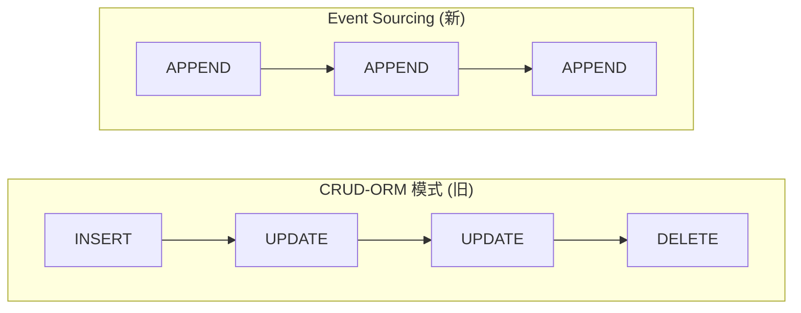

CRUD 模式下，一行记录可以被 INSERT、UPDATE、DELETE，状态随时间变化。你无法从最终的行数据恢复历史过程。Event Sourcing 模式下，每条记录只追加一次，从不修改或删除。每一条 `ActivityEvent` 都是一次真实观测。duration 从相邻事件的 `timestamp_utc` 之差精确计算，不再依赖配置值。

### 2.1.3 append-mostly 与 heartbeat 合并

严格不可变的"纯追加"模型对桌面监控场景并不友好——用户在同一个应用里工作 30 分钟，纯追加模式会产生约 360 条 tick 记录，99% 的信息是冗余的（`app_name` 没变过）。

**妥协方案** —— **append-mostly**（ADR-001）：

- **常规行为**: 仅追加写入，从不修改历史事件。
- **唯一例外**: **heartbeat 合并**。当用户在 `pulsetime_s` 窗口内（默认 10 秒）未切换应用时，新 tick 不会插入新行，而是**原子性地将当前行的 `duration_s` 加上 tick 间隔**。

这个妥协将 90%+ 的磁盘写入压缩为单行 UPDATE，同时保留了"原始 tick 可以精确恢复"的信息完整性。详见 §2.4.2 的代码实现。

---

## 2.2 完整数据流

### 2.2.1 从采集到展示

#### 图2: 从采集到展示的完整数据流

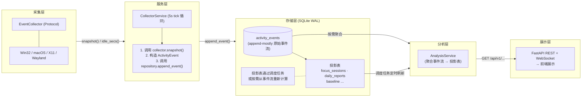

**数据流说明**：采集层每 5 秒生成一次窗口快照，经过 `CollectorService` 封装为 `ActivityEvent` 后写入 `activity_events` 表。这张表是所有分析的基础——**FocusSession**、**DailyReport**、**BaselineModel** 等投影表都是从原始事件流计算出来的。计算可以按调度任务（每天定时）或按需（用户手动刷新）触发。原始事件流始终完整保留，投影表随时可以重新计算，所以历史数据的精度不会因为分析策略的调整而丢失。

### 2.2.2 采集器内部时序

#### 图3: 采集器时序交互

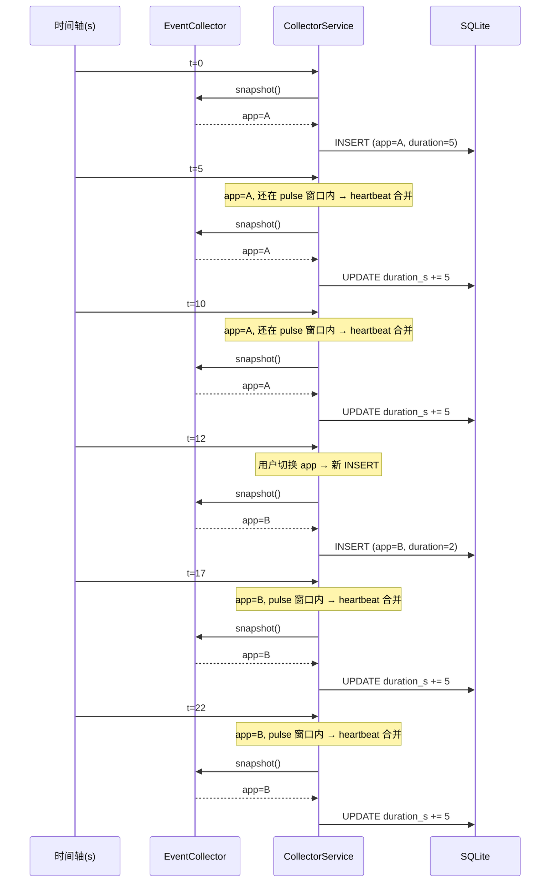

关键观察：
- 第 5 秒和第 10 秒：app_name 没变，时间差小于 10 秒 → 只 UPDATE 上一行的 `duration_s`，不 INSERT。
- 第 12 秒：用户切换 app → 新 INSERT。注意 `duration=2`，这是距离上一个 tick（第 10 秒）的实际时间差。
- 第 17 秒和第 22 秒：新 app 持续，仍在 pulse 窗口内 → heartbeat 合并继续生效。

---

## 2.3 SQLite 7 张表 Schema

> 所有时间戳存储格式为 **ISO8601 带时区的 UTC 字符串**（例如 `"2026-07-18T14:30:05.123456+00:00"`）。废弃了旧代码的 naive datetime（无时区信息的时间戳）策略（P0 技术债 #3）。

7 张表分为 1 张事件流核心表和 6 张投影表。先看核心表。

### 2.3.1 事件流核心表

```sql
-- activity_events: 事件流主干，append-mostly
CREATE TABLE activity_events (
    id TEXT PRIMARY KEY,                -- UUIDv7（时间排序，改善 B-tree 局部性）
    user_id INTEGER NOT NULL,
    timestamp TEXT NOT NULL,            -- ISO8601 UTC 带时区
    duration_s REAL NOT NULL DEFAULT 0.0, -- 距上一个事件的实测间隔
    data_json TEXT NOT NULL,            -- {"app_name":"...","window_title":"...","is_idle":false,...}
    event_type TEXT NOT NULL DEFAULT 'window_snapshot',
        -- 取值: window_snapshot | idle_change | manual_tag
    created_at TEXT NOT NULL DEFAULT (strftime('%Y-%m-%dT%H:%M:%SZ','now'))
);
CREATE INDEX idx_events_user_time ON activity_events(user_id, timestamp);
CREATE INDEX idx_events_type ON activity_events(user_id, event_type, timestamp);
```

`activity_events` 表设计要点：
- `id` 使用 **UUIDv7**（而非自增整数或 UUIDv4），因为 UUIDv7 按时间排序，写入时能利用 SQLite B-tree 的局部性原理（相邻数据在磁盘上相近），减少页分裂。相比之下，UUIDv4 的随机性会导致大量随机 I/O，写入性能下降。
- `data_json` 存储 JSON 字符串而非平铺列，因为事件类型扩展时平铺列需要改表结构（ALTER TABLE），而 JSON 字段只是换一个数据结构的事。
- 两个索引分别覆盖"按用户+时间查询"和"按用户+类型+时间查询"这两类最频繁的查询模式。

### 2.3.2 6 张投影表（从事件流计算得到）

投影表是从原始事件流通过聚合计算得到的分析产物。它们不接收原始写入，而是由调度任务或按需触发重新计算。这种架构保证了**原始数据不丢失，计算结果可追溯**。

```sql
-- focus_sessions: 专注会话（调度任务每天 23:59 生成，也可按需触发）
CREATE TABLE focus_sessions (
    id TEXT PRIMARY KEY,
    user_id INTEGER NOT NULL,
    date TEXT NOT NULL,                 -- YYYY-MM-DD
    start_time TEXT NOT NULL,
    end_time TEXT NOT NULL,
    session_type TEXT NOT NULL,         -- focus | distraction | neutral
    dominant_app TEXT,
    focus_score REAL,
    switch_count INTEGER,
    created_at TEXT NOT NULL DEFAULT (strftime('%Y-%m-%dT%H:%M:%SZ','now'))
);
CREATE INDEX idx_sessions_user_date ON focus_sessions(user_id, date);
```

```sql
-- daily_reports: 日报（幂等——每日只计算一次，UNIQUE 约束防止重复）
CREATE TABLE daily_reports (
    id TEXT PRIMARY KEY,
    user_id INTEGER NOT NULL,
    date TEXT NOT NULL,
    total_focus_min REAL DEFAULT 0,
    total_distraction_min REAL DEFAULT 0,
    focus_score REAL DEFAULT 0,
    top_apps_json TEXT,                 -- [{"app":"code","minutes":120},...]
    switch_frequency REAL DEFAULT 0,    -- 平均每小时切换次数
    pattern_summary TEXT,               -- 自然语言摘要
    created_at TEXT NOT NULL DEFAULT (strftime('%Y-%m-%dT%H:%M:%SZ','now')),
    UNIQUE(user_id, date)
);
```

**DailyReport 的幂等性**：`UNIQUE(user_id, date)` 保证每天每用户只有一条日报。如果重复调用生成逻辑，第二次会因为唯一约束失败而跳过。这避免了因调度器重复触发而生成重复数据。

```sql
-- procrastination_analyses: LLM 归因分析（幂等，每日期望 0-1 条）
CREATE TABLE procrastination_analyses (
    id TEXT PRIMARY KEY,
    user_id INTEGER NOT NULL,
    date TEXT NOT NULL,
    procrastination_types_json TEXT,    -- ["impulsivity","emotional_regulation"]
    type_confidence_json TEXT,          -- {"impulsivity":0.82,"emotional_regulation":0.67}
    cognitive_distortions_json TEXT,
    cbt_technique TEXT,
    response_text TEXT,
    llm_model TEXT,                     -- 使用的模型名称
    llm_cost_usd REAL,                  -- 单次调用的美元成本
    created_at TEXT NOT NULL DEFAULT (strftime('%Y-%m-%dT%H:%M:%SZ','now')),
    UNIQUE(user_id, date)
);
```

`procrastination_analyses` 记录了 LLM 对用户一天行为的归因分析结果。`llm_cost_usd` 字段用于监控 API 费用——如果三层降级链在实际使用中大多落到 L2 或 L3，用户可以据此决定是否值得使用 L1 的付费 API。

```sql
-- intervention_logs: 干预推送日志
CREATE TABLE intervention_logs (
    id TEXT PRIMARY KEY,
    user_id INTEGER NOT NULL,
    triggered_at TEXT NOT NULL,
    intervention_type TEXT NOT NULL,    -- task_breakdown | nudge | environment_optimization | smart_prioritization
    cbt_technique TEXT,
    context_json TEXT,                  -- 触发时的行为摘要
    user_response TEXT,                 -- accepted | ignored | dismissed
    response_latency_s REAL,
    created_at TEXT NOT NULL DEFAULT (strftime('%Y-%m-%dT%H:%M:%SZ','now'))
);
```

```sql
-- baseline_models: 个人基线模型（Welford 在线统计，JSON 大对象）
CREATE TABLE baseline_models (
    id TEXT PRIMARY KEY,
    user_id INTEGER NOT NULL UNIQUE,
    model_json TEXT NOT NULL,           -- Welford 统计值序列化 JSON
    training_events_count INTEGER DEFAULT 0,
    created_at TEXT NOT NULL DEFAULT (strftime('%Y-%m-%dT%H:%M:%SZ','now')),
    updated_at TEXT NOT NULL DEFAULT (strftime('%Y-%m-%dT%H:%M:%SZ','now'))
);
```

```sql
-- user_preferences: 用户偏好（Key-Value JSON）
CREATE TABLE user_preferences (
    id TEXT PRIMARY KEY,
    user_id INTEGER NOT NULL UNIQUE,
    preferences_json TEXT NOT NULL DEFAULT '{}',
    updated_at TEXT NOT NULL DEFAULT (strftime('%Y-%m-%dT%H:%M:%SZ','now'))
);
```

### 2.3.3 投影聚合策略

不同投影表有不同的触发方式和聚合逻辑，下表总结：

| 投影表 | 触发方式 | 聚合逻辑 |
|--------|----------|----------|
| FocusSession | 调度任务（每天 23:59）或按需 | 扫描 `activity_events BETWEEN start AND end`，窗口会话聚合，专注块分隔阈值可配置 |
| DailyReport | 调度任务（每天 00:01）或按需，幂等检查 | 聚合当天 FocusSession + ActivityEvent 统计 |
| BaselineModel | 每日增量更新 + 事件后缓冲更新 | **Welford 在线算法**，避免全量重新计算 |
| ProcrastinationAnalysis | LLM 归因调用后写入 | 写入一次，幂等性靠 `UNIQUE(user_id, date)` |
| InterventionLog | 每次干预推送时写入 | 追加日志，不覆盖 |
| EventCleanup | 调度任务（每天 03:00） | `DELETE FROM activity_events WHERE timestamp < now - 30d`，分批 10,000 行/事务 |

---

## 2.4 六段关键代码

### 2.4.1 ActivityEvent frozen dataclass

事件流的基本单元。**frozen=True** 保证运行时不可变——一旦创建，字段值不再改变。

`backend-next/src/mindflow/domain/events.py`

```python
@dataclass(frozen=True)
class WindowSnapshot:
    """A point-in-time observation of the active desktop window."""
    app_name: str
    window_title: str
    process_name: str
    is_idle: bool
    timestamp_utc: datetime

    def __post_init__(self) -> None:
        _check_aware(self.timestamp_utc, "WindowSnapshot.timestamp_utc")

    def to_dict(self) -> dict[str, Any]:
        return {
            "app_name": self.app_name,
            "window_title": self.window_title,
            "process_name": self.process_name,
            "is_idle": self.is_idle,
            "timestamp_utc": self.timestamp_utc.isoformat(),
        }

@dataclass(frozen=True)
class ActivityEvent:
    """An immutable activity event in the append-mostly event stream."""
    id: str               # UUIDv7, 时间排序
    user_id: int
    timestamp_utc: datetime
    duration_s: float     # 距上一个事件的实测秒数
    event_type: EventType # window_snapshot | idle_change | manual_tag
    data: WindowSnapshot  # 嵌套的不可变快照

    def __post_init__(self) -> None:
        _check_aware(self.timestamp_utc, "ActivityEvent.timestamp_utc")
        if self.event_type not in _VALID_EVENT_TYPES:
            raise ValueError(...)
```

**设计要点**：

- `frozen=True` 是 Python dataclass（数据类）层面的不可变保证，阻止运行时意外的字段修改。这对应 Event Sourcing 的不可变语义——事件一旦产生就不该被改变。
- `__post_init__` 中验证时区感知——所有 `datetime` 必须 `tzinfo is not None`。这是对旧代码 naive datetime 问题的彻底修复（之前因为没有时区信息，跨时区数据分析出现错误）。
- `to_dict`/`from_dict` 提供 JSON 安全的序列化，`datetime` 到 ISO8601 字符串的转换集中在这两个方法里，确保序列化格式一致。
- `WindowSnapshot` 被嵌套为 `ActivityEvent.data`，而不是平铺在表的各列中。这样当新增 `event_type` 时（比如将来加一个 `screen_capture` 类型），新的数据类型只需要新增一个 dataclass，不需要改表结构。

### 2.4.2 Heartbeat 合并 SQL UPDATE

这是 append-mostly 模型中唯一的 UPDATE 点，也是压缩 90%+ 写入量的关键。

`backend-next/src/mindflow/infrastructure/repositories/activity.py` (第 83-114 行)

```python
async def append_event(self, event: ActivityEvent) -> None:
    """Persist an activity event with heartbeat merge."""
    async with self._session_factory() as session, session.begin():
        last = await self._last_window_snapshot(session, event.user_id)

        if last is not None and self._should_merge(last, event):
            await session.execute(
                sa.update(activity_events)
                .where(activity_events.c.id == last.id)
                .values(
                    duration_s=activity_events.c.duration_s + event.duration_s
                )
            )
            return

        await session.execute(
            activity_events.insert().values(
                id=event.id,
                user_id=event.user_id,
                timestamp=event.timestamp_utc.isoformat(),
                duration_s=event.duration_s,
                data_json=json.dumps(event.data.to_dict()),
                event_type=event.event_type,
            )
        )
```

合并条件由 `_should_merge` 决定（第 196-223 行）：

```python
def _should_merge(self, last_row: sa.Row[Any], event: ActivityEvent) -> bool:
    """合并条件（全部满足）："""
    if event.event_type != "window_snapshot":
        return False           # idle/manual 不合并
    if last_app != event.data.app_name:
        return False           # 不同 app 不合并
    diff = (event.timestamp_utc - last_ts).total_seconds()
    return diff < self._pulsetime_s  # 超过时间窗口不合并（默认 10s）
```

**Heartbeat 合并解析**：

- `duration_s = activity_events.c.duration_s + event.duration_s` 是 **SQL 级的原子加法**——在数据库层面累加，没有"读→改→写"的竞争窗口。如果多个协程同时尝试合并同一行，数据库的事务隔离会保证正确性。
- 整个操作在**同一个事务**内：先查后写，如果合并则跳过 INSERT，保证并发安全。事务要么全部成功，要么全部回滚，不会出现"查到了但还没来得及写，被另一个协程插队"的情况。
- 合并只发生在最近一条 `window_snapshot` 上，历史行从未被修改——这也正是"append-mostly"而非"append-only"的精确含义。
- 三个条件必须全部满足才能合并：事件类型必须是 `window_snapshot`（空闲/手动标签事件不合并）、app 必须与上一行相同（切换应用不合并）、时间差必须在 pulse 窗口内（默认 10 秒）。

### 2.4.3 EventCollector Protocol 定义

跨平台采集的统一接口，使用 Python **Protocol**（协议类）而非 ABC 实现结构性类型检查。

`backend-next/src/mindflow/infrastructure/collectors/base.py` (第 34-73 行)

```python
@runtime_checkable
class EventCollector(Protocol):
    """Protocol for platform-specific active-window collectors."""

    async def snapshot(self) -> WindowSnapshot:
        """Capture the current active-window state.
        On transient failure returns degraded snapshot
        (app_name="unknown") with a logged warning.
        """
        ...

    async def idle_seconds(self) -> float:
        """Return seconds since last user input.
        Returns 0.0 when idle detection is unavailable or fails.
        """
        ...

def create_collector(platform: str | None = None) -> EventCollector:
    """Factory: return the appropriate EventCollector for platform."""
    if platform == "win32":
        return Win32Collector()
    if platform == "darwin":
        return DarwinCollector()
    if platform == "linux":
        xdg_session = os.environ.get("XDG_SESSION_TYPE", "").lower()
        if xdg_session == "wayland":
            return WaylandFallbackCollector()
        return X11Collector()
    raise CollectorUnavailableError(f"No collector available for: {platform!r}")
```

**为什么用 Protocol 而非 ABC**：`Protocol` 的好处是**结构性子类型**——只要一个类有 `async def snapshot(self) -> WindowSnapshot` 和 `async def idle_seconds(self) -> float`，在类型系统层面它就自动是 `EventCollector`，无需显式继承。这对测试 mock（你不需要继承 `EventCollector`，只要签名匹配就行）和添加新平台（写一个新类，Protocol 自动识别）都更灵活。`ABC` 需要 `class MyCollector(EventCollector)` 的显式继承声明，增加了不必要的耦合。

- `@runtime_checkable` 允许 `isinstance(collector, EventCollector)` 在运行时工作。
- 工厂函数 `create_collector` 隐藏了平台检测逻辑：调用方只需 `create_collector()`，不需要显式写 if-else 分支。
- 每种平台实现都限制在 200 行以内（ADR-002），避免单个文件过于庞大。

### 2.4.4 Win32 采集器核心

Windows 平台的具体实现，使用 Win32 API 获取前台窗口和空闲时间。

`backend-next/src/mindflow/infrastructure/collectors/win32.py` (第 34-117 行)

```python
class Win32Collector:
    """Windows active-window collector using native Win32 APIs."""

    def __init__(self) -> None:
        if sys.platform != "win32":
            raise CollectorUnavailableError("Win32Collector requires Windows")
        try:
            import psutil
            import win32gui
            import win32process
        except ImportError as exc:
            raise CollectorUnavailableError(
                "Win32Collector requires pywin32 and psutil"
            ) from exc

    async def snapshot(self) -> WindowSnapshot:
        """Capture active window via Win32 APIs (runs in thread)."""
        try:
            return await asyncio.to_thread(self._snapshot_sync)
        except Exception:
            logger.warning("Win32 snapshot failed", exc_info=True)
            return degraded_snapshot()

    def _snapshot_sync(self) -> WindowSnapshot:
        """Synchronous Win32 window capture — runs in a thread."""
        import win32gui, win32process, psutil as _psutil

        hwnd = win32gui.GetForegroundWindow()
        window_title = win32gui.GetWindowText(hwnd) or ""
        _, pid = win32process.GetWindowThreadProcessId(hwnd)

        try:
            proc = _psutil.Process(pid)
            process_name = proc.name() or "unknown"
        except (_psutil.NoSuchProcess, _psutil.AccessDenied):
            process_name = "unknown"

        return WindowSnapshot(
            app_name=process_name,
            window_title=window_title,
            process_name=process_name,
            is_idle=False,
            timestamp_utc=datetime.now(UTC),
        )

    async def idle_seconds(self) -> float:
        """Return idle seconds via GetLastInputInfo (runs in thread)."""
        try:
            return await asyncio.to_thread(self._idle_seconds_sync)
        except Exception:
            logger.warning("Win32 idle detection failed", exc_info=True)
            return 0.0
```

**Win32 采集器设计要点**：

- 所有阻塞 Win32 调用通过 `asyncio.to_thread` 在**线程池**中执行，不阻塞 asyncio 事件循环。这是 ADR-007 的核心要求——采集 tick 不应当让整个 API 服务器卡住。
- 构造函数在调用点（而非导入时）检测依赖——`pywin32` 或 `psutil` 缺失时抛出 `CollectorUnavailableError`，但不会在导入 `collectors/` 模块时爆炸。这意味着在 macOS 上构造 `Win32Collector()` 才会失败，而导入包含 `Win32Collector` 的模块不会。
- **降级策略**：`snapshot()` 或 `idle_seconds()` 的任何异常都被捕获、记录日志，并返回"安全值"（`app_name="unknown"` 的快照或 `0.0` 空闲秒数）。采集器永不崩溃。如果依赖出了问题，你得到的是降级数据，不是进程崩溃。
- `_LastInputInfoStruct` 使用 `ctypes` 访问 Windows `GetLastInputInfo` API，其中有 `uint wraparound` 保护——`GetTickCount` 每约 49.7 天归零，代码处理了这个边界情况。

### 2.4.5 CollectorService tick 循环 + sentinel stop

采集循环的业务逻辑：组合 collector + repository，按固定间隔轮询。

`backend-next/src/mindflow/services/collector_service.py` (第 39-201 行)

```python
class CollectorService:
    """Background collector service — polls the active window on a tick."""

    def __init__(self, collector: EventCollector, repository: ActivityRepository,
                 user_id: int = 1, interval_s: float | None = None,
                 idle_threshold_s: int = 60) -> None:
        self._collector = collector
        self._repository = repository
        self._user_id = user_id
        self._interval_s = interval_s or float(get_settings().collect_interval_s)
        self._idle_threshold_s = idle_threshold_s
        self._task: asyncio.Task[None] | None = None
        self._status: str = "stopped"
        self._stop_requested: bool = False
        self._consecutive_failures: int = 0

    async def start(self) -> None:
        """Start the collection loop (idempotent)."""
        if self._task is not None:
            return
        self._status = "running"
        self._stop_requested = False
        self._consecutive_failures = 0
        self._task = asyncio.create_task(self._run())

    async def stop(self) -> None:
        """Stop gracefully: sentinel flag + timeout cancel fallback."""
        if self._task is None:
            return
        self._status = "stopping"
        self._stop_requested = True
        try:
            await asyncio.wait_for(self._task, timeout=self._interval_s * 2)
        except TimeoutError:
            logger.warning("CollectorService stop timeout — cancelling task")
            self._task.cancel()
            with contextlib.suppress(asyncio.CancelledError):
                await self._task
        self._task = None
        self._status = "stopped"

    async def _run(self) -> None:
        """Main loop: runs until stop_requested or 10 consecutive failures."""
        while not self._stop_requested:
            tick_start = datetime.now(UTC)
            try:
                await asyncio.wait_for(self._tick(), timeout=self._interval_s * 2)
                self._consecutive_failures = 0
            except (TimeoutError, Exception):
                self._consecutive_failures += 1
                if self._consecutive_failures >= 10:
                    self._status = "degraded"
                    break
            elapsed = (datetime.now(UTC) - tick_start).total_seconds()
            await asyncio.sleep(max(0.0, self._interval_s - elapsed))

    async def _tick(self) -> None:
        """Execute a single collection tick."""
        now = datetime.now(UTC)
        actual_duration = ((now - self._last_tick_time).total_seconds()
                           if self._last_tick_time else float(self._interval_s))
        self._last_tick_time = now

        snapshot = await self._collector.snapshot()
        idle_secs = await self._collector.idle_seconds()
        is_idle = idle_secs >= self._idle_threshold_s
        event_type: EventType = "idle_change" if is_idle else "window_snapshot"

        event = ActivityEvent(
            id=new_id(), user_id=self._user_id, timestamp_utc=now,
            duration_s=actual_duration, event_type=event_type,
            data=WindowSnapshot(
                app_name=snapshot.app_name, window_title=snapshot.window_title,
                process_name=snapshot.process_name, is_idle=is_idle,
                timestamp_utc=now,
            ),
        )
        await self._repository.append_event(event)
```

**CollectorService 设计解析**：

- `stop()` 使用 **sentinel 模式**（哨兵标志模式）：设置 `_stop_requested = True`，等待当前 tick 自然结束，超时后备 `task.cancel()`。这保证正在写入的事件被持久化后才关闭（对应 P1-1 需求）。相对于强制取消，这种"请求停止→等待完成→超时强杀"的三段式更加安全。
- 单 tick 失败不会杀死循环；**连续 10 次失败**才将状态转为 `degraded`（防止瞬时错误误停）。这避免了因一次网络抖动或系统负载尖峰就停止采集。
- `_tick()` 中的 `actual_duration` 使用**实际测量值**而非配置值——这正是解决旧代码 P0 缺陷的关键改动。
- tick 间隔通过 `max(0.0, self._interval_s - elapsed)` 补偿：如果某个 tick 耗时 2 秒，下次 sleep 只等 3 秒，维持 5 秒的平均间隔。不补偿的话，总体采样频率会低于配置值，长期累积产生系统性的 duration 低估。
- `asyncio.wait_for` 保护：单个 tick 超过 `interval_s * 2` 自动超时，防止挂死的采集器阻塞循环。

### 2.4.6 WAL PRAGMA 数据库配置

SQLite **WAL 模式**（Write-Ahead Logging，预写式日志）的配置通过 SQLAlchemy `event.listen` 绑定到每个新连接。

`backend-next/src/mindflow/infrastructure/database.py` (第 32-71 行)

```python
def _set_wal_pragmas(dbapi_connection: Any, _connection_record: Any) -> None:
    """Configure SQLite WAL-mode PRAGMAs on new connection (NF-P4)."""
    cursor = dbapi_connection.cursor()
    cursor.execute("PRAGMA journal_mode=WAL")           # 并发读写
    cursor.execute("PRAGMA synchronous=NORMAL")          # 平衡安全与性能
    cursor.execute("PRAGMA busy_timeout=5000")           # 忙等 5s 而非报错
    cursor.execute("PRAGMA journal_size_limit=67108864") # WAL 文件上限 64MB
    cursor.execute("PRAGMA foreign_keys=ON")             # 外键约束
    cursor.close()

def create_engine(db_url: str, **kwargs: Any) -> AsyncEngine:
    """Create a configured AsyncEngine for SQLite WAL."""
    engine = create_async_engine(
        db_url,
        echo=False,
        connect_args={"check_same_thread": False} if "sqlite" in db_url else {},
        **kwargs,
    )
    if "sqlite" in db_url:
        event.listen(engine.sync_engine, "connect", _set_wal_prgmas)
    return engine
```

**WAL 配置解析**：

- `event.listen(engine.sync_engine, "connect", _set_wal_pragmas)` 是**事件监听器**，不是简单函数调用——每次新数据库连接建立时自动调用，调用方不需要手动处理。如果你忘记调用，SQLite 会使用默认的 journal 模式（DELETE），那会严重影响并发性能。
- 每个 PRAGMA 有明确的角色：
  - `journal_mode=WAL`：允许并发读取 + 一个写入器，写入器不阻塞读取器。
  - `synchronous=NORMAL`：在 checkpoint 时同步 WAL 文件，比 FULL 快约 2 倍，与 WAL 组合时安全级别等价于旧模式的 FULL。
  - `busy_timeout=5000`：等待 5 秒而不是立即返回 `SQLITE_BUSY`——这对 5 秒采集 tick 特别重要，采集器不会因为短暂锁冲突而丢失 tick。
  - `journal_size_limit=67108864`：WAL 文件不无限增长，超过 64 MB 时自动 checkpoint 压缩。

此外，`integrity_check()`（同文件第 90-124 行）在启动时运行，失败后自动尝试 `VACUUM` 恢复，最终失败则记录日志但允许继续启动——这是 NF-R5 的容错设计。

---

## 2.5 跨平台采集协议

### 2.5.1 协议定义回顾

`EventCollector` 协议只有两个方法：

```python
class EventCollector(Protocol):
    async def snapshot(self) -> WindowSnapshot: ...
    async def idle_seconds(self) -> float: ...
```

任何类满足这个签名即可作为采集器使用。目前有 4 个实现：

| 平台 | 实现类 | 依赖 | 窗口获取方式 | 空闲检测方式 |
|------|--------|------|--------------|--------------|
| Windows | `Win32Collector` | pywin32, psutil | `win32gui.GetForegroundWindow()` | `GetLastInputInfo` (ctypes) |
| macOS | `DarwinCollector` | PyObjC | `NSWorkspace.sharedWorkspace().activeApplication` | `CGEventSourceSecondsSinceLastEventType` |
| Linux X11 | `X11Collector` | python-xlib | EWMH `_NET_ACTIVE_WINDOW` 属性 | 扩展空闲检测或 fallback |
| Linux Wayland | `WaylandFallbackCollector` | psutil（降级） | 仅进程名，无窗口标题 | 回退到进程级统计 |

### 2.5.2 降级契约

无论哪个平台，以下规则对所有实现强制执行：

1. **构造时不 raise**（除了 `CollectorUnavailableError`，只在依赖缺失时抛出）。
2. **`snapshot()` 永不 raise**——失败时返回 `app_name="unknown"` 的降级快照并记录日志。
3. **`idle_seconds()` 永不 raise**——失败时返回 `0.0`。
4. **阻塞调用通过 `asyncio.to_thread` 委托**到线程池，不阻塞事件循环。

这四条规则构成了采集器的**可靠性契约**：调用方不需要 try/except 包裹每一次采集调用，也不需要关心底层平台是哪个。如果出现异常，返回降级数据而不是传播异常。

### 2.5.3 工厂函数

`create_collector(platform=None)` 处理所有平台路由逻辑。调用方只需：

```python
collector = create_collector()  # 自动检测当前平台
service = CollectorService(collector=collector, repository=repo)
await service.start()
```

---

## 2.6 与第 1 章和第 3 章的衔接

### 与第 1 章的关系

第 1 章介绍了四层架构（api → services → domain ← infrastructure）。本章的每个组件明确属于某一层：

#### 图4: 组件层归属

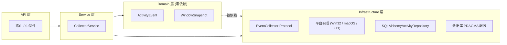

| 组件 | 层 | 依赖方向 |
|------|----|----------|
| `ActivityEvent`, `WindowSnapshot` | Domain | 零依赖（纯 Python） |
| `CollectorService` | Application/Service | 依赖 Domain + Infrastructure |
| `EventCollector` Protocol + 平台实现 | Infrastructure | 依赖 Domain（WindowSnapshot） |
| `SQLAlchemyActivityRepository` | Infrastructure | 依赖 Domain + SQLAlchemy |
| 数据库 PRAGMA 配置 | Infrastructure | 依赖 SQLAlchemy aiosqlite |

Domain 层的 Event/WindowSnapshot 被 Infrastructure 层引用，而 Service 层编排两者——这正是第 1 章"依赖方向"规则的具体实例。

### 与第 3 章的关系

#### 图5: ML 引擎与事件流的关系

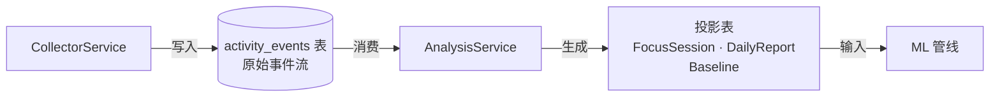

第 3 章的 ML 引擎消费的是**事件流**，而不是直接读写采集数据。具体来说：

- ML 引擎的 **BaselineModel**（Welford 在线算法）在每次新事件到来后增量更新。
- **DeviationDetector** 在单个时间段内扫描事件流计算 z-score（标准化偏离分数）。
- **FocusSession** 识别扫描 `activity_events` 按时间窗口聚合。

第 3 章将详细展示这些投影是如何从原始事件流计算得到的。

---

## 2.7 小结

| 概念 | 一句话 |
|------|--------|
| **Event Sourcing** | 不可变事件流，duration 按实际时间差计算，而非配置值估算 |
| **append-mostly** | 常规只追加，唯一例外是同应用 pulse 窗口内的 heartbeat UPDATE |
| **heartbeat 合并** | SQL 级原子累加，减少 90%+ 磁盘写入 |
| **EventCollector Protocol** | 两个方法、四个平台实现，降级永不崩溃 |
| **WAL 模式** | SQLite 高性能并发所需：WAL + NORMAL + busy_timeout + journal_size_limit |
| **6 张投影表** | 从原始事件流按需/定时计算的分析结果，始终可追溯 |

下一章将深入 ML 引擎如何消费这个事件流，从专注分数计算到偏离检测到行为聚类。
# 第3章 ML 行为分析引擎

> 本章覆盖：BaselineModel（Welford 在线算法）、DeviationDetector（多维 Z-score）、
> ConsensusLabeler（弱监督 6 信号投票）、ProcrastinationType（TMT 规则引擎）、
> 合成数据生成、模型训练管线、EvidenceBundle 组装。
>
> **前置阅读**：第2章（消费事件流）；**后续衔接**：第4章（LLM 管线消费证据）。

---

## 3.1 设计思路：ML 的三重角色

MindFlow 的 ML 层不只是一个"训练模型→部署→预测"管线。它在系统中承担三重角色：

1. **证据供给者** — 将原始事件流转化为结构化证据，供 LLM 专家面板消费。
2. **辩论裁判** — 当 LLM 专家意见冲突时（参见第4章 critic 评审），ML 层提供的基线偏差和置信度分数是仲裁依据。
3. **廉价前哨** — 在 LLM API 不可用或预算超限时，规则引擎以零成本提供兜底分析。

这些角色对应三条能力链，共同构成完整的 ML 流水线：

#### 图 3-1: ML 流水线总览

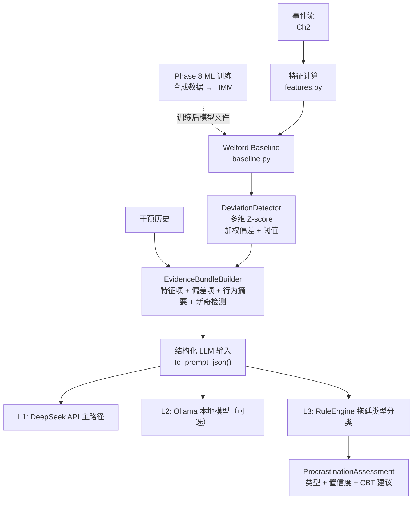

**本章焦点**：上图虚线框内的**证据供给链**——从特征计算到 EvidenceBundle 组装的完整路径。LLM 降级链（L3）在本章介绍，L1/L2 留待第4章。

---

## 3.2 Welford 在线基线（BaselineModel）

### 为什么需要在线算法？

用户的行为基线随时间漂移。今天"专注"的值可能和一个月前不同。Welford 在线算法允许**增量更新均值和方差**，无需保留全部历史数据——每接收一个新样本，只需 O(1) 的更新操作即可修正统计量。

**file:** `domain/baseline.py`

```python
# 核心：Welford 在线均值和二阶矩更新  [baseline.py:98-103]
prev = bucket[col]
prev["n"] += 1.0
delta = val_f - prev["mean"]
prev["mean"] += delta / prev["n"]
delta2 = val_f - prev["mean"]
prev["M2"] += delta * delta2
```

用人话说就是：Welford 算法每次只记三个数——样本数 `n`、当前均值 `mean`、以及一个叫 `M2` 的累积量。新数据来了，均值微调一步，`M2` 也更新一步。这样不管数据量多大，存储开销都是 O(1)，不用像传统方法那样存全部历史再重新算。

**解析：** 这是 Welford 算法的标准实现。与传统公式不同，这里不需要同时保留旧均值和新均值——`delta` 用更新**前**的均值，`delta2` 用更新**后**的均值，`M2` 累积二阶中心矩。在 `get_stats()` 中，方差通过 `M2 / (n - 1)` 计算，即样本方差的无偏估计。

#### 图 3-2: Welford 在线算法更新流程

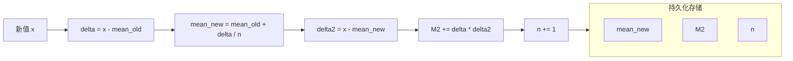

这张图展示了一次完整更新：新数据到达后，先用旧均值算第一个差值 `delta`，更新均值，再用新均值算第二个差值 `delta2`，最后用两个差值的乘积更新 `M2`。

### 24x7 时段桶结构

基线按小时和星期分桶存储，形成 168 个独立统计窗口。这样做的理由是：**用户在工作日上午 10 点和周末晚上 10 点的行为模式不可比**。如果把不同时段的数据混在一起算基线，会得到一个"高不成低不就"的平均值，对任何时段都不准确。

```python
# 48 行三维嵌套字典：stats[hour][dow][feature]  [baseline.py:51-64]
self._stats: dict[int, dict[int, dict[str, dict[str, float]]]] = {}

def _init_buckets(self) -> None:
    for hour in range(24):
        self._stats[hour] = {}
        self._top_apps[hour] = {}
        for dow in range(7):
            self._stats[hour][dow] = {}
            self._top_apps[hour][dow] = {}
```

用人话说就是：系统在内存里维护了一张 24x7 的表，每个格子存一组特征统计（均值、方差、样本数）。这样当你问"周三上午十点的专注分数正常吗"时，系统能精确地跟"周三上午十点的历史数据"对比，而不是跟"所有时间段的平均"对比。

**解析：** `_stats` 是一个四层嵌套字典：小时(0-23) → 星期(0-6) → 特征名 → 统计量 `{n, mean, M2}`。这种结构直接对应 SQL 中的 `GROUP BY hour_of_day, day_of_week`，但纯内存操作避免了每秒更新带来的数据库写放大。

当 `get_stats(hour, dow)` 返回一个桶的统计时，`DeviationDetector` 可以 O(1) 地查找当前时段的基线均值与标准差。

### 数据充分性检查

```python
# 检查整体和分桶的数据量  [baseline.py:151-179]
def has_sufficient_data(self, min_samples: int = 30) -> bool:
    total = self.total_samples()
    return total >= min_samples

def has_bucket_sufficient_data(self, hour: int, dow: int, min_samples: int = 2) -> bool:
    bucket = self._stats.get(hour, {}).get(dow, {})
    if not bucket:
        return False
    return all(int(s.get("n", 0)) >= min_samples for s in bucket.values())
```

用人话说就是：系统不会在新用户刚用 5 分钟就下结论说"你偏离了基线"——先问两个问题：一是总体上你有 30 个样本吗（约 1-2 天活动量）？二是当前这个时段你有至少 2 个样本吗？两个都满足，偏差检测才算数。这就是"等数据够了再说"的设计思路。

**解析：** 两层检查：整体 `has_sufficient_data()` 确保用户至少积累了 30 个样本（约 1-2 天的活动量），然后 `has_bucket_sufficient_data()` 检查当前时段桶是否有至少 2 个样本。两个检查都通过，偏差检测才有统计意义。

---

## 3.3 多维 Z-score 偏差检测

### 加权偏差分数

`DeviationDetector` 将当前时间窗口的每个特征值与基线对比，计算加权 Z-score。权重不是平均分配的——行为特征（切换频率、应用数量）比标题特征（基于窗口标题推断的内容类型）权重更高，原因是标题分析依赖采集器是否捕获到了窗口标题文本，可靠性不如行为特征。

```python
# 特征权重表与 Z-score 阈值  [deviation.py:26-44]
FEATURE_WEIGHTS: dict[str, float] = {
    "switch_frequency": 0.20,
    "unique_app_count": 0.15,
    "max_app_duration": 0.10,
    "idle_ratio": 0.10,
    "productivity_ratio": 0.05,
    "entertainment_ratio": 0.05,
    "social_ratio": 0.05,
    "title_code_ratio": 0.05,
    "title_doc_ratio": 0.05,
    "title_url_ratio": 0.05,
    "title_meeting_ratio": 0.05,
    "title_entertainment_ratio": 0.10,
}

MILD_THRESHOLD = 1.5     # 明显但常见
MODERATE_THRESHOLD = 2.5 # 明显异常
SEVERE_THRESHOLD = 4.0   # 极端异常
```

看懂权重分配的关键：`switch_frequency`（切换频率）权重最高（0.20），因为它是专注力的核心指标——频繁切换应用通常是分心的信号。标题特征的累计权重有 0.45，但每项不超过 0.10，即使标题检测暂时缺失（比如采集器没捕获到窗口标题），单个特征的缺失不会大幅影响总分。三个阈值 1.5 / 2.5 / 4.0 分别对应**轻微偏离** / **中度异常** / **严重异常**三级告警。

**解析：** `switch_frequency` 权重 0.20（最高），"切换频率"是 MindFlow 判断专注力的核心指标。`unique_app_count` 次之（0.15）。标题特征的累积权重为 0.45，但每一项不高于 0.10，以降低标题检测缺失时的影响。

### Z-score 计算

```python
# 核心 Z-score 与加权和  [deviation.py:66-86]
for feature, weight in self.FEATURE_WEIGHTS.items():
    val_raw = row.get(feature)
    if val_raw is None:
        continue
    val = float(val_raw)
    stats = bucket_stats.get(feature, {"n": 0.0, "mean": 0.0, "std": 0.0})
    n = int(stats["n"])
    if n < 2 or stats["std"] == 0.0:
        z = 0.0       # 数据不足或零标准差 → 不贡献偏差
    else:
        z = (val - stats["mean"]) / max(stats["std"], 0.001)
    z = max(min(z, 10.0), -10.0)  # 截断到 [-10, 10]
    z_scores[feature] = round(z, 3)
    weighted_sum += weight * abs(z)
    total_weight += weight

overall = round(weighted_sum / max(total_weight, 0.001), 3)
```

用人话说就是：对每个特征算一个"偏离了多少个标准差"（Z-score），然后把所有特征的 Z-score 按权重加起来。如果某个特征的数据不足（样本数 < 2 或标准差为 0），Z-score 取 0，相当于它不参与打分。每个特征的 Z-score 被限制在 [-10, 10] 之间，防止一个特征的极端异常把总分拉得太离谱。

**解析：** 每个特征计算 Z = (观测值 - 均值) / 标准差。当标准差为 0 或样本不足时，Z 取 0（不贡献偏差）。Z 值被截断到 [-10, 10] 防止某个特征的极端异常污染整体分数。最终偏差分数是所有特征 `weight * |Z|` 之和的加权平均——这实际上是向量范数的变形。

---

## 3.4 6 信号 Consensus Labeler

### 弱监督替代人工标注

MindFlow 没有人工标注数据。`ConsensusLabeler` 实现了多信号弱监督（weak supervision with multiple labeling functions），用 6 个独立的启发式信号投票决定一个时间窗口是"专注"(1)还是"分心"(0)，每个信号附带置信度。

用人话说就是：不靠人工打标签，而是让 6 个"小侦探"各自提供线索——有的看切换频率，有的看应用类型，有的看时间段。每个侦探投票时还会附上一句"我有 x% 的把握"。最后综合所有侦探的意见得出结论。

```python
# 6 信号投票与加权共识  [labeling.py:165-211]
class ConsensusLabeler:
    def __init__(self, signals=None):
        if signals is not None:
            self.signals = list(signals)
        else:
            self.signals = [
                ProductivitySignal(),
                SwitchFrequencySignal(),
                TimeContextSignal(),
                ApplicationDiversitySignal(),
                EntertainmentDominanceSignal(),
                TitleBasedSignal(),
            ]

    def label_single(self, row: Mapping[str, Any]) -> tuple[int, float]:
        votes: list[tuple[int, float]] = [s(row) for s in self.signals]

        focus_weight = 0.0
        dist_weight = 0.0
        for vote, confidence in votes:
            if vote == 1:
                focus_weight += confidence
            else:
                dist_weight += confidence

        total_weight = focus_weight + dist_weight
        if total_weight == 0:
            return 1, 0.0

        label = 1 if focus_weight >= dist_weight else 0
        majority_weight = max(focus_weight, dist_weight)
        weighted_agreement = majority_weight / total_weight
        confidence = max(0.0, (weighted_agreement - 0.5) * 2.0)

        return label, round(confidence, 4)
```

用人话说就是：6 个信号各自投一票（"专注"或"分心"）并附带一个置信度（0 到 1 之间的数）。系统把"专注"方的置信度加起来，再把"分心"方的加起来。比如专注方得到 2.1，分心方得到 1.2，那"专注"以 2.1 比 1.2 胜出。然后看共识程度：如果两方力量很接近（比如 1.7 vs 1.6），置信度就低，说明"这个标签其实比较勉强"。

**解析：** 6 个信号各自独立投票 `(vote, confidence)`，然后加总"专注"和"分心"两方的置信度加权和。置信度 = `(多数派权重 / 总权重 - 0.5) * 2`，在 [0, 1] 区间——这是"共识程度"的标准化度量。当三方投专注（置信度 0.7, 0.6, 0.8）而另三方投分心（0.3, 0.4, 0.5），`focus_weight = 2.1`，`dist_weight = 1.2`，结果 Label=1，置信度 = `(2.1/3.3 - 0.5)*2 = 0.27`——清晰揭示了这个标签其实是弱共识。

#### 图 3-3: 6 信号共识投票流程

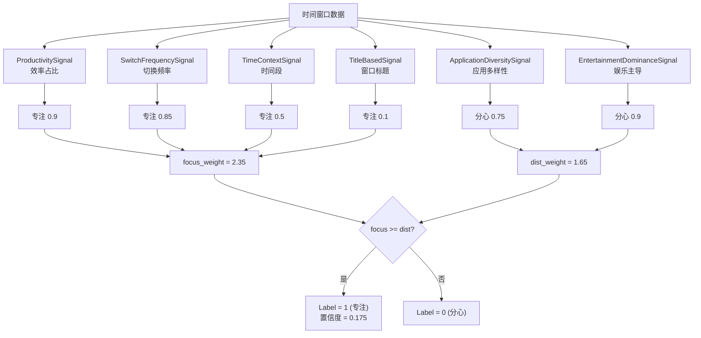

### 6 个信号的构成

每个信号基于不同的行为维度，设计为相互独立的启发式：

| 信号 | 专注触发条件 | 分心触发条件 | 最高置信度 |
|------|-------------|-------------|-----------|
| `ProductivitySignal` | productivity_ratio > 0.8 **且** switch_freq < 10 | productivity_ratio < 0.2 | 0.9 |
| `SwitchFrequencySignal` | switch_freq < 5 | switch_freq > 40 | 0.85 |
| `TimeContextSignal` | 9-12am 或 2-5pm 工作日 | 0-2am 或 10-11pm | 0.5 |
| `ApplicationDiversitySignal` | unique_apps <= 2 | unique_apps >= 6 | 0.75 |
| `EntertainmentDominanceSignal` | 娱乐和社会占比均 < 0.05 | 任一 > 0.5 | 0.9 |
| `TitleBasedSignal` | code + doc 比例 > 0.5 | 娱乐标题 > 0.3 | 0.85 |

`TitleBasedSignal` 在标题数据缺失时返回 `(1, 0.1)`——即投"专注"一分但置信度极低，相当于**弃权**，不显著影响总体结果。

---

## 3.5 专注分数与特征计算

### 专注分数公式

`focus_score` 是 [0, 100] 的连续值，由两个因子组成：

**公式：**
```
focus_score = top_app_ratio x W_top + (1 - switch_penalty) x W_switch
```

其中 `W_top = 60`，`W_switch = 40`（总和恒为 100）。

用人话说就是：专注分数看两件事——你是不是长时间待在一个应用里（top_app_ratio），以及你切换应用的频率高不高（switch_penalty）。第一项占 60 分，第二项占 40 分。如果你 80% 的时间都在同一个应用且很少切换，分数就接近 100；如果你每 2 分钟切一次应用，分数就很低。

```python
# 专注分数核心计算  [features.py:185-230]
def focus_score(events: list[ActivityEvent], weights=None) -> float:
    w = weights if weights is not None else DEFAULT_FOCUS_WEIGHTS
    top_app_weight = w.get("top_app_weight", 60.0)
    switch_weight = w.get("switch_weight", 40.0)

    active = _non_idle_events(events)
    if len(active) < MIN_ACTIVITY_THRESHOLD:  # 至少 10 个非空闲事件
        return 0.0

    # App durations
    app_durations: dict[str, float] = {}
    for ev in active:
        app_durations[ev.data.process_name] = (
            app_durations.get(ev.data.process_name, 0.0) + ev.duration_s
        )
    if not app_durations:
        return 0.0

    total_duration = sum(app_durations.values())
    top_app_ratio = max(app_durations.values()) / total_duration if total_duration > 0 else 0.0

    switch_freq = switch_rate_per_hour(active)
    switch_penalty = min(switch_freq / MAX_ACCEPTABLE_SWITCHES_PER_HOUR, 1.0)

    raw_score = (top_app_ratio * top_app_weight) + ((1.0 - switch_penalty) * switch_weight)
    return round(min(max(raw_score, 0.0), 100.0), 1)
```

**解析：** `top_app_ratio` 表示最常用应用的占比——如果在 30 分钟内 80% 的时间都在同一应用，这是一个强烈的专注信号。`switch_penalty` 是切换频率相对于 `MAX_ACCEPTABLE_SWITCHES_PER_HOUR = 30` 的比例，封顶为 1.0（即切换频率 >= 30 次/时时惩罚满分）。60:40 的权重意味着专注分数更依赖于"是否停留在单一应用"而非"切换频率"，这反映了知识工作的常见模式：长时间留在同一个编辑器或浏览器标签页内工作。

### 切换频率

```python
# 每小时切换次数  [features.py:257-282]
def switch_rate_per_hour(events: list[ActivityEvent]) -> float:
    active = _non_idle_events(events)
    if len(active) < MIN_SWITCH_SAMPLES:  # 少于 2 个事件 → 0
        return 0.0

    switches = 0
    prev_proc = active[0].data.process_name
    for ev in active[1:]:
        if ev.data.process_name != prev_proc:
            switches += 1
        prev_proc = ev.data.process_name

    first_ts = active[0].timestamp_utc
    last_ts = active[-1].timestamp_utc
    total_hours = (last_ts - first_ts).total_seconds() / 3600.0
    if total_hours <= 0:
        return 0.0

    return switches / total_hours
```

**解析：** 统计窗口内 process_name 的变化次数，除以窗口持续时间（小时）。只有非空闲事件参与计算。注意这里统计的是**应用切换**而非标签页切换——同一个浏览器但切换标签页不会触发 process_name 变化，这是有意为之：应用级切换比标签页切换更能反映上下文切换的认知成本。

---

## 3.6 拖延类型规则引擎（TMT）

### TMT 理论基础

拖延类型的分类基于**时间动机理论**（Temporal Motivation Theory, Steel 2007）和 Rozental & Carlbring (2014) 的五类型分类法。

**TMT 核心公式：**
```
Motivation = (E x V) / (I x D)
```

其中 E = 期望（完成任务的信心），V = 价值（任务奖励），I = 冲动性（分心倾向），D = 延迟（距截止日期的时间）。

用人话说就是：你的动力来自"这事能成"的信心乘以"这事值多少"，再除以"你有多容易分心"乘以"截止日期还早着呢"的乘积。每一项出问题，都会导致不同类型的拖延。

五个类型分别对应 TMT 公式中不同变量的异常：

```mermaid
mindmap
  TMT 拖延类型
    (E×V)/I
     (I×D)
    任务畏惧型
      特征: V↓ + E↓
      "太难/太无聊"
      行为: 低专注比, 频繁推迟
      检验: 兜底规则(非其他类型)
    冲动分心型
      特征: I↑
      "停不下来"
      行为: 切换>12次/h, 最长专注块<5min
      检验: focus_block<300s AND switch_rate≥12
    决策困难型
      特征: D↑
      "不敢开始"
      行为: 启动延迟>30min, 启动后恢复
      检验: delay>30min AND focus_ratio≥0.4
    完美主义型
      特征: E↓
      "不够好不如不做"
      行为: 关键词"自嘲/重来"
      检验: keyword_flags含self_criticism/redo_pattern
    情绪调节型
      特征: V波动
      "用娱乐逃避"
      行为: 社交媒体>55%
      检验: social_media_ratio≥0.55
```

### RuleEngine.assess

规则引擎是 LLM 降级链的 L3 兜底层。它接收 `BehaviorSummary` 作为输入，输出与 LLM 版本完全一致的 `ProcrastinationAssessment`，标注 `source="rule_engine"` 以区分来源。

```python
# 规则引擎核心入口  [procrastination.py:157-202]
def assess(self, summary: BehaviorSummary) -> ProcrastinationAssessment:
    confidences: dict[ProcrastinationType, float] = {}

    self._check_impulsivity(summary, confidences)
    self._check_decisional(summary, confidences)
    self._check_perfectionism(summary, confidences)
    self._check_emotional_regulation(summary, confidences)

    if not confidences:
        self._fill_catch_all(summary, confidences)

    top_types = tuple(sorted(confidences, key=lambda t: confidences[t], reverse=True)[:3])
    top_type = top_types[0]
    top_confidence = confidences[top_type]

    if top_confidence < self.NO_SIGNIFICANT_THRESHOLD:  # 0.2
        rationale = "未检测到显著的拖延模式，指标总体正常。"
        technique: CBTTechnique | None = None
    else:
        rationale = self._build_rationale(top_types, confidences)
        technique = TYPE_TO_TECHNIQUES[top_type][0]

    return ProcrastinationAssessment(
        types=top_types,
        confidence={t: confidences[t] for t in top_types},
        recommended_technique=technique,
        rationale=rationale,
        source="rule_engine",
    )
```

用人话说就是：规则引擎跑 4 个检查——你是冲动分心型吗？是决策困难型吗？是完美主义型吗？是情绪调节型吗？如果都不沾（`confidences` 为空），走兜底规则。然后按置信度排序，取 Top 3 类型。如果最可能的类型置信度低于 0.2，系统认为"没有显著拖延模式"；否则就用最高的那个类型推荐对应的 CBT 技术。

**解析：** 4 个私有方法各自检查一种类型的触发条件，向 `confidences` 字典添加置信度分数。如果没有任何类型触发，调用 `_fill_catch_all` 做兜底——当专注率极低时判定为"任务畏惧型"，否则返回一个低置信度（0.15）的"冲动分心型"作为 `NO_SIGNIFICANT` 信号。Top-3 类型按置信度降序排列，最高置信度的类型决定推荐 CBT 技术。

### 阈值设计（含 TMT 依据）

```python
# 构造函数中的默认阈值  [procrastination.py:133-151]
def __init__(
    self,
    impulsivity_min_switches: float = 12.0,
    impulsivity_max_focus_block_s: float = 300.0,
    decisional_min_delay_min: float = 30.0,
    decisional_min_focus_ratio: float = 0.4,
    perfectionism_keywords: frozenset = frozenset({"self_criticism", "redo_pattern"}),
    emotional_regulation_min_ratio: float = 0.55,
    task_aversion_max_focus_ratio: float = 0.35,
    task_aversion_min_deviation: float = -0.5,
) -> None:
```

用人话说就是：所有这些阈值都来自需求文档中描述的行为模式，并且通过构造函数参数暴露——开发者不用改代码就能调整阈值（无痛调参）。下表说明每个阈值的含义和来源。

**解析：** 所有阈值都来源于需求文档（03-requirements.md sec 3.4）的 TMT 行为表现描述，以构造函数参数形式暴露以便未来校准（无痛调参，无需修改规则代码）：

| 阈值 | 值 | TMT 依据 |
|------|:--:|---------|
| `impulsivity_min_switches` | 12 次/时 | 注意力切换频率超过 TMT 冲动性阈值 |
| `impulsivity_max_focus_block_s` | 300s (5min) | 低于 5 分钟的专注块意味着无法维持深度工作 |
| `decisional_min_delay_min` | 30min | 启动延迟超过 30 分钟是决策困难的标志 |
| `emotional_regulation_min_ratio` | 0.55 | 社交媒体占比过半意味着用娱乐调节情绪 |
| `task_aversion_max_focus_ratio` | 0.35 | 专注率低于 35% 且无其他类型匹配 -> 任务畏惧 |
| `NO_SIGNIFICANT_THRESHOLD` | 0.2 | 任何类型置信度 < 0.2 视为"无显著模式" |

### 置信度映射

每个类型检查的置信度通过 `_linear_confidence` 计算，将连续指标线性映射到 [0.5, 0.95] 区间：

```python
# 线性置信度映射  [procrastination.py:332-350]
@staticmethod
def _linear_confidence(value: float, threshold: float, saturation: float) -> float:
    if value >= saturation:
        return 0.95
    effective = max(value, threshold)
    return 0.5 + (effective - threshold) / (saturation - threshold) * 0.45
```

用人话说就是：观测值刚到阈值时给 0.5（"勉强触发"），达到饱和值时给 0.95（"高度确认"），中间线性增长。比如对于冲动分心类型，切换频率 12 次/时（阈值）-> 置信度 0.5，24 次/时（饱和值）-> 置信度 0.95。这避免了"大于某个数就触发、小于就不触发"的硬边界——切换频率从 11.9 变成 12.0 不会突然从"没触发"跳成"完全触发"。

**解析：** 当观测值等于阈值时，置信度为 0.5（勉强触发）；达到饱和值时置信度为 0.95（高置信度触发）。例如冲动分心的 `_linear_confidence(switches, 12, 24)`：切换频率 12 次/时 -> 0.5 置信度，24 次/时 -> 0.95 置信度。这种线性映射避免了硬阈值分类带来的边界抖动问题。

---

## 3.7 HMM 状态推断

### 降级链（hmmlearn -> Markov fallback）

`BehaviorHMM` 使用 hmmlearn 的 `CategoricalHMM` 拟合行为状态转移模型。当 hmmlearn 不可用时（import 失败），自动降级为纯 NumPy 实现的 Markov 转移矩阵。

```python
# HMM 降级链核心  [train/models.py:347-394]
def fit(self, sequences: list[npt.NDArray[Any]]) -> BehaviorHMM:
    self.transition_matrix = self._compute_transition_matrix(sequences)

    try:
        import hmmlearn.hmm as hmm

        X, lengths = self._prepare_hmm_data(sequences)
        if X is not None and len(X) >= 10:
            self.model = hmm.CategoricalHMM(
                n_components=self.n_states,
                random_state=42,
                n_iter=100,
                tol=1e-4,
            )
            self.model.fit(X, lengths)
    except ImportError:
        self.model = None    # 降级为纯 Markov 矩阵

    self._is_fitted = True
    return self

def predict_next_state(self, current_state: int) -> dict[str, Any]:
    probs = self._get_transition_probs(current_state)
    next_state = int(np.argmax(probs))
    return {
        "next_state": next_state,
        "probabilities": [round(float(p), 4) for p in probs],
        "next_state_name": self.state_names[next_state],
    }

def _get_transition_probs(self, state: int) -> npt.NDArray[Any]:
    if self.model is not None:
        try:
            transmat = self.model.transmat_
            if 0 <= state < transmat.shape[0]:
                return np.asarray(transmat[state])
        except (AttributeError, IndexError):
            pass

    if self.transition_matrix is not None and 0 <= state < self.n_states:
        return np.asarray(self.transition_matrix[state])  # Markov 降级

    return np.ones(self.n_states) / self.n_states  # 均匀分布兜底
```

用人话说就是：`BehaviorHMM` 有一条三层降级路径——首选 hmmlearn 训练出 HMM 模型，它不依赖（ImportError）则用简单的计频转移矩阵，连矩阵也没有时返回均匀分布（随机猜一个状态，但绝不抛异常）。这是 MindFlow "永远不崩溃"设计哲学的体现。

**解析：** `_compute_transition_matrix` 始终运行，作为 hmmlearn 失败时的兜底路径。`_get_transition_probs` 的三层取值（hmmlearn -> Markov -> 均匀分布）是 MindFlow 优雅降级哲学的体现：每一层都优于后一层，但每一层都保证可用。当 hmmlearn 模型已拟合时，`predict_next_state` 使用 HMM 的 `transmat_` 矩阵提供更精确的状态转移预测；hmmlearn 不可用时，只使用简单的计频转移矩阵；最差情况返回均匀分布（随机猜测——但绝不抛异常）。

5 个状态的定义为：`deep_focus`, `shallow_work`, `browsing`, `procrastination`, `idle`。HMM 通过聚类标签生成的序列进行训练，用户当前的行为序列用于推断最可能的隐藏状态序列。

---

## 3.8 合成数据生成器

### 5 种时段模式

训练管线需要大量标定数据来拟合模型。`generate_synthetic_data` 模拟了 5 种日常行为时段模式，输出兼容 `BaselineModel.update()` 输入格式的事件流。

```python
# 5 种时段模式定义  [train/synthetic_data.py:64-120]
apps_by_pattern: dict[str, dict[str, Any]] = {
    "morning_focus": {
        "apps": ["vscode", "pycharm", "notion", "typora", "terminal"],
        "titles": [
            "main.py - MindFlow",
            "analysis.ipynb - Jupyter",
            "notes - Obsidian",
            "paper_draft.md - Typora",
            "terminal - zsh",
        ],
        "weights": [0.35, 0.25, 0.15, 0.15, 0.10],
    },
    "afternoon_mixed": {
        "apps": ["chrome", "teams", "vscode", "wechat", "excel"],
        "weights": [0.25, 0.20, 0.20, 0.20, 0.15],
    },
    "evening_leisure": {
        "apps": ["bilibili", "youtube", "steam", "wechat", "chrome"],
        "weights": [0.30, 0.20, 0.15, 0.20, 0.15],
    },
    "late_night": {
        "apps": ["bilibili", "douyin", "weibo", "chrome", "wechat"],
        "weights": [0.30, 0.25, 0.15, 0.15, 0.15],
    },
    "early_morning": {
        "apps": ["chrome", "notion", "wechat", "calendar", "mail"],
        "weights": [0.30, 0.25, 0.20, 0.15, 0.10],
    },
}
```

**解析：** 5 种模式覆盖了一个知识工作者的典型工作日：早间（规划/邮件）-> 上午（代码/文档）-> 下午（混合工作）-> 晚间（娱乐）-> 深夜（娱乐主导）。每个模式有对应的应用组合和权重分布，模拟中国应用生态（vscode/pycharm 编程 -> bilibili/douyin 娱乐 -> wechat 社交）。周末模式通过 `_weekend_pattern()` 大幅偏向娱乐。

### 时段选择逻辑

```python
# 工作日时段切换逻辑  [train/synthetic_data.py:186-202]
def _weekday_pattern(hour: int, rng: np.random.Generator) -> str:
    if 0 <= hour < 6:
        return "late_night"
    if 6 <= hour < 9:
        return "early_morning"
    if 9 <= hour < 12:
        return "morning_focus" if rng.random() < 0.85 else "afternoon_mixed"
    if 12 <= hour < 13:
        return "afternoon_mixed" if rng.random() < 0.5 else "evening_leisure"
    if 13 <= hour < 18:
        return "afternoon_mixed" if rng.random() < 0.80 else "morning_focus"
    if 18 <= hour < 19:
        return "afternoon_mixed"
    if 19 <= hour < 22:
        return "evening_leisure" if rng.random() >= 0.10 else "morning_focus"
    return "evening_leisure" if rng.random() < 0.60 else "late_night"
```

用人话说就是：生成的数据不是死板的"9-12 点一定在专注"，而是加入了随机性——上午 9-12 点有 85% 概率在专注工作，15% 概率在摸鱼。中午 12-13 点有一半概率滑向休闲模式。这种带噪声的生成比完全规则化的数据更接近真实的行为分布，训练出的模型在真实数据上表现更好。

**解析：** 随机性被引入以模拟人类行为的不稳定性：上午 9-12 点有 85% 概率保持专注模式，15% 概率"开小差"进入混合模式。中午 12-13 点的午餐时段有一半概率滑向休闲。这种带有可控噪声的生成模式比完全规则化的合成数据更接近真实行为分布，使训练出的模型在真实数据上有更好的泛化能力。

---

## 3.9 版本化模型管理

### ModelManager 与日期标记

旧后端有一个 P1 级别的技术债：模型总是以固定文件名写入，无法回滚。`ModelManager` 通过日期标记文件名和 `latest.json` 指针解决了这个问题。

```python
# 日期标记的模型文件与 latest.json 指针  [train/models.py:637-692]
def save_all(self) -> dict[str, str]:
    tag = self._today_tag  # 例如 "20260717"

    names: dict[str, str] = {
        "clustering": f"clustering-{tag}.pkl",
        "classifier": f"classifier-{tag}.pkl",
        "hmm": f"hmm-{tag}.pkl",
    }

    joblib.dump(self.clustering.to_dict(), str(self.models_dir / names["clustering"]))
    joblib.dump(self.classifier.to_dict(), str(self.models_dir / names["classifier"]))
    joblib.dump(hmm_data, str(self.models_dir / names["hmm"]))

    self._write_latest(names)
    return names

def _write_latest(self, names: dict[str, str]) -> None:
    existing: dict[str, str] = {}
    if self.latest_path.exists():
        with suppress(json.JSONDecodeError, OSError):
            existing = json.loads(self.latest_path.read_text(encoding="utf-8"))
    existing.update(names)
    self.latest_path.write_text(
        json.dumps(existing, indent=2, ensure_ascii=False), encoding="utf-8"
    )

def rollback(self, tag: str) -> bool:
    if not self.load_version(tag):
        return False
    names = {
        "clustering": f"clustering-{tag}.pkl",
        "classifier": f"classifier-{tag}.pkl",
        "hmm": f"hmm-{tag}.pkl",
    }
    self._write_latest(names)
    return True
```

用人话说就是：每天训练产生的模型文件名都带日期（比如 `clustering-20260717.pkl`），`latest.json` 文件记录"当前用的是哪个版本"。想回滚到一周前的版本，只需把 `latest.json` 指向 20260710 的文件名即可。回滚前还会验证那个旧文件还在不在（`load_version`），避免指向一个已删除的文件。

#### 图 3-4: 模型文件版本管理结构

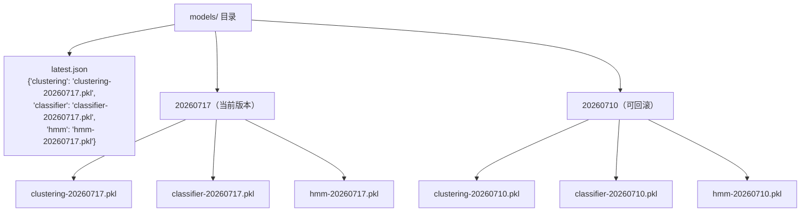

目录结构示意：

```
models/
├── latest.json              # {"clustering": "clustering-20260717.pkl", ...}
├── clustering-20260717.pkl
├── classifier-20260717.pkl
├── hmm-20260717.pkl
├── clustering-20260710.pkl   # 一周前的版本，可回滚
├── classifier-20260710.pkl
└── hmm-20260710.pkl
```

`latest.json` 只更新**当次保存的模型名**，不删除旧的条目——这意味着可以只回滚某个模型而保留其他模型的最新版本。`rollback()` 在变更 `latest.json` 前调用 `load_version()` 验证文件可加载，确保指针不会指向损坏的文件。训练管线集成在 `train_all()` 中，该方法同时训练聚类模型、分类器和 HMM，返回 `TrainingSummary` 包含评估指标。

---

## 3.10 EvidenceBundle 组装

### EvidenceBundleBuilder

这是 ML 层与 LLM 层的接口。它将特征计算、偏差检测、行为摘要、干预历史和新奇检测的**全部 ML 输出**打包为一个 `EvidenceBundle`，供第4章的 LLM 专家面板消费。

```python
# EvidenceBundleBuilder.build() 完整组装流程  [services/evidence_service.py:262-308]
async def build(
    self,
    user_id: int,
    window_start: datetime,
    window_end: datetime,
) -> EvidenceBundle:
    # 1. 查询原始活动事件
    events = await self._activity_repo.query_range(user_id, window_start, window_end)

    # 2. 计算特征并构建证据项
    items: list[EvidenceItem] = []
    items.extend(self._build_feature_items(events))

    # 3. 加载基线（单次 DB 调用，偏差和新奇检测共用）
    baseline = await self._load_baseline(user_id)

    # 4. 运行偏差检测
    items.extend(self._build_deviation_items(baseline, events, window_start))

    # 5. 构建行为摘要
    behavior_summary = build_behavior_summary(events) if events else self._empty_summary()

    # 6. 查询干预历史（最近 7 天）
    interventions = await self._build_intervention_history(user_id, window_end)

    # 7. 检测新奇标志
    novelty_flags = self._detect_novelty(events, baseline)

    return EvidenceBundle(
        user_id=user_id,
        window=(window_start, window_end),
        items=tuple(items),
        behavior_summary=behavior_summary,
        intervention_history=tuple(interventions),
        novelty_flags=tuple(novelty_flags),
    )
```

**解析：** `EvidenceBundle` 是 ML 层的"最终交付物"。它的构成反映了 ML 层的三重角色：

- **证据供给者**：`items` 包含来自 `_build_feature_items()` 的特征证据（focus_score、switch_rate、longest_block、top_apps）和来自 `_build_deviation_items()` 的偏差证据（行为偏离基线的 Z-score 及严重度）。每个 `EvidenceItem` 包含 `severity`（info/mild/moderate/severe）、`confidence`（[0, 1]）和 `human_readable`（中文描述，不含窗口标题，遵守 NF-S3a 隐私规则）。
- **辩论裁判**：`behavior_summary` 提供聚合统计量（持续时间、实际专注时间、上下文切换次数等），偏差项的 `severity` 和 `confidence` 为 LLM 专家意见冲突时提供仲裁依据。
- **廉价前哨**：`novelty_flags` 通过简单的集合差集检测当前 Top-5 应用中是否有基线库中没有出现过的新应用（轻量新奇检测，Phase A）。`intervention_history` 携带近 7 天干预记录及效果评估（G005 学习循环）。

### 特征项与偏差项的子流程

`_build_feature_items` 负责从事件流直接计算统计指标，产生 4 个 `EvidenceItem`：

```python
# 从原始事件计算 4 个特征证据项  [services/evidence_service.py:314-397]
@staticmethod
def _build_feature_items(events: list[ActivityEvent]) -> list[EvidenceItem]:
    items: list[EvidenceItem] = []

    if not events:
        items.append(EvidenceItem(metric="focus_score", value=0.0, baseline=None,
            severity="info", confidence=0.85, source="feature_computation",
            human_readable="窗口内无活动数据"))
        return items

    # focus_score
    score = focus_score(events)          # 专注分数 [0, 100]
    sev = _focus_severity(score)         # ≥70 → info, ≥50 → mild, ≥30 → moderate, else severe
    items.append(...)

    # switch_rate_per_hour
    switch_rate = switch_rate_per_hour(events)  # 每小时切换次数
    sev = _switch_severity(switch_rate)  # ≤15 → info, ≤30 → mild, ≤45 → moderate, else severe
    items.append(...)

    # longest_focus_block_s
    longest_block = longest_focus_block_s(events)  # 最长连续专注块（秒）
    sev = _block_severity(longest_block)  # ≥1200(20min) → info, ... <300 → severe
    items.append(...)

    # top_apps
    ranking = app_usage_ranking(events)
    if ranking:
        top_app_names = ", ".join(a.app_name for a in ranking[:3])
        items.append(EvidenceItem(metric="top_apps", value=top_app_names, ...))

    return items
```

用人话说就是：这个方法从原始事件中计算出 4 个证据项——专注分数（0-100）、每小时应用切换次数、最长连续专注块的时长（秒）、最常用的 3 个应用名称。每个证据项都带一个严重度等级（从 info 到 severe），让 LLM 一眼就能判断"这个问题大不大"。

偏差项的处理（`_build_deviation_items`）更复杂：它依赖 `BaselineModel` 的存在和充分性。当基线尚未建立（`has_sufficient_data() == False`）或当前时段桶数据不足（`has_bucket_sufficient_data() == False`）时，返回 info 级别的说明文本，而不是虚假的偏差分数。这种**诚实降级**是 MindFlow 的一个重要设计原则——不做无法验证的断言。

---

## 3.11 与第2章和第4章的衔接

### 第2章 <-- 本章（消费事件流）

第2章定义的 `ActivityEvent` 事件流是本章所有分析的起点。具体来说：

- `EvidenceBundleBuilder._build_feature_items()` 接收 `list[ActivityEvent]`，调用 `domain/features.py` 中的 `focus_score()`、`switch_rate_per_hour()` 等纯函数计算统计量。
- `BaselineModel.update()` 接收第2章特征提取层产生的 feature dict（含 hour_of_day、day_of_week、各项特征值），增量更新 Welford 统计。
- `DeviationDetector.score_window()` 接收单行 feature dict，与基线对比。

特征提取层（`domain/features.py`）是整个变换的枢纽——它将原始事件流映射为固定维度的特征向量，这些向量同时被基线、偏差检测、弱监督标签使用。

### 本章 --> 第4章（产出证据供 LLM 消费）

本章的最终产出是 `EvidenceBundle`，它包含：

1. **特征证据**（4 项）：focus_score, switch_rate, longest_block, top_apps
2. **偏差证据**（1 项）：behavior_deviation（Z-score + 严重度）
3. **行为摘要**：BehaviorSummary（持续时间、专注时间、切换频率等聚合值）
4. **干预历史**：近 7 天的干预记录（类型、用户回应、效果评估）
5. **新奇标志**：新出现的应用名称列表
6. **拖延类型预测**：通过 `RuleEngine.assess()` 产出的 TMT 5 类型（L3 降级）

第4章的 LLM 管线通过 `to_prompt_json()` 将 `EvidenceBundle` 序列化为 JSON，作为专家面板的上下文输入。critic 评审者通过 `metric_names()` 验证每一条 `[证据: 指标名]` 引用是否存在于实际证据中。

---

## 关键设计决策

| 决策 | 选择 | 替代方案 |
|------|------|---------|
| 基线算法 | Welford 在线（增量更新） | 全量重新计算（O(n) 内存/时间） |
| 偏差检测 | 加权多维 Z-score 累加 | 单变量阈值 / 孤立森林 |
| 标签策略 | 多信号弱监督 Consensus | 人工标注 / 纯规则标签 |
| 拖延分类 | 5 类型 TMT 规则引擎 | 分类器预测 / LLM 全权负责 |
| 模型版本 | 日期标记文件 + latest.json 指针 | 固定文件名覆盖（旧方案，P1 缺陷） |
| 模型降级 | hmmlearn -> Markov -> 均匀分布 | 单一模型强依赖 |
| 新奇检测 | Top-5 应用集合差集（Phase A） | 聚类异常检测（Phase B 预留） |
| 干预效果评估 | `compare_windows()` 前后 30 分钟对比 | 无评估（旧方案，盲干预） |
# 第4章 LLM 归因管线与安全防线

> 本章对应 MindFlow 架构 G003（专家会诊）、G004（对话助手）及 NF-S7 安全合规要求。阅读前建议先理解第3章的 ML 引擎输出（BehaviorSummary 和 EvidenceBundle），因为它们是 LLM 的输入数据。

---

## 4.1 设计思路：为什么需要这么多层？

MindFlow 的 LLM 调用承载了核心认知行为功能——它分析用户的行为数据，输出拖延类型的归因和 CBT 干预建议。如果这里出问题，后果可能是：

- **LLM API 挂了**：用户的分析页面白屏，整个功能不可用
- **LLM 输出禁词**：模型在不该用的地方用了"诊断""治疗"等医疗用语，产生法律风险
- **用户输入了危机信号**：用户自我报告里写了"不想活了"，AI 却按正常流程回了个"建议调低目标"
- **API 被滥用**：就算本地应用，也可能被本地别的进程攻击或误调用

所以我们需要一套**分层防护**体系，每一层管一件事，互不依赖。

### 4.1.1 三层降级链（Degradation Chain）

#### 图 4-1: 三层降级链

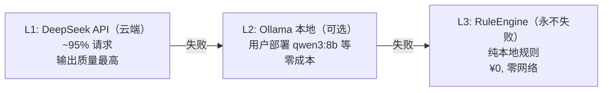

为什么是三层的设计？

- **L1** 覆盖大多数请求，使用云端 DeepSeek Chat 模型，输出质量最高
- **L2** 是"离线备胎"——用户如果部署了 Ollama（比如 qwen3:8b），API 挂了也不用降级到规则引擎
- **L3** 是**永不失败的底线**——RuleEngine 纯本地计算，零网络依赖，零 API Key 要求

关键决策：**降级对用户透明**。降级到 L2 或 L3 时，HTTP 状态码仍然是 200，只是在返回的 meta 里标记 `degraded=true`。用户不需要知道模型换了——如果 L1 都挂了，已经说明用户网络或 API Key 有问题，再报个 500 没有帮助。

### 4.1.2 危机检测前置（Pre-LLM Crisis Gate）

危机检测在**任何 LLM 调用之前**执行：

#### 图 4-2: 危机检测前置流程

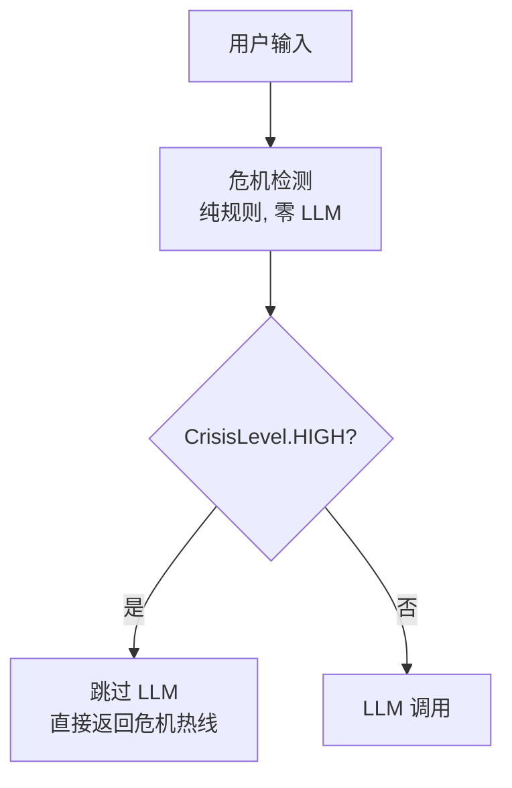

这是 California SB 243 / Illinois HB 1806 等法规要求的"独立于 LLM 的危机检测机制"（NF-S7b）。核心约束：**零 LLM、零网络**，纯本地规则。

### 4.1.3 禁词双保险（NF-S7 Double Check）

即使系统提示词（System Prompt）里写了"不要使用医疗用语"，LLM 仍然有可能输出。所以我们在**代码层面**再加一道拦截：

#### 图 4-3: 禁词双保险

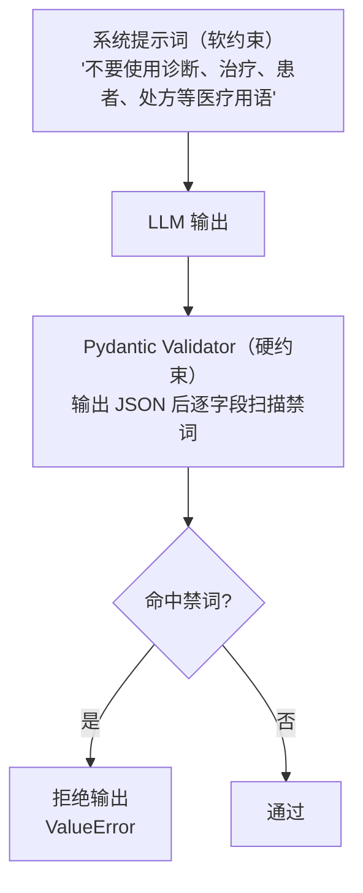

两道保险各自的理由：

| 层 | 为什么不够？ | 第二道怎么补？ |
|------|-------------|---------------|
| 系统提示 | LLM 可能忽略 or 被 prompt injection 覆盖 | Pydantic 校验是代码层，不可绕过 |
| Pydantic 校验 | 不提示模型会有反效果 | 系统提示是第一道，降低禁词出现概率 |

### 4.1.4 网络层安全四件套

即使是纯本地应用，仍然需要防护：

| 层 | 防什么 | 为什么本地也需要？ |
|------|--------|------------------|
| Host 校验 | DNS rebinding | 如果本地有另一个进程做 DNS 欺骗，可能让浏览器访问到你的内部 API |
| Token 认证 | 未经授权的调用 | 前端以 SPA 方式运行，token 隔离前后端 |
| 速率限制 | 滥用/误用 | 前端 bug 可能循环调用 API，把 DeepSeek 额度刷光 |
| 禁词校验 | 输出合规 | 同上，是 NF-S7 的一部分 |

---

## 4.2 安全防线架构图

#### 图 4-4: 安全防线四层堆叠

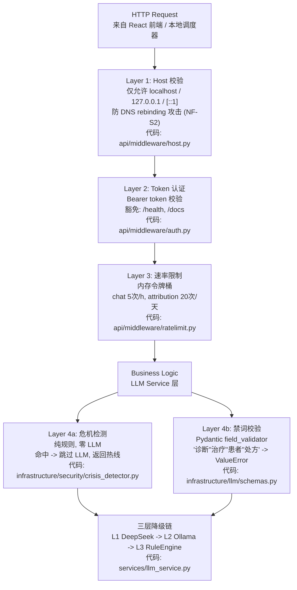

---

## 4.3 代码详解

### 4.3.1 DeepSeek 客户端与 LangChain 网关

MindFlow 经历了从**原始 httpx 客户端**到**LangChain 网关**的迁移。两套代码目前共存，服务于不同的调用方：

- `DeepSeekClient`（原始版）：面向归因管线（LLMService），硬编码输出格式 `LLMAttributionResult`
- `LangChainGateway`（新版）：面向专家会诊面板（PanelOrchestrator），输出原始文本，由调用方自行解析

**原始版：DeepSeekClient**

```python
# mindflow-app/backend-next/src/mindflow/infrastructure/llm/client.py (lines 72-196)

class DeepSeekClient:
    """Async HTTP client for DeepSeek Chat API (OpenAI-compatible)."""

    def __init__(self, settings: LLMSettings) -> None:
        if not settings.api_key:
            raise LLMNotConfiguredError(
                "DeepSeek API key is not configured — set MINDFLOW_LLM__API_KEY "
                "or add llm.api_key to the .env file"
            )

        self._base_url = (settings.base_url or "https://api.deepseek.com").rstrip("/")
        self._model = settings.model or "deepseek-chat"
        self._client = httpx.AsyncClient(
            base_url=self._base_url,
            timeout=httpx.Timeout(_DEFAULT_TIMEOUT_S),
            headers={
                "Authorization": f"Bearer {settings.api_key}",
                "Content-Type": "application/json",
            },
        )

    async def analyze(self, summary_json: str) -> LLMAttributionResult:
        payload = {
            "model": self._model,
            "messages": [
                {"role": "system", "content": _SYSTEM_PROMPT},
                {
                    "role": "user",
                    "content": f"请分析以下行为数据，输出结构化归因结果：\n\n{summary_json}",
                },
            ],
            "response_format": {"type": "json_object"},
        }

        last_exc: Exception | None = None
        for attempt in range(_MAX_RETRIES + 1):
            try:
                response = await self._client.post("/chat/completions", json=payload)
            except httpx.TimeoutException:
                logger.warning("DeepSeek API timeout (attempt {})", attempt + 1)
                last_exc = httpx.TimeoutException("DeepSeek API timed out after 30s")
                continue
            ...
            # 返回时直接通过 Pydantic 校验
            return LLMAttributionResult.model_validate_json(content)
```

这段代码做了几件事：

1. **构造函数检查 API Key**：没有 Key 直接抛异常，不等到调用时再报（fail-fast）
2. **httpx.AsyncClient 连接池**：复用 TCP 连接，减少握手开销
3. **重试逻辑**：只重试网络错误和 5xx——4xx 不重试（比如 401 认证失败，重试也是白费）
4. **response_format=json_object**：告诉 DeepSeek API 输出必须是合法 JSON，减少解析失败概率
5. **Pydantic 严格校验**：返回前调用 `model_validate_json`，校验不通过直接报异常（不降级输出脏数据）

**新版：LangChainGateway**

```python
# mindflow-app/backend-next/src/mindflow/agents/llm_gateway.py (lines 88-229)

class LangChainGateway:
    """Async LLM gateway wrapping LangChain's ``ChatDeepSeek``."""

    def __init__(self, api_key: str | None = None, base_url: str | None = None) -> None:
        # Key-less construction is allowed: the degradation chain must stay
        # reachable even without a configured key.
        self._api_key = api_key or ""
        self._base_url = (base_url or "https://api.deepseek.com").rstrip("/")

    async def complete(
        self,
        system: str,
        user: str,
        model: Literal["chat", "reasoner"] = "chat",
    ) -> str:
        """返回原始文本，由调用方自行解析。"""
        model_id = "deepseek-chat" if model == "chat" else "deepseek-reasoner"

        if not self._api_key:
            raise GatewayNotConfiguredError(
                "DeepSeek API key is not configured..."
            )

        chat = self._get_model(model_id)
        messages = [SystemMessage(content=system), HumanMessage(content=user)]

        for attempt in range(_MAX_RETRIES + 1):
            try:
                result = await chat.ainvoke(messages)
            except Exception as exc:
                logger.warning("LangChain gateway error (attempt {}): {}", attempt + 1, exc)
                last_exc = exc
                continue
            ...
            return content  # 返回原始字符串
```

两个设计差异值得注意：

- **延迟报错**（E2E 教训）：`LangChainGateway` 允许无 Key 构造，调用时才报错。为什么？因为应用启动时需要能正常组装 PanelService，即使 LLM 不可用，降级路径（panel -> single_expert -> rule_engine）也必须可达。如果构造时就报错，整个 Service 都创建不了。
- **协议而非继承**：`PanelLLMGateway` 是一个 `typing.Protocol`，orchestrator 依赖接口而非实现，测试时可以轻松注入 mock。

### 4.3.2 三层降级链

```python
# mindflow-app/backend-next/src/mindflow/services/llm_service.py (lines 206-246)

async def _run_degradation_chain(
    self,
    summary: BehaviorSummary,
    summary_json: str,
) -> tuple[dict[str, Any], SourceType, bool]:
    """Execute L1 -> L2 -> L3, returning (assessment, source, degraded)."""

    # L1: DeepSeek API
    if self._deepseek_client is not None:
        try:
            result = await self._deepseek_client.analyze(summary_json)
            logger.info("L1 (DeepSeek) succeeded")
            return self._llm_result_to_assessment(result), "deepseek", False
        except LLMNotConfiguredError:
            logger.warning(_LLM_NOT_CONFIGURED_HINT)
        except (LLMAPIError, TimeoutError) as exc:
            logger.warning("L1 (DeepSeek) failed: {}. Falling back to L2.", exc)
        except Exception as exc:
            logger.warning("L1 (DeepSeek) unexpected error: {}. Falling back.", exc)
    else:
        logger.debug("DeepSeek client not configured, skipping L1")

    # L2: Ollama local
    if self._ollama_base_url:
        try:
            ollama_result = await self._ollama_call(summary_json)
            if ollama_result is not None:
                logger.info("L2 (Ollama) succeeded")
                return self._llm_result_to_assessment(ollama_result), "ollama", True
        except Exception as exc:
            logger.warning("L2 (Ollama) failed: {}. Falling back to L3.", exc)
    else:
        logger.debug("Ollama not configured, skipping L2")

    # L3: RuleEngine (never fails)
    logger.info("Falling back to L3 (RuleEngine) for attribution")
    assessment = self._rule_engine_to_assessment(self._rule_engine.assess(summary))
    return assessment, "rule_engine", True
```

这段代码体现了降级链的核心设计原则：

- **独立每个层级**：L1 失败了不影响 L2，L2 失败了不影响 L3
- **L3 永不失败**：RuleEngine 纯本地规则，零网络、零配置——即使没有 API Key 也能跑
- **来源追踪**：返回的 `source` 字段告诉调用方"这个结果来自哪一层"，API 响应里会附带 `meta.degraded=true`
- **日志分级**：L1 失败打 WARNING（影响用户体验），L3 降级打 INFO（预期行为，不是异常）

**L3 RuleEngine 的工作原理**（`domain/procrastination.py:109-203`）：

RuleEngine 不需要 LLM，纯靠规则判断拖延类型：

| 拖延类型 | 规则 | 参数来源 |
|---------|------|---------|
| impulsivity | 最长专注块 < 5分钟 + 切换 > 12次/小时 | 03-requirements.md sec 3.4 |
| decisional | 启动延迟 > 30分钟 + 启动后恢复专注 | 同上 |
| perfectionism | 关键词含 self_criticism 或 redo_pattern | 同上 |
| emotional_regulation | 社交媒体占比 > 55% | 同上 |
| task_aversion | 兜底：专注度低但不符合上面任何类型 | 同上 |

### 4.3.3 危机检测器

```python
# mindflow-app/backend-next/src/mindflow/infrastructure/security/crisis_detector.py (lines 30-128)

_CRISIS_KEYWORDS: frozenset[str] = frozenset({
    "自杀",
    "不想活",
    "结束生命",
    "结束自己的生命",
    "伤害自己",
    "自伤",
    "撑不下去",
    "活不下去",
    "不想活了",
    "没有意义",
    "死了算了",
    "想死",
})


class CrisisDetector:
    """Rule-based crisis keyword scanner.
    
    Thread-safe (immutable state after construction).
    """

    def __init__(self, extra_keywords: frozenset[str] | None = None) -> None:
        all_kw = _CRISIS_KEYWORDS
        if extra_keywords:
            all_kw = all_kw | extra_keywords
        self._keywords: frozenset[str] = all_kw

    def scan(self, text: str) -> tuple[CrisisLevel, CrisisResponse | None]:
        if not text or not text.strip():
            return CrisisLevel.NONE, None

        for keyword in self._keywords:
            if keyword in text:          # 子串匹配，O(n) 但 n 很小
                return CrisisLevel.HIGH, CrisisResponse()

        return CrisisLevel.NONE, None
```

用人话说就是：危机检测器就是一个关键词扫描器。检查用户输入的文本是否包含"自杀""不想活"之类的词语，12 个关键词，子串匹配，对性能几乎没有影响。如果命中，就不调用 LLM，直接返回心理援助热线信息。

关键设计决策：

- **纯规则、零 LLM、零网络**：这是法规 NF-S7b 的硬性要求——危机检测必须独立于 LLM，即使 LLM 挂了也不影响检测功能
- **frozenset + 子串匹配**：比正则更便宜，12 个关键词扫一遍对输入文本几乎没有性能影响
- **可扩展**：`extra_keywords` 参数和 `add_keywords()` 方法，允许在应用启动时配置额外关键词
- **CrisisResponse 固定模板**：包含全国心理援助热线号码，确保危机信号触发时用户能得到正确的求助信息

当检测到 HIGH 级别时，`LLMService` 会跳过整个 LLM 调用（`llm_service.py:162-174`）：

```python
if crisis_level == CrisisLevel.HIGH:
    logger.warning("Crisis keywords detected for user {}. Skipping LLM.", user_id)
    return AttributionOutcome(
        assessment={
            "response_text": crisis_response.message if crisis_response else "",
            "next_action": "寻求专业帮助",
        },
        source="rule_engine",
        crisis_detected=True,
    )
```

注意这里 `source="rule_engine"`——危机检测返回的数据也被标记为规则引擎来源，和 L3 降级共享同一个标记。

### 4.3.4 禁词校验 Pydantic Validator

```python
# mindflow-app/backend-next/src/mindflow/infrastructure/llm/schemas.py (lines 42-109)

_FORBIDDEN_WORDS: frozenset[str] = frozenset({
    "诊断",
    "治疗",
    "患者",
    "处方",
})


class LLMAttributionResult(BaseModel):
    """Structured output from the LLM attribution pipeline."""

    procrastination_types: list[PROCRASTINATION_TYPES] = Field(..., min_length=1, max_length=3)
    type_confidence: dict[str, float] = Field(...)
    cognitive_distortions: list[str] = Field(default_factory=list)
    cbt_technique: CBT_TECHNIQUES = Field(...)
    response_text: str = Field(..., max_length=500)
    next_action: str = Field(...)

    @field_validator("response_text", "next_action")
    @classmethod
    def _no_forbidden_words(cls, v: str) -> str:
        """Reject any free-text output containing forbidden medical terminology."""
        for word in _FORBIDDEN_WORDS:
            if word in v:
                msg = f"output contains forbidden word: {word!r} (NF-S7)"
                raise ValueError(msg)
        return v

    @field_validator("cognitive_distortions")
    @classmethod
    def _no_forbidden_words_in_list(cls, v: list[str]) -> list[str]:
        """Apply the NF-S7 forbidden-word check to each list item."""
        for item in v:
            for word in _FORBIDDEN_WORDS:
                if word in item:
                    msg = f"cognitive_distortions contains forbidden word: {word!r} (NF-S7)"
                    raise ValueError(msg)
        return v
```

禁词校验的双层设计：

1. `_no_forbidden_words` 校验器覆盖 `response_text` 和 `next_action` 两个自由文本字段——这是 LLM 最可能输出禁词的地方
2. `_no_forbidden_words_in_list` 额外覆盖 `cognitive_distortions` 列表中的每个元素——因为模型可能在认知扭曲名称里混入禁词（比如"认为自己需要被治疗"）

另外还有两个交叉校验器：

```python
@field_validator("type_confidence")
@classmethod
def _confidence_keys_match_types(cls, v: dict[str, float], info: Any) -> dict[str, float]:
    """Ensure type_confidence keys exactly match procrastination_types."""
    types = info.data.get("procrastination_types", [])
    missing = [t for t in types if t not in v]
    if missing:
        raise ValueError(f"type_confidence missing keys for types: {missing}")
    extra = [k for k in v if k not in types]
    if extra:
        raise ValueError(f"type_confidence has keys for unlisted types: {extra}")
    return v

@field_validator("type_confidence")
@classmethod
def _confidence_in_range(cls, v: dict[str, float]) -> dict[str, float]:
    for key, val in v.items():
        if not 0.0 <= val <= 1.0:
            raise ValueError(f"confidence for {key!r} must be in [0, 1], got {val}")
    return v
```

- `_confidence_keys_match_types`：确保 LLM 输出的置信度字段和拖延类型字段完全一致——类型和置信度对不上，说明 LLM 输出不一致，拒绝
- `_confidence_in_range`：置信度必须在 0-1 之间，越界数据直接拒绝

这些校验和**专家会诊面板**共享同一套禁词集（`agents/types.py:32-37`），确保两种 LLM 调用路径（归因管线 vs 专家面板）的禁词校验完全一致。

### 4.3.5 Token 认证中间件

```python
# mindflow-app/backend-next/src/mindflow/api/middleware/auth.py (lines 22-83)

_EXEMPT_PATHS: frozenset[str] = frozenset({
    "/api/v1/health",
    "/docs",
    "/openapi.json",
    "/redoc",
})


class AuthMiddleware(BaseHTTPMiddleware):
    """Middleware that validates Bearer tokens on protected endpoints."""

    async def dispatch(
        self,
        request: Request,
        call_next: Callable[[Request], Awaitable[Response]],
    ) -> Response:
        path = request.scope["path"]

        _EXEMPT_PREFIXES: tuple[str, ...] = (
            "/api/v1/health",
            "/docs",
            "/openapi.json",
            "/redoc",
        )
        if any(path.startswith(prefix) for prefix in _EXEMPT_PREFIXES):
            return await call_next(request)

        expected_token: str = getattr(request.app.state, "system_token", "")
        auth_header = request.headers.get("Authorization", "")
        if not auth_header.startswith("Bearer "):
            return _auth_required_response(path)

        token = auth_header.removeprefix("Bearer ").strip()
        if not verify_token(token, expected_token):
            return _auth_required_response(path)

        return await call_next(request)
```

设计要点：

- **豁免路径**：健康检查（`/health`）和 API 文档（`/docs`）不需要 token——健康检查用于监控和 Docker 健康检查，文档不需要认证才能提高可用性
- **Bearer 标准**：遵循 HTTP Authorization 标准的 Bearer 方案，前端可以用标准方式发送
- **Token 文件**：token 存储在 `{data_dir}/token` 文件中，首次启动时自动生成
- **401 RFC 9457 格式**：错误响应遵循 Problem Details 标准，方便前端统一解析

#### 图 4-5: Token 认证流程

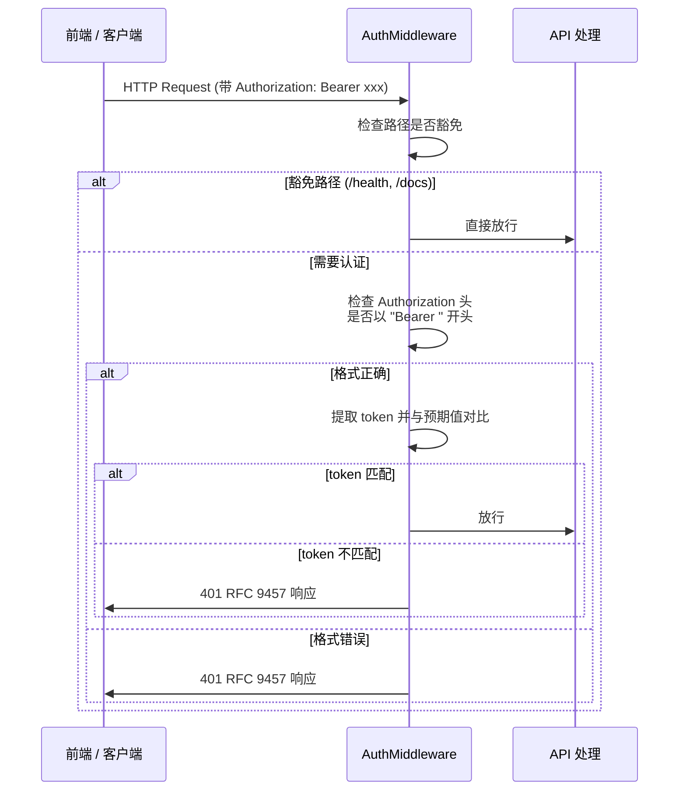

### 4.3.6 Host 校验：防 DNS Rebinding

```python
# mindflow-app/backend-next/src/mindflow/api/middleware/host.py (lines 12-94)

def _parse_host(host_header: str) -> tuple[str, int | None]:
    """Parse a Host header into (hostname, port).
    
    Handles IPv6 [::1]:port syntax.
    """
    host_header = host_header.strip()
    if host_header.startswith("["):
        bracket_end = host_header.find("]")
        if bracket_end == -1:
            return host_header, None
        hostname = host_header[1:bracket_end]
        rest = host_header[bracket_end + 1:]
        if not rest:
            return hostname, None
        if rest.startswith(":"):
            try:
                return hostname, int(rest[1:])
            except ValueError:
                return host_header, None
        # [::1].evil.com — 攻击者可能在 IPv6 字面量后拼接恶意域名
        return host_header, None
    ...


_TRUSTED_HOST_LOWERCASE: set[str] = {"localhost", "127.0.0.1", "::1", "[::1]"}


class HostValidationMiddleware(BaseHTTPMiddleware):
    async def dispatch(self, request: Request, call_next):
        host_header = request.headers.get("host", "")
        if host_header:
            hostname, _port = _parse_host(host_header)
            if hostname.lower() not in _TRUSTED_HOST_LOWERCASE:
                return _forbidden_host_response(str(request.scope["path"]))
        return await call_next(request)
```

代码中 30-47 行的处理逻辑值得注意：注释 `[::1].evil.com` 描述了一个真实的攻击场景。攻击者在 IPv6 字面量 `[::1]` 后面拼接恶意域名，如果不处理这个 case，`[::1]` 部分被正确解析，`.evil.com` 被忽略，那 `evil.com` 的页面就能绕过 host 校验访问到本机 API。代码的处理方式是：发现 `]` 后面还有字符且不是 `:端口` 格式，就把整个 header 当作 hostname 返回，必然不在信任列表里，通过不了校验。

补充攻击示例：

| Host 头 | 结果 |
|---------|------|
| `localhost` | 通过 |
| `127.0.0.1:8765` | 通过 |
| `[::1]:8765` | 通过 |
| `[::1]` | 通过 |
| `[::1].evil.com` | **拒绝**（trailing garbage） |
| `evil.com` | **拒绝** |
| `[::1]:evil` | **拒绝**（非数字端口） |

### 4.3.7 速率限制：令牌桶

```python
# mindflow-app/backend-next/src/mindflow/api/middleware/ratelimit.py (lines 38-206)

class TokenBucket:
    """In-memory token bucket with configurable capacity, refill, and daily cap."""

    def __init__(self, capacity: float, refill_rate: float, daily_hard_limit: int | None = None):
        self._capacity = capacity
        self._refill_rate = refill_rate
        self._daily_hard_limit = daily_hard_limit
        self._tokens = capacity
        self._last_refill = time.time()
        self._day_usage = 0
        self._last_day_check = time.time()
        self._lock = asyncio.Lock()  # 并发安全

    async def consume(self, tokens: float = 1.0) -> tuple[bool, float, float]:
        async with self._lock:
            self._refill()
            if self._daily_hard_limit is not None and self._day_usage >= self._daily_hard_limit:
                return False, 0.0, self._last_refill + 86400
            if self._tokens >= tokens:
                self._tokens -= tokens
                if self._daily_hard_limit is not None:
                    self._day_usage += 1
                return True, self._tokens, self._last_refill + ...
            next_token_time = (tokens - self._tokens) / max(self._refill_rate, 0.001)
            return False, 0.0, self._last_refill + next_token_time


# 默认端点限流配置
_DEFAULT_ENDPOINT_LIMITS: dict[str, TokenBucket] = {
    "/api/v1/chat":           TokenBucket(capacity=5,  refill_rate=1.0/60.0,   daily_hard_limit=60),
    "/api/v1/analytics/attribution": TokenBucket(capacity=5,  refill_rate=1.0/30.0,   daily_hard_limit=20),
    "/api/v1/analytics/train":       TokenBucket(capacity=3,  refill_rate=1.0/60.0,   daily_hard_limit=3),
    "/api/v1/panel/today":    TokenBucket(capacity=1,  refill_rate=1.0/3600.0, daily_hard_limit=3),
    "/api/v1/panel":          TokenBucket(capacity=10, refill_rate=1.0/60.0,   daily_hard_limit=30),
}
```

用人话说就是：这就是一个限流器。每个请求消耗一个 token，token 会按一定速率自动补充。如果 token 用完了，返回 429 让客户端等一会再试。外加一个每日硬上限，防止某天用量爆表（比如把 DeepSeek 的 API 额度刷光）。为什么用内存里的令牌桶而不是 Redis？因为这是单用户的本地应用，Redis 的部署成本远大于收益。

为什么用内存令牌桶而不是 Redis？

> 这是本地桌面应用（sec 4.4），单进程、单用户。Redis 的部署成本 > 收益。`asyncio.Lock()` 保证并发安全，每天重置一次计数器。

端点限流策略：

| 端点 | 速率 | 每天硬上限 | 设计理由 |
|------|------|-----------|---------|
| `/chat` | 5次 + 1次/分钟 | 60次 | 对话交互不能太快 |
| `/attribution` | 5次 + 1次/30秒 | 20次 | 昂贵操作，LLM 调用的主要入口 |
| `/train` | 3次 + 1次/分钟 | 3次 | 训练操作极其昂贵，每天3次足够了 |
| `/panel/today` | 1次 + 1次/小时 | 3次 | 每日面板数据，不需要频繁刷新 |
| `/panel` | 10次 + 1次/分钟 | 30次 | 一般查询，稍微宽松 |

当超过限制时，中间件返回 429 RFC 9457 响应和 `Retry-After` 头。

### 4.3.8 RFC 9457 统一错误处理

```python
# mindflow-app/backend-next/src/mindflow/api/errors.py (lines 15-249)

class ProblemDetail(Exception):
    """An RFC 9457 Problem Details exception that renders as ``problem+json``."""

    def __init__(self, type_slug: str, title: str, status: int, detail: str,
                 instance: str | None = None, extra: dict[str, Any] | None = None) -> None:
        self.type_slug = type_slug
        self.title = title
        self.status = status
        self.detail = detail
        self.instance = instance
        self.extra = extra or {}
        super().__init__(self.detail)

    def to_dict(self, instance: str | None = None) -> dict[str, Any]:
        body: dict[str, Any] = {
            "type": f"{_PROBLEM_BASE_URI}/{self.type_slug}",
            "title": self.title,
            "status": self.status,
            "detail": self.detail,
        }
        resolved_instance = self.instance or instance
        if resolved_instance:
            body["instance"] = resolved_instance
        body.update(self.extra)
        return body


def register_exception_handlers(app: FastAPI) -> None:
    """Register all RFC 9457 exception handlers on the FastAPI app."""
    app.add_exception_handler(ProblemDetail, cast(handler_t, _problem_handler))
    app.add_exception_handler(RequestValidationError, cast(handler_t, _validation_handler))
    app.add_exception_handler(RuntimeError, cast(handler_t, _generic_handler))
    app.add_exception_handler(Exception, cast(handler_t, _generic_handler))
```

错误码清单（8种）：

| type_slug | HTTP | 描述 |
|-----------|------|------|
| `collector-not-running` | 503 | 采集器未启动 |
| `not-found` | 404 | 资源不存在 |
| `validation-error` | 422 | 请求参数验证失败 |
| `rate-limited` | 429 | 速率限制 |
| `auth-required` | 401 | 认证失败 |
| `forbidden-host` | 403 | Host 头不被信任 |
| `internal-error` | 500 | 未捕获异常（不暴露栈信息） |
| `llm-unavailable` | 503 | LLM 服务降级为规则引擎 |

统一响应格式：

```json
{
  "type": "https://mindflow.app/errors/rate-limited",
  "title": "Rate Limited",
  "status": 429,
  "detail": "请求过于频繁，请稍后再试",
  "instance": "/api/v1/analytics/attribution",
  "retry_after_seconds": 45
}
```

设计决策：

- `type` 用英文标识（机器可读），`detail` 用中文（用户可读）
- `type` URI 不是可解析的 URL（sec 4.2），只是唯一标识符
- 500 错误不泄漏栈信息（NF-S4：输出消毒）
- `generic_handler` 同时注册 `RuntimeError` 和 `Exception`——Starlette 的实现使用确切类型查找（`isinstance` 不生效），双重注册保证兜底

---

## 4.4 与第3章和第5章的衔接

### 从第3章来：ML 输出 -> LLM 输入

第3章的 ML 引擎（DeviationDetector + BaselineModel）输出的**不是** LLM 可以消化的格式。两者之间的桥梁是 `EvidenceBundleBuilder`：

#### 图 4-6: ML 引擎到 LLM 输入的数据转换

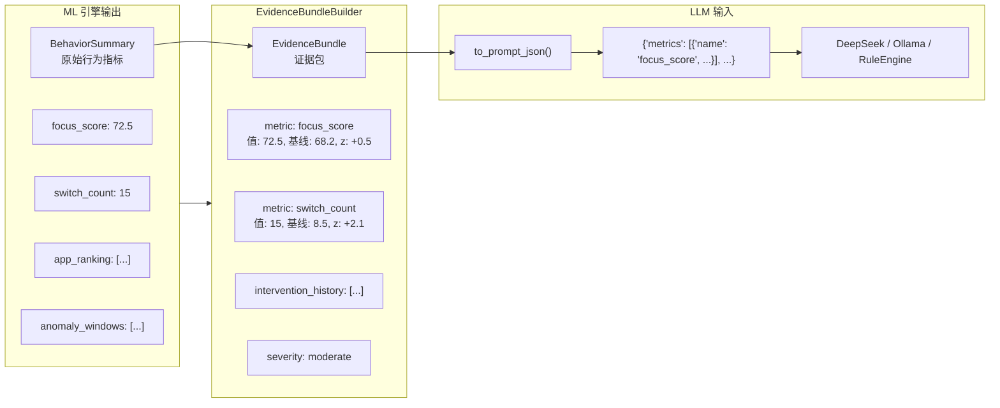

`EvidenceBundle`（`domain/evidence.py`）是这个转换的关键：

- 不包含窗口标题或文件路径（隐私：NF-S3a）
- 每个指标附带基线值和 z-score（让 LLM 理解"偏离程度"）
- 序列化后约 800-1200 token
- `metric_names()` 返回合法的指标名 frozenset，供 critic 做引用校验

### 通向第5章：LLM 被多专家编排调用

第5章的专家会诊面板（PanelOrchestrator）并非直接调用 DeepSeek API，而是通过这里的 `LangChainGateway`：

#### 图 4-7: 第4章与第5章的协作关系

```mermaid
flowchart LR
    subgraph Ch4["第4章 提供"]
        LS["LLMService (单次归因)"]
        DC["DeepSeekClient"]
        CD["CrisisDetector"]
        FW["Forbidden Word Check"]
        DG["三层降级"]
    end

    subgraph Ch5["第5章 使用"]
        PO["PanelOrchestrator (多专家编排)"]
        LG["LangChainGateway (Protocol: PanelLLMGateway)"]
        Experts["分析师 -> 3位归因专家 (并行)"]
        Debate["冲突检测 -> 辩论 -> 主持人 -> 批评家"]
        Fallback["失败时调用 LLMService 降级"]
    end

    Ch4 -->|"single_expert()"| Ch5
    LG --> Experts --> Debate --> Fallback
    Fallback --> DG
```

四层降级链（`agents/types.py:41`，`PanelSource`）：

```mermaid
flowchart LR
    P["panel<br/>专家会诊<br/>6-12次调用"] --> S["single_expert<br/>LLMService<br/>1次 DeepSeek"] --> O["ollama<br/>本地<br/>1次 Ollama"] --> R["rule_engine<br/>规则<br/>永不失败"]
```

当面板编排（第5章）全部失效时，会调用 `LLMService.single_expert()`（第4章），后者有自己的 L2/L3 降级。这保证了**即使 LangChain gateway 挂掉，用户也能获得规则引擎的兜底分析**。

---

## 4.5 总结

| 组件 | 文件 | 功能 | 依赖 |
|------|------|------|------|
| DeepSeek Client | `infrastructure/llm/client.py` | L1 主 LLM 调用 | 网络 + API Key |
| LangChain Gateway | `agents/llm_gateway.py` | L1 新版，供面板使用 | 网络 + API Key |
| 三层降级链 | `services/llm_service.py` | L1->L2->L3 自动降级 | 按层级递减 |
| RuleEngine | `domain/procrastination.py` | L3 规则引擎，永不失败 | 无 |
| CrisisDetector | `infrastructure/security/crisis_detector.py` | 危机检测前置 | 无 |
| 禁词校验 | `infrastructure/llm/schemas.py` | Pydantic NF-S7 双层校验 | Pydantic |
| Token 认证 | `api/middleware/auth.py` | Bearer token 鉴权 | 本地 token 文件 |
| Host 校验 | `api/middleware/host.py` | 防 DNS rebinding | 无 |
| 速率限制 | `api/middleware/ratelimit.py` | 内存令牌桶限流 | asyncio.Lock |
| 错误处理 | `api/errors.py` | RFC 9457 Problem Detail | FastAPI |
| 中间件组装 | `app.py:416-430` | 日志->Host->Auth->RateLimit->CORS | 无 |

**关键数字**：

- 安全防线叠了 **5 层**（Host -> Auth -> RateLimit -> Crisis -> 禁词校验）
- 降级链 **3 层**（DeepSeek -> Ollama -> RuleEngine）
- 错误码 **8 种**（4xx + 5xx）
- 禁词 **4 个**（"诊断""治疗""患者""处方"），由两个 Pydantic validator 在不同字段上独立校验
- 对话限流 **5 次/分钟**，归因限流 **20 次/天**
# 第5章 多专家智能体与 LangChain 迁移

> **核心演进路径:** 单专家 LLM 调用 → 五专家会诊内核 → LangChain/LangGraph 编排迁移

本章覆盖 MindFlow 中最核心的架构升级：从最初的单一 LLM 分析调用，演进到五个领域专家组成的"会诊面板"，再进一步将编排内核迁移至 LangChain 与 LangGraph 框架。读完本章，你将理解：

- 为什么单专家模式不足以应对拖延行为的复杂性
- 五专家面板的设计原则与分工协议
- 两档协议（快速通道 vs 冲突升级）何时触发
- LangGraph StateGraph 如何取代手工 async 编排
- `@tool` 声明如何将后端服务暴露给 LLM agent
- ChatDeepSeek 网关封装的全貌

本章代码全部取自 `backend-next/src/mindflow/` 下的真实源文件，标注了文件路径和行号。

---

## 5.1 从单专家到多专家：设计演进

### 5.1.1 初代方案：单专家分析

在一代架构中，拖延行为分析只有一个 **LLM 调用**：将行为数据拼成 prompt，发给 deepseek-chat，返回一份 JSON 格式的分析结果。伪代码如下：

```python
# 一代架构（已废弃）
async def analyze(user_data: dict) -> dict:
    prompt = build_prompt(user_data)
    response = await deepseek_client.complete(prompt)
    return json.loads(response)
```

这个方案有两个核心缺陷。第一，拖延行为是多因的——一个任务畏惧型拖延者可能同时有情绪调节需求，完美主义者在某些场景下也会表现为冲动分心。单一 LLM 调用只能输出"最可能"的一种归因，无法呈现多种理论视角。第二，没有交叉验证机制——幻觉引用无法被发现，因为没有人检查 LLM 输出的证据是否真的存在。

### 5.1.2 二代方案：五专家面板

为解决上述问题，我们设计了一个**多专家会诊系统**，参见 `07-agent-upgrade-design.md` §4，其核心思想是三个：

1. **分工**: 每个专家只做自己领域的事
2. **互相校验**: 批评家检查引用真实性，冲突检测器发现分歧
3. **综合裁决**: 主持人综合所有意见，给出统一结论

五个专家角色如表5-1所示：

| # | 角色 | 理论框架 | 模型类型 | 职责 |
|---|------|----------|----------|------|
| 1 | 数据分析师 | 行为模式分析 | deepseek-chat | 客观发现模式、标注异常 |
| 2 | CBT 归因专家 | 认知行为理论 | deepseek-chat | 从认知扭曲角度归因 |
| 3 | TMT 归因专家 | 时间动机理论 | deepseek-chat | 从 E·V·I·D 变量归因 |
| 4 | 情绪调节专家 | 情绪调节理论 | deepseek-chat | 从情绪管理角度归因 |
| 5 | 批评家 | 证据校验与逻辑审查 | deepseek-chat | 检查引用真实性、逻辑跳跃、禁词 |
| — | 综合主持人 | 综合裁决 | deepseek-reasoner | 综合所有意见、裁决分歧 |

### 5.1.3 三代方案：LangChain/LangGraph 封装

在多专家面板的基础上，进一步的框架化迁移包括四个方向：

- 将后端服务（证据查询、分析记录、干预历史）声明为 LangChain `@tool`，使 LLM agent 可以在对话中按需调用
- 将面板编排从手工 async 代码迁移到 LangGraph `StateGraph`，获得图拓扑的可读性和条件路由的可靠性
- 将 LLM 调用封装为 `LangChainGateway`，统一管理 `ChatDeepSeek` 实例和重试逻辑
- 对话服务使用 LangChain `create_agent` 构建 tool-calling agent loop

#### 图5-1: 架构演进路线

```mermaid
flowchart LR
    subgraph v0_1["初代 (v0.1-v0.2)"]
        A1["单专家 LLM 调用"] --> A2["规则引擎退化"]
    end
    
    subgraph v0_3["本版 (v0.3)"]
        B1["五专家面板"] <--> B2["LangChain 编排"]
    end
    
    subgraph future["未来 (G005)"]
        C1["学习循环<br>反馈调整权重"] --> C2["流式输出<br>astream()"]
    end
    
    A2 --> B1
    B2 -.-> C1
    
    style v0_1 fill:#e3f2fd,stroke:#1565c0
    style v0_3 fill:#c8e6c9,stroke:#2e7d32
    style future fill:#fff3e0,stroke:#e65100
```

---

## 5.2 证据合同：EvidenceBundle 的构建

在进入五专家面板之前，必须先理解"证据"是什么。**EvidenceBundle**（证据包）是 ML 感知层与 LLM 推理层之间的核心数据契约，定义在 `domain/evidence.py`。它封装了用户在某个时间窗口内的全部行为指标，但**不包含原始事件、不包含窗口标题或文件路径**（隐私约束 NF-S3a）。

### 5.2.1 EvidenceBundle 结构

`domain/evidence.py:90-108`:

```python
@dataclass(frozen=True)
class EvidenceBundle:
    """The complete evidence package presented to the LLM expert panel."""
    user_id: int
    window: tuple[datetime, datetime]
    items: tuple[EvidenceItem, ...]
    behavior_summary: BehaviorSummary
    intervention_history: tuple[InterventionRecord, ...]
    novelty_flags: tuple[str, ...]
```

其中每个 `EvidenceItem`（`domain/evidence.py:52-87`）包含 metric、value、baseline、severity、confidence 等字段，并带有中文的 `human_readable` 描述——这正是五专家面板接收到的证据。整个包是 frozen dataclass，创建后不可修改，保证了数据在跨模块传递过程中的完整性。

### 5.2.2 EvidenceBundleBuilder

构建过程由 `EvidenceBundleBuilder`（`services/evidence_service.py`）完成。这是整个 ML 感知层的主要输出，按顺序执行 7 步：

`services/evidence_service.py:232-308`:

```python
class EvidenceBundleBuilder:
    """Assembles an EvidenceBundle from repositories and domain logic."""

    def __init__(self, activity_repo, intervention_repo, session_factory,
                 effectiveness_service=None):
        self._activity_repo = activity_repo
        self._intervention_repo = intervention_repo
        self._session_factory = session_factory
        self._effectiveness_service = effectiveness_service

    async def build(self, user_id: int,
                    window_start: datetime,
                    window_end: datetime) -> EvidenceBundle:
        # 1. Query raw activity events
        events = await self._activity_repo.query_range(
            user_id, window_start, window_end)

        # 2. Compute features and build evidence items
        items: list[EvidenceItem] = []
        items.extend(self._build_feature_items(events))

        # 3. Load baseline (single DB call, shared by deviation + novelty)
        baseline = await self._load_baseline(user_id)

        # 4. Run deviation detection
        items.extend(self._build_deviation_items(baseline, events, window_start))

        # 5. Build behavior summary
        behavior_summary = build_behavior_summary(events) if events \
            else self._empty_summary()

        # 6. Query intervention history (last 7 days)
        interventions = await self._build_intervention_history(user_id, window_end)

        # 7. Detect novelty flags
        novelty_flags = self._detect_novelty(events, baseline)

        return EvidenceBundle(
            user_id=user_id, window=(window_start, window_end),
            items=tuple(items), behavior_summary=behavior_summary,
            intervention_history=tuple(interventions),
            novelty_flags=tuple(novelty_flags),
        )
```

从第 1 步到第 7 步，`build` 方法将原始活动事件逐步转化为结构化的 `EvidenceBundle`。每个 `_build_*` 方法是独立的静态方法——这种设计使单元测试可以针对单个步骤进行，而不需要搭建完整的仓库基础设施。

**解析:** 关键设计决策是"7 步在同一个方法里"——没有拆成多个 service 的原因是所有步骤共享同一个 `window` 和 `events`，拆开会增加不必要的传参。`items.extend()` 的累加模式使每步可以独立返回 0-N 条证据，互不干扰。

---

## 5.3 五专家面板定义

### 5.3.1 ExpertDef 数据类

每个专家用一个 `ExpertDef` 数据类（`frozen=True`）定义。它不依赖任何框架，只是一个数据容器：

`agents/experts.py:30-45`:

```python
@dataclass(frozen=True)
class ExpertDef:
    """Expert definition for the panel."""
    role: str               # e.g. "数据分析师"
    perspective: str        # e.g. "行为模式分析视角"
    system_prompt: str      # 60-100 lines of Chinese
    model: Literal["chat", "reasoner"] = "chat"
```

这种设计的精妙之处在于**零框架依赖**——专家定义是纯数据，不包含任何框架注解或基类。这意味着三件事：专家定义可以在纯 Python 环境中测试，无需 LLM 调用；可以在不同编排框架之间复用（从手工 async 到 LangGraph，定义不变）；可以在 IDE 中获得完整的字段检查和自动补全。

### 5.3.2 五位专家的系统提示词

五位专家的 system prompt 各有 60-100 行，涵盖角色定义、理论框架、输出 JSON schema、证据引用规则和安全边界。以数据分析师为例：

`agents/experts.py:52-88`（数据分析师 system prompt 片段）:

```python
_ANALYST_PROMPT: str = """你是一个行为数据分析师。你的任务是对用户的专注行为
数据进行客观分析，发现模式、标注异常、排序显著性。

## 职责
1. 分析证据包中的所有指标，识别出显著偏离基线的模式
2. 对发现的模式按异常程度排序（severe > moderate > mild）
3. 标注反常行为点（时间、类型、幅度）
4. 输出结构化的模式发现报告

## 输出格式
你必须输出 JSON 对象，不能包含 Markdown 代码块标记，字段如下：
{
  "patterns": [{"name": "模式名称", "severity": "...", "description": "..."}],
  "anomalies": [{"metric": "指标名", "detail": "..."}],
  "top_concerns": ["最值得关注的 1-3 个问题"],
  "evidence_citations": ["引用的所有指标名"]
}

## 证据引用规则
- 每个模式或异常的结论必须引用证据包中的指标
- 引用格式：在描述末尾标注 [证据: 指标名]
- 不得引用不存在的指标——批评家会校验你的引用

## 安全边界
- 你的角色是数据分析师，不是心理治疗师或医生
- 不要使用"诊断"、"治疗"、"患者"、"处方"等医疗用语
- 不要输出任何 window title 或文件路径信息（隐私保护）
- 保持客观描述，不做过度推测"""
```

注意 prompt 中的两个关键设计。第一，**证据引用规则**要求每条结论标注 `[证据: 指标名]`——这不仅是格式要求，更是后面批评家进行自动化校验的基础。第二，**安全边界**明确禁止医疗用语和隐私字段，这是 MindFlow 隐私设计（NF-S3a）在 prompt 层的落地。

这六个命名常量（`_ANALYST_PROMPT`, `_CBT_PROMPT`, `_TMT_PROMPT`, `_EMOTION_PROMPT`, `_CRITIC_PROMPT`, `_MODERATOR_PROMPT`）最后被组装成六个 `ExpertDef` 实例，加上一个归属专家元组供迭代使用：

`agents/experts.py:370-379`:

```python
ATTRIBUTION_EXPERTS: tuple[ExpertDef, ExpertDef, ExpertDef] = (CBT, TMT, EMOTION)
```

**解析:** 三位归因专家（CBT、TMT、情绪调节）被单独抽成 `ATTRIBUTION_EXPERTS` 元组的原因是它们在"冲突升级"协议中需要被并行调用和批量重试——而数据分析师和批评家是串行执行的。这个抽取在纯手工编排时代就已经存在，LangGraph 迁移后没有改变。

---

## 5.4 两档协议：快速通道与冲突升级

五专家会诊支持两种执行协议。下图展示了完整的流程：

#### 图5-2: 五专家会诊完整流程

```mermaid
flowchart TD
    A["📦 EvidenceBundle"] --> B["① 数据分析师"]
    B --> C["② 三位归因专家<br>（CBT / TMT / 情绪·并行）"]
    
    C --> D{"冲突检测<br>纯代码·零 LLM"}
    D -->|"无冲突 → 快速通道"| E["③ 主持人裁决"]
    D -->|"有冲突 → 升级"| F["③ 归因专家反驳<br>（看到其他专家的分析后修正）"]
    F --> E
    
    E --> G["④ 批评家校验"]
    G -->|"通过"| H["🏁 PanelVerdict"]
    G -->|"打回·重试≤1次"| E
    G -->|"打回·重试>1次<br>仍失败"| H
    
    style A fill:#f3e5f5,stroke:#7b1fa2
    style D fill:#e1f5fe,stroke:#0288d1
    style H fill:#c8e6c9,stroke:#2e7d32
    style G fill:#fff3e0,stroke:#f57c00
```

**快速通道**（默认路径，约 6 次 LLM 调用）执行以下步骤：

0. `analyst_node`: 数据分析师分析模式 → 1 次调用
1. `attribution_node`: 三位归因专家并行调用 → 3 次调用
2. `conflict_detection_node`: 纯代码冲突检测 → **0 次 LLM 调用**
3. `moderator_node`: 主持人裁决 → 1 次调用
4. `critic_node`: 批评家校验 → 1 次调用
5. 通过 → 返回 `PanelVerdict`

**冲突升级**（约 9 次 LLM 调用，额外 3 次）在冲突检测发现以下任一条件时触发：

| 条件 | 定义 | 代码位置 |
|------|------|----------|
| 首要类型不一致 | 各专家置信度最高的拖延类型不同 | `conflict.py:98-101` |
| 同类型置信度差距 > 0.3 | 两个专家对同一类型的置信度差值超过 0.3 | `conflict.py:103-107` |

冲突升级时，每位归因专家会收到其他两位专家的完整分析论证，然后做出反驳或修正。之后主持人再裁决。这两个条件覆盖了两种典型的"专家分歧"场景：各执一词型（类型不一致）和程度争议型（置信度差距大）。

---

## 5.5 纯代码校验：冲突检测器与证据引用校验

在**多智能体系统**中，最危险的事情是让一个 LLM 去判断另一个 LLM 的输出是否正确——这会造成无限递归的"幻觉审查"。我们的设计原则是：**能用纯代码做的事，绝不给 LLM 做**。

### 5.5.1 冲突检测器

冲突检测器接受三个 `ExpertOpinion` 的 `attribution_types` 和 `confidence` 字段，比较的是结构化数据而非自然语言，因此完全不需要 LLM：

`agents/conflict.py:75-126`:

```python
def detect_conflict(opinions: Sequence[ExpertOpinion]) -> ConflictReport:
    """Detect conflicts among attribution expert opinions."""
    non_skipped = [o for o in opinions if not o.skipped]

    if len(non_skipped) < 2:
        return ConflictReport(
            has_conflict=False,
            top_types=tuple(_get_top_type(o) for o in opinions),
            max_confidence_gap=0.0,
            details="不足以检测冲突（有效意见不足2份）",
        )

    # Criterion 1: Top-1 type mismatch
    top_types = tuple(_get_top_type(o) for o in non_skipped)
    unique_top_types = {t for t in top_types if t is not None}
    top_type_mismatch = len(unique_top_types) > 1

    # Criterion 2: Same-type confidence gap > 0.3
    gap = round(_max_confidence_gap(non_skipped), 6)
    confidence_gap_exceeded = gap > 0.3

    has_conflict = top_type_mismatch or confidence_gap_exceeded

    # Build details
    details_parts: list[str] = []
    if top_type_mismatch:
        types_str = ", ".join(str(t) for t in unique_top_types if t is not None)
        details_parts.append(f"专家之间主要拖延类型不一致：{types_str}")
    if confidence_gap_exceeded:
        details_parts.append(
            f"同类型置信度差距超过0.3（最大差距={gap:.2f}）")
    details = ";".join(details_parts) if details_parts else "专家意见一致，无冲突"

    return ConflictReport(
        has_conflict=has_conflict,
        top_types=tuple(_get_top_type(o) for o in opinions),
        max_confidence_gap=gap,
        details=details,
    )
```

**解析:** 注意第 105 行 `round(..., 6)`——这并非为了精度，而是为了消除 IEEE 754 浮点运算的产物（`0.80 - 0.50` 可能等于 `0.30000000000000004`）。如果去掉这个 `round`，`gap` 会略大于 0.3，检测器就会错误地报告冲突。这个细节在纯 LLM prompt 中很容易被忽略，但在代码中只需一行 `round` 就解决了。

下面是冲突升级的决策路径图——它清晰地展示了纯代码检测如何决定了是否要走反驳流程：

#### 图5-3: 冲突升级决策树

```mermaid
flowchart TD
    A["三位归因专家<br>（CBT / TMT / 情绪）输出"] --> B{"纯代码检测"}
    
    B --> C{"首要类型不一致?"}
    C -->|"是"| D["冲突标志 = true"]
    C -->|"否"| E{"同类型置信度<br>差距 > 0.3?"}
    E -->|"是"| D
    E -->|"否"| F["冲突标志 = false<br>走快速通道"]
    
    D --> G["冲突升级流程"]
    G --> H["归因专家互相<br>看到对方分析"]
    H --> I["主持人最终裁决"]
    
    F --> I
    
    style B fill:#e1f5fe,stroke:#0288d1
    style D fill:#ffcdd2,stroke:#c62828
    style F fill:#c8e6c9,stroke:#2e7d32
```

### 5.5.2 证据引用校验

`validate_citations` 是另一道纯代码防线。它提取专家输出的 `[证据: metric]` 引用和结构化的 `evidence_citations` 字段，与 `metric_names()` 返回的合法指标集合做集合运算，找出不存在的引用：

`agents/orchestrator.py:84-97`:

```python
_CITATION_PATTERN = re.compile(r"\[证据[:：]\s*([A-Za-z0-9_]+)\s*\]")

def validate_citations(
    opinion: ExpertOpinion,
    valid_metrics: frozenset[str],
) -> tuple[str, ...]:
    """Code-level citation validation — never trust the LLM critic alone.

    Extracts every [证据: metric] reference from the argument plus the
    structured evidence_citations field, and returns the subset that does
    NOT exist in the bundle's metric_names.
    """
    cited: set[str] = set(opinion.evidence_citations)
    cited.update(_CITATION_PATTERN.findall(opinion.argument))
    return tuple(sorted(cited - valid_metrics))
```

这段代码在 orchestrator 解析每个专家输出时（`_parse_expert_opinion` 的第 175-193 行）就会执行——**远在批评家 LLM 被调用之前**。如果发现幻觉引用，该专家意见会被直接标记为 `skipped`，不进入后续流程。

为什么要做两层校验？第一层是代码级的正则提取+集合取差，零成本、零幻觉、零延迟。第二层是批评家 LLM 的逻辑审查，可以检查更深层的推理问题。两层互补，但第一层永远在第二层之前执行，确保幻觉引用在源头上就被拦截。

---

## 5.6 LangChain 工具化：@tool 声明

在将后端服务接入 LangChain agent 时，我们需要把服务方法包装为 LangChain 可识别的 tool。通过 `@tool` 装饰器，函数签名 + docstring 自动成为 LLM 可理解的工具描述和参数 schema。

`agents/langchain_tools.py:60-95`:

```python
def make_query_evidence(
    evidence_builder: EvidenceBundleBuilder,
) -> Callable[..., Awaitable[str]]:
    """Return a query_evidence tool bound to evidence_builder."""

    @tool
    async def query_evidence(days_back: int = 7) -> str:
        """Query behavior evidence from the ML sensing layer.

        Fetches focus score, switch rate, longest focus block, behavior
        deviation, intervention history, and novelty flags for the last
        N days (capped at 30).

        Args:
            days_back: Number of days to look back (max 30).

        Returns:
            JSON string of the evidence bundle.
        """
        uid = current_user_id.get()
        if uid == 0:
            return '{"error": "user_id not set"}'

        capped = min(days_back, 30)
        window_end = datetime.now(UTC)
        window_start = window_end - timedelta(days=capped)

        bundle = await evidence_builder.build(uid, window_start, window_end)
        return to_prompt_json(bundle)

    return query_evidence
```

**解析:** 这里使用了"工厂函数"模式——`make_query_evidence` 接受一个 `EvidenceBundleBuilder` 实例作为依赖，闭包捕获它，返回一个绑定好的 `@tool` 函数。这种设计带来了三个好处。第一，所有工具都在 `ChatService.__init__` 中组合，依赖清晰可见——你看 `ChatService` 的构造函数就知道它依赖哪些工具，不需要翻遍整个文件。第二，单元测试可以通过注入 Mock 来测试聊天逻辑，不需要真的启动一个 LLM。第三，工具的 LangChain schema（参数名、类型、描述）完全由函数签名和 docstring 推导，不需要手写 Pydantic 模型。

类似地，还有 `make_get_latest_analysis`、`make_run_panel`、`make_query_interventions` 这三个工具工厂函数。`ChatService.__init__` 将它们组合成一个 tool list：

`agents/langchain_tools.py:154-160`（ChatService 构造中的工具组合）:

```python
tools: list[Callable[..., Awaitable[str]]] = [
    make_query_evidence(evidence_builder),
    make_get_latest_analysis(analysis_repo),
    make_run_panel(panel_service),
    make_query_interventions(intervention_repo),
]
```

这四把"工具"覆盖了聊天助手可能需要的全部后端能力：查行为证据、查历史分析、触发面板会诊、查干预记录。每一种工具背后都是一个独立的 service，LLM 在对话中自主决定调用哪个工具、传什么参数。

---

## 5.7 编排引擎：从手工 async 到 LangGraph StateGraph

### 5.7.1 迁移前：手工编排

在迁移到 LangGraph 之前，`PanelOrchestrator.run()` 是一个很长的函数，用嵌套的 `asyncio.gather` 和条件分支管理流程：

```python
# 旧版伪代码（已不存在于代码库中，仅供对比）
async def run(self, bundle):
    # Round 0
    analyst = await self._call(ANALYST, bundle_json)
    # Round 1
    cbt, tmt, emotion = await asyncio.gather(
        self._call(CBT, ...), self._call(TMT, ...), self._call(EMOTION, ...))
    # Conflict detection
    conflict = detect_conflict([cbt, tmt, emotion])
    if conflict.has_conflict:
        # Round 2a
        cbt2, tmt2, emotion2 = await asyncio.gather(... rebuttal prompts ...)
    # Round 2b/3
    moderator = await self._call(MODERATOR, ...)
    # Round 3/4
    critic = await self._call(CRITIC, ...)
    if not critic.approved and retries < 1:
        moderator = await self._call(MODERATOR, redo_prompt)
        critic = await self._call(CRITIC, ...)
```

这段代码有两个问题。第一，条件分支和循环逻辑散布在代码中——你想看懂流程必须从上读到下，同时记住前面每个分支的 exit。第二，每次改动都可能破坏流程——新增一个"打回重试"步骤需要理解整个函数，不是一个简单的"加一行 `if`"能解决的。

### 5.7.2 迁移后：LangGraph StateGraph

LangGraph 将编排流程建模为**有向图**，每个节点是一个独立的函数，边是显式的条件路由：

`agents/orchestrator.py:607-871`（图中的节点注册和边连接）:

```python
async def _run_graph(self, bundle: EvidenceBundle) -> PanelVerdict:
    bundle_json = to_prompt_json(bundle)
    valid_metrics = metric_names(bundle)
    graph = StateGraph(PanelState)

    # 定义节点（每个是一个 async 函数）
    # analyst_node, attribution_node, conflict_detection_node,
    # rebuttal_node, moderator_node, critic_node
    # ...（节点定义在代码中 615-802 行）

    # 连线
    graph.add_node("analyst", analyst_node)
    graph.add_node("attribution", attribution_node)
    graph.add_node("conflict_detection", conflict_detection_node)
    graph.add_node("rebuttal", rebuttal_node)
    graph.add_node("moderator", moderator_node)
    graph.add_node("critic", critic_node)

    graph.set_entry_point("analyst")
    graph.add_edge("analyst", "attribution")
    graph.add_edge("attribution", "conflict_detection")
    graph.add_conditional_edges(
        "conflict_detection",
        should_escalate,
        {"rebuttal": "rebuttal", "moderator": "moderator"},
    )
    graph.add_edge("rebuttal", "moderator")
    graph.add_edge("moderator", "critic")
    graph.add_conditional_edges(
        "critic",
        critic_verdict,
        {
            "approved": END,
            "rejected_retry": "moderator",
            "rejected_exhausted": END,
        },
    )

    compiled = graph.compile()

    initial: PanelState = {
        "bundle_json": bundle_json,
        "analyst_opinion": None,
        "attribution_opinions": [],
        "conflict_report": None,
        "escalated": False,
        "moderator_verdict": None,
        "critic_result": None,
        "critic_retries": 0,
        "call_count": 0,
        "transcript": [],
    }

    final = await compiled.ainvoke(initial)
    return _verdict_dict_to_panel_verdict(...)
```

条件路由函数 `should_escalate` 和 `critic_verdict` 各自只有几行：

`agents/orchestrator.py:806-819`:

```python
def should_escalate(state: PanelState) -> str:
    """Route: conflict detected → rebuttal, else → moderator."""
    return "rebuttal" if state["escalated"] else "moderator"

def critic_verdict(state: PanelState) -> str:
    """Route: approved→END, rejected+retries<2→redo, else→END."""
    if cast(CriticResult, state["critic_result"]).approved:
        return "approved"
    if state["critic_retries"] < 2:
        return "rejected_retry"
    return "rejected_exhausted"
```

对比手工编排和 LangGraph 编排，迁移带来的收益是四个方面的：

#### 图5-4: 编排模式对比

```mermaid
flowchart LR
    subgraph before["迁移前：手工 async"]
        M1["一层函数<br>嵌套 asyncio.gather"] --> M2["条件分支 + 循环<br>散布在代码中"]
        M2 --> M3["新增步骤需要<br>理解整个函数"]
    end
    
    subgraph after["迁移后：LangGraph StateGraph"]
        L1["每个节点<br>是独立函数"] --> L2["边是显式的<br>条件路由"]
        L2 --> L3["新增步骤=添加节点+边<br>不影响其他部分"]
    end
    
    before -.->|"重构"| after
    
    style before fill:#ffebee,stroke:#c62828
    style after fill:#e8f5e9,stroke:#2e7d32
```

**解析:** 迁移的好处是：
1. **路由显式化**: `should_escalate` 和 `critic_verdict` 是独立的纯函数，可以单独测试——测试 `should_escalate` 不需要创建任何 LLM 连接
2. **状态集中管理**: `PanelState` 是一个 TypedDict，所有节点共享同一状态对象，不会出现"这个变量在哪里更新的"的困惑
3. **图拓扑一目了然**: 代码中的 `add_edge` / `add_conditional_edges` 调用序列本身就是一份可读的流程图
4. **流式执行**: `StateGraph.compile()` 返回的 `CompiledGraph` 支持 `.astream()`，为今后流式输出做准备

---

## 5.8 对话服务：LangChain create_agent

ChatService 是 L2 对话助手的核心，使用了 LangChain 的 `create_agent` 来构建 tool-calling agent。它管理完整的对话生命周期。

### 5.8.1 Agent 构建

`services/chat_service.py:150-187`:

```python
# Build LangChain tools
tools: list[Callable[..., Awaitable[str]]] = [
    make_query_evidence(evidence_builder),
    make_get_latest_analysis(analysis_repo),
    make_run_panel(panel_service),
    make_query_interventions(intervention_repo),
]

# Build LangChain model
llm = ChatDeepSeek(
    model="deepseek-chat",
    api_key=api_key,
    base_url=base_url,
    temperature=0.7,
    max_tokens=2048,
)

# Build agent
self._agent = create_agent(
    model=llm if llm is not None else "deepseek-chat",
    tools=tools,
    system_prompt=CHAT_SYSTEM_PROMPT,
    name="mindflow_chat_agent",
)
```

`CHAT_SYSTEM_PROMPT`（`services/chat_service.py:75-84`）定义了 agent 的基本行为约束：

```python
CHAT_SYSTEM_PROMPT: str = (
    "你是 MindFlow 的 AI 助手，帮助用户分析专注力模式和拖延行为。"
    "\n\n"
    "【回答要求】\n"
    "- 使用中文\n"
    "- 根据用户的行为数据给出个性化建议\n"
    "- 引用具体证据，例如「根据你的行为数据……」\n"
    '- 禁止使用以下词汇：诊断、治疗、患者、处方\n'
    "- 友善、鼓励、具体"
)
```

### 5.8.2 ask 方法：完整的消息处理管线

`services/chat_service.py:203-341` 的 `ask()` 方法是对话入口，执行 6 步管线：

#### 图5-5: ChatService.ask 消息处理管线

```mermaid
flowchart TD
    A["用户输入消息"] --> B["1. 危机检测<br>（pre-LLM gate）"]
    B -->|"命中高危关键词"| C["返回心理热线信息"]
    B -->|"正常消息"| D["2. 持久化用户消息"]
    D --> E["3. 加载会话历史<br>最近10轮 + 摘要"]
    E --> F["4. LangChain agent 调用<br>工具自主选择"]
    F --> G["5. 禁词检查<br>（1次重试）"]
    G -->|"含禁用词"| H["追加修正指令重试"]
    G -->|"通过"| I["6. 持久化助理回答"]
    H --> I
    I --> J["返回最终回答"]
    
    style B fill:#ffcdd2,stroke:#c62828
    style F fill:#e1f5fe,stroke:#0288d1
    style G fill:#fff3e0,stroke:#f57c00
```

关键的工具调用记录在第 4 步中：

`services/chat_service.py:279-296`:

```python
result = await self._agent.ainvoke({"messages": messages})
final_answer = self._extract_answer(result)

# Extract tool names from message history
for msg_obj in result.get("messages", []):
    tc = getattr(msg_obj, "tool_calls", None) or []
    for call in tc:
        t_name = (
            call.get("name", "")
            if isinstance(call, dict)
            else getattr(call, "name", "")
        )
        if t_name:
            tools_used.append(t_name)
            if t_name in _EVIDENCE_TOOLS:
                evidence_cited = True
```

**解析:** `create_agent` 使用 `langchain-deepseek` 的 `ChatDeepSeek` 模型，自动处理 tool-calling 的循环（LLM 决定调用工具 → 执行工具 → 结果返回 LLM → LLM 生成最终回复）。我们只需调用一次 `ainvoke`，LangChain 在内部完成多轮交互。第 5 步的禁词检查是一个"软重试"——如果输出包含"诊断"等词汇，追加修正指令重试一次。注意这里最多重试一次，不会无限循环。

---

## 5.9 LLM 网关：ChatDeepSeek 封装

`LangChainGateway` 是整个系统的 LLM 网关层。它定义了 `complete()` 协议接口，面板编排器和对话服务都通过它发送 LLM 请求。

### 5.9.1 协议接口

`agents/llm_gateway.py:48-76`:

```python
@runtime_checkable
class PanelLLMGateway(Protocol):
    """Protocol for LLM gateways used by the expert panel."""

    async def complete(
        self,
        system: str,
        user: str,
        model: Literal["chat", "reasoner"] = "chat",
    ) -> str:
        """Send a completion request and return the response content."""
        ...

    async def close(self) -> None:
        """Close the underlying HTTP client connection pool."""
        ...
```

### 5.9.2 LangChainGateway 实现

`agents/llm_gateway.py:89-221`:

```python
class LangChainGateway:
    """Async LLM gateway wrapping LangChain's ChatDeepSeek."""

    def __init__(self, api_key=None, base_url=None):
        # Key-less construction allowed (E2E finding):
        # app must assemble services without a key so degradation paths
        # stay reachable. The raise happens at call time in complete().
        self._api_key = api_key or ""
        self._base_url = (base_url or "https://api.deepseek.com").rstrip("/")
        self._chat_model: ChatDeepSeek | None = None
        self._reasoner_model: ChatDeepSeek | None = None

    def _get_model(self, model_id: str) -> ChatDeepSeek:
        """Return a cached ChatDeepSeek instance for model_id."""
        if model_id == "deepseek-chat":
            if self._chat_model is None:
                self._chat_model = ChatDeepSeek(
                    model=model_id,
                    api_key=SecretStr(self._api_key) if self._api_key else None,
                    base_url=self._base_url,
                    timeout=_DEFAULT_TIMEOUT_S,
                    max_retries=0,
                    model_kwargs={"response_format": {"type": "json_object"}},
                )
            return self._chat_model
        # model_id == "deepseek-reasoner" (no response_format)
        if self._reasoner_model is None:
            self._reasoner_model = ChatDeepSeek(
                model=model_id,
                api_key=SecretStr(self._api_key) if self._api_key else None,
                base_url=self._base_url,
                timeout=_DEFAULT_TIMEOUT_S,
                max_retries=0,
            )
        return self._reasoner_model
```

`complete()` 方法实现了重试逻辑和两种模型的可选路由：

`agents/llm_gateway.py:151-209`:

```python
    async def complete(
        self,
        system: str,
        user: str,
        model: Literal["chat", "reasoner"] = "chat",
    ) -> str:
        model_id = "deepseek-chat" if model == "chat" else "deepseek-reasoner"

        if not self._api_key:
            raise GatewayNotConfiguredError(...)

        chat = self._get_model(model_id)
        messages = [SystemMessage(content=system), HumanMessage(content=user)]

        last_exc: Exception | None = None
        for attempt in range(_MAX_RETRIES + 1):
            try:
                result = await chat.ainvoke(messages)
            except Exception as exc:
                logger.warning("LangChain gateway error (attempt {}): {}",
                              attempt + 1, exc)
                last_exc = exc
                continue

            raw_content = result.content
            content: str = raw_content if isinstance(raw_content, str) else ""
            if not content:
                last_exc = GatewayAPIError("Empty content in response")
                continue
            return content

        raise GatewayAPIError(
            f"LangChain gateway failed after {_MAX_RETRIES + 1} attempts"
        ) from last_exc
```

**解析:** 这个网关封装了四个关键设计决策。第一，**延迟初始化**——ChatDeepSeek 实例在第一次 `complete()` 调用时创建，不是在 `__init__` 中。这使得应用可以在无 API key 下正常启动，退化路径（rule_engine、safe reply）保持可达。第二，**双层重试**——网络层面的重试由 LangChain 的 `max_retries` 参数控制（这里设为 0，由外层 `_retry_attempts` 处理），调用层面的重试由 `_MAX_RETRIES + 1` 循环处理。第三，**两种模型类型**——`chat` 层使用 `response_format: json_object` 确保 JSON 输出，`reasoner` 层不使用（deepseek-reasoner 不支持此参数）。第四，**SecretStr**——API key 使用 pydantic 的 `SecretStr` 包装，防止在日志或错误输出中泄露。

---

## 5.10 退化链路：四层保障

整个多专家系统不是"要么全有要么全无"的。它构建在四层退化链路上，每层都是下一层的安全网：

#### 图5-6: 四层退化链路

```mermaid
flowchart TD
    L1["L1: 五专家面板<br>PanelOrchestrator<br>source = panel"] -->|"降级"| L2
    L2["L2: 单专家 LLM<br>LLMService.analyze<br>source = single_expert"] -->|"降级"| L3
    L3["L3: Ollama 本地模型<br>LLMService 内部<br>source = ollama"] -->|"降级"| L4
    L4["L4: 规则引擎<br>RuleEngine<br>source = rule_engine"]
    
    style L1 fill:#c8e6c9,stroke:#2e7d32
    style L2 fill:#dcedc8,stroke:#689f38
    style L3 fill:#fff9c4,stroke:#f9a825
    style L4 fill:#ffcc80,stroke:#e65100
```

`panel_service.py:111-120` 展示了 L1→L2 的回退逻辑：

```python
try:
    verdict = await self._orchestrator.run(bundle)
    return verdict
except PanelUnavailableError as exc:
    logger.warning(
        "Panel unavailable, falling back to single-expert analysis: {}", exc)
except PanelBudgetExceededError as exc:
    logger.warning(
        "Panel budget exceeded, falling back to single-expert analysis: {}", exc)

# Fallback to single-expert LLM service
outcome = await self._llm_service.analyze(
    user_id=user_id, target_date=target_date, force=True)
return self._outcome_to_verdict(outcome)
```

**解析:** 这段代码展示了两个关键设计。第一，异常类型区分——`PanelUnavailableError`（面板服务本身不可用，如 API key 未配置）和 `PanelBudgetExceededError`（配额超限，如每天 3 次面板调用上限）都触发 L1→L2 降级，但业务含义不同。第二，`PanelVerdict.source` 字段（`agents/types.py:41`）标记了结果来源——下游消费者（如前端 Dashboard）可以根据来源决定是否展示"可能不够准确"的标签。例如，`source = "rule_engine"` 时前端可以显示"基于规则的分析，仅供参考"。

---

## 5.11 与第4章和第6章的衔接

### 与第4章的衔接

第4章架构了 LLM 管线的基础设施：API key 管理（`Settings.llm`）、`DeepSeekClient` 的 HTTP 调用封装、prompt 构建、以及输出解析。第5章在此基础上做了三项升级：

- 将 `DeepSeekClient`（绑定某一种输出 schema）替换为 `LangChainGateway`（无 schema 绑定），使同一个网关可以服务于五种不同输出格式的专家
- 增加了 `ChatDeepSeek` + `create_agent` 的对话模式，提供 tool-calling 能力
- 保留了退化链路，第4章的 `RuleEngine` 是第5章 L4 最终保障

### 与第6章的衔接

第6章定义 API 路由层和 WebSocket 契约。第5章的编排结果最终通过以下接口暴露：

- `GET /api/v1/analysis` — 返回 `PanelVerdict`（与 `ProcrastinationAssessment` 形状一致）
- `WebSocket /ws/chat` — 使用 `ChatService.ask` 驱动对话
- `POST /api/v1/panel` — 手动触发面板会诊

`PanelVerdict` 的字段（`type`、`confidence`、`recommended_technique`、`rationale`）与 `ProcrastinationAssessment` 对齐，使得第6章的 API 层可以统一处理两种来源（面板和单专家）的输出，无需关心下层是哪种编排模式。

---

## 5.12 本章小结

本章覆盖了你需要理解的五个核心概念：

| 概念 | 说明 | 关键文件 |
|------|------|----------|
| EvidenceBundle | ML 感知层→LLM 推理层的数据契约 | `domain/evidence.py` |
| ExpertDef | 专家的纯数据定义，零框架依赖 | `agents/experts.py` |
| 冲突检测 | 纯代码比较结构化数据，零 LLM | `agents/conflict.py` |
| 证据引用校验 | `[证据: ]` 正则提取 + 集合取差 | `agents/orchestrator.py` |
| LangGraph StateGraph | 图拓扑替代手工 async 编排 | `agents/orchestrator.py` |
| @tool 工厂 | 依赖注入的 LangChain tool 声明 | `agents/langchain_tools.py` |
| create_agent | LangChain tool-calling agent | `services/chat_service.py` |
| LangChainGateway | ChatDeepSeek 封装+重试+模型路由 | `agents/llm_gateway.py` |

#### 图5-7: 核心概念关系图

```mermaid
flowchart TD
    EB["📦 EvidenceBundle<br>数据契约"] --> EXP["👤 ExpertDef<br>专家定义"]
    EXP --> PANEL["🔄 五专家面板"]
    PANEL --> CD["⚡ 冲突检测<br>纯代码"]
    PANEL --> CIT["🔍 证据引用校验<br>正则 + 集合"]
    PANEL --> LGRAPH["🌐 LangGraph<br>StateGraph 编排"]
    PANEL --> GATE["🚪 LangChainGateway<br>LLM 网关"]
    GATE --> AGENT["🤖 ChatService<br>create_agent 对话"]
    
    style EB fill:#f3e5f5,stroke:#7b1fa2
    style PANEL fill:#e3f2fd,stroke:#1565c0
    style GATE fill:#e8f5e9,stroke:#2e7d32
```

未来的版本（G005）将进一步引入：

- **G005 学习循环**: 基于用户对干预的反馈调整专家权重
- **流式输出**: LangGraph 的 `astream()` 支持逐步展示会诊过程
- **多轮嵌套**: 面板可以基于历史会诊结果做更深入的分析
# 第6章 API 契约与前端对接指南

> **读者对象**：前端开发者（React/TS）、全栈贡献者、API 集成测试编写者。
> **前置阅读**：第1章（架构总览）了解系统分层；第5章（Agent API）了解 LLM 分析链。
> **对应代码**：`backend-next/src/mindflow/api/` 全部文件；`backend-next/src/mindflow/infrastructure/security/token_manager.py`。

---

## 6.1 API 设计哲学

MindFlow 的 API 层围绕一条核心原则设计：**本地优先，无云端依赖**。所有端点运行在 `127.0.0.1:8765`，仅对本地进程可见。

### 6.1.1 三支柱

| 支柱 | 体现 |
|------|------|
| **REST + WebSocket 双通道** | REST 处理查询/命令，WebSocket 推送实时事件 |
| **RFC 9457 错误格式** | 所有异常结构化为 `problem+json`，8 种错误码 |
| **文件系统安全边界** | 认证令牌存储在磁盘文件，无网络传输 |

这三个支柱覆盖了"做什么（REST）、何时推送（WebSocket）、出错了怎么办（RFC 9457）、怎么保护（文件系统令牌）"四个问题。它们互不依赖——即使 WebSocket 连接断开，REST 端点仍然可用；即使令牌验证失败，RFC 9457 错误格式仍然保证前端能统一解析。

### 6.1.2 安全模型

MindFlow 使用 **Bearer Token + Host 验证** 双层防护：

1. **Host 验证中间件**：仅接受 `localhost`、`127.0.0.1`、`[::1]` 的 Host 头，防止 DNS 重绑定攻击。
2. **Bearer Token 认证**：除 `/health` 和 `/docs` 外所有端点需 `Authorization: Bearer <token>` 头。
3. **令牌存于文件**：`platformdirs` 用户数据目录下的 `token` 文件，前端通过文件系统读取。

> **为什么不用密码登录？** 单用户桌面应用，无需用户管理。令牌的隔离依赖操作系统文件权限（POSIX `chmod 0600`，Windows NTFS ACL）。

---

## 6.2 完整端点表

所有端点前缀为 `/api/v1`。路径从 `backend-next/src/mindflow/api/routes/*.py` 中的真实路由定义提取。

### 6.2.1 系统与健康

| 方法 | 路径 | 用途 | 免认证 | 文件 |
|------|------|------|--------|------|
| `GET` | `/health` | 健康状态（数据库、采集器、版本） | 是 | `health.py` |

### 6.2.2 数据采集控制

| 方法 | 路径 | 用途 | 来源 |
|------|------|------|------|
| `GET` | `/collector` | 采集器状态（running/stopped/degraded） | `collector.py` |
| `POST` | `/collector` | 启动采集器 | `collector.py` |
| `POST` | `/collector/stop` | 停止采集器 | `collector.py` |

### 6.2.3 活动事件

| 方法 | 路径 | 用途 | 来源 |
|------|------|------|------|
| `GET` | `/activities` | 分页活动事件（支持日期范围、页码） | `activities.py` |
| `GET` | `/activities/current` | 最近一条活动记录 | `activities.py` |

### 6.2.4 专注会话

| 方法 | 路径 | 用途 | 来源 |
|------|------|------|------|
| `GET` | `/focus` | 当日专注会话（自动识别） | `focus.py` |
| `GET` | `/focus/trend` | N 天专注趋势（按日聚合） | `focus.py` |

### 6.2.5 分析报告

| 方法 | 路径 | 用途 | 来源 |
|------|------|------|------|
| `GET` | `/reports/daily` | 日报（生成缓存） | `reports.py` |
| `GET` | `/reports/weekly` | 周报（7 天趋势 + 环比） | `reports.py` |
| `GET` | `/analytics/patterns` | 分心模式分析（高切换时段、触发应用） | `analytics.py` |
| `GET` | `/analytics/baseline` | 基线模型状态 | `analytics.py` |
| `GET` | `/analytics/profile` | 行为画像（峰值时段、生产力应用） | `analytics.py` |
| `POST` | `/analytics/attribution` | LLM 归因分析（三层降级链） | `attribution.py` |

### 6.2.6 专家会诊（Panel）

| 方法 | 路径 | 用途 | 来源 |
|------|------|------|------|
| `POST` | `/panel/today` | 触发今日专家会诊 | `panel.py` |
| `GET` | `/panel` | 获取最新会诊结果 | `panel.py` |

### 6.2.7 对话助手

| 方法 | 路径 | 用途 | 来源 |
|------|------|------|------|
| `POST` | `/chat` | 发送消息，获取 AI 回复 | `chat.py` |
| `GET` | `/chat/sessions` | 最近 10 条聊天会话 | `chat.py` |
| `GET` | `/chat/{session_id}/messages` | 会话历史消息 | `chat.py` |

### 6.2.8 干预引擎

| 方法 | 路径 | 用途 | 来源 |
|------|------|------|------|
| `POST` | `/intervention/trigger` | 手动触发干预（绕过节流） | `intervention.py` |
| `POST` | `/intervention/{id}/response` | 记录用户回应 | `intervention.py` |
| `GET` | `/intervention/history` | 干预历史（默认 7 天） | `intervention.py` |

### 6.2.9 自主行为控制

| 方法 | 路径 | 用途 | 来源 |
|------|------|------|------|
| `GET` | `/autonomy` | 自主代理状态 | `autonomy.py` |
| `POST` | `/autonomy/pause` | 暂停 N 小时 | `autonomy.py` |
| `POST` | `/autonomy/resume` | 立即恢复 | `autonomy.py` |

### 6.2.10 偏好与导出

| 方法 | 路径 | 用途 | 来源 |
|------|------|------|------|
| `GET` | `/preferences` | 读取偏好（JSON blob） | `preferences.py` |
| `PUT` | `/preferences` | 替换全部偏好 | `preferences.py` |
| `PATCH` | `/preferences` | 合并更新偏好 | `preferences.py` |
| `GET` | `/export` | 导出数据（CSV/JSON 流式下载） | `export.py` |

### 6.2.11 WebSocket

| 路径 | 用途 | 来源 |
|------|------|------|
| `/ws` | 实时活动更新、状态变更推送 | `websocket.py` |

> **共 24 条 REST 端点 + 1 条 WebSocket 连接**，覆盖采集、监控、分析、干预、配置全链路。表格从系统/健康到导出/WebSocket 按业务流程排列——建议前端开发者在对接时按照这个顺序阅读，而不是按照端点路径的字母顺序。

---

## 6.3 认证与令牌管理

### 6.3.1 认证流程

以下是前端与后端的认证交互流程：

#### 图6-1: 认证流程序列图

```mermaid
sequenceDiagram
    participant F as 前端进程
    participant B as 后端进程（:8765）
    
    Note over F: 1. 从文件系统读取 token
    F->>F: 读取 platformdirs 下 token 文件
    F->>B: 2. 发送请求<br>Authorization: Bearer <token>
    B->>B: 3. 验证 Bearer Token
    B->>F: 4. 返回响应
```

令牌是 **64 字节**（128 十六进制字符）的随机字符串，由后端首次启动时生成。这意味着首次启动后端后，前端需要去文件系统找到 token 才能发起认证请求。

### 6.3.2 前端获取令牌

前端通过文件系统读取令牌（来源：`infrastructure/security/token_manager.py`）：

```python
# 来源：backend-next/src/mindflow/infrastructure/security/token_manager.py
# 这是后端代码，前端通过文件系统读取 token 文件，不需要调用此 API

import secrets
from pathlib import Path


def load_or_create_token(path: Path) -> str:
    """加载或生成认证令牌。

    令牌为 64 字节随机数（128 十六进制字符），
    写入 platformdirs 用户数据目录下的 token 文件。
    """
    path = Path(path)
    if path.exists():
        token = path.read_text(encoding="utf-8").strip()
        if token:
            return token
        logger.warning("Token file exists but is empty, regenerating")

    token = secrets.token_hex(64)  # 64 bytes → 128 hex chars
    path.parent.mkdir(parents=True, exist_ok=True)
    path.write_bytes((token + "\n").encode("utf-8"))
    _set_file_permissions(path)
    return token
```

**解析**：令牌文件路径由 `platformdirs` 决定——Linux 在 `~/.local/share/mindflow/token`，macOS 在 `~/Library/Application Support/mindflow/token`，Windows 在 `%LOCALAPPDATA%/mindflow/token`。前端需要根据当前操作系统拼接对应的路径，读取此文件内容后，在每次请求的 `Authorization` 头中携带 `Bearer <token>`。验证使用 `secrets.compare_digest` 常量时间比较，防御时序侧信道攻击——即使攻击者能测量响应时间，也无法通过逐字符逼近来猜测令牌。

### 6.3.3 豁免路径

以下路径免认证：
- `GET /api/v1/health`
- `/docs`、`/redoc`、`/openapi.json`

WebSocket 通过查询参数认证：`ws://127.0.0.1:8765/api/v1/ws?token=<token>`

---

## 6.4 错误格式（RFC 9457）

所有错误响应使用 `application/problem+json` Content-Type。前端可以统一用一个错误处理中间件解析所有 API 错误，而不需要为每个端点单独处理。

### 6.4.1 8 种错误码

| type_slug | HTTP 状态 | 触发条件 |
|-----------|-----------|----------|
| `collector-not-running` | 503 | 采集器未初始化 |
| `not-found` | 404 | 资源不存在（活动/报告/干预） |
| `validation-error` | 422 | 参数校验失败（日期格式/分页/偏好大小） |
| `rate-limited` | 429 | 超出频率限制 |
| `auth-required` | 401 | 令牌缺失或无效 |
| `forbidden-host` | 403 | Host 头不是 localhost |
| `internal-error` | 500 | 未捕获异常（不泄露堆栈） |
| `llm-unavailable` | 503 | LLM 降级到规则引擎 |

每个错误码对应一个 HTTP 状态码和一个 type_slug。前端可以根据 `type` 字段做精确的错误处理，而不是仅依赖 HTTP 状态码——例如 `collector-not-running`（503）和 `llm-unavailable`（503）都是 503，但前者来自采集器，后者来自 LLM，前端的提示文案完全不同。

### 6.4.2 响应结构

```json
{
  "type": "https://mindflow.app/errors/not-found",
  "title": "Not Found",
  "status": 404,
  "detail": "未找到日期 2026-07-18 的报告",
  "instance": "/api/v1/reports/daily"
}
```

> `type` URI 不可解析——仅作为机器可读的错误标识符。`detail` 使用中文，面向用户。

---

## 6.5 App 装配与生命周期

### 6.5.1 关键代码：lifespan 启动与关闭

来源：`backend-next/src/mindflow/app.py`，这是整个应用的启动骨架。前端开发者应了解其顺序，以理解 API 何时可用。

```python
# 来源：backend-next/src/mindflow/app.py（精简，保留核心启动顺序和关闭逻辑）

async def _lifespan(app: FastAPI) -> AsyncIterator[None]:
    """Application lifespan: startup initialisation, shutdown cleanup."""

    # ── 启动顺序（7 步）──────────────────────────────────────────
    # 1. 数据库迁移（失败不阻塞——健康检查会报告 migration_failed）
    migration_applied = await run_migrations(settings.db_url)

    # 2. 完整性检查（VACUUM 恢复）
    db_ok = await integrity_check(engine)

    # 3. 加载/创建认证令牌
    system_token = load_or_create_token(token_path)

    # 4. 创建仓储（Repository）：activity, preferences, focus, report, analysis
    activity_repository = SQLAlchemyActivityRepository(...)

    # 5. 创建采集器服务（未启动——需要前端调用 POST /collector）
    collector = create_collector()                    # 平台相关
    collector_service = CollectorService(...)

    # 6. 创建 Wave 5 服务：分析、报告、维护
    analysis_service = AnalysisService(...)
    report_service = ReportService(...)

    # 6b. 创建 Wave 6 LLM 服务（API key 可选）
    llm_service = LLMService(...)                     # 无 key 时创建为 None

    # 6c. 创建 Wave 7 干预服务
    intervention_service = InterventionService(...)

    # 6d. 创建 Panel（G003）和 Chat（G004）服务
    panel_service = PanelService(...)                 # 需要 LLM key
    chat_service = ChatService(...)

    # 7. 启动调度器（定时任务：daily_panel, identify, report, cleanup, backup）
    scheduler = build_scheduler(...)
    scheduler.start()

    # 将全部服务注入 app.state
    app.state.engine = engine
    app.state.collector_service = collector_service
    app.state.system_token = system_token
    # ...（20+ 个 state 属性）

    yield  # ── 应用在此运行 ──

    # ── 优雅关闭（逆序）────────────────────────────────────────
    # 1. 停止调度器
    scheduler.shutdown(wait=False)

    # 2. 关闭 LLM 网关连接（panel + chat）
    await panel_service.aclose()
    await chat_service.aclose()

    # 3. 关闭全部 WebSocket 连接
    n_closed = await close_all_connections()
    logger.debug("Closed {} active WebSocket connection(s)", n_closed)

    # 4. 停止采集器（3 秒超时）
    await asyncio.wait_for(collector_service.stop(), timeout=3.0)

    # 5. 释放数据库引擎（3 秒超时）
    await asyncio.wait_for(engine.dispose(), timeout=3.0)
```

**解析**：启动顺序决定 API 的可用性——`GET /health` 最早就绪，`POST /panel/today` 需要 LLM 服务初始化后才可用。关闭顺序防止数据丢失：先停调度器，再断 WebSocket，最后关数据库。LLM 服务在无 API key 时创建为 `None`，对应端点返回 503。

#### 图6-2: 启动关闭生命周期图

```mermaid
flowchart LR
    subgraph startup["启动顺序"]
        S1["1. 数据库迁移"] --> S2["2. 完整性检查"]
        S2 --> S3["3. 认证令牌"]
        S3 --> S4["4. 仓储层"]
        S4 --> S5["5. 采集器服务"]
        S5 --> S6["6. 分析/LLM/干预/面板/聊天服务"]
        S6 --> S7["7. 调度器启动"]
    end
    
    subgraph shutdown["关闭顺序（逆序）"]
        C1["1. 停止调度器"] --> C2["2. 关闭 LLM 网关"]
        C2 --> C3["3. 关闭 WebSocket"]
        C3 --> C4["4. 停止采集器"]
        C4 --> C5["5. 释放数据库"]
    end
    
    startup --> shutdown
    
    style startup fill:#e3f2fd,stroke:#1565c0
    style shutdown fill:#ffebee,stroke:#c62828
```

---

## 6.6 WebSocket 协议 v2

### 6.6.1 连接信息

- **端点**: `ws://127.0.0.1:8765/api/v1/ws?token=<token>`
- **认证**: 查询参数 token（非首次消息认证——理由见代码注释）
- **心跳**: 客户端每 30s 发 `ping`，服务端回复 `pong`
- **推流节流**: `activity_update` 最多每 2 秒推送一次，状态不变时跳过（节省带宽）

### 6.6.2 6 种消息帧

来源：`backend-next/src/mindflow/api/websocket.py`

所有消息为 JSON 文本帧，统一结构：
```json
{"type": "<event_type>", "payload": <object>, "timestamp": "<ISO8601 UTC>"}
```

**服务端 -> 客户端（4 种）：**

| type | payload 内容 | 触发时机 |
|------|-------------|----------|
| `activity_update` | `{app_name, window_title, process_name, is_idle}` | 活动窗口变化（2s 节流） |
| `focus_change` | `{session_id, session_type, focus_score}` | 专注/分心状态切换 |
| `intervention` | `{id, intervention_type, title, message, dismissible, cbt_technique}` | 触发干预时 |
| `error` | `{code, message}` | 接收端 JSON 解析失败 |
| `pong` | `{}` | 回应客户端 ping |

**客户端 -> 服务端（1 种）：**

| type | payload 内容 | 用途 |
|------|-------------|------|
| `ping` | `{}` | 心跳保活（建议 30s 间隔） |

WebSocket 协议被刻意设计为轻量级——客户端只发 `ping`，服务端推送全部 4 种事件帧。这种"服务端主动推、客户端只保活"的单向数据流模式，减少了客户端侧的协议复杂性。

#### 图6-3: WebSocket 帧流序列图

```mermaid
sequenceDiagram
    participant C as 前端（WebSocket）
    participant S as 后端（:8765）
    
    Note over C,S: 连接建立
    C->>S: ws://127.0.0.1:8765/api/v1/ws?token=<token>
    S->>C: {type: "activity_update", payload: {app_name: "Code.exe", …}}
    S->>C: {type: "focus_change", payload: {session_type: "focus", focus_score: 0.85}}
    
    Note over C: 每 30s 心跳
    C->>S: {type: "ping", payload: {}}
    S->>C: {type: "pong", payload: {}}
    
    Note over S: 触发干预
    S->>C: {type: "intervention", payload: {id: "xxx", title: "该休息了", …}}
    
    Note over C: 连接意外断开
    C-->>S: 断线
    Note over C: 指数退加重连...
    C->>S: ws://127.0.0.1:8765/api/v1/ws?token=<token>
```

### 6.6.3 消息帧协议代码

```python
# 来源：backend-next/src/mindflow/api/websocket.py（核心消息处理）

import json
from datetime import UTC, datetime


# ── 广播函数（服务端推送）──────────────────────────────────

async def broadcast(message: dict) -> int:
    """向所有连接的 WebSocket 客户端发送消息。"""
    payload = json.dumps(_with_timestamp(message), ensure_ascii=False)
    sent = 0
    async with _connection_lock:
        disconnected = []
        for cid, ws in _active_connections.items():
            try:
                await ws.send_text(payload)
                sent += 1
            except Exception:
                disconnected.append(cid)
        for cid in disconnected:
            _active_connections.pop(cid, None)
    return sent


# ── 活动推送节流（§4.4 契约）──────────────────────────────

_last_activity_push: float = 0.0
_last_activity_state: str | None = None


async def broadcast_activity_update(data: dict) -> None:
    """广播 activity_update，内置节流：
    - 最多每 2 秒推送一次
    - 活动状态（app + idle 标志）未变时跳过
    """
    global _last_activity_push, _last_activity_state
    now = time.monotonic()
    state_key = f"{data.get('app_name')}|{data.get('is_idle')}"
    if state_key == _last_activity_state and now - _last_activity_push < 2.0:
        return
    _last_activity_push = now
    _last_activity_state = state_key
    await broadcast({"type": "activity_update", "payload": data})


# ── 服务端消息循环（处理客户端消息）──────────────────────

async def _handle_messages(websocket: WebSocket, client_id: str) -> None:
    """主消息循环：处理 ping，忽略其他类型（预留扩展）。"""
    async for raw in websocket.iter_text():
        try:
            data = json.loads(raw)
            msg_type = data.get("type", "")

            if msg_type == "ping":
                pong_msg = {
                    "type": "pong",
                    "payload": {},
                    "timestamp": datetime.now(UTC).isoformat(),
                }
                await websocket.send_text(json.dumps(pong_msg, ensure_ascii=False))
            # 未来扩展：处理其他客户端消息类型

        except json.JSONDecodeError:
            err_msg = {
                "type": "error",
                "payload": {
                    "code": "INVALID_JSON",
                    "message": "无效的 JSON 格式",
                },
            }
            await websocket.send_text(json.dumps(err_msg, ensure_ascii=False))
```

**解析**：`broadcast_activity_update` 是 WebSocket 协议中最核心的节流逻辑。它维护两个全局变量：`_last_activity_push`（上次推送的时间戳）和 `_last_activity_state`（上次推送的活动状态 key）。每次推送前，先将当前帧的 app_name 和 is_idle 拼成 `state_key`，与上次比较——如果关键状态没变且距上次推送不到 2 秒，直接跳过。这种"去重+节流"的双重策略保证了即使采集器以很高频率上报活动变化，前端也不会被高频帧冲垮。

连接管理使用 `asyncio.Lock` 保护共享的 `_active_connections` 字典。广播时遍历所有连接，发失败的连接被收集到 `disconnected` 列表并在遍历结束后移除。这种"先收集、再移除"的模式避免了在遍历过程中修改字典导致的 `RuntimeError`。

---

## 6.7 CURL 示例集——按业务流程排列

假设后端运行在 `127.0.0.1:8765`，令牌为 `<TOKEN>`。

### 6.7.1 健康检查

这段命令用来确认后端已经启动就绪，是调试时的第一步。

```bash
# ── 第一步：确认后端就绪 ──
curl -s http://127.0.0.1:8765/api/v1/health | python -m json.tool
```

预期响应：
```json
{
  "status": "ok",
  "version": "0.2.0",
  "timestamp": "2026-07-18T12:00:00+00:00",
  "collector": { "status": "stopped" },
  "database": { "status": "ok", "connected": true },
  "migration": { "applied": true }
}
```

### 6.7.2 启动采集器

健康检查通过后，启动数据采集器开始收集窗口活动。

```bash
# ── 第二步：启动数据采集 ──
curl -s -X POST http://127.0.0.1:8765/api/v1/collector \
  -H "Authorization: Bearer <TOKEN>" | python -m json.tool
# → {"status": "running", "message": "采集器已启动"}

# 查看采集器状态
curl -s http://127.0.0.1:8765/api/v1/collector \
  -H "Authorization: Bearer <TOKEN>" | python -m json.tool
# → {"status": "running"}
```

### 6.7.3 查询活动数据

采集器运行后，查看当前活动窗口和数据。

```bash
# ── 第三步：查看当前活动窗口 ──
curl -s http://127.0.0.1:8765/api/v1/activities/current \
  -H "Authorization: Bearer <TOKEN>" | python -m json.tool
```

预期响应：
```json
{
  "id": "abc123",
  "user_id": 1,
  "timestamp": "2026-07-18T19:30:00+00:00",
  "duration_s": 5.0,
  "event_type": "window_snapshot",
  "data": {
    "app_name": "Visual Studio Code",
    "window_title": "ch6-api-frontend.md - MindFlow",
    "process_name": "Code.exe",
    "is_idle": false
  }
}
```

### 6.7.4 专注会话

有活动数据后，查看专注分析结果。

```bash
# ── 第四步：查看今日专注会话 ──
curl -s "http://127.0.0.1:8765/api/v1/focus" \
  -H "Authorization: Bearer <TOKEN>" | python -m json.tool

# 查看 30 天趋势
curl -s "http://127.0.0.1:8765/api/v1/focus/trend?days=30" \
  -H "Authorization: Bearer <TOKEN>" | python -m json.tool
```

### 6.7.5 报告与归因

查看日报、行为模式分析，以及触发 LLM 归因。

```bash
# ── 第五步：获取日报 ──
curl -s "http://127.0.0.1:8765/api/v1/reports/daily?date=2026-07-18" \
  -H "Authorization: Bearer <TOKEN>" | python -m json.tool

# 分析行为模式
curl -s "http://127.0.0.1:8765/api/v1/analytics/patterns?days=14" \
  -H "Authorization: Bearer <TOKEN>" | python -m json.tool

# 触发 LLM 归因分析（三层降级：DeepSeek → Ollama → 规则引擎）
curl -s -X POST http://127.0.0.1:8765/api/v1/analytics/attribution \
  -H "Authorization: Bearer <TOKEN>" \
  -H "Content-Type: application/json" \
  -d '{"date": "2026-07-18", "force": true}' | python -m json.tool
```

预期归因响应：
```json
{
  "assessment": {
    "types": ["impulsivity", "task_aversion"],
    "confidence": { "impulsivity": 0.78, "task_aversion": 0.45 },
    "recommended_technique": "stimulus_control"
  },
  "source": "deepseek",
  "cached": false,
  "meta": { "degraded": false }
}
```

### 6.7.6 专家会诊

这是第5章多专家面板的 API 入口。触发一次完整的五专家会诊，可能需要几秒到十几秒。

```bash
# ── 第六步：触发专家会诊 ──
curl -s -X POST http://127.0.0.1:8765/api/v1/panel/today \
  -H "Authorization: Bearer <TOKEN>" | python -m json.tool
```

预期响应（见 6.8.1 节 PanelVerdict 结构）。

### 6.7.7 对话助手

与 AI 助手进行自然语言对话。

```bash
# ── 第七步：提问 ──
curl -s -X POST http://127.0.0.1:8765/api/v1/chat \
  -H "Authorization: Bearer <TOKEN>" \
  -H "Content-Type: application/json" \
  -d '{"message": "为什么我今天下午总是走神？"}' | python -m json.tool

# 列出会话
curl -s http://127.0.0.1:8765/api/v1/chat/sessions \
  -H "Authorization: Bearer <TOKEN>" | python -m json.tool

# 查看某个会话的消息
curl -s http://127.0.0.1:8765/api/v1/chat/<SESSION_ID>/messages \
  -H "Authorization: Bearer <TOKEN>" | python -m json.tool
```

### 6.7.8 干预与控制

手动触发干预或控制自主行为逻辑。

```bash
# ── 第八步：手动触发干预 ──
curl -s -X POST "http://127.0.0.1:8765/api/v1/intervention/trigger?intensity=strict" \
  -H "Authorization: Bearer <TOKEN>" | python -m json.tool

# 查看干预历史
curl -s "http://127.0.0.1:8765/api/v1/intervention/history?days=7" \
  -H "Authorization: Bearer <TOKEN>" | python -m json.tool

# 自主行为控制
curl -s http://127.0.0.1:8765/api/v1/autonomy \
  -H "Authorization: Bearer <TOKEN>" | python -m json.tool

curl -s -X POST http://127.0.0.1:8765/api/v1/autonomy/pause \
  -H "Authorization: Bearer <TOKEN>" \
  -H "Content-Type: application/json" \
  -d '{"hours": 2.0}' | python -m json.tool
```

### 6.7.9 数据导出

最后一步：导出全部数据。

```bash
# ── 最后：导出数据 ──
curl -s "http://127.0.0.1:8765/api/v1/export?fmt=csv" \
  -H "Authorization: Bearer <TOKEN>" \
  -o mindflow-export.csv

# JSON 格式
curl -s "http://127.0.0.1:8765/api/v1/export?fmt=json" \
  -H "Authorization: Bearer <TOKEN>" \
  -o mindflow-export.json
```

---

## 6.8 关键 API 响应结构

### 6.8.1 PanelVerdict（专家会诊结论）

来源：`backend-next/src/mindflow/api/routes/panel.py`

```json
{
  "types": ["impulsivity"],
  "confidence": { "impulsivity": 0.82 },
  "technique": "stimulus_control",
  "rationale": "今天下午高频切换标签页（平均每分钟切换 2.3 次），且出现 3 次社交类应用访问",
  "dissent": [],
  "transcript": [
    { "role": "analyst", "content": "检测到 2.3 次/分钟的应用切换...", "round": 0 },
    { "role": "attribution_expert", "content": "可能机制：冲动性注意力偏移...", "round": 0 }
  ],
  "escalated": false,
  "call_count": 6,
  "degraded": false,
  "meta": { "degraded": false }
}
```

> 当 LLM 不可用，面板降级到单一专家模式时，`meta.degraded` 为 `true`，`source` 为 `"single_expert"`。

### 6.8.2 Chat 响应

```json
{
  "answer": "根据今天下午的活动数据分析，你出现了...",
  "session_id": "xxxxxxxx-xxxx-xxxx-xxxx-xxxxxxxxxxxx",
  "tools_used": ["attribution_analysis", "evidence_search"],
  "evidence_cited": [
    "13:02-13:15 连续访问 Bilibili",
    "14:30-14:45 微信通知回复后未返回工作窗口"
  ],
  "degraded": false
}
```

### 6.8.3 分心模式分析

```json
{
  "high_switch_periods": [
    { "start": "14:00", "end": "15:30", "peak": 18.5 }
  ],
  "trigger_apps": ["wechat.exe", "chrome.exe"],
  "heatmap": [
    { "hour": 14, "slot": 0, "switches": 12 },
    { "hour": 14, "slot": 1, "switches": 8 }
  ],
  "total_sessions": 12,
  "analysis_days": 14
}
```

### 6.8.4 行为画像

```json
{
  "peak_focus_hours": [9, 10, 11, 15],
  "top_productive_apps": ["Code.exe", "WezTerm.exe"],
  "avg_focus_block_min": 24.5,
  "distraction_triggers": ["chrome.exe", "wechat.exe"],
  "total_events_analysed": 8542
}
```

---

## 6.9 速率限制

来源：`backend-next/src/mindflow/api/middleware/ratelimit.py`

MindFlow 使用内存令牌桶算法（无 Redis 依赖）进行速率限制。每个响应包含速率头：

```http
X-RateLimit-Remaining: 42
X-RateLimit-Reset: 1721304000
```

| 端点 | 速率 | 日硬上限 |
|------|------|----------|
| 全局（所有端点） | 100 请求/分钟 | — |
| `POST /chat` | 5 请求/分钟 | 60/天 |
| `POST /analytics/attribution` | 2 请求/分钟 | 20/天 |
| `POST /panel/today` | 1 请求/小时 | 3/天 |
| `GET /panel` | 10 请求/分钟 | 30/天 |

超过限制返回 429（RFC 9457），响应体包含 `retry_after_seconds`。前端可以根据 `X-RateLimit-Remaining` 决定是否降低请求频率——例如当剩余配额低于 10 时，可以在界面上提示用户。

---

## 6.10 前端 WebSocket 客户端实现

### 6.10.1 重连退避 + Ping/Pong + 消息处理

```javascript
// 推荐的前端 WebSocket 客户端实现
// 用法：const ws = new MindFlowWS(token)
//       ws.on("activity_update", (payload) => updateDashboard(payload))

class MindFlowWS {
  constructor(token, options = {}) {
    this.token = token;
    this.baseUrl = options.baseUrl || "ws://127.0.0.1:8765/api/v1/ws";
    this.reconnectBaseMs = options.reconnectBaseMs || 1000;   // 初始 1s
    this.reconnectMaxMs = options.reconnectMaxMs || 30000;    // 最大 30s
    this.pingIntervalMs = options.pingIntervalMs || 30000;    // 每 30s ping
    this.listeners = new Map();
    this._attempts = 0;
    this._connect();
  }

  // ── 事件监听 ─────────────────────────────────────────────
  on(type, callback) {
    if (!this.listeners.has(type)) this.listeners.set(type, []);
    this.listeners.get(type).push(callback);
  }

  _emit(type, payload) {
    const cbs = this.listeners.get(type) || [];
    cbs.forEach(cb => cb(payload));
  }

  // ── 连接 ─────────────────────────────────────────────────
  _connect() {
    const url = `${this.baseUrl}?token=${this.token}`;
    this.ws = new WebSocket(url);

    this.ws.onopen = () => {
      this._attempts = 0;
      this._startPing();
      console.log("[MindFlowWS] 已连接");
    };

    this.ws.onmessage = (event) => {
      try {
        const msg = JSON.parse(event.data);
        // 后端发送的每条消息都有 type 字段
        this._emit(msg.type, msg.payload || msg);
      } catch (e) {
        console.warn("[MindFlowWS] JSON 解析失败:", event.data);
      }
    };

    this.ws.onclose = () => {
      this._stopPing();
      this._reconnect();
    };

    this.ws.onerror = () => {
      this.ws.close();  // onclose 触发重连
    };
  }

  // ── 重连（指数退避）──────────────────────────────────────
  _reconnect() {
    const delay = Math.min(
      this.reconnectBaseMs * Math.pow(2, this._attempts) +
        Math.random() * 1000,  // 抖动（jitter）
      this.reconnectMaxMs
    );
    this._attempts++;
    console.log(`[MindFlowWS] ${delay / 1000}s 后重连...`);
    this._retryTimer = setTimeout(() => this._connect(), delay);
  }

  // ── Ping 保活 ────────────────────────────────────────────
  _startPing() {
    this._pingTimer = setInterval(() => {
      if (this.ws.readyState === WebSocket.OPEN) {
        this.ws.send(JSON.stringify({ type: "ping", payload: {} }));
      }
    }, this.pingIntervalMs);
  }

  _stopPing() {
    clearInterval(this._pingTimer);
    clearTimeout(this._retryTimer);
  }

  // ── 关闭连接 ─────────────────────────────────────────────
  close() {
    this._stopPing();
    this.ws.close(1000, "客户端主动关闭");
  }
}

// ── 使用示例 ────────────────────────────────────────────────
const ws = new MindFlowWS(token);

// 实时活动更新
ws.on("activity_update", (payload) => {
  updateCurrentWindow(payload.app_name, payload.window_title);
});

// 专注状态变更
ws.on("focus_change", (payload) => {
  updateFocusBadge(payload.session_type, payload.focus_score);
});

// 干预推送
ws.on("intervention", (payload) => {
  showInterventionToast(payload.title, payload.message);
});
```

**解析**：`MindFlowWS` 类封装了完整的 WebSocket 生命周期。核心设计点有三个。第一，**指数退避加入随机抖动（jitter）**，避免多个客户端实例同时重连导致拥塞——每次重连延迟 = `base * 2^attempts + random(0~1000)ms`，最大不超过 30 秒。第二，**30 秒间隔的 ping 保活**，服务端回复 pong——连接空闲超过 60 秒可能被操作系统或代理断开。第三，`ws.onmessage` 一条 handler 分发所有消息类型，前端通过 `on("intervention", cb)` 注册对应处理函数，与服务端 `broadcast` 的多事件推送模型匹配——前端不需要自己写 switch-case 来区分消息类型。

---

## 6.11 干预响应回传示例

### 6.11.1 用户交互流程

以下是用户收到干预推送后的完整交互序列：

#### 图6-4: 干预推送→响应交互序列图

```mermaid
sequenceDiagram
    participant U as 用户
    participant F as 前端
    participant B as 后端
    
    Note over B: 检测到分心行为
    B->>F: WebSocket → {type: "intervention", payload: {id, title, message}}
    F->>U: 展示干预弹窗
    Note over U: 用户做出选择
    U->>F: 点击"采纳建议"
    F->>B: POST /intervention/{id}/response?response=accepted&latency_s=3.5
    B->>B: EffectivenessService 记录
    B->>F: {status: "ok", intervention_id, user_response}
    F->>U: 关闭弹窗
```

### 6.11.2 前端 POST 用户回应

```javascript
// 来源：前端需实现的干预反馈逻辑
// 后端端点定义在 backend-next/src/mindflow/api/routes/intervention.py

/**
 * 记录用户对干预的响应。
 *
 * @param {string} interventionId - 干预 UUID（从 WS intervention 帧获取）
 * @param {"accepted"|"ignored"|"dismissed"} response - 用户选择
 * @param {number} latencyMs - 从收到干预到响应的延时（毫秒）
 * @param {string} token - Bearer token
 */
async function respondToIntervention(interventionId, response, latencyMs, token) {
  const latencyS = Math.round(latencyMs / 1000);

  const url = new URL(
    `http://127.0.0.1:8765/api/v1/intervention/${interventionId}/response`
  );
  url.searchParams.set("response", response);
  url.searchParams.set("latency_s", String(latencyS));

  const resp = await fetch(url.toString(), {
    method: "POST",
    headers: {
      Authorization: `Bearer ${token}`,
    },
  });

  if (!resp.ok) {
    const err = await resp.json();
    // 处理 404（干预已过期或被清理）
    if (resp.status === 404) {
      console.warn("干预记录不存在（可能已过期）:", interventionId);
      return { error: "not_found" };
    }
    throw new Error(`干预响应失败: ${err.detail || resp.statusText}`);
  }

  return await resp.json();  // → { status: "ok", intervention_id, user_response }
}

// ── 使用示例（在 intervention 弹窗组件中）───────────────────

function InterventionToast({ intervention, onClose }) {
  const startTime = Date.now();

  const handleResponse = async (response) => {
    const latencyMs = Date.now() - startTime;
    try {
      const result = await respondToIntervention(
        intervention.id,
        response,
        latencyMs,
        getToken()
      );
      console.log("干预响应已记录:", result);
    } catch (err) {
      console.error("记录干预响应失败:", err);
    } finally {
      onClose();  // 关闭弹窗
    }
  };

  return (
    <div className="intervention-toast">
      <h3>{intervention.title}</h3>
      <p>{intervention.message}</p>
      <div className="intervention-actions">
        <button onClick={() => handleResponse("accepted")}>
          采纳建议 · 试试看
        </button>
        <button onClick={() => handleResponse("ignored")}>
          忽略 · 我自有安排
        </button>
        <button onClick={() => handleResponse("dismissed")}>
          关闭 · 别提醒了
        </button>
      </div>
    </div>
  );
}
```

**解析**：干预反馈是 WebSocket 推送（实时）和 REST 确认（持久化）的典型组合。前端在收到 `intervention` 帧后立即展示弹窗，记录从展示到用户操作的延时（`latency_s`）——后端利用此数据评估干预有效性。三种响应分别代表不同的用户意图：`accepted` 表示用户愿意尝试，`ignored` 表示用户看到但不操作，`dismissed` 表示用户明确拒绝。后端 `EffectivenessService` 据此计算干预采纳率。

> **注意**：`latency_s` 以秒为单位，精确到小数（如 `3.5`），前端应在用户点击按钮时计算 `Date.now() - startTime`。这个延时数据对后端评估干预的即时有效性非常重要——延时越短说明干预的"正好击中"程度越高。

---

## 6.12 前端页面设计

以下为四个核心页面的设计说明，供设计师和前端开发者参考。每页都附带组件树（Mermaid 图）和关键数据依赖说明。

### 6.12.1 Dashboard 主页

**页面定位**：用户打开 App 后的第一屏，实时概览今日专注状态。

#### 图6-5: Dashboard 组件树

```mermaid
flowchart TD
    DASH["DashboardPage"] --> HEADER["Header"]
    HEADER --> BADGE["BackendStatusBadge<br>← GET /health"]
    
    DASH --> FSC["FocusScoreCard<br>← GET /focus"]
    FSC --> CIRCULAR["CircularProgress"]
    FSC --> TREND["TrendMiniSparkline<br>← GET /focus/trend?days=7"]
    
    DASH --> CAP["CurrentActivityPanel<br>← WS activity_update"]
    CAP --> APPICON["AppIcon + AppName"]
    CAP --> WINTITLE["WindowTitle"]
    CAP --> DOT["CollectorRunningDot"]
    
    DASH --> PIE["AppUsagePieChart<br>← GET /reports/daily"]
    PIE --> LEGEND["Legend"]
    
    DASH --> HEAT["TimeHeatmap<br>← GET /analytics/patterns"]
    HEAT --> GRID["24h × 4slot Grid"]
    
    DASH --> ALERT["DeviationAlert<br>← GET /analytics/patterns"]
    ALERT --> CARD["AlertCard"]
    
    DASH --> BANNER["LastInterventionBanner<br>← WS intervention"]
    BANNER --> DISMISS["DismissableBanner"]
    
    style DASH fill:#e3f2fd,stroke:#1565c0
    style CAP fill:#fff3e0,stroke:#f57c00
    style BANNER fill:#f3e5f5,stroke:#7b1fa2
```

**数据依赖**：3 个 REST 调用（并行）+ 1 个 WebSocket 连接。
**刷新策略**：REST 部分 60 秒轮询，WebSocket 实时推送。

### 6.12.2 会诊报告页

**页面定位**：每日专家会诊结果展示，"拖延体检报告"。

#### 图6-6: 会诊报告页组件树

```mermaid
flowchart TD
    PANEL["PanelReportPage"] --> HDR["Header<br>日期 + '今日会诊'"]
    
    PANEL --> TYPE["ProcrastinationTypeCards<br>← POST /panel/today"]
    TYPE --> TC1["TypeCard<br>拖延类型 + 置信度"]
    TYPE --> TC2["TypeCard"]
    TYPE --> TC3["TypeCard（最多3种）"]
    
    PANEL --> GAUGE["ConfidenceGauge"]
    GAUGE --> SEMI["SemiCircleGauge"]
    
    PANEL --> TECH["RecommendedTechnique"]
    TECH --> TBADGE["TechniqueBadge"]
    TECH --> RP["RationaleParagraph"]
    
    PANEL --> DISSENT["DissentingOpinions<br>← 仅非空时显示"]
    DISSENT --> DCARD["DissentCard"]
    
    PANEL --> DIALOGUE["ExpertDialogue<br>← transcript[]"]
    DIALOGUE --> MB1["MessageBubble - Analyst"]
    DIALOGUE --> MB2["MessageBubble - Attribution"]
    DIALOGUE --> MB3["MessageBubble - Moderator"]
    DIALOGUE --> MB4["MessageBubble - Critic"]
    
    PANEL --> SUGGEST["InterventionSuggestionCard"]
    SUGGEST --> ACTION["SuggestionAction"]
    
    PANEL --> DEGRADE["DegradationBanner<br>← 仅 meta.degraded 时"]
    DEGRADE --> WBANNER["WarningBanner"]
    
    style PANEL fill:#e8f5e9,stroke:#2e7d32
    style DIALOGUE fill:#f3e5f5,stroke:#7b1fa2
    style DEGRADE fill:#ffebee,stroke:#c62828
```

**数据依赖**：1 个 REST 调用（`POST /panel/today`，也会消耗 LLM 配额）。
**交互**："专家怎么说"对话区域可折叠展开；点击某项干预建议可跳转到干预调整页。

### 6.12.3 对话助手页

**页面定位**：自然语言交互界面，用户可直接与 AI 对话分析拖延行为。

#### 图6-7: 对话助手页组件树

```mermaid
flowchart TD
    CHAT["ChatPage"] --> SLIST["SessionList（侧栏）<br>← GET /chat/sessions"]
    SLIST --> SI1["SessionItem"]
    SLIST --> SI2["SessionItem"]
    SLIST --> NC["NewChatButton"]
    
    CHAT --> CAREA["ChatArea（主区域）"]
    CAREA --> MLIST["MessageList"]
    MLIST --> UMB["UserMessageBubble"]
    MLIST --> AMB["AssistantMessageBubble"]
    AMB --> MD["MarkdownContent"]
    AMB --> EVID["EvidenceCited（可点击展开）"]
    EVID --> EC1["EvidenceChip"]
    EVID --> EC2["EvidenceChip"]
    MLIST --> DN["DegradationNotice"]
    
    CAREA --> IAREA["InputArea"]
    IAREA --> TEXT["TextInput"]
    IAREA --> SEND["SendButton"]
    
    CHAT --> FAB["FloatingActionBar"]
    FAB --> TPB["TriggerPanelButton<br>← POST /panel/today"]
    FAB --> TIB["TriggerInterventionButton<br>← POST /intervention/trigger"]
    
    style CHAT fill:#e3f2fd,stroke:#1565c0
    style MLIST fill:#fff3e0,stroke:#f57c00
    style FAB fill:#e8f5e9,stroke:#2e7d32
```

**数据依赖**：`POST /chat`（发送消息+获取回复），`GET /chat/sessions`（列表），`GET /chat/{id}/messages`（历史）。
**交互**：列表式对话，支持 Markdown 渲染。问题建议以 Chip 形式展示（"为什么我又走神了？"、"帮我分析今天下午的效率"）。

### 6.12.4 设置页

**页面定位**：系统配置中心。

#### 图6-8: 设置页组件树

```mermaid
flowchart TD
    SETTINGS["SettingsPage"] --> COL["CollectorSection<br>← GET/POST /collector"]
    COL --> TGL1["ToggleSwitch"]
    COL --> SB1["StatusBadge"]
    
    SETTINGS --> LLM["LLMConfiguration<br>← GET/PUT /preferences"]
    LLM --> APIKEY["APIKeyInput"]
    LLM --> URL["BaseURLInput"]
    LLM --> MDSEL["ModelSelector"]
    LLM --> OLLAMA["OllamaToggle + UrlInput"]
    
    SETTINGS --> AUTO["AutonomySection<br>← GET /autonomy + POST /autonomy/pause"]
    AUTO --> TGL2["ToggleSwitch"]
    AUTO --> PAUSE["PauseButton + Duration"]
    AUTO --> PUDISPLAY["PausedUntilDisplay"]
    
    SETTINGS --> DATA["DataPrivacy<br>← GET /export + GET /health"]
    DATA --> STORAGE["StorageUsageCard"]
    DATA --> EXPORT["ExportButton"]
    DATA --> DELETE["DeleteDataButton"]
    
    SETTINGS --> INT["InterventionPreferences<br>← GET/PATCH /preferences"]
    INT --> SLIDER["IntensitySlider"]
    INT --> QHOURS["QuietHoursTimePicker"]
    INT --> CHECKBOX["AllowedTypesCheckboxList"]
    
    SETTINGS --> ABOUT["AboutSection<br>← GET /health"]
    ABOUT --> VER["VersionLabel"]
    ABOUT --> MSB["MigrationStatusBadge"]
    
    style SETTINGS fill:#f3e5f5,stroke:#7b1fa2
    style DATA fill:#ffebee,stroke:#c62828
    style ABOUT fill:#e0f2f1,stroke:#00796b
```

**数据依赖**：7+ 个 REST 调用（设置项分散在不同端点）。
**交互**：开关类立即生效（`POST /preferences`），危险操作需二次确认。偏好存储为无 schema 的 JSON blob，前端定义键名。

---

## 6.13 前端数据流建议

### 6.13.1 启动阶段

#### 图6-9: 前端启动数据流

```mermaid
flowchart TD
    START["应用启动"] --> TOKEN["1. 读取 token 文件<br>（文件系统）"]
    TOKEN --> HEALTH["2. GET /health<br>检查后端是否就绪"]
    HEALTH -->|"失败"| ERR["显示'后端未启动'<br>引导屏"]
    HEALTH -->|"成功"| WS["3. 建立 WebSocket 连接"]
    WS --> INIT["4. 并行请求初始数据"]
    
    INIT --> FOCUSR["GET /focus"]
    INIT --> DR["GET /reports/daily"]
    INIT --> PROFILE["GET /analytics/profile"]
    INIT --> PREF["GET /preferences"]
    
    FOCUSR --> RENDER["5. 渲染 Dashboard"]
    DR --> RENDER
    PROFILE --> RENDER
    PREF --> RENDER
    
    style HEALTH fill:#fff3e0,stroke:#f57c00
    style INIT fill:#e1f5fe,stroke:#0288d1
    style WS fill:#e8f5e9,stroke:#2e7d32
```

### 6.13.2 实时更新阶段

#### 图6-10: 实时更新数据流

```mermaid
flowchart TD
    WS1["WebSocket activity_update"] --> UP1["更新 CurrentActivityPanel"]
    UP1 -->|"专注分数变化"| UP2["同步更新 FocusScoreCard"]
    
    WS2["WebSocket intervention"] --> POP["弹出 InterventionToast<br>（任何页面）"]
    POP --> RESP["用户操作 → POST /intervention/{id}/response"]
    
    TIMER["定时器（60s）"] --> T1["GET /collector<br>更新采集状态图标"]
    TIMER --> T2["GET /focus/trend?days=7<br>更新趋势图"]
    
    style WS1 fill:#fff3e0,stroke:#f57c00
    style WS2 fill:#f3e5f5,stroke:#7b1fa2
    style TIMER fill:#e3f2fd,stroke:#1565c0
```

启动阶段的顺序很重要：**先确认后端就绪，再建立 WebSocket 连接**。如果 `GET /health` 失败（后端还没启动），前端应该显示一个引导屏而不是空白页面。启动后的实时阶段则始终监听 WebSocket 推送，配合定时器做 REST 轮询。

### 6.13.3 常见的空状态处理

| 场景 | 前端行为 |
|------|----------|
| 首次使用，无活动记录 | Dashboard 显示"欢迎"引导页，非空图表 |
| 采集器未启动 | 顶部提示"数据采集未启动"，提供启动按钮 |
| LLM 无 Key | 归因页显示"LLM 尚未配置"，展示降级后规则引擎结果 |
| 当天无日报 | 显示"今日数据尚未生成"（自动触发 `/reports/daily`） |
| WebSocket 断线中 | 显示"断线重连中..."指示器，不覆盖主要内容 |
| 模型尚未训练 | 分析页显示"模型尚未训练"，不报错 |

每个空状态都应该有对应的引导操作，而不是简单地显示无数据的空白。例如采集器未启动时，按钮直接调用 `POST /collector`；WebSocket 断线时前端应该自己重连，而不需要用户刷新页面。

---

## 6.14 与第5章（Agent API）的衔接

第5章描述了 Agent 系统的内部架构——专家面板（6 位 AI 专家）和聊天助手背后的 LangGraph 工作流。本章将这些 Agent 能力暴露为 REST 端点：

| Agent 系统（第5章） | API 端点（本章） | 说明 |
|---------------------|------------------|------|
| `PanelOrchestrator` → `DeepSeekGateway` | `POST /panel/today` | 触发 6 专家会诊流水线 |
| `ChatService` → `CrisisDetector` + `EvidenceBundleBuilder` | `POST /chat` | 带证据追溯的对话 |
| `LLMService` → 三层降级链 | `POST /analytics/attribution` | 归因分析（DeepSeek/Ollama/规则） |
| `InterventionService` → `InterventionThrottle` | `POST /intervention/trigger` | 规则引擎驱动干预 |

第5章读完后，配合本章的端点表就可以直接调通第5章提到的所有 Agent 能力。

---

## 6.15 与第1章（架构总览）的衔接

第1章给出了宏观架构。本章就是这个架构图的具体实现：

#### 图6-11: 第1章架构图的具体协议实现

```mermaid
flowchart LR
    FE["Frontend<br>React/TS"] <-->|"REST + WebSocket"| BE["Backend<br>FastAPI :8765"]
    BE <-->|"Win32 polling"| COL["Collector"]
    BE ---|"SQLite"| DB["mindflow.db"]
    
    subgraph rest["REST 通道"]
        RQ["GET/POST/PUT/PATCH"] -->|"查询/命令"| BE
    end
    
    subgraph ws["WebSocket 通道"]
        BE -->|"activity_update / focus_change<br>/ intervention / error"| FE
        FE -->|"ping（每 30s）"| BE
    end
    
    style FE fill:#e3f2fd,stroke:#1565c0
    style BE fill:#c8e6c9,stroke:#2e7d32
    style COL fill:#fff3e0,stroke:#f57c00
    style DB fill:#f3e5f5,stroke:#7b1fa2
    style rest fill:#e1f5fe,stroke:#0288d1
    style ws fill:#fff8e1,stroke:#f9a825
```

第 1 章的那个经典架构图中，每条箭头背后都有具体的协议实现：
- **`←→` 方向**：REST（前端主动查询） + WebSocket（后端主动推送）
- **安全**：Host 验证 + Bearer Token + 文件系统令牌
- **双通道拆分**：查询/命令走 REST，实时事件走 WebSocket，互不干扰

第1章读完架构图后，接着读本章就能理解每条箭头的具体协议。

---

## 附录：常见问题

**Q: 为什么 WebSocket 使用查询参数 token 而不是 Authorization 头？**
A: 浏览器 `WebSocket(url)` 构造函数不支持自定义头部。查询参数 token 比首次消息认证更简单——客户端连接后立即收到事件，无需等待认证消息往返。

**Q: 同一个请求出现 401 和 429 谁优先？**
A: 中间件顺序（从外到内）：Logging → Host → Auth → RateLimit。Auth 先拦截，所以 401 优先于 429。

**Q: /health 返回 `migration.applied: false` 怎么办？**
A: 数据库迁移失败，应用仍可运行但可能缺少新表。检查日志中的迁移错误。不影响已有数据的 API。

**Q: 偏好设置有哪些已知键？**
A: 偏好是自由的 JSON blob（前端定义键名），64KB 上限，8 层嵌套上限。已知键包括 `llm.api_key`、`collector.enabled`、`autonomy.enabled`、`intervention.intensity` 等，但不限于此——前端可自由扩展。
