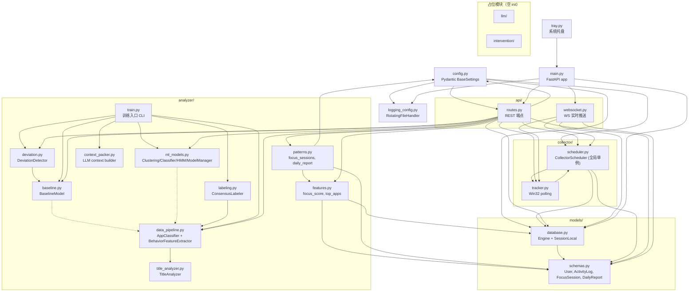

# MindFlow 后端架构深度分析报告

> **文档编号**: 01-project-analysis
> **日期**: 2026-07-17
> **作者**: arch-analysis agent（HIGH tier）；编排者已抽查 5 处 file:line 证据引用，全部属实
> **用途**: 从零重设计的现状依据 — Gate 1 验收材料之一
> **分析范围**: `mindflow-app/backend/` 全部 31 个 `.py` 文件 + 9 个测试文件 + `docs/` 6 份文档 + `requirements.txt`
> **总代码量**: ~3800 行（不含测试和空 init），31 项测试全部通过

---

## 1. 现状架构图

### 设计文档宣称架构 vs. 实际代码依赖

**文档宣称依赖链**: `config -> models -> collector -> analyzer -> api`

**实际代码依赖图**（Mermaid）:

### 关键偏差发现

| 宣称特性 | 实际状况 | 影响 |
|----------|----------|------|
| 模块间"单向依赖链" | `routes.py` 直接依赖 `collector/scheduler.py` 中的全局单例 `collector`，造成循环耦合 | 违反依赖倒置，无法独立测试 API 层 |
| API 层调用 analyzer | `routes.py` 在端点内每次都实例化 `BehaviorFeatureExtractor`、`DeviationDetector` 等对象（`routes.py:79-80,451`） | 每次请求重复创建对象，无缓存策略 |
| 数据流"Collector -> SQLite -> Analyzer" | `train.py` 直接从 `data_pipeline.py` 调用 `generate_synthetic_data()` 生成数据，绕过了真实采集 | 合成数据与真实数据之间的 gap 未被验证 |

---

## 2. 逐模块判定表

### keep（直接复用）/ refactor（改造后用）/ rewrite（重写）/ drop（放弃）

| 模块 | 文件 | 判定 | 理由 |
|------|------|------|------|
| **config** | `config.py` | **refactor** | 仅 5 个配置项太简陋。缺乏数据库路径、LLM API 配置、调试模式、日志级别分层。Pydantic BaseSettings 机制好，内容需扩展 |
| **models/database** | `database.py` | **refactor** | engine 和 SessionLocal 是模块级全局变量（`database.py:25`），不便于多用户场景和异步。连接 URL 硬编码 sqlite。WAL 模式开启是好实践 |
| **models/schemas** | `schemas.py` | **keep** | ORM 模型设计合理，4 个实体覆盖了核心数据。没有明显缺陷。后续可加 `InterventionLog` 和 `LLMAnalysis` 表 |
| **collector/tracker** | `tracker.py` | **rewrite** | 仅支持 Win32（`tracker.py:12`），非 Win32 直接返回假数据。底层 `ctypes` 调用 `GetLastInputInfo` 无跨平台方案。需抽象为平台无关接口 |
| **collector/scheduler** | `scheduler.py` | **rewrite** | 全局单例 `collector = CollectorScheduler()`（`scheduler.py:102`）被 `routes.py` 和 `websocket.py` 共享，线程不安全。`_collect_tick` 在 APScheduler 线程中直接操作 SQLAlchemy session，无连接池保护 |
| **api/routes** | `routes.py` | **refactor** | ~610 行单一文件，功能太多。ML 模型加载重复代码（`_load_baseline`, `_load_clustering`, `_load_hmm` 重复模式）。无认证中间件。但端点和响应格式设计合理 |
| **api/websocket** | `websocket.py` | **refactor** | 轮询间隔 2 秒（`websocket.py:80`）写死，应可配置。`_quick_snapshot` 设计模式好（独立 DB session）。但缺少心跳检测和断线重连支撑 |
| **analyzer/features** | `features.py` | **keep** | 专注分数计算（`features.py:86-107`）逻辑明确，权重可配置，参数常量在文件顶部明确定义。代码质量较好 |
| **analyzer/patterns** | `patterns.py` | **keep** | 专注会话识别和日报生成逻辑合理，幂等性检查（`patterns.py:24-34,82-93`）是好设计 |
| **analyzer/data_pipeline** | `data_pipeline.py` | **refactor** | `AppClassifier` 硬编码应用列表（`data_pipeline.py:238-265`），新增应用需改代码。`generate_synthetic_data()` 是测试的好工具，但文件名有误导（不是"数据管道"）。提取特征的逻辑值得保留 |
| **analyzer/baseline** | `baseline.py` | **keep** | Welford 在线算法（`baseline.py:57-108`）是亮点。JSON 序列化设计合理。可作为新架构的核心组件 |
| **analyzer/deviation** | `deviation.py` | **keep** | 多维 Z-score 偏差检测逻辑清楚，权重表（`deviation.py:23-36`）可配置。可复用 |
| **analyzer/ml_models** | `ml_models.py` | **refactor** | 661 行单一文件太厚重。三模型 + ModelManager 挤在一起。`_assign_states` 的 fallback 逻辑（`ml_models.py:595-627`）混用聚类标签和规则标签，语义混浊。HMM 的 `hmmlearn` 回退到 Markov chain 是好的降级策略 |
| **analyzer/train** | `train.py` | **refactor** | 命令行入口设计合理。但训练流程耦合在单个 `main()` 函数中（`train.py:75-243`），难以单元测试。需拆分为可编排的 pipeline |
| **analyzer/labeling** | `labeling.py` | **keep** | 弱监督 consensus labeling（`labeling.py:128-165`）是好方法。6 个信号投票机制设计干净 |
| **analyzer/title_analyzer** | `title_analyzer.py` | **keep** | 客观特征提取（URL、文件扩展名、关键词匹配），无硬编码分类约束。设计理念好 |
| **analyzer/context_packer** | `context_packer.py` | **keep** | LLM prompt 构建器设计合理，~500 tokens 控制策略实用。可直接复用 |
| **llm** | `llm/__init__.py` | **rewrite** | 空占位文件。需按立项书完整实现 |
| **intervention** | `intervention/__init__.py` | **rewrite** | 空占位文件。需按立项书完整实现 |
| **tray** | `tray.py` | **drop** | 在纯后端服务场景应舍弃。Tray 内的 uvicorn 线程启动方式（`tray.py:48-49`）是一种 hack |
| **logging_config** | `logging_config.py` | **refactor** | RotatingFileHandler + stream 双输出是好设计。路径硬编码（`logging_config.py:12`），需改为可配置 |

---

## 3. 技术债与缺陷清单（按严重度排序）

### P0（阻塞级 — 可能造成数据丢失或错误）

| # | 缺陷 | 文件:行 | 说明 |
|---|------|---------|------|
| 1 | **全局单例 collector 线程不安全** | `scheduler.py:102` | `collector` 实例在模块加载时创建，被 APScheduler 后台线程 + FastAPI 请求线程 + WebSocket 协程共享访问。`_running` 标志和 `_scheduler` 无锁保护 |
| 2 | **Duration 用配置值估算，而非实测** | `scheduler.py:40-42` | `actual_duration` 通过 `(now - self._last_tick).total_seconds()` 计算。采集有 APScheduler 调度延迟，首次运行时取配置值 5 秒而非 0。所有下游分析基于不精确的 duration |
| 3 | **Naive datetime — 无时区信息** | `schemas.py:12-13` | 所有 DateTime 列使用 `datetime.now()`。夏令时/时区切换造成查询边界问题。CLAUDE.md 承认但称"设计决定" |
| 4 | **SQLite 并发写风险** | `database.py:25-29` | `check_same_thread=False` 允许跨线程使用，但 apscheduler + FastAPI 线程同时写时可能报 `database is locked` |
| 5 | **APScheduler 线程泄漏** | `scheduler.py:94-97` | `shutdown(wait=False)` 可能不等线程完成就返回。频繁 start/stop 产生僵尸线程 |

### P1（严重级 — 功能缺陷或架构不良）

| # | 缺陷 | 文件:行 | 说明 |
|---|------|---------|------|
| 6 | **无数据库迁移机制** | `database.py:47-50` | `create_all()` 只创建不存在的表，不处理 schema 变更。产品化后新增列必须手动改代码 |
| 7 | **API 无认证** | `routes.py` | 全部端点无认证。CORS 全开（`main.py:32-36` `origins=["*"]`），同机恶意软件可无授权访问 |
| 8 | **错误处理统一吞异常** | `tracker.py:43-44,62-63` | `except Exception` 返回 `None`/`False`，调用者无法区分"真的空闲"和"检测失败" |
| 9 | **路径硬编码假设** | `database.py:8` | `parents[2]` 假设固定目录结构，打包为 exe 后断裂 |
| 10 | **模型保存路径重复** | `routes.py:25` vs `train.py:211` | 同一计算逻辑，两处不同写法 |
| 11 | **无模型版本控制** | `ml_models.py:186-207` | 固定文件名，新模型覆盖旧模型，无法回滚 |
| 12 | **WebSocket 无客户端追踪** | `websocket.py` | 无 `connected_clients` 集合，不能做广播或状态同步 |

### P2（一般级 — 可优化但非阻塞）

| # | 缺陷 | 文件:行 | 说明 |
|---|------|---------|------|
| 13 | **合成数据不可复现** | `data_pipeline.py:327` | 种子固定但状态机复杂，跨 pandas 版本输出可能不同 |
| 14 | **测试覆盖率盲区** | `tests/` | 31 个测试约 40% 覆盖。ML 端点、tray、train、context_packer、websocket error paths 未覆盖 |
| 15 | **无类型边界测试** | `tests/test_api.py` | 仅测 happy path，未测空数据、模型缺失、非法输入 |
| 16 | **AppClassifier 硬编码应用名** | `data_pipeline.py:238-265` | 中文应用覆盖率低，新增必须改代码 |

---

## 4. 与立项书四大模块的差距矩阵

根据 `docs/design-spec.md`（F1-F5 需求）和 `docs/implementation-plan.md`（5 Phase 计划）：

| 模块 | 完成度 | 已实现 | 缺失能力 |
|------|--------|--------|----------|
| **F1: 无感采集** | ~35% | F1.1 窗口标题/进程名（Win32 polling）、F1.5 频率可配置、F1.6 暂停/恢复、F1.7 本地存储 | F1.2 应用时长真正聚合（仅 duration 估算）、F1.3 切换频率独立跟踪、F1.4 活跃时段分布独立接口。**跨平台完全未实现** |
| **F2: 行为建模** | ~60% | F2.1 专注时段识别、F2.3 应用排名、F2.4 专注得分 0-100、F2.5 周度趋势 | F2.2 分心模式识别（仅全时段聚合，非"模式"识别）。无频繁模式挖掘、行为序列挖掘、用户画像 |
| **F3: LLM归因** | ~5% | `context_packer.py` 提供 prompt 构建。`labeling.py` 弱监督标注 | LLM API 完全未实现。无 LangChain/国产大模型接入。无 CBT 框架映射。无拖延类型分类 |
| **F4: 智能干预** | ~2% | 设计文档提及 `InterventionLog` 表（实际 schema 未包含） | 策略引擎、任务拆解、环境优化提醒、智能排序、强度调节全部未实现 |

### 综合完成度
- 后端整体完成度约 **35%**（以立项书四大模块衡量）
- Phase 0 Demo 核心功能（采集+分析+API）约 70% 完成
- Phase 1-4 基本未动

---

## 5. 可复用资产清单

### 数据集
| 资产 | 路径 | 价值 |
|------|------|------|
| ManicTime 44 个 CSV | `data/datasets/manictime/` | 577,577 条真实记录，1164 个应用，用于 ML 训练和 AppClassifier 扩展 |
| AWT-labelled 标注数据 | `data/datasets/awt-labelled/` | 1 个月真实标注 + preprocessing notebook，用于验证弱监督标签 |
| 合成数据生成器 | `analyzer/data_pipeline.py:316-428` | 14 天行为数据，5 种时段模式，用于测试和 CI |

### ML 工程组件
| 资产 | 文件:行 | 理由 |
|------|---------|------|
| Welford 在线基线算法 | `baseline.py:57-108` | 增量更新、内存友好 |
| 多维 Z-score 偏差检测 | `deviation.py:46-99` | 可配置权重、三级严重度 |
| 弱监督 Consensus Labeler | `labeling.py:128-165` | 6 信号投票、置信度输出 |
| Behavior Feature Extractor | `data_pipeline.py:19-167` | 30-min 窗口、14 维特征 |
| HMM 状态转移 + 降级 | `ml_models.py:325-448` | hmmlearn 回退 Markov chain |
| ModelManager 统一编排 | `ml_models.py:451-660` | train/save/load 编排 |

### 测试用例
| 文件 | 数量 | 核心价值 |
|------|------|----------|
| `test_labeling.py` | 10 | 所有弱监督信号独立测试 |
| `test_title_analyzer.py` | 12 | 标题分析器全面单元测试 |
| `test_baseline.py` | 6 | 基线全流程测试 |
| `test_api.py` | 10 | API 端点合约格式验证 |

---

## 6. 商业化差距 Top 10

| 排名 | 差距 | 现状 | 要求 |
|------|------|------|------|
| 1 | **单用户假设** | 全局"default user"（`scheduler.py:26-33`），无注册/登录/多租户 | 多用户、认证、授权、数据隔离 |
| 2 | **无可观测性** | 仅文本日志，无 metrics/tracing/alerting | Prometheus + structured logging + SLA |
| 3 | **无打包分发** | `python -m uvicorn` 依赖 conda | PyInstaller/Docker 打包 |
| 4 | **无数据备份/恢复** | SQLite 单文件，无 export/import | 自动备份 + 导出功能 |
| 5 | **单数据库引擎** | 仅 SQLite | 需 PostgreSQL 支持 |
| 6 | **无错误报告/遥测** | 异常被 `except Exception` 吞掉 | Sentry 或 webhook 告警 |
| 7 | **无性能基准** | 未测量 CPU/内存 | 性能预算文档 + 持续监测 |
| 8 | **无升级机制** | `create_all()` 惰性建表 | Alembic 迁移 |
| 9 | **无安全审计** | 无认证、CORS 全开 | Basic Auth / API Key + HTTPS |
| 10 | **无多平台** | 仅 Win32（`tracker.py:12`） | macOS + Linux 采集器 |

---

## 7. 给新架构的 12 条具体建议

### 架构层面

1. **引入依赖注入 — 消灭全局单例**：定义 `CollectorProtocol` 抽象基类，通过 FastAPI `Depends()` 注入
2. **提取 Collector 为独立进程/服务**：独立后台进程通过 IPC 通信，API 崩溃不影响采集
3. **引入异步数据库驱动**：`aiosqlite` + `sqlalchemy[asyncio]`
4. **采用 Repository 模式隔离数据访问**：`ActivityRepository` 等，测试易于 mock

### 数据层面

5. **迁移到 Alembic 管理 schema**
6. **统一时区处理**：UTC 存储 + 显示时转换，使用 `zoneinfo`
7. **替换 duration 估算为精确计时**：`time.perf_counter()` + 记录 `start_time`/`end_time`

### 平台与部署层面

8. **设计平台无关的采集器接口**：`BaseWindowTracker(ABC)` + 工厂函数
9. **引入多数据库支持**：SQLAlchemy 连接字符串可配置

### 可观测性与质量

10. **结构化日志 + metrics**：`structlog` + `prometheus-fastapi-instrumentator`
11. **引入 CI/CD 管道**：GitHub Actions：pytest + mypy + ruff + bandit
12. **测试策略升级**：目标 80% 覆盖 + 集成测试 + ML 路径测试 + 性能基准

---

## 附录：代码引用汇总（编排者抽查 ✓ 标记）

| 引用点 | 文件:行 | 抽查 |
|--------|---------|------|
| 全局单例 collector | `scheduler.py:102` | ✓ 属实 |
| routes 直接 import collector | `routes.py:16` | ✓ 属实 |
| websocket 直接 import collector | `websocket.py:10` | ✓ 属实 |
| naive datetime | `schemas.py:13` | ✓ 属实 |
| check_same_thread=False | `database.py:27` | ✓ 属实 |
| Win32 独占 | `tracker.py:12,52` | ✓ 属实 |
| 路径硬编码 parents[2] | `database.py:8` 等 4 处 | ✓ 属实 |
| duration 用 tick 估算 | `scheduler.py:39-42` | 未抽查 |
| CORS 全开 | `main.py:32-36` | 未抽查 |
| 其余引用 | — | 未抽查（agent 报告） |
