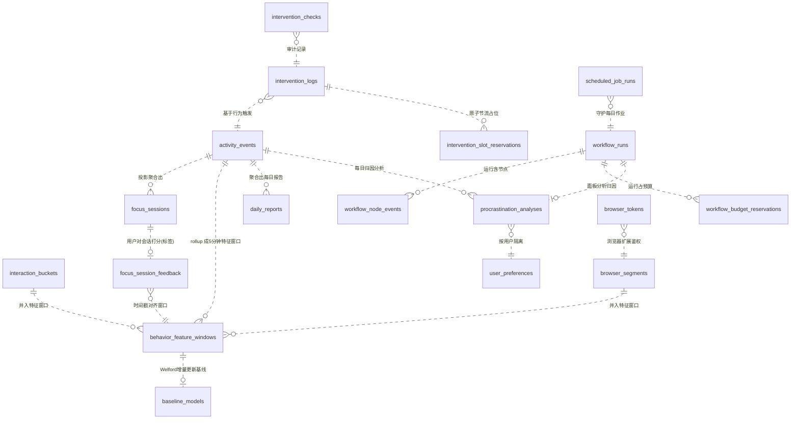

# 01 · 数据存储层（Data Storage Layer）

> 本章回答一个问题：**MindFlow 把用户的每一个"正在做什么"记在哪里、怎么记、坏了怎么办、旧数据怎么清理**。
> 读完本章，你应该能独立复刻出一个"单文件、本地优先、崩溃安全、带版本迁移"的 SQLite 存储层。
> 涉及目录：`backend-next/src/mindflow/infrastructure/database.py`、`schema.py`、`repositories/`、`alembic/`、`services/maintenance_service.py`、`config.py`。

---

## 1.1 选型：为什么是 SQLite，而不是 MySQL / PostgreSQL

MindFlow 是一个**本地优先**的个人应用：数据只属于本机用户，从不承诺上传云端（架构文档 ADR 的第一条纪律就是"All-local data"）。在"单机、单用户、低并发、要零运维"这个前提下，SQLite 是天然最优解：

| 特性 | SQLite 的表现 | 打比方 |
|------|--------------|--------|
| 存储形态 | 一个 `.db` 文件就是整个数据库 | 一本**活页账本**，整本书揣兜里就能带走 |
| 运维成本 | 无服务器、无端口、无账号密码 | 不需要雇"账房先生"（DBA） |
| 迁移 | 整个库就是一个文件，备份=复制文件 | 账本想备份？复印一本就行 |
| 并发 | 写锁是全局的，但配合 WAL 可"多读一写" | 记账时别人不能同时记，但可以同时看 |

项目选了**异步 SQLAlchemy + aiosqlite** 驱动（`infrastructure/database.py:62` `create_async_engine`），而不是同步 sqlite3。原因是 FastAPI 是 async 服务：如果数据库调用是阻塞的，就会卡住整个事件循环。用 `sqlite+aiosqlite` 让每个查询变成 `await`，不阻塞其他请求。

> 一句话记忆：**单机应用 → 单文件数据库；异步 Web 框架 → 异步数据库驱动。** 这是 MindFlow 数据库选型的完整逻辑链。

---

## 1.2 WAL 模式：每个 PRAGMA 到底在干嘛

SQLite 默认的写入方式（journal mode = DELETE）是"写之前先把旧数据复制到一个回滚日志文件，写完再删"。这样**读和写不能同时进行**——写着的时候读会被锁住。

MindFlow 在每次新建数据库连接时，通过 `event.listen(engine.sync_engine, "connect", _set_wal_pragmas)` 挂了一个监听器（`database.py:33-45`），**每开一个新连接都自动执行**这 5 条 PRAGMA：

```python
cursor.execute("PRAGMA journal_mode=WAL")              # ① 写前日志改为 WAL
cursor.execute("PRAGMA synchronous=NORMAL")            # ② 落盘时机：普通即可
cursor.execute("PRAGMA busy_timeout=5000")             # ③ 抢锁等待上限：5 秒
cursor.execute("PRAGMA journal_size_limit=67108864")   # ④ WAL 文件上限：64 MB
cursor.execute("PRAGMA foreign_keys=ON")               # ⑤ 打开外键约束
```

逐一用人话解释（每个都配一个比方）：

| PRAGMA | 作用 | 人话解释 | 打比方 |
|--------|------|---------|--------|
| `journal_mode=WAL` | 把回滚日志改成 **WAL（Write-Ahead Log，预写日志）** | 写操作不直接改主账本，而是先**追加**到一本"流水账"（`mindflow.db-wal`），由 SQLite 在空闲时把流水账"归账"进主文件 | 餐厅点单：服务员**先记在小票本上**（WAL），不是直接改总账；总账在打烊时统一誊抄。客人（读操作）看总账不受影响 |
| `synchronous=NORMAL` | 落盘时机从"每步都同步刷盘"降为"关键点刷盘" | 在 WAL 模式下，`NORMAL` 已经能保证**崩溃后不丢已提交事务**，且比 `FULL` 快一个量级 | 记账员**不用每写一个字就锁保险柜**，只要在"下班收尾"时确保全部入库 |
| `busy_timeout=5000` | 遇到"库被占用"（SQLITE_BUSY）时**等 5 秒**而不是立刻报错 | 两个进程同时写时，后来的那个**排队等待**最多 5 秒，而不是直接失败 | 只有一个洗手间，有人占着时，你**在门口等 5 秒**而不是转身走人 |
| `journal_size_limit=67108864` | WAL 流水账文件最大 **64 MB** | 防止流水账无限膨胀；到上限会自动触发 checkpoint 归账 | 小票本写满一沓（64MB）就**强制誊抄进总账**，把本子清空重写 |
| `foreign_keys=ON` | 启用外键约束 | SQLite 默认**关闭**外键！必须显式打开，否则 `REFERENCES` 形同虚设 | 合同上写了"必须签章才生效"，这句 PRAGMA 就是那个"盖章" |

**注意第 ⑤ 条是个陷阱**：SQLite 出于历史兼容，默认 `foreign_keys=OFF`。MindFlow 显式打开它，所以如果以后有人加外键，它真的会被强制执行（`database.py:44`）。

> WAL 是数据库性能与可靠性的**核心地基**。记住这句话：**WAL = 多读一写 + 崩溃安全 + 写入不阻塞读**。

---

## 1.3 数据落在磁盘哪里：`{data_dir}` 布局

`{data_dir}` 由 `config.py:55-60` 用 `platformdirs.user_data_dir("mindflow", ensure_exists=True)` 解析。**所有相对路径都被强制锚定到 data_dir，绝不落在当前工作目录**（`config.py:236-249` 的 `_resolve_runtime_paths`）。

各平台默认位置：

| 平台 | 默认 `{data_dir}` |
|------|------------------|
| Windows | `C:\Users\<用户名>\AppData\Local\mindflow` |
| macOS | `~/Library/Application Support/mindflow` |
| Linux | `~/.local/share/mindflow` |

`{data_dir}` 里的文件（`config.py:78-101` + `logging_config.py:60-103`）：

| 路径 | 内容 |
|------|------|
| `mindflow.db` | 主数据库（SQLite，WAL 模式） |
| `mindflow.db-wal` / `mindflow.db-shm` | WAL 流水账 + 共享内存索引（**伴随主文件存在**，备份时不能只拷主文件） |
| `backups/` | 每日备份，`mindflow-YYYY-MM-DD.db`（`config.py:87-90` + `maintenance_service.py:157-159`） |
| `models/` | ML 模型文件（`config.py:82-85`，`models_dir` 相对路径锚定到 data_dir） |
| `logs/` | loguru 日志 `mindflow_YYYY-MM-DD.log`，10MB 轮转、保留 30 天、gz 压缩（`logging_config.py:79-92`） |
| `.env` | 本地配置文件（`get_settings()` 从这里读，`config.py:267-270`） |
| `token` | 本地 API 认证令牌（`config.py:93-95`） |

> 打比方：`{data_dir}` 就像这家"MindFlow 公司的档案室"——账本（db）、流水小票（wal）、每天的复印备份（backups）、模型蓝图（models）、值班日志（logs）全在一间屋子里，**一目了然，也方便整体迁移**。

---

## 1.4 完整表清单（21 张业务表 + 2 类辅助表）

所有表的 `sa.Table(...)` 定义集中在两个地方：

- `infrastructure/schema.py` —— **单一事实来源**（single source of truth），16+ 张表，注释明确要求"加列必须同步加 migration，反之亦然"（`schema.py:1-32`）。
- 少数表因为历史/计算列原因留在各自 repository 里：`activity_events`（`repositories/activity.py:41-81`）、`focus_sessions`（`repositories/focus.py:25-43`）、`daily_reports`（`repositories/report.py:25-64`）、`scheduled_job_runs`（`repositories/scheduled_jobs.py:14-26`）。

| # | 表名 | 用途 | 关键列 | 归属迁移 |
|---|------|------|--------|---------|
| 1 | `activity_events` | **原始活动事件流**（追加为主）：每 5 秒一条前台窗口快照，`data_json` 存整包快照，另有 4 个 `json_extract` 虚拟计算列便于查询 | `id, user_id, timestamp, duration_s, data_json, app_name/process_name/window_title/is_idle(计算列), event_type` | 0001 (+0008 计算列与索引) |
| 2 | `focus_sessions` | **专注会话投影**：从事件流聚合出的"一段专注/分心" | `id, user_id, date, start_time, end_time, session_type, dominant_app, focus_score, switch_count` | 0001 |
| 3 | `daily_reports` | **每日报告**（幂等：`UNIQUE(user_id,date)`） | `id, user_id, date, total_focus_min, focus_score, top_apps_json, pattern_summary` | 0001 |
| 4 | `procrastination_analyses` | **LLM 归因分析结果**（幂等：`UNIQUE(user_id,date,analysis_kind)`，同一日可有 daily_panel/daily_attribution/ml 多种） | `id, user_id, date, procrastination_types_json, type_confidence_json, cbt_technique, response_text, panel_transcript_json, analysis_kind, source, degraded` | 0001, 0002, 0011, 0015 |
| 5 | `intervention_logs` | **干预历史**：每次弹窗提醒 + 用户回应 + 反馈 | `id, user_id, triggered_at, intervention_type, cbt_technique, context_json, title, message, user_response, feedback_rating` | 0001, 0004, 0005, 0014 |
| 6 | `baseline_models` | **个人行为基线**（每用户一行 `UNIQUE(user_id)`，`model_json` 是 Welford 统计序列化） | `id, user_id, model_json, training_events_count` | 0001 |
| 7 | `user_preferences` | 用户设置（每用户一行 JSON） | `id, user_id, preferences_json` | 0001 |
| 8 | `chat_messages` | 聊天记录（`role` 限定 user/assistant） | `id, user_id, session_id, role, content, created_at` | 0003, 0012 |
| 9 | `app_classification_rules` | **用户自定义 App 分类规则**（优先级排序，支持窗口标题 `%` 通配） | `id, user_id, process_name, window_title_pattern, category, priority` | 0006 |
| 10 | `interaction_buckets` | **键鼠交互遥测**（30 秒聚合桶） | `id, user_id, window_start_utc, duration_s, keypress_count, mouse_click_count, scroll_delta, mouse_distance_px, input_active_s` | 0007 |
| 11 | `browser_segments` | **浏览器停留段**（按域名聚合，含"是否有声"） | `id, user_id, timestamp, duration_s, browser_name, domain, audible, context_key` | 0007 |
| 12 | `focus_session_feedback` | **用户专注反馈**（ML 训练标签来源！`UNIQUE(user_id,session_id)`） | `id, user_id, session_id, label, score, task_type, session_start_utc, session_end_utc` | 0007, 0018 |
| 13 | `browser_tokens` | **浏览器扩展配对令牌**（只存 `token_hash`，不存明文） | `id, user_id, token_hash, last_used_at, revoked_at` | 0007 |
| 14 | `behavior_feature_windows` | **V3 特征窗口**（ML 训练数据主体，5 分钟窗口 + 24 维特征 JSON） | `id, user_id, window_start_utc, window_end_utc, feature_schema_version, features_json, label` | 0007 |
| 15 | `scheduled_job_runs` | **定时作业领用/心跳**（复合主键 `(job_name, local_date)`，30 分钟租约） | `job_name, local_date, status, attempt_count, started_at, heartbeat_at` | 0009, 0010 |
| 16 | `workflow_runs` | **LangGraph 工作流运行记录**（幂等键去重，只存元数据不存 PII） | `id, run_id, workflow_name, status, source, idempotency_key, trace_id, token_count, call_count` | 0013 |
| 17 | `workflow_node_events` | 工作流每节点事件（状态/耗时/错误类别/脱敏 payload） | `id, run_id, node_name, status, duration_ms, error_category, payload_json` | 0013, 0016 |
| 18 | `workflow_budget_reservations` | **工作流预算原子预留**（LLM 调用预算去重） | `id, workflow_name, idempotency_key, budget_type, expires_at, released_at` | 0013 |
| 19 | `ml_shadow_predictions` | **影子模式预测对比**（候选模型 vs 线上模型，不切换只观测） | `id, user_id, window_start_utc, candidate_version, active_version, candidate_proba, delta` | 0017 |
| 20 | `intervention_checks` | **自动干预审计**（每次"为什么弹/为什么不弹"） | `id, user_id, checked_at, reason, confidence, throttle_reason, source, ml_status` | 0018 |
| 21 | `intervention_slot_reservations` | **干预节流原子占位**（`UNIQUE(user_id,date,slot_index)` + `INSERT ON CONFLICT DO NOTHING` 防并发双弹） | `id, user_id, date, slot_index, intervention_type` | 0020 |

辅助表（不由业务代码直接读写）：

- `alembic_version` —— Alembic 自维护，记录当前 schema 版本号。
- `checkpoints` / `checkpoint_writes` —— 仅当 `checkpointing_enabled=True` 时，LangGraph 的 `AsyncSqliteSaver` 会在**同一个 db 文件**里建这两张表（`checkpointer.py:47-138`），默认关闭（`config.py:220-222`）。

> **迁移说明**：`intervention_slot_reservations` 由 migration `0020_create_intervention_slot_reservations.py` 创建；`schema.py` 与迁移定义保持一致。生产部署执行 `alembic upgrade head` 后即可使用原子槽位占用。

### 表间关系（mermaid erDiagram）



三条最关键的链路（初学者请重点理解）：

1. **采集 → 训练数据**：`activity_events`（原始事件）+ `interaction_buckets`/`browser_segments`（遥测）→ `behavior_feature_windows`（V3 特征窗口，5 分钟一窗、24 维特征）→ `baseline_models`（Welford 基线）。这是 ML 的完整数据血缘。
2. **会话 → 标签**：`focus_sessions`（从事件流识别出的专注段）被用户打分成 `focus_session_feedback`（label/score），这就是监督学习的**真值**；反馈的时间戳通过 `session_start_utc`/`session_end_utc` 与特征窗口对齐（迁移 0018 的 backfill 干的就是这件事）。
3. **分析 → 报告**：`activity_events` 聚合出 `daily_reports`；LLM 会诊结果写 `procrastination_analyses`；`workflow_runs`/`workflow_node_events` 记录这次"会诊"本身跑没跑完、花了多少 token（**只记元数据，不记聊天内容**）。

---

## 1.5 异步 repository 模式：为什么每个方法自己开 session

这是整个存储层**最值得复刻的设计**。所有 repository 的构造函数只收一个 `session_factory`（`async_sessionmaker[AsyncSession]`），而**每个方法内部都用 `async with self._session_factory() as session` 自己开、自己关 session**：

```python
class SQLAlchemyActivityRepository:
    def __init__(self, session_factory: async_sessionmaker[AsyncSession], pulsetime_s: int | None = None):
        self._session_factory = session_factory
        self._pulsetime_s = pulsetime_s or get_settings().heartbeat_pulsetime_s

    async def append_event(self, event: ActivityEvent) -> None:
        async with self._session_factory() as session, session.begin():   # ← 每次自己开事务
            last = await self._last_mergeable_event(session, event.user_id, event.event_type)
            if last is not None and self._should_merge(last, event):
                await session.execute(sa.update(activity_events).where(...).values(duration_s=...))
                return
            await session.execute(activity_events.insert().values(...))
```

为什么这样做（而不是像很多教程那样在 service 层共享一个 session）？

| 设计 | 问题 |
|------|------|
| ❌ 全程共享一个 session | 事务跨多个 `await`，其中若有 LLM 网络调用，**数据库连接被占用几十秒**；SQLite 连接池小，别的请求就只能干等 |
| ❌ service 层手动开 session | service 还得懂 SQLAlchemy 细节，分层被破坏；忘记 commit/close 就会泄漏连接 |
| ✅ repository 方法内自开自关 | 每个操作**独立小事务**，天然无跨 await 长事务、无连接泄漏、方法可独立测试 |

配套的工厂函数（`database.py:75-88`）：

```python
def create_session_factory(engine: AsyncEngine) -> async_sessionmaker[AsyncSession]:
    return async_sessionmaker(
        bind=engine,
        class_=AsyncSession,
        expire_on_commit=False,   # ← 提交后对象不自动过期，避免 commit 后再访问属性触发额外查询
    )
```

几点补充：

- **协议（Protocol）而非继承**：`base.py:22-61` 定义了 `ActivityRepository` 这个 `Protocol`，具体实现靠**结构类型匹配**（只要方法签名对得上就满足协议），配合 `mypy --strict` 在编译期抓缺方法，测试里还能 `MagicMock(spec=...)`。
- **允许跨方法事务**：当确实需要"多条写原子完成"时（如"存特征窗口 + 更新基线"要一起成功），repository 方法支持传入调用方持有的 `session` 参数（`telemetry.py:326-355` `upsert_feature_windows(session=...)`、`baseline.py:47-94` `upsert(session=...)`），由**调用方**负责开事务——事务所有权显式、不隐式。
- **幂等写入是标配**：SQLite 方言的 `insert(...).on_conflict_do_update(...)` 被大量使用（`report.py:124-136` 日报 upsert、`analysis.py:129-174` 归因 upsert、`baseline.py:72-89` 基线 upsert）。好处：同一天重复跑任务不会产生重复行。
- **心跳合并（heartbeat merge）**：`activity.py:114-149` 在插入前查"上一个同类型事件"，如果同进程、时间差在 `pulsetime_s`（默认 10 秒）内，就把 `duration_s` **累加**而不是插新行——防止每 5 秒一条快照把表撑爆。`browser_segments` 也有同样的合并（`telemetry.py:72-121`）。

> 打比方：每个 repository 方法就像一位**只接单、不跨单**的跑腿小哥。他接一张单（开 session）→ 办完（commit）→ 交单走人（close）。**单与单之间绝不互相纠缠**。只有当老板（service）明确说"这几件事要一次办完"，小哥才用老板递过来的同一张单一起办（session 参数）。

---

## 1.6 数据模型：domain 层是"纯 Python"，不进数据库

存储层的另一半是 `domain/` 下的**纯数据模型**。它们没有 `@dataclass` 之外的任何框架依赖（不 import SQLAlchemy），保证"想换数据库都不影响模型"。

| 文件 | 内容 | 关键点 |
|------|------|--------|
| `domain/events.py` | `WindowSnapshot`（窗口快照）+ `ActivityEvent`（事件） | **frozen dataclass**（不可变）；`to_dict/from_dict` 做 JSON 序列化；**拒绝 naive datetime**（`_check_aware`，`events.py:27-31`）——所有时间必须带时区、统一 UTC |
| `domain/features.py` | 特征计算纯函数 | `count_confirmed_switches()`（驻留≥10 秒 + 忽略瞬时进程才计一次切换，`features.py:223-282`）、`focus_score()`（top-app 占比×60% + 切换惩罚×40%，`features.py:285-330`） |
| `domain/feature_schema.py` | 特征词表 + 版本 | `FEATURE_SCHEMA_VERSION = 3`（`feature_schema.py:12-13`，定义了两遍、后定义覆盖前定义）；`V2_FEATURE_NAMES` 列全 24 个特征名（`feature_schema.py:15-39`）——**domain 和 train 共用这份词表，防止漂移** |
| `domain/baseline.py` | 个人基线模型 | **Welford 在线算法**（只存 n/mean/M2 三个数就能增量算均值方差，`baseline.py:142-165`）；按 `(hour, dow)` 分 168 个桶；`to_dict/save/load` 支持落盘 |
| `domain/evidence.py` | 证据包（ML 感知 → LLM 推理的契约） | `EvidenceBundle` + `EvidenceItem`；`to_prompt_json()`（`evidence.py:125-195`）**明确不带窗口标题、不带文件路径**（NF-S3a）；`metric_names()` 供 critic 校验引用 |
| `domain/intervention.py` | 干预领域模型 | 4 种干预类型、3 档强度（gentle/standard/strict）、CBT 技术中文标签；**文案禁用"诊断/治疗/患者/处方"**（NF-S7） |

> 打比方：domain 层是**公司章程/合同文本**（只规定"长什么样、怎么算"），infrastructure 层是**保险柜和记账系统**（怎么存、怎么取）。合同和保险柜解耦，换保险柜不用重写合同。

---

## 1.7 Alembic 迁移：从 0001 到 0018 的升级之路

数据库 schema 会随功能演进，Alembic 负责把**旧库平滑升级到新库**。MindFlow 当前迁移链是 18 个版本，全部线性：

```
0001_create_core_tables
  └─ 0002_add_panel_transcript        (加 panel_transcript_json)
      └─ 0003_create_chat_messages     (建 chat_messages)
          └─ 0004_add_intervention_logs_index
              └─ 0005_add_intervention_feedback
                  └─ 0006_create_app_classification_rules
                      └─ 0007_create_telemetry_tables   (建 5 张遥测表)
                          └─ 0008_optimize_activity_telemetry
                              └─ 0009_create_scheduled_job_runs
                                  └─ 0010_add_scheduled_job_heartbeat
                                      └─ 0011_add_analysis_kind
                                          └─ 0012_add_chat_session_recent_index
                                              └─ 0013_create_workflow_tables  (建 3 张工作流表)
                                                  └─ 0014_add_intervention_title_message
                                                      └─ 0015_add_panel_degradation_meta
                                                          └─ 0016_add_node_event_payload
                                                              └─ 0017_create_ml_shadow_predictions
                                                                  └─ 0018_add_feedback_snapshot_checks  ← head
```

### 如何初始化 / 如何跑

- 初始化：`alembic init alembic` 生成目录骨架；项目在此基础上写 `env.py` 和 `versions/`。
- 跑迁移：应用启动时在 `app.py:265` 调用 `run_migrations(settings.db_url)`；命令行可 `uv run alembic upgrade head`（手动）。
- `env.py` 关键点：`render_as_batch=True`（`env.py:91,116`）——**SQLite 不支持 `ALTER COLUMN`**，batch 模式会"重建整张表"来模拟改列；URL 从应用的 `Settings` 推导（`env.py:48-67`），异步驱动自动换成同步驱动。

### upgrade / downgrade 的注意点

- 每个 migration 必须**成对**写 `upgrade()` 和 `downgrade()`（downgrade 是"后悔药"，按逆序 drop）。
- `downgrade` 对 SQLite 是**高危操作**：SQLite 的 ALTER 能力弱，回滚可能丢失列或数据。因此项目文档明确警告（见根 CLAUDE.md）：**SQLite 上做 downgrade 必须先在隔离/备份库上试**。生产里几乎只 forward。
- `run_migrations` 做了一层**保护**（`migrations.py:40-54`）：跑完 `upgrade head` 后，还会亲自查 `alembic_version` 是否真的等于 script head，不一致就抛异常，防止"迁移文件缺失但表面成功"。
- **异步不阻塞**：Alembic 是同步库，`migrations.py:57-84` 用 `asyncio.to_thread` 把它丢进线程池，避免卡住 FastAPI 事件循环。
- 迁移失败不致命：`run_migrations` 失败返回 `False`，应用仍可带着旧 schema 启动，健康检查会暴露 `migration_failed` 状态（优雅降级，NF-R5）。

> 打比方：迁移链像**游戏存档升级**。旧存档（0001 的库）读完 0018 个补丁就能在新版本里打开。每个补丁都自带"打了升级 + 删了回退"两份说明；SQLite 这游戏特别怕"回档"，所以项目规定回档前必须先备份存档。

---

## 1.8 维护与保留策略：旧数据怎么清、备份怎么做

存储层不是"写完就完"，`services/maintenance_service.py` 是它的**大管家**，配合调度器（`scheduler.py:1160-1191`）每天执行：

| 任务 | 触发时间 | 做什么 | 实现要点（file:line） |
|------|---------|--------|----------------------|
| `cleanup_old_events` | 每天 03:00 | 删掉超过 `event_retention_days`（默认 30，合法区间 7–90，`config.py:135-151`）的原始事件 | **分批删，每批 10,000 行、每批单独 commit**（`maintenance_service.py:74-127`），避免长事务撑爆 WAL |
| `_wal_checkpoint_truncate` | 清理事件后 | `PRAGMA wal_checkpoint(TRUNCATE)` 把 WAL 清零，**回收磁盘空间** | 必须在无活跃写事务时执行（`maintenance_service.py:129-142`） |
| `run_daily_backup` | 每天 04:00 | 用 `VACUUM INTO` 生成崩溃一致快照到 `{data_dir}/backups/mindflow-{date}.db` | `database.py:128-166`；失败会发桌面通知（`maintenance_service.py:161-175`） |
| `cleanup_old_workflows` | 每日 cron | 删超过 `workflow_retention_days`（默认 30）的**终态**工作流运行 + 节点事件；**保留** analyses 和 chat | 只删 `completed/failed/cancelled`；`pending/running` 永不删（`maintenance_service.py:180-247`） |
| `reconcile_stale_runs` | 每日 cron | 把卡在 `running` 超过 60 分钟的运行标记为 `failed`（进程崩溃兜底） | `maintenance_service.py:251-296` |
| `reconcile_orphan_chat_turns` | 每日 cron | 检测"用户消息没有助手回复"的孤儿轮次——**只记录，不删除** | `maintenance_service.py:300-351` |
| `expire_stale_budgets` | 每日 cron | 释放已过期的预算预留，让幂等键可复用 | `maintenance_service.py:355-388` |

### 备份为什么用 VACUUM INTO

`database.py:128-166` 的 `backup_database`：

```python
temp_dest = dest.with_name(f".{dest.name}.{uuid4().hex}.tmp")
async with engine.connect() as conn:
    await conn.execute(text(f"VACUUM INTO '{temp_dest}'"))
    await conn.commit()
temp_dest.replace(dest)   # 原子替换，先写临时文件再改名
```

`VACUUM INTO` 是 SQLite 3.27+ 官方推荐的备份方式：它生成一个**事务一致**的新库文件（读到的是一瞬间的快照），不会因为拷贝时恰好有写入而得到损坏副本。先写 `.tmp` 再 `rename` 是**原子操作**——中途断电也不会留下半个备份文件。防御细节：备份路径含单引号直接拒绝（`database.py:147-149`），避免注入 SQL。

> 打比方：VACUUM INTO 像**复印机**——不是一本本抄，而是整本复印，复印瞬间账本是静止的（一致），复印完撕下临时页替换正式页（原子替换）。每日一份，按日期命名，天然形成"每日快照档案"。

---

## 1.9 隐私与 PII：哪些数据敏感，项目怎么保护

MindFlow 采集的是**最高敏感级别的个人行为数据**，必须认真对待：

### 哪些是敏感/PII

| 数据 | 敏感性 | 存在哪 |
|------|--------|--------|
| 窗口标题 `window_title` | **极高**——可能含文件名、网页标题、聊天内容 | `activity_events.data_json`、`activity_events.window_title`（计算列） |
| 应用/进程名 | 高——推断工作与生活习惯 | `activity_events.app_name/process_name` |
| 浏览器域名 `domain` | 高——推断访问内容 | `browser_segments.domain` |
| 键鼠统计 | 中——不直接含内容，但能刻画行为模式 | `interaction_buckets.*` |
| 聊天记录 | 高 | `chat_messages.content` |
| LLM 归因与专家会诊转录 | 高 | `procrastination_analyses.panel_transcript_json` |
| 干预消息与用户反馈 | 中 | `intervention_logs.*` |

### 项目如何保护（代码级证据）

1. **全本地、无上传**：数据只在 `{data_dir}`，架构第一条 ADR 纪律（`00-overview.md` 0.4）。
2. **LLM 证据去标识化**：`evidence.py:125-195` 的 `to_prompt_json()` 明确"**No window titles or file paths**"——给 LLM 专家看的只有聚合指标（focus_score、switch_rate、占比）和中文可读描述，**原始窗口标题不进 prompt**。`human_readable` 字段同样禁止窗口标题（NF-S3a，`evidence.py:67-69`）。
3. **工作流表零 PII**：`schema.py:274-281` 注释写明 `workflow_runs` 只存元数据（status/时间/计数/脱敏 trace_id），**不复制聊天文本、原始 prompt、证据载荷**。
4. **令牌只存哈希**：浏览器扩展配对令牌 `browser_tokens.token_hash`，不存明文（`telemetry.py:529-554`）。
5. **链路追踪脱敏**：本地 OpenTelemetry 的 span 属性**从不包含**窗口标题、文件路径、PII（ADR-003，见根 CLAUDE.md）。
6. **日志脱敏**：loguru `diagnose=False` 不把局部变量写进 traceback（`logging_config.py:75,90`）；备份失败通知也不含数据内容（`maintenance_service.py:167-172`）。
7. **一键删除**：`telemetry.py:614-644` 的 `delete_scope` 支持按 interaction/browser/feedback/all 粒度删除某用户的数据——实现"被遗忘权"。
8. **数据过期即焚**：原始事件 30 天自动清理（1.8 节），聊天/分析/报告则长期保留（产品需要）。

---

## 1.10 可复刻性：最小存储层骨架

```python
# 1) 引擎（带 WAL PRAGMA 监听器）
from sqlalchemy.ext.asyncio import create_async_engine, async_sessionmaker

def build_engine(db_path: str):
    engine = create_async_engine(f"sqlite+aiosqlite:///{db_path}")
    from sqlalchemy import event

    @event.listens_for(engine.sync_engine, "connect")
    def _wal(conn, _):  # 每个新连接自动配置
        for pragma in (
            "PRAGMA journal_mode=WAL",
            "PRAGMA synchronous=NORMAL",
            "PRAGMA busy_timeout=5000",
            "PRAGMA foreign_keys=ON",
        ):
            conn.exec_driver_sql(pragma)
    return engine

# 2) 会话工厂（不共享 session，方法内自开自关）
SessionLocal = async_sessionmaker(bind=engine, expire_on_commit=False)

# 3) 一个仓库方法的样子
async def append_event(session_factory, event):
    async with session_factory() as session, session.begin():
        await session.execute(table.insert().values(id=event.id, ...))

# 4) 迁移：alembic init + render_as_batch=True + upgrade head；SQLite 禁 ALTER COLUMN
# 5) 维护：分批 DELETE(每批1万行单独commit) + VACUUM INTO 每日快照 + wal_checkpoint(TRUNCATE)
```

复刻验收清单：

- [ ] `mindflow.db` 是 WAL 模式，能一边写一边读
- [ ] 每个 repository 方法 `async with session_factory()` 自开自关，service 层不碰 session
- [ ] `alembic upgrade head` 幂等，`alembic_version` 与 head 一致
- [ ] 窗口标题**不会**出现在发给 LLM 的证据 JSON 里
- [ ] 超过保留期的原始事件被分批删除且磁盘空间回收（WAL 截断）
- [ ] `backups/` 下有按日期的崩溃一致快照

---

## 1.11 关键文件速查

| 文件 | 作用 |
|------|------|
| `src/mindflow/infrastructure/database.py` | 引擎工厂 + WAL PRAGMA + `integrity_check` + `backup_database`(VACUUM INTO) |
| `src/mindflow/infrastructure/schema.py` | 所有 `sa.Table` 单一事实来源 |
| `src/mindflow/infrastructure/migrations.py` | Alembic 异步包装（to_thread + head 校验） |
| `alembic/env.py` | `render_as_batch=True`、URL 从 Settings 推导 |
| `alembic/versions/0001..0018` | 迁移链 |
| `src/mindflow/infrastructure/repositories/*.py` | 13 个仓库（activity/focus/report/analysis/intervention/baseline/chat/preferences/app_classification/telemetry/scheduled_jobs/workflow_runs） |
| `src/mindflow/domain/{events,features,feature_schema,baseline,evidence,intervention}.py` | 纯数据模型 |
| `src/mindflow/services/maintenance_service.py` | 清理 / 备份 / 回收 |
| `src/mindflow/config.py` | `{data_dir}`/`models_dir`/保留期解析 |
| `src/mindflow/logging_config.py` | 日志落盘（`{data_dir}/logs`） |
| `src/mindflow/infrastructure/checkpointer.py` | LangGraph 检查点复用同一 db 文件 |
