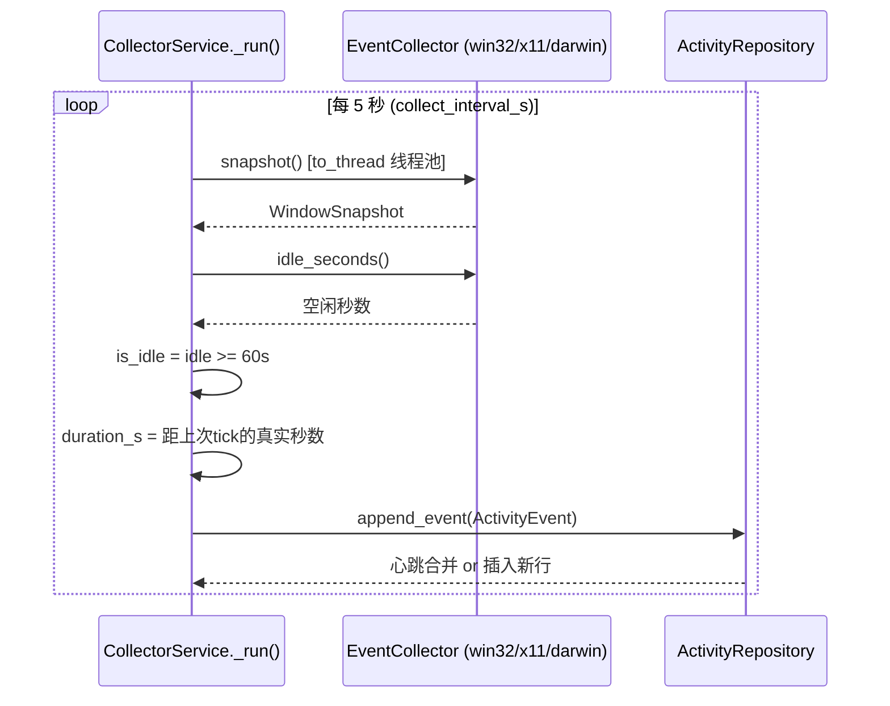
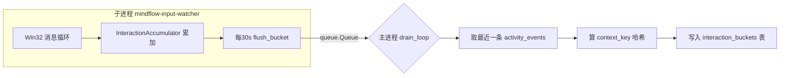
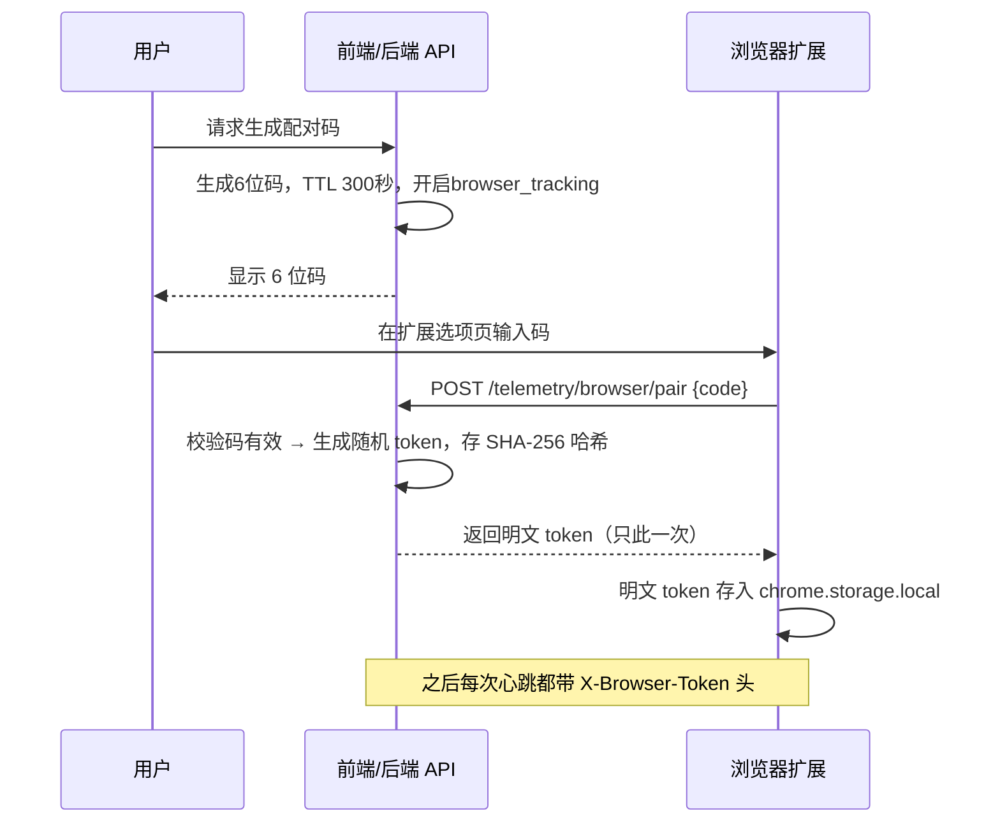

# 02 · 数据采集与遥测链路（窗口活动 / 键鼠输入 / 浏览器）

> 目标读者：**从未写过项目的人**。读完本章，你能回答"MindFlow 是怎么知道你正在用哪个软件、有没有在敲键盘、刷了多少网页的"，并且能自己复刻一套。
> 配套章节：`01-storage.md`（数据存哪、怎么建表）、`03-training-data.md`（这些数据如何变成训练样本）。
> 代码根目录：`mindflow-app/backend-next/`（下文路径均相对它）。

---

## 2.0 本章导读：一句话 + 一张图

**一句话**：MindFlow 用三条"本机传感器"持续观察你的电脑——**窗口活动**（每 5 秒看一眼前台是什么窗口）、**键鼠输入**（每 30 秒汇总一次敲了多少键/点了多少下鼠标）、**浏览器**（你切到哪个域名就记哪个域名），然后把它们揉成**5 分钟一块的行为特征窗口**，供后续统计分析、机器学习和实时干预使用。

```
本机三个"传感器"                                  后端进程
┌───────────────────────┐                 ┌────────────────────────────────────┐
│ 窗口活动 (5s tick)     │──写──► activity_events 表                            │
│   win32/x11/darwin    │                 │                                    │
├───────────────────────┤                 │ CollectorService(5s 循环)          │
│ 键鼠 Raw Input (30s桶) │──写──► interaction_buckets 表                        │
│   Windows 独有         │                 │ InputTelemetryService(子进程drain)  │
├───────────────────────┤                 │                                    │
│ 浏览器 MV3 扩展 (~30s) │──HTTP──► browser_segments 表                        │
│   domain + audible    │                 │ TelemetryService(配对/心跳)         │
└───────────────────────┘                 │                                    │
                                          │ 每15分钟/每日/启动时                │
                                          │ rollup_feature_windows()           │
                                          │   └──► behavior_feature_windows 表 │
                                          │          (5分钟窗口 × 24 个特征)    │
                                          └────────────────────────────────────┘
```

三个传感器的数据先在"原始层"落表，再由 `TelemetryService.rollup_feature_windows()` 定时聚合为特征窗口。这个"原始→特征"的两段式设计，是本章最值得记住的结构。

---

## 2.1 三条采集链路总览

| 链路 | 频率 | 采集什么 | 落到哪张表 | 平台 |
|------|------|----------|-----------|------|
| ① 窗口活动 | 每 5 秒一次 | 前台窗口标题、应用名/进程名、是否空闲、本段时长 | `activity_events` | win32 / x11 / darwin / wayland |
| ② 键鼠输入 | 30 秒一个桶 | 按键数、点击数、滚轮量、鼠标移动距离、活跃秒数、交互爆发数 | `interaction_buckets` | Windows（Raw Input） |
| ③ 浏览器 | 事件驱动 + 30 秒心跳兜底 | 当前活动标签页的**域名**、是否有声音 | `browser_segments` | Chrome/Edge MV3 扩展 |

> 频率来源：窗口 `collect_interval_s` 默认 5 秒（`src/mindflow/config.py:128-130`）；键鼠桶 `bucket_seconds=30`（`input_watcher.py:111`）；浏览器 `HEARTBEAT_SECONDS=30`（`browser_extension/service_worker.js:2`），但标签页切换/URL 变化会立即触发上报，所以实际粒度取决于你的操作。

三条链路共同遵守三条纪律（这也是复刻时的铁律）：
1. **采集器永不抛异常**——平台 API 出错就返回"降级快照"（`app_name="unknown"`）并记 warning（`collectors/base.py:41-44`、`collectors/win32.py:58-64`）。
2. **所有阻塞调用丢进线程**——用 `asyncio.to_thread` 包住原生 API，避免卡死异步事件循环（`collectors/win32.py:61,69`）。
3. **采集进来的文本一律截断**——窗口标题、应用名超过 512 字符就被截掉（`collectors/base.py:78-101`，F4 安全加固）。

---

## 2.2 链路一：窗口活动采集（每 5 秒拍一张快照）

### 2.2.1 共性抽象：EventCollector 协议

所有平台的采集器都长得一样——它们实现了同一个 `EventCollector` 协议（Protocol），协议只有两个方法：

```python
# src/mindflow/infrastructure/collectors/base.py:35-64
class EventCollector(Protocol):
    async def snapshot(self) -> WindowSnapshot: ...   # 抓当前前台窗口
    async def idle_seconds(self) -> float: ...        # 距上次键鼠输入多少秒
```

`WindowSnapshot` 是"前台窗口的一次快照"，是一个 **frozen dataclass**（不可变），字段见 `src/mindflow/domain/events.py:36-52`：

| 字段 | 含义 |
|------|------|
| `app_name` | 应用显示名（如 "Code"） |
| `window_title` | 窗口标题原文（**已截断到 512 字符**） |
| `process_name` | 可执行文件名（如 `Code.exe`）——这是后续所有聚合的"身份键" |
| `is_idle` | 用户是否空闲（由 `idle_seconds >= 60` 判定） |
| `timestamp_utc` | 快照时刻（必须是带时区的 UTC，`events.py:27-30` 会拒绝 naive 时间） |

选 Protocol 而不是 ABC 的原因（`base.py:7-13`）：结构子类型让 `mypy --strict` 在编译期就能发现"某平台采集器少写了一个方法"，又不需要显式继承，加第五个平台时不容易漏。

### 2.2.2 各平台实现差异（同一协议，四套原生 API）

| 平台 | `snapshot()` 用什么 | `idle_seconds()` 用什么 | 备注 |
|------|--------------------|------------------------|------|
| Windows | `win32gui.GetForegroundWindow()` + `win32process` 拿 PID + `psutil` 拿进程名 | `GetLastInputInfo`（ctypes） | 最完整：能拿到窗口标题 |
| macOS | `NSWorkspace.sharedWorkspace().activeApplication()`（PyObjC/AppKit） | `CGEventSourceSecondsSinceLastEvent`（Quartz） | 拿到的是"活动应用"，窗口标题退化为应用本地名 |
| Linux X11 | X11 EWMH `_NET_ACTIVE_WINDOW` + `_NET_WM_PID`（python-xlib） | XScreenSaver 扩展的 idle 毫秒数 | 需要 X11 桌面 |
| Linux Wayland | psutil 猜一个前台进程（终端/非 root 进程） | **无**，恒返回 0.0 | 降级方案：Wayland 安全模型不允许普通应用查前台窗口 |

关键实现细节：

- **Windows**：`win32gui.GetForegroundWindow()` 拿句柄 → `GetWindowText(hwnd)` 拿标题 → `GetWindowThreadProcessId(hwnd)` 拿 PID → `psutil.Process(pid).name()` 拿进程名（`win32.py:76-104`）。空闲检测用 `GetLastInputInfo`，还专门处理了 `GetTickCount` 每 49.7 天回绕的坑（`win32.py:115-121`）。
- **X11**：先 `d.getActiveWindow()` 拿活动窗口，再读 `_NET_WM_PID` 属性解析进程名（`x11.py:59-96`），最后用 `finally: d.close()` 确保 X 连接不泄漏。
- **Wayland fallback**：这是"尽力而为"。Wayland 的合成器（compositor）为了保护隐私，不给普通应用提供全局前台窗口 API，所以只能扫描进程列表找终端类进程（`wayland_fallback.py:75-97`）。**它代表一个重要的设计取舍：宁可降级采集，也不让应用崩溃。**

> 为什么用 `asyncio.to_thread`？`snapshot()` 是异步方法，但里面调用的 Win32/Xlib API 是**同步阻塞**的。如果直接在事件循环里调用，一个卡住的系统调用会冻结整个 FastAPI 服务。`to_thread` 把它丢到线程池，事件循环继续干别的（`win32.py:61`）。

### 2.2.3 CollectorService：后台 5 秒循环

`CollectorService` 是"窗口活动"这条链路的发动机（`src/mindflow/services/collector_service.py`）。它不是单例——`create_app` 在启动时用工厂 `create_collector()` 造出当前平台的采集器，再注入 `CollectorService`（`app.py:325-337`）。



每次 `_tick()`（`collector_service.py:224-257`）做四件事：
1. **量时长**：`actual_duration = now - 上次tick时间`。用"实测间隔"而不是配置值，是为了在系统 sleep/卡顿后依然保持时长总和正确（`229-233`）。
2. **取快照 + 取空闲**：两个采集器调用。
3. **判类型**：`idle_seconds >= 60`（`_IDLE_THRESHOLD_S`，`collector_service.py:39`）就算 `idle_change`，否则 `window_snapshot`。
4. **写库**：构造 `ActivityEvent`（含 UUIDv7 id、时长、快照）交给仓库。

循环的健壮性设计（复刻时值得抄）：
- **单次失败不杀循环**：连续 10 次 tick 失败才把状态置为 `degraded` 并停掉（`collector_service.py:198-216`）。
- **每 tick 有超时**：`asyncio.wait_for(..., timeout=interval*2)`，挂死的采集器不会阻塞循环（`189`）。
- **优雅停止**：`stop()` 先置哨兵位等当前 tick 自然结束（保证在途事件已落库），超时再 cancel（`112-169`）。
- **start/stop 用锁保护**：`asyncio.Lock` 防止并发调用产生孤儿任务（`75-78`）。

### 2.2.4 心跳合并：同一个窗口不要刷屏

你连着看 1 小时编辑器，按 5 秒一拍就是 720 条几乎一样的记录——太浪费。`SQLAlchemyActivityRepository.append_event` 实现了**心跳合并（heartbeat merge）**：

> 如果新事件和"上一条同类型事件"的 app_name / process_name / window_title / is_idle 完全相同，且时间差在 `heartbeat_pulsetime_s`（默认 10 秒）内，就把时长累加到旧行上，**不插新行**（`repositories/activity.py:114-149`、`517-549`）。

```python
# 合并条件（repositories/activity.py:527-549，全部满足才合并）
if 事件类型可合并 (window_snapshot / idle_change)        and
   同类型 (window 不合并 idle)                          and
   app_name / process_name / window_title / is_idle 全相同 and
   -pulsetime <= 新事件开始 - 旧事件结束 <= pulsetime:
        把新事件的 duration_s 累加到旧行 → 返回（不插入）
```

于是 `activity_events` 表的行数 ≈ **"上下文变化次数"**，而不是"tick 次数"。夜间长时间空闲也一样——连续的 `idle_change` 合并成一条超长空闲记录，不会每分钟刷一条（`activity.py:1-14` 注释）。这正是原始事件表能撑住 30 天保留期的原因。

---

## 2.3 窗口切换计数：`count_confirmed_switches()`

这是整个特征工程里最容易写错、也最关键的一个函数。它的任务：**数出这个窗口里"真正"发生了多少次换应用**。

### 2.3.1 为什么直接数"变化"不对

朴素做法是：相邻两条快照 `process_name` 不同就 +1。但真实使用中这会严重高估：

- 你在编辑器里写代码，想查个资料，点开浏览器、瞟一眼、再切回编辑器——整个过程不到 5 秒，被拍进 2~3 条快照，朴素算法记 2 次"切换"。
- Windows 的 `explorer.exe`、`ApplicationFrameHost.exe` 等**外壳进程**会在你点开始菜单、点任务栏的瞬间短暂跳到前台，这不是"你在用资源管理器"。

如果直接用这种脏计数去算"切换频率→分心度"，一个专注写代码的人也会被判成疯狂切窗。所以 MindFlow 用的是**"驻留确认"**策略。

### 2.3.2 "驻留 10 秒"规则

`count_confirmed_switches`（`src/mindflow/domain/features.py:223-282`）维护一个两态状态机：`current`（当前确认的进程）+ `candidate`（正在观察的新进程）。

- 看到一个**新进程**时，不立即判"切换"，而是把它记为 `candidate` 开始观察。
- 只有 `candidate` 连续驻留达到 `min_dwell_s = 10` 秒（`features.py:41`，`DEFAULT_SWITCH_MIN_DWELL_S`），才确认这是一次**真正的切换**：`candidate` 转正为 `current`，切换计数 +1。
- 如果 `candidate` 还没站满 10 秒就又切回去了（比如 A→B→A），这段"短暂出走"被直接丢弃，不计数。

> **比喻**：想象裁判数"换台"。观众遥控器按了一下综艺又立刻按回纪录片，裁判**不算**换台；只有新频道连续播放超过 10 秒，裁判才记一次"换台"。

为什么是 10 秒？因为快照每 5 秒一拍，一个进程至少要持续约两个采样周期才能被确认"真的在"；10 秒既是"够两拍"，又远小于"真正分心刷手机"的典型时长。

### 2.3.3 "忽略瞬时进程"列表

即使驻留够久，某些进程也不算切换——它们是 Windows 系统外壳，会在你点击时短暂跳到前台，属于噪声（`features.py:44-53`）：

```python
TRANSIENT_PROCESSES = frozenset({
    "explorer.exe", "ApplicationFrameHost.exe", "ShellHost.exe",
    "ShellExperienceHost.exe", "DesktopMgr64.exe", "SearchHost.exe",
    "TextInputHost.exe", "StartMenuExperienceHost.exe",
})
```

算法跳过这些进程名（`features.py:246-247`），也不把它们算进"最长专注段"（`features.py:378-409`）。

### 2.3.4 状态机伪代码

```
switches = 0; current = None; candidate = None
for event in 非空闲事件(按时间排序):
    p = event.process_name
    if p 为空 or p ∈ 瞬时进程: continue
    d = event.duration_s
    if current is None: current = p; continue
    if p == current:
        if candidate 已驻留 >= 10s:
            switches += 1; current = candidate; candidate = p   # 归位换台
        else:
            candidate 作废; current_dwell += d                  # 短暂出走，忽略
    elif p == candidate:
        candidate_dwell += d
        if candidate_dwell >= 10s: switches += 1; current = candidate
    else:  # 全新进程
        若有 candidate 且驻留 >= 10s: switches += 1; current = candidate
        candidate = p; candidate_dwell = d
最后若 candidate 驻留 >= 10s: switches += 1
```

> 这个函数在 5 分钟特征窗口里被调用（`telemetry_features.py:44-46`），也在"每小时切换率"（`switch_rate_per_hour`，`features.py:357-375`）里复用。注意 `features.py:40-43` 里有一行朴素的相邻比对代码，紧接着就被 `count_confirmed_switches` 的结果**覆盖**——最终生效的是驻留确认版本，这是 2026-07-31 升级到 schema v3 时的修正。

---

## 2.4 链路二：键鼠输入遥测（30 秒结一次账）

窗口快照只告诉你"在用哪个软件"，不知道"有多投入"。MindFlow 用 Windows 的 **Raw Input** 机制监听全局键鼠事件，然后**只保留 30 秒聚合计数**，原始输入事件本身绝不落库。

### 2.4.1 Raw Input 与 WM_INPUT

`run_raw_input_watcher`（`src/mindflow/infrastructure/collectors/input_watcher.py:108-380`）是一个**纯 ctypes 实现的 Win32 消息循环**：

1. 注册一个隐藏窗口类，用 `RegisterRawInputDevices` 订阅**键盘（Usage 0x01/0x06）+ 鼠标（0x01/0x02）**输入（`input_watcher.py:332-373`）。
2. 所有原始输入以 `WM_INPUT` 消息送达窗口过程；在其中解析 `RAWINPUT` 结构：
   - 键盘：`WM_KEYDOWN` / `WM_SYSKEYDOWN` → 记一次按键（`218-221`）。
   - 鼠标：解析按钮按下/弹起（用 `MouseInputState` 维护按键沿，见 `input_watcher.py:76-105`，只计**按下**不重复计）、鼠标相对位移（`lLastX/lLastY`）、滚轮 `WM_MOUSEWHEEL` 的 delta（`222-246`）。
3. 每 30 秒 `WM_TIMER` 触发一次 `flush_bucket()`：把计数器打包成一个 dict 放进输出队列（`194-202`、`248-254`）。

> 注意一个隐私/精度取舍：鼠标移动记录的是**相对位移像素数**（用 `math.hypot(dx, dy)` 合成欧氏距离，`input_watcher.py:46-49`），不记录光标坐标、不记录按键内容。它知道"你动了 500 像素"，不知道"你点了哪里"。

### 2.4.2 InteractionAccumulator：一个桶装六个计数器

`InteractionAccumulator`（`input_watcher.py:14-73`）是线程安全的计数器集合，每个 30 秒桶导出：

| 字段 | 含义 | 说明 |
|------|------|------|
| `keypress_count` | 按键次数 | 只计按下，不计数 |
| `mouse_click_count` | 鼠标点击次数 | 按"按下沿"计数，一次按下算一次 |
| `scroll_delta` | 滚轮滚动量 | 累计 delta 绝对值 |
| `mouse_distance_px` | 鼠标移动总像素 | `hypot` 合成，四舍五入到 2 位 |
| `input_active_s` | 活跃秒数 | 每次输入事件记 0.1s，封顶不超过桶时长 |
| `interaction_burst_count` | 交互爆发次数 | 两次输入间隔 >2 秒算新一次"爆发"（`_touch`，`25-29`） |

`input_active_s` 和 `burst_count` 是"投入度"信号：长时间挂机不碰键盘鼠标，活跃秒数就是 0；狂敲键盘写代码时，按键间隔很短，爆发次数少但单次爆发长。

### 2.4.3 跨进程边界：为什么用子进程

`InputTelemetryService`（`src/mindflow/services/input_telemetry_service.py`）负责管理这个 watcher 的生命周期。关键点：Raw Input 消息循环是**阻塞的**（`GetMessageW` 死循环），所以它被放进一个 **`multiprocessing` 子进程**（`input_telemetry_service.py:49-58`），只通过一个 `queue.Queue` 与主进程通信：



- 子进程用 `spawn` 上下文创建、`daemon=True`（`input_telemetry_service.py:49-57`），保证它不会意外继承主进程的线程状态。
- `_drain_loop` 阻塞读队列（`to_thread(self._queue.get, True, 1.0)`），`status="running"` 消息只更新状态，`error` 消息把状态置为 `degraded`，其余消息就是 30 秒桶 → 落库（`input_telemetry_service.py:79-95`）。
- 非 Windows 平台：`status = "unavailable"`，`start()` 直接返回（`input_telemetry_service.py:37,44-46`）——键鼠遥测目前是 Windows 专属。

### 2.4.4 context_key：用哈希而不是窗口标题

每个桶落库前，`_persist_bucket` 会从 `activity_events` 里取**最近一条**窗口事件，用它的 `process_name + window_title` 拼出上下文，再算哈希：

```python
# input_telemetry_service.py:97-106
source = f"{process_name}\0{window_title}"
context_key = f"{process_name.lower()}:{sha256(source)[:16]}"
```

这样 `interaction_buckets` 表里**永远不存窗口标题原文**，只存"进程名 + 标题哈希前缀"。既能知道"这 30 秒发生在哪个上下文"，又不会把 `「毕业论文_终版_绝不改.docx」` 这类 PII 明文落进遥测表。

---

## 2.5 链路三：浏览器遥测（Chrome/Edge 扩展）

窗口标题里能看到浏览器域名，但那不够干净也不够即时。MindFlow 带了一个 **Manifest V3 浏览器扩展**（`mindflow-app/browser_extension/`），只跟踪**当前活动标签页的域名 + 是否有声音**。

### 2.5.1 配对流程（6 位码 + 令牌）

浏览器扩展要调用后端，但后端有本地鉴权。MindFlow 设计了一个"临时配对"流程：



对应代码：`telemetry_service.py:144-159`（`create_pairing_code` / `pair_browser`）、`repositories/telemetry.py:529-554`（`save_browser_token` / `verify_browser_token`）。**后端只存 token 的 SHA-256 哈希**（`_hash_token`，`telemetry_service.py:653-655`），丢库也不泄密。

### 2.5.2 心跳上报机制

`service_worker.js` 的逻辑（`browser_extension/service_worker.js`）非常轻：

- 监听 `tabs.onActivated`（切标签）、`tabs.onUpdated`（URL/声音变化）、`windows.onFocusChanged`（切窗口）→ 立即 `reconcileContext()`（`89-95`）。
- 同时挂一个 30 秒 `chrome.alarms` 定时器兜底（`71-73`、`85-87`）。
- 每次切换上下文（域名或 audible 变化），把**上一个上下文从"上次上报"到"现在"的时长** POST 给后端（`flushContext`，`37-58`）。

上报的数据极克制：`{timestamp_utc, duration_s, browser_name, domain, audible, incognito}`，其中 `duration_s` 被夹在 `[1, 60]` 秒（`service_worker.js:41`），`incognito` 隐私窗口直接返回 `null` 不上报（`14-18`）。`domain` 只取 `url.hostname`，**不含路径、不含查询参数、不含具体网页标题**。

> **比喻**：扩展就像一个"看门记录员"，只记"你在 youtube.com 待了 3 分钟、有声音"，不记你看了哪个视频。

### 2.5.3 后端：domain 归一化 + 片段合并

后端收到心跳后（`api/routes/telemetry.py:92-109`）：

1. 校验 `X-Browser-Token` → 顺带刷新 `last_used_at`（`repositories/telemetry.py:55-70`）。
2. `incognito` 或未开启浏览器跟踪 → 直接 `{"ignored": True}`（`telemetry_service.py:183-192`）。
3. **domain 归一化**：去掉 `www.` 前缀、转小写、`urlsplit` 只留 hostname，最多 253 字符（`normalize_domain`，`telemetry_service.py:644-651`）。
4. **片段合并**：如果新心跳和上一条**同域名同 audible**，且时间差在 10 秒内，就把时长累加到旧行（`repositories/telemetry.py:84-107`）——和 `activity_events` 的心跳合并是同一个思路，防止扩展每 30 秒刷一行。

---

## 2.6 从原始事件到特征窗口 v3（rollup）

三条链路产出的原始数据是"流水账"，不适合直接喂给模型。`TelemetryService.rollup_feature_windows`（`telemetry_service.py:252-393`）把它们揉成**5 分钟一块的特征窗口**。

### 2.6.1 特征窗口是什么

> **比喻**：原始事件表是"秒级流水账"（5 秒一条，记录窗口变化），特征窗口是"每 5 分钟一张的体检表"——把这一小段时间里换了几个应用、最长连续专注多久、敲了多少键、刷了多少网页，压缩成 24 个数字。

为什么 5 分钟？这是**粒度与数据量的折中**：
- 太短（如 1 分钟）：特征稀疏，大量窗口是 0，噪声大。
- 太长（如 1 小时）：丢掉"短暂分心"这种模式。
- 5 分钟正好能覆盖"切出去刷 2 分钟手机再回来"这种典型拖延片段，而且一天最多 288 行窗口，训练数据规模可控。

窗口按**墙上时钟对齐**：`window_start = start.replace(minute=(start.minute // 5) * 5, second=0)`（`telemetry_service.py:299-303`），即每块窗口从 `xx:00 / xx:05 / xx:10 ...` 开始。

### 2.6.2 rollup 的三路扫描

`rollup_feature_windows(start, end)` 一次处理一个时间段，内部用三个游标并行扫描三类数据（`telemetry_service.py:261-365`）：

```mermaid
flowchart TD
    A[开始 rollup] --> B[查 activity_events 范围 + 补一条重叠的'前一条']
    B --> C[查 interaction_buckets 范围]
    C --> D[查 browser_segments 范围 + 补重叠前段]
    D --> E{逐 5 分钟窗口滑动}
    E --> F[筛选与窗口重叠的活跃事件]
    E --> G[筛选落在窗口内的输入桶]
    E --> H[筛选与窗口重叠的浏览器段]
    F & G & H --> I[build_v2_feature_window 计算 24 特征]
    I --> J[UPSERT feature_windows (幂等)]
    J --> K[新增行才折入 Welford 基线]
    K --> E
    E -->|窗口结束| L[返回行数]
```

几个值得注意的细节：

- **补"前一条"**：窗口从 08:00 开始，但可能有一条 07:59:30 开始、持续 2 分钟的事件跨进窗口。rollup 会把它读进来，重叠部分按秒计入（`telemetry_service.py:262-270`）。这就是特征计算里大量 `_overlap_seconds`（`telemetry_features.py:162-168`）出现的原因——**时长按"真实重叠秒数"计，而不是按事件条数计**。
- **任意时长事件剪裁**：一个 `duration_s` 可能跨越多个 5 分钟窗口，每个窗口只分到重叠的那段。
- **幂等 upsert**：窗口按 `(user_id, window_start_utc, feature_schema_version)` 唯一键 upsert（`repositories/telemetry.py:326-424`）。同一时间段重复 rollup 只是覆盖，不会产生重复行——所以调度器每 15 分钟滚动重算过去 2 小时是安全的（`scheduler.py:95-96,1227-1245`）。
- **只把"新增行"折入基线**：`upsert_feature_windows` 返回真正插入的行，只有它们进入 Welford 在线基线，避免重复统计（`telemetry_service.py:370-391`）。

### 2.6.3 schema v3：24 个特征字段

`FEATURE_SCHEMA_VERSION = 3`（`src/mindflow/domain/feature_schema.py:12-13`，注意文件里先赋 2 再赋 3，最终是 3）。`build_v2_feature_window`（`telemetry_features.py:19-129`）返回 24 个特征 + `feature_schema_version`：

| 类别 | 特征 | 怎么算 |
|------|------|--------|
| 窗口切换 | `app_switch_count` | `count_confirmed_switches`（驻留 10s 版） |
| 窗口切换 | `domain_switch_count` | 相邻浏览器段域名不同的次数 |
| 专注度 | `longest_segment_ratio` | 最长连续同应用段 ÷ 窗口秒数 |
| 专注度 | `idle_ratio` | 空闲秒数 ÷ 总事件秒数 |
| 专注度 | `active_seconds_ratio` | 非空闲秒数 ÷ 窗口秒数 |
| 专注度 | `top_app_ratio` | 用时最多应用的占比 |
| 投入度 | `keypress_rate_per_min` / `mouse_click_rate_per_min` | 按键/点击 ÷ 窗口分钟数 |
| 投入度 | `scroll_rate_per_min` / `mouse_distance_per_min` | 滚轮量/移动像素 ÷ 分钟数 |
| 投入度 | `input_active_ratio` | 活跃秒数 ÷ 窗口秒数 |
| 投入度 | `interaction_bursts_per_min` | 交互爆发次数 ÷ 分钟数 |
| 投入度 | `click_key_ratio` | 点击数 ÷ 按键数（防 0 除） |
| 投入度 | `interaction_interval_mean_s / std_s / cv` | 有交互的桶间隔的均值/标准差/变异系数 |
| 浏览器 | `browser_ratio` / `audible_browser_ratio` | 浏览器时长占比 / 有声时长占浏览器比 |
| 浏览器 | `top_domain_ratio` | 用时最多域名占比 |
| 时间 | `hour_sin / hour_cos / weekday_sin / weekday_cos` | 时间做**圆形编码**（见下） |
| 时间 | `hour_of_day` / `day_of_week` | 原始整型 |
| 预留 | `task_type_code` | 恒 0，留给任务类型标签 |

> **为什么时间要 sin/cos 编码？** `hour_of_day` 用 0-23 表示，23 点和 0 点看似差 23 个"单位"，其实只差 1 小时。sin/cos 把小时映射到单位圆上（`telemetry_features.py:95-98`），23 点和 0 点在圆上相邻，模型不会误判"23 点和 0 点完全不相关"。`interaction_interval_cv` 同样精妙：变异系数 = std/mean，衡量"打字节奏是否规律"，专注时节奏规律（cv 小），焦虑乱点节奏紊乱（cv 大）。

### 2.6.4 触发时机：谁在什么时候做 rollup

`rollup_feature_windows` 有三个触发源（`scheduler.py`）：

| 触发 | 范围 | 频率 | 代码位置 |
|------|------|------|---------|
| 近期滚动 | 过去 2 小时 | 每 15 分钟 | `scheduler.py:1227-1245` |
| 每日补算 | 昨天全天 | 每天 02:45 | `scheduler.py:1214-1225` |
| 启动恢复 | 过去 2 小时 + 昨天 | 每次启动 | `scheduler.py:1091-1140` |

由于 upsert 幂等，三个触发源重叠重算同一个窗口不会出错——这是整个调度设计敢于"重复跑"的根基。

---

## 2.7 隐私设计：数据边界与脱敏

### 2.7.1 采集边界：不采集什么

| 不采集 | 原因 |
|--------|------|
| 按键**内容**（你打了什么字） | Raw Input 只数次数，不读 VKey 文本 |
| 鼠标**坐标** | 只记相对位移像素 |
| 浏览器 **URL 路径/网页标题** | 扩展只取 `url.hostname` |
| **隐身窗口**（incognito） | 扩展直接忽略 |
| **剪贴板 / 截图 / 摄像头** | 设计上就不存在 |
| 非本地传输 | 数据只进本机 SQLite，不传云端 |

### 2.7.2 window_title 的脱敏（三层防线）

窗口标题是最敏感的原生数据，MindFlow 对它做了三层处理：

1. **长度截断**：所有平台采集器在构造 `WindowSnapshot` 前，把标题/应用名截到 512 字符（`truncate_text_field`，`collectors/base.py:78-101`）。原因：恶意或异常应用可以设置超长标题，无上限存储会让 PII 表面无限膨胀（`base.py:80-89`）。
2. **不进特征**：`behavior_feature_windows` 只存 24 个**数字**特征，`window_title` 在聚合后被丢弃，完全不进训练数据。
3. **哈希化**：遥测桶的 `context_key` 用 SHA-256 哈希而非明文（`input_telemetry_service.py:97-106`）。OpenTelemetry 追踪 span 也明文规定**永不含窗口标题/文件路径**（ADR-003）。

### 2.7.3 为什么是 5 秒 / 30 秒（性能权衡）

| 频率 | 性能理由 |
|------|---------|
| 窗口 5 秒 | 要在"驻留 10 秒"判定中有足够的采样点（至少 2 拍），同时把快照写入频率压到每分钟 12 次；配合心跳合并，实际落行数≈上下文变化次数。设置还允许 `collect_interval_s` 在 1~60 秒间调节（`config.py:128-130`）。 |
| 输入 30 秒 | Raw Input 每秒可能产生上百个事件，**绝不逐条落库**；聚合成 30 秒桶后，每天最多 2880 行（`input_watcher.py:375` 的 SetTimer）。 |
| 浏览器 30 秒 | 心跳是"时长报告"，30 秒粒度足够还原每个域名的停留时长，且把扩展对后端和网络的开销降到最低。 |

一句话：**采集频率由"下游需要的精度"决定，而不是"能采多快就多快"**。

### 2.7.4 数据保留与一键删除

- 遥测偏好默认：交互桶保留 **7 天**、活动事件 **30 天**、特征窗口 **180 天**（`telemetry_service.py:30-35`、`460-469`）。
- 每日 03:00 定时清理过期原始事件（`scheduler.py:1157-1165`）。
- 用户可一键删除某类数据：`DELETE /telemetry/data?scope=interaction|browser|feedback|all`（`api/routes/telemetry.py:61-66` → `repositories/telemetry.py:614-644`）。

---

## 2.8 可复刻性：最小骨架 + 验证清单

**最小复刻骨架（伪代码）**：

```python
# 1. 采集器：一个协议 + 每平台一个实现
class EventCollector(Protocol):
    async def snapshot(self) -> WindowSnapshot: ...
    async def idle_seconds(self) -> float: ...

# 2. 后台循环：每5秒一拍，异常不杀循环
async def collect_loop():
    while True:
        try:
            snap = await asyncio.to_thread(collector.snapshot_sync)
            await repo.append_event(build_event(snap))
        except Exception:
            if consecutive_failures := ... >= 10: break
        await asyncio.sleep(max(0, interval - elapsed))

# 3. 切换计数：驻留10秒才确认
def count_confirmed_switches(events):
    # 状态机：current/candidate，candidate驻留>=10s才+1

# 4. 特征窗口：5分钟对齐 + 重叠秒数计时长
def build_feature_window(events, buckets, browser, start, end):
    return { 24 个数值特征 }

# 5. rollup：幂等 upsert，只把新增行折入基线
async def rollup(start, end):
    rows = [build_feature_window(...) for each 5min window]
    upsert_feature_windows(rows)  # 唯一键(user, window_start, version)
```

**验证清单（确认你复刻对了）**：

1. 跑真实采集器：`snapshot()` 能返回前台窗口，`window_title` 长度 ≤ 512。
2. 长时间不动电脑：`activity_events` 出现 `idle_change`，且不会每 5 秒刷一行（心跳合并在工作）。
3. 快速 A→B→A 切窗：`count_confirmed_switches` 结果为 0；B 停留 >10 秒才 +1。
4. `build_v2_feature_window` 的比率特征全部落在 `[0,1]`（`tests/test_telemetry_features.py:143-153` 有断言）。
5. 同一时间段 rollup 两次：`behavior_feature_windows` 行数不增（幂等）。
6. 一键删除：`DELETE /telemetry/data?scope=all` 后三类遥测表清空。

> 后端测试覆盖本章逻辑：`tests/test_collectors.py`（平台工厂/降级/截断）、`tests/test_collector_service.py`（tick 循环/合并）、`tests/test_input_watcher.py`（Raw Input 桶）、`tests/test_telemetry_features.py`（特征计算）、`tests/test_routes_telemetry.py`（API 契约）、`tests/test_routes_collector.py`。
