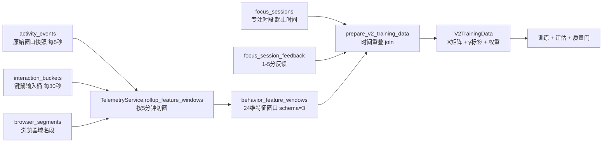
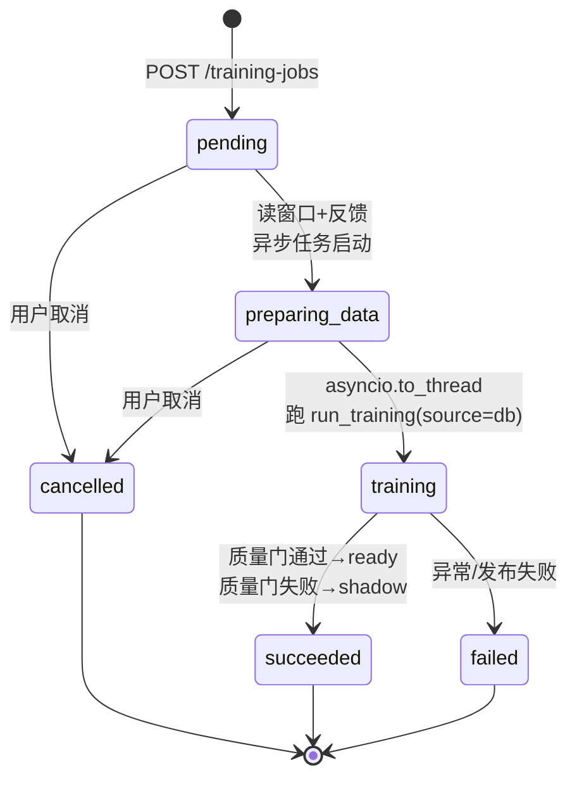

# MindFlow 训练数据来源与特征工程（03）

> 目标读者：**从未写过项目的人**。读完本章，你应该能说清楚：MindFlow 的模型**到底拿什么数据训练、标签从哪来、每个特征怎么算出来、数据不够时怎么办**。
> 对应源码：`backend-next/src/mindflow/train/`、`backend-next/src/mindflow/services/training_*_service.py`。

---

## 3.1 一个比喻先立住全局

把 MindFlow 的模型训练想成**医院积累病历、训练诊断模型**：

- **原始事件**（`activity_events`）＝ 病人身体上每秒钟发生的生理信号：心电、血压、血氧。零散、海量、还没解读。
- **特征窗口**（`behavior_feature_windows`）＝ **每 5 分钟抽一次血化验**，把一大堆原始信号浓缩成一张化验单（24 项指标：切换次数、键盘频率、娱乐占比……）。模型不直接读原始信号，只读化验单。
- **标签**（`focus_session_feedback`）＝ **医生的诊断结论**：这个时段你到底是"专注"（1）还是"分心"（0）。没有诊断结论的血样只是一堆数字，学不出"什么样子叫生病"。
- **训练** ＝ 把几千张"化验单 + 诊断结论"喂给算法，让它学会"看到这组指标，就判断该打 0 还是 1"。
- **训练就绪度（7 道质量门）** ＝ 医院评审"这堆病历够不够支撑开一项研究"：样本太少不行、只有一种病不行、时间跨度太短不行。

训练的本质可以一句话概括：**把"电脑使用行为"翻译成数字（特征），再拿"用户亲口承认的专注/分心"（标签）去教模型认这些数字的规律**。下面逐节拆开。

---

## 3.2 数据链条全景：原始事件 → 特征窗口 → 标签

整条链是单向流水线，每一步都在 `backend-next/src/mindflow/services/telemetry_service.py` 的 `rollup_feature_windows()`（`telemetry_service.py:252`）里完成。用一张图看：



**三张输入表**（都在 `backend-next/alembic/versions/0001_create_core_tables.py`、`0007_create_telemetry_tables.py` 里建表）：

| 表 | 建表位置 | 内容 | 谁写它 |
|----|---------|------|--------|
| `activity_events` | `0001:34` | 前台窗口快照：`timestamp`、`duration_s`、`data_json`（内含 process_name、window_title、is_idle） | 采集器每 5 秒 |
| `interaction_buckets` | `0007:22` | 键鼠统计：keypress_count、mouse_click_count、scroll_delta、input_active_s 等 | 键鼠采集器每 30 秒 |
| `browser_segments` | `0007:44` | 浏览器域名段：domain、audible（是否出声）、duration_s | 浏览器扩展 |

**一张训练样本表**（`0007:93`）：

`behavior_feature_windows`——列有 `user_id`、`window_start_utc`、`window_end_utc`、`feature_schema_version`、`features_json`（24 维特征的 JSON）、`label`（预留，训练时不读它）。主键之外还有个三列唯一约束 `(user_id, window_start_utc, feature_schema_version)`，保证同一个用户同一分钟不会重复 rollup。

**一张标签表**（`0007:63`）：

`focus_session_feedback`——列有 `user_id`、`session_id`（关联 `focus_sessions.id`）、`label`（focus / distracted / mixed）、`score`（1–5 整数）、`task_type`。注意它**不存时间段**，时间段在 `focus_sessions` 表（`0001:49`，有 `start_time` / `end_time`）。

### 3.2.1 rollup：原始信号怎么变成化验单

`rollup_feature_windows()`（`telemetry_service.py:252`）做四件事：

1. 查出这一段时间的原始事件、键鼠桶、浏览器段，并**把窗口边界上一个跨窗口的事件也接进来**（`telemetry_service.py:262`），避免切窗把事件腰斩。
2. 按 **5 分钟对齐**切窗（`telemetry_service.py:299`：`minute=(minute//5)*5`）。
3. 每个窗口调用 `build_v2_feature_window()`（`telemetry_features.py:19`），把窗口内所有事件/桶/段聚合成 24 维数值。
4. `upsert_feature_windows()` 写库，并在**同一个数据库事务里**更新个人基线（`telemetry_service.py:370-390`）——窗口入库和基线刷新要么一起成功要么一起失败，绝不留一半。

### 3.2.2 没有 SQL join，是"时间重叠" join

训练时（`prepare_v2_training_data`，`train/v2.py:66`），**不是用 SQL 把两张表 join 起来**，而是**按时间段判断重叠**：

```python
# train/v2.py:352
def _overlap_seconds(s1, e1, s2, e2):
    return max(0.0, (min(e1, e2) - max(s1, s2)).total_seconds())
```

逻辑是：对每个 5 分钟特征窗口，遍历所有带起止时间的反馈会话，**只要窗口与某个反馈会话有超过 0 秒的时间重叠，就认为这条反馈"标注"了这个窗口**（`train/v2.py:111-116`）。也就是说：

- 训练样本 = `behavior_feature_windows` 里的每一条窗口；
- 标签 = 与窗口时间重叠的 `focus_session_feedback`（再经 `focus_sessions` 补上起止时间）；
- 一条窗口重叠了反馈 → 显式样本；没重叠 → 走弱监督路径（见 3.4）。

为什么不用 SQL join？因为窗口是"切"出来的 5 分钟块，而用户反馈的是一次**任意时长**的专注时段（可能是 47 分钟），两者天然是"谁和谁有时间交集"的关系，不是外键相等的关系。这个设计在 `training_readiness_service.py:3` 的注释里也写明：就绪度评估复用同一套时间重叠语义，保证"训练前评估"和"真正训练"看到的匹配结果完全一致。

---

## 3.3 特征：24 维化验单（schema v3）

特征集合的权威定义在 `backend-next/src/mindflow/domain/feature_schema.py`：

```python
# feature_schema.py:12-13
FEATURE_SCHEMA_VERSION = 3          # 特征 schema 版本号，现在是 3
V2_FEATURE_NAMES = ( ... )          # 24 个特征名，顺序即训练矩阵列序
```

> **命名小坑**：特征集合名叫 `V2_FEATURE_NAMES`，但 schema 版本号已是 `3`（`feature_schema.py:12`）。也就是说"V2"指**这套 24 维特征设计**，而"3"指**存进 `behavior_feature_windows.feature_schema_version` 列的版本号**。你在 README、CLAUDE.md 里看到"v2 特征窗口"和"schema v3"是同一个东西，别被两个名字绕晕。

特征由 `build_v2_feature_window()`（`telemetry_features.py:19`）计算，**分为四组**：

### A. 行为特征（窗口里切换了什么、用了什么）

| 特征 | 含义 | 怎么算（`telemetry_features.py` 行号） |
|------|------|--------------------------------------|
| `app_switch_count` | 确认的前台应用切换次数 | `count_confirmed_switches()`（`:44`），见下方"防抖" |
| `domain_switch_count` | 浏览器域名切换次数 | 相邻浏览器段域名不同的次数（`:59`） |
| `longest_segment_ratio` | 最长连续单应用占比 | 最长的单个应用停留秒数 ÷ 窗口秒数（`:105`） |
| `idle_ratio` | 空闲占比 | 空闲秒数 ÷ 总事件秒数（`:106`） |
| `active_seconds_ratio` | 活跃占比 | 非空闲秒数 ÷ 窗口秒数（`:116`） |
| `top_app_ratio` | 头号应用占比 | 占用最久的应用的秒数 ÷ 活跃秒数（`:117`） |
| `top_domain_ratio` | 头号域名占比 | 同上，针对浏览器域名（`:118`） |

### B. 键鼠交互特征（手有多"忙"）

| 特征 | 怎么算（行号） |
|------|--------------|
| `keypress_rate_per_min` | 按键总数 ÷ 窗口分钟数（`:107`） |
| `mouse_click_rate_per_min` | 鼠标点击数 ÷ 分钟（`:108`） |
| `scroll_rate_per_min` | 滚动量 ÷ 分钟（`:109`） |
| `mouse_distance_per_min` | 鼠标移动像素 ÷ 分钟（`:110`） |
| `input_active_ratio` | 有键盘/鼠标输入的时间 ÷ 窗口秒数（`:111`） |
| `interaction_bursts_per_min` | 输入爆发次数 ÷ 分钟（`:112`） |
| `click_key_ratio` | 鼠标点击 ÷ 按键（`:113`） |
| `interaction_interval_mean_s / _std_s / _cv` | 相邻有输入的时间桶的间隔均值/标准差/变异系数（`:171`） |

### C. 浏览器特征（在刷什么）

| 特征 | 怎么算（行号） |
|------|--------------|
| `browser_ratio` | 浏览器活跃秒数 ÷ 窗口秒数（`:114`） |
| `audible_browser_ratio` | 有声音的浏览器秒数 ÷ 浏览器秒数（`:115`）——刷视频通常出声 |

### D. 时间特征（现在是几点、周几）

| 特征 | 怎么算（行号） |
|------|--------------|
| `hour_sin` / `hour_cos` | 把"几点"编码成周期量（`:124`） |
| `weekday_sin` / `weekday_cos` | 把"周几"编码成周期量（`:126`） |
| `task_type_code` | 任务类型编号，预留占位，当前恒为 0（`:128`） |

### 3.3.1 关键细节：切换计数为什么要"防抖"

`app_switch_count` 不是简单数"进程名变了多少次"，而是走 `count_confirmed_switches()`（`domain/features.py:223`）。它有两个防抖规则：

1. **驻留阈值 `min_dwell_s = 10` 秒**（`domain/features.py:42`）：新进程必须**在前台停留满 10 秒**才算一次"真实切换"。你在 VS Code 里快速按 Alt+Tab 弹一下又弹回来，不会把切换数刷爆。
2. **忽略系统瞬时进程**（`domain/features.py:44`）：`explorer.exe`、`ApplicationFrameHost.exe`、`SearchHost.exe` 这类 Windows 常驻壳进程被直接跳过，因为它们会反复冒头干扰计数。

这两个规则是 2026-07-31 特征升级到 v3 时的核心改动（见 CLAUDE.md），目的只有一个：**让"切换频率"真正反映注意力漂移，而不是反映操作系统的噪音**。复刻时最容易漏的就是这条——不做防抖，模型会把"系统弹窗"误判成"疯狂分心"。

### 3.3.2 为什么只有 24 维 V2 特征？

V1 的 17 维、30 分钟 `BehaviorFeatureExtractor` 已随 cutover 删除。现在训练与在线推理共用 `V2_FEATURE_NAMES` 定义的 24 维、5 分钟 schema-v3 特征，不再维护第二套特征词表。

---

## 3.4 标签：显式反馈 vs 弱监督

### 3.4.1 显式标签：用户亲手打的 1–5 分（金标准）

用户结束一段专注计时后，会评价"刚才这段专注吗？"，存进 `focus_session_feedback`。**1–5 分怎么变成二分类标签**？看 `train/v2.py:327`：

```python
# train/v2.py:327
label = None if (label_name == "mixed" or score == 3)
        else (1 if score >= 4 else 0 if score <= 2 else None)
```

| score | label_name | 二分类 y | 含义 |
|-------|-----------|---------|------|
| 4–5 | focus | **1** | 专注 |
| 1–2 | distracted | **0** | 分心 |
| 3 | mixed | **None（剔除）** | 说不清，弃用 |

人话：**用户说"很专注"（4/5 分）就标 1，说"很分心"（1/2 分）就标 0，说"一半一半"（3 分）就整条丢掉**。这些显式样本是训练的最高优先级信号。

### 3.4.2 弱监督标签：行为启发式"伪标签"（凑数用的）

只有显式反馈远远不够——用户一天才点几次反馈，而系统每分钟都在产生特征窗口。对**没被任何反馈覆盖的窗口**，`prepare_v2_training_data` 会调 `_weak_label()`（`train/v2.py:364`）用规则猜一个标签：

```python
# train/v2.py:364-375（逻辑）
if idle_ratio > 0.8:  return -1      # 太闲 → 说不清，弃用
if app_switch_count > 20: return 0   # 疯狂切换 → 分心
if (top_app_ratio > 0.7 and input_active_ratio > 0.3) \
   or (app_switch_count < 5 and top_app_ratio > 0.5): return 1  # 专注
return -1                            # 其余 → 弃用
```

人话规则：**窗口内几乎全空闲 → 弃用；切了 20 次以上应用 → 分心；一直在用同一个应用且手上有输入 → 专注。**

V1 的六信号 `ConsensusLabeler` 已删除。现役弱标签只有 `train/v2.py:_weak_label`，且 `_run_v2_training` 最终只用显式反馈样本拟合模型。

> **诚实说明（初学者最容易误解的一点）**：尽管代码为未覆盖窗口算了弱标签、还给了 0.3 的样本权重（`v2.py:136`），但**真正喂给模型训练的只有显式反馈样本**——`_run_v2_training` 里用 `explicit_mask` 把所有弱标签样本过滤掉了（`pipeline.py:179-182`），评估也只用显式样本（`v2.py:174`）。弱标签的实际作用有三个：① 识别"说不清"的窗口并剔除；② 记录 `mixed_window_count` 供诊断；③ 为将来做半监督学习留好接口。**当前版本不会拿用户没确认过的伪标签去训练**——这是刻意的严谨，不是疏漏。

---

## 3.5 训练就绪度：7 道质量门

启动训练前，系统先做"数据够不够"评估，接口是 `GET /api/v1/analytics/training-readiness`，逻辑在 `training_readiness_service.py`。它复用 3.2.2 那套时间重叠匹配，得出 `V2TrainingData` 后逐项查门（`training_readiness_service.py:131`）：

| # | 门（key） | 检查什么 | 阈值（readiness 服务） |
|---|----------|---------|----------------------|
| 1 | `minimum_days` | 显式反馈覆盖了几天 | ≥ 1 天 |
| 2 | `minimum_explicit_feedback` | 显式反馈**会话数**（按 session 去重，不是窗口数） | ≥ 20 |
| 3 | `minimum_class_feedback` | 两个类别都要有：专注 ≥ 5 且 分心 ≥ 5 | 专注≥5、分心≥5 |
| 4 | `balanced_accuracy` | 训练后的平衡准确率 | ≥ 0.50 |
| 5 | `minority_f1` | 少数类 F1 | ≥ 0.30 |
| 6 | `calibration_better_than_rule` | 校准（Brier 分数）优于规则引擎 | 需训练报告证据 |
| 7 | `stable_date_folds` | 按日期分折评估稳定 | 需训练报告证据 |

其中第 4–7 项在**还没跑训练之前**根本无法评估，所以状态是 `not_evaluated` / `not_implemented`，`passed: false`，并生成 `blocker_code`（如 `metric_not_evaluated`）。这些 blockers 会出现在响应里（`training_readiness_service.py:311`），前端据此告诉用户"还缺什么"。

**不满足会怎样？** 两个层面：

- **只差数据**（trainable=False）：调 `POST /api/v1/analytics/training-jobs` 会收到 `412 Precondition Failed`（见 `docs/api/model-training.md`），携带 blockers（如"符合条件的窗口不足（当前 3，需要 10）"）。
- **数据够了但模型不够格**：训练照跑，但**训练后还有另一套更严的质量门**（`train/v2.py:289` `evaluate_v2_quality_gate`）——注意它和 readiness 门**阈值不同**：要求显式反馈天数 ≥ 7、反馈会话 ≥ 20、专注/分心各 ≥ 5、平衡准确率 ≥ 0.55、少数类 F1 ≥ 0.40、Brier 不差于规则引擎、日期折叠稳定。**这套门不通过，模型就只能进"影子模式"（shadow）被观察，不会顶替线上模型**（详见 3.7）。

两套门的关系人话版：**readiness 门 = 医院检查"病历够不够做研究"；训练后质量门 = 论文评审"结果能不能发表/上线"。前者管数据，后者管模型，缺一不可。**

---

## 3.6 合成数据：30 个"标准病人"生成假病历

真实用户刚开始用时，几乎没有反馈标签——**冷启动**问题。MindFlow 的解法是 `synthetic_v2.py`：造出逼真的"假用户数据"来先把管线跑通、把模型训出个基础版。

### 3.6.1 人物设定：30 个大学生画像

`user_profiles.py` 定义了 **30 个学生画像 = 5 个年级（大一～研二）× 6 个专业（计算机、电子、人文、经管、设计、医学）**（`user_profiles.py:821`）。每个画像是一个 `StudentArchetype`（`user_profiles.py:25`），记录：

- **作息**：典型起床/睡觉时间、周末赖床几小时、作息规律度（大一 0.85 很规律，研二 0.25 很随性，见 `user_profiles.py:583` 的年级参数表）；
- **应用生态**：每个时段的常用 App 和权重（CS 学生上午是 VSCode/PyCharm，医学生早上是 Anki 刷卡片，见 `_cs_apps()`/`_medical_apps()` 等）；
- **拖延倾向**：每天拖延概率、偏好哪种拖延方式、周末拖延倍数。

画像还预置了 **6 种拖延发作类型**（`user_profiles.py:91` `EPISODES`）：

| 发作类型 | 典型 App | 特点 |
|---------|---------|------|
| binge_watching（追剧） | B站/YouTube/爱奇艺 | 晚上 19 点后，1.5–5 小时 |
| doom_scrolling（刷屏） | 微博/抖音/知乎 | 随时可能，切换频率高达 12 次/小时 |
| gaming_session（打游戏） | Steam/原神/LOL | 仅周末，1–6 小时 |
| social_media_spiral（社交漩涡） | 微信/QQ/微博 | 切换频率 10 次/小时 |
| inspiration_browsing（假装找灵感） | Pinterest/Behance | 设计师专属高发 |
| crash_and_burn（彻底摆烂） | B站+抖音+Steam 混着来 | 3–8 小时，医学生高发 |

### 3.6.2 怎么生成逼真数据

`generate_v2_synthetic_data()`（`synthetic_v2.py:555`）对每个画像跑 `days_per_archetype` 天（默认 14 天），每天生成 **288 个 5 分钟窗口**（24h × 12）。流程（`synthetic_v2.py:200` `_compute_daily_patterns`）：

1. 按画像参数决定今天是否拖延、拖哪种（`synthetic_v2.py:217-227`）；
2. 每天按"睡眠 / 拖延发作 / 生产力时段 / 周末休闲"四种状态给每个 5 分钟窗口赋特征（`_generate_window_features`，`synthetic_v2.py:319`）——比如睡眠窗口 `idle_ratio` 采样 0.85–1.0，拖延窗口切换次数按 `expected_switch_frequency_mean` 的正态分布采样；
3. 用专业相关的**交互参数**（CS 键盘多、设计鼠标多，见 `synthetic_v2.py:34` 的 `_INTERACTION_PROFILES`）乘以状态系数，造出"像真人"的键鼠数字；
4. **打标签**（`_compute_label`，`synthetic_v2.py:487`）：拖延发作窗口以 85% 概率标"分心"，生产力窗口以 80% 概率标"专注"，另有 5% 随机翻转为标签噪音——**故意掺入噪音**，让合成数据不像假数据那么"完美"；
5. 取 30% 的窗口生成显式反馈条目（`sample_explicit_ratio=0.3`，`synthetic_v2.py:612`），让下游训练质量门（要求 ≥ 7 天、≥ 20 条反馈）在合成数据上也能跑通。

V1 原始事件级合成器已删除；现役 `synthetic_v2.py` 直接生成可供训练使用的 V2 特征窗口与反馈。

### 3.6.3 为什么必须有它

- **冷启动**：新用户/新环境没有任何反馈，但训练管线必须可运行、可测试、可演示；
- **验证质量门**：合成数据天然满足"≥7 天、双类别、有分布"，用来跑通从准备数据到激活模型的整条链路（CLAUDE.md 提到训练命令 `uv run python -m mindflow.train --source synthetic_v2`）；
- **基线对照**：训练方法评估里需要"规则引擎 vs 逻辑回归 vs 集成模型"三套基线对照，合成数据提供稳定、可复现的输入。

**代价（必须知道）**：合成数据再逼真也是"标准病人"，和真实用户行为有分布偏移（distribution shift）。所以合成数据只用于把管线跑通，**上线决策永远只认真实数据 + 训练后质量门**。

---

## 3.7 数据不足 / 模型不够格：降级链与影子模式

**核心原则：MindFlow 永远可用——ML 只是增强，不是命门。**

ML 预测的契约是 `FocusPrediction`（`domain/prediction.py:31`），它用一个 `status` 字段告诉所有消费方"这份预测能不能信"：

| status | 含义 | 系统怎么办 |
|--------|------|-----------|
| `no_model` | 没加载到模型 | 用规则引擎/启发式打分，见下 |
| `no_data` | 最近 2 小时没有特征窗口 | 无证据可判，交由规则引擎 |
| `stale` | 数据太旧（>15 分钟）或覆盖率不足 | 同上 |
| `schema_mismatch` / `inference_error` | 特征对不上/推理出错 | 同上，绝不崩溃 |

预测服务在 `model_manager is None` 时直接返回 `no_model`（`prediction_service.py:100`），**从不抛异常**——所有失败都收敛成状态值。生产环境里的实际降级链分两条：

1. **ML 层面的降级**（`model_mode` 字段，见 `docs/api/model-training.md`）：
   `rule_engine_only`（无模型）→ 训练出 `shadow`（质量门没过，只观察不启用）→ `ready`（质量门全过，正式上线）。shadow 模式**不替换**当前活跃模型，只更新模式标志（`training_job_service.py:409` `_update_shadow_mode`）。
2. **LLM 分析层面的三级降级**（CLAUDE.md）：L1 DeepSeek（要 key）→ L2 本地 Ollama → L3 纯规则引擎（永远可用）。这是"本地优先 + 永远可用"的最后一道保险。

所以"模型没训练好"并不可怕：**日常的干预判定、每日分析、专家会诊都不依赖 ML 模型存活**，ML 只是给它们提供一份"统计证据"（且证据永远标注为统计性、非因果，见 `domain/prediction.py:8`）。

---

## 3.8 训练作业生命周期：一个后台任务的状态机

手动触发训练走 `TrainingJobService`（`training_job_service.py`），一次训练就是一个有状态的后台任务：



关键机制（全部在 `training_job_service.py`）：

- **每进程最多一个训练任务**：`asyncio.Lock` 守护（`training_job_service.py:134`），并发起第二个任务返回 409。
- **状态推进**：`pending` → `preparing_data`（从库读窗口 + 反馈，拼出 `feedback_with_times`，`training_job_service.py:283-306`）→ `training`（把 CPU 密集的 `run_training` 丢进线程池 `asyncio.to_thread`，`training_job_service.py:316`，不阻塞事件循环）→ `succeeded` / `failed`。
- **取消窗口**：只在 `pending` / `preparing_data` 可取消；一进入 `training`，取消被拒绝（409），因为后台线程可能已经在 `save_all(activate=True)` 写激活制品了（`training_job_service.py:12` 注释讲得很清楚）。
- **发布失败 == 训练失败**：如果质量门通过、`model_mode == "ready"`，但把新模型挂到 `app.state.v2_model_manager` 失败，抛 `PublicationError`，任务状态是 `failed` 而非 `succeeded`（`training_job_service.py:334-341`、`:348`）。
- **任务状态是内存态**：`_current: _JobState | None` 只活在进程内存里（`training_job_service.py:135`），进程重启后看不到历史任务——CLAUDE.md 里明确写了这条 caveat。

`run_training()` 本身（`pipeline.py:73`）是纯函数式入口：`source="synthetic_v2"` 生成数据跑通管线，`source="db"` 读真实窗口训练。两种来源最终都汇入 `_run_v2_training()`（`pipeline.py:164`）：准备训练数据 → 显式样本切分 → `evaluate_v2_candidates` 做按日期分组的交叉验证 → `evaluate_v2_quality_gate` 判定是否激活 → `ModelManager.save_all(activate=...)` 落盘带版本号的模型文件（`train-*.pkl`）+ 写一份 `training_report.json`。

---

## 3.9 给复刻者的最小骨架

如果你要从零复刻"训练数据"这一层，顺序是：

```
1. 建表：activity_events / interaction_buckets / browser_segments / behavior_feature_windows / focus_sessions / focus_session_feedback（照 0001、0007 迁移抄）
2. 切窗：写一个 5 分钟对齐的 rollup，把原始事件聚成 24 维特征 JSON
3. 防抖：实现 count_confirmed_switches（驻留 10 秒 + 忽略瞬态进程）
4. 标签：反馈 1-5 分 → 1/0/None；未覆盖窗口用 _weak_label 兜底
5. 匹配：时间重叠 join 窗口与反馈，产出 (X, y, weight)
6. 就绪度：统计 7 项门（天数/反馈数/类别数 + 4 项训练后指标）
7. 合成数据：画像 + 拖延发作 → 生成窗口和反馈，用于跑通管线
8. 作业：asyncio.Lock 单任务 + 状态机，CPU 训练丢 to_thread
```

每步对应本章一个小节，遇到"为什么这样设计"回看 3.2–3.8 的比喻即可。

---

## 3.10 本章要点速记

- **训练样本 = `behavior_feature_windows`（5 分钟 × 24 维特征）**；**标签 = `focus_session_feedback`（1–5 分映射成 1/0）**；二者靠**时间重叠**配对，不是 SQL join。
- 特征分四组：行为、键鼠交互、浏览器、时间。切换计数必须防抖（驻留 10s + 忽略瞬态进程），否则模型被系统噪音污染。
- 显式反馈是金标准；V2 `_weak_label` 只做兜底和剔除"说不清"窗口，**当前训练只用显式样本**。
- 两套门：训练前 **readiness 7 门**管数据充分性（不够 → 412）；训练后 **质量门**管模型够不够格（不过 → shadow 不激活）。
- 合成数据（30 画像 × 6 拖延类型）解决冷启动，但**上线只看真实数据 + 质量门**。
- 没模型不可怕：`FocusPrediction` 用 status 表达一切异常，系统回落到规则引擎，永远可用。
- 训练作业状态机：`pending → preparing_data → training → succeeded/failed`，仅前两态可取消，发布失败即失败。
