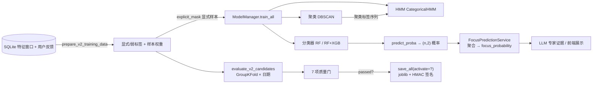

# 第 04 章 ML 训练方法与模型

> 目标读者：**从未写过项目的人**。读完本章应能回答：MindFlow 到底训练了什么模型？每个模型内部是什么算法、优化什么目标？质量门怎么算？以及**如何在自己机器上复刻这套训练**。
> 前置：`03-training-data.md`（特征窗口与标签从哪来）；后续衔接：`05-langgraph.md`（ML 输出作为 LLM 证据）。
> 本章所有算法论断均来自 `backend-next/src/mindflow/train/` 与 `services/prediction_service.py` 源码，并标注 `file:line`。

---

## 4.1 一句话定位

MindFlow 不是"一个大模型"，而是 **4 类可解释的经典机器学习模型 + 1 套诚实的质量门**，全部本地训练、本地推理：

| 模型 | 文件 | 用途 | 有无监督 |
|------|------|------|---------|
| 分类器（RF / RF+XGB 集成） | `train/models/classifier.py`、`ensemble.py` | 判断"这个 5 分钟窗口是专注还是分心" | 监督（显式反馈标签） |
| 行为聚类（DBSCAN / KMeans） | `train/models/clustering.py` | 把行为模式聚成 5 种状态（深专注/浅工作/浏览/拖延/空闲） | 无监督 |
| 状态转移 HMM（CategoricalHMM） | `train/models/hmm.py` | 学习状态之间"今天会怎样转移"的概率 | 无监督（拟合聚类标签序列） |
| 逻辑回归基线 | `train/v2.py`（评估用） | 只用来当"及格线"，不参与上线 | 监督 |

训练管线把这三类模型**一次 `train_all()` 全部训好**，`ModelManager` 统一管理版本、签名、加载。推理时真正上线的是**分类器的 `predict_proba` 概率**（第 4.8 节），聚类和 HMM 更多是"行为画像"与状态推断，供报告和解释使用。

#### 图 4-1：训练与推理全链路



---

## 4.2 训练数据长什么样：先看喂进去的"表格"

训练不是拿原始事件直接训，而是先 rollup 成**固定 24 列的特征窗口**（`src/mindflow/domain/feature_schema.py:15-40` 定义了唯一的 24 列词汇表）：

| 列号 | 特征名 | 含义（一句话） | 列号 | 特征名 | 含义 |
|:--:|------|------|:--:|------|------|
| 0 | `app_switch_count` | 窗口内切换应用次数 | 12 | `audible_browser_ratio` | 有声浏览器占比 |
| 1 | `domain_switch_count` | 切换域名次数 | 13 | `active_seconds_ratio` | 有活动秒数占比 |
| 2 | `longest_segment_ratio` | 最长连续段占比 | 14 | `top_app_ratio` | 最常用应用占比 |
| 3 | `idle_ratio` | 空闲时间占比 | 15 | `top_domain_ratio` | 最常用域名占比 |
| 4 | `keypress_rate_per_min` | 每分钟按键数 | 16 | `interaction_interval_mean_s` | 交互间隔均值(s) |
| 5 | `mouse_click_rate_per_min` | 每分钟点击数 | 17 | `interaction_interval_std_s` | 交互间隔标准差 |
| 6 | `scroll_rate_per_min` | 每分钟滚动数 | 18 | `interaction_interval_cv` | 交互间隔变异系数 |
| 7 | `mouse_distance_per_min` | 每分钟鼠标位移 | 19 | `hour_sin` | 小时的正弦编码 |
| 8 | `input_active_ratio` | 有输入活动占比 | 20 | `hour_cos` | 小时的余弦编码 |
| 9 | `interaction_bursts_per_min` | 交互爆发次数/分 | 21 | `weekday_sin` | 星期的正弦编码 |
| 10 | `click_key_ratio` | 点击/按键比值 | 22 | `weekday_cos` | 星期的余弦编码 |
| 11 | `browser_ratio` | 浏览器时间占比 | 23 | `task_type_code` | 任务类型编码(0-10) |

**标签怎么来**（详见 `03-training-data.md`）：用户对"这段时间我专注吗"打 1-5 分的反馈，按**时间重叠**（`_overlap_seconds > 0`，`v2.py:352-353`）匹配到特征窗口上——反馈得分 `>=4 → 标签 1（专注）`，`<=2 → 标签 0（分心）`，`=3 或 mixed → 无标签`（`v2.py:327`）。有显式标签的窗口权重为 `1.0`；没有反馈的窗口用一个 3 条规则的弱监督函数打"弱标签"，权重只有 `0.3`（`v2.py:121-136`）：

```python
# _weak_label，3 条启发式  [v2.py:364-375]
if idle > 0.8:            return -1   # 太闲，判"混合"，后续会被丢弃
if app_switch_count > 20: return 0    # 疯狂切换 → 分心
if (top_app_ratio > 0.7 and input_active_ratio > 0.3) \
   or (app_switch_count < 5 and top_app_ratio > 0.5):
    return 1                          # 长时间停留一个应用 → 专注
return -1                             # 拿不准 → 混合，丢弃
```

> **重要发现（务必知道）**：虽然 `prepare_v2_training_data` 算了弱标签，但 V2 训练管线在 `pipeline.py:177-186` 用 `explicit_mask` **只取显式样本**喂给训练和评估。也就是说**弱标签在这个版本实际没进训练**——它只影响就绪度报告里的统计量。复刻时你可以暂时忽略弱标签，把精力放在"让用户反馈天数足够多"上。

---

## 4.3 模型一：专注/分心分类器

### 4.3.1 用什么算法、什么参数

代码里有两个分类器类，接口完全一样，`ModelManager` 按是否装了 xgboost 二选一：

**`FocusClassifier`**（`classifier.py:24-26`）：scikit-learn 的 `RandomForestClassifier`

```python
self.model = RandomForestClassifier(
    n_estimators=100, max_depth=10, random_state=42, n_jobs=-1
)
```

**`EnsembleClassifier`**（`ensemble.py:42-52`）：随机森林 + XGBoost，软投票集成

```python
_RF_PARAMS = {"n_estimators": 100, "max_depth": 10, "random_state": 42, "n_jobs": -1}
_XGB_PARAMS = {
    "n_estimators": 100, "max_depth": 6, "learning_rate": 0.1,
    "objective": "binary:logistic", "random_state": 42, "verbosity": 0,
}
```

**软投票**就是"两个模型各自输出一个概率，取平均"（`ensemble.py:115-119`）：

```python
return (rf_proba + xgb_proba) / 2.0   # 逐元素平均 → argmax 得最终类别
```

如果没装 xgboost，`EnsembleClassifier` 自动退化成"只有随机森林"（`ensemble.py:58-63`），`predict`/`predict_proba` 依然正常工作——这是全项目"永远可用"哲学的又一次体现。

**标准化**：每个分类器都带一个 `StandardScaler`，训练时 `fit_transform`、推理时 `transform`（`classifier.py:49,56`）。24 维特征里既有"次数"又有"占比"，量纲差异大，树模型其实不太需要标准化，但保留 scaler 让特征贡献可比较，也为逻辑回归基线复用同一套预处理。

### 4.3.2 优化什么目标（损失函数）

- **随机森林**：代码没有显式指定 `criterion`，因此用的是 sklearn 默认 **`criterion="gini"`**。每棵树在每个节点贪心选择"让 Gini 不纯度下降最多"的特征切分；森林把 100 棵树（每棵只在随机特征子集、随机样本上训练）的投票平均。它没有单一的全局可微损失——目标是"通过递归切分把节点纯度最大化"，等价于最小化分类错误/不纯度。
- **XGBoost**：`objective="binary:logistic"` 明确指定优化**二元对数损失（log loss / 二元交叉熵）**
  `L = -[y·log(p) + (1-y)·log(1-p)]`，用梯度提升（每轮加一棵树拟合负梯度）最小化它。
- **软投票集成**：没有自己的损失——它只是把两个模型的概率取平均，相当于假设两个模型独立、误差互补。

> 知识卡片（sklearn 文档事实）：`RandomForestClassifier` 默认 `criterion='gini'`；`XGBClassifier` 的 `objective='binary:logistic'` 意味着内部优化的度量是 `logloss`。

### 4.3.3 输入输出与样本量

| 项目 | 值 |
|------|-----|
| 输入 X | `(n_samples, 24)` 浮点矩阵，列序必须等于 `V2_FEATURE_NAMES` |
| 标签 y | `(n_samples,)` 整数，`1=专注`，`0=分心` |
| `predict` 输出 | `(n_samples,)` 类别标签 |
| `predict_proba` 输出 | `(n_samples, 2)`，第 1 列是"分心"概率，**第 2 列是"专注"概率** |
| 最少训练量 | 代码硬门槛：`>= 2` 个类别 **且** `>= 10` 个样本（`manager.py:165`） |

### 4.3.4 生活比喻

> 随机森林 = **召集 100 个"刚看完同一批证据的陪审员"，每人随机只看了部分特征，各自举手投票，最后少数服从多数**。XGBoost = 一个"会从错误中学习的学生"：先猜一遍，把猜错的重重标记，下一轮专门学错题，100 轮下来越来越准。集成软投票 = **两个独立老师给同一份卷子各打一个"像不像专注"的分数，最后取平均**——一个老师看走眼时，另一个还能兜住。

---

## 4.4 模型二：行为模式聚类

### 4.4.1 用什么算法、什么参数

`BehaviorClustering`（`clustering.py:31-56`），默认 `method="dbscan"`，可选 `"kmeans"`：

```python
# DBSCAN：eps 和 min_samples 都是自动算的  [clustering.py:49-53]
eps = max(0.5, sqrt(n_features) * 0.5)          # 24 维 → eps=2.45
min_samples = max(3, int(len(X) * 0.02))        # 样本数 2% 但至少 3
self.model = DBSCAN(eps=eps, min_samples=min_samples, metric="euclidean")

# KMeans（降级分支）：簇数 = sqrt(样本数)，封顶 5  [clustering.py:55-56]
n_clusters = min(5, max(2, int(sqrt(len(X)))))
self.model = KMeans(n_clusters=n_clusters, random_state=42, n_init=10)
```

DBSCAN 不需要预先指定簇数，靠"密度"发现任意形状的簇，还能把离群点标成 `-1`（噪声）——很适合行为数据里"今天特别乱"的异常时段。auto-eps 的思路：高维空间里点与点距离变大，`eps` 随维数开方放大。

**簇的"命名"是事后根据质心特征打上的**：先按 `_compute_focus_score(质心)` 给每个非噪声簇算一个 0~1 的专注分（`clustering.py:110-135`，比例特征加权求和），再按分数从高到低排，依次贴上 `deep_focus → shallow_work → browsing → procrastination → idle`（`clustering.py:95-108`）。

### 4.4.2 优化什么目标

- **DBSCAN**：**没有任何损失函数**——它不是优化算法，而是"密度连通"的几何规则：某点周围 `eps` 半径内超过 `min_samples` 个点就成簇，孤立点算噪声。这也是它能找出"异常时段"的原因。
- **KMeans**（降级分支）：内部用 Lloyd 算法最小化 **惯性（inertia）= 簇内平方和** `Σ ||x - μ_c||²`，即让每个点到它所属簇中心距离的平方和最小。

> 知识卡片：DBSCAN 的复杂度最坏 O(n²)；KMeans 是 O(n·k·iter)。样本只有几百个窗口时两者都快到可忽略。

### 4.4.3 输入输出

| 项目 | 值 |
|------|-----|
| 输入 | `(n_samples, 24)` 特征矩阵（无监督，不需要标签） |
| `fit` 返回 | `list[BehaviorCluster]`（`cluster_id, label, centroid_features, sample_count, avg_focus_score`） |
| `predict` 输出 | `(n_samples,)` 簇 ID；DBSCAN 的预测用"最近质心"近似（`clustering.py:137-157`，因为 DBSCAN 本身不支持 predict） |

### 4.4.4 生活比喻

> DBSCAN = **在一个房间的人群里，谁跟谁站得近就自动聚成一堆，站得特别远的人单独标成"怪人"**。它不需要你事先说"应该有 5 堆"。KMeans = **把人群按"离哪个代表最近"分到几个组，然后不断移动代表直到分法稳定**。

---

## 4.5 模型三：行为状态 HMM

### 4.5.1 用什么算法、什么参数

`BehaviorHMM`（`hmm.py:20-55`），5 个状态：`deep_focus / shallow_work / browsing / procrastination / idle`：

```python
from hmmlearn import hmm
self.model = hmm.CategoricalHMM(
    n_components=self.n_states,   # 5
    random_state=42, n_iter=100, tol=1e-4,
)
self.model.fit(X, lengths)        # X 是 (总观测数,1) 的状态序列，lengths 是每段长度
```

训练数据从哪来：`ModelManager.train_all` 把聚类的标签序列当作 HMM 的观测序列（`manager.py:223-227`）：

```python
def _build_state_sequences(self):
    if self.clustering.labels_ is None or len(self.clustering.labels_) < 2:
        return []
    return [self.clustering.labels_.astype(int)]   # 整条聚类标签序列 = 一个"句子"
```

**降级链**（`hmm.py:39-52`）：hmmlearn 没装 → `model=None`，但 `_compute_transition_matrix` 已经先算好了纯 NumPy 的**马尔可夫转移矩阵**（按相邻状态转移计频、行归一化，`hmm.py:57-76`），照样能预测下一步。取转移概率时三层兜底：hmmlearn 的 `transmat_` → 马尔可夫矩阵 → 均匀分布（`hmm.py:124-137`）。稳态分布用转移矩阵的特征向量算出（`hmm.py:145-155`）。

### 4.5.2 优化什么目标

`CategoricalHMM.fit` 内部跑的是 **Baum-Welch 算法（即 EM / 前向后向算法）**，目标函数是**最大化观测序列在模型下的（边际）对数似然** `log P(观测序列 | A, B, π)`——A 是转移矩阵，B 是发射概率，π 是初始分布。E 步用前向后向算出"每个时刻处于每个隐藏状态"的期望，M 步用这些期望重估 A/B/π，迭代到 `n_iter=100` 或参数变化小于 `tol=1e-4` 停止。

> 需要说明：当前代码用 HMM 时主要取的是 `transmat_`（转移矩阵）来预测"下一个状态是什么"，发射概率的作用不大。这是复刻时可以直接简化的部分。

### 4.5.3 输入输出

| 项目 | 值 |
|------|-----|
| `fit` 输入 | `list[一维数组]`，每个数组是一段状态 ID 序列（0~4 整数） |
| `predict_next_state(s)` | 输入当前状态 ID，输出 `{next_state, probabilities, next_state_name}` |
| 最少观测 | `len(X) >= 10` 才训练 hmmlearn 模型（`hmm.py:43`），否则纯马尔可夫矩阵兜底 |

### 4.5.4 生活比喻

> HMM = **你只能看到一个人每天的"外在表现"（在用哪个软件），想反推他"真实的心理状态"（专注？摸鱼？），并预测他下一秒会切到哪**。CategoricalHMM 学的就是"每种真实状态之间转移的概率"和"每种真实状态产生哪种表现的概率"这两个隐变量模型。马尔可夫降级版 = **只统计"上一个状态 → 下一个状态"的经验频率，不猜隐藏心情**，更粗糙但绝不会失败。

---

## 4.6 训练流程：切分、标准化、类别不平衡

### 4.6.1 整体流程（`pipeline.py` 的 `run_training`）

```
合成/真实特征窗口 + 反馈
  → prepare_v2_training_data（时间重叠匹配 → 显式/弱标签 + 权重）   [v2.py:66]
  → 只取显式样本做训练与评估                                        [pipeline.py:177-186]
  → evaluate_v2_candidates（日期 GroupKFold 交叉验证）               [v2.py:168]
  → evaluate_v2_quality_gate（7 项质量门）                           [v2.py:289]
  → 过门则 ModelManager.train_all（聚类+分类器+HMM 一次训好）         [pipeline.py:200-230]
  → save_all(activate=过门与否) → shadow/ready
```

### 4.6.2 数据切分：**按日期**的 GroupKFold（不随机打乱！）

评估用 `GroupKFold`，**group 是日期字符串**（`v2.py:186-190`）：

```python
groups = np.array(dates)
gkf = GroupKFold(n_splits=min(TRAIN_CONFIG.group_folds, len(unique_dates)))  # group_folds=4
```

为什么要按日期分组而不是随机切？**因为同一用户的相邻窗口高度相关（自相关）**。如果随机切，模型会在"看见邻居"的情况下作弊，测试分数虚高。按日期分组保证**测试集整天的数据训练时完全没见过**——这是"能不能泛化到明天"的诚实考试。

每个 fold 内部都做三件事，且**三个基线都在同一个留出测试集上算**（`v2.py:200-240`）：

| 选手 | 用什么 | 目的 |
|------|--------|------|
| 候选模型 | `EnsembleClassifier`（生产同款） | 我们的正式模型 |
| 逻辑回归基线 | `StandardScaler + LogisticRegression(max_iter=1000, class_weight="balanced")`（`v2.py:222`） | 简单线性模型能否做到 |
| 规则基线 | 3 条规则的 `_rule_probabilities`（`v2.py:378-384`） | 不学习、只查表的下限 |

规则基线的公式（列号对应第 4.2 节表格）：
```
p = 0.5
if app_switch_count < 5:   p += 0.2     # 几乎不切换 → 像专注
if top_app_ratio > 0.7:    p += 0.15    # 80% 时间在同一个 app → 像专注
if app_switch_count > 20:  p -= 0.3     # 疯狂切换 → 像分心
if idle_ratio > 0.8:       p -= 0.1     # 快睡着了 → 像分心
p = clip(p, 0, 1)
```

### 4.6.3 类别不平衡

- 正式分类器：**没有**显式 `class_weight`（RF/XGB 不传）——但训练只用显式反馈样本，而显式反馈天然是"用户愿意评分的窗口"，专注/分心通常都比较均衡。真要失衡时，样本权重（显式=1.0）会让少数类不那么吃亏。
- 逻辑回归基线：显式传了 `class_weight="balanced"`（`v2.py:222`），即按类别频率反比加权，专门防失衡。
- 评估指标也为此选了**对失衡鲁棒**的 `balanced_accuracy`（各类别召回的平均）和**少数类 F1**，而不是普通 accuracy。

### 4.6.4 评估指标（QA 读什么数字）

`_classification_metrics`（`v2.py:387-409`）在每个 fold 的测试集上输出：

| 指标 | 定义 | 门限 |
|------|------|------|
| `balanced_accuracy` | `balanced_accuracy_score` = 各类别 recall 的均值 | `>= 0.55` |
| `minority_f1` | 少数类（样本少的那个类别）的 F1 | `>= 0.40` |
| `brier_score` | Brier 分数 `Σ(p_i - y_i)²/n`，衡量**概率校准**（越小越好） | `<= rule_brier + 0.01` |
| `roc_auc` / `average_precision` | 只当二分类时输出（`v2.py:401-406`） | 参考 |
| `confusion_matrix` | 2×2 混淆矩阵 | 参考 |
| `calibration` | 把 `[0,1]` 分成 10 个桶，每桶算"平均预测概率 vs 实际正例比例"（`v2.py:412-431`） | 参考 |

### 4.6.5 两个关键质量门的具体算法

**`calibration_better_than_rule`**（`v2.py:305`）——"校准优于规则引擎"：
```python
"calibration_better_than_rule": candidate_brier <= rule_brier + 0.01,
```
即候选模型的 Brier 分数必须**不超过规则基线 + 0.01**。逻辑：Brier 惩罚"过度自信"（预测 0.9 但实际是 0 会记大分）。这个门保证：机器学习至少不比"不学习的规则查表"差，才允许上线。

**`stable_date_folds`**（`v2.py:270-275`）——"日期折叠稳定性"：
```python
fold_stability = {
    "passed": bool(
        min_fold_balanced_accuracy >= 0.50      # 最差的那个 fold 也不能低于 0.50
        and (max - min) <= 0.35                  # fold 之间波动不能超过 0.35
        and min_test_size >= 5                    # 每个测试 fold 至少 5 个样本
    ),
}
```
逻辑：即使平均指标好看，如果某一天的数据上模型完全失灵（个别 fold 崩盘），也说明不稳定。这个门用**最差 fold + 波动幅度**惩罚"只在部分日子灵"的模型。

**全部 7 项门**（`v2.py:299-311`）汇总：

| 门 | 阈值 | 防什么 |
|----|------|--------|
| `minimum_days` | 显式反馈天数 `>= 7` | 数据覆盖太少、只有一两天 |
| `minimum_explicit_feedback` | 显式反馈会话数 `>= 20` | 样本量不足统计意义 |
| `minimum_class_feedback` | 专注 `>= 5` 且 分心 `>= 5` | 类别单边倒 |
| `balanced_accuracy` | 候选 `>= 0.55` | 模型整体不行 |
| `minority_f1` | 候选 `>= 0.40` | 少数类被无视 |
| `calibration_better_than_rule` | Brier `<= 规则 + 0.01` | 模型不如规则引擎 |
| `stable_date_folds` | 见上式 | 只在个别日子灵 |

> **文档过期提示**：`docs/api/model-training.md` 里还写着这两个门是 `not_implemented`、schema 还是 v2——那是 2026-07-31 之前的状态。代码（`v2.py:289-311`）已经是**真实现**，特征 schema 也已是 **v3**（`feature_schema.py:13`）。读文档时以代码为准。

---

## 4.7 模型版本管理：joblib + HMAC 签名 + latest.json

`ModelManager`（`manager.py`）是全项目的"模型仓库"。它解决了旧后端"固定文件名导致无法回滚"的 P1 缺陷。

### 4.7.1 版本命名

`save_all` 用一个**时间戳 + 随机后缀**做版本号（`manager.py:101-105,242`），保证同一天训练多次互不覆盖：

```python
tag = datetime.now(UTC).strftime("%Y%m%d_%H%M%S") + "_" + secrets.token_hex(3)
# 例：20260804_153012_ab12cd
```

三个文件分别是 `clustering-{tag}.pkl`、`classifier-{tag}.pkl`、`hmm-{tag}.pkl`。HMM 比较特殊，不存 sklearn 对象，只存 `{transition_matrix, state_names, n_states, is_fitted}` 字典（`manager.py:257-267`）。

### 4.7.2 序列化与安全签名

- 序列化用 **`joblib.dump`**（pickle 的工业版，对 numpy 数组更高效）（`manager.py:254-267`）。
- 每个 `.pkl` 旁写一个 **HMAC-SHA256 签名**文件 `{file}.pkl.hmac`（`serialization.py:86-94`）。加载前**先验签、后 load**（`manager.py:409-417`）：签名缺失或不匹配直接抛 `ModelSignatureError` 拒绝加载。
- 为什么要这么做？pickle 加载=任意代码执行。`models/` 目录是用户可写目录，任何本机进程（或被入侵的浏览器插件）都能往里面丢一个构造好的 `.pkl`，下次加载就中招。HMAC 保证"**只有持有签名密钥的进程写出来的文件才被信任**"（`serialization.py:1-23`）。
- 加载时把 `InconsistentVersionWarning` 当作错误处理——**scikit-learn 版本不匹配的旧模型宁可拒绝也不带病上岗**（`manager.py:419-421,439-441`）。
- 分类器反序列化靠一个 `"__class__": "EnsembleClassifier"` 标记分发到正确的类（`manager.py:426-429`）。

### 4.7.3 latest.json 指针与回滚

```json
{
  "clustering": "clustering-20260804_153012_ab12cd.pkl",
  "classifier": "classifier-20260804_153012_ab12cd.pkl",
  "hmm": "hmm-20260804_153012_ab12cd.pkl"
}
```

`latest.json` 只记录"当前激活的是哪个版本"（`manager.py:290-299`）。回滚 = 把指针改回旧文件名（`manager.py:369-387`），文件本身永不删除。CLI 提供了 `--list-versions` / `--rollback YYYYMMDD`（`__main__.py:297-320`）。

---

## 4.8 推理链路：概率 → 专注分数 → 要不要信

推理的"唯一入口"是 `FocusPredictionService`（`services/prediction_service.py`），所有消费方（LLM 证据、Telemetry API、聊天工具）都用它，保证一致。

### 4.8.1 步骤

1. **取窗口**：拉最近 2 小时（`_LATEST_LOOKBACK_S = 7200`，`prediction_service.py:40`）该用户的 v2 特征窗口。
2. **校验**：构建 `(n,24)` 矩阵，检查 3 件事——列数必须 24、模型 `feature_names_` 必须等于当前 `V2_FEATURE_NAMES`、不允许 NaN/Inf（`prediction_service.py:281-313`）。任一不过就返回对应状态，**绝不抛异常**。
3. **批量推理**：`classifier.predict_proba(matrix)`（`prediction_service.py:322`）→ `(n,2)`，取**第 2 列 = 专注概率**。
4. **聚合**（`prediction_service.py:334-338`）：
   - `focus_probability = mean(专注概率)`  —— 这就是 ML 版的"专注分数"，范围 [0,1]
   - `uncertainty = mean(1 - |2p - 1|)`  —— 越接近 0.5 越没把握，不确定性越高
   - `distracted_window_ratio = mean(p < 0.5)` —— 分心窗口占比
5. **新鲜度判定**（`prediction_service.py:383-388`）：最新窗口太旧（`> STALE_THRESHOLD_S = 900` 秒，`prediction.py:71`）或覆盖率不足（`< MIN_COVERAGE_RATIO = 0.3`，`prediction.py:74`）→ 状态降级为 `stale`。**数据不新鲜时宁可说"过期"也不拿旧结论骗你**。

### 4.8.2 澄清：`calculate_focus_score` 与 ML 概率是两个东西

任务清单里提到的 `calculate_focus_score` 现在叫 **`focus_score`**（`domain/features.py:285-330`），是**规则版、事件级的 0-100 分数**，公式：

```
focus_score = top_app_ratio × 60  +  (1 − switch_penalty) × 40
switch_penalty = min(切换次数/小时 ÷ 30, 1.0)      # MAX_ACCEPTABLE_SWITCHES_PER_HOUR=30
结果裁剪到 [0,100]
```

它用在**规则证据、干预判定**（`evidence_service.py`、`intervention_service.py`）这些不走 ML 的路径。而 **ML 推理输出的是 0~1 的专注概率**（`prediction_service` 的 `focus_probability`）。两者并存：ML 模型没训好时（`no_model` 状态），系统退回规则引擎，依然能给出 0-100 的 `focus_score`——这就是"三层降级"里 ML 层和规则层的分工。

---

## 4.9 从零复刻路径（给初学者）

### 4.9.1 装什么

`backend-next/pyproject.toml:48-55` 列出 ML 依赖：

```
scikit-learn>=1.4      # 随机森林 / DBSCAN / KMeans / 逻辑回归 / StandardScaler / GroupKFold
xgboost>=2.0           # 集成里的 XGBClassifier
hmmlearn>=0.3          # CategoricalHMM
numpy>=1.26            # 张量操作
joblib>=1.3            # 模型序列化
shap>=0.44             # 可选，可解释性（ModelExplainer）
```

最省事的装法（项目用 uv）：

```bash
cd mindflow-app/backend-next
uv sync --extra dev --extra ml          # 一次装齐
```

### 4.9.2 跑什么

```bash
# 1) 先用合成数据验证整条管线（不需要真实数据，约 30 秒）
uv run python -m mindflow.train --source synthetic_v2 --days 14

# 2) 看有哪些模型版本
uv run python -m mindflow.train --list-versions

# 3) 真实数据训练（从 SQLite 读特征窗口 + 反馈）
uv run python -m mindflow.train --source db

# 4) 跑全部测试确认没破坏
uv run python -m pytest tests/ -q
```

合成数据路径会生成 **30 种学生原型**（大一 CS、研三医学…）各 14 天的 5 分钟特征窗口（`synthetic_v2.py`），窗口结构长这样：

```json
{
  "window_start_utc": "2026-07-29T10:05:00+00:00",
  "window_end_utc": "2026-07-29T10:10:00+00:00",
  "feature_schema_version": 3,
  "features": {
    "app_switch_count": 3.0,
    "idle_ratio": 0.05,
    "top_app_ratio": 0.82,
    "hour_sin": -0.59,
    "...其余 24 维省略...": 0.0
  },
  "label": 1
}
```

### 4.9.3 想完全自己写（不抄代码），最小骨架

```python
import numpy as np
from sklearn.ensemble import RandomForestClassifier
from sklearn.preprocessing import StandardScaler
from sklearn.model_selection import GroupKFold

# 1. 特征矩阵 (n, 24) 与标签 (n,)，dates 是同长字符串列表
X = np.random.rand(200, 24)
y = np.random.randint(0, 2, 200)
dates = [f"2026-0{(i % 14)+1:02d}-01" for i in range(200)]

# 2. 按日期分组交叉验证，避免"看见邻居"
gkf = GroupKFold(n_splits=4)
for train_idx, test_idx in gkf.split(X, y, groups=dates):
    model = RandomForestClassifier(n_estimators=100, max_depth=10, random_state=42)
    model.fit(X[train_idx], y[train_idx])
    p = model.predict_proba(X[test_idx])[:, 1]   # 专注概率
    # 记录 balanced_accuracy / brier / minority_f1 ...

# 3. 质量门：只有 brier <= 规则基线+0.01 且 fold 最差>=0.50 才激活
```

### 4.9.4 样本量要求汇总（哪些数字是你复刻时能抄的阈值）

| 位置 | 门槛 | 源码 |
|------|------|------|
| 训练分类器 | `>= 2` 类 且 `>= 10` 样本 | `manager.py:165` |
| 训 HMM | `>= 10` 个观测 | `hmm.py:43` |
| 做评估 | `>= 10` 显式样本 且 `>= 3` 个反馈日 | `v2.py:175-184` |
| 通过质量门 | `>= 20` 显式反馈会话、`>= 7` 天、每类 `>= 5` | `v2.py:299-311` |
| 激活上线 | 全部 7 项门通过 → `mode=ready`，否则 `shadow` | `pipeline.py:214-229` |

---

## 4.10 关键发现与注意事项（写报告的人务必转述）

1. **两个分类器并存**：`FocusClassifier`（纯 RF）是为了兼容保留的；生产 V2 训练 Job 实际用 `EnsembleClassifier`（RF+XGB 软投票）。但 CLI `python -m mindflow.train` 构造 `ModelManager(use_ensemble=False)`（`__main__.py:295`），而服务化训练 `pipeline.py:201` 用 `use_ensemble=True`——**同一命令 CLI 与 Job 训练出的模型可能不同**（CLI 是 RF-only，Job 是集成）。复刻或写文档时不要混为一谈。
2. **弱标签当前未进训练**：`prepare_v2_training_data` 会生成低权重 V2 弱标签，但 `pipeline.py` 只取显式样本；旧 `ConsensusLabeler` 已在 V2 cutover 中删除。
3. **docs/api/model-training.md 已过期**：schema v2 → v3，`calibration_better_than_rule`/`stable_date_folds` 已从 `not_implemented` 变为真实验证（`v2.py:289-311`）。CLAUDE.md 的"Quality gates now implemented (2026-07-31)"与此一致。
4. **`feature_schema.py:12-13` 有重复赋值** `FEATURE_SCHEMA_VERSION = 2; = 3`，最终值是 3（Python 后赋值覆盖前值）。写法不优雅但行为正确。
5. **HMM 的"发射概率"基本没用上**：推理取的是 `transmat_`（转移矩阵）。真正想让 HMM 发威（推断隐藏状态序列），需要接入 `predict`/`decode` 接口——这是留给后续的增强点。
6. **模型安全是认真的**：joblib=pickle=任意代码执行，所以有 HMAC 签名 + sklearn 版本校验双重防线。初学者复刻时哪怕先不做签名，也要清楚这个风险面。

## 4.11 可复刻性自检

读完本章后，你应该能回答：

- 分类器用的是 sklearn 的什么类？参数是什么？XGB 的 `objective` 是什么？（`RandomForestClassifier(n_estimators=100, max_depth=10)`；`XGBClassifier(objective="binary:logistic")`）
- 随机森林优化什么？XGB 优化什么？KMeans 呢？HMM 呢？（Gini 不纯度 / 二元 log loss / 簇内平方和 / Baum-Welch 最大化观测对数似然）
- 数据怎么切分？（按日期 GroupKFold，4 折，不随机切）
- 为什么要有 `calibration_better_than_rule` 和 `stable_date_folds`？（前者防止"ML 不如规则引擎"还上线，后者防止"只在部分日子灵"）
- 推理时 `predict_proba` 的第几列是专注概率？（第 2 列，索引 1）
- 模型文件怎么防篡改？（HMAC-SHA256 签名 + 版本一致性校验）
