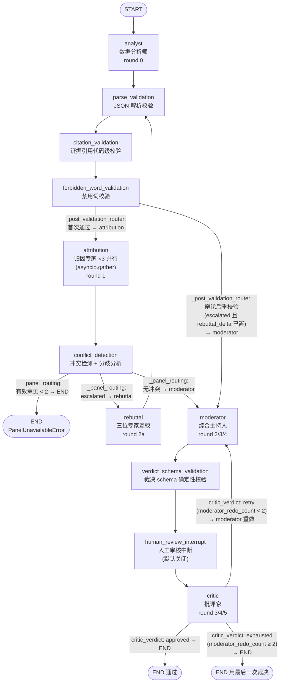
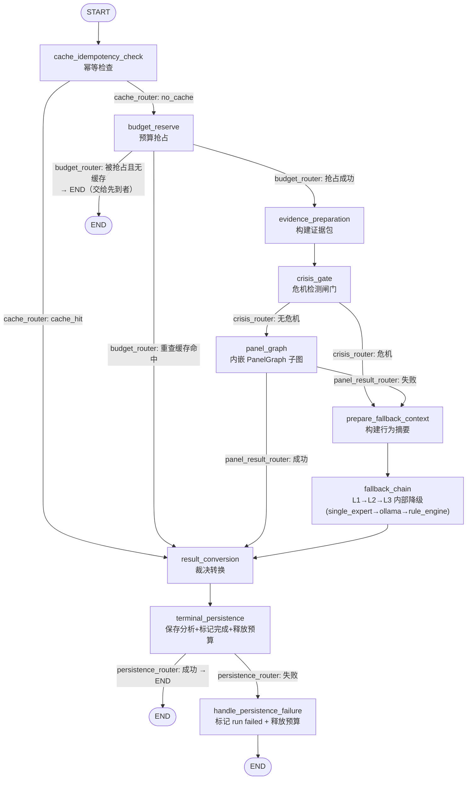
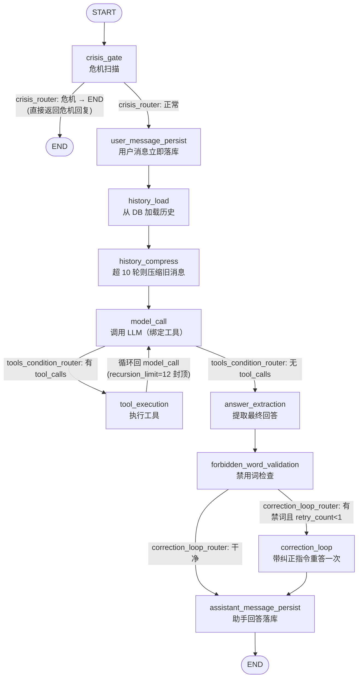

# MindFlow 后端技术解析 — 05 LangGraph 图结构

> 目标读者：从未写过项目的人。读完本章应能理解 MindFlow 后端用 LangGraph 搭的三张图（专家会诊、每日分析、对话），并能自己动手搭一个最小复刻版。
> 相关源码目录：`backend-next/src/mindflow/graph/`（图定义）、`backend-next/src/mindflow/agents/orchestrator.py`（兼容适配器）、`backend-next/src/mindflow/ports.py`（框架中立端口）。
> 依赖版本（`backend-next/pyproject.toml`）：`langgraph>=1.2,<2`、`langchain-core>=1.5,<2`。

---

## 5.1 LangGraph 是什么：一张"会转弯的流水线"

把一次分析流程想象成一条**工厂流水线**，LangGraph 帮你把这条流水线画成一张"图"，然后由引擎负责把工件按图搬运。

- **StateGraph（状态图）**：整张流水线的图纸。你只负责声明"有哪些工位、工位之间怎么连"，搬运由引擎做。
- **节点（Node）**：一个**工位**。每个工位是一段 Python 函数（`async def node(state) -> dict`），输入上一站送来的货物，加工后返回"对货物的修改"。MindFlow 里每个专家（分析师、归因专家、主持人、批评家）就是一个工位。
- **状态（State）**：工位之间传递的**货物**。在 MindFlow 里是一份 `TypedDict`（Python 的"带字段名的字典"），装着 `bundle_json`（证据包）、`attribution_opinions`（专家意见）、`moderator_verdict`（裁决）等。每个工位拿到整箱货，改完把"改动的部分"交回去，引擎负责合并。
- **普通边（Edge）**：**固定传送带**。`A → B` 表示 A 干完必定送到 B。
- **条件边（Conditional Edge）**：**分流闸**。由一个路由函数（如 `critic_verdict`）看货物当前状态，决定往哪条传送带送："批评家通过了→送去出口 END；没通过且重试次数还够→送回主持人重做；次数用尽→送去出口"。这就是 `graph.add_conditional_edges(node, router, {目标名: 节点名})` 干的事。
- **Reducer（归并器）**：**合流规则**。当多个工位**并行**把改动交回同一条传送带时（比如三个归因专家同时写 `attribution_opinions`），引擎不知道先到后到，于是调用你指定的 reducer 函数来合并：`reducer(当前值, 新改动) → 新值`。它是纯函数，要求**与到达顺序无关**——无论谁先谁后，最终结果一样。
- **Checkpointer（检查点）**：**全程录像**。每走完一个工位就把状态存一份快照，这样可以在任意节点中断、稍后恢复。默认不启用（见 5.6）。

**一句话总结**：节点是工位、状态是货物、边是传送带、条件边是分流闸、reducer 是合流时的合并规则、checkpointer 是录像机。

MindFlow 用这张图画了三张图：**PanelGraph**（专家会诊，最重要）、**AnalysisGraph**（每日分析的总指挥，内嵌 PanelGraph）、**ChatGraph**（对话）。下面逐一拆解。

---

## 5.2 PanelGraph：多专家会诊图（重点）

源码：`src/mindflow/graph/panel_graph.py`。它模拟"医生会诊"：一位数据分析师先看数据，三位不同理论流派的专家各自给意见，有分歧就辩论，主持人综合裁决，批评家最后把关。

### 5.2.1 精确拓扑图

图中节点名**与代码完全一致**（`PanelGraph.build()` 中 `graph.add_node(...)` 的名字）。



### 5.2.2 每个节点干什么

| 节点名 | 是否有 LLM 调用 | 职责 |
|--------|:---:|------|
| `analyst` | 是（1 次） | 让"数据分析师"读证据包 `bundle_json`，输出模式发现/异常；返回 `analyst_opinion`。内部顺带做引用校验，发现幻觉引用就整份标 `skipped` |
| `parse_validation` | 否 | 校验所有意见 JSON 是否解析成功（`skipped` 的留在原地），只统计不改变行为 |
| `citation_validation` | 否 | 对所有意见做**代码级**引用校验（`validate_citations`），引用不存在指标 → 整份标 `skipped` |
| `forbidden_word_validation` | 否 | 检查"诊断/治疗/患者/处方"等禁用词，命中 → 标 `skipped` |
| `attribution` | 是（3 次并行） | 用 `asyncio.gather` 同时让 CBT / TMT / 情绪调节三位专家各出一份 `ExpertOpinion`，作为 `attribution_opinions` 一并写回，由 reducer 合并 |
| `conflict_detection` | 否 | 纯函数：`detect_conflict` 看三位专家是否冲突，`analyze_disagreement` 算一致性分数；设置 `escalated` 与 `disagreement_summary` |
| `rebuttal` | 是（3 次并行） | 只在冲突升级时走：每个专家看到另两人的论证后重新输出（互驳）；算 `rebuttal_delta` 衡量共识是否收敛；有效意见仍 <2 就抛 `PanelUnavailableError` |
| `moderator` | 是（1 次） | 主持人综合分析师 + 归因专家 + 冲突报告，输出统一裁决 `moderator_verdict`；被打回重做时用 `_build_moderator_redo_prompt` 带上批评家的意见 |
| `verdict_schema_validation` | 否 | 在请批评家之前，先确定性地校验裁决 schema（类型枚举、置信度 0-1、类型数 ≤3），有错直接抛 `PanelUnavailableError` |
| `human_review_interrupt` | 否 | **可选**人工审核闸门：默认 `human_review_enabled=False` 时是 no-op；开启后当置信度过低或分歧过大时 `interrupt(...)` 挂起等人工审批（见 5.6） |
| `critic` | 是（1 次） | 批评家审查裁决：引用真伪、逻辑跳跃、过度诊断、禁词；`approved` 通过则终，否则把 `moderator_redo_count` +1 送回主持人 |

### 5.2.3 状态字段与 reducer 合流

`PanelGraphState`（`panel_graph.py`）是一份 `TypedDict(total=False)`，字段分三类：

1. **输入字段**：`bundle_json`（证据包 JSON）、`valid_metrics`（合法指标 ID 集合，供引用校验）。
2. **reducer 累积字段**（用 `Annotated[类型, reducer函数]` 声明，允许并行写入）：
   - `attribution_opinions: Annotated[tuple[ExpertOpinion, ...], _reduce_attribution_opinions]`
   - `transcript: Annotated[tuple[TranscriptEntry, ...], _reduce_transcript]`
3. **单写字段**（后写覆盖先写，last-write-wins）：`analyst_opinion`、`conflict_report`、`escalated`、`moderator_verdict`、`critic_result`、`critic_retries`、`moderator_redo_count`、`call_count`、`disagreement_summary`、`rebuttal_delta`。

**并行合流到底怎么发生？** 注意一个容易误会的点：`panel_graph.py` 的模块 docstring 写着 "Send fan-out / Send provides parallel attribution fan-out"，但实际代码**并没有用 LangGraph 的 `Send`**（全文件搜不到 `from langgraph.types import Send`）。真正的实现是：`attribution` 是一个**节点**，节点内部用 `asyncio.gather` 并发调用三个专家的 gateway，然后把三份意见打包成 `tuple` 一次写回状态。此时引擎会拿这个 tuple 去调 `_reduce_attribution_opinions`，该函数内部把 tuple 拆开、逐个套 `append_opinion`。

`append_opinion`（`reducers.py`）的合并规则是**按 `(role, perspective)` 排序 + 同键 upsert**：先用字典按排序键去重（同一位专家重写则覆盖），再 `sorted(...)` 排序输出。这样无论三个专家谁先返回，`attribution_opinions` 的最终顺序永远一致——这正是 reducer 要的"与到达顺序无关"。`append_transcript` 则是简单追加、不去重，因为"第几轮说了什么"是有顺序含义的。

### 5.2.4 关键路由逻辑

- `_post_validation_router`（挂在 `forbidden_word_validation` 之后）：若 `escalated=True` **且** `rebuttal_delta` 非空，说明刚辩论完重新过校验链，直接去 `moderator`；否则是首次通过，去 `attribution`。用"rebuttal 有没有跑过"来区分第一次和第二次经过校验链。
- `_panel_routing`（挂在 `conflict_detection` 之后）：先算 `minimum_valid_opinion_router`——有效意见 <2 就去 `unavailable` → END（整次会诊不可用，交由上层降级）；否则按 `conflict_router` 分流：有冲突 → `rebuttal`，无冲突 → `moderator`。
- `critic_verdict`（挂在 `critic` 之后）：`approved` → END；未通过且 `moderator_redo_count < 2` → `retry`（回 `moderator`）；重做满 2 次仍未通过 → `exhausted` → END（**最多重做 2 次**，配合预算封顶）。

### 5.2.5 与旧面板编排器的关系

`PanelGraph` 已成为唯一生产面板图。旧 `PanelOrchestrator` 类在 v2 cutover 中移除，`agents/orchestrator.py` 仅保留解析、引用校验和提示构造 helper；`AnalysisGraph.panel_graph_node` 直接调用 `PanelGraph.ainvoke(...)`。

---

## 5.3 AnalysisGraph：每日分析的总指挥图

源码：`src/mindflow/graph/analysis_graph.py`。它实现 `ports.py` 里的 `AnalysisWorkflowPort`（一个只有 `run_analysis(request) -> AnalysisResult` 的协议接口）。**端口（Protocol）的意义**：外层调度器只依赖这个接口，不依赖 LangGraph 本身——将来换掉引擎，调度器一行不用改（ADR-001/002）。

### 5.3.1 精确拓扑图



### 5.3.2 节点职责与"幂等 / 预算 / 危机 / 持久化"四道门

| 节点 | 职责 |
|------|------|
| `cache_idempotency_check` | **幂等门**：按 `{origin}:{user_id}:{date}:{analysis_kind}` 查 `analysis_repo.get_by_date`。命中且未 `force` → 直接走转换收尾；不同触发来源（scheduler/api/chat）用不同 key，互不阻塞但收敛到同一行存储 |
| `budget_reserve` | **预算门**：`BudgetReservationPort.try_reserve(key)` 底层是 `INSERT ... ON CONFLICT DO NOTHING`，**先到者得**。没抢到就重查一次缓存：若先到者已完成分析 → 走转换；若没完成 → 直接 END，绝不同时跑两份 |
| `evidence_preparation` | 把当天活动事件卷成 `EvidenceBundle`，产出 `bundle_json` 与 `valid_metrics` |
| `crisis_gate` | **危机门**：扫描事件文本里的危机关键词，命中 HIGH 危机 → 短路所有 LLM，直接进降级链的 `rule_engine` |
| `panel_graph` | 调用内嵌 `PanelGraph.ainvoke`；成功后取 `moderator_verdict` 当 `assessment`，失败（`PanelUnavailableError`）则 `panel_succeeded=False` 走降级 |
| `prepare_fallback_context` | 把事件构建成 `BehaviorSummary`，喂给降级链 |
| `fallback_chain` | 单节点内部顺序跑 L1→L2→L3（见 5.7），L3 永远成功，所以此节点必然产出结果 |
| `result_conversion` | 把 assessment dict 用 `analysis_dict_to_panel_verdict` 转成 `verdict_json` |
| `terminal_persistence` | **唯一终结持久化节点**：① upsert 分析（`ON CONFLICT DO UPDATE`，天然幂等）② 标记 workflow run `completed` ③ 释放预算。三件事都幂等，重复调用安全 |
| `handle_persistence_failure` | 持久化失败时把 run 标 `failed`（绝不让 run 卡在 `running`），并释放预算让 key 可重试 |

### 5.3.3 如何实现 AnalysisWorkflowPort

`AnalysisGraph.run_analysis(request)` 干四步：构造幂等 key → `save_run` 建 workflow run 记录 → 组装 `AnalysisRunContext`（把仓库、证据构建器、危机检测器、`PanelGraph`、降级依赖等**活引用**塞进 `runtime` 字段）→ `graph.ainvoke(initial_state)`。之后把 `final_state` 里的 `verdict_json` 或 `assessment` 转成 `PanelVerdict` 返回。异常兜底：任何异常都会把 run 标 `failed` 并返回空裁决。

**关键设计**：`AnalysisGraphState` 里有一个 `runtime: AnalysisRunContext` 字段装着仓库、HTTP 客户端等**不可序列化**的活对象，但它只存在于运行期、不参与检查点——这也是所有图都**默认不启用 checkpointer** 的根本原因之一（见 5.6）。`AnalysisRunContext` 各字段默认 `None`，方便测试时用 `state.get("runtime", AnalysisRunContext())` 兜底。

---

## 5.4 ChatGraph：对话生命周期图

源码：`src/mindflow/graph/chat_graph.py`。它把原来 LangChain `create_agent` 隐式完成的"工具循环"显式画成图，11 个节点，等价复刻 `ChatService.ask()` 的输出契约。



几个值得注意的点：

- **危机短路**：用户消息一旦命中 HIGH 危机，直接返回危机热线回复并 `degraded=True`，整个 LLM/工具循环都不走。
- **持久化的两个时机**：用户消息**先**落库（LLM 挂了也不丢用户消息），助手回答**后**落库（永远给用户一个回应）。
- **工具循环**：`model_call → tool_execution → model_call` 是一个显式循环。靠 `config={"recursion_limit": 12}` 封顶，防止 LLM 无限调用工具。
- **单会话串行化**：`ChatGraph.ask` 里 `self._session_locks.setdefault(session_id, asyncio.Lock())`，同一会话的多次提问串行执行，避免消息交错写库。
- **一次纠正**：回答含禁用词最多重答一次，再不行就换成安全兜底回复 `_SAFE_REPLY` 并 `degraded=True`。

---

## 5.5 预算机制：12 次 LLM 调用的硬上限

会诊不能让 LLM 无限烧钱，所以设了 `_MAX_CALLS = 12`（`panel_graph.py:69`；`types.py` 注释：`辩论≤1轮, 打回≤1次 → 最坏 12 次调用/会诊`）。

**实现**（`_call_with_budget`）：每次调 gateway 前，先 `async with runtime.budget_lock:` 加锁，`call_count += 1`，然后判断 `> _MAX_CALLS` 就抛 `PanelBudgetExceededError`。

这里有两个"并发安全"设计：

1. **`asyncio.Lock`**：三个归因专家用 `asyncio.gather` 并发跑，如果各自直接 `call_count += 1` 会有竞态（Python 单线程异步里 `+=` 两步之间可能被让出，但计数不是原子的）。锁把"读-加-判"做成原子操作，保证预算精确。
2. **`contextvars.ContextVar`**：这个 `runtime`（`_PanelRunContext`：`call_count` + `transcript` + `budget_lock`）不放在图的 State 里，而是放进 `_PANEL_RUNTIME` 这个 ContextVar，由 `PanelGraph.ainvoke` 在调用前 `set(runtime)`、`finally` 里 `reset(token)`。原因：状态要能被引擎合并/序列化，而 `asyncio.Lock` **不可序列化**；ContextVar 是"每个异步任务私有"的变量，天然隔离并发调用，两个会诊同时跑不会串计数。

**超了怎么办**：抛 `PanelBudgetExceededError`，由 `AnalysisGraph.panel_graph_node` 捕获后转为"面板不可用"，走降级链——不会静默返回半成品。正常路径大约 6 次调用（分析师 1 + 归因 3 + 主持人 1 + 批评家 1），冲突升级 +3，打回重做再 +2，上限 12 只有连续禁词重试才可能触顶。

---

## 5.6 Checkpointer：为什么默认不启用

**什么时候用**：`PanelGraph.build()` 里 `checkpointer = MemorySaver() if get_settings().human_review_enabled else None`。也就是说**只有当"人工审核中断"功能开启时**才用 `MemorySaver`（内存版检查点），否则传 `None` 不编译检查点。

**为什么**：

1. **中断需要检查点才能恢复**：`human_review_interrupt_node` 里的 `interrupt({...})` 会把图**挂起**、返回给调用方等人工输入。要"挂起后还能从原处接着跑"，引擎必须把挂起时的状态存起来（`MemorySaver` 存内存），恢复时用 `Command(resume=...)` 继续。没有检查点就没法中断恢复。
2. **避免序列化不可序列化对象**：图状态里塞着 `runtime`（仓库、HTTP 客户端、`asyncio.Lock`、`ContextVar` 等），检查点引擎（msgpack）序列化整个 state 时会炸。`state.py` 的模块 docstring 明确约束：状态字段只允许 `int/str/tuple/frozenset/dict` 与稳定值对象，**绝不允许** `asyncio.Lock`、model client、repository、ContextVar。既然默认不需要中断，干脆不启用，省掉这份序列化风险和性能开销。

`AnalysisGraph`、`ChatGraph` 同理：都 `graph.compile()` 不传 checkpointer。三个图里用的 `runtime` 全部走"调用时注入 + 存在 state.runtime 字段但不参与检查点"的模式。

---

## 5.7 fallback_nodes.py：降级路径节点

源码：`src/mindflow/graph/fallback_nodes.py`。它把三级降级链（L1 DeepSeek → L2 Ollama → L3 RuleEngine）从原来的 `LLMService` 抽成**独立可测试的图节点**：

- `single_expert_node`（L1）：调 DeepSeek，成功 → `source="deepseek"`，`degraded=False`；失败/未配置 → 记 `error` 并始终把 `"deepseek"` 追加进 `degradation_path`（表示"这层尝试过了"）。
- `ollama_node`（L2）：走 OpenAI 兼容接口调本地 Ollama（`qwen3:8b`），成功 → `source="ollama"`，`degraded=True`。
- `rule_engine_node`（L3）：纯规则引擎，**永远成功**——这是"永远可用"的最后保证；危机路径下直接产出热线回复且 `degraded=False`（危机是安全闸，不算降级）。
- `fallback_eligibility_router`：决策矩阵，根据 `degradation_path` 的最后一层决定下一步（详见文件头部 8 组合矩阵）。
- `run_fallback_pipeline`：给旧适配器用的**顺序执行桥**，不走 LangGraph 运行时，直接按 `cache → crisis → degradation` 顺序手动跑节点。

**在 AnalysisGraph 里怎么接**：不是把每个降级节点各自挂成图节点，而是包进**一个** `fallback_chain` 节点（`_fallback_chain_node`）：`prepare_fallback_context` 准备好 `summary_json`/`behavior_summary` 后进 `fallback_chain`，节点内部按 `crisis? → rule_engine`、否则 `single_expert → ollama → rule_engine` 的顺序**串行 await**，谁成功就返回谁的 `assessment`；L3 保证兜底。这样外层图只有一条简单边 `prepare_fallback_context → fallback_chain → result_conversion`，而把复杂的降级逻辑收在单节点内部。

---

## 5.8 可复刻性：从零搭一个最小 LangGraph 图

### 5.8.1 安装依赖

```bash
pip install "langgraph>=1.2,<2" "langchain-core>=1.5,<2"
# MindFlow 项目内用 uv 管理，等价命令：
# cd mindflow-app/backend-next && uv sync --extra dev --extra ml
```

### 5.8.2 最小示例：条件边 + reducer 合流

下面这个 40 行例子覆盖了本章所有核心概念：状态、节点、条件边、reducer 合流。

```python
"""minimal_langgraph_demo.py — 复刻 MindFlow 图的核心模式"""
from typing import Annotated, TypedDict
from langgraph.graph import StateGraph, END


# 1) 定义状态：用 Annotated[list, reducer] 声明"可合流通道"
class DemoState(TypedDict, total=False):
    messages: Annotated[list[str], lambda cur, upd: (cur or []) + (upd if isinstance(upd, list) else [upd])]
    count: int


# 2) 节点：async def node(state) -> dict，返回"对状态的改动"
async def producer(state: DemoState) -> dict:
    return {"messages": ["专家A的意见"], "count": state.get("count", 0) + 1}


async def judge(state: DemoState) -> dict:
    # 这里模拟"三位专家并行"：asyncio.gather 各返回一段，reducer 负责合流
    return {"messages": ["专家B的意见", "专家C的意见"]}


async def sink(state: DemoState) -> dict:
    print("合流后的意见:", state["messages"], "轮数:", state["count"])
    return {}


# 3) 条件边路由函数：看状态决定去向
def route_after_producer(state: DemoState) -> str:
    return "judge" if state.get("count", 0) < 3 else "sink"


# 4) 搭图：add_node → set_entry_point → add_edge / add_conditional_edges → compile
builder = StateGraph(DemoState)
builder.add_node("producer", producer)
builder.add_node("judge", judge)
builder.add_node("sink", sink)
builder.set_entry_point("producer")
builder.add_conditional_edges(
    "producer", route_after_producer,
    {"judge": "judge", "sink": "sink"},
)
builder.add_edge("judge", "producer")  # 循环：judge 合流后回到 producer
builder.add_edge("sink", END)
app = builder.compile()

result = app.invoke({"messages": [], "count": 0})
# producer(count=1) → judge 并回合流 → producer(count=2) → judge 合流
# → producer(count=3) → sink，打印合流结果
```

对照 MindFlow：`producer` ≈ `analyst`，`judge` 并行写回 ≈ `attribution`（用 reducer 合流），`route_after_producer` ≈ `_panel_routing` 这类条件路由函数，`add_conditional_edges(...)` 的第三个参数就是"分流闸"到节点的映射表。

### 5.8.3 复刻 MindFlow 三张图的检查清单

1. **状态全部可序列化**：只在 State 里放 `str/int/tuple/frozenset/dict` 和冻结 dataclass；仓库、HTTP 客户端、`asyncio.Lock` 一律放 `runtime` 字段或 ContextVar，不进 State（否则开不了 checkpointer）。
2. **并行用 asyncio.gather + reducer 合流**：像 `attribution` 那样，在一个节点内并发调多个专家，打包成 tuple 写回，reducer 负责排序去重。
3. **预算用 asyncio.Lock + ContextVar**：把"计数 + 判断"做成原子操作；每个调用实例一个独立 runtime，用 ContextVar 隔离并发。
4. **条件边返回字符串 + 映射表**：`add_conditional_edges(node, router, {key: target})`，router 是纯函数，好测试。
5. **LLM 输出绝不直接信**：每个 LLM 节点后面紧跟确定性校验节点（解析、引用、禁词），把"不合格"的意见标 `skipped` 而不是崩溃。
6. **降级兜底**：最底层永远有一个不依赖 LLM 的规则引擎节点，保证"永远可用"。

---

## 5.9 小结

- **LangGraph 的核心心智**：节点是工位，状态是货物，边是传送带，条件边是分流闸，reducer 是合流规则，checkpointer 是录像机。
- **PanelGraph** 是 11 节点专家会诊图：分析师 → 三道校验 → 归因×3 并行 → 冲突检测 →（辩论）→ 主持人 → schema 校验 → 人工审核（默认关）→ 批评家 →（通过/重做×2/耗尽）→ END。
- **AnalysisGraph** 是每日分析总指挥：幂等门 → 预算门 → 证据准备 → 危机门 → PanelGraph 子图 → 降级链 → 裁决转换 → 终结持久化，实现 `AnalysisWorkflowPort`。
- **ChatGraph** 显式画出对话工具循环：危机短路 → 消息持久化 → 历史压缩 → 模型调用 → 工具循环（recursion_limit=12）→ 禁词一次纠正 → 落库。
- **三张图默认都不开 checkpointer**；只有人工审核开启时才用 `MemorySaver`，因为中断恢复必须存档，且状态里塞了不可序列化的 runtime。
- **预算**：`asyncio.Lock` + `ContextVar` 保证 12 次调用硬上限原子生效，超限抛 `PanelBudgetExceededError` 走降级。
