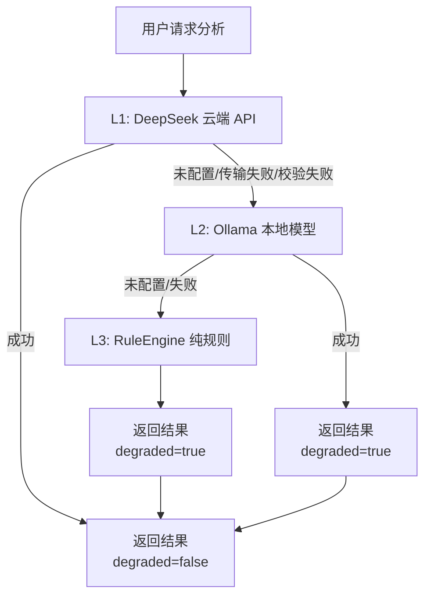

# 06 重试机制与降级策略

> 目标读者：从未写过项目的人。读完本章，应能回答：MindFlow 在后端"调用云端 AI 失败"时为什么不会崩、为什么用户几乎永远能用、以及你自己要复刻一套"自动重试 + 逐级降级"应该怎么写。

---

## 6.1 先想清楚：重试 ≠ 降级

先把两个词用打电话打比方，后面所有代码都围绕这个区分：

- **重试（retry）** = 你拨了 10086 没人接，**再拨一次**。同一个号码、同一件事、同样的话。适用于"可能是暂时故障"的情况：网络抖了一下、服务器忙、被限流。拨第二次也许就通了。
- **降级（degradation）** = 10086 一直打不通，你**换一种方式**：去营业厅、用 App、发短信。换成另一套完全不同的通道。适用于"这条路已经坏了 / 不值得再试"的情况。

MindFlow 的哲学是：**能重试的就重试（成本低、收益高），重试也救不回来的就降级（换通道），降级到最后一层时无论如何都要给出结果（永远可用）。** 并且有一条铁律写在 `fallback_nodes.py:53`：**不要把"确定性失败"当成"传输故障"去重试**。翻译成人话：模型输出的 JSON 缺字段、带了禁用词、引用了不存在的证据——这些就算重试 100 遍也一样错（同一份输入、同一个模型），重试只是浪费钱和时间；只有"连接超时、5xx、限流"这种碰运气的事才值得重试。

---

## 6.2 完整重试图谱（一张表全记住）

以下每一条都从 `backend-next/src` 代码核实。位置格式为 `文件:行号`。

| # | 位置 | 触发条件 | 最多尝试 | 退避策略 | 超时上限 |
|---|------|----------|----------|----------|----------|
| 1 | `infrastructure/llm/client.py:174` DeepSeekClient.analyze | 连接超时 / httpx HTTPError / 429 限流 / 5xx / 响应非 JSON / 内容为空 | 2 次（1 次重试） | 指数 + 抖动：`min(2^attempt + uniform(0,1), 60)`；429/5xx 优先用服务器 `Retry-After` 头（封顶 60s） | 30s |
| 2 | `infrastructure/llm/client.py:211` | 4xx（除 429） | **不重试**，直接抛错 | — | — |
| 3 | `infrastructure/llm/client.py:235` | Pydantic 校验失败（结构对但语义错） | **不重试**，直接抛错去降级 | — | — |
| 4 | `agents/llm_gateway.py:225` LangChainGateway.complete | 任意异常 / 内容为空 | 2 次（`max_retries` 从配置来，默认 1） | 同样的指数 + 抖动，封顶 60s | 30s（`settings.llm.timeout_s`） |
| 5 | `services/llm_service.py:387`、`graph/fallback_nodes.py:699` | Ollama 调用失败 / 非 200 / 空内容 | **不重试**（本地模型，直接跳到 L3） | — | 60s |
| 6 | `services/intervention_service.py:317,379` | 干预消息 LLM / Ollama 超时 | **不重试**，log 后回退 | — | LLM 10s / Ollama 60s |
| 7 | `api/middleware/ratelimit.py:135,151` | 请求超限 | 服务端返回 429 + `Retry-After` 头，**由客户端决定是否重试** | 服务器给重置时间 | — |
| 8 | `main.py:27,119-124` Watchdog | uvicorn 进程崩溃 | 每小时最多 **3 次**重启（滚动窗口） | 线性：`min(1.0 × 崩溃次数, 5.0)` 秒 | — |
| 9 | `services/scheduler.py:1047` 启动恢复 | 恢复昨日作业失败 | 2 次（`_STARTUP_RECOVERY_RETRIES = 1`） | 立即重试（`asyncio.sleep(0)`） | — |
| 10 | `services/scheduler.py:318-339` cron 补跑 | 服务启动时已过作业时刻且 `catch_up=True` | 启动时立即补跑 1 次 | 无 | — |
| 11 | `services/scheduler.py:890-913` 等待识别完成 | 会话识别未成功 | 无限轮询，每 1s 一次 | 固定 1s | — |
| 12 | `services/scheduler.py:388-402` 作业心跳 | 每 10 分钟续租；租约丢失则取消并让其他实例接管 | 心跳失败即放弃（不重试） | — | 10 分钟 |
| 13 | `services/collector_service.py:189` 采集 tick | 单次采集超过 `interval × 2` | **不重试**，计数失败 | 连续 10 次失败 → 采集器整体 `degraded` | 10s（interval=5s） |
| 14 | `infrastructure/database.py:42` | SQLite 写冲突 `SQLITE_BUSY` | 交给 SQLite 内置：`PRAGMA busy_timeout=5000` 最多等 5s | 数据库引擎处理 | 5s |
| 15 | `services/maintenance_service.py:251-296` | workflow run 卡在 `running` 超 60 分钟 | 标记为 `failed` + 写 `retry_reason`，**让上层重试基础设施能捡起来** | — | 60min |
| 16 | `agents/orchestrator.py:707-718,760-767`（同 `graph/panel_graph.py:301,536`） | 专家输出含禁用词 | 重试 1 次（带纠正提示词） | 无退避（紧接下一次调用） | — |
| 17 | `graph/chat_graph.py:604-714`、`services/chat_service.py:521-549` | 聊天回答含禁用词 | 重试 1 次（`retry_count < 1`） | 无退避 | — |
| 18 | `agents/orchestrator.py:844-849` | 批评家否决主持人裁决 | 主持人重做最多 2 次（`moderator_redo_count < 2`） | 无退避（图内循环） | — |
| 19 | `infrastructure/notification.py:283-322` | 弹窗/通知后端失败 | **不重试**，逐层换后端（见 6.3） | — | 弹窗就绪 5s |

这张表的规律：**传输层失败 → 重试（且重试次数都很小，最多 1~2 次）；内容/语义失败 → 不重试，直接降级；进程/作业失败 → 由上一层的"看护者"（watchdog、claim 机制）兜底。**

---

## 6.3 三级降级链：永远可用是怎么做到的

### 6.3.1 链条结构



这条链在 `services/llm_service.py:281` 的 `_run_degradation_chain()` 里按顺序执行，然后被抽到 `graph/fallback_nodes.py` 成为独立可测的图节点（见 6.4）。每一级返回时都会标注 `source`（deepseek / ollama / rule_engine）、`degraded` 布尔值、以及 `degradation_path`（如 `["deepseek", "ollama", "rule_engine"]`）。**降级对用户不可见**——HTTP 永远 200，只是 `meta.degraded=true`，这是设计约束（`llm_service.py:17-18`）。

### 6.3.2 什么条件下跳级

看 `fallback_nodes.py` 三个节点的异常分类就明白：

- **L1 `single_expert_node`（:395）**：
  - `client is None` 或 `LLMNotConfiguredError` → 返回 `deepseek_not_configured`，跳级（:417, :433）。没配 key 就是"这条路不存在"，连试都不用试。
  - `(LLMAPIError, TimeoutError)` → `deepseek_transport`，跳级（:439）。传输失败——重试预算（6.2 表的 #1）已经在 client 内部耗尽。
  - 其它任何异常（schema 校验、禁用词、JSON 解析）→ `deepseek_schema`，跳级（:445）。**注意注释**：确定性失败不当传输故障重试。
- **L2 `ollama_node`（:454）**：`ollama_base_url` 为空 → `ollama_not_configured` 直接到 L3（:473）；任何异常 → `ollama_failure`（:490）。Ollama 是本地免费模型，本身不做重试（反正白嫖，坏了就换）。
- **L3 `rule_engine_node`（:498）**：**永不失败**。规则引擎是确定性代码，不依赖网络、不依赖 key。即使它的 `assess()` 意外抛异常（契约上不会），也有兜底返回"规则引擎异常，请稍后重试"（:564-574）。它是链条的"最后一张保险单"。

### 6.3.3 如何"检测当前 provider 不可用"

MindFlow **不做主动健康探测**（不先 ping 一下再决定用谁），而是**失败驱动**：直接调用，失败就换。这更简单也更真实——探测说"可用"不代表真能通，探测本身也是成本。判断路径只有三种信号：

1. **配置层**：`LLMSettings.api_key is None` → 连 client 都不建（`client.py:120-125` 构造时直接抛 `LLMNotConfiguredError`）；`ProviderRegistry` 里 `settings.api_key` 为假时 `get_structured_attribution()` 返回 `None`（`provider_registry.py:136-148`）。
2. **异常类型**：`LLMNotConfiguredError` / `LLMAPIError`（传输与预算耗尽）/ `TimeoutError` / 其它异常（语义失败）。`fallback_nodes.py` 用 except 分支区分它们。
3. **返回值**：`LLMService._ollama_call` 失败返回 `None`（`llm_service.py:393-402`）——用 `None` 而非异常表示"这级不行"。

### 6.3.4 ProviderRegistry：会话池与原子关闭

`infrastructure/provider_registry.py` 是 LLM 客户端的"房东"。它统一管理三类资源：

| 资源 | 接口 | 用途 |
|------|------|------|
| `DeepSeekClient`（httpx.AsyncClient 连接池） | `get_structured_attribution()` | L1 结构化归因 |
| `LangChainGateway`（内部两个 `ChatDeepSeek`，各持一个 OpenAI async client 池） | `get_gateway()` | 专家会诊 + 聊天 |
| 独立 `ChatDeepSeek`（agent 模型） | `get_chat_model()` | 聊天 agent |

为什么需要"房东"？因为 `ChatDeepSeek` 底层包了一个 `openai.AsyncOpenAI`，它持有**长生命周期的 httpx 连接池**。如果每个服务各建各的、各关各的，就会泄漏 socket（代码注释 `llm_gateway.py:255-263` 明确记录了这是 review C2 的教训）。所以：

- **一次启动只建一份**，注入到 `LLMService` / `ChatService` / `PanelService`。
- **`shutdown()` 幂等**（`provider_registry.py:163-202`）：`_closed` 标志保证只关一次；每个关闭都用 `contextlib.suppress(Exception)` 包住，一个失败不影响其它；按顺序关 DeepSeekClient → Gateway 池 → 独立 agent 模型。
- **关了就拒绝服务**：所有 `get_*` 在 `_closed` 后抛 `RuntimeError`（:115-116），防止"用已关闭的连接池"这种更难查的 bug。

`LLMService.aclose()`（`llm_service.py:118-137`）区分两种模式：有 registry 注入时自己是 no-op（房东管关闭）；没有 registry（旧版单测场景）才自己关 client。这是"单一职责"的体现：**谁创建，谁负责关闭**。

---

## 6.4 图内兜底：fallback_nodes 是怎么串起来的

降级链不只是 if-else，还被实现成一张可单独测试的图。`fallback_nodes.py` 定义了 8 种路由组合（:39-48），核心路由函数是 `fallback_eligibility_router`（:592），决策矩阵在注释里（:597-608）：

```
cache_check → crisis_gate → prepare_context → single_expert (L1)
     │               │              │
     │ cache_hit → END           失败/未配置
     │                              ▼
     │ crisis → rule_engine     fallback_eligibility_router
     │                              │
     │                              ├─ 已 deepseek → ollama (L2)
     │                              ├─ 已 ollama   → rule_engine (L3)
     │                              └─ 有结果无错误 → END
```

`crisis_gate_node`（:339）在 LLM 调用**之前**扫描危机关键词，一旦 HIGH 直接短路到 `rule_engine_node`（跳过所有 LLM），并在 `degradation_path` 里记 `crisis→rule_engine`——注意此时 `degraded=False`（:528），因为"危机跳过"是安全闸门，不是降级。这就是 6.1 的哲学在图里的体现：**该花在正确性上的纪律，和该花在可用性上的兜底，各管各的。**

---

## 6.5 预算保护：12 次调用的"钱包限额"

专家会诊最贵，所以 `PanelOrchestrator` 有一个**硬预算**：单次分析最多 **12 次 LLM 调用**。用"钱包"来理解：

- **钱包记账**：`_call_with_budget`（`orchestrator.py:931-957`）在每次调用前 `call_count += 1`，一旦超过 12 就抛 `PanelBudgetExceededError`（:951-952）。
- **加锁防并发挤兑**：`budget_lock = asyncio.Lock()`（:605），三个归因专家是 `asyncio.gather` 并行跑的（:720），如果没有锁，三个协程可能同时读到 `call_count=11` 然后各自花一笔，预算就形同虚设。锁保证"先扣款、再放行"是原子的。
- **并行失败不团灭**：`_safe_call_with_budget`（:959-975）把 `PanelBudgetExceededError` 原样上抛，但其它异常吞掉返回空串——一个专家挂了，另外两个照常出意见。

为什么封顶 12？快速通道约 6 次（analyst + 3 归因 + moderator + critic），冲突升级 +3 次（反驳×3），主持人重做最多 2 次，加起来最坏路径也落在 12 内。预算的意义不是精确计数，而是**防失控**：万一图逻辑改坏了出现死循环，LLM 账单不会跟着失控——这在隐私本地应用里尤其重要，因为每次调用都在花钱和耗电。

---

## 6.6 禁词重试：语义层的"一次改过机会"

前面说"语义失败不重试"，但有一个特例：**禁用词**。LLM 输出不能出现"诊断、治疗、患者、处方"等医疗用语（CBT 教练的边界）。Pydantic 校验不过的不重试，因为重试大概率同样错；但禁用词是**可以通过给模型看一条纠正消息**来改的，所以给一次机会：

```python
# orchestrator.py:710-718（归因专家）
if op.skipped and _contains_forbidden_words(raw):
    retry_msg = "你的上一条回复包含禁用词汇（诊断、治疗、患者、处方）。请用中文重新输出，严格遵守禁用词规则。"
    raw2 = await self._safe_call_with_budget(rt, exp, retry_msg)
    op2 = _parse_expert_opinion(raw2, exp, ...)
    if not op2.skipped:
        return op2        # 改好了，用新结果
    logger.warning("{} retry still failed, using original", exp.role)
# 没改好就退回原结果（标记 skipped），由上层判定是否够 2 份有效意见
```

聊天路径同理：`chat_graph.py` 的 `correction_loop_node`（:636）重试一次，若重试仍含禁用词，则输出安全兜底回复 `_SAFE_REPLY` 并标记 `degraded=True`（:696-701）。`chat_service.py:521-549` 是这条逻辑的旧版入口。

对比 6.2 表里的 #1/#2：**传输层重试 1 次 + 语义层重试 1 次，是两笔独立的账**，目的完全不同——前者赌"网络会好"，后者给"模型一次改过机会"。

---

## 6.7 调度器：错过的作业怎么补、崩了怎么自愈

### 6.7.1 为什么不用 APScheduler

`services/scheduler.py:1-7` 记录了历史原因：APScheduler 的 `AsyncIOScheduler` 在 Windows 上会触发 `CTRL_BREAK_EVENT`，被 uvicorn ≥0.41 误判为关闭信号。所以团队写了一个**纯 asyncio 的最小调度器** `AsyncioScheduler`（:164），提供 `daily_cron` 和 `interval_minutes` 两种触发器，行为对齐 APScheduler 以便测试。

### 6.7.2 错失补跑（catch-up）

两个机制应对"服务当时没开机/睡过了"：

1. **cron 启动补跑**：`_run_daily_cron` 的 `catch_up=True` 参数（:328-339）——如果启动时本地时间已过目标时刻，先立刻跑一次再进入等待循环。`daily_backup` 作业开了这个开关（:1190）。其它作业不开，因为幂等性 + 数据完整性靠下面第 2 条。
2. **启动恢复任务**：`_run_startup_recovery`（:1037-1153）在服务启动时专门补**最近一个完整工作日**（`_STARTUP_RECOVERY_COMPLETE_DAYS = 1`，:88）的分析、报告、遥测。为什么只补 1 天？注释说得很清楚：**避免长时间离线后启动时爆发 LLM 花费**（:86-88）。每个恢复步骤通过 `_run_recovery_step`（:1041-1060）带 1 次立即重试。

### 6.7.3 claim + 心跳：多实例互斥与崩溃接管

`_run_claimed_job`（:438-537）是调度器的"排他锁"：

- **claim**：跑之前先向 `scheduled_job_runs` 表声明"今天这个作业我包了"（:449）。claim 不成功（别人已经跑了）就跳过——这同时挡住了"auto_intervention 和 daily_panel cron 抢跑同一天"的竞态（:744-747 注释 review C4）。
- **心跳续租**：每 10 分钟心跳一次（:388-402）。如果心跳失败（比如数据库连接断了、进程假死），当前任务被取消，`attempt_count` 记录在案，**别的实例或下次运行可以接管**。
- **失败落账**：作业抛异常时 `mark_failed`（:514-521）写错误信息；进程被取消时 `mark_cancelled`（:415-435），并用 `asyncio.shield` 保证即使取消风暴中状态也能写进去。
- **重试失败的作业**：`retry_failed=True`（如 `_run_panel_for_date` :941）允许失败的作业被再次 claim。

### 6.7.4 watchdog：进程级自愈

调度器管"作业"，watchdog 管"整个服务进程"。`main.py` 的 `Watchdog`（:31）在 uvicorn 外面包了一层：

- 服务器崩溃 → 捕获异常 → 重启（:84-102）。
- **每小时最多重启 3 次**（`_MAX_RESTARTS_PER_HOUR = 3`，:27），用 1 小时滚动窗口统计（:110-117），防止"启动即崩"的无限重启循环。
- 重启前用**线性退避**等待（:119-124）：`min(1.0 × 崩溃次数, 5.0)` 秒。第 1 次等 1s，第 2 次 2s……封顶 5s。
- 收到 SIGINT/SIGTERM 时优雅退出（:138-145），不触发重启。

---

## 6.8 数据库与采集器的"软重试"

不是所有重试都发生在 LLM 层。两个容易忽略的点：

- **SQLite busy_timeout**（`infrastructure/database.py:42`）：`PRAGMA busy_timeout=5000`。SQLite 写锁冲突时默认立即报错，这个 PRAGMA 让它**最多等 5 秒**再放弃——相当于把"重试"下沉到数据库引擎。配合 WAL 模式（多读一写不互斥）大幅减少冲突。
- **采集器超时降级**（`services/collector_service.py:184-203`）：每次采集 tick 用 `asyncio.wait_for(..., timeout=interval*2)` 包住。单次超时不算失败（重试由下一轮 tick 自然承担），但**连续 10 次超时**就宣布采集器 `degraded` 并停止——这是"给错误计数，别让一个坏采集器拖着系统空转"。

另外两个"准重试"机制值得记：`maintenance_service.py:251` 会把卡在 `running` 超过 60 分钟的 workflow run 标记为 `failed` 并写 `retry_reason`，让上层重试基础设施能重新拾起；API 层的限流中间件（`api/middleware/ratelimit.py:135`）算出 `retry_after` 放进 `Retry-After` 响应头——它不替客户端重试，但**告诉客户端该等多久**，这本身就是一种重试协议。

---

## 6.9 可复刻性：最小骨架

如果你要从零写"API 失败自动重试 + 逐级降级"，下面这个骨架把 MindFlow 的关键决策浓缩成一个文件。要点用中文注释标出。

```python
# retry_and_degrade.py — 最小可复刻骨架（约 60 行）
import asyncio, random
from dataclasses import dataclass

MAX_RETRIES = 1      # 传输层只重试 1 次（可配置）
TIMEOUT_S = 30.0
BACKOFF_CAP_S = 60.0

class APIError(Exception): pass      # 非重试错误（4xx、校验失败）
class RetriableError(Exception): pass  # 传输错误（超时、5xx、429）

async def call_l1(payload): ...   # 你的云端 API，失败时抛 RetriableError
async def call_l2(payload): ...   # 本地模型，失败返回 None
async def call_l3(payload): ...   # 纯规则引擎，永不失败

def backoff(attempt: int) -> float:
    """指数退避 + 抖动，封顶 60s。attempt 从 0 开始。"""
    return min(2.0 ** attempt + random.uniform(0, 1), BACKOFF_CAP_S)

async def invoke_with_retry(call, payload):
    """传输层重试：只重试 RetriableError，其它错误直接抛给上层降级。"""
    last = None
    for attempt in range(MAX_RETRIES + 1):
        try:
            return await asyncio.wait_for(call(payload), timeout=TIMEOUT_S)
        except RetriableError as exc:
            last = exc
            if attempt < MAX_RETRIES:
                await asyncio.sleep(backoff(attempt))
    raise APIError(f"after {MAX_RETRIES+1} attempts") from last

async def analyze(payload) -> dict:
    """三级降级链：L1 → L2 → L3，永远有结果。"""
    path: list[str] = []
    try:
        return await invoke_with_retry(call_l1, payload)  # 云端
    except Exception as exc:
        path.append("deepseek")
    try:
        result = await call_l2(payload)                    # 本地
        if result is not None:
            return result
    except Exception:
        pass
    path.append("ollama")
    result = await call_l3(payload)                        # 规则引擎
    path.append("rule_engine")
    return {"data": result, "degraded": True, "path": path}
```

复刻时记得四条纪律：

1. **只重试"值得赌"的错误**（连接/超时/5xx/429），确定性失败直接降级。
2. **重试次数要小**（1~2 次），配合指数退避 + 抖动，避免重试风暴。
3. **降级链最后一层必须是零依赖的兜底**（规则/缓存/安全回复），否则永远可用就是空话。
4. **把"谁创建谁关闭"管好**：连接池归一个注册表统一管理、幂等关闭。

---

## 6.10 小结

MindFlow 的重试与降级可以浓缩成三句话：

- **重试是保险**：传输层最多 1 次重试，指数退避 + 抖动 + 尊重 `Retry-After`，且绝不重试确定性失败。
- **降级是退路**：DeepSeek → Ollama → RuleEngine 三级链，跳级由"未配置 / 传输失败 / 校验失败"三类信号驱动，`ProviderRegistry` 统一管理会话池并原子关闭。
- **兜底是纪律**：12 次预算防钱包失控、禁词重试一次给模型改过机会、调度器用 claim + 心跳 + 启动恢复补跑错失作业、watchdog 每小时最多重启 3 次防崩溃循环、规则引擎永不失败保证永远可用。

理解了这个分层，你就掌握了让"一个会调用外部 AI 的本地应用"在断网、欠费、模型抽风时都不崩的通用方法。
