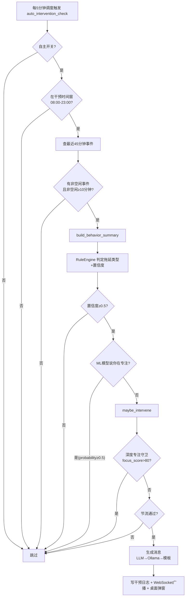

# MindFlow 后端技术解析 — 第 8 章 实时提醒/干预算法与调度

> 目标读者：**从未写过项目的人**。读完本章应能理解 MindFlow 怎么在"检测到你在分心 → 弹出提醒 → 又不至于烦死你"之间取得平衡，并能徒手复刻一个最小版本。
> 对应源码：`src/mindflow/services/{intervention_service,intervention_throttle,scheduler,effectiveness_service,autonomy_service}.py`、`src/mindflow/domain/{intervention,procrastination,deviation,baseline}.py`、`src/mindflow/infrastructure/{notification,intervention_popup}.py`、`src/mindflow/api/routes/{intervention,autonomy}.py`。

---

## 8.0 先用一个比喻理解这套系统

把 MindFlow 想象成一个**很懂你的同桌**：

- 它不一直盯着你（每 5 分钟才"瞄一眼"你的行为，`scheduler.py:77` 的 `_AUTO_INTERVENTION_INTERVAL_MINUTES = 5`）；
- 它知道你"平时正常的专注水平"是多少（基线基线，Welford 在线统计）；
- 当它发现你**明显反常**（专注分掉到基线以下很多、窗口疯狂切换、刷社交媒体刷了很久），它先在心里判断"这是哪种拖延"；
- 然后**忍住**——今天最多提醒 3 次，两次之间至少隔 2 小时，同一类问题每天最多 2 次（`intervention_throttle.py:53-58`）；
- 最后才以不同的语气（温和/标准/严肃）弹一个小窗，窗上有"接受 / 忽略 / 关闭"三个按钮；
- 你的每一次点击都会被记下来，变成**下次该不该提醒、提醒多频繁**的依据——这就是反馈闭环。

全链路一句话：**采集行为 → 算行为摘要 → 规则引擎/专家判定拖延类型 → 深度专注守卫 + 节流 + 时间窗三重闸门 → 生成消息 → 弹窗 → 记录响应 → 回写节流与疗效**。



---

## 8.1 触发算法：怎么判定"你正在拖延/分心"

MindFlow **不是**靠"进入某个 App 就报警"这种一刀切规则，而是把"当前行为"和"这个人自己的历史正常水平"做比较，再叠加一套可解释的拖延类型规则。分四步：

### 8.1.1 第一步：把原始事件压缩成行为摘要 `BehaviorSummary`

每 5 分钟的调度任务 `_auto_intervention_check`（`scheduler.py:539`）会拉取**最近 45 分钟**的原始活动事件（`window_min=45`），交给 `build_behavior_summary()`（`infrastructure/llm/summary.py:96`）压缩成一个**隐私友好、不含窗口标题原文**的摘要对象，字段见 `domain/procrastination.py:69-85`：

| 字段 | 含义 | 由什么算出 |
|------|------|-----------|
| `context_switches_per_hour` | 每小时确认切换次数 | `switch_rate_per_hour()`（`domain/features.py:357`） |
| `longest_focus_block_s` | 最长连续专注块（秒） | `longest_focus_block_s()`（`domain/features.py:378`） |
| `social_media_ratio` | 娱乐/社交媒体时长占比 | 非空闲事件里娱乐类时长 / 总非空闲时长 |
| `start_delay_min` | 从开机到第一次正事活动的时间 | `_estimate_start_delay()` |
| `actual_focus_min` | 估算的"真正投入"分钟数 | `_estimate_focus_minutes()` |
| `keyword_flags` | 窗口标题关键词标记（自批评/重做等） | `_extract_keyword_flags()` |
| `baseline_deviation` | 相对个人基线的 Z 偏离（见 8.6） | 由调用方传入 |

关键细节：**切换计数是"防抖"的**。`count_confirmed_switches()`（`domain/features.py:223`）要求新进程在前台驻留至少 10 秒才算一次切换，并且忽略 `explorer.exe` 等系统瞬时进程——否则你在两个窗口间快速点一下鼠标就会把切换率冲到天上。

### 8.1.2 第二步：规则引擎判定拖延类型（L3 无 LLM 成本）

`RuleEngine.assess()`（`domain/procrastination.py:157`）是一个**确定性分类器**，零外部依赖，5 类拖延类型（基于 Steel 2007 的时间动机理论 TMT）：

| 拖延类型 | 触发条件 | 置信度公式 | 出处 |
|---------|---------|-----------|------|
| 冲动分心型 `impulsivity` | 最长专注块 < 300 秒 **且** 切换 ≥ 12 次/小时 | 切换率在 [12, 24] 线性映射到 [0.5, 0.95] | `procrastination.py:209-229` |
| 决策困难型 `decisional` | 启动延迟 > 30 分钟 **且** 启动后专注占比 > 0.4 | 延迟在 [30, 60] 分钟线性映射到 [0.5, 0.95] | `procrastination.py:231-257` |
| 完美主义型 `perfectionism` | 关键词标记含"自批评"或"反复重做" | 命中 1 个 → 0.6；2 个 → 0.85 | `procrastination.py:259-274` |
| 情绪调节型 `emotional_regulation` | 社交媒体占比 > 0.55 | 占比在 [0.55, 0.80] 线性映射到 [0.5, 0.95] | `procrastination.py:276-294` |
| 任务畏惧型 `task_aversion`（兜底） | 专注占比 < 0.35 **或** 基线偏离 < −0.5 | `max(0.4, 0.7 − 专注占比/0.35×0.3)` | `procrastination.py:296-325` |

置信度映射的数学核心是 `_linear_confidence()`（`procrastination.py:332`）——把连续指标线性插值到 [0.5, 0.95]：

```python
def _linear_confidence(value, threshold, saturation):
    # value 刚到阈值 → 0.5（最小可信触发线）
    # value 到达饱和点 → 0.95（不设 1.0，永远保留不确定）
    if value >= saturation:
        return 0.95
    return 0.5 + (value - threshold) / (saturation - threshold) * 0.45
```

`assess()` 最多返回 3 类，按置信度降序。若最高置信度 < 0.2（`NO_SIGNIFICANT_THRESHOLD`），判定为"未检测到显著拖延模式"，`recommended_technique` 为 None——调用方绝不能据此行动（`procrastination.py:187-195`）。

### 8.1.3 第三步：三道"闸门"才轮到真正弹窗

即使规则引擎说"你在拖延"，也要依次过三关（都在 `scheduler.py:539-836` 的 `_auto_intervention_check` 里）：

1. **自主开关**：`autonomy_service.is_enabled()` 为 False 直接跳过（用户可能点了"暂停 1 小时"，见 8.7）。
2. **干预时间窗**：本地时间不在 `[start_hour, end_hour)` 内跳过（默认 08:00–23:00，见 8.4）。
3. **数据充足性**：没有事件 / 全部空闲 / 非空闲时间不足 10 分钟（`_MIN_NON_IDLE_MINUTES`，`scheduler.py:81`）都跳过——用户只是开机看了两分钟就离开，不该被提醒。

然后 `RuleEngine` 置信度要 ≥ 0.5（`_AUTO_INTERVENTION_MIN_CONFIDENCE`，`scheduler.py:64`）。若置信度 ≥ 0.75，还会尝试升级到**专家面板**（LLM 多专家会诊）给出更精细的归因（`scheduler.py:740-789`），面板失败则回退到规则引擎的判定。

**ML 否决权**（`scheduler.py:721-727`）：如果训练好的 ML 模型预测"当前专注概率 ≥ 0.5"，即使规则引擎说你在拖延，也不打扰——ML 是"二次信号"，只能否决提醒，不能单独触发提醒。

### 8.1.4 第四步：`maybe_intervene` 内部的"深度专注守卫"

真正的弹窗由 `InterventionService.maybe_intervene()`（`intervention_service.py:492`）发出。它先做**深度专注守卫**：若最近事件算出的 `focus_score > 80`，说明用户正高度专注，零打扰（`intervention_service.py:158-166`）。

`focus_score` 的公式（`domain/features.py:285-330`）只有两个因子：

```
focus_score = top_app_ratio × 60 + (1 − switch_penalty) × 40

其中：
  top_app_ratio  = 最常用 App 的时长占比         （0~1）
  switch_penalty = min(切换率 / 30, 1.0)         （30 次/小时封顶）
```

直观理解：**长时间用同一个软件 = 专注加分；频繁切窗口 = 减分**。这两个因子解释了为什么它和基线偏离、拖延类型能互相印证。

---

## 8.2 干预分级：拖延类型 → 干预类型 → 强度 → 消息

### 8.2.1 类型映射（Type Map）

规则引擎给出的拖延类型，会被映射成 4 种**可执行的干预类型**（`intervention_service.py:89-95`）：

```python
_TYPE_MAP = {
    ProcrastinationType.TASK_AVERSION:        "task_breakdown",          # 任务分解
    ProcrastinationType.IMPULSIVITY:          "environment_optimization",# 环境优化
    ProcrastinationType.DECISIONAL:           "nudge",                   # 行动提示
    ProcrastinationType.PERFECTIONISM:        "smart_prioritization",    # 优先级建议
    ProcrastinationType.EMOTIONAL_REGULATION: "nudge",                   # 行动提示
}
```

每种干预类型对应一套中文文案模板（`intervention_service.py:67-84`），例如"任务分解"的建议是"在文档或编辑器中把任务拆解为 3-5 个小步骤"，"环境优化"是"关闭无关的浏览器标签页，退出娱乐类应用，开启系统勿扰模式"——**所有建议都必须是桌面操作**，因为 MindFlow 是桌面助手。

映射还有一个置信度护栏（`_select_intervention_type`，`intervention_service.py:169-186`）：若没有推荐 CBT 技巧且最高类型置信度 < 0.2，返回 None，直接跳过干预——绝不无中生有。

### 8.2.2 三档强度（Intensity）

`domain/intervention.py:29-38` 定义三档强度，逐级严肃：

| 强度 | 标题模板示例 | 正文语气 | 桌面通知 urgency | 弹窗停留时间 |
|------|-------------|---------|-----------------|-------------|
| `gentle` | "小提示：任务分解" | 建议性、可换个方式试试 | `low` | 60 秒 |
| `standard`（默认） | "来自 MindFlow 的提醒" | 检测到…建议尝试… | `normal` | 90 秒 |
| `strict` | "专注提醒" | 请考虑调整策略…持续注意 | `critical` | 120 秒 |

强度→urgency 映射在 `intervention_service.py:128-132`，urgency→弹窗超时在 `notification.py:40-44`。弹窗超时后自动记为 `ignored`（见 8.5）。

### 8.2.3 消息生成三级链（永不空白）

`maybe_intervene` 生成消息时走 `intervention_service.py:562-606`：

1. **L1 DeepSeek**（配置了 key）：把行为摘要 JSON + 干预类型 + 强度喂给 LLM，要求返回 `{title, message, urgency}`，标题 ≤14 字、正文 ≤100 字（`intervention_service.py:107-122`）。
2. **L2 Ollama 本地模型**：DeepSeek 失败时尝试，同一套 prompt。
3. **L3 模板兜底**：按类型模板 + 强度模板拼装，标题按"当天日期 % 变体数"轮换，避免每天都一模一样（`intervention_service.py:217-220`）。

LLM 输出是**不可信数据**：解析时强校长度上限，解析失败直接回退模板（`_parse_message_response`，`intervention_service.py:246-281`）。

---

## 8.3 节流机制：如何做到"提醒但不打扰"

`InterventionThrottle`（`intervention_throttle.py:86`）是**自动干预唯一的闸门**。手动触发（`POST /intervention/trigger`）绕过节流但计入限额。它靠查数据库而不是内存计数，所以重启后依然正确。

### 8.3.1 五条规则

| 规则 | 默认值 | 说明 | 出处 |
|------|--------|------|------|
| 每日总上限 | 每天 ≤ 3 次 | 防轰炸 | `intervention_throttle.py:53` |
| 冷却期 | 距上次 ≥ 2 小时 | 防连发 | `intervention_throttle.py:55` |
| 同类上限 | 每天 ≤ 2 次同类 | 防同一建议反复刷屏 | `intervention_throttle.py:54` |
| 疲劳检测 | 近 7 天忽略率 > 60% → 每日上限降到 1 | 用户老点"忽略"就该少打扰 | `intervention_throttle.py:56-57,160-164` |
| 厌烦检测 | 近 7 天某类型 "annoying" 反馈 ≥ 3 条 → 该类每日上限降到 1 | 用户明说讨厌就退让 | `intervention_throttle.py:58,191-213` |

所有计数**每天 0 点（UTC）归零**，因为 `today_start` 按当天零点重算（`intervention_throttle.py:145`）。

### 8.3.2 判定顺序（短路，第一条拒绝就返回）

`can_intervene()`（`intervention_throttle.py:124-218`）一次数据库查询取回全部统计（`get_throttle_stats`，`repositories/intervention.py:305`），然后按序判定：

```
1. 算 effective_daily_limit：忽略率高则降为 1
2. today_count ≥ 上限 → 拒绝(DAILY_CAP)
3. 距上次 < cooldown_h → 拒绝(COOLDOWN)，并告诉你还要等几分钟
4. 该类型 today_count_by_type ≥ 上限 → 拒绝(TYPE_CAP 或 ANNOYING)
5. 全过 → 放行(OK)
```

`ThrottleDecision` 是一个不抛异常的值对象，`reason` 用枚举（`intervention_throttle.py:33-48`），方便上层记录"为什么没弹"。

### 8.3.3 原子槽位保留（防并发超发）

`can_intervene` 是只读检查，检查和写入之间有空隙（TOCTOU 竞态）——两个调度任务可能同时通过检查然后各弹一次。解决办法是 `reserve_slot()`（`intervention_throttle.py:222`）：用 `INSERT … ON CONFLICT DO NOTHING` 在 `(user_id, date, slot_index)` 唯一约束上抢一个今日槽位，抢不到就说明另一个调用方先到，放弃（`repositories/intervention.py:487-538`）。这和预算系统共用同一套"数据库原子性当锁"的设计。

---

## 8.4 可配置干预时间窗

默认干预窗口是**本地时间 08:00–23:00**（`scheduler.py:73-74`）。时间窗判定在 `_auto_intervention_check` 开头（`scheduler.py:639-649`），`end_hour` 是**左闭右开**：`start_hour <= hour < end_hour` 才放行——所以默认配置下 23:00 整不会弹窗。

这个窗口不是写死的。最近一次提交 `de5dfd6 "fix: wire intervention time-window settings into build_scheduler"` 把它接进了配置系统：

- `Settings` 里新增 `intervention_start_hour`（默认 8）和 `intervention_end_hour`（默认 23，exclusive），见 `config.py:176-182`，均可用 `MINDFLOW_INTERVENTION_START_HOUR` 环境变量覆盖。
- `app.py:655-672` 在组装调度器时把它们透传给 `build_scheduler(...)`。
- `build_scheduler` 的 `start_hour`/`end_hour` 参数（`scheduler.py:853-854`）最终通过 `kwargs` 注入 `_auto_intervention_check`（`scheduler.py:1207-1209`）。

也就是说，用户（或打包时的配置）想改成"只在 9 点到 22 点提醒"，改一个环境变量即可，零代码改动。同一次提交还把弹窗按钮文案从英文改成了中文"接受 / 忽略 / 关闭"（`intervention_popup.py:29-33`）。

---

## 8.5 通知与弹窗：提醒是怎么"到"用户眼前的

`create_notifier()`（`notification.py:411`）按平台选后端，Windows 上优先级是：

```
Tkinter 交互弹窗（带按钮）→ win10toast → winrt → plyer → 写日志兜底
```

交互弹窗 `_TkinterInteractivePopup`（`notification.py:139-227`）会**另起一个 pythonw 子进程**跑 `intervention_popup.py`，一个置顶小窗，三个按钮：

- **接受** → POST `accepted`（用户照做了）
- **忽略** → POST `ignored`（用户没理）
- **关闭** → POST `dismissed`（用户明确关掉）
- **超时/点 X** → 记为 `ignored`

按钮点击直接回调后端 `POST /api/v1/intervention/{id}/response`（`intervention_popup.py:44-65`），把 `{response, latency_s}` 写进 `intervention_logs` 表。这样**用户无需回到网页就能反馈**，而且弹窗进程和主进程完全隔离，主进程崩了弹窗也不受影响。

---

## 8.6 调度器：每日分析 + 周期作业

### 8.6.1 为什么不是 APScheduler？

`overview` 里说技术栈是 APScheduler，但当前实现**已经换成纯 asyncio 调度器** `AsyncioScheduler`（`scheduler.py:164`）。原因写在模块 docstring（`scheduler.py:1-6`）：APScheduler 的 `AsyncIOScheduler` 在 Windows 上会触发 `CTRL_BREAK_EVENT`，被 uvicorn ≥0.41 误当作关闭信号——一句话，**Windows 上会莫名把服务搞退**。所以 MindFlow 自己用 `asyncio.create_task` 写了极简版 cron + interval，APScheduler 兼容接口（`get_jobs()` 等）保留只是为了测试。

### 8.6.2 作业清单（`build_scheduler`，`scheduler.py:839-1251`）

| 时间（本地） | 作业名 | 干什么 |
|------------|--------|--------|
| 23:30 | `daily_panel` | 专家面板会诊当天数据（LangGraph 多专家） |
| 23:59 | `identify_sessions` | 识别当天的专注时段 |
| 00:05 | `daily_report` | 生成**前一个工作日**的报告 |
| 02:45 | `telemetry_rollup` | 特征窗口滚动汇总 + 基线回填 |
| 03:00 | `event_cleanup` | 按保留策略删除原始事件 |
| 04:00 | `daily_backup` | 崩溃一致的 VACUUM INTO 快照备份 |
| 每 5 分钟 | `auto_intervention_check` | 实时干预判定（8.1 全流程） |
| 每 15 分钟 | `telemetry_rollup_recent` | 滚动汇总最近 2 小时特征窗口 |

注意：虽然 docstring 写着"每 30 分钟"，实际注册是 `_AUTO_INTERVENTION_INTERVAL_MINUTES = 5`（`scheduler.py:77,1195-1196`）——以代码为准。

### 8.6.3 错过作业怎么办？——幂等 + 启动恢复

- **幂等是防重跑的根基**：每天只跑一次的目标日期作业（`daily_panel`、`identify_sessions`、`daily_report`）通过 `_run_claimed_job`（`scheduler.py:438`）向 `scheduled_job_runs` 表写入一条"认领"记录，`claim()` 会检查该日期是否已成功。如果已经跑过，直接跳过——这就是为什么文档说"jobs are idempotent"。
- **心跳保活**：长作业认领后每 10 分钟发一次心跳（`_heartbeat_claim`，`scheduler.py:388`），心跳失败说明另一个实例接管了，当前作业自动取消。
- **启动恢复（catch-up）**：服务崩溃后重启，`_startup_recovery`（`scheduler.py:1037-1155`）只补跑**最近一个完整工作日**（`_STARTUP_RECOVERY_COMPLETE_DAYS = 1`，`scheduler.py:88`）的识别/面板/报告/遥测。故意只补 1 天——离线很久后启动不能突然跑一大堆 LLM 花大钱。
- **cron 任务的 catch_up 参数**：`daily_cron(..., catch_up=True)`（`scheduler.py:213`）用于 `daily_backup`——启动时若当天 04:00 已过且没备份过，先补一次再进入正常循环（`scheduler.py:328-339`）。

### 8.6.4 每日分析何时跑？

核心是 23:30 专家面板（`scheduler.py:985-1002`）。`business_today(timezone)` 决定"今天"的业务日，23:59 识别会话、次日 00:05 出报告。之所以选深夜，是因为"分析一天的数据"需要整天的原始事件都齐了。

---

## 8.7 基线算法：Welford 在线统计 + Z 分偏离

### 8.7.1 什么是"基线"

基线 = "这个人**平时**的样子"。MindFlow 把一天切成 24×7 个桶（本地小时的 0-23 × 星期的 0-6），每个桶维护每个特征的 `{n, mean, M2}`（`baseline.py:61-85`）。这样"周三上午 10 点"和"周日下午 3 点"有各自独立的"正常值"——周五深夜刷手机，对周五深夜的桶来说可能就是正常的，不该报警。

### 8.7.2 Welford 的三个数

用 Welford 在线算法更新均值/方差，**不用存历史数据、只存三个数**（`baseline.py:154-161`）：

```python
# 来了一个新样本 val，更新这个桶里该特征的状态
n     += 1
delta  = val - mean
mean  += delta / n
delta2 = val - mean
M2    += delta * delta2
```

需要方差时 `std = sqrt(M2 / (n - 1))`（样本标准差，`baseline.py:197`）。这就是"在线"的意义：**每个 5 分钟特征窗口到达时增量更新，O(1) 空间**，不用重新扫描历史。`update()` 还会跳过 NaN/Inf 值，防止污染统计量（`baseline.py:150-153`）。样本数 < 2 的桶不给出可信 std（返回 0，`baseline.py:192`）。

### 8.7.3 Z 分偏离（deviation）

`DeviationDetector.score_window()`（`deviation.py:49-110`）把当前 30 分钟窗口的每个特征和"对应 (hour, dow) 桶"比：

```
z_i = (val_i − mean_i) / max(std_i, 0.001)
overall = Σ (weight_i × |z_i|) / Σ weight_i
```

权重表在 `deviation.py:26-39`：行为类特征权重更高（切换频率 0.20、App 数 0.15），标题类特征权重低。严重度分级（`deviation.py:42-44`）：

| 总分 | 严重度 |
|------|--------|
| ≥ 4.0 | `severe` 极端异常 |
| ≥ 2.5 | `moderate` 明显异常 |
| ≥ 1.5 | `mild` 值得注意 |
| < 1.5 | `normal` 正常 |

`top_deviations` 取 |z| 最大的 3 个特征，供 LLM 上下文使用。**注意**：`deviation.py` 的 Z 分目前主要服务**每日分析报告**（找出一天里最反常的时段）；实时干预的"基线偏离"信号是 `BehaviorSummary.baseline_deviation`——规则引擎用它作为任务畏惧型的一个触发条件（`baseline_deviation < −0.5`，`procrastination.py:312-315`）。

---

## 8.8 反馈闭环：你的每次点击都改变未来

用户对提醒的响应会落到 `intervention_logs` 表，被**三处**消费：

1. **节流调节**（即时生效）：`get_throttle_stats` 计算 7 天忽略率（`user_response == "ignored"` 的比例）和同类 "annoying" 反馈数（`repositories/intervention.py:351-424`）。忽略率高 → 每日上限降为 1；annoying ≥ 3 → 同类上限降为 1。**用户点"忽略"多了，MindFlow 就自动闭嘴。**
2. **疗效评估**（`effectiveness_service.py`）：对每次干预，比较**干预前 30 分钟**与**干预后 30 分钟**的 `focus_score` / `switch_rate` / `distraction_ratio` 三个指标（`effectiveness_service.py:84-176`），得出 `deltas`。每周汇总给出 `acceptance_rate`（接受率）和三个指标的平均变化（`weekly_effectiveness`，`effectiveness_service.py:180-245`）——回答"这个提醒到底有没有把人拉回正事"。
3. **训练标签**：`intervention_logs` 中的 `user_response` 与 `feedback_rating` 与特征窗口一起构成 ML 训练数据（见第 3/4 章），让模型学习"什么状态下用户更可能接受提醒"。

`record_response` / `record_feedback` 由 API 层暴露（`api/routes/intervention.py:119-168`），弹窗按钮和前端反馈面板都会调用。

---

## 8.9 给初学者的完整复刻路线

目标是"**检测分心 → 弹提醒 → 不打扰**"。下面是最小可运行伪代码，把前面所有机制串起来：

```python
# 一、数据结构：用户偏好（自主开关）+ 干预日志
preferences = {"autonomy": {"enabled": True, "paused_until": None}}
intervention_logs = []   # 每条: {id, time, type, response, feedback}

# 二、工具：算行为摘要（只依赖原始事件）
def build_summary(events_45min):
    switches_h = confirmed_switches_per_hour(events_45min)   # 驻留10s+忽略瞬时进程
    longest    = longest_focus_block(events_45min)
    social     = entertainment_duration(events_45min) / non_idle_duration(events_45min)
    return Summary(switches_h, longest, social)

# 三、规则引擎：判定拖延类型 + 置信度
def assess(summary) -> (types, confidence):
    c = {}
    if summary.longest < 300 and summary.switches_h >= 12:
        c["impulsivity"] = clamp01(0.5 + (summary.switches_h-12)/12*0.45)   # 线性映射
    if summary.social > 0.55:
        c["emotional_regulation"] = clamp01(0.5 + (summary.social-0.55)/0.25*0.45)
    if not c and summary.focus_ratio < 0.35:
        c["task_aversion"] = max(0.4, 0.7 - summary.focus_ratio/0.35*0.3)
    return sort_by_confidence(c)[:3]

# 四、节流：5条规则短路判定
def throttle_check(type, now):
    today = 该用户今天已有的干预条数
    if today >= 3: return False                      # 每日上限3
    last  = 最近一次干预时间
    if now - last < 2h: return False                 # 冷却2小时
    if 今天该type条数 >= 2: return False             # 同类上限2
    if 7天忽略率 > 0.6: 每日上限改为1，重新判断        # 疲劳
    return True

# 五、主流程：每5分钟调用一次
async def auto_intervention_check():
    if not preferences["autonomy"]["enabled"]:      return
    if not (8 <= 本地小时 < 23):                     return   # 干预时间窗
    events = query_recent_events(45分钟)
    if 非空闲时长 < 10分钟:                          return
    summary = build_summary(events)
    types, conf = assess(summary)
    if not types or conf[types[0]] < 0.5:            return   # 置信度门
    if focus_score(events) > 80:                     return   # 深度专注守卫
    if not throttle_check(types[0], now):            return   # 节流
    type = type_map[types[0]]          # impulsivity→environment_optimization ...
    msg  = template[type][intensity]   # 或 LLM 生成
    log  = append(intervention_logs, {id, now, type, response=None})
    popup(msg, buttons=["接受","忽略","关闭"])   # 按钮回调写回 log.response

# 六、反馈闭环：弹窗回调
def on_response(log_id, response):
    log.response = response
    # 下次 throttle_check 会自动读到：ignored 多了→降频，annoying→同类降频
```

复刻时最容易漏的 5 个点：

1. **切换计数必须防抖**：不做"驻留 10 秒 + 忽略瞬时进程"，切换率会虚高，天天误报。
2. **置信度门**：宁可不提醒，也不要无中生有（< 0.5 跳过）。
3. **节流先于弹窗**：先算"该不该弹"，再算"弹什么"。
4. **时间窗左闭右开**：`end_hour` 本身不弹，避免 23:00:00 精确踩点。
5. **响应必须回写**：没有反馈，节流和疗效评估都失去依据。

---

## 8.10 可复刻性核对表

| 机制 | 代码位置 | 是否已理解 |
|------|---------|-----------|
| 行为摘要 | `infrastructure/llm/summary.py:96` | |
| 五类拖延规则 + 置信度 | `domain/procrastination.py:157-325` | |
| focus_score 公式 | `domain/features.py:285-330` | |
| 防抖切换计数 | `domain/features.py:223` | |
| 深度专注守卫 | `services/intervention_service.py:158-166` | |
| 类型→干预映射 | `services/intervention_service.py:89-95` | |
| 三档强度/urgency | `domain/intervention.py:29-38`、`intervention_service.py:128` | |
| 五条节流规则 | `services/intervention_throttle.py:124-218` | |
| 原子槽位 | `services/intervention_throttle.py:222`、`repositories/intervention.py:487` | |
| 干预时间窗 | `config.py:176-182`、`services/scheduler.py:639-649` | |
| 纯 asyncio 调度器 | `services/scheduler.py:164-382` | |
| 作业认领/心跳/启动恢复 | `services/scheduler.py:388-537,1037` | |
| Welford 基线 | `domain/baseline.py:116-199` | |
| Z 分偏离 | `domain/deviation.py:49-110` | |
| 疗效评估 | `services/effectiveness_service.py:84-286` | |
| 弹窗回写 | `infrastructure/intervention_popup.py:44-65` | |

> 下一步：把"行为摘要 → 规则引擎"这套换成 LangGraph 专家面板（第 5 章），或理解训练数据如何利用干预反馈打标签（第 3 章）。整个"检测→干预→反馈→训练"闭环就打通了。
